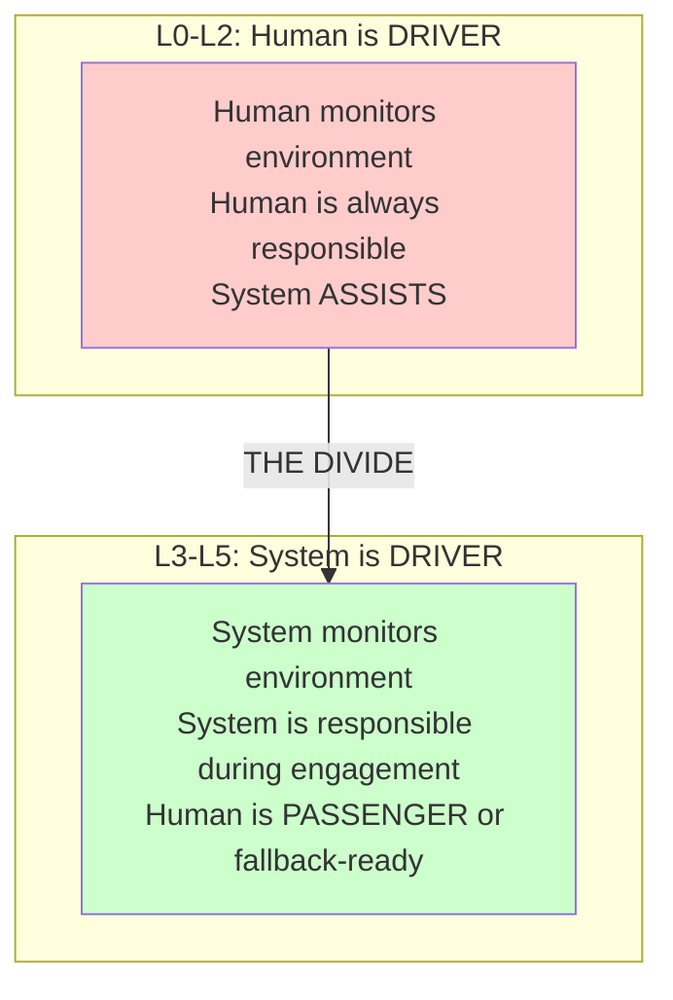
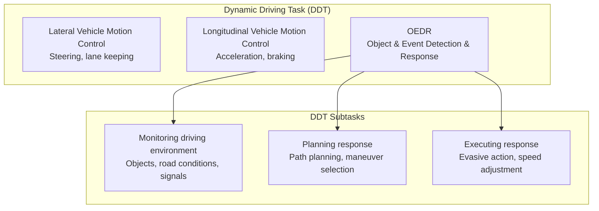
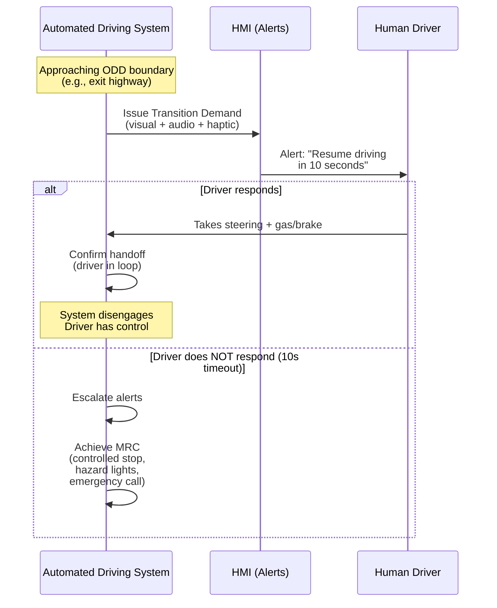
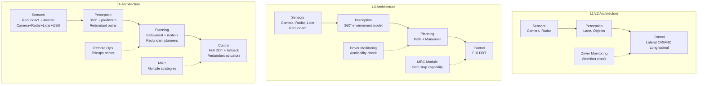
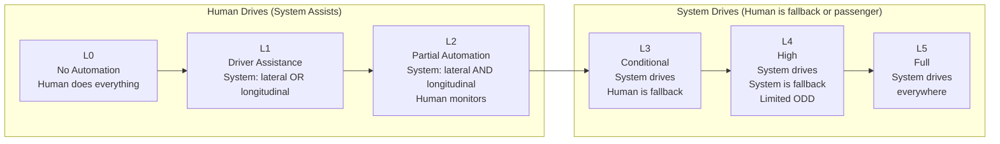
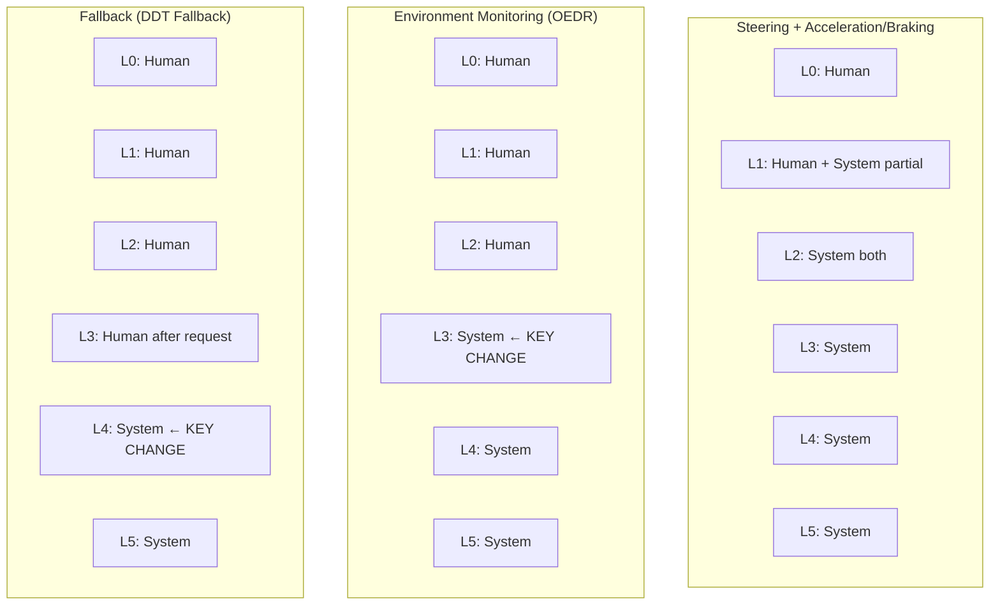
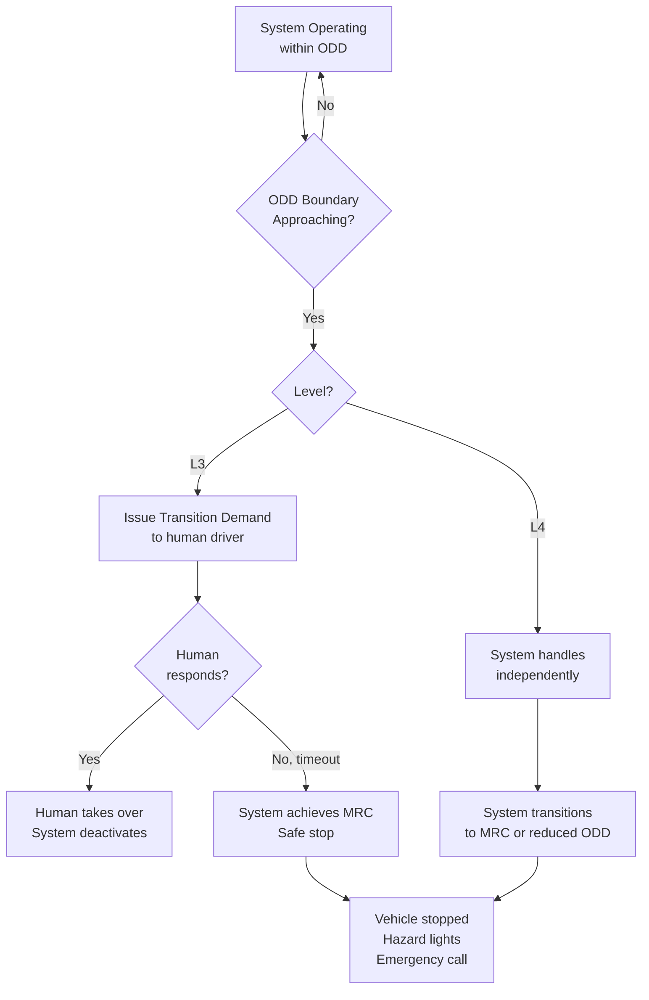

# SAE J3016 — Levels of Driving Automation

**Topic:** SAE J3016 — Taxonomy and Definitions for Terms Related to Driving Automation Systems  
**Standard:** SAE J3016_202104 (Revised April 2021)  
**SDO:** SAE International  
**Audience:** ADAS/AD system architects, product managers, regulatory affairs, safety engineers, legal/insurance professionals  
**Prerequisites:** Basic understanding of ADAS, vehicle dynamics, human-machine interface concepts

---

## Chapter 1 — Historical Context & Origin Story

### 1.1 Timeline

| Year | Event | Impact |
|------|-------|--------|
| 2004 | DARPA Grand Challenge | First autonomous vehicle race (no finishers) |
| 2005 | DARPA Grand Challenge II | Stanley (Stanford) completes 132-mile desert course |
| 2007 | DARPA Urban Challenge | Boss (CMU) navigates urban environment |
| 2009 | Google Self-Driving Car project starts | Commercial interest begins |
| 2014 | SAE J3016 first published | Taxonomy created (6 levels: L0-L5) |
| 2016 | SAE J3016 revised | Clarified DDT, OEDR, ODD terminology |
| 2018 | SAE J3016 revised | Updated fallback definitions |
| 2021 | SAE J3016 revised (current) | Refined terminology for clarity |
| 2022 | UNECE R157 (ALKS) | First international regulation using J3016 taxonomy |
| 2023 | Mercedes Drive Pilot certified L3 (Germany) | First production L3 on public roads |

### 1.2 Why a Taxonomy Was Needed

**Before J3016:**
- Marketing chaos: companies claimed "autonomous" or "self-driving" without clear meaning
- Regulatory confusion: how to write laws for different automation capabilities?
- Safety ambiguity: who is responsible at each level?
- Engineering confusion: what subsystems needed for "Level X"?

**J3016 provides:**
- Clear, unambiguous level definitions (L0-L5)
- Responsibility assignment (human vs. system)
- Common vocabulary for industry, regulators, public
- Foundation for regulations (UNECE R157, NHTSA framework)

---

## Chapter 2 — Standard Architecture & Structure

### 2.1 The Six Levels

| Level | Name | DDT Performed By | Fallback Performed By | ODD |
|-------|------|-----------------|----------------------|-----|
| **L0** | No Driving Automation | Human driver | Human driver | N/A |
| **L1** | Driver Assistance | Human + System (lateral OR longitudinal) | Human driver | Limited |
| **L2** | Partial Driving Automation | System (lateral AND longitudinal) | Human driver | Limited |
| **L3** | Conditional Driving Automation | System (full DDT) | Human driver (after request) | Limited |
| **L4** | High Driving Automation | System (full DDT) | System (achieves MRC) | Limited |
| **L5** | Full Driving Automation | System (full DDT) | System (achieves MRC) | Unlimited |

### 2.2 Key Terminology

| Term | Full Name | Definition |
|------|-----------|-----------|
| **DDT** | Dynamic Driving Task | Real-time operational/tactical functions: steering, braking, acceleration, monitoring environment |
| **OEDR** | Object and Event Detection and Response | Subtask of DDT: detecting objects/events and deciding what to do |
| **ODD** | Operational Design Domain | Specific conditions under which system designed to function |
| **DDT fallback** | — | Response to perform DDT when system can't (or transition to MRC) |
| **MRC** | Minimal Risk Condition | Low-risk condition achieved when system cannot continue DDT (e.g., safe stop) |
| **Transition of control** | — | Transfer of DDT from system to human (or vice versa) |
| **ADS** | Automated Driving System | The hardware + software that performs entire DDT (L3-L5) |
| **ADAS** | Advanced Driver Assistance System | System assisting human driver (L1-L2) |

### 2.3 The Critical L2→L3 Boundary



---

## Chapter 3 — Technical Deep Dive

### 3.1 DDT Components



### 3.2 Level-by-Level Technical Requirements

#### Level 1 — Driver Assistance

| Feature Example | System Does | Driver Does |
|-----------------|-------------|-------------|
| ACC (Adaptive Cruise Control) | Longitudinal control (speed, following) | Steering + monitoring |
| LKA (Lane Keeping Assist) | Lateral control (centering in lane) | Speed control + monitoring |

**Key constraint:** System performs EITHER lateral OR longitudinal. Never both simultaneously (that's L2).

#### Level 2 — Partial Driving Automation

| Feature Example | System Does | Driver Does |
|-----------------|-------------|-------------|
| Tesla Autopilot | Lateral + longitudinal | Monitor environment continuously |
| GM Super Cruise | Lateral + longitudinal (highway) | Monitor (driver attention camera) |
| VW Travel Assist | Lateral + longitudinal | Hands-on-wheel + monitoring |

**Key constraint:** Driver MUST monitor driving environment at all times. System may remind (DMS — Driver Monitoring System), but responsibility stays with human.

#### Level 3 — Conditional Driving Automation

| Feature Example | System Does | Driver Does |
|-----------------|-------------|-------------|
| Mercedes Drive Pilot | Full DDT including OEDR | Be receptive to transition request |
| Honda Traffic Jam Pilot | Full DDT in traffic jam | Resume control when requested |
| UNECE R157 ALKS | Full DDT < 60 km/h motorway | Take over within 10 seconds |

**Key features:**
- System monitors environment (not human)
- Human can do other tasks (read email, watch video)
- System issues "transition demand" when reaching ODD boundary
- Human must resume within defined time (e.g., 10 seconds for R157)
- If human doesn't resume → system achieves MRC (safe stop)

#### Level 4 — High Driving Automation

| Feature Example | System Does | Driver Does |
|-----------------|-------------|-------------|
| Waymo (Phoenix) | Full DDT + fallback | Nothing (passenger) |
| Cruise (San Francisco) | Full DDT + fallback | Nothing (passenger) |
| Zoox (robotaxi) | Full DDT + fallback | No driver seat |

**Key features:**
- No human fallback needed
- If system can't continue → achieves MRC on its own
- Limited ODD (specific geofenced area, conditions)
- May have no steering wheel (Zoox)

#### Level 5 — Full Driving Automation

| Feature Example | System Does | Driver Does |
|-----------------|-------------|-------------|
| (No production example yet) | Full DDT + fallback + unlimited ODD | Nothing — pure passenger |

**Key features:**
- Can drive anywhere a human can drive
- No ODD limitations
- No human intervention capability needed
- Currently theoretical / research target

### 3.3 Operational Design Domain (ODD)

| ODD Parameter | Examples |
|---------------|---------|
| Road type | Highway, urban, rural, parking lot |
| Speed range | 0-60 km/h, 0-130 km/h, unlimited |
| Weather | Clear, rain, fog, snow, ice |
| Time of day | Daytime only, day+night |
| Geographic | Specific city, mapped roads only, geofenced |
| Traffic | Free-flow, congestion, mixed traffic |
| Connectivity | V2X required, map updates needed |
| Infrastructure | Lane markings required, traffic signs visible |

### 3.4 Transition of Control (ToC)



---

## Chapter 4 — Implementation Guide

### 4.1 System Architecture by Level



### 4.2 Key Engineering Challenges by Level

| Challenge | L2 | L3 | L4/L5 |
|-----------|----|----|-------|
| Sensor redundancy | Optional | Required | Mandatory + diverse |
| Environment monitoring responsibility | Human | System | System |
| Compute redundancy | Not required | Recommended | Mandatory |
| Actuator redundancy | Not required | Required (steering, braking) | Mandatory |
| Power supply redundancy | Not required | Required | Mandatory |
| Fallback strategy | Human takes over | System stops if human fails | System handles all failures |
| Functional safety level | ASIL B typical | ASIL D | ASIL D + beyond |
| Cybersecurity | Standard (R155) | Critical | Critical + V2X |
| Map requirements | Optional | HD map (cm accuracy) | HD map + real-time update |
| V&V complexity | Standard | 10⁹+ km equivalent | 10¹¹+ km equivalent |

---

## Chapter 5 — Certification & Audit

### 5.1 Regulatory Framework Using J3016

| Regulation | Level | Region | Scope |
|-----------|-------|--------|-------|
| UNECE R157 | L3 (ALKS) | EU/Japan/Korea | Automated Lane Keeping ≤60 km/h |
| UNECE R157 (amendment) | L3 | EU | Extension to 130 km/h (lane change) |
| StVG §1a-1l (Germany) | L4 | Germany | L4 in defined areas |
| AV START Act (proposed) | L4 | US | Federal L4 framework (not enacted) |
| AV SELF DRIVE Act (proposed) | L4 | US | (Not enacted) |
| California DMV | L4 testing/deployment | California | Permits for testing + driverless |
| China regulations | L3/L4 | China | City-specific permits |

### 5.2 Safety Case Requirements by Level

| Level | Safety Standard | Key Evidence |
|-------|----------------|--------------|
| L1-L2 | ISO 26262 (ASIL B-D) | FMEA, FTA, safety analysis per feature |
| L3 | ISO 26262 + ISO 21448 (SOTIF) | Safety case for nominal + SOTIF scenarios |
| L4 | ISO 26262 + SOTIF + UL 4600 | Comprehensive safety case + field evidence |
| L3-L5 | UNECE R155/R156 | Cybersecurity of ADS, secure OTA |

---

## Chapter 6 — Regional & Domain Variants

### 6.1 Regional Regulatory Approaches

| Region | Approach | Current Status |
|--------|----------|---------------|
| EU (UNECE) | Type approval per level | R157 (L3) in force. L4 under discussion |
| Germany | National law (StVG) | L4 permitted in specific areas (2022) |
| USA (Federal) | No comprehensive regulation | NHTSA framework voluntary. State-by-state permits |
| USA (California) | Permit-based | DMV permits for testing/deployment (Waymo, Cruise) |
| USA (Arizona) | Permissive | Minimal regulation (Waymo operational) |
| China | City-by-city permits | Beijing, Shanghai, Shenzhen permits L4 testing |
| Japan | National law | L3 permitted on highways (Honda Legend 2021) |
| UK | Automated Vehicles Act (2024) | L3 framework with "user in charge" concept |

### 6.2 Domain Application of J3016

| Domain | Relevant Levels | Notes |
|--------|----------------|-------|
| Passenger cars | L1-L3 (production), L4 (pilot) | Most visible application |
| Robotaxis | L4 | Geofenced urban areas (Waymo, Cruise) |
| Trucking | L2-L4 | Highway platooning (L2), hub-to-hub (L4) |
| Last-mile delivery | L4 | Low-speed, dedicated routes |
| Mining | L4 | Fully autonomous haul trucks (Caterpillar, Komatsu) |
| Agriculture | L4 | Autonomous tractors (John Deere) |
| Shuttle/people mover | L4 | Low-speed, fixed routes |

---

## Chapter 7 — Comparison: Automation Level Standards

| Aspect | SAE J3016 | NHTSA Levels (legacy) | VDA (Germany, legacy) | ISO/TR 21564 |
|--------|----------|---------------------|----------------------|-------------|
| Levels | 0-5 | 0-4 (old mapping) | Partially automated / Highly / Fully | References J3016 |
| Adoption | De facto global standard | Deprecated (adopted J3016) | Deprecated | Academic |
| Driver role defined | Yes (clear) | Less clear | Yes | Analysis tool |
| ODD concept | Yes (explicit) | No | Partially | Yes |
| Fallback defined | Yes (explicit) | Partially | Yes | Yes |
| Legally referenced | Yes (R157, national laws) | Historical only | Historical | No |

---

## Chapter 8 — Mermaid Architecture Diagrams

### 8.1 Level Overview Visual



### 8.2 Responsibility Assignment by Level



### 8.3 ODD and Degradation Strategy



---

## Chapter 9 — Case Studies & Failure Analysis

### 9.1 Tesla Autopilot Fatalities (L2 Misuse)

**Event:** Multiple fatal crashes where Tesla Autopilot (L2) was engaged and driver was inattentive.

**J3016 analysis:**
- Tesla Autopilot = SAE Level 2 (confirmed by Tesla and NHTSA)
- At L2: human driver MUST monitor environment at ALL times
- Drivers treated it as L3+ (hands off, eyes off, even sleeping)
- Driver Monitoring System (camera) insufficient to prevent misuse

**Lessons:**
- L2→L3 boundary is the most dangerous gap
- System capability can exceed level definition (capable but not responsible)
- Consumer understanding of levels is poor
- DMS (Driver Monitoring System) critical for L2+ systems

### 9.2 Uber ATG Fatal Crash (2018, Tempe AZ)

**Event:** Uber autonomous test vehicle (operating at ~L4 development) struck pedestrian at night. Safety driver was looking at phone.

**J3016 analysis:**
- Vehicle was in development/testing (not certified L4)
- Safety driver = human fallback (effectively L3 operational concept during testing)
- Safety driver failed in fallback role (distracted)
- System detected pedestrian too late (OEDR failure)

**Lessons:**
- Testing of L4 systems with safety driver = L3 operational concept
- Human as fallback is unreliable (attention fatigue)
- Redundancy in perception (was disabled for testing)
- SOTIF analysis needed for perception edge cases

---

## Chapter 10 — Future Evolution & Industry Trends

| Trend | Impact on Automation Levels |
|-------|---------------------------|
| L3 at highway speed (130 km/h) | UNECE R157 amendment, Mercedes/BMW targeting |
| L4 robotaxis scaling | Waymo (US), Baidu (China) → regulatory framework needed |
| L2+ / L2++ marketing | Industry trying to blur L2/L3 boundary |
| Mixed autonomy traffic | L0-L4 vehicles sharing roads → interaction challenges |
| Remote operation (teleoperation) | New role: remote supervisor (fits where in J3016?) |
| L4 trucking | Aurora, TuSimple (hub-to-hub without driver) |
| Regulation harmonization | US lacks federal framework vs. EU R157 |
| Insurance and liability | Who pays: driver (L1-L2), OEM/ADS operator (L3+) |
| V2X enabling higher levels | Infrastructure support for L4/L5 (traffic signal info) |
| SAE J3016 revision | Potential L2+ sub-level or clarification |

### 10.1 The L2+ Problem

```
Marketing term: "L2+" or "L2++" or "L2.5"
Technical reality: Still L2 (human must monitor)
Consumer perception: "Almost self-driving"
Regulatory status: Not defined in J3016 (only L0-L5 exist)

Industry debate:
- Should J3016 define sub-levels?
- Should L2+ with good DMS be regulated differently?
- Does "eyes off, hands off" with 0-second takeover time = L2 or L3?
```

---

## Chapter 11 — Interview Questions & Career Guide

### Tier 1: Entry-Level (0-3 years)

**Q1:** Explain the difference between SAE Level 2 and Level 3.  
**A:** The critical difference is **who monitors the driving environment (OEDR)**: At **L2** (Partial Automation): system does both lateral and longitudinal control (steering + speed), BUT human driver must continuously monitor the road, detect hazards, and be ready to intervene immediately. Human is responsible. System is a tool. Examples: Tesla Autopilot, GM Super Cruise, VW Travel Assist. At **L3** (Conditional Automation): system does the entire DDT including OEDR — system watches the road, detects hazards, plans responses. Human does NOT need to monitor the road. Human can do other activities (phone, email). BUT human must be available as fallback — when system issues "transition demand" (approaching ODD limit), human must resume driving within defined time (e.g., 10 seconds). Examples: Mercedes Drive Pilot, Honda Traffic Jam Pilot. **Why this matters:** At L2 → liability stays with human (crash = driver's fault for not monitoring). At L3 → during system engagement, liability shifts to system/OEM (system was supposed to be monitoring). This is why L3 requires much more stringent engineering (redundant sensors, fail-operational architecture, ASIL D).

### Tier 2: Mid-Level (3-8 years)

**Q2:** How do you define the ODD for a Level 3 highway pilot system?  
**A:** ODD definition process: (1) **Functional boundaries:** road type (divided highway/motorway only), speed range (0-130 km/h OR 0-60 km/h traffic jam), lane requirements (≥2 lanes same direction, clear markings), traffic (following vehicle ahead, not lead vehicle). (2) **Environmental boundaries:** weather (dry, light rain; NOT heavy rain, snow, fog below 50m visibility), time (day + night with lighting), road surface (paved, NOT construction zones, NOT cobblestone). (3) **Geographic boundaries:** mapped roads only (HD map available and current), specific countries/regions (legal approval), geofenced exclusions (known difficult areas). (4) **Infrastructure boundaries:** lane markings quality (solid + dashed visible to camera), barrier type (physical separation from oncoming traffic required), connectivity (GPS signal required for localization). (5) **Vehicle state boundaries:** all sensors operational (no degraded mode), vehicle weight within limits, trailer not attached (changes dynamics). (6) **Validation:** each ODD boundary must be detectable by the system — if system can't detect "exiting ODD" → can't safely issue transition demand. Use sensor fusion to detect: rain (windshield wiper signal + camera), road type (GPS + map + lane detection), speed (vehicle sensors). For each boundary: define detection method, false-negative rate requirement, time budget (detect exit → issue demand → human takes over).

### Tier 3: Senior/Lead (8-15 years)

**Q3:** How do you validate an L4 ADS to a safety target of 10⁻⁸ fatalities/hour?  
**A:** This is the fundamental challenge of AD validation. Target: 10⁻⁸ fatalities/hour (10× better than average human driver). (1) **The mileage problem:** Statistical proof of 10⁻⁸ rate requires ~10⁹ hours of driving without fatality (at 95% confidence). At 25 mph average = billions of miles. Not feasible with physical testing alone. (2) **Multi-pillar validation approach:** Pillar 1: Simulation (billions of km). Generate from real-world data (replay + variation). Scenario-based testing (critical scenarios from accident databases). Adversarial testing (worst-case generation). Pillar 2: Closed course testing. Standardized test scenarios (Euro NCAP, ISO 34502). Edge cases identified in simulation. Hardware-in-loop testing. Pillar 3: Real-world testing with safety driver. Accumulate experience. Identify unknown unknowns. Collect scenario library. Pillar 4: Fleet deployment data. Actual performance monitoring (disengagement rate, near-misses). Continuous improvement from field events. (3) **Safety argument structure (per UL 4600 / ISO PAS 8800):** Claim: "ADS is acceptably safe in defined ODD." Evidence: combination of all 4 pillars. Argument: demonstrate completeness (have we tested everything relevant?) + demonstrate robustness (system handles novel situations). (4) **Key metrics:** Disengagement rate (# human interventions / mile). Miles between safety-critical events. Scenario coverage (% of ISO 34502 categories tested). Mean time between failures (MTBF) for each subsystem.

### Tier 4: Principal/Distinguished (15+ years)

**Q4:** Design the liability and insurance framework for mixed-autonomy traffic (L0 through L4 sharing roads).  
**A:** Mixed autonomy creates novel liability challenges: (1) **Current framework:** L0-L2: driver liable (existing traffic law). L3: OEM/ADS liable during engagement (new). L4: ADS operator/manufacturer liable (no driver). What happens in L2 car + L4 robotaxi collision? (2) **Proposed framework:** Event Data Recorder (EDR) mandatory for L3+: records system state, sensor data, DDT allocation at time of event. Clear determination: was ADS or human "driving" at crash time? L3: if ADS engaged + system failure → OEM liable. If human failed to respond to transition demand → human liable. L4: always ADS operator/manufacturer liable (no human driver). Multi-vehicle: liability proportional to causation (same as today but with ADS as "driver" entity). (3) **Insurance model:** L0-L2: personal auto insurance (existing). L3: hybrid — personal when human drives, product liability when ADS engaged. Need: data recording to determine which state at accident. L4: no personal auto insurance needed. Fleet insurance by operator (like commercial vehicle). Product liability insurance by OEM. (4) **Technical enablers:** Digital twinning of scenarios for accident reconstruction. Blockchain or secure logging of DDT state transitions. V2V data exchange for multi-vehicle incident reconstruction. Agreed data format for cross-OEM incident analysis. (5) **Industry implications:** Higher insurance for L3 transition period (ambiguous liability). L4 may actually reduce insurance cost (no human error). New insurance products: per-mile ADS coverage, OEM fleet policies. Standards needed: ISO/SAE working on data recording requirements.

---

## Chapter 12 — Cheat Sheet & Quick Reference

### Level Summary Table

```
L0: Human does EVERYTHING
L1: System does ONE thing (lateral OR longitudinal). Human monitors.
L2: System does BOTH (lateral AND longitudinal). Human monitors.
   ─── THE DIVIDE ───
L3: System does EVERYTHING including monitoring. Human is fallback.
L4: System does EVERYTHING including fallback. Limited ODD.
L5: System does EVERYTHING. Unlimited ODD.
```

### Key Terms Quick Reference

```
DDT    = Dynamic Driving Task (steering + speed + monitoring)
OEDR   = Object & Event Detection & Response (perceive + react)
ODD    = Operational Design Domain (where/when system works)
MRC    = Minimal Risk Condition (safe stop)
ADS    = Automated Driving System (the brain, L3-L5)
ADAS   = Advanced Driver Assistance System (the helper, L1-L2)
ToC    = Transition of Control (system → human)
DMS    = Driver Monitoring System (camera watching driver)
```

### Quick Level Identification

```
Q: Who monitors the road?
  Human → L0, L1, or L2
  System → L3, L4, or L5

Q: Can human do other things while system drives?
  No → L0, L1, L2
  Yes (but must be ready) → L3
  Yes (completely) → L4, L5

Q: What happens if system fails?
  Human must take over immediately → L2
  Human takes over after request → L3
  System handles it → L4, L5

Q: Can it drive everywhere?
  Only in specific ODD → L1-L4
  Everywhere → L5 (theoretical)
```

### Production Vehicle Examples (2024)

```
L1: Toyota Safety Sense, Honda Sensing (ACC or LKA individually)
L2: Tesla Autopilot, GM Super Cruise, Ford BlueCruise, VW Travel Assist
L3: Mercedes Drive Pilot (Germany/Nevada), BMW iX L3 (upcoming)
L4: Waymo One (Phoenix, SF), Baidu Apollo Go (China)
L5: None in production
```

---

*End of Document — 09_SAE_J3016_Autonomous_Levels.md*
