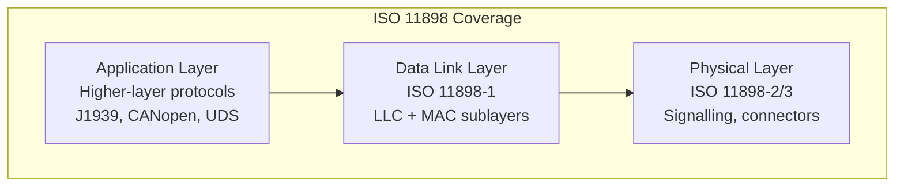
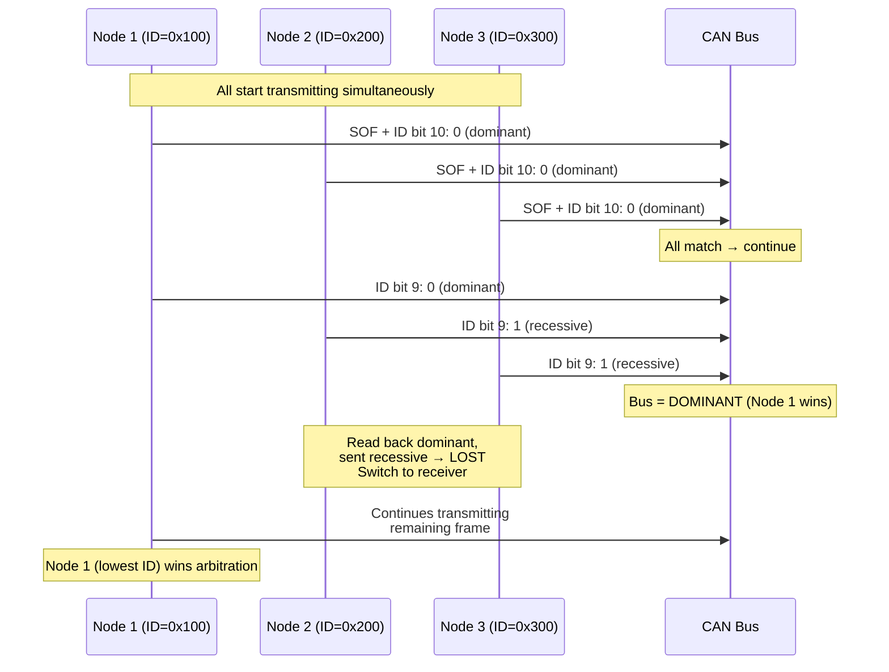
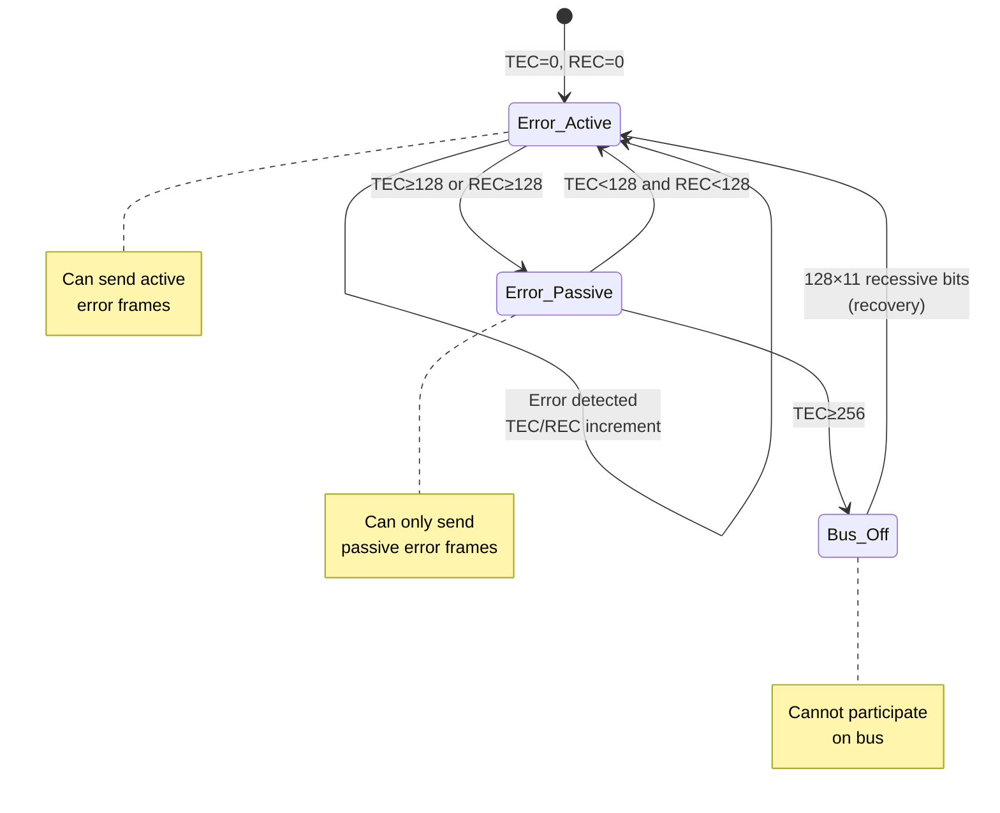
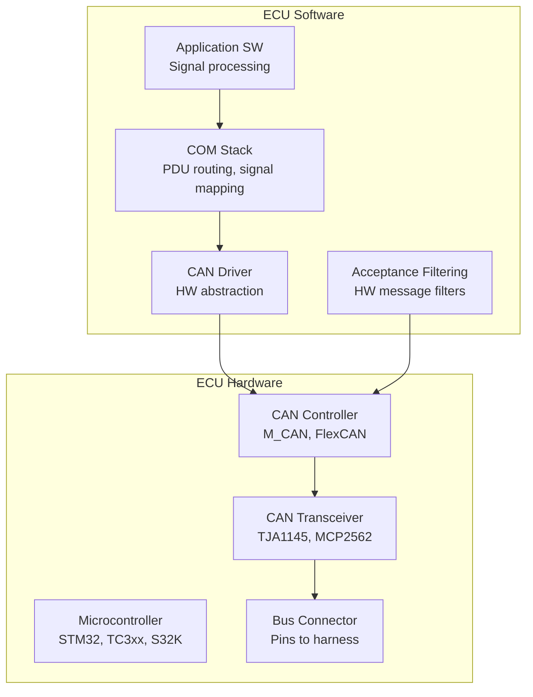
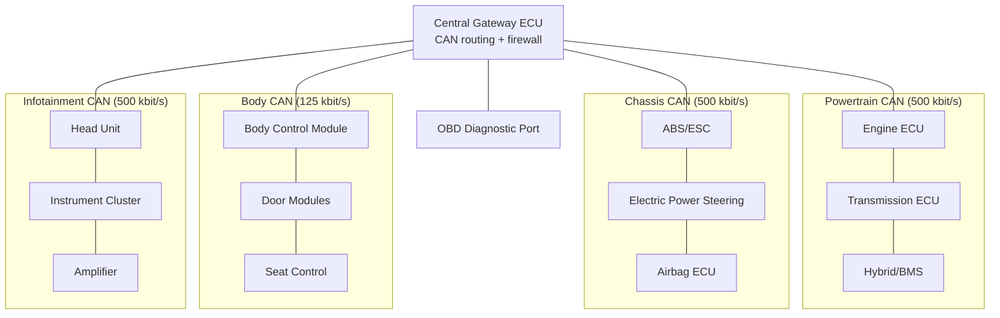
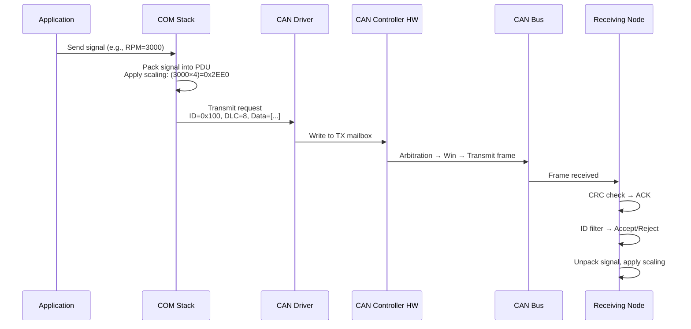
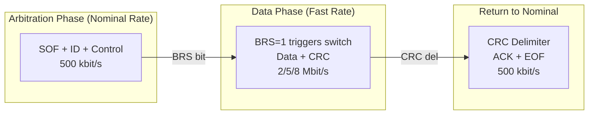

# ISO 11898 — Controller Area Network (CAN) Protocol

**Topic:** ISO 11898 — Road Vehicles — Controller Area Network (CAN)  
**Standard:** ISO 11898 (multi-part: ISO 11898-1 through 11898-6)  
**SDO:** ISO TC 22/SC 31 (Road vehicles — Communication protocols)  
**Audience:** Embedded systems engineers, automotive network architects, ECU developers, protocol stack implementers  
**Prerequisites:** Digital communication fundamentals, basic electronics, automotive E/E architecture

---

## Chapter 1 — Historical Context & Origin Story

### 1.1 Timeline

| Year | Event | Impact |
|------|-------|--------|
| 1983 | Robert Bosch GmbH begins CAN development | Response to growing wiring complexity |
| 1986 | CAN 2.0 specification published by Bosch | Industry made aware |
| 1987 | Intel 82526 — first CAN controller chip | Silicon availability |
| 1988 | Philips 82C200 standalone CAN controller | Second-source, drives adoption |
| 1991 | Mercedes-Benz S-Class (W140) | First production vehicle with CAN |
| 1993 | ISO 11898 published (data link + physical) | International standardization |
| 2003 | ISO 11898 restructured into multi-part | Clearer separation of layers |
| 2012 | CAN FD specification (Bosch) | Flexible data rate — up to 64 bytes, 8 Mbit/s |
| 2015 | ISO 11898-1:2015 | CAN FD standardized |
| 2020 | CAN XL specification published | Bridging CAN and Ethernet |
| 2023 | ISO 11898-1:2023 | CAN XL standardized |

### 1.2 Why CAN Was Created

**Problem (1980s):** German luxury cars had hundreds of ECUs connected point-to-point. A Mercedes W126 had 2 km of wiring harness weighing ~50 kg.

**CAN solution:**
- Replace point-to-point wiring with shared bus
- Multi-master (any node can transmit)
- Priority-based arbitration (no collisions, no wasted bandwidth)
- Robust error detection (CRC, bit monitoring, acknowledgment)
- Real-time capable (deterministic worst-case latency)
- Low cost per node (simple controller)

### 1.3 Market Dominance

| Metric | Value |
|--------|-------|
| Annual CAN controller shipments | ~2 billion units (2023) |
| Vehicle ECUs with CAN | 70-100+ per modern car |
| Domains using CAN | Powertrain, chassis, body, ADAS, diagnostics |
| Non-automotive CAN | Industrial automation, medical devices, aerospace, marine |

---

## Chapter 2 — Standard Architecture & Structure

### 2.1 ISO 11898 Multi-Part Structure

| Part | Title | Content |
|------|-------|---------|
| ISO 11898-1 | Data link layer and physical signalling | Frame format, arbitration, error handling, CAN FD, CAN XL |
| ISO 11898-2 | High-speed CAN (physical layer) | Differential signalling, up to 1 Mbit/s |
| ISO 11898-3 | Low-speed CAN (physical layer) | Fault-tolerant, 125 kbit/s, single-wire capable |
| ISO 11898-4 | Time-triggered CAN (TTCAN) | Time-triggered scheduling on CAN |
| ISO 11898-5 | High-speed with low-power mode | Wake-up pattern, selective wake-up |
| ISO 11898-6 | High-speed with selective wake-up | CAN transceiver wake-up capabilities |

### 2.2 OSI Layer Mapping



---

## Chapter 3 — Technical Deep Dive

### 3.1 Classical CAN (CAN 2.0B) Frame Format

```
┌─────────────────────── CAN Data Frame ───────────────────────┐

SOF│ Identifier │SRR│IDE│ Identifier │RTR│r1│r0│DLC│  Data   │ CRC    │ACK│EOF│IFS
 1 │  11 bits   │ 1 │ 1 │  18 bits   │ 1 │1 │1 │ 4 │ 0-8 B  │15+1 del│1+1│ 7 │ 3
   ├── Standard─┤   │   ├── Extended─┤
   
Standard Frame (11-bit ID): No SRR/IDE/18-bit extension
Extended Frame (29-bit ID): Full structure above

SOF = Start of Frame (dominant bit)
IDE = Identifier Extension (0=standard, 1=extended)
RTR = Remote Transmission Request
DLC = Data Length Code (0-8 bytes)
CRC = 15-bit CRC + delimiter
ACK = Acknowledge slot + delimiter
EOF = End of Frame (7 recessive bits)
IFS = Inter-Frame Space (3 bits minimum)
```

### 3.2 CAN FD (Flexible Data-Rate) Frame Format

```
Key differences from Classical CAN:
┌──────────────────────────────────────┐
│ FDF bit = 1 (CAN FD frame)          │
│ BRS bit = 1 (bit rate switch)       │
│ ESI bit (error state indicator)     │
│ DLC: 0-8, 12, 16, 20, 24, 32, 48, 64 bytes │
│ CRC: 17-bit (≤16B) or 21-bit (>16B)│
│ Stuff bit count field               │
└──────────────────────────────────────┘

Bit rate switching:
  Arbitration phase: nominal bit rate (e.g., 500 kbit/s)
  Data phase: faster bit rate (e.g., 2/5/8 Mbit/s)
  Switch happens at BRS bit, reverts at CRC delimiter
```

### 3.3 Arbitration Mechanism



**Key principle:** Lower CAN ID = Higher priority. Non-destructive bitwise arbitration — no data lost.

### 3.4 Error Detection Mechanisms

| Mechanism | Description | Coverage |
|-----------|-------------|----------|
| CRC check | 15-bit CRC polynomial | Detects bit errors in frame |
| Bit monitoring | Transmitter reads back each bit | Detects bus faults during TX |
| Bit stuffing | After 5 same bits, opposite inserted | Detects stuck-at faults |
| Frame check | Fixed format fields (EOF, delimiters) | Detects frame format errors |
| ACK check | At least one receiver must ACK | Detects nobody listening |

**Error handling state machine:**



### 3.5 Bit Timing

```
┌─────────── One Bit Time ───────────┐
│ Sync │ Prop │ Phase 1 │ Phase 2    │
│  1TQ │nTQ   │  nTQ    │  nTQ       │
└──────┴──────┴────────┴────────────┘
                    ↑
              Sample Point

TQ = Time Quantum (smallest time unit)
Bit Time = Sync + Prop + Phase1 + Phase2 = N × TQ
Baud Rate = 1 / Bit Time

Example: 500 kbit/s
  TQ = 125 ns (8 MHz clock, prescaler=1)
  Bit Time = 16 TQ = 2 µs
  Baud Rate = 1/2µs = 500 kbit/s
  Sample Point typically at 75-87.5% of bit time
```

### 3.6 CAN XL (Next Generation)

| Feature | Classical CAN | CAN FD | CAN XL |
|---------|---------------|--------|--------|
| Max data payload | 8 bytes | 64 bytes | 2048 bytes |
| Max bit rate (data) | 1 Mbit/s | 8 Mbit/s | 20 Mbit/s |
| Frame format | CAN 2.0 | FD format | XL format |
| Priority ID | 11/29-bit | 11/29-bit | 11-bit + priority field |
| Compatibility | — | Coexists with CAN 2.0 | Coexists with CAN FD |
| Use case | Legacy | Bridge (current) | Future Ethernet gateway |
| Content type | Raw bytes | Raw bytes | PDU with protocol type |
| Security support | None | None | Native (optional) |

---

## Chapter 4 — Implementation Guide

### 4.1 CAN Network Design

| Design Parameter | Typical Value | Constraint |
|-----------------|---------------|-----------|
| Bit rate | 500 kbit/s (powertrain/chassis) | Bus length dependent |
| | 125 kbit/s (body/comfort) | |
| Max nodes | 32 (electrical) | Transceiver loading |
| Max bus length | 40m @ 1 Mbit/s, 500m @ 125 kbit/s | Propagation delay |
| Termination | 120Ω at each end | Prevent signal reflection |
| Wire type | Twisted pair, shielded or unshielded | EMC performance |
| Connector | OEM-specific (automotive) or DB-9 (industrial) | Application |
| Topology | Linear bus with short stubs | Max stub length < 0.3m |

### 4.2 ECU CAN Implementation Architecture



### 4.3 Bus Load Calculation

$$\text{Bus Load} = \frac{\sum_{i=1}^{n} \frac{\text{FrameLength}_i}{\text{Period}_i}}{\text{BitRate}} \times 100\%$$

**Frame length calculation (Classical CAN, standard ID):**

$$\text{FrameLength} = 47 + 8 \times \text{DLC} + \text{StuffBits}$$

**Rule of thumb:**
- Keep bus load < 30% for real-time performance
- > 50% causes significant jitter
- > 70% may cause deadline misses

---

## Chapter 5 — Certification & Audit

### 5.1 CAN Conformance Testing

| Test Category | Standard | Description |
|---------------|----------|-------------|
| Physical layer | ISO 11898-2/3 | Voltage levels, timing, termination |
| Data link layer | ISO 16845 | Protocol conformance (bit-level) |
| Bit timing | ISO 16845 | Sample point, synchronization |
| Error handling | ISO 16845 | Error frames, state transitions |
| Interoperability | OEM test specs | Multi-vendor ECU communication |

### 5.2 Common Testing Tools

| Tool | Purpose |
|------|---------|
| Vector CANoe/CANalyzer | Protocol analysis, simulation, testing |
| PEAK PCAN | Low-cost analysis hardware |
| Kvaser Memorator | Standalone CAN logger |
| Intrepid neoVI | Multi-protocol vehicle interface |
| Oscilloscope (with CAN decode) | Physical layer analysis |
| CAN bus tester (Softing, HMS) | Physical layer compliance |

---

## Chapter 6 — Regional & Domain Variants

### 6.1 CAN in Different Domains

| Domain | Bit Rate | Application |
|--------|----------|-------------|
| Automotive — Powertrain | 500 kbit/s | Engine, transmission, ADAS |
| Automotive — Body | 125 kbit/s | Lights, windows, doors |
| Automotive — Chassis | 500 kbit/s | ABS, ESP, steering |
| Industrial (CANopen) | 125-1000 kbit/s | Factory automation |
| Medical (CANopen) | 125-250 kbit/s | Patient monitoring, imaging |
| Marine (NMEA 2000) | 250 kbit/s | Navigation, engine |
| Aerospace (CANaerospace) | 1 Mbit/s | Avionics data bus |
| Agriculture (ISOBUS) | 250 kbit/s | Tractor-implement |
| Elevator/lift | 125 kbit/s | Floor control, safety |

### 6.2 Higher-Layer Protocols on CAN

| Protocol | Standard | Domain |
|----------|----------|--------|
| SAE J1939 | SAE J1939 series | Heavy-duty vehicles |
| CANopen | CiA 301/401 | Industrial automation |
| DeviceNet | IEC 62026-3 | Factory automation |
| NMEA 2000 | NMEA 2000 | Marine |
| ISOBUS | ISO 11783 | Agriculture |
| CANaerospace | — | Aerospace |
| UDS over CAN | ISO 14229 + ISO 15765 | Vehicle diagnostics |
| OBD-II | SAE J1979 + ISO 15765-4 | Emissions diagnostics |
| XCP over CAN | ASAM XCP | Measurement/calibration |
| AUTOSAR COM | AUTOSAR | Automotive signal routing |

---

## Chapter 7 — Comparison: In-Vehicle Network Technologies

| Aspect | CAN | CAN FD | LIN | FlexRay | Automotive Ethernet |
|--------|-----|--------|-----|---------|---------------------|
| Max bit rate | 1 Mbit/s | 8 Mbit/s | 20 kbit/s | 10 Mbit/s | 10 Gbit/s |
| Payload | 8 bytes | 64 bytes | 8 bytes | 254 bytes | 1500+ bytes |
| Topology | Bus | Bus | Bus (master-slave) | Bus/Star | Star/P2P |
| Cost/node | Low | Low | Very low | High | Medium |
| Determinism | Good (priority) | Good | Excellent (scheduled) | Excellent (TDMA) | Good (TSN) |
| Wiring | Twisted pair | Twisted pair | Single wire | 2× twisted pair | Single twisted pair |
| Error detection | Excellent (5 mechanisms) | Excellent | Basic | Excellent | Standard Ethernet |
| Nodes/segment | 32 | 32 | 16 | 64 | Point-to-point |
| Use case | Control, powertrain | High-bandwidth control | Sensors, actuators | Safety-critical (legacy) | ADAS, backbone |

---

## Chapter 8 — Mermaid Architecture Diagrams

### 8.1 Modern Vehicle CAN Network Architecture



### 8.2 CAN Frame Transmission Flow



### 8.3 CAN FD Bit Rate Switching



---

## Chapter 9 — Case Studies & Failure Analysis

### 9.1 CAN Bus-Off Attack (Automotive Cybersecurity)

**Attack:** Malicious node deliberately sends error frames to force target ECU into Bus-Off state.

**Mechanism:**
1. Attacker sends dominant bits during target's recessive bit times
2. Target detects bit error → increments TEC
3. Repeated: TEC reaches 256 → Bus-Off
4. Target ECU silenced (cannot communicate)
5. If target = ABS controller → safety impact

**Countermeasures:**
- CAN IDS (Intrusion Detection System) monitoring for abnormal error rates
- Bus guardian (hardware) prevents unauthorized transmission
- SecOC (AUTOSAR) — message authentication
- Network segmentation via gateway (isolate critical domains)

### 9.2 Toyota Unintended Acceleration (CAN Signal Corruption Theory)

**Event (2009-2011):** Reports of unintended acceleration in Toyota vehicles.

**CAN-related investigation:**
- NASA/NIST investigation examined CAN bus for single-point failures
- Found: no single CAN bit-flip could cause sustained unintended acceleration
- CAN's error detection mechanisms (CRC, bit monitoring) provide protection
- 5 independent error detection mechanisms → residual error rate: < 10⁻¹¹ per frame

**Lesson:** CAN protocol's error detection is extremely robust. The real vulnerabilities are in application-level design (signal timeout handling, voter logic), not protocol-level corruption.

---

## Chapter 10 — Future Evolution & Industry Trends

| Trend | Impact on CAN |
|-------|--------------|
| Automotive Ethernet dominance | CAN moves to sub-networks, Ethernet as backbone |
| CAN XL (2048 bytes, 20 Mbit/s) | Bridges gap between CAN FD and Ethernet |
| CAN Security (ISO 11898-7 draft) | Native authentication at data link layer |
| SDV architecture | Zonal ECUs → fewer CAN nodes but CAN still on edge |
| BEV architecture | Simpler powertrain → fewer CAN nodes needed |
| ADAS bandwidth demand | CAN insufficient → Ethernet for camera/radar/lidar |
| Cost pressure | CAN remains cheapest robust bus → long tail |
| Functional safety | CAN with hardware-based error containment |
| V2X | CAN within vehicle, Ethernet/cellular for V2X |
| CAN over fiber | Optical CAN for extreme EMC environments |

### 10.1 CAN Lifespan Forecast

```
2025: CAN FD standard for new platforms
2025-2030: CAN XL introduction in premium vehicles
2030+: CAN remains for body/comfort (lowest cost)
2035+: Legacy CAN phased out (classic 500kbit/s)
2040+: CAN still present in edge nodes, agriculture, industrial
Never fully replaced: cost advantage in simple applications
```

---

## Chapter 11 — Interview Questions & Career Guide

### Tier 1: Entry-Level (0-3 years)

**Q1:** Explain CAN bus arbitration. What happens when two nodes transmit simultaneously?  
**A:** CAN uses CSMA/CD+AMP (Carrier Sense Multiple Access / Collision Detection + Arbitration on Message Priority). When two nodes start transmitting simultaneously: (1) Both send SOF (Start of Frame) — dominant bit — no conflict yet. (2) Both send their identifier bits one at a time. After each bit, both nodes READ the bus state. (3) If a node sends RECESSIVE (logical 1) but reads DOMINANT (logical 0) on the bus → another node sent dominant → this node LOST arbitration. (4) Losing node immediately stops transmitting and becomes a receiver for the winning frame. (5) Winning node (sent all dominant bits or had dominant earlier in ID) continues transmitting its frame uninterrupted. (6) No data is lost, no time is wasted (non-destructive arbitration). (7) Lower ID number = more dominant bits = HIGHER priority. Result: highest-priority message always wins, no frame corruption, no retry needed for winner.

### Tier 2: Mid-Level (3-8 years)

**Q2:** Calculate whether a CAN bus can meet real-time requirements for a given message set.  
**A:** Worst-case response time analysis for CAN: Given message set: Message A (ID=0x100, 8 bytes, period=10ms), Message B (ID=0x200, 8 bytes, period=20ms), Message C (ID=0x300, 4 bytes, period=50ms). Bus: 500 kbit/s. (1) **Frame length:** Standard ID, 8-byte data: 44 + 8×8 = 108 bits + stuff bits. Worst case stuff bits ≈ 108/4 = 27. Total: ~135 bits. Frame time: 135/500000 = 0.27 ms. (2) **Worst-case response time for Message C (lowest priority):** Must wait for: one instance of every higher-priority message. Worst case = just missed Message A + Message B. Response time (C) = Frame(A) + Frame(B) + Frame(C) = 0.27 + 0.27 + 0.27 = 0.81 ms. This is << 50ms period → C meets its deadline easily. (3) **Bus load:** Load = Σ(frame_time / period) = 0.27/10 + 0.27/20 + 0.27/50 = 0.027 + 0.0135 + 0.0054 = 0.046 = 4.6%. With 50+ messages, need systematic analysis (response time analysis per Tindell/Burns method). (4) **Rule:** If all messages meet deadline under worst-case blocking → schedule is feasible.

### Tier 3: Senior/Lead (8-15 years)

**Q3:** Design CAN network architecture for a new BEV platform with ADAS, considering CAN FD migration strategy.  
**A:** (1) **Domain analysis:** Safety-critical (ADAS, chassis): need lowest latency, highest reliability. Powertrain (BMS, inverter, motor): high data rate (cell voltages = many signals). Body (doors, lights, HVAC): low speed, many nodes, cost-sensitive. Diagnostics: OBD-II mandatory access point. (2) **Network partitioning:** ADAS domain: CAN FD at 2 Mbit/s data phase (radar/USS objects). Powertrain: CAN FD at 2 Mbit/s (BMS cell data: 96 cells × 2 bytes = 192 bytes → needs CAN FD multi-frame). Chassis: CAN FD at 2 Mbit/s (ESP, steering, braking — safety). Body: Classical CAN at 500 kbit/s (cost-sensitive nodes, LIN sub-buses). Central gateway: routes between all domains + firewall + OBD interface. (3) **CAN FD migration strategy:** Step 1: All new ECUs support CAN FD (hardware capable even if initially operating as classical CAN). Step 2: Domains with bandwidth need switch to CAN FD in SOP. Step 3: Secure gateway filters CAN FD ↔ classical CAN translation. Step 4: Body domain remains classical CAN for 5+ years (cost). (4) **Security architecture:** SecOC (AUTOSAR) on safety-critical messages (torque request, brake command). Gateway as firewall: reject unauthorized message patterns. IDS module monitors all buses for anomalies. ADAS domain physically isolated (no path from body/infotainment without gateway). OBD port: security access (UDS 0x27/0x29) for sensitive functions. (5) **Redundancy:** Dual CAN for steering (ISO 26262 ASIL D — single bus = single point of failure). Dual CAN for braking (brake-by-wire needs redundant communication path).

### Tier 4: Principal/Distinguished (15+ years)

**Q4:** CAN has been dominant for 30 years. Evaluate whether CAN XL, TSN Ethernet, or a hybrid will define the next 15 years.  
**A:** (1) **CAN XL value proposition:** 2048 bytes @ 20 Mbit/s. Compatible with existing CAN infrastructure (same physical layer possible). Easier migration from CAN FD (same tools, same mindset). Can carry Ethernet-like payloads (IP-over-CAN-XL). Sweet spot: where Ethernet is overkill but CAN FD is insufficient. (2) **TSN Ethernet value proposition:** 100BASE-T1 / 1000BASE-T1, single unshielded pair. 100 Mbit/s to 10 Gbit/s. Service-oriented communication (SOME/IP). Massive bandwidth for ADAS data (camera streams). IT convergence (same protocol as cloud/enterprise). TSN provides determinism (IEEE 802.1Qbv time-aware shaping). (3) **Hybrid architecture (likely winner):** Central compute (HPC): Ethernet backbone (10G between HPCs). ADAS zone: Ethernet (100BASE-T1) for camera/radar data. Chassis/powertrain: CAN FD or CAN XL (proven, low-latency, simple). Body/comfort: CAN + LIN (lowest cost nodes). Gateway/bridge: translates between Ethernet and CAN. (4) **Economics:** CAN transceiver: $0.50. Ethernet PHY: $3-5. For nodes that transmit 8 bytes every 10ms → CAN is 6-10× cheaper per node. Multiply by 50+ body nodes = significant BOM difference. (5) **Transition timeline:** 2024-2028: CAN FD dominant for control. Ethernet for ADAS/backbone. 2028-2032: CAN XL enters for medium-bandwidth applications. Ethernet expands. 2032-2040: Zonal architecture — Ethernet backbone + CAN XL/FD for zone sub-buses. Beyond 2040: CAN still exists in simple actuator nodes, agricultural implements, industrial. (6) **Conclusion:** Pure Ethernet everywhere is theoretically possible but economically suboptimal. CAN's simplicity, robustness, and cost will keep it relevant in low-bandwidth edge nodes for another 20+ years. The vehicle backbone will be Ethernet. The architecture is heterogeneous.

---

## Chapter 12 — Cheat Sheet & Quick Reference

### CAN Physical Layer Quick Reference

```
High-speed CAN (ISO 11898-2):
  Bit rates: up to 1 Mbit/s (classic), 8 Mbit/s (FD data phase)
  Dominant: CAN_H=3.5V, CAN_L=1.5V (differential = 2V)
  Recessive: CAN_H=2.5V, CAN_L=2.5V (differential = 0V)
  Termination: 120Ω at each bus end
  Max bus length: ~40m @ 1 Mbit/s

Low-speed CAN (ISO 11898-3):
  Bit rate: up to 125 kbit/s
  Fault-tolerant (single-wire operation possible)
  No termination resistors needed
```

### CAN Frame Key Values

```
Standard frame overhead: 47 bits (+ stuff bits)
Extended frame overhead: 67 bits (+ stuff bits)
Stuff bit rule: after 5 identical bits → 1 opposite
Max stuff bits ≈ frame_length / 4
Minimum interframe space: 3 bits

CAN FD DLC encoding:
  DLC 0-8:  data bytes = DLC value
  DLC 9:  12 bytes
  DLC 10: 16 bytes
  DLC 11: 20 bytes
  DLC 12: 24 bytes
  DLC 13: 32 bytes
  DLC 14: 48 bytes
  DLC 15: 64 bytes
```

### Error Counter Rules

```
TEC (Transmit Error Counter):
  +8  on transmit error
  -1  on successful transmit

REC (Receive Error Counter):
  +1  on receive error (usually)
  +8  on certain errors
  -1  on successful receive (if REC > 0)

States:
  Error Active:  TEC < 128 AND REC < 128
  Error Passive: TEC ≥ 128 OR  REC ≥ 128
  Bus Off:       TEC ≥ 256
  Recovery:      128 × 11 recessive bits → Active
```

### Bit Timing Configuration (500 kbit/s example)

```
Clock: 80 MHz
Prescaler: 10 → TQ = 125 ns
Bit time: 16 TQ = 2 µs → 500 kbit/s

Segments:
  Sync:    1 TQ
  Prop:    5 TQ
  Phase 1: 5 TQ  
  Phase 2: 5 TQ
  SJW:     4 TQ (synchronization jump width)

Sample point: (1+5+5)/16 = 68.75%
Recommended: 75-87.5% for automotive
```

---

*End of Document — 10_ISO_11898_CAN_Protocol.md*
