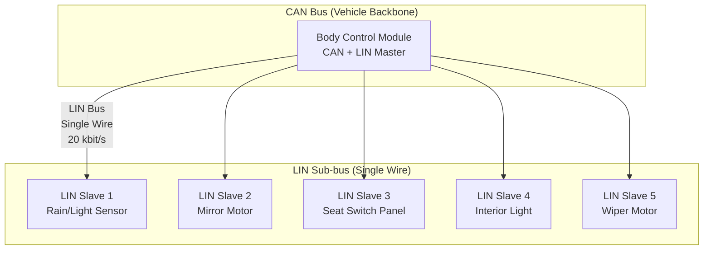
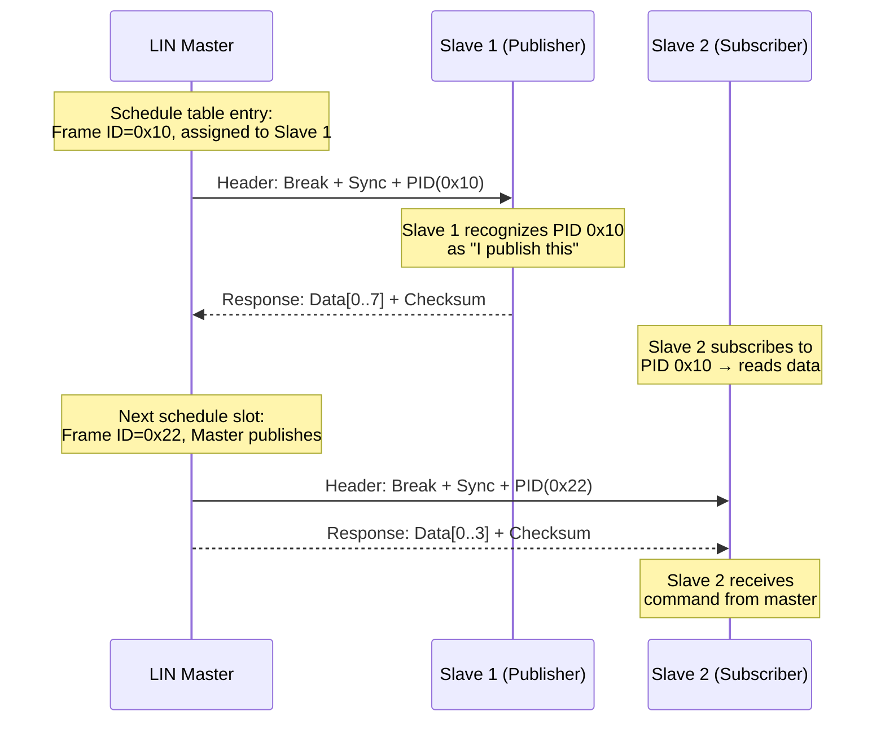
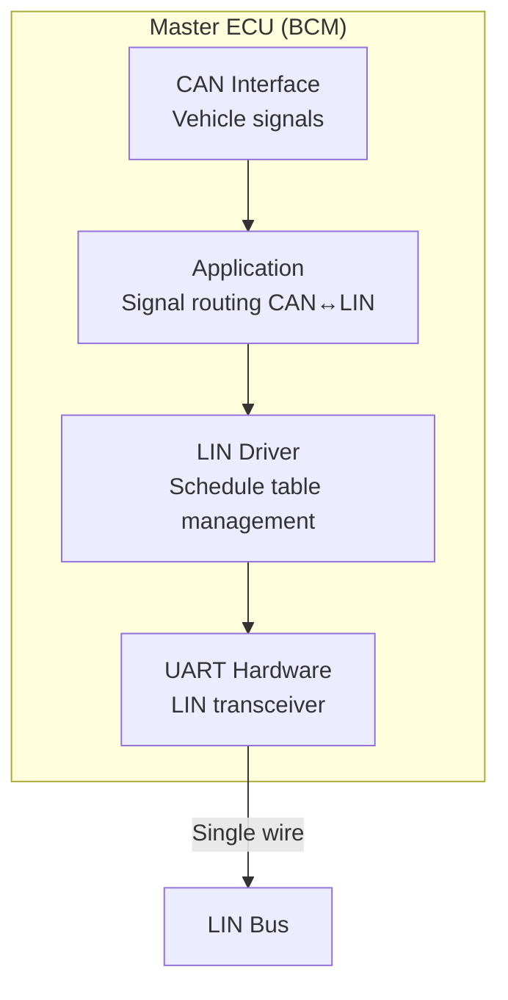
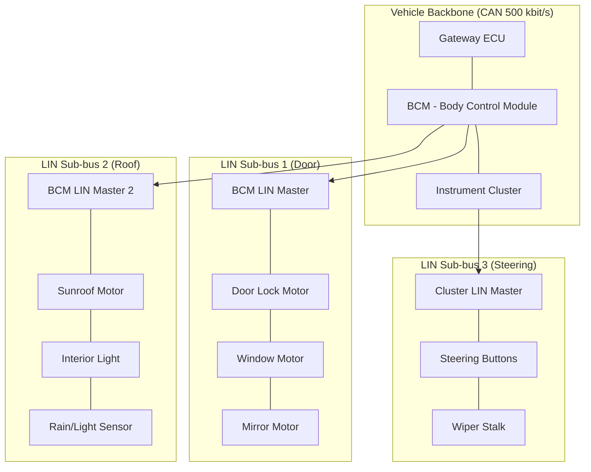
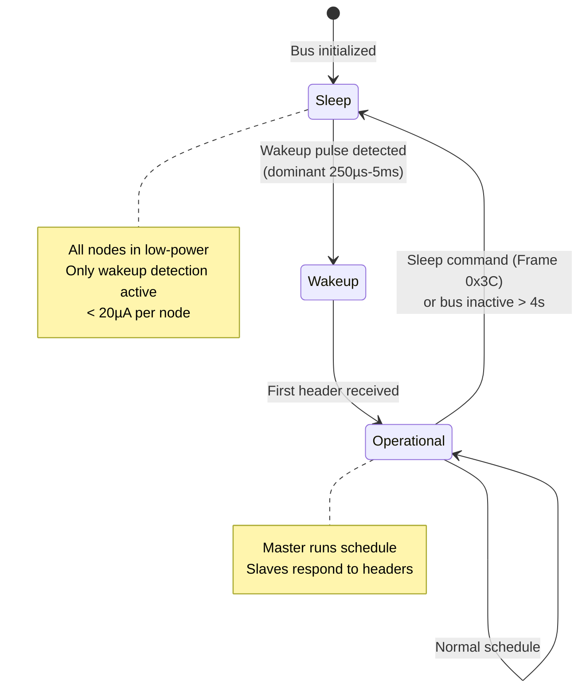

# LIN Bus — ISO 17987 Local Interconnect Network

**Topic:** LIN (Local Interconnect Network) — ISO 17987  
**Standard:** ISO 17987 (Parts 1-7), formerly LIN Specification 2.2A  
**SDO:** ISO TC 22/SC 31 / LIN Consortium (originally)  
**Audience:** Body electronics engineers, ECU developers, automotive network architects, sensor/actuator designers  
**Prerequisites:** Basic digital communication, CAN bus concepts, automotive E/E architecture

---

## Chapter 1 — Historical Context & Origin Story

### 1.1 Timeline

| Year | Event | Impact |
|------|-------|--------|
| 1998 | LIN Consortium founded (Audi, BMW, Daimler, Motorola, VCT, Volvo) | Industry collaboration |
| 1999 | LIN 1.0 specification published | Initial standard |
| 2000 | LIN 1.1 — improved diagnostics | First refinement |
| 2002 | LIN 1.3 — enhanced specification | Broader adoption |
| 2003 | LIN 2.0 — major update (transport layer, configuration) | Production-ready |
| 2006 | LIN 2.1 — diagnostics enhanced | Aligned with UDS |
| 2010 | LIN 2.2A — final consortium version | Mature standard |
| 2016 | ISO 17987 published | International standardization |
| 2020+ | LIN over flexible data rate (investigation) | Future extension |

### 1.2 Why LIN Was Created

**Problem:** CAN is over-specified for simple sensors/actuators (rain sensor, seat switch, mirror control).

| CAN Node | LIN Node |
|----------|----------|
| CAN controller IC required (~$2-5) | UART-based (integrated in MCU, ~$0.50) |
| Twisted pair wiring | Single wire + ground |
| Complex protocol stack | Simple master-slave |
| Crystal oscillator required | RC oscillator (syncs to master) |
| Overkill for 1-2 byte sensors | Perfect for low-bandwidth signals |

**LIN fills the gap:** Sub-network bus for smart sensors/actuators connected to a CAN-attached master node.

---

## Chapter 2 — Standard Architecture & Structure

### 2.1 ISO 17987 Multi-Part Structure

| Part | Title | Content |
|------|-------|---------|
| ISO 17987-1 | General information and use case definition | Overview, terminology |
| ISO 17987-2 | Transport protocol and network layer | Diagnostics transport |
| ISO 17987-3 | Protocol specification | Frame structure, timing, API |
| ISO 17987-4 | Electrical physical layer (12V) | Single-wire physical layer |
| ISO 17987-5 | Conformance test specification | Testing methodology |
| ISO 17987-6 | Protocol specification — Classic frames | LIN 2.x compatibility |
| ISO 17987-7 | Electrical physical layer (24V) | Truck applications |

### 2.2 LIN Bus Topology



**Key characteristics:**
- Single master, up to 16 slaves
- Master always initiates communication (time-triggered polling)
- Single wire + ground (lowest cost wiring)
- 20 kbit/s maximum bit rate (19.2 kbit/s typical)
- No arbitration needed (master controls schedule)

---

## Chapter 3 — Technical Deep Dive

### 3.1 LIN Frame Structure

```
┌─────────── LIN Frame ───────────┐
│   Header (Master)   │  Response (Slave)  │
├─────────────────────┼────────────────────┤
│ Break │ Sync │ PID  │ Data(1-8B) │ Chksum│
│13+1bit│ 8bit │ 8bit │  8-64 bits │ 8 bit │
└───────┴──────┴──────┴────────────┴───────┘

Break:    ≥13 dominant bits + 1 delimiter (bus attention signal)
Sync:     0x55 (alternating pattern for slave clock sync)
PID:      6-bit Frame ID + 2 parity bits
Data:     1-8 bytes (slave publishes or consumes)
Checksum: Classic (data only) or Enhanced (PID + data)
```

### 3.2 Protected Identifier (PID)

```
PID byte: [P1][P0][ID5][ID4][ID3][ID2][ID1][ID0]

Frame ID (6 bits): 0-63
  0-59:   Signal-carrying frames (normal data)
  60 (0x3C): Master Request Frame (diagnostics)
  61 (0x3D): Slave Response Frame (diagnostics)
  62 (0x3E): Reserved (user-defined)
  63 (0x3F): Reserved (user-defined)

Parity:
  P0 = ID0 ⊕ ID1 ⊕ ID2 ⊕ ID4
  P1 = ¬(ID1 ⊕ ID3 ⊕ ID4 ⊕ ID5)
```

### 3.3 Communication Model



### 3.4 Schedule Table

| Slot | Frame ID | Publisher | Period | Data |
|------|----------|-----------|--------|------|
| 1 | 0x10 | Slave 1 (rain sensor) | 100 ms | 2 bytes (rain intensity + light) |
| 2 | 0x22 | Master (BCM) | 100 ms | 1 byte (wiper command) |
| 3 | 0x15 | Slave 3 (seat switch) | 50 ms | 4 bytes (switch states) |
| 4 | 0x30 | Slave 4 (mirror) | 200 ms | 2 bytes (position feedback) |
| 5 | 0x25 | Master (BCM) | 200 ms | 2 bytes (mirror command) |

**Schedule types:**
- **Unconditional:** Fixed schedule, always executes
- **Event-triggered:** Multiple slaves share slot; respond only if data changed
- **Sporadic:** Master publishes only when data updated (slot reused otherwise)

### 3.5 Synchronization (Slave Clock Tolerance)

```
Master sends Sync byte: 0x55 = 01010101 binary

Slave measures time between falling edges:
  ┌──┐  ┌──┐  ┌──┐  ┌──┐
  │  │  │  │  │  │  │  │
──┘  └──┘  └──┘  └──┘  └──

Slave calculates bit time from Sync field.
Slave's internal RC oscillator drifts → corrected every frame.

Tolerance requirement:
  Master clock: ±0.5% (crystal)
  Slave clock: ±14% before sync (RC oscillator OK)
  Slave clock: ±2% after sync (corrected)
```

### 3.6 Diagnostics (Transport Layer)

LIN diagnostics uses frames 0x3C (master request) and 0x3D (slave response):

| Byte | Content (Master Request 0x3C) |
|------|------------------------------|
| 0 | NAD (Node Address for Diagnostics) |
| 1 | PCI (Protocol Control Information) |
| 2-7 | Diagnostic data (SID + parameters) |

**Supports:**
- Node configuration (assign NAD, frame IDs)
- Read by Identifier
- UDS-over-LIN (transport protocol for multi-frame)
- Conditional change NAD

---

## Chapter 4 — Implementation Guide

### 4.1 LIN Master Implementation



**Master responsibilities:**
- Generate break + sync + PID (header)
- Execute schedule table (time-triggered)
- Provide response for master-published frames
- Route signals between CAN and LIN
- Handle diagnostics (NAD management)
- Detect communication errors (no response, checksum error)

### 4.2 LIN Slave Implementation

| Component | Requirement |
|-----------|-------------|
| MCU | Low-cost (8-bit OK), UART with break detection |
| Oscillator | Internal RC (~±10-15%) — synchronized via sync byte |
| LIN transceiver | Single-wire transceiver (TJA1020, MCP2003) |
| Software | PID recognition, response generation, checksum |
| Memory | Minimal — schedule in master, slave just responds |

### 4.3 LIN Node Configuration File (LDF/NCF)

**LDF (LIN Description File):** Defines entire LIN cluster:

```
LIN_description_file;
LIN_protocol_version = "2.1";
LIN_language_version = "2.1";
LIN_speed = 19.2 kbps;

Nodes {
  Master: BCM, 5 ms, 0.1 ms;
  Slaves: RainSensor, MirrorMotor, SeatSwitch;
}

Frames {
  RainData: 0x10, RainSensor, 2 {
    rain_intensity, 0, 8;
    light_level, 8, 8;
  }
  WiperCmd: 0x22, BCM, 1 {
    wiper_speed, 0, 4;
    wiper_mode, 4, 4;
  }
}

Schedule_tables {
  MainSchedule {
    RainData delay 10 ms;
    WiperCmd delay 10 ms;
    SeatData delay 10 ms;
  }
}
```

---

## Chapter 5 — Certification & Audit

### 5.1 LIN Conformance Testing (ISO 17987-5)

| Test Category | What is Verified |
|---------------|-----------------|
| Physical layer | Voltage levels, slew rate, wakeup pulse |
| Timing | Bit rate, break length, response delay |
| Protocol | Header/response format, checksum |
| Synchronization | Slave sync accuracy after sync byte |
| Diagnostics | Transport layer, NAD handling |
| Schedule table | Timing accuracy, slot assignment |

### 5.2 Testing Tools

| Tool | Purpose |
|------|---------|
| Vector CANoe (LIN option) | Full LIN simulation and analysis |
| LIN Tester from Lipowsky | Physical layer compliance |
| Peak PLIN | USB-LIN interface for development |
| NXP LIN analyzer | Low-cost development tool |
| Oscilloscope | Physical layer signal quality |

---

## Chapter 6 — Regional & Domain Variants

### 6.1 LIN Applications by Domain

| Application | Typical LIN Signals | Nodes |
|-------------|--------------------|----|
| Rain/light sensor | Rain intensity, ambient light, tunnel detection | 1 |
| Power mirrors | Position X/Y, fold command, heating | 1-2 |
| Seat control | Switch positions (12+ switches per seat) | 2-4 |
| Climate control | Temperature dial, fan speed, zone select | 1-2 |
| Steering wheel | Buttons, paddle shifters, heating | 1-2 |
| Roof/sunroof | Position, pinch protection status | 1 |
| Door modules | Lock, window, child lock, lighting | 4 |
| Wiper system | Speed control, washer, park position | 1 |
| Battery sensor (IBS) | Voltage, current, temperature, SOC | 1 |

### 6.2 12V vs 24V LIN

| Parameter | 12V (ISO 17987-4) | 24V (ISO 17987-7) |
|-----------|-------------------|-------------------|
| Application | Passenger vehicles | Trucks, buses |
| Supply voltage | 8-18V | 16-32V |
| Bus voltage | 0V (dominant) / Vbat (recessive) | 0V / Vbat |
| Transceiver | Standard automotive (TJA1020) | 24V variant (TJA1027) |

---

## Chapter 7 — Comparison: LIN vs. Other Low-Speed Protocols

| Aspect | LIN | CAN | SENT (SAE J2716) | PSI5 | SPI |
|--------|-----|-----|------------------|------|-----|
| Topology | Bus (master-slave) | Bus (multi-master) | Point-to-point | Point-to-point | Point-to-point |
| Wires | 1 + GND | 2 (diff pair) | 1 + GND | 1 + GND (powered) | 4 (CLK, MOSI, MISO, CS) |
| Speed | 20 kbit/s | 1 Mbit/s | ~30 kbit/s (tick) | 189 kbit/s | MHz range |
| Nodes | 1 master + 16 slaves | 32 | 1:1 | 1:1 (or chained) | 1 master + N (CS lines) |
| Cost/node | Very low | Low | Lowest (sensor only) | Low | Lowest (chip-to-chip) |
| Use case | Body actuators, switches | Control networks | Sensor output (position, pressure) | Sensor output (current loop) | On-PCB communication |
| Diagnostics | Yes (UDS-over-LIN) | Yes (UDS) | No | Limited | No |
| Standardized | ISO 17987 | ISO 11898 | SAE J2716 | PSI5 consortium | De facto |

---

## Chapter 8 — Mermaid Architecture Diagrams

### 8.1 LIN in Vehicle Network Hierarchy



### 8.2 LIN Frame Timing

```mermaid
gantt
    title LIN Schedule Table Execution (100ms cycle)
    dateFormat X
    axisFormat %L ms
    
    section Master Header
    Break+Sync+PID(0x10) : 0, 2
    Break+Sync+PID(0x22) : 12, 2
    Break+Sync+PID(0x15) : 24, 2
    Break+Sync+PID(0x30) : 36, 2
    
    section Slave Response
    Rain Sensor Data : 2, 4
    Wiper Command (Master TX) : 14, 3
    Seat Switch Data : 26, 5
    Mirror Position : 38, 4
```



### 8.3 LIN Wakeup and Sleep



---

## Chapter 9 — Case Studies & Failure Analysis

### 9.1 LIN Rain Sensor Communication Failure

**Symptom:** Automatic wipers intermittently don't respond to rain.

**Root cause investigation:**
1. BCM (master) sends header for rain sensor frame (PID 0x10)
2. Rain sensor (slave) should respond with intensity data
3. Intermittently: no response within response_timeout

**Diagnosis:**
- Oscilloscope shows sync byte received by sensor
- Sensor's RC oscillator drifts too far between frames (temperature extreme: -40°C)
- Synchronization fails → slave misinterprets PID bits → doesn't respond

**Fix:**
- Sensor firmware: reduce max allowed clock deviation per sync
- Hardware: add crystal oscillator (higher cost) or better RC trim
- System: add retry logic in master (re-send header after timeout)

### 9.2 LIN Bus EMC Issue (Wiring Routing)

**Problem:** LIN communication errors near ignition coils (engine compartment).

**Root cause:** LIN single-wire is susceptible to EMI (no differential signaling like CAN).

**Solution:**
- Route LIN wiring away from high-current/high-frequency sources
- Add common-mode choke on LIN line at ECU entry
- Keep LIN bus runs < 40m (reduced antenna effect)
- Ensure proper ground connection (ground offset between nodes)

---

## Chapter 10 — Future Evolution & Industry Trends

| Trend | LIN Impact |
|-------|-----------|
| Zonal architecture | LIN remains for lowest-cost sensors within zones |
| LIN over CAN FD? | Some discussing higher-layer migration (CAN FD replaces LIN for some) |
| Smart sensors | More intelligence in sensor → may need more bandwidth |
| Cost pressure BEV | BEV simpler body → fewer LIN nodes but still used |
| Cybersecurity (R155) | LIN not directly connected externally but part of attack surface via master |
| Wireless sensors | Some LIN sensors may go wireless (BLE) — niche |
| 48V systems | New LIN transceiver variants for 48V mild-hybrid |
| Standardization complete | ISO 17987 is mature — minimal changes expected |

---

## Chapter 11 — Interview Questions & Career Guide

### Tier 1: Entry-Level (0-3 years)

**Q1:** What is LIN bus and why is it used instead of CAN for some applications?  
**A:** LIN (Local Interconnect Network) is a low-cost, low-speed serial communication bus used as a sub-network in vehicles. Key characteristics: single wire + ground (vs. CAN's twisted pair), master-slave architecture (vs. CAN's multi-master), 20 kbit/s maximum (vs. CAN's 1 Mbit/s), slave nodes can use internal RC oscillator (no crystal needed — syncs from master's sync byte). **Why used instead of CAN:** Cost. For simple devices like rain sensors, mirror motors, seat switches — CAN is overkill. A LIN slave IC costs ~$0.50 vs $2-5 for CAN controller. Wiring is cheaper (1 wire vs. 2). MCU can be simpler (8-bit with UART sufficient). Perfect for sensors/actuators that send 1-8 bytes at 50-200ms intervals. **Typical use:** Body domain sub-network. BCM (Body Control Module) is LIN master and CAN node simultaneously — bridges signals between LIN slaves and rest of vehicle.

### Tier 2: Mid-Level (3-8 years)

**Q2:** Design a LIN cluster for a power seat with 12 adjustment motors, position memory, heating, and ventilation.  
**A:** Requirements analysis: 12 motors (each: forward/back, up/down, tilt, lumbar, headrest, thigh), 2 heating zones, ventilation fan, position memory (store/recall), occupant detection. (1) **Node architecture:** Node 1 (Switch panel): reads 12+ switch positions + memory buttons. Publishes switch state as 4-byte frame every 50ms. Node 2 (Motor driver front): controls 6 motors (H-bridge). Subscribes to commands, publishes position feedback. Node 3 (Motor driver rear): controls 6 motors. Same as Node 2. Node 4 (Climate): heating elements + ventilation fan. Subscribes to commands from master. Master: BCM or dedicated seat ECU (CAN-connected). Stores memory positions, manages safety (anti-pinch). (2) **Frame design:** Frame 0x10 (Switch→Master): 4 bytes — switch states bitmapped, 50ms. Frame 0x20 (Master→Motor1): 3 bytes — motor commands (direction + speed), 20ms. Frame 0x21 (Master→Motor2): 3 bytes, 20ms. Frame 0x30 (Motor1→Master): 4 bytes — position feedback, 100ms. Frame 0x31 (Motor2→Master): 4 bytes, 100ms. Frame 0x40 (Master→Climate): 2 bytes — heat level + fan speed, 200ms. (3) **Schedule:** 20ms base period. Total frame time budget: 6 frames × ~5ms each = 30ms. Fits in 50ms cycle with margin. Prioritize motor commands (20ms) over feedback (100ms).

### Tier 3: Senior/Lead (8-15 years)

**Q3:** How do you handle diagnostics and production end-of-line programming for LIN slaves?  
**A:** LIN diagnostics uses frames 0x3C/0x3D (master request/slave response): (1) **Node identification:** Each slave has NAD (Node Address for Diagnostics, 1-127). Initial NAD assigned in LDF. Factory default NAD: configurable via "Assign NAD" service. (2) **End-of-line programming:** Step 1: Production tester connects as LIN master. Step 2: "Assign NAD" command to set unique address per node position. Step 3: "Assign Frame ID" to configure which frames this node publishes/subscribes. Step 4: Verify via "Read by Identifier" (product ID, serial number). Step 5: Write calibration data if needed (e.g., sensor trim values). (3) **Field diagnostics (UDS-over-LIN):** Transport protocol (ISO 17987-2) enables multi-frame diagnostic messages. Master routes UDS request from CAN-based tester to specific LIN slave via 0x3C. Slave responds via 0x3D. Supported services: ReadDataByIdentifier, WriteDataByIdentifier, IOControlByIdentifier. (4) **Challenges:** Addressing: multiple slaves may have same initial NAD (from same manufacturer). Solution: use "Conditional Change NAD" based on supplier ID + function ID. Bus sharing: diagnostic frames share bus with normal schedule → master inserts diagnostic slots between normal frames (interleaved). No security: LIN has no authentication → any master can reprogram slaves → physical security important.

### Tier 4: Principal/Distinguished (15+ years)

**Q4:** Evaluate whether LIN will survive in zonal E/E architectures or be replaced by CAN FD/Ethernet edge nodes.  
**A:** Analysis: (1) **Zonal architecture impact:** Traditional: domain-based (BCM → LIN slaves for body). Zonal: zone ECU in each physical zone (front-left, rear-right, etc.) → very short LIN runs. Zone ECU is Ethernet-connected to central computer → LIN remains as last-mile to dumb actuators. (2) **Cost argument (strongest for LIN survival):** Simple actuator (door lock motor): needs receive 1 bit (lock/unlock) + send 1 bit (status). CAN FD node cost: $3-5 (transceiver + controller + crystal). LIN node cost: $0.50-1.00 (transceiver + UART in existing MCU). Per vehicle with 40+ such nodes: $100-200 cost difference. At 10 million vehicles/year: $1-2 billion industry cost impact. This economics ensures LIN survival. (3) **Where LIN gets replaced:** Sensors needing higher bandwidth (camera, radar — already Ethernet). Sensors needing faster response (safety-critical — CAN/CAN FD). Applications where wiring reduction via wireless (BLE) makes sense. (4) **Where LIN stays:** Motor control (mirrors, seats, windows — low data, many nodes). Switch panels (< 8 bytes per 50ms sufficient). LED drivers (sequential turn signals). Simple sensors (temperature, pressure). (5) **Conclusion:** LIN survives 15+ more years in reduced role. The bus is too cost-effective for simple edge actuators to replace with anything more expensive. Zonal architecture actually helps LIN (shorter bus runs = better signal quality). The number of LIN nodes per vehicle may decrease (some consolidated into zone ECU), but the protocol remains.

---

## Chapter 12 — Cheat Sheet & Quick Reference

### LIN Quick Reference

```
Physical: Single wire + GND, open-drain, pull-up to Vbat
Bit rate: 1-20 kbit/s (typically 19.2 kbit/s)
Nodes: 1 master + up to 16 slaves
Frame: Header (master) + Response (slave or master)
Payload: 1-8 bytes per frame
Checksum: Enhanced (PID + data) or Classic (data only)
Addressing: Frame-based (PID), not node-based
Diagnostics: Frames 0x3C (request) and 0x3D (response)
```

### PID Table

```
Frame ID 0-59:    Normal signal frames
Frame ID 60 (0x3C): Master Request (diagnostics)
Frame ID 61 (0x3D): Slave Response (diagnostics)  
Frame ID 62 (0x3E): User-defined / reserved
Frame ID 63 (0x3F): User-defined / reserved

PID = Frame ID + 2 parity bits (P0, P1)
```

### Timing Parameters

```
Break: ≥13 bit times dominant + 1 bit delimiter
Sync: 0x55 (8 bits)
Response space: 1-10 bit times (slave processing)
Inter-byte space: 0-9 bit times
Inter-frame space: defined by schedule table

At 19.2 kbit/s:
  1 bit = 52 µs
  1 byte = 520 µs (including start + stop bits)
  Typical frame (header + 8 data + checksum): ~5 ms
```

### Wakeup/Sleep

```
Sleep:
  Master sends sleep command (0x3C with data=0x00/0xFF/...)
  OR bus inactive > 4 seconds
  All nodes enter low-power (< 20µA)

Wakeup:
  Any node can wake bus (dominant pulse 250µs - 5ms)
  Master must send first header within 100ms of wakeup
  All slaves wake and sync on first header
```

---

*End of Document — 11_LIN_Bus_ISO_17987.md*
