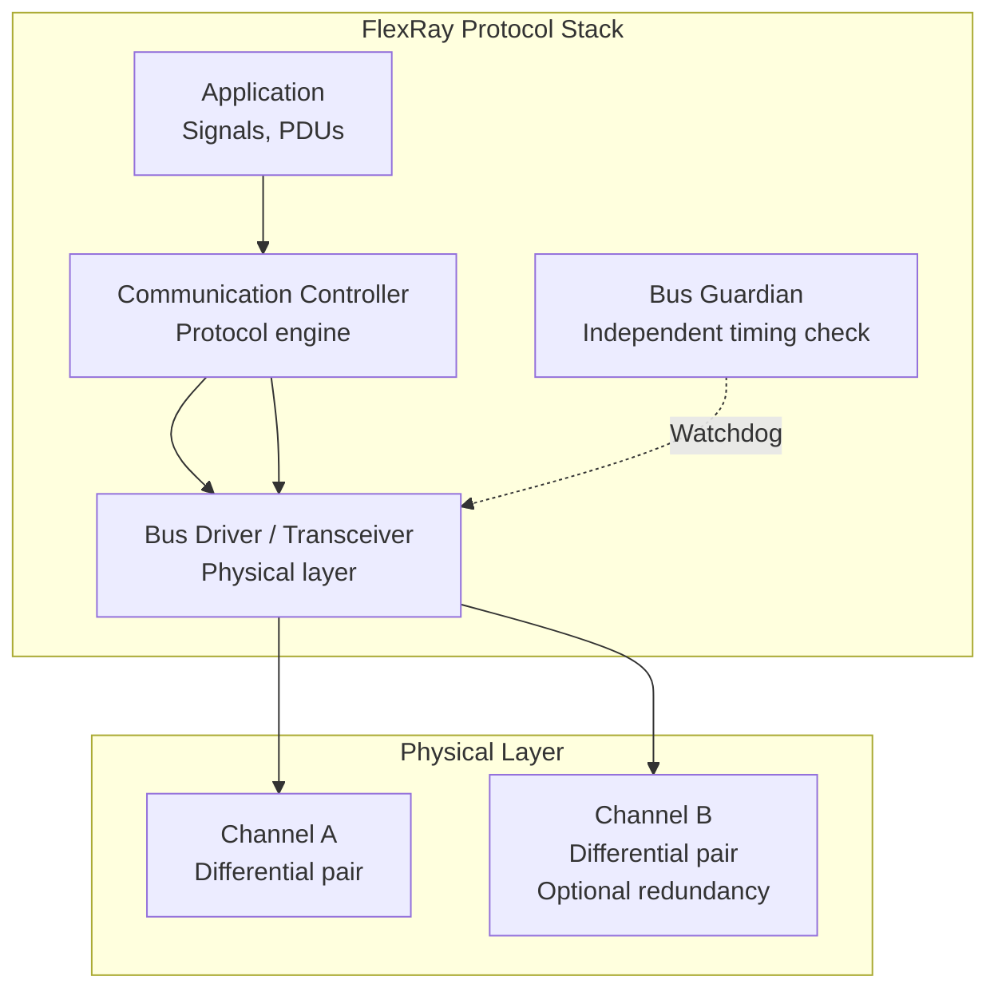
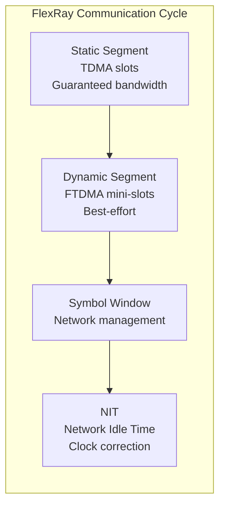
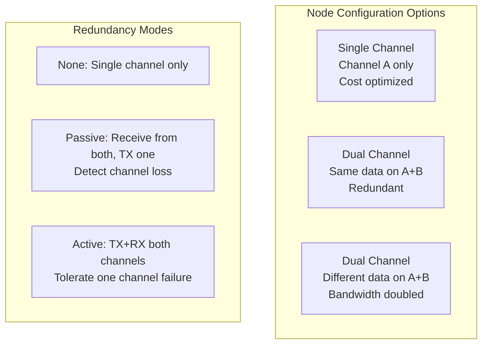
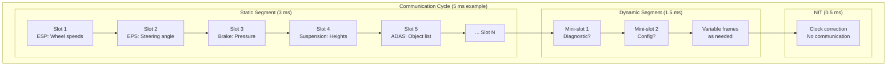
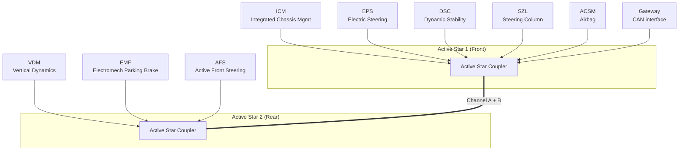

# FlexRay — ISO 17458 Deterministic Vehicle Network

**Topic:** FlexRay — ISO 17458 (High-Speed Deterministic Communication for Automotive)  
**Standard:** ISO 17458 (Parts 1-5)  
**SDO:** ISO TC 22/SC 31 / FlexRay Consortium (originally BMW, Bosch, Daimler, NXP)  
**Audience:** Chassis/ADAS network architects, safety-critical system engineers, automotive protocol developers  
**Prerequisites:** CAN bus fundamentals, time-triggered systems, automotive functional safety concepts

---

## Chapter 1 — Historical Context & Origin Story

### 1.1 Timeline

| Year | Event | Impact |
|------|-------|--------|
| 2000 | FlexRay Consortium founded (BMW, DaimlerChrysler, Motorola, Philips) | Development begins |
| 2001 | Bosch joins consortium | Major automotive supplier support |
| 2004 | FlexRay v2.0 specification | Core protocol definition |
| 2005 | FlexRay v2.1 — specification complete | Production-ready |
| 2006 | BMW X5 (E70) — first production FlexRay vehicle | Chassis network |
| 2008 | BMW 7 Series (F01) — full FlexRay chassis + ADAS | Flagship implementation |
| 2010 | FlexRay v3.0.1 (final consortium version) | Mature standard |
| 2013 | ISO 17458 published | International standardization |
| 2015 | FlexRay Consortium dissolved | Standard maintained by ISO |
| 2020+ | FlexRay in maintenance mode | Replaced by Automotive Ethernet for new designs |

### 1.2 Why FlexRay Was Created

**Problem (early 2000s):** CAN insufficient for next-gen chassis/ADAS:

| CAN Limitation | FlexRay Solution |
|----------------|------------------|
| 1 Mbit/s max bandwidth | 10 Mbit/s per channel (20 Mbit/s dual) |
| Event-triggered only (jitter) | Time-triggered + event-triggered (hybrid) |
| Non-deterministic worst-case latency | Deterministic guaranteed latency (TDMA) |
| No redundancy | Dual-channel architecture |
| 8 bytes max payload | 254 bytes max payload |
| Single bus topology | Bus, star, hybrid topologies |

**Target applications:** Brake-by-wire, steer-by-wire, active suspension, ADAS sensor fusion — all requiring deterministic, fault-tolerant communication.

---

## Chapter 2 — Standard Architecture & Structure

### 2.1 ISO 17458 Parts

| Part | Title | Content |
|------|-------|---------|
| ISO 17458-1 | General information and use case definition | Overview, terminology |
| ISO 17458-2 | Data link layer | Protocol specification (TDMA, framing) |
| ISO 17458-3 | Data link layer conformance test | Protocol testing |
| ISO 17458-4 | Electrical physical layer | Signalling, connectors, topology |
| ISO 17458-5 | Electrical physical layer conformance test | PHY testing |

### 2.2 FlexRay Protocol Architecture



---

## Chapter 3 — Technical Deep Dive

### 3.1 Communication Cycle Structure



| Segment | Purpose | Timing |
|---------|---------|--------|
| **Static** | Time-triggered deterministic frames (TDMA) | Fixed slot assignment |
| **Dynamic** | Event-triggered frames (priority-based) | Mini-slot allocation |
| **Symbol Window** | Wakeup, startup, MTS (Media Test Symbol) | Single symbol |
| **NIT** | Clock synchronization correction | No communication |

### 3.2 Static Segment (TDMA)

```
┌──── Communication Cycle (e.g., 5ms) ────────────────────────┐
│                   Static Segment                              │
├──────┬──────┬──────┬──────┬──────┬──────┬──────┬──────┤
│Slot 1│Slot 2│Slot 3│Slot 4│Slot 5│Slot 6│  ... │Slot N│
│Node A│Node B│Node C│Node A│Node B│Node D│      │      │
└──────┴──────┴──────┴──────┴──────┴──────┴──────┴──────┘

Each slot:
- Fixed size (same for all static slots in a cluster)
- Fixed assignment to a specific node
- Guaranteed transmission — no contention
- Deterministic latency = slot position × slot duration
```

### 3.3 Dynamic Segment (FTDMA)

```
┌──── Dynamic Segment ──────────────────┐
│ Mini-slot│ Mini-slot│ Frame │ Mini...  │
│  (empty) │ (empty)  │Node B │          │
│   idle   │   idle   │data   │          │
└──────────┴──────────┴───────┴──────────┘

- Each node has assigned mini-slot IDs
- If node has data → transmits in its mini-slot (mini-slot expands to frame)
- If no data → mini-slot remains idle (small)
- Lower slot ID = higher priority (like CAN arbitration concept)
- Bandwidth not guaranteed (best-effort within dynamic segment)
```

### 3.4 Frame Format

```
┌─────────── FlexRay Frame ───────────────────────┐
│ Header (40 bits) │ Payload (0-254 bytes) │ CRC (24 bits) │
└──────────────────┴───────────────────────┴───────────────┘

Header fields:
  Reserved bit        (1 bit)
  Payload preamble    (1 bit) — NM vector or message ID in payload
  Null frame          (1 bit) — no valid data
  Sync frame          (1 bit) — used for clock sync
  Startup frame       (1 bit) — used during startup
  Frame ID            (11 bits) — slot assignment (1-2047)
  Payload length      (7 bits) — in 16-bit words (0-127 → 0-254 bytes)
  Header CRC          (11 bits) — protects header
  Cycle count         (6 bits) — communication cycle counter (0-63)
```

### 3.5 Clock Synchronization

| Parameter | Value |
|-----------|-------|
| Required accuracy | ±1.5 µs (cluster-wide) |
| Method | Fault-tolerant midpoint algorithm |
| Sync frames | Special nodes transmit sync frames |
| Correction | Rate correction + offset correction |
| Min sync nodes | 2 for single-channel, 3 for fault-tolerant |
| Max clock drift | Compensated every communication cycle |

**Algorithm:**
1. Nodes measure arrival time of sync frames
2. Compare expected vs. actual arrival time
3. Calculate rate deviation and offset
4. Apply correction during NIT
5. Fault-tolerant: ignore outliers (Byzantine fault tolerance for up to 1 faulty sync node)

### 3.6 Dual-Channel Redundancy



---

## Chapter 4 — Implementation Guide

### 4.1 FlexRay Cluster Design

| Design Parameter | Typical Range |
|-----------------|---------------|
| Bit rate | 2.5 or 5 or 10 Mbit/s |
| Cycle time | 1-5 ms (chassis), 5-16 ms (body) |
| Static slots | 2-1023 per cycle |
| Dynamic mini-slots | 0-7986 per cycle |
| Max payload per frame | 254 bytes |
| Max nodes per cluster | 64 (practical: 10-22) |
| Topology | Bus, active star, hybrid |
| Channels | 1 or 2 (A, A+B) |

### 4.2 Example: Chassis Control Cluster

```mermaid
graph TB
    subgraph "FlexRay Cluster (10 Mbit/s, Dual Channel)"
        A[ESP Controller<br/>Slots 1-3]
        B[Active Steering<br/>Slots 4-5]
        C[Active Suspension<br/>Slots 6-8]
        D[ADAS Sensor Fusion<br/>Slots 9-12]
        E[Brake Controller<br/>Slots 13-15]
        F[Gateway to CAN<br/>Dynamic segment]
    end
    
    A === B === C === D === E === F
    
    Note: 
    Cycle time: 2ms
    Static segment: 15 slots × 100µs = 1.5ms  
    Dynamic segment: 0.4ms
    NIT: 0.1ms
```

### 4.3 Configuration (FIBEX)

**FIBEX (Field Bus Exchange Format):** XML-based configuration for FlexRay clusters.

Key configuration parameters:
- Cluster: cycle time, bit rate, number of static slots, mini-slot length
- Node: assigned slot IDs, channel assignment, startup/sync role
- Frame: payload length, signals within frame
- Schedule: which frame in which slot, cycle multiplexing

### 4.4 Bus Guardian

| Feature | Description |
|---------|-------------|
| Purpose | Independent hardware that controls transceiver enable |
| Why needed | Prevents babbling idiot failure (node transmitting in wrong slot) |
| Implementation | Separate IC (or MCU function) with own clock |
| Configuration | Programmed with same schedule as communication controller |
| Action | Only enables transceiver during node's assigned time slot |
| Safety integrity | Required for ASIL D fail-operational systems |

---

## Chapter 5 — Certification & Audit

### 5.1 FlexRay Conformance Testing

| Category | Standard | Content |
|----------|----------|---------|
| Protocol | ISO 17458-3 | State machine, timing, framing |
| Physical layer | ISO 17458-5 | Voltage, timing, topology |
| Clock sync | ISO 17458-3 | Correction algorithm accuracy |
| Startup | ISO 17458-3 | Coldstart, integration procedures |
| Bus guardian | OEM test spec | Independent schedule checking |

### 5.2 Safety Considerations

| Safety Mechanism | Purpose |
|-----------------|---------|
| Dual-channel operation | Tolerate single channel failure |
| Bus guardian | Prevent babbling idiot |
| Frame CRC (24-bit) | Detect data corruption |
| Header CRC (11-bit) | Detect header corruption |
| Clock sync monitoring | Detect timing failures |
| Cycle counter | Detect missing/duplicate frames |
| Null frame indicator | Detect missing data |

---

## Chapter 6 — Regional & Domain Variants

### 6.1 FlexRay Adoption

| OEM | Vehicle(s) | Application |
|-----|-----------|-------------|
| BMW | X5 (E70), 7-Series (F01), all F-series | Chassis, ADAS, powertrain |
| Audi | A8 (D4), some other models | Air suspension, ADAS |
| Mercedes | S-Class (W222) | Active body control |
| Rolls-Royce | Based on BMW platform | Chassis |
| General Motors | Some global platforms | Chassis |

**Note:** FlexRay adoption was primarily by German premium OEMs. Volume manufacturers chose CAN + Ethernet evolution.

### 6.2 FlexRay vs. Automotive Ethernet (Replacement)

| Aspect | FlexRay | Automotive Ethernet (100BASE-T1 + TSN) |
|--------|---------|----------------------------------------|
| Bandwidth | 10 Mbit/s (dual: 20) | 100 Mbit/s - 10 Gbit/s |
| Determinism | TDMA (excellent) | TSN IEEE 802.1 (comparable) |
| Cost | Expensive (low volume) | Decreasing (IT economies of scale) |
| Ecosystem | Automotive only | Leverages massive IT/networking ecosystem |
| Payload | 254 bytes | 1500 bytes (MTU) |
| Topology | Bus/star | Star/point-to-point |
| Redundancy | Dual channel native | PRP/HSR (IEEE 62439-3) |
| Future support | End-of-life (maintenance only) | Actively developing (TSN, 10G) |

---

## Chapter 7 — Comparison: Deterministic Automotive Networks

| Aspect | FlexRay | TTCAN | CAN FD + Scheduling | Ethernet + TSN |
|--------|---------|-------|---------------------|----------------|
| Bandwidth | 10 Mbit/s | 1 Mbit/s | 8 Mbit/s | 100 Mbit/s+ |
| Determinism mechanism | TDMA (static segment) | Time-triggered windows | Application-level schedule | IEEE 802.1Qbv (TAS) |
| Jitter | < 1 µs | < 10 µs | Depends on schedule | < 1 µs (TSN) |
| Redundancy | Dual channel | None | None | PRP/HSR/FRER |
| Complexity | Very high | Medium | Low | High (but standard IT) |
| Cost | High | Low | Low | Medium (decreasing) |
| Status (2024) | Legacy/maintenance | Niche | Current | Future standard |
| Key advantage | Proven determinism | CAN compatibility | CAN ecosystem | Bandwidth + ecosystem |

---

## Chapter 8 — Mermaid Architecture Diagrams

### 8.1 FlexRay Communication Cycle Detail



### 8.2 FlexRay Startup Procedure

```mermaid
stateDiagram-v2
    [*] --> Default_Config: Power-on
    Default_Config --> Ready: Config complete
    Ready --> Startup: Startup requested
    
    state Startup {
        [*] --> Coldstart_Listen: First node
        Coldstart_Listen --> Coldstart_Collision_Resolution: Transmit startup frames
        Coldstart_Collision_Resolution --> Coldstart_Consistency_Check: Resolved
        Coldstart_Consistency_Check --> Normal_Active: Sync achieved
        
        [*] --> Integration_Coldstart_Check: Joining node
        Integration_Coldstart_Check --> Integration_Listen: Hear startup frames
        Integration_Listen --> Integration_Consistency_Check: Sync to cluster
        Integration_Consistency_Check --> Normal_Active: Integrated
    end
    
    Normal_Active --> Normal_Active: Communicating
    Normal_Active --> Halt: Error / shutdown
```

### 8.3 BMW Chassis FlexRay Topology



---

## Chapter 9 — Case Studies & Failure Analysis

### 9.1 BMW FlexRay Chassis — Design Success

**Implementation:** BMW 7-Series (F01, 2008)

**Architecture:**
- 10 Mbit/s, dual-channel, 2ms cycle time
- 22 FlexRay nodes in chassis domain
- Integrated Chassis Management (ICM) coordinates ESP, steering, suspension, brakes
- Active steering + dynamic damping + roll stabilization all coordinated at 500 Hz

**Achievement:**
- 10× bandwidth vs. CAN → all chassis sensors + actuators on one network
- Deterministic 2ms cycle → 500 Hz control loop for active chassis
- Dual-channel → fault-tolerance (continue driving if one channel fails)
- Enabled features impossible on CAN: coordinated chassis control

### 9.2 Why FlexRay Lost to Ethernet

**Technical analysis:**
- FlexRay: purpose-built for automotive. Excellent for its design goals.
- But: silicon expensive (low volume), tools expensive, expertise rare.
- Automotive Ethernet: leverages trillion-dollar IT ecosystem.
- 100BASE-T1 achieves same or better spec at lower cost trend.
- TSN (IEEE 802.1) provides equivalent determinism.
- Ethernet ecosystem: standard switches, standard testing, standard SW stacks.
- Result: even BMW (FlexRay's biggest champion) migrated new platforms to Ethernet.

**Lesson:** Technical excellence doesn't win. Ecosystem + economics + momentum wins. FlexRay was technically superior but commercially unsustainable against Ethernet's scale.

---

## Chapter 10 — Future Evolution & Industry Trends

| Aspect | Status |
|--------|--------|
| New FlexRay designs | None — no new platforms adopting FlexRay |
| Existing fleet | BMW F-series, G-series (some) — service for 15+ years |
| Replacement | Automotive Ethernet + TSN for same applications |
| Legacy support | Tool vendors maintain FlexRay support (Vector, etc.) |
| ISO 17458 | Maintained but no active development |
| Silicon | NXP, Infineon still produce FlexRay transceivers (lifecycle) |
| Skills demand | Diminishing for new design, still needed for maintenance |

### 10.1 Lessons from FlexRay for Future Protocols

```
1. Don't compete with IT ecosystems (Ethernet has infinite investment)
2. Determinism can be added to existing protocols (TSN to Ethernet)
3. Dual-channel redundancy concept lives on (Ethernet PRP/HSR)
4. TDMA scheduling concept lives on (TSN 802.1Qbv)
5. Bus guardian concept lives on (TSN per-stream filtering)
6. FlexRay proved the CONCEPT — Ethernet delivers it at scale
```

---

## Chapter 11 — Interview Questions & Career Guide

### Tier 1: Entry-Level (0-3 years)

**Q1:** What is FlexRay and how is it different from CAN?  
**A:** FlexRay is a high-speed (10 Mbit/s), deterministic communication protocol designed for safety-critical automotive applications like brake-by-wire, steer-by-wire, and active chassis control. Key differences from CAN: (1) **Speed:** 10 Mbit/s vs. CAN's 1 Mbit/s (10× faster). (2) **Determinism:** TDMA (Time Division Multiple Access) in static segment → guaranteed latency, zero jitter. CAN uses priority-based arbitration → variable latency. (3) **Payload:** Up to 254 bytes vs. CAN's 8 bytes. (4) **Redundancy:** Dual-channel (Channel A + B) for fault tolerance. CAN is single bus. (5) **Topology:** Supports active star topology (not just linear bus). (6) **Hybrid scheduling:** Static segment (TDMA, guaranteed) + Dynamic segment (event-triggered, flexible). (7) **Cost:** Much more expensive than CAN (specialized silicon, dual wiring). Used primarily by BMW and some premium OEMs for chassis networks where determinism and fault-tolerance justify cost.

### Tier 2: Mid-Level (3-8 years)

**Q2:** Explain the FlexRay communication cycle and how you would allocate bandwidth for a chassis control system.  
**A:** Communication cycle has 4 parts: (1) **Static segment:** Divided into fixed-size time slots (TDMA). Each slot assigned to specific node — guaranteed transmission, no contention. Slot size = same for all slots (configured at design time). For chassis: slot 1 = wheel speeds (4×16-bit = 8 bytes, ESP node), slot 2 = steering angle + torque (EPS node), slot 3 = brake pressures (brake controller), slot 4 = suspension heights (4 sensors), etc. (2) **Dynamic segment:** Mini-slots for non-time-critical data. If node has data → mini-slot expands to frame transmission. If no data → mini-slot stays small. Use for: diagnostic requests, configuration changes, non-periodic events. (3) **Symbol window:** Network management symbols (wakeup pattern, media test). (4) **NIT (Network Idle Time):** No communication. Nodes apply clock correction (offset + rate). Bandwidth allocation example for 2ms cycle, 10 Mbit/s: Total bits per cycle: 20,000 bits. Static: 15 slots × 1000 bits each = 15,000 bits (75% — deterministic). Dynamic: 4,000 bits (20% — flexible). NIT: 1,000 bits (5% — sync). This gives 15 guaranteed frames per 2ms cycle = 7,500 frames/second of deterministic data.

### Tier 3: Senior/Lead (8-15 years)

**Q3:** You're migrating a FlexRay-based chassis platform to Automotive Ethernet + TSN. What's your approach?  
**A:** Migration strategy: (1) **Requirements mapping:** Document all FlexRay cluster requirements: latency per frame (typically < 2ms), bandwidth per node, fault-tolerance requirements (dual-channel usage), safety integrity (which frames are ASIL D?). (2) **Ethernet + TSN equivalent architecture:** Replace TDMA static segment → TSN 802.1Qbv (Time-Aware Shaper). Scheduled traffic gets guaranteed time windows (same concept, different implementation). Replace dynamic segment → TSN best-effort class (standard Ethernet queuing). Replace dual-channel → Parallel Redundancy Protocol (PRP) per IEC 62439-3. Same concept: send frame on two independent paths, receiver uses first-arriving. (3) **Physical layer:** FlexRay: differential pair per channel (2 pairs for dual). Ethernet: 100BASE-T1 per link (single unshielded pair per connection). Topology change: FlexRay bus → Ethernet star (switch-based). Wiring: may need more cables (star) but each cable is cheaper (unshielded). (4) **Safety argument:** FlexRay's safety mechanisms (bus guardian, dual-channel, CRC) must be mapped to Ethernet equivalents. TSN per-stream filtering ≈ bus guardian. PRP ≈ dual-channel. Ethernet CRC-32 ≈ FlexRay CRC-24 (actually stronger). End-to-end protection (AUTOSAR E2E) remains. (5) **Migration path:** Phase 1: Gateway between FlexRay (existing ECUs) and Ethernet (new ECUs). Phase 2: Replace FlexRay nodes one-by-one with Ethernet nodes. Phase 3: Remove gateway when all nodes migrated. (6) **Risk:** TSN maturity for automotive (still being validated vs. FlexRay's 15-year track record). Solution: extensive testing, simulation (AUTOSAR virtual ECU), progressive rollout.

### Tier 4: Principal/Distinguished (15+ years)

**Q4:** Evaluate FlexRay's legacy and its influence on modern automotive networking architecture.  
**A:** FlexRay's contribution to automotive networking: (1) **Proved the need:** Before FlexRay, some argued CAN was sufficient forever. FlexRay proved: high-bandwidth deterministic networking enables new vehicle features (integrated chassis control). This created the market pull for Automotive Ethernet. (2) **TDMA concept adoption:** TSN 802.1Qbv (Time-Aware Shaper) is conceptually identical to FlexRay's static segment. The schedule is pre-computed, gates open/close at fixed times, traffic is guaranteed. FlexRay pioneered this in automotive. TSN standardized it for Ethernet. (3) **Redundancy architecture:** Dual-channel FlexRay → PRP/HSR in Ethernet. Same design pattern: duplicate paths, receiver takes first valid frame. This is now standard for fail-operational autonomous driving networks. (4) **Bus guardian → TSN PSFP:** FlexRay's independent bus guardian (prevents babbling idiot) → TSN Per-Stream Filtering and Policing (IEEE 802.1Qci). Same concept: independent hardware that rejects unauthorized traffic. (5) **Clock synchronization:** FlexRay's fault-tolerant clock sync → IEEE 802.1AS (gPTP). Both: distributed clock, fault-tolerant, sub-microsecond accuracy. (6) **Economic lesson:** Automotive can't sustain proprietary protocols against IT ecosystem investment. Future protocols must be extensions of IT standards (Ethernet, IP, TSN) with automotive profiles — not purpose-built alternatives. (7) **Verdict:** FlexRay was a brilliant engineering achievement and commercial failure. Its technical concepts live on in TSN-based Ethernet. Every feature FlexRay provided is now available in Automotive Ethernet + TSN — at lower cost, higher bandwidth, and with massive ecosystem support. FlexRay's greatest contribution: proving what automotive networking needs, so Ethernet/TSN could deliver it at scale.

---

## Chapter 12 — Cheat Sheet & Quick Reference

### FlexRay Quick Facts

```
Bit Rate: 10 Mbit/s per channel (20 Mbit/s dual)
Channels: 1 or 2 (A, B)
Max Payload: 254 bytes per frame
Max Nodes: ~64 (practical: 10-22)
Cycle Time: 1-16 ms (configurable)
Frame ID: 11 bits (1-2047)
CRC: 24-bit (payload) + 11-bit (header)
Topology: Bus, Active Star, Hybrid
Encoding: NRZ + byte start sequence (BSS)
Clock Accuracy: ±1.5 µs cluster-wide
```

### Communication Cycle Structure

```
┌────────────────── Cycle ──────────────────┐
│ Static │ Dynamic │ Symbol │    NIT        │
│ (TDMA) │ (FTDMA) │ Window │ (Idle+Sync)  │
└────────┴─────────┴────────┴──────────────┘

Static: Guaranteed slots (deterministic)
Dynamic: Priority-based mini-slots (best-effort)
Symbol: Network management (wakeup)
NIT: Clock correction (no communication)
```

### Key Design Rules

```
1. Safety-critical data → Static segment (guaranteed latency)
2. Diagnostic/config data → Dynamic segment (on-demand)
3. Dual-channel for fail-operational (ASIL D)
4. Single-channel for cost-optimized (non-safety)
5. Bus guardian mandatory for safety applications
6. Min 2 sync nodes (3 for fault-tolerant clock)
7. Cycle time = control loop period requirement
8. Static slot size = largest static frame in cluster
```

### FlexRay vs. Automotive Ethernet + TSN

```
FlexRay TDMA        → TSN 802.1Qbv (Time-Aware Shaper)
FlexRay Dual-Channel → PRP (Parallel Redundancy Protocol)
FlexRay Bus Guardian → TSN 802.1Qci (Per-Stream Filtering)
FlexRay Clock Sync   → IEEE 802.1AS (gPTP)
FlexRay Dynamic Seg  → TSN Best-Effort traffic class
FlexRay Frame CRC    → Ethernet CRC-32 + E2E protection
FlexRay 10 Mbit/s   → 100 Mbit/s / 1 Gbit/s Ethernet
```

---

*End of Document — 12_FlexRay_ISO_17458.md*
