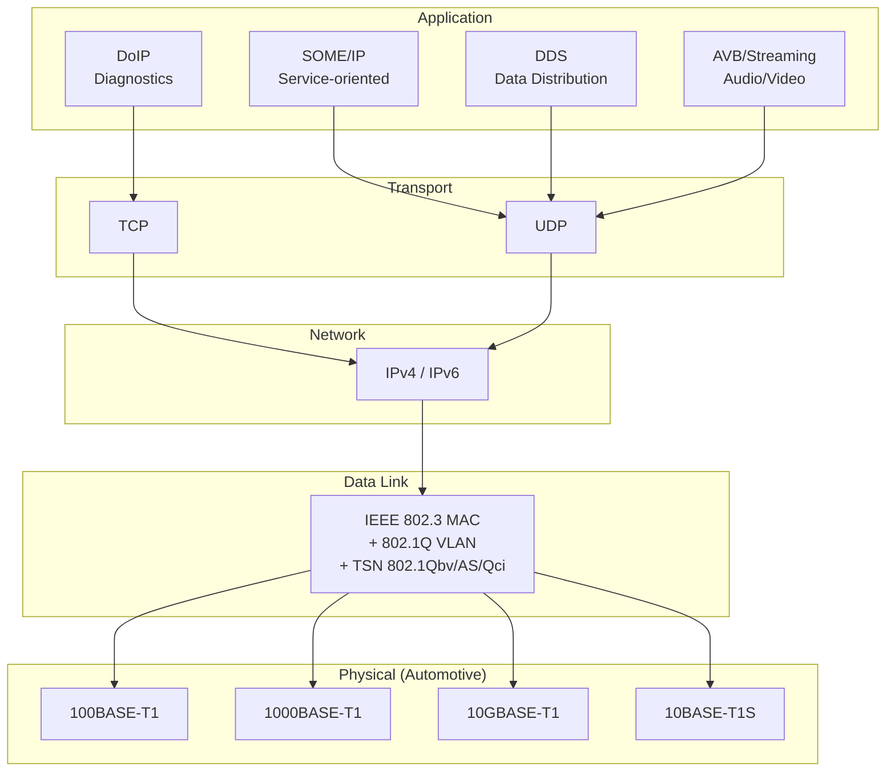
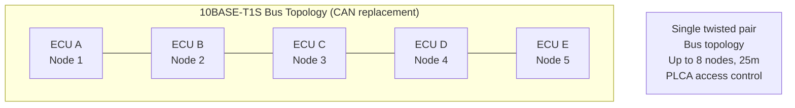
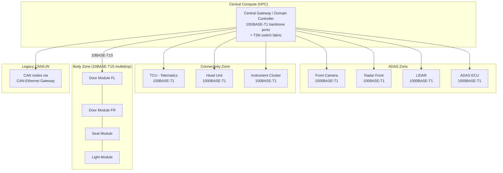
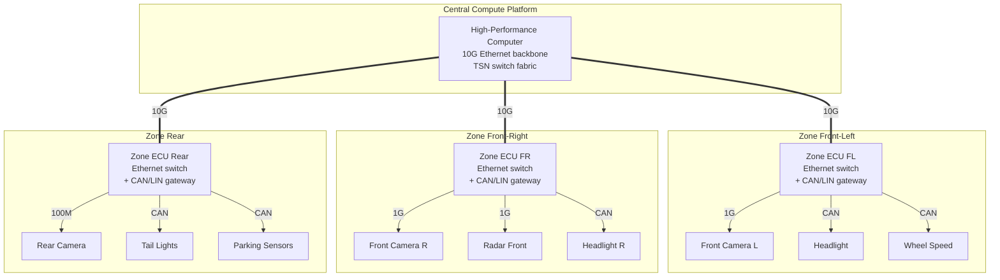
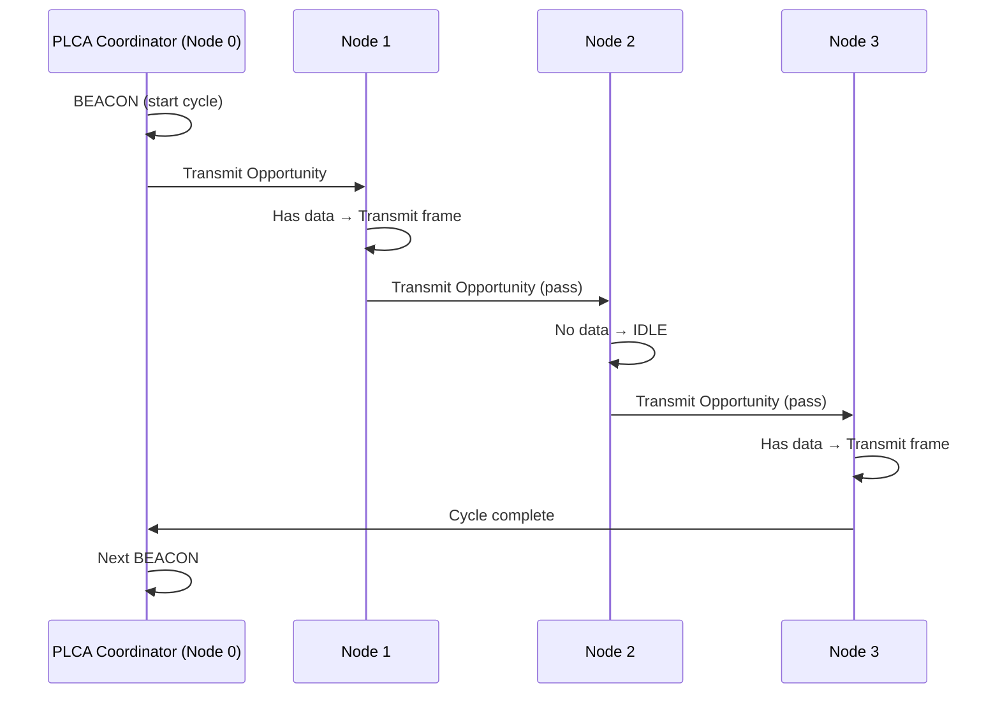

# Automotive Ethernet — 100BASE-T1 / 1000BASE-T1

**Topic:** Automotive Ethernet — IEEE 802.3 Physical Layer for Vehicles (100BASE-T1, 1000BASE-T1, 10BASE-T1S)  
**Standard:** IEEE 802.3bw (100BASE-T1), IEEE 802.3bp (1000BASE-T1), IEEE 802.3cg (10BASE-T1S), OPEN Alliance TC specifications  
**SDO:** IEEE 802.3 / OPEN Alliance SIG (One-Pair Ether-Net)  
**Audience:** Vehicle network architects, ADAS system engineers, E/E architects, Ethernet SW stack developers  
**Prerequisites:** Networking fundamentals (OSI model, TCP/IP), CAN bus knowledge, automotive E/E architecture

---

## Chapter 1 — Historical Context & Origin Story

### 1.1 Timeline

| Year | Event | Impact |
|------|-------|--------|
| 2008 | BMW uses standard Ethernet (100BASE-TX) for diagnostics | First automotive Ethernet use |
| 2011 | Broadcom BroadR-Reach™ (100 Mbit/s single pair) | Automotive-specific PHY invented |
| 2012 | OPEN Alliance SIG founded | Industry consortium for automotive Ethernet |
| 2014 | IEEE 802.3bw ratified (100BASE-T1) | Standardized single-pair 100M |
| 2016 | IEEE 802.3bp ratified (1000BASE-T1) | Gigabit over single pair |
| 2016 | First production: Hyundai Genesis (surround view camera) | Mass production begins |
| 2019 | IEEE 802.3ch (2.5/5/10GBASE-T1) | Multi-gig for ADAS/backbone |
| 2019 | IEEE 802.3cg (10BASE-T1S — multidrop) | Ethernet replaces CAN topology |
| 2020 | TSN integration (802.1AS, 802.1Qbv, 802.1Qci) | Determinism on Ethernet |
| 2022+ | Ethernet-based architectures standard for new platforms | Industry mainstream |

### 1.2 Why Automotive Ethernet?

| Need | Solution |
|------|----------|
| Camera data (ADAS): 100+ Mbit/s per camera | 100BASE-T1, 1000BASE-T1 |
| LIDAR point clouds: 100+ Mbit/s | 1000BASE-T1, multi-gig |
| Service-oriented communication (SOME/IP) | Standard IP/Ethernet stack |
| OTA updates: large file transfer | High-bandwidth backbone |
| Diagnostics: DoIP (ISO 13400) | Ethernet-native diagnostics |
| IT convergence: cloud, cybersecurity | Same protocol as enterprise |
| Cost reduction: leverage IT ecosystem | Standard silicon, SW, tools |

---

## Chapter 2 — Standard Architecture & Structure

### 2.1 Automotive Ethernet PHY Standards

| Standard | Speed | Pairs | Distance | Use Case |
|----------|-------|-------|----------|----------|
| 100BASE-T1 (802.3bw) | 100 Mbit/s | 1 pair | 15m | Cameras, sensors, ECU links |
| 1000BASE-T1 (802.3bp) | 1 Gbit/s | 1 pair | 15m (40m copper) | ADAS, backbone |
| 2.5GBASE-T1 (802.3ch) | 2.5 Gbit/s | 1 pair | 15m | High-res cameras |
| 5GBASE-T1 (802.3ch) | 5 Gbit/s | 1 pair | 15m | Backbone |
| 10GBASE-T1 (802.3ch) | 10 Gbit/s | 1 pair | 15m | Central compute |
| 10BASE-T1S (802.3cg) | 10 Mbit/s | 1 pair | 25m (multidrop bus) | CAN replacement |

### 2.2 Protocol Stack for Automotive Ethernet



---

## Chapter 3 — Technical Deep Dive

### 3.1 100BASE-T1 Physical Layer

| Parameter | Value |
|-----------|-------|
| Data rate | 100 Mbit/s full-duplex |
| Wire | Single unshielded twisted pair (UTP) |
| Modulation | PAM-3 (3-level pulse amplitude modulation) |
| Symbol rate | 66.67 MBaud |
| Max cable length | 15 meters (automotive) |
| Connector | OPEN Alliance TC9 / proprietary automotive |
| EMC | Meets automotive EMC (CISPR 25 Class 5) |
| Temperature | -40°C to +105°C |
| Link partner detection | 100BASE-T1 training phase |
| Duplex | Full-duplex (simultaneous TX/RX on same pair) |

**How full-duplex works on single pair:** Echo cancellation — each end subtracts its own transmitted signal from received signal to extract the other end's signal.

### 3.2 1000BASE-T1 Physical Layer

| Parameter | Value |
|-----------|-------|
| Data rate | 1 Gbit/s full-duplex |
| Wire | Single shielded or unshielded twisted pair |
| Modulation | PAM-3 |
| Symbol rate | 750 MBaud |
| Max cable length | 15m (UTP), 40m (STP) |
| Master/Slave | Link requires one master, one slave |
| PCS coding | LDPC (Low-Density Parity Check) |
| Power | Higher than 100BASE-T1 (~1W PHY) |

### 3.3 10BASE-T1S — Multidrop Automotive Ethernet



**10BASE-T1S key features:**
- Multidrop bus (like CAN) — NOT point-to-point
- Single unshielded twisted pair
- 10 Mbit/s half-duplex
- PLCA (Physical Layer Collision Avoidance) — deterministic access
- Designed to replace CAN/LIN for medium-bandwidth nodes
- Standard Ethernet/IP/UDP above physical layer

### 3.4 TSN (Time-Sensitive Networking) for Automotive

| TSN Standard | Function | Automotive Use |
|-------------|----------|---------------|
| IEEE 802.1AS | Clock synchronization (gPTP) | Global time base for distributed control |
| IEEE 802.1Qbv | Time-Aware Shaper (TAS) | Guaranteed latency for critical frames |
| IEEE 802.1Qci | Per-Stream Filtering & Policing | Security + babbling idiot protection |
| IEEE 802.1CB | Frame Replication & Elimination | Redundancy (like FlexRay dual-channel) |
| IEEE 802.1Qcc | Stream Reservation Protocol enhancements | Bandwidth management |

### 3.5 SOME/IP (Service-Oriented Middleware over IP)

| Feature | Description |
|---------|-------------|
| Purpose | Middleware for service-oriented communication |
| Transport | UDP (notifications, fire&forget) or TCP (reliable) |
| Discovery | SOME/IP-SD (Service Discovery) |
| Serialization | SOME/IP serialization format |
| Events | Publish/Subscribe for signals |
| Methods | Request/Response for services |
| Standardized by | AUTOSAR (Adaptive + Classic) |
| Replaces | CAN signal-based communication for high-level services |

---

## Chapter 4 — Implementation Guide

### 4.1 Automotive Ethernet Network Architecture



### 4.2 Ethernet Switch Architecture (Automotive)

| Feature | Requirement |
|---------|-------------|
| Ports | 8-24 ports per switch |
| Speed mixing | 100M + 1G + 10G ports |
| TSN support | 802.1AS, 802.1Qbv, 802.1Qci minimum |
| Temperature | -40°C to +105°C (AEC-Q100) |
| Startup time | < 500ms (fast boot for safety systems) |
| VLAN support | 802.1Q for network segmentation |
| Security | MACsec (802.1AE) for link encryption |
| Safety | Fail-operational modes |

### 4.3 Software Stack

| Layer | Component | Standard/Implementation |
|-------|-----------|------------------------|
| Application | SOME/IP, DDS, DoIP | AUTOSAR Adaptive SWS |
| Service Discovery | SOME/IP-SD | UDP multicast |
| Transport | TCP/UDP | LWIP, Linux, AUTOSAR TCP/IP |
| Network | IPv4/IPv6, ARP, ICMP | Standard IP stack |
| Security | TLS 1.3, IPsec, MACsec | Crypto libraries + HSM |
| Data Link | Ethernet MAC + VLAN + TSN | Hardware switch + driver |
| Physical | 100BASE-T1 / 1000BASE-T1 | Marvell, Broadcom, NXP PHYs |

---

## Chapter 5 — Certification & Audit

### 5.1 Automotive Ethernet Testing

| Test Category | Standard / Spec | Content |
|---------------|----------------|---------|
| PHY compliance | OPEN Alliance TC1 (100BASE-T1) | Transmitter output, jitter, return loss |
| EMC | CISPR 25, ISO 11452 | Radiated/conducted emissions & immunity |
| Interoperability | OPEN Alliance TC8 | Multi-vendor ECU communication |
| TSN conformance | IEEE 802.1 test plans | Time sync, scheduling, filtering |
| Security | ISO/SAE 21434 | Network-level cybersecurity |
| Functional safety | ISO 26262 | Diagnostic coverage, safe states |
| Cable/connector | OPEN Alliance TC2/TC9 | Cable quality, connector performance |

### 5.2 OPEN Alliance Compliance Testing

| Test | Purpose |
|------|---------|
| TC1: 100BASE-T1 PHY | Physical layer compliance |
| TC2: Cable/connector | Wiring harness qualification |
| TC4: 1000BASE-T1 PHY | Gigabit PHY compliance |
| TC8: ECU interoperability | End-to-end communication test |
| TC9: Connector performance | Connector mating reliability |
| TC10: Sleep/wake | Low-power mode transitions |
| TC12: 10BASE-T1S | Multidrop PHY compliance |

---

## Chapter 6 — Regional & Domain Variants

### 6.1 Adoption by OEM

| OEM | Ethernet Usage | Bandwidth |
|-----|---------------|-----------|
| BMW | Backbone + ADAS + diagnostics | Up to 10G |
| VW/Audi | MEB platform backbone | 100M/1G |
| Hyundai/Kia | Camera connections (since 2016) | 100M |
| Tesla | Central compute interconnect | 1G/10G |
| GM | Ultifi platform | 1G backbone |
| Toyota | Selective ADAS | 100M/1G |
| NIO/XPeng | Full Ethernet architecture | 1G/10G |

### 6.2 Automotive Ethernet in Different Vehicle Zones

| Zone | Speed | Protocol | Application |
|------|-------|----------|-------------|
| Central backbone | 10GBASE-T1 | TSN | HPC interconnect |
| ADAS | 1000BASE-T1 | AVB/TSN + SOME/IP | Camera, radar, lidar |
| Infotainment | 1000BASE-T1 | AVB | Audio/video streaming |
| Body/comfort | 10BASE-T1S | UDP/IP | Replaces some CAN/LIN |
| Diagnostics | 100BASE-T1 | DoIP | Workshop connection |
| Connectivity | 100BASE-T1 | TCP/IP | TCU, V2X |

---

## Chapter 7 — Comparison: Automotive Ethernet PHY Variants

| Aspect | 100BASE-T1 | 1000BASE-T1 | 10GBASE-T1 | 10BASE-T1S |
|--------|-----------|-------------|-----------|-----------|
| Speed | 100 Mbit/s | 1 Gbit/s | 10 Gbit/s | 10 Mbit/s |
| Duplex | Full | Full | Full | Half |
| Topology | Point-to-point | Point-to-point | Point-to-point | Multidrop bus |
| Pairs | 1 UTP | 1 STP/UTP | 1 STP | 1 UTP |
| Max length | 15m | 15-40m | 15m | 25m |
| Nodes/segment | 2 (P2P) | 2 (P2P) | 2 (P2P) | 8 |
| PHY cost (est.) | $2-3 | $5-8 | $15-20 | $1-2 |
| Power (PHY) | ~0.5W | ~1W | ~3W | ~0.3W |
| Use case | Sensors, ECU link | ADAS, backbone | Central compute | CAN replacement |
| Maturity | Production (2016+) | Production (2019+) | Early production | Emerging (2024+) |

---

## Chapter 8 — Mermaid Architecture Diagrams

### 8.1 Zonal Architecture with Ethernet



### 8.2 TSN Traffic Scheduling

```mermaid
gantt
    title TSN 802.1Qbv Time-Aware Shaper (Gate Control)
    dateFormat X
    axisFormat %L µs
    
    section Priority 7 (Safety)
    Brake data : 0, 100
    Steering data : 500, 100
    Brake data : 1000, 100
    
    section Priority 5 (Control)
    Sensor fusion : 100, 200
    Vehicle dynamics : 600, 200
    
    section Priority 3 (Video)
    Camera stream : 300, 200
    Camera stream : 800, 200
    
    section Priority 0 (Best-effort)
    OTA download : 1100, 400
```



### 8.3 10BASE-T1S PLCA Operation



---

## Chapter 9 — Case Studies & Failure Analysis

### 9.1 Camera-to-ADAS Latency Challenge

**Problem:** Surround-view camera system requires < 50ms end-to-end latency from image capture to display. Four cameras, each streaming 30 fps at 2 Megapixels.

**Bandwidth calculation:**
- Per camera: 2 MP × 12 bits/pixel × 30 fps = 720 Mbit/s (raw)
- With compression (H.264): ~50-100 Mbit/s per camera
- 4 cameras: 200-400 Mbit/s total

**Solution:**
- 1000BASE-T1 from each camera to ADAS ECU
- MJPEG or H.264 compression in camera module
- TSN scheduling: camera streams get guaranteed bandwidth (802.1Qbv)
- Latency budget: capture (3ms) + encode (5ms) + network (0.5ms) + decode (5ms) + render (8ms) = ~22ms

### 9.2 Network Partitioning Attack

**Threat:** Attacker compromises infotainment ECU (internet-connected) and attempts to reach ADAS network via Ethernet switch.

**Countermeasures (defense in depth):**
1. VLAN segmentation: ADAS on separate VLAN (no L2 reachability from infotainment)
2. TSN 802.1Qci: per-stream filtering rejects unexpected traffic
3. Firewall rules in switch: whitelist only known flows
4. MACsec (802.1AE): link-level encryption between trusted nodes
5. E2E authentication: SOME/IP messages signed (application level)
6. IDS: anomaly detection on switch port statistics

---

## Chapter 10 — Future Evolution & Industry Trends

| Trend | Impact |
|-------|--------|
| 25GBASE-T1 / 50GBASE-T1 | Future backbone for L4/L5 data |
| 10BASE-T1S mass adoption | Replace CAN for many applications (2025-2030) |
| TSN profiles for automotive | IEEE/SAE P802.1DG — automotive TSN profile |
| Ethernet-based diagnostics | DoIP replaces CAN-based UDS transport |
| Power over Data Line (PoDL) | Power + data on same pair (simplify wiring) |
| Wireless + Ethernet hybrid | WiFi 6/7 for non-safety, Ethernet for safety |
| SDV software updates | Ethernet bandwidth enables frequent large OTA |
| V2X over Ethernet | Backend connectivity integration |
| Unified E/E architecture | Single Ethernet backbone replaces multiple CAN buses |
| AI/ML model deployment | Large model transfer requires Ethernet bandwidth |

---

## Chapter 11 — Interview Questions & Career Guide

### Tier 1: Entry-Level (0-3 years)

**Q1:** Why can't standard office Ethernet (100BASE-TX) be used in vehicles? What's different about 100BASE-T1?  
**A:** Standard 100BASE-TX uses: 2 pairs (4 wires), Cat5 cable, RJ45 connector, max 100m, operating temp 0-70°C. This doesn't work in vehicles because: (1) **Weight/Space:** 2 pairs = twice the copper. Automotive harness weight is critical (affects fuel economy). 100BASE-T1 uses single unshielded twisted pair (50% weight reduction). (2) **EMC:** Vehicles have severe electromagnetic interference (ignition, motors, inverters). 100BASE-T1 modulation (PAM-3) and coding designed for automotive EMC compliance (CISPR 25 Class 5). (3) **Connector:** RJ45 too large, not vibration-proof, not sealed. Automotive Ethernet uses miniaturized, sealed, vibration-resistant connectors. (4) **Temperature:** Automotive range: -40°C to +105°C (under-hood). Standard Ethernet PHYs rated 0-70°C. 100BASE-T1 PHYs are automotive-qualified (AEC-Q100). (5) **Cable length:** Vehicles are 5-15m max internal runs. Standard Ethernet optimized for 100m. 100BASE-T1 optimized for 15m (allows simpler equalization, lower power). (6) **Cost:** Single pair + unshielded + shorter = cheaper per link than Cat5.

### Tier 2: Mid-Level (3-8 years)

**Q2:** Design the Ethernet network for a Level 3 autonomous driving system with 8 cameras, 5 radars, and 2 LIDARs.  
**A:** (1) **Bandwidth requirements:** Cameras (8×): 50 Mbit/s each (compressed) = 400 Mbit/s. Radars (5×): 10 Mbit/s each (object list) = 50 Mbit/s. LIDARs (2×): 200 Mbit/s each (point cloud) = 400 Mbit/s. Total sensor data: ~850 Mbit/s. Plus control traffic, diagnostics, OTA: ~100 Mbit/s. Total: ~1 Gbit/s. (2) **Architecture:** Central ADAS ECU: 2× 10GBASE-T1 ports (redundant backbone connection). Switch 1 (front zone): 8 ports — 4× 1G (front cameras + front LIDAR), 4× 100M (front radars). Switch 2 (rear zone): 6 ports — 4× 1G (rear cameras + rear LIDAR), 2× 100M (rear radars). Side radars: 100M each to nearest switch. (3) **Redundancy (L3 requirement):** Dual path: ADAS ECU connected to both switches via independent links. If one switch or link fails → other path provides degraded but functional sensor set. (4) **TSN scheduling:** Safety-critical: radar object lists → guaranteed 1ms latency (802.1Qbv highest priority). Camera streams → guaranteed bandwidth (scheduled traffic class). LIDAR → bounded latency (high-priority best-effort). Non-critical (diagnostics, OTA) → best-effort class. (5) **Clock synchronization:** 802.1AS (gPTP) across all nodes — synchronized timestamps on sensor data for fusion. Accuracy requirement: < 1µs across cluster. (6) **Security:** VLAN isolation: sensors on dedicated VLAN (no access from infotainment). MACsec between switches for link-level security. Only ADAS ECU can subscribe to sensor streams. IDS monitoring all switch ports.

### Tier 3: Senior/Lead (8-15 years)

**Q3:** How do you ensure deterministic worst-case latency on Automotive Ethernet for a safety-critical brake-by-wire system?  
**A:** Brake-by-wire requirement: latency < 1ms, jitter < 100µs, no frame loss. (1) **TSN mechanism selection:** 802.1Qbv (Time-Aware Shaper): allocate exclusive time windows for brake messages. During brake window: only brake traffic transmitted. All other traffic blocked by time gates. Window size: min frame time (~12µs for 64-byte frame at 1G) + guard band. Period: every 1ms (matches control rate). (2) **Network design:** Dedicated port: brake ECU has dedicated switch port (no sharing). Hop count: minimize hops between brake pedal sensor → switch → brake actuator. Maximum 2 switches (pedal sensor → switch → ADAS ECU → switch → actuator). Per-hop latency: 3-5µs store-and-forward + 1µs PHY. Total: < 20µs network latency for 2-hop path. (3) **Redundancy:** IEEE 802.1CB (FRER): Frame Replication and Elimination for Reliability. Brake message sent on two independent paths simultaneously. Receiver takes first arriving frame, discards duplicate. Failure of one path: zero impact on latency (other path arrives normally). (4) **802.1Qci (Per-Stream Filtering and Policing):** Configure switch to accept brake frames ONLY from authenticated source. Reject any non-brake traffic attempting to use brake time window. Rate-police: if unexpected traffic volume → drop and alert. (5) **Safety analysis per ISO 26262:** Diagnostic coverage: monitor message arrival (timeout = fault). Error detection: sequence counter + CRC + E2E protection (AUTOSAR E2E Profile). Fault reaction time: if brake message missing for 2 consecutive cycles → enter safe state. FMEDA: show that combination of TSN mechanisms achieves ASIL D diagnostic coverage.

### Tier 4: Principal/Distinguished (15+ years)

**Q4:** Architect the complete Ethernet networking strategy for a software-defined vehicle platform that will serve 5 vehicle variants over 8 years.  
**A:** (1) **Scalable backbone architecture:** Define 3 backbone tiers: Tier 1 (entry): 1G backbone between zone ECUs and central compute. Tier 2 (mid): 2.5G backbone. Tier 3 (premium): 10G backbone. Same physical harness design for all tiers (cable qualified for highest speed). PHY selection (100M/1G/10G) per variant via ECU configuration. (2) **Zone ECU design:** Standard zone ECU hardware across all variants: 1× uplink port (1G/10G — configurable). 4× downlink Ethernet ports (100M/1G — configurable). 2× CAN FD ports (legacy devices). 2× LIN ports (simple actuators). 1× 10BASE-T1S port (future CAN replacement). Each variant: different software configuration = different feature set. Zone ECU is the "platform constant" — reduce design iterations. (3) **Software architecture:** AUTOSAR Adaptive on central compute + zone ECUs. SOME/IP for all service-oriented communication. DDS for time-critical sensor distribution (alternative for ADAS). DoIP for diagnostics (all ECUs reachable via IP). Standard IP addressing scheme across all variants. (4) **TSN configuration management:** Per-variant TSN schedule (different sensors → different traffic). TSN configuration tool generates 802.1Qbv tables from requirements. CI/CD pipeline: functional test → TSN simulation → worst-case latency verification → deploy. Over 8-year lifecycle: TSN schedules updated via OTA when new features added. (5) **Security architecture:** MACsec on all links (zero-trust networking). VLAN per security zone (ADAS, infotainment, body, diagnostics). Central firewall policy in compute node. Certificate-based authentication for each ECU (PKI). Secure boot + measured boot for network stack integrity. (6) **Evolution strategy:** Year 1-3: 10BASE-T1S pilots (replace some CAN buses in body domain). Year 3-5: 10BASE-T1S standard for body domain (new cost target). Year 5-8: Next-gen PHY (25G?) for central backbone if autonomous driving scales. Backward compatibility: always maintain CAN gateway capability for legacy connects.

---

## Chapter 12 — Cheat Sheet & Quick Reference

### Automotive Ethernet PHY Selection Guide

```
< 10 Mbit/s needed, bus topology wanted → 10BASE-T1S
100 Mbit/s, sensor/ECU link → 100BASE-T1
1 Gbit/s, ADAS cameras/radar → 1000BASE-T1
2.5-10 Gbit/s, backbone/central → Multi-gig (802.3ch)
```

### Key Standards Map

```
Physical:    IEEE 802.3bw/bp/ch/cg
Data Link:   IEEE 802.3 + 802.1Q (VLAN)
TSN:         802.1AS (time) + 802.1Qbv (scheduling) + 802.1Qci (filtering)
Transport:   TCP/UDP (standard)
Middleware:  SOME/IP (AUTOSAR), DDS, AVB
Diagnostics: DoIP (ISO 13400)
Security:    MACsec (802.1AE), TLS, IPsec
Testing:     OPEN Alliance TC1/4/8/12
```

### Bandwidth Quick Calculations

```
Camera (2MP, 30fps, H.264): 50-100 Mbit/s
Camera (8MP, 30fps, H.265): 100-200 Mbit/s
Radar (object list): 5-20 Mbit/s
LIDAR (point cloud, compressed): 100-300 Mbit/s
Control signals (SOME/IP): 1-10 Mbit/s per service
OTA update (1GB in 10min): ~15 Mbit/s sustained

Rule of thumb: design backbone at 3× peak aggregate traffic
```

### TSN Quick Reference

```
802.1AS  = Clock sync (< 1µs accuracy)
802.1Qbv = Time-Aware Shaper (guaranteed time slots)
802.1Qci = Stream filtering (security + fault containment)
802.1CB  = Redundancy (send on 2 paths, eliminate duplicate)
802.1Qcc = Stream reservation (bandwidth guarantee)
802.1Qch = Cyclic queuing (another scheduling mechanism)
```

---

*End of Document — 13_Automotive_Ethernet_100BASE_T1.md*
