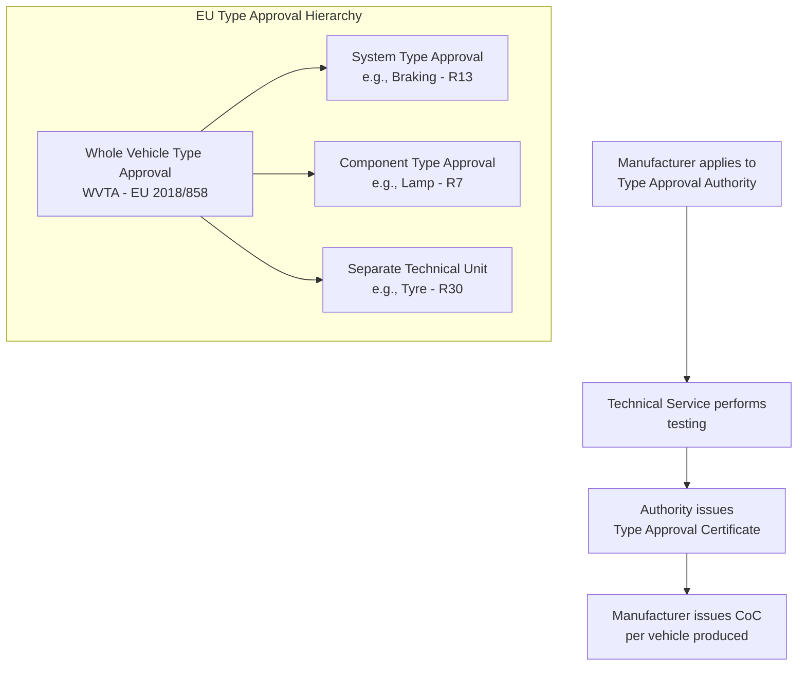
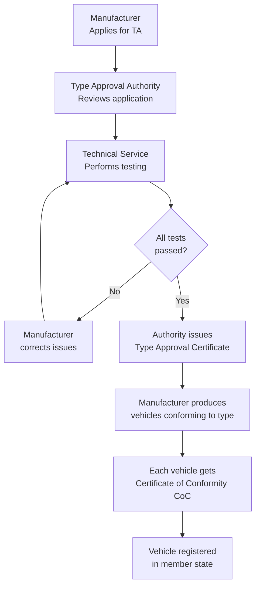
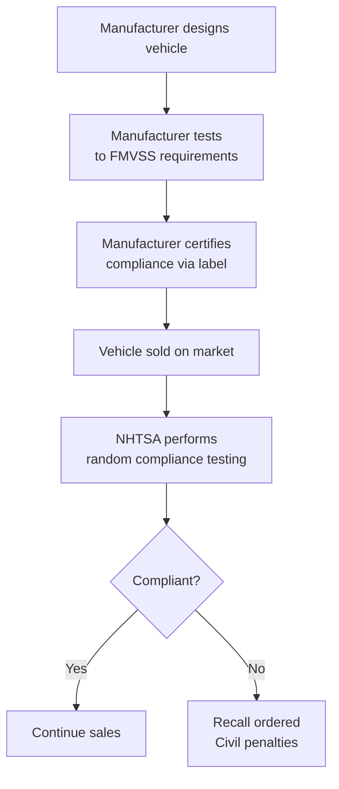
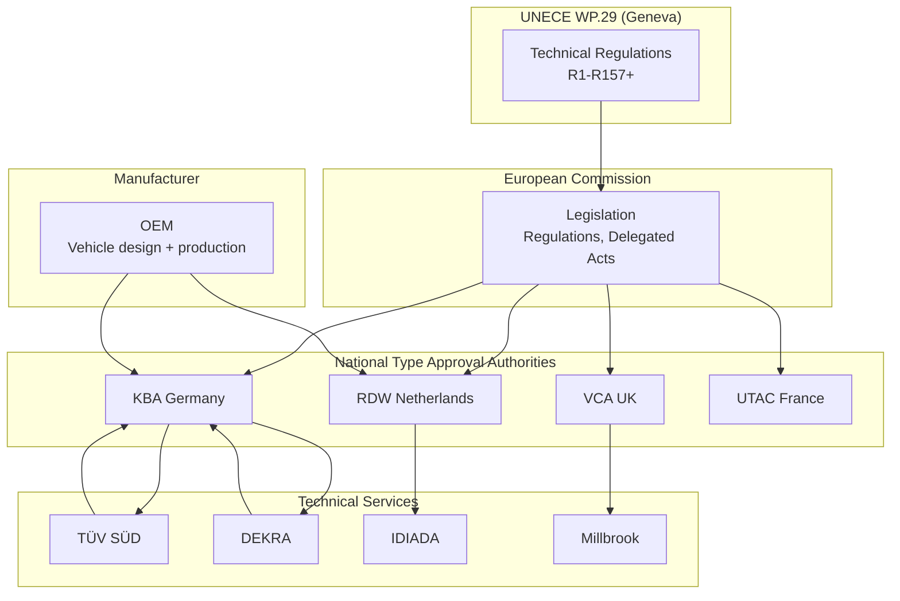
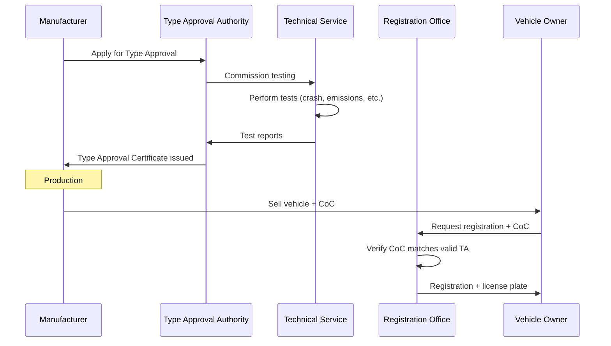
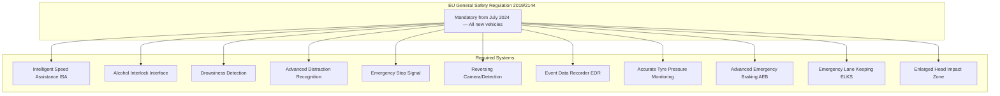

# Vehicle Type Approval — International Framework

**Topic:** Vehicle Type Approval — Regulatory Framework for Placing Vehicles on Market  
**Standard:** UNECE 1958 Agreement, EU 2018/858, FMVSS (US), GB Standards (China)  
**SDO:** UNECE WP.29 / European Commission / NHTSA / National Authorities  
**Audience:** Homologation engineers, regulatory affairs managers, OEM compliance teams, type approval engineers  
**Prerequisites:** Basic automotive regulations, vehicle categories (M/N/O/L), understanding of vehicle systems

---

## Chapter 1 — Historical Context & Origin Story

### 1.1 Timeline

| Year | Event | Impact |
|------|-------|--------|
| 1958 | UNECE Agreement on vehicle regulations | Mutual recognition framework |
| 1966 | US National Traffic and Motor Vehicle Safety Act | FMVSS created |
| 1968 | Vienna Convention on Road Traffic | International driving framework |
| 1970 | EC 70/156/EEC | EU Whole Vehicle Type Approval (WVTA) |
| 1998 | UNECE 1998 Agreement | Global Technical Regulations (GTR) |
| 2007 | EU Framework Directive 2007/46/EC | Modern EU type approval system |
| 2018 | EU Regulation 2018/858 | Strengthened after Dieselgate |
| 2020 | EU General Safety Regulation 2019/2144 | ADAS mandates |
| 2022 | UNECE R155/R156 | Cybersecurity/software update type approval |

### 1.2 The Two Global Systems

| System | Self-Certification (US) | Type Approval (EU/UNECE) |
|--------|------------------------|--------------------------|
| Philosophy | Manufacturer certifies compliance | Authority approves before sale |
| Verification | Post-market surveillance (NHTSA) | Pre-market testing + CoC |
| Liability | Manufacturer | Shared (manufacturer + authority) |
| Countries | USA, Canada | EU, Japan, Korea, Australia, + 50 UNECE |
| Regulations | FMVSS (Federal Motor Vehicle Safety Standards) | UNECE Regulations / EU Regulations |

---

## Chapter 2 — Standard Architecture & Structure

### 2.1 EU Type Approval Framework (2018/858)



### 2.2 Vehicle Categories

| Category | Description | Examples |
|----------|-------------|---------|
| M1 | Passenger vehicles (≤ 8 seats + driver) | Cars, SUVs |
| M2 | Buses (> 8 seats, ≤ 5 tonnes) | Minibus |
| M3 | Buses (> 8 seats, > 5 tonnes) | City bus, coach |
| N1 | Goods vehicles (≤ 3.5 tonnes) | Vans, pickup trucks |
| N2 | Goods vehicles (3.5 - 12 tonnes) | Medium trucks |
| N3 | Goods vehicles (> 12 tonnes) | Heavy trucks |
| O1-O4 | Trailers (by weight class) | Caravans, semi-trailers |
| L1-L7 | Two/three-wheeled vehicles, quadricycles | Motorcycles, ATVs |

### 2.3 Key UNECE Regulations for Modern Vehicles

| Regulation | Subject | Mandatory (EU) |
|-----------|---------|----------------|
| R10 | EMC (Electromagnetic Compatibility) | Yes |
| R13 | Braking (heavy vehicles) | Yes (N/O) |
| R13-H | Braking (passenger vehicles) | Yes (M1) |
| R14 | Safety belt anchorages | Yes |
| R16 | Safety belts | Yes |
| R21 | Interior fittings | Yes |
| R34 | Fire risks (fuel system) | Yes |
| R46 | Mirrors/indirect vision | Yes |
| R48 | Lighting installation | Yes |
| R79 | Steering | Yes |
| R94 | Frontal collision | Yes |
| R95 | Lateral collision | Yes |
| R100 | EV safety (battery, electrical) | Yes (BEV) |
| R137 | Frontal impact (new, replaces R94) | Yes (2024+) |
| R155 | Cybersecurity (CSMS) | Yes (2024) |
| R156 | Software updates (SUMS) | Yes (2024) |
| R157 | ALKS (Level 3 automated driving) | Optional |

---

## Chapter 3 — Technical Deep Dive

### 3.1 Type Approval Process (EU)



### 3.2 Whole Vehicle Type Approval (WVTA) Test Requirements

| Category | Tests Include |
|----------|-------------|
| Active safety | Braking, steering, lighting, tyres, ESC |
| Passive safety | Crash tests (frontal, side, rear), pedestrian protection |
| Environment | Emissions (WLTP), noise, recycling |
| EMC | Electromagnetic compatibility |
| Electrical safety | EV HV system, battery abuse tests |
| ADAS | AEB, lane departure, drowsiness detection |
| Cybersecurity | R155 (CSMS) + R156 (SUMS) |
| Software | OTA capability, RXSWIN |
| General | VIN, plates, masses, dimensions |

### 3.3 Conformity of Production (CoP)

| Aspect | Requirement |
|--------|-------------|
| Purpose | Ensure production vehicles match type-approved vehicle |
| Method | Statistical sampling + testing of production vehicles |
| Frequency | Initial assessment + periodic (annually or triggered) |
| Standard | ISO/TS 16949 (now IATF 16949) quality management |
| Authority role | May audit manufacturing facilities |
| Failure | Production must stop or recall if non-conformity found |

### 3.4 US Self-Certification (FMVSS)



### 3.5 Key FMVSS Standards

| FMVSS | Subject |
|-------|---------|
| 101 | Controls and displays |
| 108 | Lamps, reflectors |
| 126 | Electronic Stability Control |
| 135 | Light vehicle brake systems |
| 138 | Tire Pressure Monitoring |
| 208 | Occupant crash protection (airbags) |
| 214 | Side impact protection |
| 216 | Roof crush resistance |
| 301 | Fuel system integrity |
| 305 | EV electrolyte spillage |
| 500 | Low-speed vehicles |

---

## Chapter 4 — Implementation Guide

### 4.1 Type Approval Planning Timeline

| Phase | Duration | Activities |
|-------|----------|-----------|
| Regulation analysis | 6-12 months before SOP | Identify applicable regulations for target markets |
| Design for compliance | 24-36 months before SOP | Integrate requirements into vehicle design |
| Pre-testing | 12-18 months before SOP | Prototype testing at technical service labs |
| Formal testing | 6-12 months before SOP | Official TA test campaign |
| Certificate issuance | 3-6 months before SOP | Authority review + approval |
| CoP setup | Before SOP | Production quality verification process |
| Market registration | SOP | First vehicles registered in target countries |

### 4.2 Multi-Market Homologation Strategy

| Market | Approach | Key Differences |
|--------|----------|-----------------|
| EU (27 states) | Single WVTA valid in all states | Most comprehensive TA |
| UK (post-Brexit) | GB type approval (separate from EU) | Similar to EU but diverging |
| Japan | UNECE regulations accepted | Some additional Japanese standards |
| Korea | UNECE + Korean specific | KMVSS (Korean Motor Vehicle Safety Standards) |
| China | CCC (China Compulsory Certification) | GB standards, often based on UNECE |
| USA | Self-certification to FMVSS | Fundamentally different system |
| India | CMVR (Central Motor Vehicle Rules) | Mix of UNECE + India-specific |
| Australia | ADR (Australian Design Rules) | UNECE-based with variants |
| GCC | GSO conformity | Based on UNECE or mixed |

### 4.3 Extension of Type Approval

When vehicle changes after initial approval:

| Change Type | Action Required |
|-------------|----------------|
| Minor (color, trim) | No TA impact — CoC update only |
| Moderate (engine variant, new ECU) | Extension of existing TA |
| Major (new platform, structural change) | New type approval required |
| Software update (R156) | Assess per SUMS process → notify or extend |

---

## Chapter 5 — Certification & Audit

### 5.1 Type Approval Authorities (EU)

| Country | Authority | Abbreviation |
|---------|-----------|------------|
| Germany | Kraftfahrt-Bundesamt | KBA |
| France | UTAC (technical) + CNRV (authority) | UTAC |
| Netherlands | Dienst Wegverkeer | RDW |
| UK | Vehicle Certification Agency | VCA |
| Italy | Ministero dei Trasporti | MIT |
| Spain | IDIADA (technical) | IDIADA |
| Sweden | Transportstyrelsen | STA |
| Luxembourg | SNCH | SNCH |

### 5.2 Technical Services (Testing Labs)

| Organization | Location | Specialization |
|-------------|----------|---------------|
| TÜV SÜD | Germany | Full vehicle testing |
| TÜV Rheinland | Germany | EMC, electronics |
| DEKRA | Germany | Crash, braking |
| UTAC CERAM | France | Full vehicle, WLTP |
| IDIADA | Spain | Full vehicle testing |
| Millbrook | UK | Proving ground, emissions |
| HORIBA MIRA | UK | Vehicle dynamics, ADAS |
| RDW (also authority) | Netherlands | Heavy vehicles |

### 5.3 Post-Dieselgate Reforms (EU 2018/858)

| Reform | Purpose |
|--------|---------|
| Market surveillance | Authorities can test vehicles already on market |
| Peer review of authorities | TAAs reviewed by other TAAs |
| Technical service oversight | Stricter requirements for test labs |
| Penalties | Up to €30,000 per non-compliant vehicle |
| Defeat device prohibition | Explicit ban with strict definition |
| In-service conformity | Real-world emission testing (RDE) |
| Recall powers | Authority can order recalls EU-wide |

---

## Chapter 6 — Regional & Domain Variants

### 6.1 Comparison of Global Systems

| Aspect | EU WVTA | US FMVSS | China CCC | Japan |
|--------|---------|----------|-----------|-------|
| Approach | Pre-market approval | Self-certification | Pre-market (CCC mark) | UNECE + national |
| Authority | National TAA | NHTSA (post-market) | CNCA/CQC | MLIT |
| Testing | Technical Service | Manufacturer (+ NHTSA spot checks) | Designated labs | Designated agencies |
| Certificate | TA certificate + CoC | Compliance label | CCC certificate | Type designation |
| Recall trigger | Authority order | NHTSA investigation or voluntary | SAMR order | MLIT order |
| International recognition | UNECE mutual recognition | Not recognized outside US/Canada | Bilateral agreements | UNECE + Japan |
| Right-hand drive | Both LHD/RHD | LHD (+ RHD for USVI) | LHD | RHD |

---

## Chapter 7 — Comparison: Type Approval vs. Self-Certification

| Aspect | Type Approval (EU) | Self-Certification (US) |
|--------|-------------------|------------------------|
| Pre-market testing | Mandatory (by technical service) | Manufacturer responsibility |
| Government role | Approve BEFORE market | Enforce AFTER market |
| Cost to manufacturer | High (testing fees, applications) | Lower (internal testing) |
| Time to market | Longer (approval process) | Faster (no waiting for authority) |
| Flexibility | Low (must get extension for changes) | High (self-certify variants) |
| Public safety | Preventive (catch before sale) | Reactive (recall after issues) |
| Recall frequency | Lower (pre-screened) | Higher (less pre-screening) |
| Innovation speed | Slower (regulation follows technology) | Faster (technology can lead) |
| Accountability | Shared (OEM + authority) | Primarily manufacturer |

---

## Chapter 8 — Mermaid Architecture Diagrams

### 8.1 EU Type Approval Ecosystem



### 8.2 Vehicle Registration Flow



### 8.3 ADAS Type Approval (2024+)



---

## Chapter 9 — Case Studies & Failure Analysis

### 9.1 Dieselgate — Type Approval System Failure

**Event (2015):** VW programmed diesel vehicles to detect test conditions and activate emission controls only during type approval testing.

**System failures:**
- Technical services tested on dynamometer only (controlled conditions)
- No real-world driving emission verification (pre-RDE)
- Defeat device not detected during type approval process
- Authority (KBA) didn't question suspiciously low emissions vs. competitors

**Regulatory response:**
- EU 2018/858: strengthened oversight, market surveillance, peer review
- Real Driving Emissions (RDE) testing mandatory
- In-service conformity testing
- Higher penalties (€30,000/vehicle)
- Technical service independence requirements strengthened

### 9.2 Multi-Market Homologation Challenge

**Scenario:** OEM launching new BEV globally (EU, US, China, Korea, Japan) simultaneously.

**Challenges:**
- EU: WVTA (comprehensive), R100 (EV safety), R155 (cyber), R156 (OTA), GSR (ADAS)
- US: FMVSS 305 (electrolyte), FMVSS 208 (different crash requirements), no cybersecurity regulation
- China: GB 18384 (EV safety — different from R100), GB/T 40857 (cybersecurity), CCC mark
- Different crash test configurations (NHTSA vs. Euro NCAP vs. C-NCAP)
- Different charging standards (CCS/Type 2 in EU, CCS1 in US, GB/T in China)

**Solution approach:**
- Design to most stringent requirement from all markets (superset design)
- Where requirements conflict: market-specific variants (e.g., lighting, crash structure)
- Platform sharing: common safety structure, variant-specific front/rear
- Software variants: market-specific ADAS features (regional regulation differences)

---

## Chapter 10 — Future Evolution & Industry Trends

| Trend | Impact on Type Approval |
|-------|------------------------|
| SDV (Software Defined Vehicle) | Continuous updates challenge static TA model |
| Autonomous driving (L3+) | New TA categories (R157, future L4 regulation) |
| Cybersecurity (R155) | New competence required at TAAs |
| AI in vehicles | How to type-approve ML/AI systems? (non-deterministic) |
| OTA updates | R156 framework, but SDV needs evolution |
| International harmonization | GTR process, US-EU alignment attempts |
| Digital type approval | Electronic submissions, digital twins for testing |
| Sustainability | End-of-life vehicle regulation, battery passports |
| Micro-mobility | New vehicle categories (e-scooters, LEVs) |
| Chinese EVs in EU | Market surveillance of new entrants |

---

## Chapter 11 — Interview Questions & Career Guide

### Tier 1: Entry-Level (0-3 years)

**Q1:** What is the difference between type approval and self-certification?  
**A:** Two fundamentally different regulatory philosophies: **Type Approval (EU/UNECE):** Government authority must approve vehicle BEFORE it can be sold. Process: manufacturer applies → technical service tests → authority reviews and issues certificate. Vehicle cannot be sold without valid Type Approval Certificate + Certificate of Conformity (CoC) for each produced unit. Pre-market control. **Self-Certification (US/FMVSS):** Manufacturer certifies that their vehicle meets all applicable standards. No government pre-approval. Manufacturer affixes compliance label. NHTSA performs random post-market testing. If non-compliant → recall + civil penalties ($). Post-market enforcement. Key implications: Type approval = slower to market but fewer recalls. Self-certification = faster innovation but more recalls and enforcement actions.

### Tier 2: Mid-Level (3-8 years)

**Q2:** Plan the homologation strategy for a new EV platform launching in EU, US, and China within the same year.  
**A:** (1) **Regulation mapping:** Create master compliance matrix: rows = vehicle systems (braking, lighting, crash, electrical, ADAS, cybersecurity), columns = markets (EU, US, China). For each cell: applicable regulation + specific requirements. Identify conflicts (e.g., US headlight rules ≠ EU = different lamp designs). (2) **Design decisions:** Common platform: crash structure designed to pass FMVSS 208/214 AND R137/R95 (US more stringent for occupant protection, EU for pedestrian protection). Battery: R100 (EU) + FMVSS 305 (US) + GB 18384 (China) — GB 18384 has unique nail penetration test → design battery to pass all. Charging: CCS2 (EU), CCS1 (US), GB/T (China) — physically different connectors → variant. (3) **Testing sequence:** Start testing 18 months before SOP. Phase 1: common tests (crash tests applicable to all markets simultaneously at one lab). Phase 2: market-specific (EU WLTP at UTAC, EPA range/consumption in US, CATARC for China). Phase 3: cybersecurity (R155 for EU/Korea, GB/T 40857 for China). (4) **Authority engagement:** EU: select one TAA (e.g., KBA or RDW) for WVTA — valid across all 27 states. US: no authority engagement (self-certification). Letter to NHTSA at launch. China: CCC application to CNCA, testing at CATARC/CAERI. (5) **Production:** Single production line with market variants (connectors, software config, some lighting). CoP (Conformity of Production) plan covers all markets.

### Tier 3: Senior/Lead (8-15 years)

**Q3:** How do you manage type approval for a vehicle with OTA-updateable ADAS that changes behavior post-sale?  
**A:** (1) **R156 SUMS framework:** Manufacturer must have certified SUMS (Software Update Management System). Every update assessed: does it affect type-approved function? Classification: no impact → deploy. Minor impact → notify authority. Major impact → TA extension before deployment. (2) **Pre-approved change space:** Negotiate with TAA upfront: define boundaries for ADAS algorithm changes that don't require re-approval. Example: "AEB detection threshold improvement within X-Y range = no TA impact." "AEB activation at higher speed = TA extension required." Document as part of type approval technical documentation. (3) **RXSWIN management:** Each ADAS software version has RXSWIN (Regulation-specific software ID). Track relationship: RXSWIN version → TA certificate → vehicles produced. When update deployed: new RXSWIN → link to existing or new TA. Database: VIN → current RXSWIN → linked TA certificate. (4) **Testing strategy:** Maintain type approval test setup permanently (not just for initial approval). Each significant update: regression test against TA requirements. Automated test bench: Euro NCAP scenarios + regulation scenarios. If update changes TA-relevant behavior → re-run formal tests at technical service. (5) **Authority relationship:** Proactive reporting: inform TAA of planned update roadmap quarterly. Build trust: demonstrate transparent process and quality evidence. Annual SUMS surveillance: show evidence of proper classification decisions.

### Tier 4: Principal/Distinguished (15+ years)

**Q4:** The current type approval system was designed for hardware-centric vehicles. How should it evolve for software-defined vehicles?  
**A:** Fundamental mismatch: current TA = static snapshot ("this hardware + this software = approved"). SDV = continuous evolution ("hardware constant, software changes weekly"). (1) **Proposed new model: Continuous Compliance Attestation:** Replace: point-in-time certificate. With: continuous compliance monitoring. Vehicle continuously demonstrates it meets requirements (via telemetry, self-test). Authority has real-time dashboard: fleet compliance status. Certificate becomes conditional: "compliant as long as monitoring confirms." (2) **Sandbox approach for AI/ML:** Current: deterministic systems → test all scenarios. AI/ML: non-deterministic → cannot test all scenarios. Proposed: statistical safety argument + bounded operational envelope. AI system approved with: defined ODD, minimum performance metrics, runtime monitoring. If metrics degrade → automatic restriction (degrade to approved baseline). (3) **Modular type approval:** Current: whole vehicle TA (monolithic). SDV: modular TA per software function. Each function approved independently (with interface contracts). Update one function → re-approve only that function (not whole vehicle). Enables faster update cycles. (4) **Digital twin testing:** Instead of physical tests for every change → digital twin validation. Authority accepts simulation results for pre-defined change categories. Physical testing reserved for: new hardware, major algorithm changes, boundary cases. Requires: validated simulation models (correlation to physical proven). (5) **International challenge:** US has no equivalent to R155/R156 → no consistent global approach. China developing own framework → potential fragmentation. Need: global agreement on software/AI vehicle regulation (challenging politically). (6) **Timeline:** Current R155/R156 adequate for 2024-2028 (OTA with manual assessment). 2028-2032: continuous compliance framework pilot (maybe EU-only initially). 2032+: AI-specific regulation (results of ongoing working groups). Full transformation: 10-15 years (regulatory change is slow by design — safety critical).

---

## Chapter 12 — Cheat Sheet & Quick Reference

### EU Type Approval Essential Steps

```
1. Identify vehicle category (M1, N1, etc.)
2. Determine applicable regulations (Annex II of 2018/858)
3. Select Type Approval Authority (any EU member state)
4. Select Technical Service(s) for testing
5. Prepare information document + test vehicles
6. Complete all testing (crash, emissions, EMC, ADAS, cyber...)
7. Receive Type Approval Certificate from authority
8. Set up Conformity of Production (CoP)
9. Issue Certificate of Conformity (CoC) per vehicle
10. Register vehicles in target markets using CoC
```

### Key EU Regulations for Modern Vehicles

```
Safety:     R13-H (brakes), R79 (steering), R137 (frontal crash)
EV:         R100 (electrical safety), R136 (EV specific)
ADAS:       EU 2019/2144 (GSR), R157 (ALKS)  
Cyber:      R155 (CSMS), R156 (SUMS)
Emissions:  EU 2019/631 (CO2), R83/R154 (pollutant)
Lighting:   R48 (installation), R112/R128 (headlamps)
EMC:        R10 (electromagnetic compatibility)
Tyres:      R30 (pneumatic), R117 (noise)
```

### Document Numbering

```
Type Approval Certificate number format (EU):
  e[country code]*[regulation number]/[sequence]

Example: e1*2018/858*12345/01
  e1 = Germany
  2018/858 = EU WVTA regulation
  12345 = sequential number
  01 = extension number
```

---

*End of Document — 14_Vehicle_Type_Approval.md*
