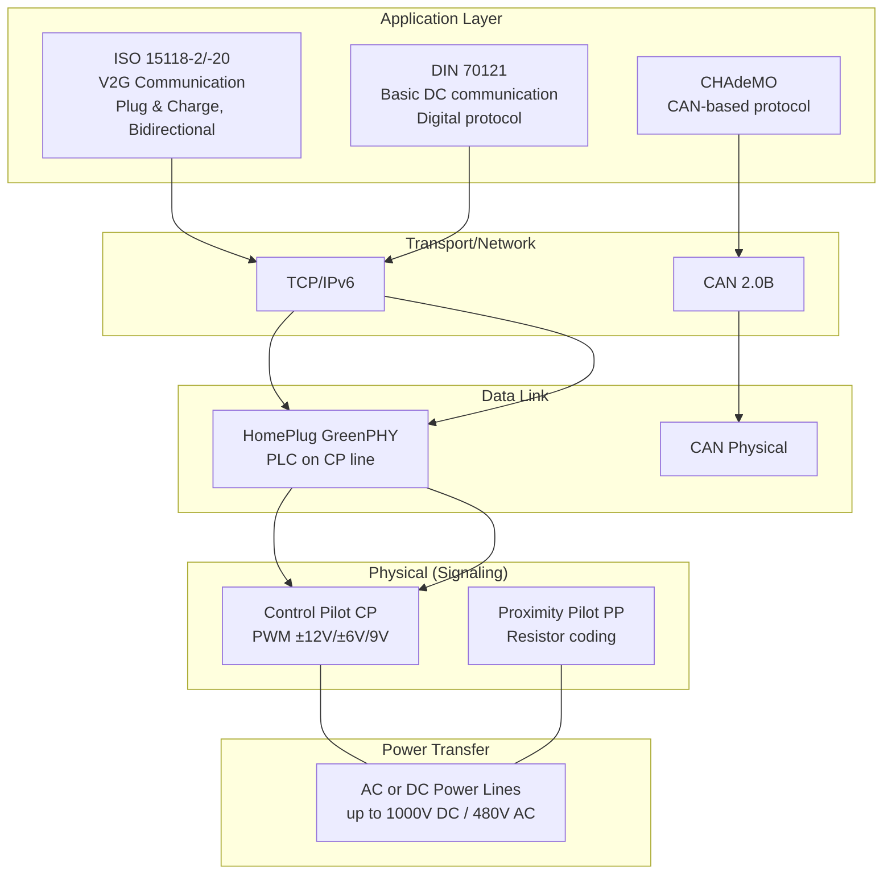
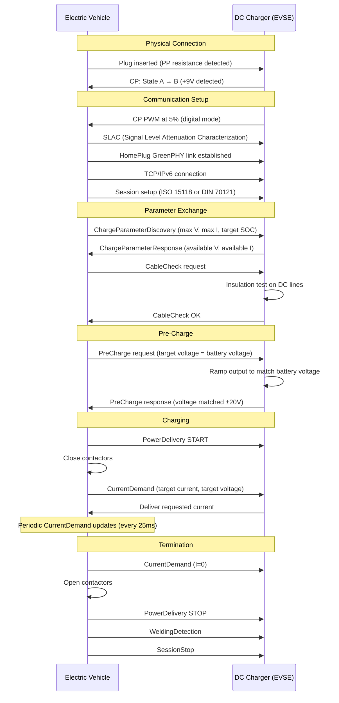
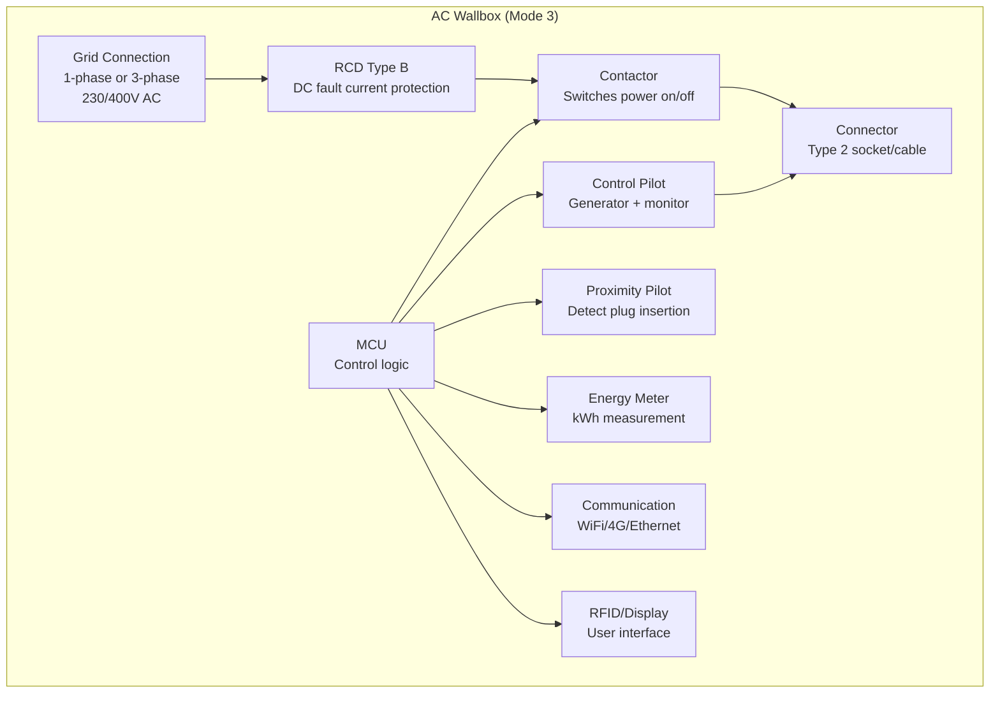
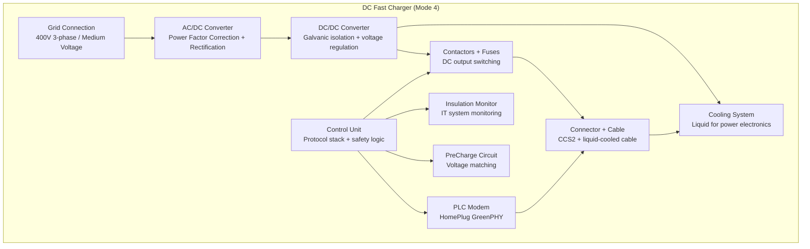
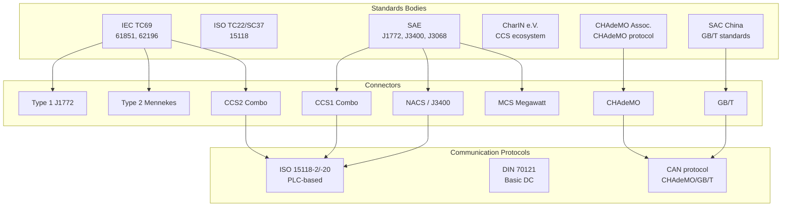
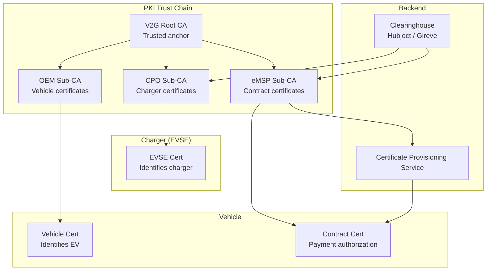
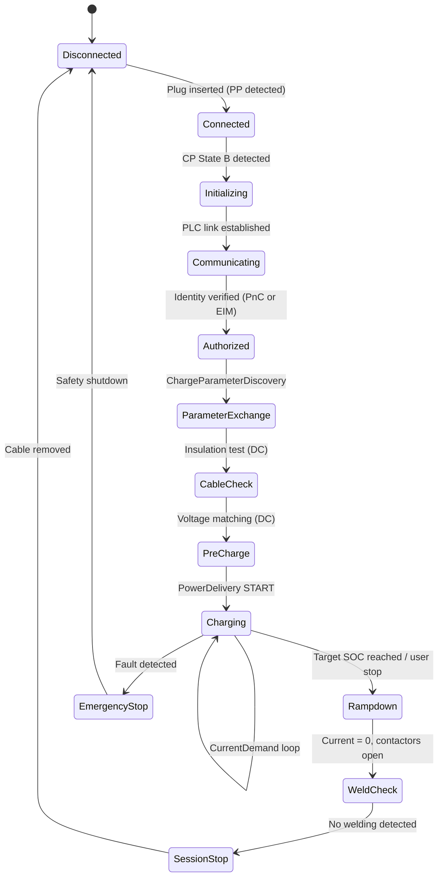

# EV Charging Standards — IEC 61851 & Related

**Topic:** Electric Vehicle Charging Standards — Conductive Charging Systems, Connectors, Communication Protocols  
**Standard:** IEC 61851 (Conductive Charging), IEC 62196 (Plugs/Connectors), ISO 15118 (V2G Communication), DIN 70121  
**SDO:** IEC TC69 / ISO TC22/SC37 / SAE / CHAdeMO Association / CharIN e.V.  
**Audience:** EV powertrain engineers, EVSE developers, charging infrastructure architects, BMS engineers  
**Prerequisites:** Power electronics basics, automotive HV systems (R100), CAN/PLC communication, electrical safety

---

## Chapter 1 — Historical Context & Origin Story

### 1.1 Timeline

| Year | Event | Impact |
|------|-------|--------|
| 1996 | SAE J1772 (original — inductive) | First EV charging standard |
| 2001 | IEC 61851-1 Ed1 | International conductive charging framework |
| 2003 | CHAdeMO Association formed (Japan) | First DC fast charging standard |
| 2009 | SAE J1772 (conductive, Type 1 connector) | North American AC standard |
| 2010 | IEC 62196-2 (Type 2 / Mennekes connector) | EU AC connector standard |
| 2012 | Combined Charging System (CCS) announced | DC + AC in one connector |
| 2014 | ISO 15118-2 published | Plug & Charge (V2G communication) |
| 2015 | Tesla Supercharger V2 (proprietary) | Fastest charging at the time |
| 2017 | CCS2 mandatory for new EVs in EU | EU standardization on CCS |
| 2018 | CHAdeMO 2.0 (400 kW) | Ultra-high-power DC |
| 2020 | GB/T 20234 (China connector/protocol) | Mandatory Chinese standard |
| 2022 | NACS (Tesla connector) opened as standard | North American standardization shift |
| 2023 | SAE J3400 (NACS adopted as SAE standard) | Ford, GM, others adopt NACS |
| 2024 | Megawatt Charging System (MCS) — SAE J3068 | Heavy-duty truck charging |
| 2024 | ChaoJi (China-Japan collaboration) | Next-gen global DC standard |

### 1.2 The Connector Wars

| Connector | Region | Type | Max Power | Status |
|-----------|--------|------|-----------|--------|
| Type 1 (J1772) | North America, Japan | AC only | 19.2 kW (80A) | Legacy |
| Type 2 (Mennekes) | Europe | AC | 43 kW (63A, 3-phase) | Standard |
| CCS1 (Combo 1) | North America | AC + DC | 350 kW | Standard (legacy?) |
| CCS2 (Combo 2) | Europe | AC + DC | 350 kW | Standard |
| CHAdeMO | Japan (global) | DC only | 400 kW | Declining |
| GB/T | China | AC + DC (separate) | 250 kW+ | Mandatory in China |
| NACS (J3400) | North America | AC + DC | 350 kW+ | New standard |
| Tesla (proprietary) | Global (legacy) | AC + DC | 250 kW | Being replaced by NACS |
| MCS | Global (trucks) | DC only | 3.75 MW | Emerging |
| ChaoJi | China + Japan | DC | 900 kW | Development |

---

## Chapter 2 — Standard Architecture & Structure

### 2.1 IEC 61851 Series Structure

| Part | Title | Content |
|------|-------|---------|
| IEC 61851-1 | General requirements | Charging modes, safety, system architecture |
| IEC 61851-21-1 | EMC requirements (on-board) | EMC for vehicle-side equipment |
| IEC 61851-21-2 | EMC requirements (off-board) | EMC for EVSE |
| IEC 61851-23 | DC charging station | Requirements for DC EVSE |
| IEC 61851-24 | DC charging — digital communication | Control protocol for DC charging |

### 2.2 Charging Modes (IEC 61851-1)

| Mode | Description | Max Current | Protection | Use Case |
|------|-------------|-------------|------------|----------|
| Mode 1 | Standard socket, no communication | 16A | None (RCD only) | Banned in most countries |
| Mode 2 | Standard socket + IC-CPD (in-cable control) | 32A | IC-CPD (in-cable control pilot device) | Emergency/portable charging |
| Mode 3 | Dedicated EVSE with control pilot | 63A (3-phase) | EVSE with CP + PP | Home/public AC wallbox |
| Mode 4 | DC charging (off-board charger) | 400A+ | EVSE with full protocol | DC fast charging |

### 2.3 Protocol Stack for EV Charging



---

## Chapter 3 — Technical Deep Dive

### 3.1 Control Pilot (CP) Signal — IEC 61851-1

The Control Pilot is a ±12V, 1 kHz PWM signal used for basic communication between EVSE and vehicle.

| State | Voltage (positive) | Meaning |
|-------|-------------------|---------|
| A | +12V (no PWM) | No vehicle connected |
| B | +9V / -12V | Vehicle connected, not ready |
| C | +6V / -12V | Vehicle ready, charging permitted |
| D | +3V / -12V | Ventilation required (lead-acid) |
| E | 0V | Error — no power supply |
| F | -12V | EVSE not available |

**PWM Duty Cycle encodes available current:**

$$I_{available} = \begin{cases} \text{Duty Cycle} \times 0.6\text{A} & \text{if } 10\% \leq DC \leq 85\% \\ (\text{Duty Cycle} - 64) \times 2.5\text{A} & \text{if } DC > 85\% \end{cases}$$

| Duty Cycle | Available Current | Notes |
|-----------|------------------|-------|
| 10% | 6A | Minimum |
| 16.7% | 10A | |
| 25% | 15A | |
| 33.3% | 20A | |
| 50% | 30A | Common residential |
| 66.7% | 40A | |
| 83.3% | 50A | |
| 96% | 80A | Maximum for Mode 3 |
| 5% | Digital communication active | ISO 15118/DIN 70121 |

### 3.2 DC Fast Charging — Power Delivery Sequence



### 3.3 ISO 15118 — Plug & Charge (PnC)

| Feature | Description |
|---------|-------------|
| Purpose | Automatic authentication + payment without RFID/app |
| Mechanism | TLS mutual authentication using X.509 certificates |
| Certificate chain | Root CA → OEM CA → Contract Certificate (installed in vehicle) |
| Payment | EV presents contract certificate → EVSE verifies → charges account |
| No user action | Plug in = authenticated + authorized + charging starts |
| PKI ecosystem | Hubject (EU clearinghouse), Gireve, various national |

### 3.4 Bidirectional Charging (V2G, V2H, V2L)

| Type | Direction | Standard | Use Case |
|------|-----------|----------|----------|
| V2G (Vehicle-to-Grid) | EV → Grid | ISO 15118-20 | Grid stabilization, frequency regulation |
| V2H (Vehicle-to-Home) | EV → House | ISO 15118-20 | Home backup power |
| V2L (Vehicle-to-Load) | EV → Appliances | Proprietary | Camping, tools, emergency |
| V1G (Smart charging) | Grid → EV (controlled) | ISO 15118-2/-20 | Load management, off-peak |

### 3.5 Power Levels Comparison

| Level | Voltage | Current | Power | Time (60 kWh) |
|-------|---------|---------|-------|---------------|
| AC Level 1 (US Mode 2) | 120V/1-phase | 12-16A | 1.4-1.9 kW | 30-40 hours |
| AC Level 2 (Mode 3) | 240V/1-phase | 32-48A | 7.7-11.5 kW | 5-8 hours |
| AC Level 2 (EU 3-phase) | 400V/3-phase | 16-32A | 11-22 kW | 3-5 hours |
| DC Level 1 (Mode 4) | 200-500V | 80A | 50 kW | 1.2 hours |
| DC Level 2 (Mode 4) | 200-500V | 200A | 100 kW | 36 min |
| DC Level 3 (HPC) | 200-920V | 500A | 350 kW | 10-15 min (10-80%) |
| MCS (trucks) | 1250V | 3000A | 3750 kW | 30-45 min (truck) |

---

## Chapter 4 — Implementation Guide

### 4.1 EVSE Architecture (AC Wallbox)



### 4.2 DC Fast Charger Architecture



### 4.3 Vehicle-Side Charging Architecture

| Component | Function |
|-----------|----------|
| Inlet (connector) | Physical connection (Type 2, CCS2, GB/T) |
| On-Board Charger (OBC) | AC/DC conversion (3.3-22 kW typical) |
| Battery Management System (BMS) | SOC, temp, voltage monitoring + charge control |
| HV battery | Energy storage (400V or 800V system) |
| Charge Control Module | Protocol handling (ISO 15118 stack) |
| PLC modem | HomePlug GreenPHY communication |
| CP/PP interface | Basic signaling (analog pilot signals) |
| HV contactors | Connect/disconnect battery from inlet |
| DC-DC converter | HV to 12V for accessories during charging |

---

## Chapter 5 — Certification & Audit

### 5.1 EVSE Certification Requirements

| Certification | Scope | Market |
|---------------|-------|--------|
| IEC 61851-1 | General safety requirements | International |
| IEC 61851-21-2 | EMC (EVSE) | International |
| IEC 62196-1/-2/-3 | Connector safety + interoperability | International |
| EN 61439-7 | Low-voltage switchgear for EVSE | Europe |
| UL 2594 | EVSE safety (US equivalent) | North America |
| UL 2202 | DC charging equipment | North America |
| OCPP compliance | Open Charge Point Protocol | Network operators |
| ISO 15118 conformance | V2G communication | Plug & Charge |
| CharIN certification | CCS interoperability | CCS ecosystem |

### 5.2 Interoperability Testing

| Test Level | What's Tested | Who Tests |
|-----------|---------------|-----------|
| PHY layer | PLC signal quality, CP waveform | Specialized labs |
| Protocol | ISO 15118 message sequence | CharIN test system |
| System | Full charge session (plug → charge → stop) | OEM + EVSE cross-testing |
| PKI | Certificate validation, Plug & Charge | Hubject test environment |
| Grid | Power quality, harmonics, power factor | Grid operator requirements |

---

## Chapter 6 — Regional & Domain Variants

### 6.1 Connector Standards by Region (2024)

| Region | AC Connector | DC Connector | Mandate |
|--------|-------------|-------------|---------|
| EU/UK | Type 2 (IEC 62196-2) | CCS2 (IEC 62196-3 Config FF) | AFIR: CCS2 mandatory at public DC |
| North America | Type 1 (J1772) / NACS | CCS1 / NACS (J3400) | Shifting to NACS |
| Japan | Type 1 (J1772) | CHAdeMO / CCS1 | CHAdeMO declining |
| China | GB/T 20234.2 (AC) | GB/T 20234.3 (DC) | National mandatory standard |
| Korea | Type 2 + Type 1 | CCS2 (DC Combo) | CCS2 DC mandatory |
| India | Type 2 (AC) / Bharat AC/DC | CCS2 (DC) | Mixed standards |

### 6.2 Grid Differences Affecting Charging

| Region | Residential Grid | Max Home Charging | 3-Phase Available |
|--------|-----------------|-------------------|-------------------|
| EU | 230V, 1/3-phase | 11-22 kW (3-phase 32A) | Yes (residential) |
| US | 120/240V split-phase | 11.5 kW (240V, 48A) | No (residential) |
| Japan | 100/200V | 6 kW (200V, 30A) | Rare (residential) |
| China | 220V, 1-phase | 7 kW (220V, 32A) | Industrial only |

---

## Chapter 7 — Comparison: DC Fast Charging Systems

| Aspect | CCS (Combo) | CHAdeMO | GB/T | NACS (Tesla/J3400) |
|--------|-------------|---------|------|------|
| Origin | EU/US industry (CharIN) | Japan (TEPCO/Nissan) | China (SAC) | Tesla (US) |
| Communication | ISO 15118 (PLC) | CAN-based | CAN-based | ISO 15118 (PLC) |
| Max voltage | 920V (CCS2) | 1000V (CHAdeMO 3.0) | 750V (current) | 920V |
| Max current | 500A | 400A | 250A (current) | 615A |
| Max power | 350 kW | 400 kW | 187.5 kW (current) | 350 kW+ |
| Bidirectional (V2G) | ISO 15118-20 (specified) | Supported (V2H in Japan) | ChaoJi (planned) | Planned |
| AC integrated | Yes (same connector) | No (separate Type 1/2) | No (separate GB/T AC) | Yes (same connector) |
| Connector size | Large (CCS2 especially) | Large | Large | Small (compact) |
| Global adoption | EU, US (declining?), Korea, India | Japan (declining globally) | China (world's largest) | US (growing rapidly) |
| Plug & Charge | Yes (ISO 15118 PnC) | No | Planned | Yes |
| Liquid-cooled cable | Yes (350 kW) | Yes | Yes | Yes |
| Future | CCS → potential NACS merge (NA) | → ChaoJi | → ChaoJi | Becoming NA standard |

---

## Chapter 8 — Mermaid Architecture Diagrams

### 8.1 Global Charging Standard Ecosystem



### 8.2 ISO 15118 Plug & Charge PKI



### 8.3 Charging Session State Machine



---

## Chapter 9 — Case Studies & Failure Analysis

### 9.1 Interoperability Failure — CCS Communication Timeout

**Problem:** Certain EV models failing to start charging at specific EVSE brands. Session starts, PLC link established, but terminates during ChargeParameterDiscovery.

**Root cause:** ISO 15118-2 timing parameter interpretation mismatch. EV implementation: V2G_SECC_Sequence_Timeout = 60s (total session setup). EVSE implementation: per-message timeout = 2s (stricter interpretation). Slow certificate verification on EV (old hardware) took 3-5s → EVSE timeout.

**Lesson:** Interoperability testing across OEM/EVSE combinations essential. CharIN Testival events exist for exactly this reason. Implementation must handle timing generously for robustness.

### 9.2 Liquid-Cooled Cable Failure

**Problem:** 350 kW HPC charger cable overheating, triggering thermal shutdown at 200 kW.

**Root cause:** Coolant pump degradation over time. Flow rate reduced 40%. Cable conductor temperature rose above limit at high current. Safety system correctly derated power.

**Design lesson:** Monitor: coolant flow rate + temperature differential + cable sensor. Predictive maintenance: trending flow rate over months. Redundancy: dual temperature sensors (safety-critical).

---

## Chapter 10 — Future Evolution & Industry Trends

| Trend | Timeline | Impact |
|-------|----------|--------|
| NACS dominance (North America) | 2024-2026 | CCS1 phased out, NACS becomes standard |
| ChaoJi (China + Japan) | 2025-2030 | 900 kW, potential global standard |
| MCS for trucks | 2025-2027 | 3.75 MW enables long-haul BEV trucks |
| ISO 15118-20 (V2G) | 2024-2028 | Bidirectional power flow, grid services |
| Wireless charging (WPT) | 2025-2030 | SAE J2954, 11 kW → 22 kW inductive |
| 800V architecture mainstream | 2024-2026 | Faster charging (higher voltage = lower current for same power) |
| Automated charging (robots) | 2026-2030 | Autonomous vehicles need robot chargers |
| Battery swapping (China) | 2024+ | NIO/CATL standard, 3-minute "refuel" |
| Smart charging (V1G) | Now | Mandatory in some regions (UK) |
| Solar + storage integrated | Now | EVSE with PV + battery buffer |

---

## Chapter 11 — Interview Questions & Career Guide

### Tier 1: Entry-Level (0-3 years)

**Q1:** Explain the difference between Mode 2, Mode 3, and Mode 4 charging.  
**A:** **Mode 2 (IC-CPD):** Standard household socket (Schuko/NEMA) + special cable with In-Cable Control and Protection Device. Max 32A. The "protection" is in the cable (detects faults, limits current). Used for: emergency/overnight home charging where no wallbox installed. Limitations: slow, depends on socket quality, no communication beyond basic CP. **Mode 3 (Dedicated EVSE — AC):** Purpose-built charging station (wallbox). Dedicated circuit with proper protection. Control Pilot communication (PWM encodes available current). Vehicle's on-board charger (OBC) converts AC → DC for battery. Power: 3.7 kW (1-phase 16A) to 22 kW (3-phase 32A) typical home/destination. Up to 43 kW (63A 3-phase) maximum. **Mode 4 (DC Fast Charging):** EVSE contains high-power AC/DC converter. DC fed directly to battery (bypasses on-board charger). Full digital communication protocol (ISO 15118 or CAN-based). Power: 50 kW to 350 kW current, up to 3.75 MW (MCS). Key difference: in Mode 3, the charger is IN the car (OBC). In Mode 4, the charger is the STATION — car battery is charged directly.

### Tier 2: Mid-Level (3-8 years)

**Q2:** Design the pre-charge sequence for a DC fast charger connecting to an 800V EV. What safety checks are required?  
**A:** Pre-charge purpose: match EVSE output voltage to battery voltage BEFORE closing vehicle contactors. If contactors close with large voltage difference → inrush current → contactor welding/arcing. **Sequence:** (1) **Insulation test (CableCheck):** Before any voltage on DC lines, EVSE applies test voltage (500V typically) and measures insulation resistance between DC+ vs. PE, DC- vs. PE. Required: > 100 Ω/V → for 1000V system = > 100 kΩ. If fail: abort (cable damage, water ingress). (2) **Pre-charge start:** EV sends PreCharge request with target voltage = current battery voltage (e.g., 750V). EVSE ramps output voltage gradually (controlled dV/dt, typically 10-20V/s) toward target. Output current limited (typically < 2A during pre-charge). (3) **Voltage matching:** EV monitors EVSE output voltage (reported in PreCharge response). When |EVSE_voltage - Battery_voltage| < 20V → voltage matched. EV sends PowerDelivery START → closes contactors. If voltage doesn't match within timeout (e.g., 7s): abort. (4) **For 800V system specifically:** Higher voltage → longer ramp time if dV/dt limited. Pre-charge circuit must be rated for 1000V (headroom). Insulation test more critical (higher voltage = higher risk). (5) **Safety checks throughout:** Contactor feedback: verify contactors actually open/closed (feedback loop). Welding detection: after session, verify contactors actually opened. Ground fault monitoring: continuous during entire session. Temperature monitoring: cable, connector, power electronics. Communication watchdog: if messages stop → emergency shutdown.

### Tier 3: Senior/Lead (8-15 years)

**Q3:** Architect an ISO 15118-20 implementation supporting V2G (bidirectional) charging for a fleet of 50 EVs providing grid services.  
**A:** (1) **System architecture:** Fleet management system (cloud) ↔ OCPP 2.0.1 ↔ 50× bidirectional EVSE ↔ 50× EVs. Grid operator ↔ fleet management (OpenADR 2.0 or EEBUS). Each EVSE: 22 kW bidirectional AC (V2G via OBC) or 50 kW bidirectional DC. (2) **ISO 15118-20 implementation:** BPT (Bidirectional Power Transfer) service: extends ISO 15118-20 DC_BPT or AC_BPT. EV advertises: min/max discharge power, min SOC limit, departure time. EVSE/backend calculates: optimal charge/discharge schedule. Real-time control: CurrentDemand with negative current = discharge. (3) **Grid service types:** Peak shaving: discharge during peak hours (17:00-21:00). Frequency regulation: fast response (< 2s) to grid frequency deviation. Demand response: reduce or increase load on signal. Energy arbitrage: charge cheap (night), discharge expensive (day). (4) **Revenue model:** Frequency regulation: $50-100/MW/h (most valuable, requires fast response). Peak shaving: $20-50/kW-month (capacity payment). Energy arbitrage: depends on price spread (typically $0.05-0.15/kWh). Battery degradation cost: ~$0.05-0.10/kWh throughput (must account for). Fleet ROI: 50 EVs × 10 kW average discharge × 4 hours/day × $0.15/kWh = $110/day revenue. (5) **Technical challenges:** Battery degradation: limit cycles, control SOC window (20-80%), monitor health (Ah throughput). Grid code compliance: power quality (THD < 5%), anti-islanding, voltage/frequency ride-through. PKI management: 50 contract certificates, regular renewal, revocation handling. Scheduling optimization: ML model predicting departure times + grid needs.

### Tier 4: Principal/Distinguished (15+ years)

**Q4:** Design the charging infrastructure architecture for a country transitioning to 100% EV sales by 2035.  
**A:** (1) **Demand modeling (example: medium European country, 5M vehicles):** 2025: 500K EVs, 2030: 2M EVs, 2035: 5M EVs (all new sales EV). Average daily consumption: 10 kWh/vehicle (15,000 km/year ÷ 5 km/kWh ÷ 365). Total daily energy 2035: 50 GWh/day additional (= ~20% increase on typical grid). Peak concurrent charging (worst case): 20% fleet = 1M vehicles × 7 kW avg = 7 GW. (2) **Grid infrastructure:** 7 GW additional generation capacity needed (renewable preferred). Distribution grid: 80% of charging at home/work → local transformer upgrades. Smart charging (V1G) mandatory: shift 60% of load to off-peak → reduces peak to ~3 GW. V2G at scale (2030+): fleet batteries as virtual power plant → reduces peak further. Storage: utility-scale battery + EV batteries combined = grid stability. (3) **Charging network topology:** Tier 1 — Home (80% of energy): 3.7-11 kW AC, smart (V1G minimum). Low-cost wallbox, grid-interactive. 3M home chargers by 2035. Tier 2 — Workplace (10% of energy): 7-22 kW AC, managed (load balancing across building). 200K workplace chargers. Tier 3 — Public/destination: 22 kW AC at retail, hotels, restaurants. 100K public AC. Tier 4 — Highway/fast (10% of energy): 150-350 kW DC (HPC). Located every 50 km on highways. 5,000 HPC locations × 8 plugs = 40K DC plugs. Tier 5 — Depot (trucks/buses): 350 kW - 3.75 MW (MCS). 500 truck depot locations. (4) **Standards strategy:** Mandate CCS2 (or NACS depending on region) for interoperability. ISO 15118 mandatory for all public chargers (Plug & Charge). OCPP 2.0.1 for all networked chargers (open protocol, no vendor lock). Smart charging protocol: ISO 15118-20 (V1G + V2G capability). Grid integration: IEC 63110 (management of EV charging/discharging infrastructure). Payment: roaming via OCPI (Open Charge Point Interface). (5) **Investment:** Home chargers: $2K × 3M = $6B (mostly private investment, incentivized). Public AC: $10K × 100K = $1B. HPC stations: $2M × 5,000 = $10B. Grid upgrade: $20-50B (transformers, cables, generation). Total: $40-70B over 10 years (country-level). Funded: energy levies, carbon credits, private investment, EU funds.

---

## Chapter 12 — Cheat Sheet & Quick Reference

### Connector Quick Guide

```
Type 1 (J1772):    AC only, 7.4 kW max, 5-pin, North America/Japan
Type 2 (Mennekes): AC, 43 kW max, 7-pin, Europe standard
CCS1 (Combo 1):   Type 1 + DC pins, 350 kW, North America
CCS2 (Combo 2):   Type 2 + DC pins, 350 kW, Europe standard
CHAdeMO:           DC only, 400 kW, Japan (declining)
GB/T:              Separate AC + DC, China mandatory
NACS (J3400):      AC + DC unified, compact, new NA standard
MCS:               DC only, 3.75 MW, heavy-duty trucks
```

### Control Pilot States

```
State A: +12V no PWM → No vehicle
State B: +9V/-12V PWM → Vehicle connected, not ready
State C: +6V/-12V PWM → Charging active (close contactor)
State D: +3V/-12V PWM → Ventilation needed
State E: 0V → Error
State F: -12V → EVSE unavailable
5% duty cycle → Digital communication mode (ISO 15118)
```

### Power Calculations

```
AC Power:  P = V × I × PF × √3 (3-phase) or P = V × I × PF (1-phase)
DC Power:  P = V × I
Charge time: t = Battery_capacity / Charge_power × (1/efficiency)
Example:   75 kWh battery / 150 kW charger / 0.95 efficiency = ~32 min (10-80%)

Real charging curve (lithium): NOT constant power
- 10-50% SOC: near-maximum power (C-rate limited)
- 50-80% SOC: tapering (voltage limited)  
- 80-100% SOC: significantly reduced (cell protection)
```

### Communication Protocol Selection

```
Basic AC (Mode 3): CP PWM only (duty cycle = available current)
DC fast (Mode 4): ISO 15118-2 (PLC) or DIN 70121 (PLC) or CHAdeMO (CAN)
Plug & Charge:    ISO 15118-2/-20 + TLS + PKI certificates
V2G bidirectional: ISO 15118-20 (BPT service)
Backend comms:    OCPP 2.0.1 (EVSE ↔ management system)
Roaming:          OCPI (CPO ↔ eMSP interoperability)
Grid integration: OpenADR 2.0 / IEEE 2030.5 / IEC 63110
```

---

*End of Document — 15_EV_Standards_IEC_61851.md*
