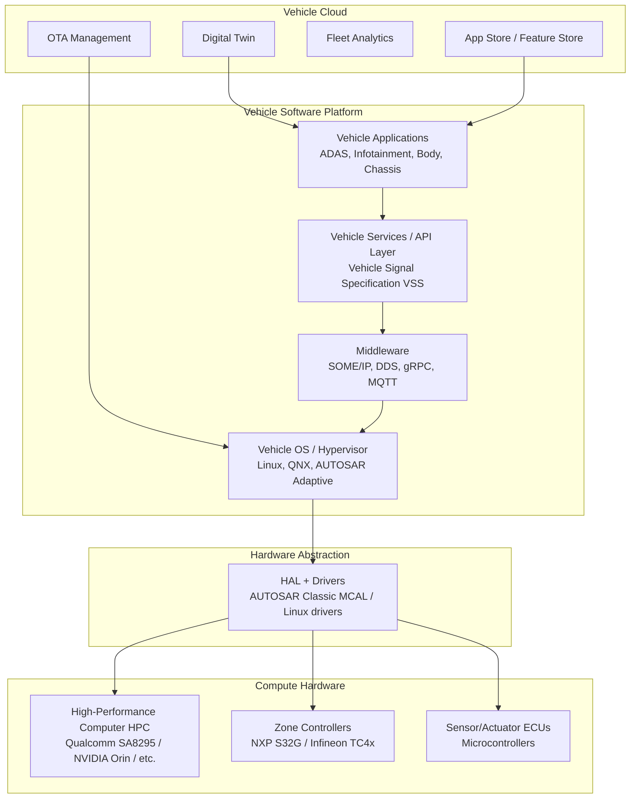
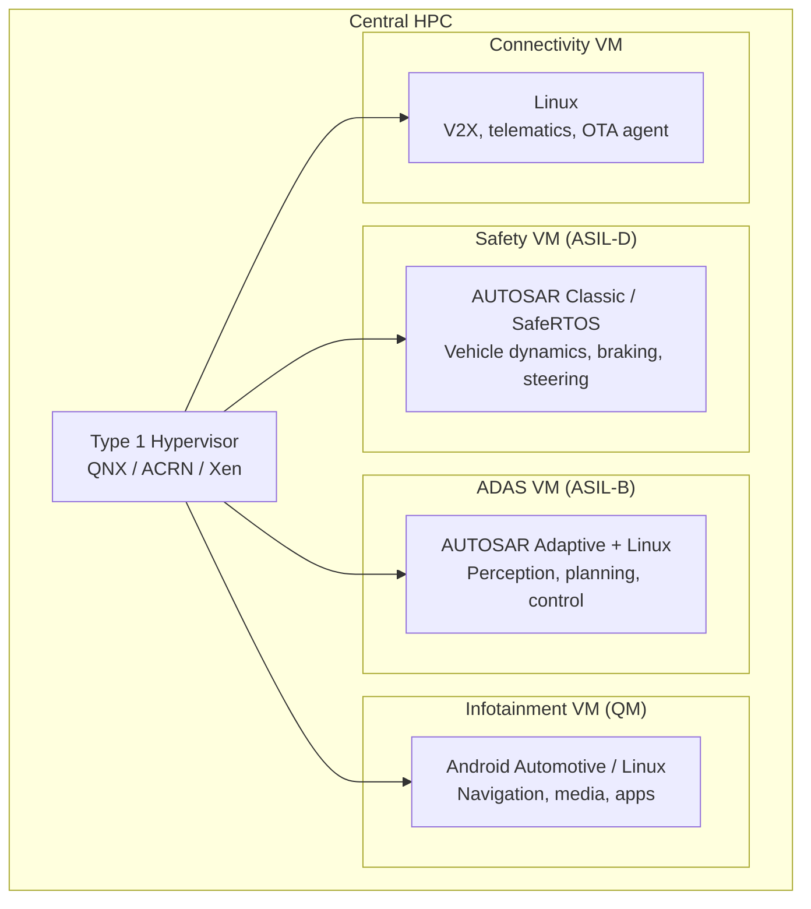
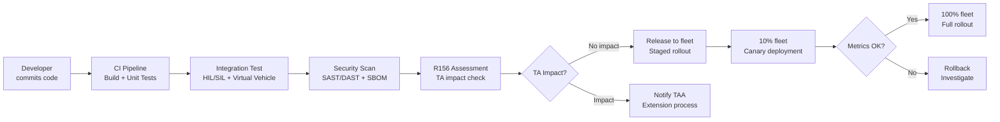
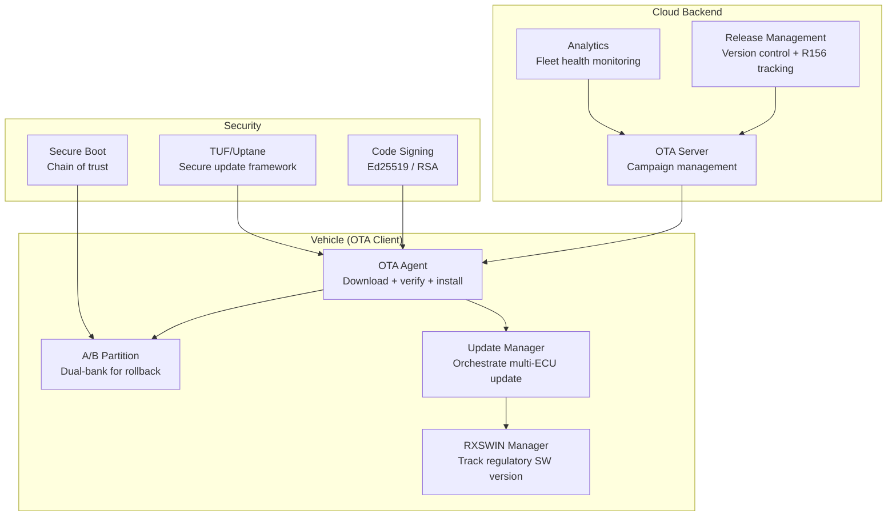
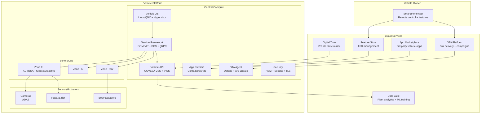
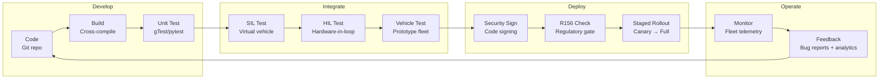
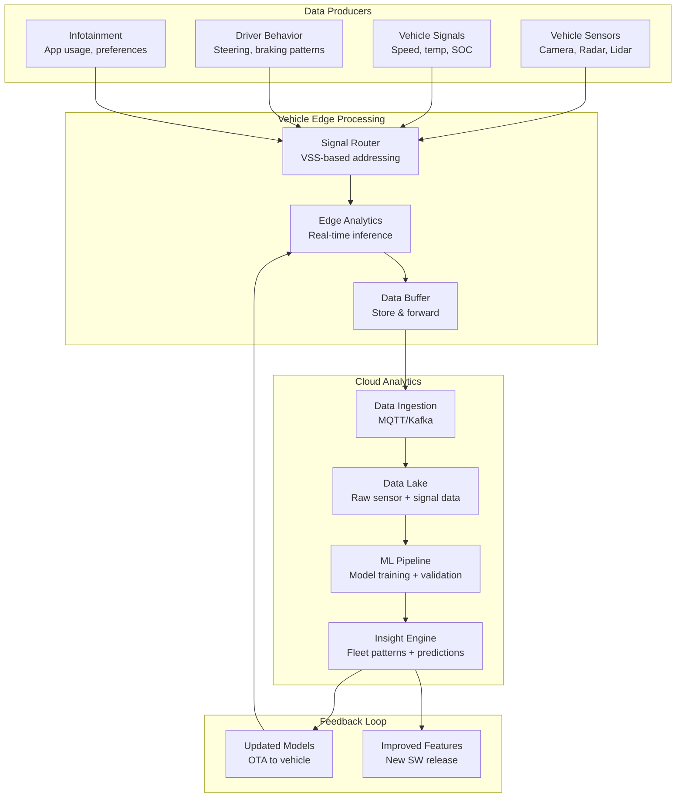

# Software-Defined Vehicle (SDV) Architecture

**Topic:** Software-Defined Vehicle — Architecture, Standards, and Engineering Paradigm  
**Standard:** AUTOSAR Adaptive/Classic, ISO/SAE 21434, UNECE R156, COVESA (VSS), Eclipse SDV  
**SDO:** AUTOSAR Consortium / COVESA / Eclipse Foundation / SAE / ISO  
**Audience:** Vehicle software architects, E/E platform engineers, SDV program leads, DevOps engineers in automotive  
**Prerequisites:** AUTOSAR (Classic + Adaptive), automotive Ethernet, cybersecurity (R155), OTA (R156), Linux/POSIX systems

---

## Chapter 1 — Historical Context & Origin Story

### 1.1 Timeline: Evolution of Vehicle Software

| Year | Event | Impact |
|------|-------|--------|
| 1970s | First ECU (engine control) | Electronic control enters vehicles |
| 1990s | 20-30 ECUs per vehicle | Distributed architecture established |
| 2003 | AUTOSAR founded | Standardize ECU software development |
| 2007 | iPhone launched | Software-first paradigm shift begins |
| 2012 | Tesla Model S OTA updates | Vehicle software updateable post-sale |
| 2017 | AUTOSAR Adaptive Platform | High-performance computing in vehicles |
| 2018 | VW announces SSP platform (software-defined) | Major OEM commits to SDV |
| 2019 | VW CARIAD established | 10,000-person SW organization |
| 2020 | Sony Vision-S concept | Tech company → car |
| 2021 | Tesla FSD computer | Vehicle as software platform |
| 2022 | UNECE R155/R156 enforcement | Regulatory mandate for SW management |
| 2023 | Eclipse SDV Working Group | Open-source vehicle software stack |
| 2024 | Multiple OEMs: SDV platform launches | Industry-wide SDV transition |
| 2025+ | App stores in vehicles, continuous deployment | Software as revenue stream |

### 1.2 The Paradigm Shift

| Aspect | Traditional Vehicle | Software-Defined Vehicle |
|--------|-------------------|--------------------------|
| Architecture | 70-150 distributed ECUs | 3-5 central computers + zone ECUs |
| Software | Fixed at production | Continuously updated (OTA) |
| Features | Hardware-defined at build | Software-enabled post-sale |
| Revenue | One-time sale | Subscription + feature unlock |
| Development | V-model waterfall, 3-5 year cycles | Agile, CI/CD, monthly releases |
| Differentiation | Powertrain, design | Software UX, digital services |
| Supply chain | Tier-1 delivers complete ECU (HW+SW) | OEM owns software, Tier-1 provides HW |
| Lifecycle | 5-7 years then EOL | 10-15 years with SW updates |

---

## Chapter 2 — Standard Architecture & Structure

### 2.1 SDV Architecture Layers



### 2.2 E/E Architecture Evolution

| Generation | Topology | Compute | Network | Software Model |
|-----------|----------|---------|---------|---------------|
| Gen 1 (2000s) | Distributed (100+ ECUs) | Per-function MCU | CAN, LIN | AUTOSAR Classic per ECU |
| Gen 2 (2015s) | Domain (5-7 domain controllers) | Domain SoC | CAN FD + Ethernet | Mix Classic + Adaptive |
| Gen 3 (2020s) | Zonal (3-5 zones + central) | Central HPC + zone ECU | Ethernet backbone + TSN | Vehicle OS + services |
| Gen 4 (2025+) | Central (1-2 computers) | Server-grade SoC | 10G+ Ethernet | Cloud-native, containers |

### 2.3 Key SDV Standards & Specifications

| Standard/Spec | Organization | Purpose |
|---------------|-------------|---------|
| AUTOSAR Adaptive | AUTOSAR | POSIX-based middleware for HPC |
| AUTOSAR Classic | AUTOSAR | Real-time RTOS for safety MCUs |
| COVESA VSS | COVESA (W3C Automotive) | Vehicle Signal Specification (data model) |
| Eclipse uProtocol | Eclipse SDV | Transport-agnostic communication |
| Eclipse Velocitas | Eclipse SDV | Vehicle app development framework |
| ISO/SAE 21434 | ISO/SAE | Cybersecurity engineering |
| UNECE R156 | UNECE | Software update management |
| SOAFEE | Arm/industry | Scalable Open Architecture for Embedded Edge |
| Android Automotive OS | Google | Infotainment OS |
| AGL (Automotive Grade Linux) | Linux Foundation | Open-source vehicle Linux |

---

## Chapter 3 — Technical Deep Dive

### 3.1 Central Compute Architecture (HPC)

| Component | Description |
|-----------|-------------|
| SoC | High-performance (Qualcomm SA8295, NVIDIA Orin, Renesas R-Car S4) |
| CPU | 8-16 Arm Cortex-A cores (or RISC-V) |
| GPU | For graphics, ML inference, computer vision |
| NPU | Dedicated neural processing (10-200+ TOPS) |
| Safety Island | ASIL-D lockstep cores (monitoring) |
| Memory | 16-64 GB LPDDR5 |
| Storage | 256 GB - 1 TB UFS/eMMC |
| Network | 10G Ethernet switch fabric |
| Hypervisor | Type 1 (QNX, ACRN, Xen) — isolation between domains |

### 3.2 Hypervisor-Based Partitioning



### 3.3 Service-Oriented Architecture (SOA) in SDV

| Concept | Implementation |
|---------|---------------|
| Service | Self-contained function with defined interface (e.g., "ParkingService") |
| Service Discovery | SOME/IP-SD or mDNS/DNS-SD |
| Communication | SOME/IP (AUTOSAR), DDS (ROS2/ADAS), gRPC (cloud-native) |
| Data Model | COVESA VSS (Vehicle Signal Specification) |
| API | Vehicle API (REST/GraphQL for apps, SOME/IP for real-time) |
| Orchestration | Service lifecycle management (start, stop, update, failover) |

### 3.4 Vehicle Signal Specification (COVESA VSS)

```
Vehicle
├── Speed (km/h)
├── Chassis
│   ├── Brake
│   │   ├── PedalPosition (%)
│   │   └── IsDriverRequestingBrake (bool)
│   └── SteeringWheel
│       └── Angle (degrees)
├── Powertrain
│   ├── ElectricMotor
│   │   ├── Power (kW)
│   │   └── Torque (Nm)
│   └── TractionBattery
│       ├── StateOfCharge (%)
│       └── Range (km)
├── ADAS
│   ├── AEB (Autonomous Emergency Braking)
│   │   ├── IsEnabled (bool)
│   │   └── IsEngaged (bool)
│   └── LaneDepartureDetection
│       └── IsWarning (bool)
└── Cabin
    ├── HVAC
    │   └── Temperature (°C)
    └── Seat
        └── Position (mm)
```

Purpose: standard data model so applications can be portable across OEMs.

### 3.5 Continuous Deployment Pipeline



---

## Chapter 4 — Implementation Guide

### 4.1 SDV Platform Components

| Component | Options | Selection Criteria |
|-----------|---------|-------------------|
| Vehicle OS | AGL, Android Automotive, QNX, custom Linux | Safety (QNX for ASIL), ecosystem (Android for apps) |
| Hypervisor | QNX Hypervisor, ACRN, Xen, KVM | Safety cert, performance, cost |
| Middleware | SOME/IP (AUTOSAR), DDS (Eclipse Cyclone), gRPC | Latency requirement, ecosystem |
| Container runtime | Docker/containerd, Podman, microVM | Isolation vs. performance |
| OTA framework | Eclipse hawkBit, custom, Uptane | Security (Uptane), scalability |
| App framework | Eclipse Velocitas, Android SDK, custom | Developer ecosystem goal |
| Data layer | COVESA VSS + VISS (Vehicle Information Service Spec) | Standardization priority |
| DevOps | GitLab CI, Jenkins, GitHub Actions | Existing infrastructure |
| Simulation | CARLA, dSPACE VEOS, Vector CANoe | ADAS vs. network vs. full-vehicle |

### 4.2 SDV Software Update Architecture



### 4.3 Feature-on-Demand (FoD) Architecture

| Feature Type | Example | Mechanism |
|-------------|---------|-----------|
| Performance | +50 HP power boost | ECU parameter unlock (encrypted config) |
| ADAS | Highway driving assist | Software module activation (license key) |
| Comfort | Heated seats | Hardware present, software-locked |
| Infotainment | Premium audio processing | DSP algorithm activation |
| Connectivity | 5G data package | Backend subscription + vehicle config |

---

## Chapter 5 — Certification & Audit

### 5.1 SDV Regulatory Compliance

| Regulation | SDV Requirement |
|-----------|-----------------|
| UNECE R155 (Cybersecurity) | CSMS covering entire SW supply chain |
| UNECE R156 (Software Update) | SUMS process for all OTA-updateable components |
| ISO 26262 (Functional Safety) | Safety-critical SW still needs ASIL certification |
| ISO/SAE 21434 (Cybersecurity) | Cybersecurity engineering for all connected SW |
| EU 2019/2144 (GSR) | ADAS functions certified at vehicle level |
| GDPR / privacy regulations | Data handling for connected vehicle services |
| Type Approval (2018/858) | SW changes assessed per RXSWIN framework |

### 5.2 Safety Certification for SDV

| Challenge | Solution |
|-----------|----------|
| Mixed-criticality on one SoC | Hypervisor with freedom-from-interference (FFI) argument |
| Linux not safety-certifiable (ASIL) | Safety island (lockstep MCU) monitors Linux domain |
| Agile development ≠ V-model | Continuous safety case, living FMEDA/FTA |
| OTA changes safety functions | Pre-approved change space + regression testing |
| AI/ML in safety (ADAS) | Safety envelope (monitor) + performance metrics |
| Open source components | SBOM + vulnerability tracking + patch management |

---

## Chapter 6 — Regional & Domain Variants

### 6.1 OEM SDV Strategies

| OEM | Platform | Vehicle OS | HPC | Timeline |
|-----|----------|-----------|-----|----------|
| VW Group | SSP (Scalable Systems Platform) | VW.OS (Android + AUTOSAR) | Qualcomm | 2026+ |
| Mercedes | MB.OS | Custom Linux + QNX | NVIDIA | 2024+ |
| BMW | Neue Klasse | Custom Linux | Qualcomm | 2025+ |
| Toyota | Arene | Custom (AUTOSAR Adaptive) | In-house / Renesas | 2025+ |
| Ford | FNV3 | Linux | Qualcomm | 2025+ |
| GM | Ultifi | Linux | Qualcomm | 2024+ |
| Hyundai | ccOS (Connected Car OS) | Custom Linux | Qualcomm | 2025+ |
| Stellantis | STLA Brain | STLA SmartCockpit (Android) | Qualcomm/NVIDIA | 2024+ |
| Tesla | — (proprietary) | Linux (custom) | In-house (FSD chip) | Production |
| Chinese OEMs | Various | Android/Linux | Various | Production |

### 6.2 SDV Technology Providers

| Provider | Role | Product |
|----------|------|---------|
| Qualcomm | SoC / compute | Snapdragon Ride (ADAS), SA8295 (cockpit) |
| NVIDIA | SoC / compute | Orin (ADAS), Thor (central) |
| NXP | Zone controllers | S32G (gateway/zone), S32Z (safety) |
| Infineon | Safety MCU | AURIX TC4x (ASIL-D) |
| BlackBerry QNX | Safety OS + Hypervisor | QNX 7.1 + QNX Hypervisor |
| Wind River | OS + Hypervisor | VxWorks + Helix |
| Vector | Middleware + tools | MICROSAR (AUTOSAR), vVIRTUALtarget |
| ETAS | Middleware + DevOps | RTA-VRTE (AUTOSAR Adaptive), ISOLAR |
| Google | Infotainment OS | Android Automotive OS (AAOS) |
| Eclipse Foundation | Open-source SDV stack | Eclipse SDV (Velocitas, uProtocol, etc.) |

---

## Chapter 7 — Comparison: SDV Platforms and Approaches

| Aspect | Tesla (proprietary) | VW/MB (OEM custom) | Android Automotive | AGL/Open Source |
|--------|-------------------|--------------------|-------------------|-----------------|
| Control | 100% OEM | 80-90% OEM | Google controls core | Community |
| App ecosystem | Proprietary store | OEM store planned | Google Play | Limited |
| Data ownership | Tesla | OEM | Shared (Google gets data) | OEM |
| Development speed | Fast (integrated) | Slow (organizational) | Medium (Google pace) | Slow (consensus) |
| Differentiation | High | Medium-High | Low (same for all) | Medium |
| Cost | Hidden (internal) | Very high ($B investment) | License fees (GAS) | Low (OSS) |
| Safety certification | Self-managed | ISO 26262 process | Complex (AOSP not certified) | Per-component |
| Connectivity services | Vertically integrated | Complex ecosystem | Google services built-in | OEM managed |

---

## Chapter 8 — Mermaid Architecture Diagrams

### 8.1 Complete SDV Ecosystem



### 8.2 DevOps Pipeline for SDV



### 8.3 SDV Data Flow Architecture



---

## Chapter 9 — Case Studies & Failure Analysis

### 9.1 VW CARIAD — SDV Transformation Challenges

**Context:** VW Group invested €30B+ in software, created 10,000-person CARIAD organization.

**Challenges encountered:**
- 2021-2023: Multiple delays to VW ID.x and Audi/Porsche platforms
- Software integration across brands (VW, Audi, Porsche, Bentley) extremely complex
- Organizational: car company culture vs. tech company culture clash
- Technical: unified OS across all brands harder than expected
- Result: Project Trinity (SSP) delayed ~2 years, leadership changes

**Lessons:**
- SDV transformation is 70% organizational, 30% technical
- Can't build software company inside hardware company without radical culture change
- Integration of safety-critical + non-critical on single platform is hardest problem
- Partnerships (Qualcomm, Google, Bosch) eventually necessary — can't do everything in-house

### 9.2 Tesla — SDV Success Model

**Why Tesla succeeded:**
- Vertically integrated from day one (no legacy)
- Single platform (no brand variants)
- Silicon Valley culture (software-first hiring)
- In-house chips (FSD computer designed for their SW)
- Fleet data loop: billions of miles → train models → OTA deploy → repeat
- Customer acceptance: early adopters expect/welcome frequent updates

**Key differences from traditional OEMs:**
- No dealer network blocking OTA (direct sales model)
- Single global platform (not market-specific variants)
- Hardware designed for software (not software retrofitted to hardware)
- Speed of iteration: weekly releases (vs. annual for traditional)

---

## Chapter 10 — Future Evolution & Industry Trends

| Trend | Timeline | Impact |
|-------|----------|--------|
| Generative AI in vehicle | 2024-2026 | LLM-based voice assistant, adaptive UI |
| Vehicle app ecosystems | 2025-2028 | 3rd-party developers build vehicle apps |
| Feature-on-Demand revenue | 2024-2030 | Subscriptions become 10-20% of vehicle revenue |
| Edge-cloud continuum | 2025+ | Processing split dynamically between vehicle/cloud |
| Digital twin real-time | 2025-2028 | Cloud mirror of vehicle state for diagnostics |
| Open-source SDV stack | 2024-2028 | Eclipse SDV, AGL, SOAFEE reduce custom development |
| RISC-V in automotive | 2026-2030 | Open ISA replaces some Arm cores |
| Centralization: 1 computer | 2028-2032 | Single SoC runs entire vehicle (except safety MCU) |
| AI-driven development | 2025+ | AI writes/tests vehicle software (copilot) |
| Vehicle OS consolidation | 2025-2030 | 3-4 dominant platforms (like mobile: Android + iOS) |
| Regulation evolution | 2025-2030 | R155/R156 updates for continuous deployment |
| Quantum-safe crypto | 2028+ | Post-quantum algorithms in vehicle security |

---

## Chapter 11 — Interview Questions & Career Guide

### Tier 1: Entry-Level (0-3 years)

**Q1:** What makes a vehicle "software-defined"? How is it different from a traditional vehicle?  
**A:** A Software-Defined Vehicle (SDV) has these characteristics: (1) **Features defined by software, not hardware:** Traditional: heated seats need heating element + dedicated control module. SDV: heating element present, feature activated/deactivated by software license key. (2) **Continuously updateable:** Traditional: software frozen at production (or rare recall-based updates). SDV: receives updates throughout lifetime — new features, bug fixes, performance improvements. Like smartphone receiving OS updates. (3) **Centralized compute:** Traditional: 70-150 ECUs, each running dedicated software for one function. SDV: 3-5 powerful computers (HPCs) run multiple functions as software services. ECUs become simple I/O nodes (zone controllers). (4) **Service-oriented architecture:** Traditional: signal-based (CAN messages carry physical signals). SDV: service-based (functions exposed as services with APIs). An ADAS function can call a "BrakeService.apply()" rather than writing raw CAN signals. (5) **Data-driven improvement:** Traditional: no data feedback loop. SDV: collects fleet data → cloud analysis → ML models improved → deploy back to vehicle. Vehicle gets better over time. (6) **Separation of HW/SW lifecycle:** Traditional: hardware and software tied together (replace ECU = replace both). SDV: hardware platform lasts 10-15 years, software updated independently. Software and hardware can have different development/release cadences.

### Tier 2: Mid-Level (3-8 years)

**Q2:** Design the communication middleware for an SDV supporting both safety-critical (ASIL-B/D) and non-critical applications on the same central compute.  
**A:** (1) **Partitioning (foundation):** Type 1 hypervisor separates safety and non-safety VMs. Safety VM: QNX or safety Linux (deterministic scheduling). Non-safety VM: standard Linux (Android Automotive for infotainment). Freedom-from-interference (FFI) argument per ISO 26262. (2) **Middleware per domain:** Safety domain (inside safety VM): AUTOSAR Adaptive SOME/IP (certified communication). Deterministic scheduling (static priority, time-triggered for highest ASIL). End-to-end protection: AUTOSAR E2E Profile (CRC + sequence counter + timeout). Non-safety domain (inside non-safety VM): Standard SOME/IP, DDS, or gRPC (performance-optimized). Best-effort scheduling (Linux CFS scheduler). (3) **Cross-domain communication:** Shared memory (hypervisor-mediated): Safety VM writes sensor data → shared buffer → non-safety VM reads. One-directional (safety → non-safety: data flow). Reverse direction (non-safety → safety) requires strict validation. Firewall: safety VM validates all incoming messages (timeout, range check, E2E). (4) **Service discovery:** SOME/IP-SD for both domains (standard mechanism). Safety services: statically configured (no dynamic discovery for ASIL-D). Non-safety services: dynamic discovery (flexibility for apps). (5) **QoS guarantees:** TSN on internal Ethernet (if network-connected VMs): 802.1Qbv reserves bandwidth for safety traffic. Priority mapping: ASIL-D → highest priority (time-triggered slot). ASIL-B → scheduled priority. QM → best-effort. CPU scheduling: safety VM gets dedicated cores (core affinity, no sharing). Non-safety VM: remaining cores (can be oversubscribed). (6) **Diagnostic path:** All services expose health status via standard API. Watchdog: safety monitor checks all critical service heartbeats. If safety service fails → safe state (independent safety MCU triggers fallback).

### Tier 3: Senior/Lead (8-15 years)

**Q3:** How do you implement a CI/CD pipeline for an SDV that deploys OTA updates to 1 million vehicles while maintaining ISO 26262 and UNECE R156 compliance?  
**A:** (1) **Pipeline structure:** Code → Build → Test → Certify → Sign → Deploy → Monitor. Split into two tracks: Track A (safety-critical): formal V-model gates still required. Track B (non-critical): full CI/CD with automated gates. R156 gate sits between "Test" and "Deploy" for both tracks. (2) **Automated safety verification:** Living safety case: FMEDA/FTA documents auto-updated when code changes. Safety requirements traced to test cases (bidirectional traceability in ALM tool). If code change touches safety function → automated regression suite (SIL/HIL). Gate: all ASIL-rated tests must pass + safety manager sign-off (human-in-loop for ASIL-D). (3) **R156 compliance automation:** Every commit tagged with affected RXSWIN components. Automated assessment: "does this change affect type-approved behavior?" Decision tree: input = changed files + affected signals → output = {no impact | notify authority | extension required}. If "no impact" → continue pipeline. If authority notification needed → pause pipeline, notify regulatory team. Evidence: full traceability from requirement → code change → test → deployment (audit trail). (4) **Deployment to 1M vehicles:** Staged rollout: 1% → 5% → 20% → 100% (each stage monitored 48 hours). A/B partition: vehicle has dual partitions (active + standby). Update installed on standby partition while vehicle operates normally. On next boot: switch to updated partition. If boot fails: automatic rollback to previous partition. Update delta compression: send only diff (reduce cellular data usage). Signed packages: Uptane framework (TUF-based, automotive-specific). (5) **Monitoring (post-deployment):** Fleet KPIs: crash count, reboot count, feature availability, DTC rate. Canary metrics: compare updated cohort vs. non-updated cohort. Automatic rollback trigger: if crash rate increase > 2σ from baseline. Customer opt-out: always allow customer to defer non-safety updates. (6) **Infrastructure:** Backend: Kubernetes cluster with GitOps (ArgoCD). Artifact storage: binary repo (JFrog Artifactory) with signed artifacts. CDN: global content delivery for update packages (minimize latency). Database: version → VIN mapping (which vehicle has which software version).

### Tier 4: Principal/Distinguished (15+ years)

**Q4:** Define the 10-year SDV platform strategy for an OEM selling 3 million vehicles annually across 5 brands.  
**A:** (1) **Platform architecture (single platform, all brands):** One HW platform: central HPC + 4 zone ECUs + safety MCU + connectivity module. Same hardware across entry (€25K) to luxury (€100K+). Differentiation: software configuration + sensor count + performance tier (SoC variants). Budget version: lower-spec SoC, fewer sensors, basic feature set. Premium: top-spec SoC, full sensor suite, all features (some subscription-based). Sport: tuned dynamics SW profile on same HW. (2) **Software platform (3 layers):** Layer 1 — Vehicle OS (shared): Common for all brands. QNX hypervisor + Linux domains. Invested jointly, maintained by platform team. Changes rarely (major update every 2-3 years). Safety certified to ASIL-D. Layer 2 — Vehicle Functions (shared + configurable): ADAS, body, powertrain control. 80% shared across brands, 20% brand-specific tuning (driving dynamics feel). Updated quarterly (CI/CD pipeline). Layer 3 — Experience (brand-specific): UI/UX, digital services, app ecosystem. Fully brand-specific (Audi feels different from VW). Updated monthly or continuously. (3) **Organization (500-800 SW engineers in platform team):** Platform team: vehicle OS, middleware, security, OTA, core services (cross-brand). Brand teams (200-300 each): brand-specific UX, features, customer journey. Partnership: chipset vendor (Qualcomm/NVIDIA) contributes BSP + GPU drivers. Open source: contribute to Eclipse SDV (reduce non-differentiating cost). (4) **Economic model:** Platform cost: €1-2B development, amortized over 3M vehicles/year × 7 years = €50-100/vehicle. Feature-on-Demand revenue: target €500/vehicle/lifetime (subscriptions + one-time unlocks). Data revenue: anonymized fleet data for city planning, insurance, navigation = €50/vehicle/year. Total SW revenue target (2030): €2-3B annually (across 3M vehicles). (5) **Technology choices (locked in for 10 years):** SoC: strategic partnership with 1-2 vendors (5-year supply agreement). OS: QNX for safety hypervisor (10-year license), Linux for applications (no license cost). Middleware: AUTOSAR Adaptive (industry standard, avoid lock-in). Communication: SOME/IP (AUTOSAR standard, proven). Ethernet: TSN (IEEE standard, multi-vendor). OTA: Uptane/TUF (open standard, no vendor lock). Data model: COVESA VSS (open standard). (6) **Risk mitigation:** Avoid single vendor lock (contractual multi-source for critical components). Keep safety-critical path simple (AUTOSAR Classic on safety MCU — proven, certified). Don't over-centralize too fast (keep zone ECUs for graceful degradation). Regulatory flexibility: design R155/R156 compliance as fundamental (not afterthought). China strategy: separate platform variant (GB standards, different data regulations, different app ecosystem).

---

## Chapter 12 — Cheat Sheet & Quick Reference

### SDV Architecture Decision Tree

```
Safety-critical function (ASIL B-D)?
├── Yes → AUTOSAR Classic on safety MCU (proven, certified)
│         OR AUTOSAR Adaptive on certified OS (QNX)
└── No → Linux-based (flexibility, ecosystem)
         ├── Real-time needed? → RT-Linux or dedicated core
         └── No → Standard Linux + containers

Communication protocol selection:
├── Intra-vehicle, real-time: SOME/IP (AUTOSAR standard)
├── ADAS sensor data: DDS (high-throughput pub/sub)
├── Cloud-native services: gRPC (familiar to IT developers)
├── Vehicle-to-cloud: MQTT (lightweight, reliable)
└── Legacy ECU integration: CAN FD via gateway + signal-to-service translation
```

### Key SDV Acronyms

```
SDV  = Software-Defined Vehicle
HPC  = High-Performance Computer (central vehicle computer)
SOA  = Service-Oriented Architecture
VSS  = Vehicle Signal Specification (COVESA)
FoD  = Feature-on-Demand (subscription features)
OTA  = Over-The-Air (software updates)
SUMS = Software Update Management System (R156)
CSMS = Cybersecurity Management System (R155)
RXSWIN = Regulation-specific SW Identification Number
FFI  = Freedom From Interference (ISO 26262)
TSN  = Time-Sensitive Networking
E2E  = End-to-End protection (AUTOSAR)
SBOM = Software Bill of Materials
```

### SDV vs. Traditional: Quick Comparison

```
Traditional:
- 100+ ECUs, CAN bus, fixed features, 5-year dev cycle
- Signal-based, AUTOSAR Classic everywhere
- Tier-1 delivers complete ECU (black box)

SDV:
- 3-5 HPCs + zone ECUs, Ethernet, updateable features
- Service-based, mixed OS (Linux + AUTOSAR)
- OEM owns software, Tier-1 provides hardware platform
- Data feedback loop, continuous improvement
```

### Revenue Model

```
One-time purchase:   Hardware-bound features (basic)
Subscription:        ADAS Level 2+, premium connectivity, cloud services
Feature unlock:      Performance boost, heated seats (FoD)
Data monetization:   Fleet analytics (anonymized)
After-sale services: Insurance, charging, parking integration

Target: SW generates 20-30% of vehicle lifetime revenue by 2030
```

---

*End of Document — 16_Software_Defined_Vehicle.md*
