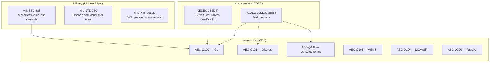
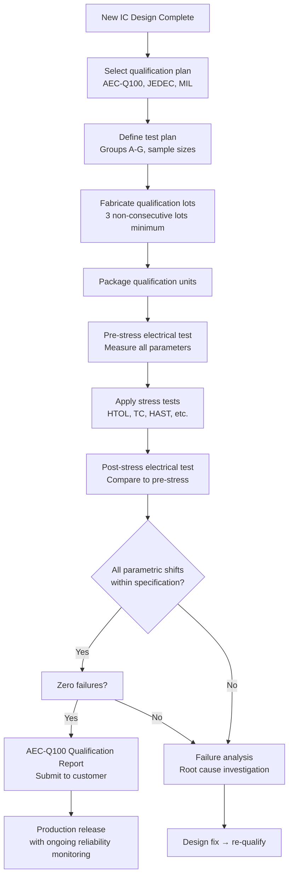
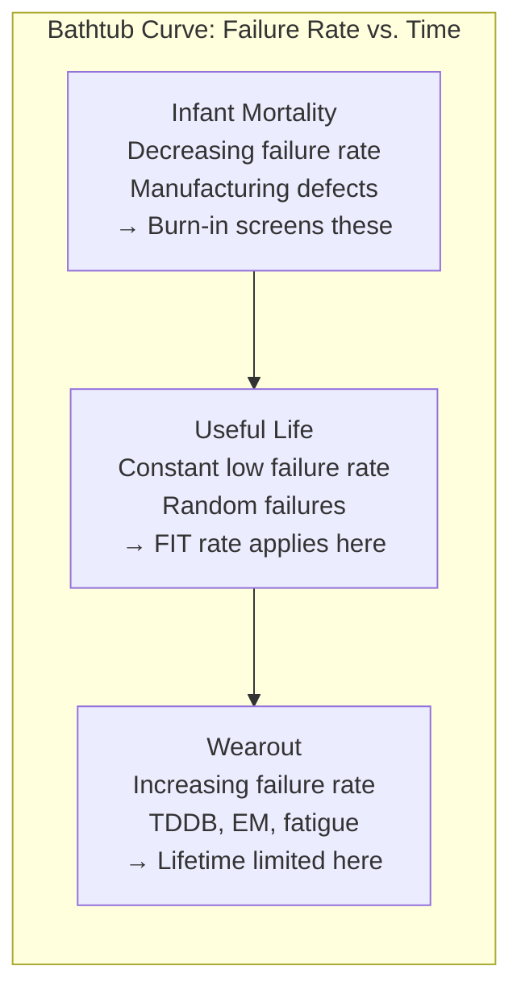
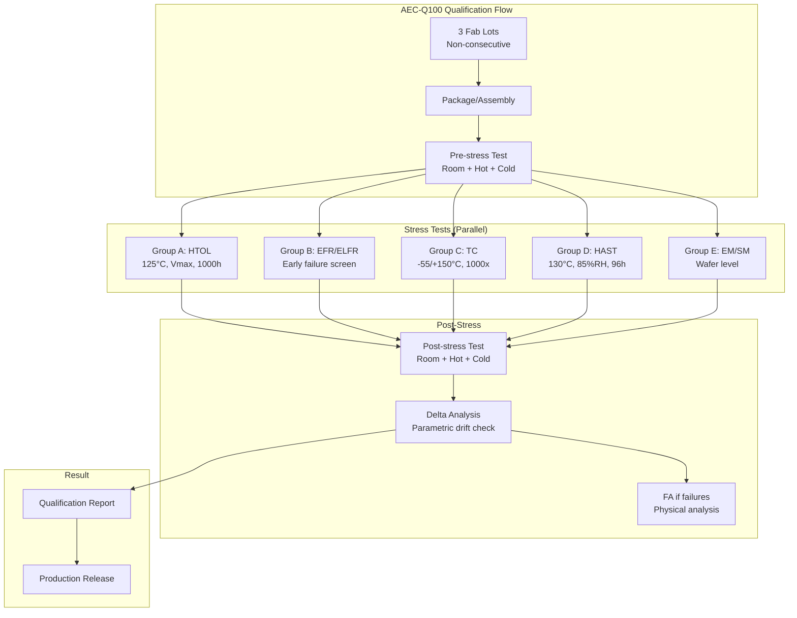
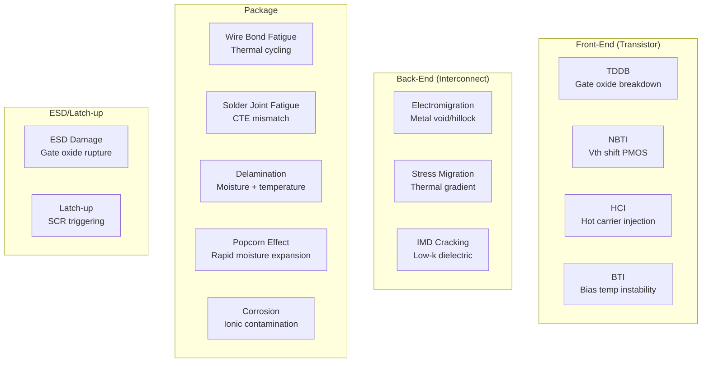

# Semiconductor Qualification & Reliability — Overview

**Topic:** Semiconductor Qualification & Reliability — Standards, Methods, and Lifecycle Framework  
**Standard:** AEC-Q100/101/102/104/200, JEDEC JESD47/22-series, MIL-STD-883/750  
**SDO:** AEC (Automotive Electronics Council) / JEDEC / DoD (MIL) / ESDA  
**Audience:** Reliability engineers, semiconductor quality engineers, IC design engineers, automotive Tier-1 component engineers  
**Prerequisites:** Semiconductor physics basics, failure mechanisms, statistics (Weibull, exponential), basic packaging knowledge

---

## Chapter 1 — Historical Context & Origin Story

### 1.1 Timeline

| Year | Event | Impact |
|------|-------|--------|
| 1947 | Transistor invented (Bell Labs) | Semiconductor era begins |
| 1958 | Integrated circuit (Kilby/Noyce) | Miniaturization revolution |
| 1962 | JEDEC (Joint Electron Device Engineering Council) formed | Standardized IC testing |
| 1975 | MIL-STD-883 established | Military reliability qualification |
| 1980s | Japanese quality revolution | Zero-defect philosophy enters electronics |
| 1994 | AEC-Q100 Rev A published | First automotive-specific IC qualification |
| 1999 | AEC-Q200 (passive components) | Extends automotive qualification to passives |
| 2006 | RoHS Directive (EU) | Lead-free transition challenges |
| 2010 | AEC-Q102 (optoelectronics) | LED/laser qualification |
| 2014 | AEC-Q103 (MEMS) | Microelectromechanical systems |
| 2019 | AEC-Q104 (multichip modules) | Advanced packaging |
| 2022 | Sub-5nm qualification challenges | New failure modes at advanced nodes |
| 2024 | AEC-Q100 Rev H | Updated for modern processes |

### 1.2 Why Semiconductor Qualification?

| Challenge | Consequence if Unqualified |
|-----------|---------------------------|
| Automotive temperature range (-40°C to +150°C) | IC failure in engine bay, thermal runway |
| Vibration + thermal cycling | Solder joint cracks, wire bond fatigue |
| 15-year vehicle lifetime | Wearout mechanisms (TDDB, EM, HCI, NBTI) |
| Zero-tolerance for field failures | Recalls costing $100M+, safety hazard |
| Harsh EMI environment | Latch-up → overcurrent → fire risk |
| ESD events during manufacturing/handling | Latent damage → infant mortality |
| Moisture + contaminants | Corrosion, delamination, popcorn effect |

---

## Chapter 2 — Standard Architecture & Structure

### 2.1 Qualification Standards Hierarchy



### 2.2 AEC-Q100 Temperature Grades

| Grade | Temperature Range | Application |
|-------|------------------|-------------|
| Grade 0 | -40°C to +150°C | Under-hood, on-engine |
| Grade 1 | -40°C to +125°C | Under-hood, general automotive |
| Grade 2 | -40°C to +105°C | Interior, body electronics |
| Grade 3 | -40°C to +85°C | Cabin electronics (infotainment) |
| Grade 4 | 0°C to +70°C | NOT automotive (commercial only) |

### 2.3 Key Reliability Metrics

| Metric | Definition | Typical Automotive Target |
|--------|-----------|---------------------------|
| FIT | Failures In Time (failures per 10⁹ device-hours) | < 10 FIT (automotive IC) |
| DPPM | Defective Parts Per Million (outgoing quality) | < 1 DPPM (automotive) |
| MTTF | Mean Time To Failure | > 1,000,000 hours |
| MTBF | Mean Time Between Failures | Application-dependent |
| PFH | Probability of Failure per Hour (ISO 26262) | 10⁻⁸ for ASIL D |
| AFR | Annual Failure Rate | < 1 ppm/year |

---

## Chapter 3 — Technical Deep Dive

### 3.1 Semiconductor Failure Mechanisms

| Mechanism | Physics | Acceleration Factor | Standard Test |
|-----------|---------|--------------------|-|
| TDDB (Time-Dependent Dielectric Breakdown) | Gate oxide degradation under electric field | Voltage, temperature (Arrhenius) | HTOL (JESD22-A108) |
| Electromigration (EM) | Metal atom displacement by current | Temperature, current density (Black's equation) | HTOL at elevated Vdd |
| HCI (Hot Carrier Injection) | Energetic carriers trapped in oxide | Voltage (power law) | HTOL at max Vdd |
| NBTI (Negative Bias Temperature Instability) | Threshold voltage shift in PMOS | Temperature, voltage | HTOL |
| Thermal cycling fatigue | CTE mismatch → solder/wire bond fatigue | ΔT, cycle count (Coffin-Manson) | TC (JESD22-A104) |
| Moisture corrosion | Electrochemical migration | Humidity, temperature, voltage | HAST/THB |
| ESD damage | Gate oxide puncture / junction melt | Pulse energy | HBM, CDM |
| Latch-up | Parasitic SCR triggering | Current injection, temperature | JESD78 |

### 3.2 Acceleration Models

**Arrhenius Model (Temperature):**

$$AF = e^{\frac{E_a}{k_B}\left(\frac{1}{T_{use}} - \frac{1}{T_{stress}}\right)}$$

Where: $E_a$ = activation energy (0.3-1.0 eV), $k_B$ = Boltzmann constant (8.617×10⁻⁵ eV/K), $T$ = absolute temperature (K)

**Black's Equation (Electromigration):**

$$MTTF = A \cdot J^{-n} \cdot e^{\frac{E_a}{k_B T}}$$

Where: $J$ = current density, $n$ = current exponent (typically 2), $A$ = process constant

**Coffin-Manson Model (Thermal Cycling):**

$$N_f = C \cdot (\Delta T)^{-m}$$

Where: $\Delta T$ = temperature swing, $m$ = fatigue exponent (2-3 for solder), $C$ = material constant

### 3.3 AEC-Q100 Test Groups

| Group | Test Name | Conditions | Sample Size | Purpose |
|-------|-----------|-----------|-------------|---------|
| A | Accelerated Environmental Stress | HTOL: 125°C, Vdd_max, 1000h | 3 lots × 77 units | Gate oxide, EM, NBTI |
| B | Accelerated Environmental Stress | HTOL: unbiased, 1000h | 3 × 77 | Package + die stress |
| C | Accelerated Lifetime Simulation | TC: -55°C/+150°C, 1000 cycles | 3 × 77 | Solder, wire bond fatigue |
| D | Package Assembly Integrity | HAST: 130°C, 85%RH, 96h | 3 × 77 | Moisture penetration |
| E | Die Fabrication Reliability | EM/SM test structures | Wafer level | Interconnect reliability |
| F | Defect Screening | Burn-in (infant mortality screen) | Production-level | Remove early failures |
| G | Cavity Package Integrity | Lid seal, moisture content | Package-specific | Hermetic integrity |

---

## Chapter 4 — Implementation Guide

### 4.1 Qualification Flow



### 4.2 Qualification Planning Timeline

| Phase | Duration | Activities |
|-------|----------|-----------|
| Design review | 2-4 weeks | Select grade, identify test plan, review DFR (Design for Reliability) |
| Lot fabrication | 8-16 weeks | 3 non-consecutive wafer lots (different dates) |
| Assembly | 4-8 weeks | Package, wire bond/flip-chip |
| Pre-test | 1-2 weeks | Full parametric characterization at temperature extremes |
| Stress testing | 6-10 weeks | HTOL (1000h), TC (1000 cycles), HAST (96h), etc. |
| Post-test + analysis | 2-4 weeks | Electrical measurement + failure analysis if needed |
| Report + approval | 2-4 weeks | Generate qualification report, customer review |
| **Total** | **6-12 months** | Full AEC-Q100 qualification |

### 4.3 Sample Size and Accept/Reject Criteria

| Standard | Sample Size (per lot) | Lots Required | Accept Criteria |
|----------|----------------------|---------------|-----------------|
| AEC-Q100 (standard) | 77 per lot | 3 lots (non-consecutive) | 0 failures (zero-defect) |
| AEC-Q100 (reduced) | 45 per lot | 3 lots | 0 failures |
| JEDEC JESD47 | 77 per lot | 3 lots | 0 failures |
| MIL-STD-883 | Various (method-dependent) | As specified | Per method |

**Why 77?** Based on Chi-squared distribution: 77 samples with 0 failures gives 90% confidence that true failure rate < 3% (equivalent to 30,000 DPPM upper bound at initial qualification).

---

## Chapter 5 — Certification & Audit

### 5.1 AEC-Q100 Qualification Process

| Step | Responsibility | Deliverable |
|------|---------------|-------------|
| 1. Qualification plan | IC supplier | Test plan document |
| 2. Execute tests | IC supplier (in-house or contracted lab) | Test data |
| 3. Generate report | IC supplier | AEC-Q100 Qualification Report |
| 4. Customer review | Automotive OEM/Tier-1 | Approval / requests for additional data |
| 5. PPAP (Production Part Approval) | IC supplier → customer | PPAP package |
| 6. Ongoing monitoring | IC supplier | SPC data, EFR, reliability monitor |

### 5.2 Key Audits and Assessments

| Audit | Who Audits | What's Checked |
|-------|-----------|---------------|
| Customer qualification audit | OEM/Tier-1 | Qualification data, process capability, FA |
| IATF 16949 certification | 3rd party registrar | Quality management system |
| VDA 6.3 process audit | Customer or 3rd party | Manufacturing process compliance |
| ISO 26262 process assessment | Assessor | Functional safety for ICs (Part 11) |
| Fab equipment qualification | Internal + customer | Equipment capable of producing reliable parts |
| Subcontractor audit | IC supplier | Assembly/test house capabilities |

---

## Chapter 6 — Regional & Domain Variants

### 6.1 Application Domain Comparison

| Aspect | Automotive (AEC) | Military (MIL) | Space (ESA/NASA) | Industrial | Consumer |
|--------|------------------|----------------|------------------|-----------|----------|
| Standard | AEC-Q100 | MIL-STD-883 | ECSS-Q-ST-60-13C | IEC 60068 | JEDEC JESD47 |
| Temp range | -40 to +150°C (Gr.0) | -55 to +125°C (Class B) | -55 to +125°C | -40 to +85°C | 0 to +70°C |
| Lifetime | 15 years | 20+ years | 15-20 years (mission) | 10 years | 3-5 years |
| Quality (DPPM) | < 1 DPPM | < 0.1 DPPM | Near zero | < 100 DPPM | < 500 DPPM |
| FIT target | < 10 FIT | < 1 FIT | < 0.1 FIT | < 100 FIT | < 1000 FIT |
| Radiation | Not required | Varies | Required (TID, SEE) | No | No |
| Cost sensitivity | Medium | Low | Very low | High | Very high |
| Volume | High (millions) | Low (thousands) | Very low (hundreds) | Medium | Very high |

---

## Chapter 7 — Comparison: Qualification Approaches

| Aspect | AEC-Q100 | JEDEC JESD47 | MIL-STD-883 |
|--------|---------|-------------|-------------|
| Target market | Automotive | Commercial | Military |
| Temperature focus | Up to +150°C (Grade 0) | Up to +85°C typical | Up to +125°C (Class B) |
| Test rigor | High | Medium | Very high |
| Sample size | 77/lot × 3 lots | 77/lot × 3 lots | Varies by test method |
| Duration (HTOL) | 1000 hours | 1000 hours | 1000-5000 hours |
| ESD requirement | ±2000V HBM, CDM per spec | ±2000V HBM | ±4000V HBM (higher) |
| Latch-up | Mandatory (JESD78) | Recommended | Required |
| Radiation testing | Not required | Not required | Required (Class V) |
| Ongoing monitoring | Required (SPC, EFR) | Recommended | Required (QML/QPL) |
| Documentation | Qualification report | Qualification report | QML certification |
| Cost to qualify | $200K-500K typical | $100K-300K | $500K-2M |
| Time to qualify | 6-12 months | 4-8 months | 12-24 months |

---

## Chapter 8 — Mermaid Architecture Diagrams

### 8.1 Semiconductor Reliability Bathtub Curve



### 8.2 AEC-Q100 Test Flow



### 8.3 IC Reliability Failure Modes Map



---

## Chapter 9 — Case Studies & Failure Analysis

### 9.1 Toyota Unintended Acceleration (2009-2010)

**Relevance to semiconductor qualification:** Investigation included IC reliability analysis of engine control module.

**Key aspects:**
- IC supplier (Renesas) qualification reviewed under scrutiny
- Question: could cosmic-ray-induced soft errors in MCU cause unintended acceleration?
- NASA investigation: analyzed firmware, hardware architecture, memory protection
- Outcome: no single semiconductor failure identified as root cause (multiple contributing factors)
- Industry impact: increased focus on:
  - ECC memory in automotive MCUs (soft error protection)
  - ISO 26262 Part 11 (semiconductor functional safety)
  - FMEDA analysis for IC random failures (SPFM, LFM metrics)

### 9.2 Tin Whisker Failures (Real Cases)

**Problem:** Lead-free (RoHS) tin plating grows metallic whiskers (1-10mm) that cause short circuits.

**Case:** 2005 — Galaxy IV satellite ($250M) lost due to tin whisker short in control processor.

**Impact on automotive:**
- JEDEC JESD201: tin whisker acceptance requirements
- AEC-Q100 requires tin whisker assessment for all lead-free packages
- Mitigation: Ni underplate, matte tin finish, conformal coating
- Monitoring: periodic SEM inspection of lead-free solder joints

---

## Chapter 10 — Future Evolution & Industry Trends

| Trend | Impact on Qualification |
|-------|------------------------|
| Sub-3nm process nodes | New failure mechanisms (TDDB @ thin oxides, self-heating) |
| 3D IC / chiplets | No AEC-Q standard for die-to-die interfaces yet |
| Wide bandgap (SiC, GaN) | AEC-Q101 revision needed for new physics (gate oxide in SiC) |
| AI chips in automotive | Higher power density → new thermal/EM challenges |
| Advanced packaging (2.5D/3D) | AEC-Q104 expansion needed, thermal management critical |
| Automotive DRAM/Flash | JEDEC developing auto-grade memory standards |
| Silicon lifecycle management | In-situ monitoring (aging sensors, BIST) during operation |
| Cybersecurity for silicon | IEEE P2851 (trusted chip attestation) |
| Chiplet ecosystem | Need qualification framework for heterogeneous integration |
| Mission profiles from data | Real-world usage data refines qualification targets |

---

## Chapter 11 — Interview Questions & Career Guide

### Tier 1: Entry-Level (0-3 years)

**Q1:** What is AEC-Q100 and why is it important for automotive ICs?  
**A:** AEC-Q100 is the Automotive Electronics Council's qualification standard for integrated circuits. It defines a set of stress tests that an IC must pass to be considered "automotive qualified." **Why it matters:** Automotive environment is harsh: temperature (-40 to +150°C for Grade 0), vibration, humidity, 15+ year lifetime. Consumer ICs (qualified to JEDEC JESD47) are typically 0 to +70°C for 3-5 years. AEC-Q100 bridges this gap. **What it tests:** Group A (HTOL — accelerated life), Group B (early life failure rate), Group C (thermal cycling — package integrity), Group D (moisture resistance — HAST/THB), Group E (electromigration/stress migration at wafer level). **Key parameters:** 3 non-consecutive fabrication lots, 77 samples per lot per test, zero failures accepted (0/231 total). **Grades:** 0 (+150°C), 1 (+125°C), 2 (+105°C), 3 (+85°C). Grade selection based on IC placement in vehicle.

### Tier 2: Mid-Level (3-8 years)

**Q2:** Calculate the expected lifetime of an IC using Arrhenius acceleration. Given: HTOL at 125°C for 1000 hours with 0 failures (77 samples). Use case temperature: 55°C average junction. Activation energy: 0.7 eV.  
**A:** **Step 1: Acceleration Factor (AF):**

$AF = e^{\frac{E_a}{k_B}\left(\frac{1}{T_{use}} - \frac{1}{T_{stress}}\right)}$

$T_{use}$ = 55°C = 328K, $T_{stress}$ = 125°C = 398K, $E_a$ = 0.7 eV, $k_B$ = 8.617×10⁻⁵ eV/K

$AF = e^{\frac{0.7}{8.617 \times 10^{-5}}\left(\frac{1}{328} - \frac{1}{398}\right)} = e^{8122 \times (3.049 \times 10^{-3} - 2.513 \times 10^{-3})} = e^{8122 \times 5.36 \times 10^{-4}} = e^{4.35} ≈ 77.5$

**Step 2: Equivalent use-condition hours:**
Device-hours tested = 77 devices × 1000 hours = 77,000 device-hours at 125°C.
Equivalent use-condition hours = 77,000 × 77.5 = 5,967,500 device-hours at 55°C.

**Step 3: FIT rate (upper bound, 60% confidence, 0 failures):**
Using chi-squared: $λ_{upper} = \frac{χ²(2r+2, CL)}{2t}$ where r=0, CL=60%.
$χ²(2, 0.6) = 1.833$
$λ = \frac{1.833}{2 \times 5,967,500} = 1.54 \times 10^{-7}$ per hour = **154 FIT** (upper bound).

For the full qualification (3 lots): 231 devices → 17,892,000 device-hours → **~51 FIT** at 60% CL.

**Step 4: MTTF estimate:**
$MTTF = \frac{1}{λ} = \frac{1}{51 \times 10^{-9}} ≈ 19.6$ million hours ≈ **2,237 years**.

This demonstrates automotive IC qualification provides confidence in extremely low failure rates.

### Tier 3: Senior/Lead (8-15 years)

**Q3:** A new SiC MOSFET for EV inverters shows gate oxide failures at 3× the rate of silicon MOSFETs during HTOL. How do you approach qualification?  
**A:** SiC gate oxide reliability is fundamentally different from silicon due to SiC/SiO₂ interface quality and trapping effects. **(1) Understand the physics:** SiC has higher density of interface traps (Dit ~10¹²/cm²/eV vs. ~10¹⁰ for Si). Charge trapping causes Vth shift AND can trigger TDDB at lower oxide fields. Activation energy for SiC gate oxide TDDB different from Si (often lower: 0.3-0.5 eV). **(2) Modified qualification approach:** Standard AEC-Q101 HTOL (150°C, 1000h) may not be sufficient. Add gate bias stress test (high Vgs, elevated T, measure Vth drift over time). Define acceptable Vth shift limit (e.g., < 500 mV over 15 years extrapolated). Time-to-failure extrapolation: use Weibull statistics (SiC TDDB often shows Weibull shape parameter < 1). **(3) Extended testing:** HTGB (High Temperature Gate Bias): 175°C, Vgs = 1.2× rated, 1000h+. Measure: Vth, Rdson, Igss drift — compare to initial. If drift exceeds spec: fail → analyze with C-V profiling + interface trap characterization. **(4) Mission profile mapping:** EV inverter: gate cycling 10,000 times/second, junction temp swing ΔT = 50-100°C. Power cycling test: represents real thermal stress on die attach + wire bonds. Gate-source cycling: represents electrical stress on oxide. **(5) Supplier qualification criteria:** Demand intrinsic oxide quality data (TZDB — time-zero dielectric breakdown yield). Demand extrinsic defect density data (determines infant mortality risk). Require burn-in at gate stress (not just drain stress) for screening.

### Tier 4: Principal/Distinguished (15+ years)

**Q4:** Design a qualification framework for chiplet-based automotive SoCs where no existing AEC standard applies.  
**A:** Chiplets (heterogeneous integration: CPU die + AI accelerator die + I/O die in one package) have qualification gaps between AEC-Q100 (single die) and AEC-Q104 (MCM — doesn't fully address die-to-die). **(1) Identify new failure modes (not covered by existing standards):** Die-to-die interconnect reliability (microbumps/hybrid bonding: 10µm pitch). Thermal mismatch between dies of different process nodes (7nm CPU + 16nm I/O). Die-to-silicon-interposer (2.5D) or die-to-die direct (3D) stress under thermal cycling. Power delivery to stacked dies (electromigration in through-silicon vias — TSVs). Known Good Die (KGD) problem: must test die before integration (no access after). **(2) Proposed qualification framework:** **Level 1 — Die level:** Each chiplet qualified individually to AEC-Q100 equivalent (process-specific tests). Includes: HTOL, ESD (CDM adapted for bare die), wafer-level EM/SM. KGD testing requirement: full functional + parametric at temperature before assembly. **Level 2 — Interconnect level (NEW):** Microbump shear/pull strength (adapt JESD22-B117). Thermal cycling focused on die-to-die interface (-55/+150°C, >1000 cycles). HAST on interposer + microbump (moisture at interface). EM testing through TSVs (new test structure needed). **Level 3 — System (package) level:** Full assembled product through standard AEC-Q100 groups (HTOL, TC, HAST). Additional: power cycling focused on inter-die thermal gradient. Warpage measurement under temperature (critical for large multi-die packages). **Level 4 — Functional safety:** FMEDA covering die-to-die communication (if one die fails, what happens?). Diagnostic coverage for interconnect faults (BIST across die-to-die links). Common cause failure analysis (shared substrate = potential common mode). **(3) Industry action needed:** Propose to AEC working group as AEC-Q100 Appendix or new AEC-Q10x standard. Collaborate with JEDEC JC-14 (reliability) on test method development. Timeline: 2-3 years for consensus, 1 year for pilot, 1 year for publication. **(4) Interim approach (today):** Use AEC-Q100 + AEC-Q104 as baseline, add custom tests for identified gaps. Document assumptions and known coverage gaps in qualification report. Customer acceptance: present risk-based argument (mission profile analysis showing most critical gaps are covered).

---

## Chapter 12 — Cheat Sheet & Quick Reference

### AEC-Q100 Grade Selection

```
IC mounted on engine/transmission → Grade 0 (−40/+150°C)
IC under-hood (general)           → Grade 1 (−40/+125°C)
IC interior (not cabin-facing)    → Grade 2 (−40/+105°C)
IC in cabin (infotainment, HMI)   → Grade 3 (−40/+85°C)
IC consumer (NOT automotive)      → Grade 4 (0/+70°C) — NOT AEC
```

### Key Test Conditions Quick Reference

```
HTOL:    125°C (Gr.1), 150°C (Gr.0), Vdd_max, 1000h, biased
TC:      -55°C to +125°C (Gr.1) or +150°C (Gr.0), 1000 cycles
HAST:    130°C, 85% RH, biased, 96 hours
THB:     85°C, 85% RH, biased, 1000 hours (alternative to HAST)
HBM:     ±2000V (all pins), pass/fail per AEC-Q100-002
CDM:     Per JESD22-C101 (voltage depends on package size)
Latch-up: ±100mA or 1.5× Imax (whichever greater), -40°C to +Tmax
Precon:   MSL level per J-STD-020 before HAST/TC (simulates reflow)
```

### Reliability Math Essentials

```
FIT = failures per 10⁹ device-hours
1 FIT = 1 failure in 10⁹ hours = 114,155 years

Arrhenius AF = exp[(Ea/kB)(1/Tuse - 1/Tstress)]
  Ea: 0.3 eV (HCI), 0.7 eV (typical), 1.0 eV (corrosion)
  kB: 8.617×10⁻⁵ eV/K

Coffin-Manson AF = (ΔTstress/ΔTuse)^m, m ≈ 2-3 for solder

Upper bound FIT (0 failures, 60% CL):
  FIT = 0.916 / (devices × hours × AF) × 10⁹

DPPM conversion:
  1 DPPM = 1 defect per million parts shipped
  Automotive target: < 1 DPPM (Six Sigma: 3.4 DPPM = ~4.5σ)
```

---

*End of Document — 00_Semiconductor_Reliability_Overview.md*
