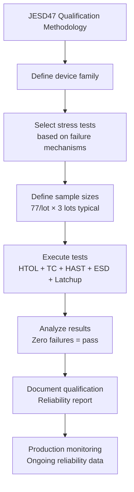
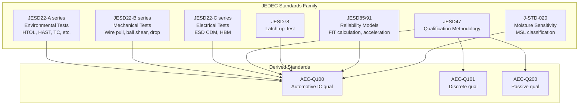
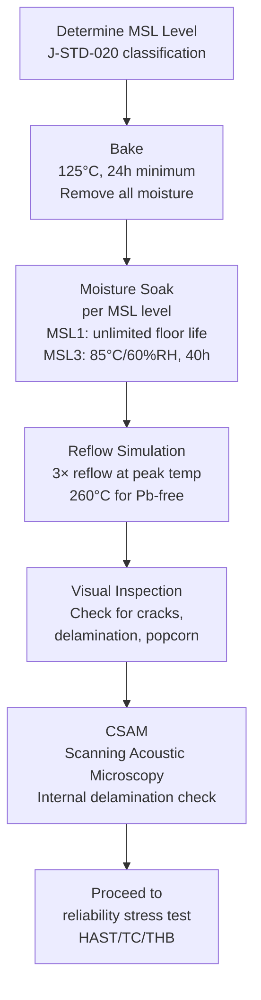

# JEDEC Standards Family — Semiconductor Test & Reliability

**Topic:** JEDEC Standards — Test Methods, Qualification, and Reliability Standards for Semiconductors  
**Standard:** JESD22 (Test Methods), JESD47 (Qualification), JESD78 (Latch-up), JESD85/91 (Reliability Models)  
**SDO:** JEDEC Solid State Technology Association (JC-14 Reliability Committee, JC-15 Quality)  
**Audience:** IC reliability engineers, test engineers, quality engineers, semiconductor process engineers  
**Prerequisites:** Semiconductor device physics, failure mechanisms, statistical methods, IC packaging

---

## Chapter 1 — Historical Context & Origin Story

### 1.1 Timeline

| Year | Event | Impact |
|------|-------|--------|
| 1924 | JEDEC formed (as part of EIA) | Standardization of vacuum tubes |
| 1960 | First semiconductor standards | IC testing standardization begins |
| 1969 | JEDEC JC-14 Reliability Committee | Formal reliability test methods |
| 1983 | JESD22 series initiated | Comprehensive test method library |
| 1988 | JESD78 (Latch-up) | Critical CMOS failure mode addressed |
| 1993 | JESD47 (Stress-Test-Driven Qualification) | Basis for AEC-Q100 |
| 2000 | JESD22-A114 (HBM ESD) | Standardized ESD testing |
| 2004 | JESD79 (DDR SDRAM) | Memory standards |
| 2010 | JESD22-C101 (CDM) becomes primary ESD | Shift from HBM to CDM focus |
| 2016 | JESD85 (FIT rate calculation) major revision | Modern reliability prediction |
| 2020 | JEP001 (Silicon Lifecycle Management) | In-field reliability monitoring |
| 2023 | Updates for advanced nodes (3nm/2nm) | New failure mode coverage |

### 1.2 JEDEC Committee Structure

| Committee | Scope | Key Standards |
|-----------|-------|---------------|
| JC-14 | Reliability | JESD22 (test methods), JESD47 (qual), JESD85/91 (models) |
| JC-15 | Quality & Assembly | JESD22-B (mechanical), J-STD-020 (moisture) |
| JC-16 | Interface | DDR, LPDDR, HBM memory |
| JC-64 | Embedded Memory | eMMC, UFS |
| JC-70 | Wide Bandgap | SiC, GaN reliability |

---

## Chapter 2 — Standard Architecture & Structure

### 2.1 JESD22 Test Method Series

| Series | Domain | Examples |
|--------|--------|---------|
| JESD22-A (A100-A199) | Environmental stress | HTOL, HAST, TC, thermal shock |
| JESD22-B (B100-B199) | Mechanical/package | Wire pull, ball shear, board-level drop |
| JESD22-C (C100-C199) | Electrical stress | ESD (CDM, HBM), latch-up |

### 2.2 Key JESD22-A Environmental Tests

| Standard | Test Name | Typical Conditions | Purpose |
|----------|-----------|-------------------|---------|
| A108 | Temperature, Bias, Operating Life (HTOL) | 125°C, Vmax, 1000h | Wearout acceleration (TDDB, EM, NBTI) |
| A110 | HAST (Highly Accelerated Stress Test) | 130°C, 85%RH, Vbias, 96h | Moisture-related failures (accelerated THB) |
| A101 | Steady-state Temperature Humidity Bias (THB) | 85°C, 85%RH, Vbias, 1000h | Moisture + bias corrosion (slower than HAST) |
| A102 | Autoclave (Pressure Cooker) | 121°C, 100%RH, 15psig, 168h | Extreme moisture penetration |
| A104 | Temperature Cycling | -65°C to +150°C, 1000 cycles | CTE mismatch fatigue |
| A105 | Power Temperature Cycling | ΔTj per power cycling | Junction temperature stress |
| A106 | Thermal Shock | -65°C/+150°C, liquid-to-liquid | Rapid thermal stress |
| A113 | Preconditioning (MSL) | Bake + soak + reflow simulation | Simulates PCB assembly before testing |
| A119 | Low Temperature Storage | -65°C, 1000h, unbiased | Cold storage effects |

### 2.3 JESD22-B Mechanical Tests

| Standard | Test Name | Purpose |
|----------|-----------|---------|
| B100 | Vibration (variable frequency) | Mechanical integrity under vibration |
| B103 | Constant acceleration | Centrifuge test for package integrity |
| B104 | Mechanical shock | Drop/impact resistance |
| B111 | Board-level drop test | Portable electronics reliability |
| B115 | Solder ball shear test | BGA joint strength |
| B117 | Solder ball pull test | BGA connection reliability |
| B121 | Wire bond pull test | Bond wire adhesion |

---

## Chapter 3 — Technical Deep Dive

### 3.1 HTOL (High Temperature Operating Life) — JESD22-A108

**Purpose:** Accelerate intrinsic wearout mechanisms that limit IC lifetime.

| Parameter | Typical Value | Notes |
|-----------|---------------|-------|
| Temperature (Tj) | 125°C or 150°C (Grade 0) | Junction temperature during test |
| Bias | Vdd max rated | All supplies at maximum |
| Duration | 1000 hours (standard) | Can extend to 2000h for higher confidence |
| Monitoring | Parametric at 168h, 500h, 1000h | Interim readouts detect drift |
| Failure criteria | Datasheet spec violated | Any parameter out of spec = failure |

**Mechanisms accelerated:**
- TDDB: gate oxide breakdown under electric field + temperature
- Electromigration: metal void formation under current + temperature
- NBTI: PMOS threshold shift under bias + temperature
- HCI: hot carrier damage under voltage + temperature

### 3.2 HAST (Highly Accelerated Stress Test) — JESD22-A110

**Purpose:** Accelerate moisture-related failure mechanisms in plastic packages.

| Parameter | Value | Notes |
|-----------|-------|-------|
| Temperature | 130°C | Above boiling point (pressure needed) |
| Relative Humidity | 85% | Maintained via pressure control |
| Pressure | ~2.3 atm | To maintain 85% RH at 130°C |
| Bias | Vdd typical or max | Enables electrochemical migration |
| Duration | 96 hours (standard) | Equivalent to ~1000h of 85/85 THB |
| Preconditioning | Required (per JESD22-A113) | Simulates reflow soldering first |

**Acceleration factor (HAST vs. 85/85):**

$$AF_{HAST→THB} ≈ 10-15× \text{ (96h HAST ≈ 1000h THB)}$$

### 3.3 Temperature Cycling — JESD22-A104

| Parameter | Typical (Automotive) | Notes |
|-----------|---------------------|-------|
| Cold extreme | -55°C or -65°C | Air-to-air chamber |
| Hot extreme | +125°C or +150°C | Depends on AEC-Q100 grade |
| Dwell time | 10-15 minutes per extreme | Equilibrate (part at temperature) |
| Transfer time | < 1 minute | Move between zones |
| Cycles | 500-1000 (standard), up to 3000 | More cycles for higher confidence |
| Ramp rate | 10-15°C/min (air-to-air) | Limited by chamber capability |

**Mechanisms tested:**
- Solder joint fatigue (BGA balls, lead-frame attach)
- Wire bond heel cracking
- Die attach delamination
- Package cracking (CTE mismatch between die and mold compound)

### 3.4 JESD47 — Stress-Test-Driven Qualification

JESD47 is the foundational qualification methodology. AEC-Q100 is derived from JESD47 with automotive-specific additions.



---

## Chapter 4 — Implementation Guide

### 4.1 Setting Up a JEDEC-Compliant Reliability Lab

| Equipment | Standard | Purpose |
|-----------|----------|---------|
| HTOL ovens (burn-in) | A108 | 125/150°C with bias boards, 100+ DUT slots |
| HAST chamber | A110 | Pressure + temperature + humidity, biased |
| THB chamber | A101 | 85°C/85% RH, large capacity |
| Thermal cycling chamber | A104 | -65°C to +200°C, 30+ slot capacity |
| Thermal shock (liquid) | A106 | Fluorinert baths, rapid transfer |
| ESD tester (HBM) | A114 | ±8000V capability, waveform verification |
| ESD tester (CDM) | C101 | Field-induced CDM, calibration wafers |
| Latch-up tester | JESD78 | Current injection, supply monitoring |
| Parametric tester (ATE) | — | Pre/post-stress measurement |
| Failure analysis tools | — | SEM, FIB, TEM, EBIC, decap |
| Environmental monitoring | — | Temperature loggers, humidity sensors |

### 4.2 Test Board Design for HTOL

| Requirement | Specification |
|-------------|--------------|
| Board material | High-Tg FR-4 (Tg > 170°C) or polyimide |
| Trace routing | Kelvin connections for precision measurement |
| DUT capacity | 16-64 devices per board (parallel stress) |
| Bias supply | Independent Vdd per device (avoid cascading failures) |
| Monitoring | In-situ current measurement (detect failures during stress) |
| Socket | High-temperature rated (Burns, 3M, Yamaichi) |
| Thermal coupling | Uniform temperature across all DUT positions |

---

## Chapter 5 — Certification & Audit

### 5.1 JEDEC Publication Process

| Stage | Activity |
|-------|----------|
| 1. Work item proposal | Company proposes new/revised standard to committee |
| 2. Task group formed | Technical experts draft standard |
| 3. Committee ballot | JC-14/15 members vote (2/3 approval) |
| 4. JEDEC Board approval | Final publication authority |
| 5. Publication | Public document (most free on JEDEC.org) |
| 6. Maintenance | Revisions as technology evolves |

### 5.2 Using JEDEC in Customer Qualification

| Customer Requirement | JEDEC Reference |
|---------------------|-----------------|
| "Qualify to automotive" | JESD47 + AEC-Q100 (JESD47 + automotive additions) |
| "Provide FIT data" | JESD85 (method for calculating from test data) |
| "Pass ESD requirement" | JESD22-A114 (HBM) + JESD22-C101 (CDM) |
| "Prove no latch-up" | JESD78 (latch-up test) |
| "Moisture sensitivity level" | J-STD-020 (MSL classification) |
| "Reliability model" | JESD91 (acceleration model development) |

---

## Chapter 6 — Regional & Domain Variants

### 6.1 JEDEC vs. IEC vs. MIL Test Correlation

| Test Type | JEDEC | IEC | MIL-STD-883 |
|-----------|-------|-----|-------------|
| HTOL | JESD22-A108 | IEC 60068-2-2 | Method 1005 |
| Temperature Cycling | JESD22-A104 | IEC 60068-2-14 | Method 1010 |
| HAST | JESD22-A110 | IEC 60068-2-66 | — |
| 85/85 THB | JESD22-A101 | IEC 60068-2-67 | Method 1004 |
| HBM ESD | JESD22-A114 | IEC 61000-4-2 (different!) | Method 3015 |
| CDM ESD | JESD22-C101 | IEC 60749-28 | — |
| Thermal Shock | JESD22-A106 | IEC 60068-2-14 Na | Method 1011 |
| Latch-up | JESD78 | IEC 62132-6 | — |

---

## Chapter 7 — Comparison: JEDEC Test Variants

| Aspect | HTOL (A108) | HAST (A110) | THB (A101) | TC (A104) |
|--------|-------------|-------------|----------|----------|
| Primary mechanism | TDDB, EM, NBTI, HCI | Corrosion, delamination | Corrosion, migration | CTE fatigue, cracking |
| Temperature | 125-150°C | 130°C | 85°C | -65 to +150°C |
| Humidity | None | 85% RH | 85% RH | None |
| Bias | Yes (Vmax) | Yes (Vmax) | Yes (Vmax) | No (unbiased) |
| Duration | 1000h | 96h | 1000h | 1000 cycles |
| Chamber cost | $50K-200K (burn-in oven) | $100K-300K (pressure) | $50K-100K | $100K-200K |
| Monitoring | In-situ possible | End-point only | End-point typical | End-point only |

---

## Chapter 8 — Mermaid Architecture Diagrams

### 8.1 JEDEC Standards Ecosystem



### 8.2 Preconditioning Flow (JESD22-A113 / J-STD-020)



---

## Chapter 9 — Case Studies & Failure Analysis

### 9.1 HAST-Induced Bond Pad Corrosion

**Failure mode:** IC failed parametric test after 96h HAST. Input leakage current (Iih) increased from nA to mA.

**Failure analysis sequence:**
1. Electrical characterization: identified failed input pin
2. Decapsulation (chemical): expose bond pad area
3. SEM (Scanning Electron Microscope): visible corrosion on aluminum bond pad
4. EDS (Energy Dispersive X-ray): chlorine detected at corrosion site
5. Root cause: chlorine contamination in mold compound → electrochemical corrosion under bias + moisture

**Corrective action:** Changed mold compound supplier (lower ionic contamination). Added passivation improvement over bond pads. Re-qualified with new material (passed subsequent HAST).

### 9.2 CDM ESD Failure in Advanced Node

**Problem:** 7nm IC passing HBM 2000V but failing CDM at 250V (target: 500V). Failure rate in manufacturing ESD-sensitive events causing yield loss.

**Analysis:** CDM is more relevant for advanced nodes (thin gate oxide very sensitive to fast discharge events during automated handling). 7nm gate oxide: ~1.5nm → breakdown voltage only 3-4V. CDM discharge: very fast (< 1ns rise time) → voltage overshoots protection clamp response time.

**Solution:** Added CDM-specific protection (distributed clamps, shorter routing from pad to clamp). Changed manufacturing handling (ionization bars, humidity control). Reduced CDM target to 250V with enhanced factory ESD controls (per ANSI/ESD S20.20 advanced process requirements).

---

## Chapter 10 — Future Evolution & Industry Trends

| Trend | Impact on JEDEC Standards |
|-------|--------------------------|
| Sub-3nm nodes | New reliability physics (self-heating, BTI at low Vdd) |
| 3D integration (chiplets) | Need test methods for die-to-die interfaces |
| Wide bandgap (SiC/GaN) | JC-70 committee developing new standards |
| Automotive DRAM/NAND | JEDEC auto-grade memory specs emerging |
| AI accelerators | Higher power density → new EM/thermal concerns |
| Silicon lifecycle management | JEP001 — in-field monitoring, aging sensors |
| Heterogeneous integration | No existing test for die-die signal integrity reliability |
| Package-level reliability | Larger packages, finer pitch → new mechanical tests |
| Sustainability | Lead-free solder evolution, recycling requirements |
| Quantum computing | Cryogenic reliability (4K operation) — new domain |

---

## Chapter 11 — Interview Questions & Career Guide

### Tier 1: Entry-Level (0-3 years)

**Q1:** What is the difference between HAST and 85/85 (THB)? When would you use each?  
**A:** Both test moisture-related reliability but at different acceleration levels. **THB (85°C/85%RH, 1000h):** Temperature: 85°C. Humidity: 85% relative humidity. Pressure: atmospheric (~1 atm). Duration: 1000 hours. Acceleration: moderate. Physics: moisture slowly penetrates package, combined with bias causes electrochemical migration/corrosion. **HAST (130°C/85%RH, 96h):** Temperature: 130°C. Humidity: 85% relative humidity. Pressure: ~2.3 atmospheres (needed to maintain 85% RH above 100°C boiling point). Duration: 96 hours. Acceleration: very high (~10-15× more than THB). **When to use:** HAST: standard for qualification (faster, saves time/money). 96h HAST ≈ 1000h THB in acceleration. THB: when customer specifically requires it (some military/space). Also used for characterization (better for slow-developing failure modes). Also: THB allows in-situ monitoring (accessible chamber), HAST doesn't easily (sealed pressure vessel). **Key note:** Both require preconditioning first (J-STD-020/JESD22-A113) — simulating PCB reflow before moisture test.

### Tier 2: Mid-Level (3-8 years)

**Q2:** An IC shows 2% Vth drift in PMOS after 500h HTOL at 125°C. Is this acceptable? How do you project end-of-life performance?  
**A:** **Step 1: Assess against spec.** Check: does the drifted Vth still meet datasheet specification? If yes: parametrically passing (not a failure). If near the spec limit: concern for end-of-life. **Step 2: Identify mechanism.** 2% Vth drift in PMOS during HTOL at 125°C → classic NBTI (Negative Bias Temperature Instability). NBTI follows power-law time dependence: $\Delta Vth \propto t^n$ where $n ≈ 0.15-0.25$. **Step 3: Extrapolate to end-of-life.** Use-condition: assume 55°C junction, 15-year life = 131,400 hours. Arrhenius acceleration: $AF = e^{(0.7/k_B)(1/328 - 1/398)} ≈ 77.5$ (for NBTI, Ea ≈ 0.7 eV). Equivalent use-hours for 500h at 125°C: 500 × 77.5 = 38,750h equivalent at 55°C. Need 131,400h at 55°C for 15-year life. Extrapolation: $\Delta Vth(131,400) = \Delta Vth(38,750) × (131,400/38,750)^{0.2}$ = 2% × (3.39)^0.2 = 2% × 1.28 = **2.56% projected drift at end-of-life.** **Step 4: Decision.** If 2.56% keeps Vth within spec margin → acceptable. If margin is tight (< 3%): potential risk. Mitigation: add design margin (increase Vth spec window) or request lower NBTI from fab (process optimization).

### Tier 3: Senior/Lead (8-15 years)

**Q3:** Define a complete reliability monitoring program for ongoing production after AEC-Q100 qualification.  
**A:** Qualification proves reliability at time zero. Ongoing monitoring ensures production doesn't degrade over time. **(1) Early Life Failure Rate (ELFR / EFR):** Burn-in equivalent of production sample: stress 5000 units per quarter at 125°C, 48h, Vmax. Calculate ELFR in DPM: target < 50 DPM for automotive. Trend over time: any increase triggers investigation. **(2) Reliability Monitor (periodic):** 3 lots per quarter minimum. HTOL: 125°C, 500h (half of qualification — enough for trend). TC: 500 cycles. HAST: 48h. Compare to qualification baseline: any degradation = concern. **(3) SPC (Statistical Process Control):** Wafer-level parametric monitors: Vth, Idsat, Ioff, Rdson, leakage per lot. Control charts: ±3σ limits based on qualification-era data. Out-of-control (OOC) triggers: hold lot, investigate. Cp/Cpk targets: > 1.67 (automotive) for critical parameters. **(4) Failure Analysis capacity:** Every field return analyzed (100% FA for automotive). Root cause documented, 8D report to customer. Database: track failure mode trends (increasing EM failures → process drift?). **(5) Change management:** Any process change (recipe, equipment, material) → re-qualification assessment. Major change: full AEC-Q100 re-qualification. Minor change: abbreviated reliability test + customer notification. **(6) Customer reporting:** Quarterly reliability report: FIT rate update, DPPM trend, SPC summary. Annual: reliability assessment with projection to end-of-life.

### Tier 4: Principal/Distinguished (15+ years)

**Q4:** JEDEC standards assume constant failure rate (exponential distribution) during useful life. With advanced nodes showing early wearout, how should qualification methodology evolve?  
**A:** The fundamental assumption (bathtub curve with long constant-rate period) breaks down at advanced nodes because: wearout mechanisms (TDDB, NBTI, EM) activate earlier due to higher electric fields in thinner oxides and tighter metal pitches, operating at higher temperatures (FinFET self-heating), and junction temperatures fluctuating rapidly (workload-dependent). **(1) From exponential to Weibull:** Traditional: $R(t) = e^{-λt}$ (constant hazard rate λ = FIT). Reality at advanced nodes: $R(t) = e^{-(t/η)^β}$ (Weibull, increasing hazard if β > 1). Implication: FIT rate is not constant — it increases with age. A "qualified" part with β > 1 will have increasing failure rate approaching end-of-life. **(2) Proposed methodology evolution:** Replace 1000h HTOL with time-to-failure (TTF) testing: stress until failures occur (don't just stress 1000h and declare pass). This gives Weibull shape (β) and scale (η) parameters. Then project: will cumulative failures exceed target before end-of-life? This requires larger sample sizes (need enough failures for statistics). **(3) Physics-based qualification:** Instead of one generic HTOL, test each mechanism separately with appropriate stress: TDDB: voltage acceleration → measure time-to-breakdown. EM: current + temperature → measure time-to-open. NBTI: temperature + voltage → measure degradation kinetics. Each mechanism has its own Ea, acceleration model, and Weibull parameters. Total device failure rate = sum of individual mechanism rates. **(4) In-field monitoring (Silicon Lifecycle Management):** Build reliability sensors INTO the silicon: Ring oscillator aging monitors (frequency decrease = degradation). Canary structures (weaker-than-design circuits that fail first as early warning). Temperature sensors (track thermal history). Periodically read during vehicle operation (OBD or OTA). If degradation exceeds threshold → alert before failure (predictive maintenance). This is JEP001 (Silicon Lifecycle Management) in practice. **(5) Impact on standards process:** Propose to JEDEC JC-14: update JESD47 to support Weibull-based qualification. Add requirement for mechanism-specific characterization data in qualification reports. Define standard format for reporting Weibull parameters alongside FIT. Timeline: 3-5 year consensus process (conservative community). In parallel: individual companies implement internally, share results at JEDEC meetings.

---

## Chapter 12 — Cheat Sheet & Quick Reference

### JESD22 Quick Reference

```
Environmental (A-series):
  A101 = THB (85/85, 1000h)
  A102 = Autoclave (121°C, 100%RH, 168h)
  A104 = Temperature Cycling (-65/+150°C)
  A106 = Thermal Shock (liquid-to-liquid)
  A108 = HTOL (125°C, Vmax, 1000h)
  A110 = HAST (130°C, 85%RH, 96h)
  A113 = Preconditioning (MSL + reflow)
  A114 = ESD HBM
  A115 = ESD Machine Model (deprecated)

Mechanical (B-series):
  B111 = Board-level drop test
  B115 = Ball shear test
  B117 = Ball pull test
  B121 = Wire bond pull test

Electrical (C-series):
  C101 = ESD CDM (primary for modern ICs)
```

### Acceleration Factors at a Glance

```
HTOL (125°C → 55°C use, Ea=0.7eV):     AF ≈ 78×
HTOL (150°C → 85°C use, Ea=0.7eV):     AF ≈ 43×
HAST (130°C → 85/85 equiv):             AF ≈ 10-15×
TC (-55/+150°C → -40/+85°C, m=2):      AF ≈ (205/125)² ≈ 2.7×
```

### Sample Size Quick Calculator (Zero Failures)

```
Confidence Level 60%: χ²(2,0.6) = 1.833
Confidence Level 90%: χ²(2,0.9) = 4.605

Upper bound failure rate = χ²/(2 × device-hours × AF)

Example (77 DUTs, 1000h, AF=78, 0 failures, 60% CL):
λ = 1.833 / (2 × 77 × 1000 × 78) = 1.52 × 10⁻⁷/h = 152 FIT

For 231 DUTs (3 lots): 51 FIT upper bound (60% CL)
For 231 DUTs (3 lots): 128 FIT upper bound (90% CL)
```

---

*End of Document — 01_JEDEC_Standards_Family.md*
