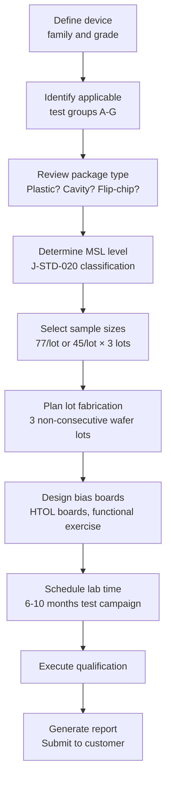
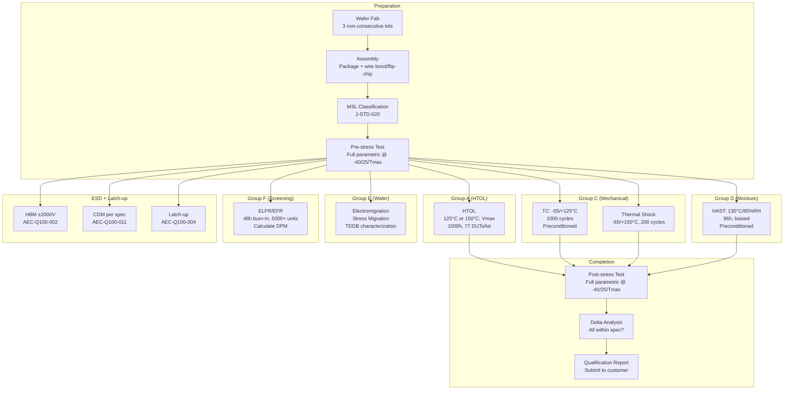
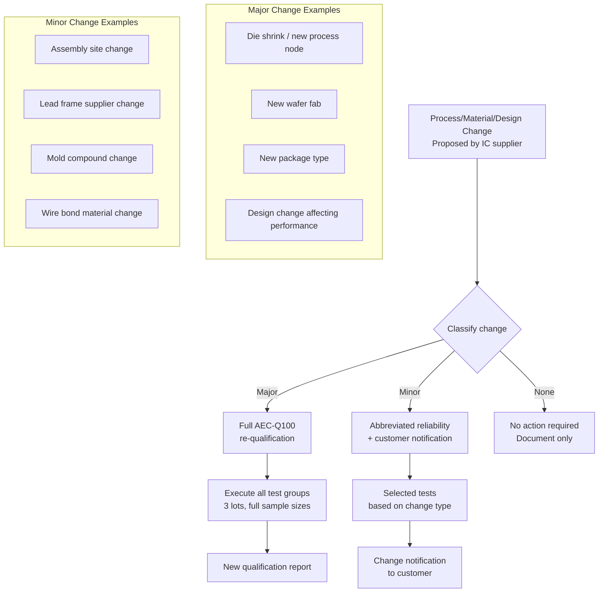

# AEC-Q100 — Automotive IC Qualification

**Topic:** AEC-Q100 — Stress Test Qualification for Integrated Circuits  
**Standard:** AEC-Q100 Rev H (2024), AEC-Q100-xxx appendix documents  
**SDO:** Automotive Electronics Council (AEC) — Component Technical Committee  
**Audience:** IC reliability engineers, automotive quality engineers, semiconductor product engineers, Tier-1 component engineers  
**Prerequisites:** JEDEC test methods (JESD22 series), failure mechanisms, IC packaging, statistical methods

---

## Chapter 1 — Historical Context & Origin Story

### 1.1 Timeline

| Year | Event | Impact |
|------|-------|--------|
| 1994 | AEC-Q100 Rev A | First automotive IC qualification standard |
| 1998 | Rev B | Added Grade 0 (+150°C) |
| 2001 | Rev C | Updated ESD requirements |
| 2003 | Rev D | Clarified sample sizes, added ELFR |
| 2005 | Rev E | MSL preconditioning mandatory |
| 2006 | Rev F | RoHS/lead-free considerations |
| 2007 | Rev G | Updated test group structure |
| 2014 | Rev G (updated) | Minor clarifications |
| 2024 | Rev H | Major update: advanced nodes, chiplets, updated test conditions |

### 1.2 AEC Organization

| Stakeholder | Role |
|-------------|------|
| OEMs (GM, Ford, Chrysler — original founders) | Define reliability requirements |
| Tier-1 (Bosch, Continental, Denso) | Apply requirements to suppliers |
| IC suppliers (TI, NXP, Infineon, Renesas) | Qualify products to AEC-Q100 |
| AEC Component Technical Committee | Maintain and update standard |

---

## Chapter 2 — Standard Architecture & Structure

### 2.1 AEC-Q100 Document Hierarchy

| Document | Content |
|----------|---------|
| AEC-Q100 (main) | Overall qualification requirements, test matrix |
| AEC-Q100-001 | Wire bond shear and pull tests |
| AEC-Q100-002 | HBM ESD test (±2000V requirement) |
| AEC-Q100-003 | Production part approval (PPAP equivalent) |
| AEC-Q100-004 | IC latch-up test (based on JESD78) |
| AEC-Q100-005 | Non-volatile memory endurance/retention |
| AEC-Q100-007 | Fault simulation for FIT rate |
| AEC-Q100-008 | Early Life Failure Rate (ELFR) |
| AEC-Q100-009 | Electrical Distribution validation |
| AEC-Q100-011 | CDM ESD test |
| AEC-Q100-012 | Short circuit reliability |
| AEC-Q100-REV | Revision history and change list |

### 2.2 Temperature Grades and Applications

| Grade | Ambient Range | Junction Temp | Vehicle Location |
|-------|--------------|---------------|-----------------|
| Grade 0 | -40°C to +150°C | Up to +175°C | On-engine, exhaust-mounted |
| Grade 1 | -40°C to +125°C | Up to +150°C | Under-hood (general) |
| Grade 2 | -40°C to +105°C | Up to +125°C | Interior (non-cabin) |
| Grade 3 | -40°C to +85°C | Up to +105°C | Cabin (dashboard, infotainment) |

### 2.3 Complete Test Group Matrix

| Group | Name | Tests | Purpose |
|-------|------|-------|---------|
| A | Accelerated Environmental Stress (Biased) | HTOL | Die-level wearout |
| B | Accelerated Environmental Stress (Unbiased) | UHAST, Autoclave | Package moisture |
| C | Accelerated Lifetime Simulation | TC, PTC, TS | Interconnect fatigue |
| D | Package Assembly Integrity | HAST, THB, biased | Moisture + electrical |
| E | Die Fabrication Reliability | EM, SM, TDDB | Wafer-level reliability |
| F | Defect Screening (ELFR) | Burn-in screening | Remove infant mortality |
| G | Cavity Package Integrity | Seal, moisture | Hermetic package only |

---

## Chapter 3 — Technical Deep Dive

### 3.1 Group A — HTOL (High Temperature Operating Life)

| Parameter | Grade 0 | Grade 1 | Grade 2 | Grade 3 |
|-----------|---------|---------|---------|---------|
| Temperature (Tj) | 150°C | 125°C | 105°C | 85°C |
| Bias | Vdd max | Vdd max | Vdd max | Vdd max |
| Duration | 1000h | 1000h | 1000h | 1000h |
| Sample/lot | 77 (standard) or 45 (reduced) | 77/45 | 77/45 | 77/45 |
| Lots | 3 non-consecutive | 3 | 3 | 3 |
| Accept | 0 failures | 0 failures | 0 failures | 0 failures |
| Interim reads | 168h, 500h, 1000h | 168h, 500h, 1000h | Same | Same |
| Functionality | Dynamic operating (clocking, I/O toggling) | Same | Same | Same |

**Critical implementation notes:**
- "Dynamic operating" means device must be actively functioning during stress (not just powered)
- Design bias boards that exercise all major functional blocks
- Monitor supply current during stress (sudden increase = failure)
- Temperature uniformity across all DUT positions: ±3°C

### 3.2 Group C — Temperature Cycling

| Condition | Grade 0 | Grade 1 | Grade 2/3 |
|-----------|---------|---------|-----------|
| Cold | -55°C (or -65°C) | -55°C (or -65°C) | -55°C (or -40°C) |
| Hot | +150°C | +125°C | +105°C or +85°C |
| Cycles | 1000 | 1000 | 500-1000 |
| Dwell time | 10 min minimum | 10 min minimum | 10 min minimum |
| Transfer time | < 1 min (air-to-air) | < 1 min | < 1 min |
| ΔT | 205°C (Gr.0) | 180°C (Gr.1) | 160/125°C |
| Preconditioning | Required (MSL level) | Required | Required |

### 3.3 Group D — Moisture Tests

| Test | Conditions | Duration | Purpose |
|------|-----------|----------|---------|
| HAST (biased) | 130°C, 85%RH, Vbias | 96h | Accelerated moisture (preferred) |
| THB (alternative) | 85°C, 85%RH, Vbias | 1000h | Slower, allows in-situ monitoring |
| Autoclave (unbiased) | 121°C, 100%RH, unbiased | 96h | Maximum moisture penetration |

All require MSL preconditioning first (JESD22-A113): bake → moisture soak → 3× reflow simulation.

### 3.4 ESD Requirements (AEC-Q100-002 / -011)

| Model | Requirement | Standard | Notes |
|-------|-------------|----------|-------|
| HBM (Human Body Model) | ±2000V (all pins) | AEC-Q100-002 / JESD22-A114 | Minimum for automotive |
| CDM (Charged Device Model) | Per package size (250-750V) | AEC-Q100-011 / JESD22-C101 | More relevant for advanced nodes |
| MM (Machine Model) | Deprecated (removed from AEC-Q100) | Was JESD22-A115 | No longer required |

### 3.5 Latch-up Requirements (AEC-Q100-004)

| Parameter | Requirement |
|-----------|-------------|
| Trigger current (I/O pins) | ±100 mA or 1.5× Imax (whichever greater) |
| Trigger current (supply pins) | Overvoltage: 1.5× Vmax, undervoltage: -0.3× Vmax |
| Temperature | Test at maximum rated temperature |
| Pass criteria | No latch-up triggered (Idd stays normal) |
| Supply voltage during test | Nominal Vdd |
| Pulse duration | > 200 µs (for current injection) |
| CMOS processes only | Not applicable to SOI, non-CMOS |

---

## Chapter 4 — Implementation Guide

### 4.1 AEC-Q100 Qualification Plan Development



### 4.2 Lot Selection Rules

| Rule | Requirement |
|------|-------------|
| Number of lots | Minimum 3 |
| Non-consecutive | Different fabrication dates (weeks apart) |
| Different wafers | Not all from same wafer in a lot |
| Representative process | Should span normal process window |
| Yield | Qualification lots should have typical (not cherry-picked) yield |
| Traceability | Full lot genealogy documented |

### 4.3 Failure Criteria and Disposition

| Result | Action |
|--------|--------|
| 0 failures across all tests | PASS — qualification complete |
| 1+ failure in any test | FAIL — failure analysis required |
| Failure is extrinsic (handling damage, test error) | May exclude with documented evidence |
| Failure is intrinsic (design/process weakness) | Must fix and re-qualify |
| Parametric drift (within spec) | PASS — but monitor trend |
| Parametric drift (approaching spec) | CONCERN — evaluate end-of-life projection |

---

## Chapter 5 — Certification & Audit

### 5.1 AEC-Q100 Qualification Report Contents

| Section | Content |
|---------|---------|
| Device identification | Part number, package, die revision, process node |
| Grade declaration | Temperature grade (0/1/2/3) |
| Test conditions | Exact conditions for each group (temp, voltage, time) |
| Sample identification | Lot codes, wafer numbers, assembly dates |
| Pre-stress data | All parametric measurements before stress |
| Post-stress data | All parametric measurements after stress |
| Delta analysis | Parameter drift summary |
| Pass/fail declaration | 0 failures = PASS per group |
| ESD classification | HBM level + CDM level |
| Latch-up results | Pass/fail at rated temperature |
| MSL classification | Moisture Sensitivity Level per J-STD-020 |
| Supporting data | Wafer-level reliability (EM, SM, TDDB) |

### 5.2 Customer Acceptance Process

| Step | Activity |
|------|----------|
| 1 | IC supplier sends qualification report to customer |
| 2 | Customer reliability team reviews report |
| 3 | Questions/clarifications (technical discussion) |
| 4 | Customer may request additional data (extended HTOL, more lots) |
| 5 | Formal qualification acceptance letter |
| 6 | Production part approval process (PPAP equivalent: AEC-Q100-003) |
| 7 | Part listed on customer's approved parts list |
| 8 | Ongoing production monitoring established |

---

## Chapter 6 — Regional & Domain Variants

### 6.1 AEC-Q100 vs. Other Qualification Standards

| Aspect | AEC-Q100 | JEDEC JESD47 | MIL-PRF-38535 | IATF 16949 |
|--------|---------|-------------|---------------|------------|
| Scope | IC stress tests | IC stress tests (basis) | QML certification | Quality management system |
| Market | Automotive | Commercial | Military/space | Automotive (system level) |
| Temperature | Up to +150°C | Up to +85°C typical | Up to +125°C (Class B) | N/A |
| Duration | 1000h HTOL | 1000h HTOL | 1000-5000h | N/A |
| ESD | ±2000V HBM + CDM | ±2000V HBM | ±4000V HBM | N/A |
| Ongoing monitoring | Required | Recommended | Required (QML) | Required (SPC) |
| Audit | Customer-driven | None formal | DLA audit | 3rd party certification |
| Cost | $200K-500K | $100K-300K | $500K-2M | Per organization |

---

## Chapter 7 — Comparison: AEC-Q100 Grade 0 vs. Grade 1

| Aspect | Grade 0 (-40/+150°C) | Grade 1 (-40/+125°C) |
|--------|----------------------|----------------------|
| Application | On-engine, exhaust, turbo proximity | Under-hood general |
| HTOL temperature | 150°C (Tj up to 175°C) | 125°C (Tj up to 150°C) |
| TC range | -55°C to +150°C (ΔT=205°C) | -55°C to +125°C (ΔT=180°C) |
| IC packaging | Must withstand higher thermal stress | Standard automotive |
| Design challenge | Leakage at 150°C (exponential increase) | Moderate |
| Power management | Significant derating at high temp | Standard |
| Available ICs | Limited (few suppliers qualify Gr.0) | Most automotive ICs |
| Cost premium | 20-50% over Grade 1 | Baseline automotive cost |
| Typical applications | Engine ECU, transmission controller | ADAS, body, gateway |

---

## Chapter 8 — Mermaid Architecture Diagrams

### 8.1 AEC-Q100 Complete Test Flow



### 8.2 Change Management Flow



---

## Chapter 9 — Case Studies & Failure Analysis

### 9.1 HTOL Failure — Electromigration in 28nm

**Device:** 28nm automotive MCU, Grade 1 qualification.

**Observation:** 1 failure at 500h HTOL readout (out of 231 total). Device showed open-circuit on one I/O pin.

**Failure Analysis:**
1. Electrical characterization: pin fully open (infinite resistance)
2. Package X-ray: no wire bond lift or crack visible
3. Decapsulation: no visible damage on bond pad
4. FIB cross-section at suspected metal layer: void in Metal-4 trace near via
5. EDS/TEM analysis: void consistent with electromigration (EM)
6. Root cause: metal line width at that via was below minimum design rule (mask error)

**Resolution:**
- Metal mask corrected (width violation fixed)
- Affected wafer lots screened (electrical test tightened for that path)
- New 3 lots fabricated and re-qualified (full Group A + Group E)
- Passed with 0 failures
- Total delay: 4 months

### 9.2 Field Return — Latch-up in Engine ECU

**Symptom:** Engine ECU intermittently draws excessive current, blows fuse. Only occurs at high ambient temperatures (hot summer day, engine bay > 120°C).

**Root cause:**
- MCU latch-up triggered by undershoot on I/O pin from noisy sensor signal
- At high temperature: latch-up trigger threshold decreases (parasitic bipolar gain increases with temperature)
- AEC-Q100-004 requires latch-up test at maximum rated temperature — this IC was tested at +125°C but the field condition was +135°C (ambient + self-heating)

**Corrective actions:**
- IC redesign: increased N-well/P-well spacing on affected I/O (increase holding voltage)
- Application: added TVS diode on sensor input (clamp undershoot)
- Qualification: re-tested latch-up at +150°C (Grade 0 test condition even though Grade 1 device) — passed with margin

---

## Chapter 10 — Future Evolution & Industry Trends

| Trend | Impact on AEC-Q100 |
|-------|-------------------|
| Advanced nodes (3nm, 2nm) | Higher electric fields → accelerated TDDB/NBTI, reduced ESD robustness |
| Chiplets / 2.5D / 3D | Need new test methods for die-to-die interconnects |
| Wide bandgap (SiC, GaN) | Different failure mechanisms → AEC-Q101 evolution needed |
| Higher junction temperatures | Grade 0+ (>150°C) may be needed for SiC/GaN gate drivers |
| AI/ML automotive chips | Higher power density → new EM and thermal challenges |
| ISO 26262 Part 11 | Integration of safety metrics (SPFM, LFM, PMHF) into qual |
| Mission profile approach | Move from generic stress to application-specific profiles |
| Predictive reliability | In-situ monitors → real-time aging assessment (SLM) |
| Zero-defect philosophy | DPPM targets dropping (from 1 DPPM → 0.1 DPPM) |
| Supply chain resilience | Multi-source qualification (same IC from multiple fabs) |

---

## Chapter 11 — Interview Questions & Career Guide

### Tier 1: Entry-Level (0-3 years)

**Q1:** A customer asks you to qualify a microcontroller to AEC-Q100 Grade 1. List the major test groups and their purpose.  
**A:** AEC-Q100 Grade 1 means -40°C to +125°C ambient range. **Major test groups:** **Group A (HTOL — biased life):** Stress at 125°C junction, maximum voltage, 1000 hours. 77 devices × 3 lots = 231 total. Purpose: accelerate intrinsic wearout (TDDB, EM, NBTI, HCI). **Group C (Temperature Cycling):** -55°C to +125°C, 1000 cycles (with MSL preconditioning). Purpose: verify package interconnects survive thermal fatigue (CTE mismatch between die, mold compound, solder, PCB). **Group D (HAST — biased moisture):** 130°C, 85%RH, biased, 96 hours (with preconditioning). Purpose: verify no moisture-induced corrosion or electrochemical migration under automotive life. **Group E (Wafer-level):** Electromigration (EM) and Stress Migration (SM) test structures tested at wafer level. Purpose: verify metal interconnect reliability for the process technology. **Group F (ELFR — Early Life Failure Rate):** 48 hours burn-in on 5000+ devices. Measure: how many fail early (infant mortality). Target: < 50 DPM. Purpose: characterize defect screening effectiveness. **Additionally:** ESD testing (HBM ±2000V, CDM per package), Latch-up testing at +125°C. **All groups must achieve zero failures** on the qualification sample.

### Tier 2: Mid-Level (3-8 years)

**Q2:** You have 1 failure out of 231 devices in HTOL. Walk through the decision process.  
**A:** **(1) Immediate actions:** Stop further stress (preserve evidence). Isolate failed device. Perform full electrical characterization to identify failure mode (which parameter? which pin?). **(2) Failure analysis:** Electrical fault localization (photon emission, OBIRCH if available). Physical analysis: decap → optical → SEM → FIB cross-section if needed. Identify failure mechanism: is it EM, TDDB, HCI, NBTI, package-related? **(3) Classification:** **Intrinsic failure (design/process weakness):** Root cause is inherent to the design or process. Example: metal line too narrow → EM failure. Action: QUALIFICATION FAILS. Must fix root cause and re-qualify (full re-qual of affected groups). **Extrinsic failure (random defect):** Root cause is manufacturing defect not representative of the design. Example: particle contamination during fab (one-time event). Action: may be possible to exclude IF documented evidence proves it's not systematic. Requires customer agreement. Very high bar to exclude — most customers will not accept exclusion. **(4) If excluded (rare):** Document: failure analysis report showing non-representative nature. Customer formally agrees to exclusion. Note: if customer does NOT agree → treat as intrinsic → fix and re-qualify. **(5) Practical reality:** Most automotive customers: 1 failure = re-qualify. Even if excludable, the investigation + documentation + customer negotiation takes 2-3 months. Often faster to fix the root cause and re-run the test. **(6) Prevention:** Design for Reliability (DFR): ensure adequate design margins at qualification stage. Use EM/TDDB guardbands from foundry PDK (don't design to minimum rules for automotive).

### Tier 3: Senior/Lead (8-15 years)

**Q3:** Compare mission-profile-based qualification vs. standard AEC-Q100 generic stress. Which is better for automotive?  
**A:** **Standard AEC-Q100 (generic stress):** One-size-fits-all: same test conditions regardless of application. Example: Grade 1 HTOL at 125°C/1000h whether IC goes in engine ECU or ADAS camera. Advantages: simple, consistent across industry, comparability between suppliers. Disadvantages: may over-test for mild applications (waste), may under-test for severe applications (risk). **Mission-profile-based qualification:** Application-specific: derive test conditions from actual use conditions. Steps: (1) Define mission profile (temperature histogram, duty cycle, vibration, humidity during 15-year life). (2) Calculate equivalent stress (Arrhenius/Coffin-Manson) to accelerate that specific profile. (3) Test at conditions that specifically validate the actual application. Advantages: scientifically more accurate, can optimize (not over/under-test). Disadvantages: complex (each application different), less comparability, requires detailed use data. **My recommendation:** Use **both complementary**: (1) Standard AEC-Q100 as **baseline** (ensures industry-standard minimum reliability). All ICs must pass AEC-Q100 as minimum entry ticket. (2) Mission-profile analysis as **additional evidence** for critical applications. For safety-critical (ASIL C/D): perform mission-profile calculation to verify AEC-Q100 provides adequate coverage. If mission profile reveals gaps (e.g., power cycling not adequately tested): add application-specific tests beyond AEC-Q100. **Practical example:** ADAS ECU in hot climate (Saudi Arabia): average Tj = 95°C (not 55°C assumption). Standard AEC-Q100 HTOL at 125°C/1000h gives AF ≈ 78× for 55°C use. But for 95°C use: AF ≈ only 10×. 1000h × 10 = 10,000h equivalent = 1.1 years. Not enough for 15-year life! Solution: extend HTOL to 2000h or increase temperature to 150°C (Grade 0) even for Grade 1 application. This is why mission-profile analysis is valuable — it identifies when generic AEC-Q100 isn't enough.

### Tier 4: Principal/Distinguished (15+ years)

**Q4:** AEC-Q100 has remained fundamentally unchanged since 1994 (stress-test-then-pass approach). Propose a modernized automotive IC qualification paradigm for 2030.  
**A:** **Current paradigm limitations:** (1) Pass/fail at arbitrary 1000h — doesn't characterize actual lifetime margin. (2) Zero-failure criterion gives very limited statistical confidence (0/231 = 51 FIT at 60% CL — not great). (3) Same test for all applications (as discussed above). (4) Doesn't leverage modern in-silicon monitoring capabilities. (5) Snapshot in time — doesn't address degradation during production lifetime. **Proposed 2030 paradigm: "Continuous Reliability Assurance":** **Pillar 1 — Mechanism-specific characterization (replace generic HTOL):** Instead of 1000h generic HTOL: separately characterize TDDB, EM, NBTI, HCI. For each: determine Weibull parameters (β, η) and acceleration models. Provides quantitative lifetime prediction per mechanism (not just "passed 1000h"). Output: reliability model (not just pass/fail). **Pillar 2 — Mission-profile-driven acceptance criteria:** Define standard mission profiles per application class (engine, ADAS, body, infotainment). Calculate: required equivalent stress hours for each mission profile. Qualification test duration determined by mission profile (not fixed 1000h). Accept criteria: demonstrated lifetime margin > 3× (not just "passed"). **Pillar 3 — In-silicon reliability monitoring (SLM):** Require reliability monitor circuits built into every automotive IC: aging sensors (ring oscillators, NBTI monitors), temperature sensors (track thermal history), usage counters (power cycles, operating hours). During vehicle life: OTA reads reliability status periodically. Benefits: detect approaching wearout BEFORE failure, validate qualification predictions. **Pillar 4 — Population-based reliability management:** Large fleet data: millions of ICs in field provide statistical evidence. Bayesian updating: combine qualification predictions with field data. If field data confirms qualification: increase confidence without more testing. If field data shows unexpected failures: early warning system. **Pillar 5 — Continuous qualification for process changes:** Current: process change → full re-qualification (6-12 months). Future: maintain "digital twin" of qualification. Process change → simulate impact on reliability model → determine if re-test needed. Only re-test what's affected (targeted, not blanket). **Implementation timeline:** 2025-2027: Pillar 5 (targeted re-qual for changes — industry already moving here). 2026-2028: Pillar 2 (mission profiles — some OEMs already doing). 2027-2030: Pillar 1 (mechanism-specific — requires foundry cooperation). 2028-2032: Pillar 3 (SLM — silicon area cost is barrier). 2030+: Pillar 4 (population-based — requires data infrastructure). **Industry barrier:** AEC works by consensus. Semiconductor suppliers, OEMs, and Tier-1s must all agree. Conservative industry — changes take 5-10 years from proposal to adoption. Start evangelizing at AEC working group meetings NOW.

---

## Chapter 12 — Cheat Sheet & Quick Reference

### AEC-Q100 Quick Decision Guide

```
What grade do I need?
  IC near engine/exhaust:     Grade 0 (-40/+150°C)
  IC under-hood (general):    Grade 1 (-40/+125°C)
  IC interior (door module):  Grade 2 (-40/+105°C)
  IC in cabin (head unit):    Grade 3 (-40/+85°C)

What tests are required?
  All grades: HTOL + TC + HAST + ESD + Latch-up + ELFR + Wafer-level
  Grade 0: higher stress (150°C HTOL, wider TC range)
  Grade 3: lower stress (85°C HTOL, narrower TC range)
```

### AEC-Q100 Test Conditions at a Glance

```
HTOL:       Tj = Grade max, Vmax, 1000h, 77/lot × 3 lots
TC:         -55°C to +Tmax_grade, 1000 cycles, preconditioned
HAST:       130°C, 85%RH, Vbias, 96h, preconditioned
ELFR:       48h, elevated T+V, ≥5000 units, calculate DPM
HBM ESD:    ±2000V all pins (AEC-Q100-002)
CDM ESD:    Per package size (AEC-Q100-011)
Latch-up:   ±100mA trigger, at Tmax (AEC-Q100-004)
EM/SM:      Wafer-level, foundry standard
```

### Key Numbers

```
Sample size:  77 per lot × 3 lots = 231 total (standard)
              45 per lot × 3 lots = 135 total (reduced, with justification)
Accept:       0 failures (zero defect)
ESD HBM:     ±2000V minimum (all pins)
ELFR target:  < 50 DPM (early life defects)
DPPM target:  < 1 DPPM (outgoing quality)
FIT target:   < 10 FIT (intrinsic IC failure rate)
```

### Common Failure Analysis Sequence

```
1. Electrical characterization (identify failing parameter/pin)
2. Optical microscopy (package-level damage)
3. X-ray (wire bonds, BGA balls, delamination)
4. CSAM (internal delamination)
5. Decapsulation (chemical for plastic packages)
6. Optical/SEM inspection of die surface
7. Photon emission / OBIRCH (localize defect)
8. FIB cross-section (expose failure site)
9. TEM (atomic-level imaging if needed)
10. Root cause determination + corrective action
```

---

*End of Document — 02_AEC_Q100_IC_Qualification.md*
