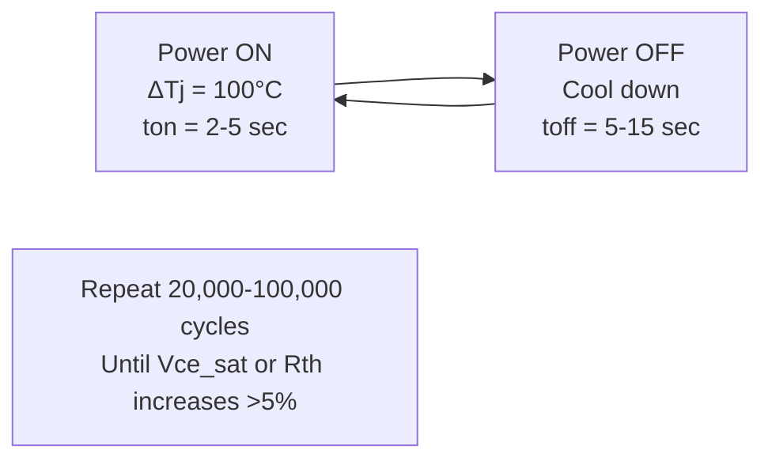
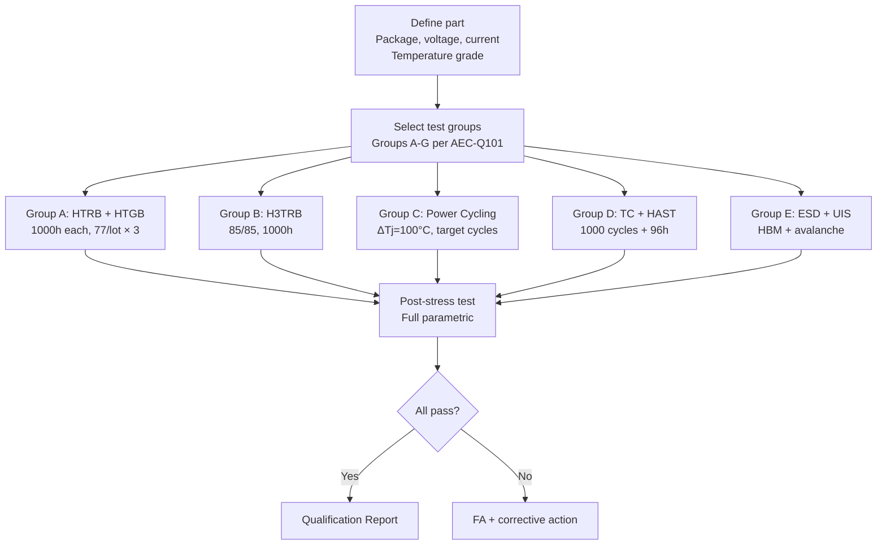
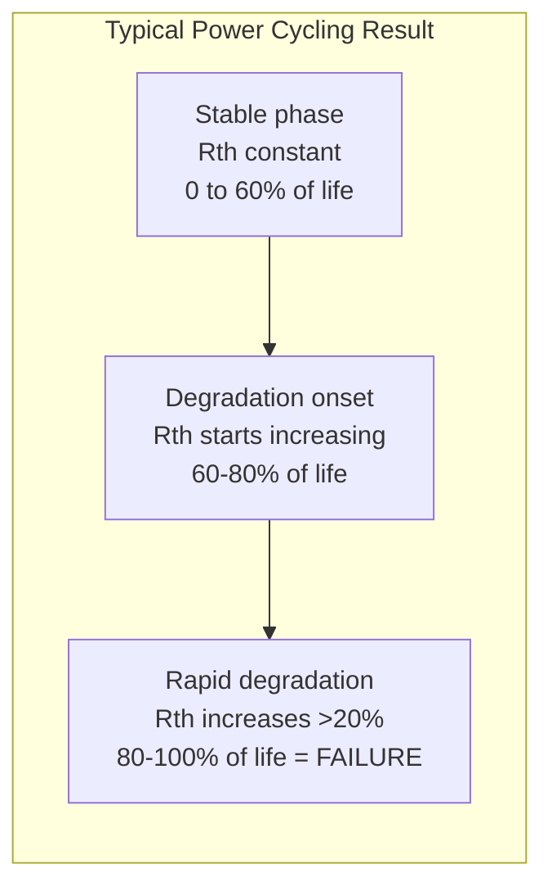

# AEC-Q101 — Discrete Semiconductor Qualification

**Topic:** AEC-Q101 — Stress Test Qualification for Discrete Semiconductors  
**Standard:** AEC-Q101 Rev E, referenced JEDEC/MIL test methods  
**SDO:** Automotive Electronics Council (AEC) — Component Technical Committee  
**Audience:** Power electronics engineers, discrete device reliability engineers, automotive Tier-1 quality engineers  
**Prerequisites:** Power semiconductor physics (MOSFETs, IGBTs, diodes, BJTs), thermal management, AEC-Q100 familiarity

---

## Chapter 1 — Historical Context & Origin Story

### 1.1 Timeline

| Year | Event | Impact |
|------|-------|--------|
| 1997 | AEC-Q101 Rev A | First automotive discrete qualification |
| 2005 | Rev C | Updated for lead-free transition |
| 2009 | Rev D | Added SiC/GaN preliminary guidance |
| 2015 | Rev D1 | Power cycling + gate endurance updates |
| 2021 | Rev E | Major update: WBG (wide bandgap) focus, updated power cycling |
| 2024+ | Active revision work | SiC gate oxide, GaN reliability, automotive-grade WBG |

### 1.2 Scope — Device Types Covered

| Category | Devices | Typical Applications |
|----------|---------|---------------------|
| MOSFETs | N-ch, P-ch (Si, SiC, GaN) | Inverters, DC-DC, motor drivers |
| IGBTs | Punch-through, NPT, RC-IGBT | EV traction inverters, chargers |
| Diodes | Schottky, PiN, SiC SBD, TVS | Rectification, protection, freewheeling |
| BJTs | NPN, PNP | Legacy linear regulators, drivers |
| Thyristors | SCR, TRIAC, GTO | High-power switching (rare in auto) |
| JFETs | SiC JFET | Emerging SiC power |

---

## Chapter 2 — Standard Architecture & Structure

### 2.1 AEC-Q101 Test Groups

| Group | Name | Key Tests | Purpose |
|-------|------|-----------|---------|
| A | Environmental Stress (Biased) | HTOL, HTRB, HTGB | Active wearout under bias |
| B | Environmental Stress (Unbiased) | H3TRB (85/85), high-temp storage | Moisture + thermal aging |
| C | Operational Life | IOL (Intermittent Operating Life), power cycling | Real-world thermal stress |
| D | Assembly/Packaging | TC, thermal shock, moisture | Package interconnect |
| E | Electrical/ESD | ESD (HBM, CDM), avalanche, UIS | Electrical robustness |
| F | Defect Screening | Burn-in / parametric screen | Infant mortality |
| G | Die Fabrication | EM, gate oxide integrity | Process reliability |

### 2.2 Key Differences: AEC-Q101 vs. AEC-Q100

| Aspect | AEC-Q100 (ICs) | AEC-Q101 (Discretes) |
|--------|----------------|---------------------|
| Device type | Complex digital/analog ICs | Single-function power/signal devices |
| Primary stress | HTOL (all blocks exercised) | HTRB/HTGB (blocking + gate stress) |
| Unique test | Latch-up (CMOS) | Power cycling, UIS, avalanche |
| Current focus | Logic function + low power | High current (100-1000A) + high voltage (400-1700V) |
| Thermal stress | Junction temp from leakage/switching | Junction temp from I²R heating |
| Key failure mode | TDDB, EM (interconnect) | Bond wire lift, solder fatigue, gate oxide (SiC) |
| Power cycling | Not typically required | Critical (Group C) |

---

## Chapter 3 — Technical Deep Dive

### 3.1 Group A — Biased Stress Tests

**HTRB (High Temperature Reverse Bias):**

| Parameter | Condition |
|-----------|-----------|
| Temperature | 150°C (Grade 0) or 125°C (Grade 1) |
| Bias | 80-100% of rated breakdown voltage (reverse blocking) |
| Duration | 1000 hours |
| Sample size | 77/lot × 3 lots |
| Purpose | Stress depletion region (hot carrier, ionic drift, oxide charge) |
| Failure criteria | Leakage current exceeds spec |

**HTGB (High Temperature Gate Bias):**

| Parameter | Condition |
|-----------|-----------|
| Temperature | 150°C or 125°C |
| Bias | Maximum rated gate voltage (Vgs_max) |
| Duration | 1000 hours |
| Purpose | Gate oxide integrity (especially critical for SiC!) |
| Failure criteria | Vth shift > spec, gate leakage increase |

**H3TRB (Humidity, High Temperature Reverse Bias):**

| Parameter | Condition |
|-----------|-----------|
| Temperature | 85°C |
| Humidity | 85% RH |
| Bias | 80% of rated voltage (reverse) |
| Duration | 1000 hours |
| Purpose | Moisture + high voltage → surface charge accumulation, corrosion |

### 3.2 Group C — Power Cycling (Critical for Power Devices)



| Parameter | Typical Conditions |
|-----------|-------------------|
| ΔTj (junction swing) | 80-120°C per cycle |
| Tj_max | 150°C or 175°C |
| Heating time (ton) | 2-5 seconds (fast cycle) or 30-60s (slow cycle) |
| Cooling time (toff) | Until Tj returns to baseline |
| Cycle count target | 20,000 - 100,000+ (application-dependent) |
| Failure criteria | Vce(sat) increase > 5% or Rth increase > 20% |
| Monitored parameters | Vce(sat), Vf, Rth(j-c) — per cycle |

**Failure mechanisms in power cycling:**
- Wire bond heel crack (thermal fatigue from repeated ΔTj)
- Wire bond lift-off (aluminum-silicon interface degradation)
- Solder layer fatigue (die attach or substrate solder)
- Reconstruction (aluminum metallization texture change)

### 3.3 UIS (Unclamped Inductive Switching) — Avalanche Robustness

| Parameter | Condition |
|-----------|-----------|
| Test circuit | Inductor (L) in series with DUT |
| Energy | $E_{AV} = \frac{1}{2}LI^2 \cdot \frac{BV_{DSS}}{BV_{DSS} - V_{DD}}$ |
| Temperature | Room temp + elevated (150°C) |
| Repetitive | Single pulse and repetitive avalanche |
| Pass criteria | No degradation after specified number of pulses |
| Purpose | Verify device survives inductive turn-off spikes in motor drives |

### 3.4 SiC-Specific Challenges (Rev E Focus)

| Challenge | Impact | Test Method |
|-----------|--------|-------------|
| Gate oxide quality (SiC/SiO₂ interface) | Higher Dit → Vth instability, TDDB | Extended HTGB (175°C, 2000h+) |
| Body diode degradation | Stacking faults from bipolar recombination | Body diode stress test |
| Short-circuit withstand time | SiC: 2-5 µs vs. Si IGBT: 10 µs | Short circuit test |
| Threshold voltage hysteresis | Charge trapping → Vth shifts ±1V | Vth measurement after + and - gate stress |
| Cosmic ray (neutron) failures | SiC has higher FIT at high blocking voltage | Altitude/neutron testing |

---

## Chapter 4 — Implementation Guide

### 4.1 Qualification Plan for Automotive MOSFET



### 4.2 Power Cycling Test Setup

| Component | Specification |
|-----------|--------------|
| Power source | Programmable constant current (up to rated Id) |
| Gate driver | Fast switching (ton/toff controllable) |
| Cooling | Baseplate temperature control (forced air or liquid) |
| Monitoring | In-situ Vce(sat)/Rds(on) measurement per cycle |
| Thermal measurement | IR camera or Vce(sat) transient method |
| Data acquisition | Record every Nth cycle (e.g., every 100th) |
| DUT quantity | 20-30 devices (statistical, since power cycling has spread) |
| Duration | Weeks to months (depending on cycle time and target) |

---

## Chapter 5 — Certification & Audit

### 5.1 Qualification Report Contents (Q101-specific)

| Section | Content |
|---------|---------|
| Device description | Part number, die size, package, voltage/current rating |
| Process technology | Si, SiC, GaN, planar/trench, gate oxide thickness |
| HTRB results | Leakage drift, 0 failures |
| HTGB results | Vth drift, gate leakage, 0 failures |
| Power cycling results | Number of cycles achieved, Rth/Vce degradation curve |
| UIS results | Avalanche energy per pulse, repetitive avalanche count |
| TC/HAST results | Package integrity, 0 failures |
| ESD classification | HBM voltage (typically ±2000V for power devices) |
| Thermal characterization | Rth(j-c), Rth(j-a), transient thermal impedance |
| Application guidelines | Safe Operating Area (SOA), derating |

---

## Chapter 6 — Regional & Domain Variants

### 6.1 Automotive Power Semiconductor Applications

| Application | Device | Voltage | Current | Key Qualification Focus |
|-------------|--------|---------|---------|------------------------|
| EV traction inverter | SiC MOSFET / Si IGBT | 650-1200V | 200-600A (module) | Power cycling (severe ΔTj) |
| OBC (On-Board Charger) | SiC MOSFET | 650-1200V | 20-60A | HTGB (gate oxide), efficiency |
| DC-DC converter | Si/GaN MOSFET | 40-100V | 30-80A | Avalanche (UIS), fast switching |
| Motor driver (EPS, window) | Si MOSFET | 40-60V | 20-100A | Short circuit, power cycling |
| LED driver | Si MOSFET + SBD | 40-100V | 1-10A | HTOL, thermal |
| BMS (battery management) | Si MOSFET | 40-100V | 10-50A | HTGB, H3TRB (moisture + voltage) |
| Ignition | Si IGBT | 400V | 20-30A peak | UIS (inductive coil), Tj_max |

---

## Chapter 7 — Comparison: Si vs. SiC vs. GaN Qualification

| Aspect | Silicon MOSFET | SiC MOSFET | GaN HEMT |
|--------|---------------|-----------|----------|
| Gate oxide | Reliable (mature SiO₂/Si interface) | Critical concern (SiC/SiO₂ high Dit) | No oxide (GaN is normally-off with p-GaN or cascode) |
| HTGB criticality | Standard (1000h sufficient) | VERY critical (may need 2000h+) | Different: gate injection stress |
| Body diode | Robust | Degradation risk (stacking faults) | No body diode (cascode has Si body diode) |
| Power cycling | Wire bond / solder fatigue | Same + die attach (higher Tj possible) | Lower loss → less thermal stress |
| Max Tj rated | 175°C | 175-200°C (but oxide limits) | 150°C (GaN-on-Si) |
| Cosmic ray FIT | Low at < 600V | Higher at 1200V (thicker drift region) | Low (lateral device) |
| Short circuit | Si IGBT: 10 µs withstand | SiC MOSFET: 2-5 µs (challenge!) | Very limited (< 1 µs) |
| Qualification maturity | Very mature (decades) | Maturing (issues being resolved) | Early (limited automotive field data) |
| AEC-Q101 coverage | Fully covered | Mostly covered (gaps in gate oxide) | Partially covered (new test needed) |

---

## Chapter 8 — Mermaid Architecture Diagrams

### 8.1 Power Module Cross-Section (Failure Locations)

```mermaid
graph TB
    subgraph "Power Module Cross-Section"
        A[Wire Bonds<br/>Failure: heel crack, lift-off<br/>Test: Power cycling, TC]
        B[Die Top Metal<br/>Failure: reconstruction<br/>Test: Power cycling]
        C[Die (Si/SiC/GaN)<br/>Failure: gate oxide, cosmic ray<br/>Test: HTGB, HTRB]
        D[Die Attach Solder<br/>Failure: fatigue cracks, voids<br/>Test: Power cycling, TC]
        E[DBC Substrate<br/>Failure: copper delamination<br/>Test: TC, thermal shock]
        F[Substrate Solder<br/>Failure: fatigue cracking<br/>Test: TC (slow cycle)]
        G[Baseplate (Cu/AlSiC)<br/>Failure: warpage<br/>Test: TC]
    end
    
    A --- B --- C --- D --- E --- F --- G
```

### 8.2 Power Cycling Degradation Curve



---

## Chapter 9 — Case Studies & Failure Analysis

### 9.1 SiC MOSFET Gate Oxide Failure in EV Inverter

**Problem:** Field returns of SiC MOSFETs in 800V EV traction inverter after 18 months. Symptom: gate-source short circuit → shoot-through → module destruction.

**Root cause analysis:**
1. Gate oxide TDDB (Time-Dependent Dielectric Breakdown)
2. SiC/SiO₂ interface has 10-100× higher defect density than Si/SiO₂
3. Application used Vgs = +18V/-5V (aggressive for SiC)
4. Combined with self-heating at high power: effective oxide field stress higher than qualification condition
5. HTGB qualification (1000h at 125°C, Vgs = +20V) was insufficient for this field condition

**Resolution:**
- Reduced gate drive to +15V/-4V (lower oxide field stress)
- IC supplier improved gate oxide process (post-oxidation anneal optimization)
- Extended qualification: HTGB 2000h at 175°C for new batch
- Added in-field monitoring: measure gate leakage periodically during service

### 9.2 Wire Bond Lift in IGBT Module (Power Cycling)

**Problem:** IGBT power module for hybrid vehicle showed Vce(sat) increase after 15,000 power cycles (target: 50,000).

**Analysis:**
- Cross-section showed aluminum wire bond lift at 3 of 5 bonds
- CTE mismatch: Al wire (23 ppm/K) vs. Si die (2.6 ppm/K)
- ΔTj in application: 130°C per cycle (aggressive duty)
- Coffin-Manson prediction: should have achieved 30,000 cycles at this ΔTj

**Root cause:** One wire bond pad had thinner aluminum metallization (process variation) → higher local stress.

**Corrective action:**
- Tightened aluminum deposition uniformity specification
- Added Cu clip bonding option (higher fatigue resistance than Al wire)
- Qualification re-run with copper clip: achieved 80,000+ cycles

---

## Chapter 10 — Future Evolution & Industry Trends

| Trend | Impact on AEC-Q101 |
|-------|-------------------|
| SiC mainstream for EV (800V) | Gate oxide reliability is #1 issue, needs extended HTGB |
| GaN for low-voltage automotive | New failure modes (current collapse, dynamic Rdson) |
| Higher Tj operation (200°C+) | Grade 0+ needed, new packaging materials required |
| Sintered die attach (replace solder) | Higher reliability but new qualification needed |
| Copper wire bonds (replace Al) | Better fatigue life but harder to process |
| Double-sided cooling modules | New thermal paths, different failure locations |
| Direct bonded aluminum (DBA) | Alternative to DBC substrate |
| SiC/GaN on-chip integration | Monolithic power ICs need combined Q100/Q101 approach |
| Digital twins for power cycling | Predict remaining useful life from mission profile |
| Higher voltage (1700V+) for trucks | Cosmic ray concern increases, need neutron testing |

---

## Chapter 11 — Interview Questions & Career Guide

### Tier 1: Entry-Level (0-3 years)

**Q1:** What is the difference between HTRB and HTGB tests? Why are both needed?  
**A:** **HTRB (High Temperature Reverse Bias):** Device is in OFF state (blocking high voltage). Gate grounded or negative bias. Drain-Source (or Collector-Emitter) at 80-100% of rated breakdown. Tests: depletion region stability, hot carrier effects at junction edges, ionic contamination drift in passivation. Failure mode: leakage current increase (Idss or Ices drift). **HTGB (High Temperature Gate Bias):** Device gate is at maximum rated voltage (positive Vgs_max). Drain-Source at 0V or low voltage. Tests: gate oxide integrity under sustained electric field + temperature. Failure mode: threshold voltage (Vth) shift, gate leakage increase, eventually oxide breakdown. **Why both needed:** They stress DIFFERENT parts of the device: HTRB stresses the drain-body junction and surface passivation (high voltage region). HTGB stresses the gate oxide and channel interface (gate-source region). A device can pass HTRB but fail HTGB (gate oxide weak) or vice versa (junction edge weak). Both failure modes can cause field failures under different operating conditions (blocking vs. conduction).

### Tier 2: Mid-Level (3-8 years)

**Q2:** Design a power cycling qualification plan for a 650V SiC MOSFET going into a 150kW EV inverter. Define the test conditions and target.  
**A:** **(1) Mission profile derivation:** EV inverter mission: 300,000 km lifetime, mixed driving (city + highway). Thermal analysis: ΔTj_max per drive cycle = 100-130°C. Average cycles per day: 200 drive events with significant power. Total lifetime cycles: 200/day × 365 × 15 years = ~1.1 million micro-cycles. But for qualification: simplify to equivalent macro-cycles. **(2) Equivalent power cycling target:** Using Coffin-Manson with m=5 (SiC module): $N_{qual} = N_{field} × (ΔT_{field}/ΔT_{test})^m$ If test at ΔTj=100°C, field max ΔTj=130°C: $N_{qual} = 1,000,000 × (130/100)^5 = 1,000,000 × 3.71 = 3,710,000$ → impractical! Reduce by using higher ΔTj_test: ΔTj_test = 150°C: $N_{qual} = 1,000,000 × (130/150)^5 = 1,000,000 × 0.51 = 510,000$ cycles. Still very long. Practical approach: test at ΔTj = 150°C, target 200,000 cycles (with safety factor acknowledgment). Duration: 200,000 × 20s/cycle = 4,000,000s ≈ 46 days (continuous). **(3) Test conditions:** Heating: Id = rated continuous (e.g., 40A for TO-247 package). ton = 3 seconds (heat junction from 50°C to 200°C). toff = 10 seconds (cool back to 50°C). Baseplate temp: 50°C (liquid-cooled). Monitor per cycle: Vds(on) at low current (Rdson surrogate), Rth(j-c). **(4) Pass criteria:** Rdson increase < 5% at 200,000 cycles. Rth(j-c) increase < 20% at 200,000 cycles. No catastrophic failures. **(5) SiC-specific additions:** Gate stress during power cycling: toggle Vgs +15V/-4V each cycle (realistic). Monitor Vth drift alongside Rdson (gate oxide + thermal aging combined). Body diode conduction: include dead-time body diode operation in cycle.

### Tier 3: Senior/Lead (8-15 years)

**Q3:** A Tier-1 asks: "Is your GaN HEMT automotive-qualified?" Your GaN device passes AEC-Q101, but the standard doesn't fully address GaN-specific failure modes. How do you respond?  
**A:** Honest answer: "We pass all AEC-Q101 Rev E requirements AND have additional GaN-specific qualification data." **(1) What AEC-Q101 covers (and GaN passes):** HTRB: yes, GaN blocks well under reverse bias (actually GaN lateral devices rarely see reverse bias same way as Si — need application-specific consideration). HTGB: partially applicable — GaN gate is p-GaN (not oxide), so stress mechanism different from MOSFET. Power cycling: applicable (standard thermo-mechanical stress). TC, HAST, ESD: applicable (standard package-level tests). **(2) What AEC-Q101 does NOT cover for GaN:** **Dynamic Rdson (current collapse):** Under switching, trapped charges in GaN buffer increase on-resistance temporarily. This is THE major GaN reliability concern. No AEC-Q101 test addresses this. Our additional test: hard-switching at rated voltage for 1000h, measure dynamic Rdson at intervals. **Gate robustness (p-GaN gate):** Not a gate oxide — p-GaN gate injection mechanism is unique. Our additional test: positive gate stress (Vgs = +7V, 1000h) + negative gate stress (Vgs = -10V, 1000h). **Off-state drain stress at high dV/dt:** GaN switching at 200V/ns — parasitic turn-on risk. Our additional test: dV/dt immunity at worst-case temperature. **Reliability under high-frequency switching:** GaN operates at 100kHz-1MHz (much higher than Si/SiC). Hot spots and localized degradation under continuous high-frequency operation. Our additional test: accelerated switching life at 500kHz, 85°C, 1000h. **(3) Recommendation to customer:** Accept AEC-Q101 as baseline (industry standard compliance). Review our supplementary GaN-specific qualification report (addresses above gaps). Perform joint application-specific validation (mission profile analysis for their exact use case). Monitor field data closely during first 2 years (new technology risk mitigation).

### Tier 4: Principal/Distinguished (15+ years)

**Q4:** Design the qualification framework for a next-generation automotive SiC power module rated at 1200V, 200°C junction operation, with 20-year lifetime target. Current AEC-Q101 is insufficient.  
**A:** 200°C Tj operation exceeds current Grade 0 (+150°C ambient → ~175°C Tj). 20 years exceeds standard 15-year assumption. This requires a fundamentally enhanced qualification framework. **(1) New temperature grade:** Define "Grade 0+" or "Grade -1": Tj_max = 200°C operating. HTRB/HTGB at 200°C (not 150°C). Requires all packaging materials rated for 200°C continuous (beyond standard mold compound Tg). Package options: transfer mold with high-Tg compound, or module (no mold compound). **(2) Gate oxide qualification (SiC at 200°C):** Critical: SiC gate oxide reliability worsens exponentially with temperature. Standard HTGB (150°C, 1000h) grossly inadequate for 200°C/20-year projection. Proposed: HTGB at 200°C, 2000h + extrapolation using Weibull statistics. Need time-to-failure data (not just pass/fail) — test until failures at 200°C, 225°C, 250°C. Build lifetime model: project 1 FIT at 200°C over 20 years. Require: at least 3 out of 5 test lots to generate TDDB failures for statistical modeling. **(3) Power cycling (200°C junction):** ΔTj = 150°C cycles (50°C → 200°C). Target: extrapolate to 20-year field equivalent. Key: at 200°C, solder creep fatigue is accelerated vs. lower Tj applications. Require sintered silver die attach (no solder — solder won't survive millions of cycles at 200°C). Wire bond alternative: copper clip or ribbon (Al wire too weak at 200°C long-term). Test to failure: determine Weibull parameters, show 20-year margin. **(4) Cosmic ray / neutron reliability:** At 1200V blocking: SiC has elevated FIT from terrestrial neutrons. Must quantify: accelerated neutron testing (LANSCE, TRIUMF, or altitude testing). Calculate: FIT at rated blocking voltage at sea level AND at altitude (mountain roads). Design mitigation: either accept higher FIT (with system-level redundancy) or derate blocking voltage. **(5) Additional tests beyond AEC-Q101:** Humidity + high voltage (H3TRB) at 85°C/85%RH with 960V: verify surface passivation under moisture + high field. Body diode stress: 1000h of continuous body diode conduction at 200°C (stacking fault check). Short circuit characterization: define exact withstand time and energy at 200°C (derate from room-temp value). Repetitive avalanche at 200°C: UIS at elevated temperature (more severe than room temp). **(6) In-field monitoring (mandatory at this level):** On-chip temperature sensing (diode-connected measurement during operation). Rdson trending (detect degradation before catastrophic failure). Gate leakage monitoring (detect oxide degradation early). Link to vehicle BMS/inverter controller: trigger derating or safe-stop if degradation detected.

---

## Chapter 12 — Cheat Sheet & Quick Reference

### AEC-Q101 Test Summary

```
HTRB:    80-100% BVdss, 125-150°C, 1000h → junction/passivation integrity
HTGB:    Vgs_max, 125-150°C, 1000h → gate oxide/gate stack integrity
H3TRB:   80% BVdss, 85°C/85%RH, 1000h → moisture + voltage combined
TC:      -55/+150°C, 1000 cycles → package interconnect fatigue
HAST:    130°C, 85%RH, 96h → accelerated moisture
Power Cycling: ΔTj=100-150°C, 20K-100K cycles → die attach + wire bond fatigue
UIS:     Avalanche energy at rated current → avalanche robustness
ESD HBM: ±2000V (minimum) → handling robustness
```

### Power Device Failure Modes Quick Reference

```
Wire bond failure:     Heel crack, lift-off (Al-Si interface)
  → Detected by: Vce(sat) increase in power cycling
  
Solder fatigue:        Die attach or substrate solder crack propagation
  → Detected by: Rth(j-c) increase in power cycling

Gate oxide (SiC):      Vth drift, TDDB, gate leakage
  → Detected by: HTGB test, Vth monitoring

Metallization reconstruction: Al top metal grain growth/texture change
  → Detected by: Resistance increase after power cycling

Cosmic ray:            High-energy neutron triggers parasitic BJT
  → Detected by: Random catastrophic failure under blocking voltage
```

### SiC vs. Si: Qualification Priorities

```
Silicon MOSFET/IGBT:
  Priority 1: Power cycling (wire bond, solder)
  Priority 2: HTRB (junction stability)
  Priority 3: TC (package integrity)

SiC MOSFET:
  Priority 1: HTGB (gate oxide is THE concern!)
  Priority 2: Power cycling (but can operate higher Tj)
  Priority 3: Body diode degradation
  Priority 4: Cosmic ray (at 1200V+)

GaN HEMT:
  Priority 1: Dynamic Rdson (current collapse)
  Priority 2: Gate robustness (p-GaN injection)
  Priority 3: dV/dt immunity (parasitic turn-on)
```

---

*End of Document — 03_AEC_Q101_Discrete_Semiconductors.md*
