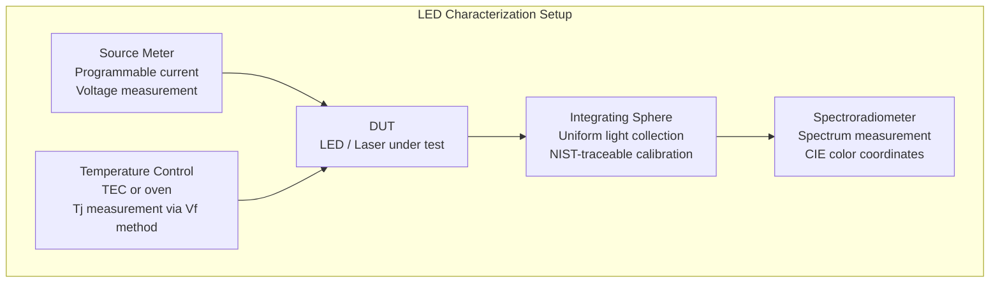
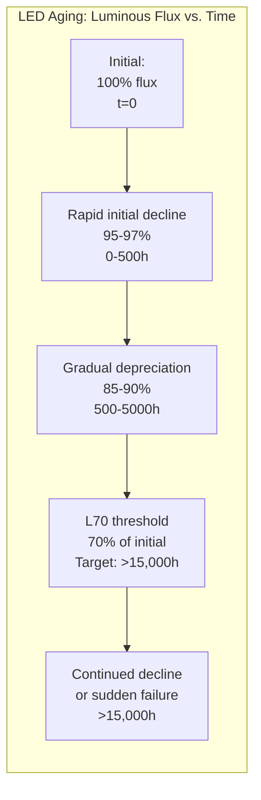
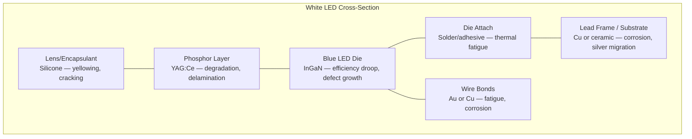

# AEC-Q102 — Optoelectronic Semiconductor Qualification

**Topic:** AEC-Q102 — Stress Test Qualification for Optoelectronic Semiconductors (LEDs, Laser Diodes, Photodetectors)  
**Standard:** AEC-Q102 Rev A (2017), referenced IES/CIE photometric methods  
**SDO:** Automotive Electronics Council (AEC) — Component Technical Committee  
**Audience:** LED/optoelectronics reliability engineers, automotive lighting engineers, sensor system engineers  
**Prerequisites:** Optoelectronics physics, LED aging mechanisms, photometric measurement, AEC-Q100/Q101 familiarity

---

## Chapter 1 — Historical Context & Origin Story

### 1.1 Timeline

| Year | Event | Impact |
|------|-------|--------|
| 2005 | First LED headlamps (Audi R8) | Automotive LED adoption begins |
| 2010 | AEC-Q102 Rev A published | First automotive optoelectronics qualification |
| 2013 | Full-LED headlamp mainstream (multiple OEMs) | Volume production creates reliability need |
| 2016 | Laser headlamps (BMW i8) | New device type needs qualification |
| 2018 | LiDAR LED/VCSEL for ADAS | Safety-critical optoelectronics |
| 2020 | Micro-LED displays in vehicles | New form factor qualification challenges |
| 2022 | VCSEL arrays for in-cabin monitoring | High-volume automotive VCSEL |
| 2024+ | Revision activity for LiDAR/VCSEL | Expanding beyond illumination LEDs |

### 1.2 Scope — Device Types Covered

| Category | Devices | Applications |
|----------|---------|-------------|
| LEDs (visible) | InGaN (blue, white), AlInGaP (red, amber) | Headlamps, tail lights, interior, displays |
| LEDs (infrared) | GaAs, InGaAs | Proximity sensors, gesture, night vision |
| Laser diodes | Edge-emitting, VCSEL | LiDAR, head-up display, laser headlamp |
| Photodetectors | Photodiodes, phototransistors | Ambient light sensors, rain sensors |
| Optocouplers | LED + photodetector paired | Signal isolation in HV systems |
| Image sensors | CMOS/CCD (partially, AEC-Q100 overlap) | Cameras (typically covered by Q100) |

---

## Chapter 2 — Standard Architecture & Structure

### 2.1 AEC-Q102 Test Groups

| Group | Name | Key Tests | Purpose |
|-------|------|-----------|---------|
| A | Environmental Stress (Electrically Biased) | HTOL, Wet High Temperature Operating Life (WHTOL) | Active wearout (junction + package) |
| B | Environmental Stress (Non-biased) | TC, thermal shock, high-temp storage | Package integrity |
| C | Optical/Electrical Characterization | Optical power vs. current, spectrum, thermal resistance | Baseline characterization |
| D | Assembly/Packaging | MSL, solder heat resistance, mechanical | Package robustness |
| E | ESD | HBM (±2000V), CDM | Electrical robustness |
| F | Defect Screening | Burn-in / parametric screen | Infant mortality |

### 2.2 Key Difference: AEC-Q102 vs. AEC-Q100/Q101

| Aspect | AEC-Q100 (ICs) | AEC-Q101 (Discrete) | AEC-Q102 (Opto) |
|--------|----------------|--------------------|-|
| Primary output | Electrical function | Current/voltage | Light (optical power, luminous flux) |
| Key aging metric | Parametric drift | Rdson/Vce drift | Lumen/radiant flux depreciation |
| Unique failure mode | TDDB, EM | Wire bond, solder | Lumen depreciation, color shift |
| End-of-life criteria | Spec violation | Spec violation | 70% or 80% of initial flux (L70/L80) |
| Spectral measurement | Not needed | Not needed | Required (color coordinates, peak λ) |
| Thermal measurement | Rth(j-c) | Rth(j-c) | Rth(j-sp) — junction to solder point |

---

## Chapter 3 — Technical Deep Dive

### 3.1 LED Failure Mechanisms

| Mechanism | Physics | Impact | Test |
|-----------|---------|--------|------|
| Lumen depreciation | Non-radiative recombination center growth | Gradual output loss (30-50% over life) | HTOL (high current + temperature) |
| Color shift | Phosphor degradation (white LEDs) | Chromaticity coordinate drift | HTOL + spectral measurement |
| Sudden failure (catastrophic) | Die crack, bond wire break, ESD | Complete loss of output | TC, ESD, thermal shock |
| Encapsulant yellowing | Silicone/epoxy degradation from UV + heat | Absorption increase → flux loss | HTOL at short wavelength (blue) |
| Phosphor cracking | CTE mismatch, thermal cycling | Color non-uniformity, efficiency loss | TC |
| Contact degradation | Ohmic contact aging, diffusion | Forward voltage increase (Vf drift) | HTOL |
| Chip delamination | Package CTE mismatch | Thermal resistance increase | TC, thermal shock |

### 3.2 HTOL for LEDs (Primary Qualification Test)

| Parameter | Condition |
|-----------|-----------|
| Drive current | Rated maximum continuous current (If_max) |
| Junction temperature | 125-150°C (depends on grade) |
| Duration | 1000 hours minimum |
| Monitoring intervals | 168h, 500h, 1000h |
| Measurements | Luminous flux (Φv), radiant flux (Φe), Vf, peak wavelength (λp), CIE coordinates (x,y) |
| Pass criteria — flux | < 30% depreciation (L70 at 1000h); some applications require L80 |
| Pass criteria — Vf | < ±0.1V drift typical |
| Pass criteria — color | Δu'v' < 0.007 (within MacAdam step) |
| Sample size | 77/lot × 3 lots |

### 3.3 Wet High Temperature Operating Life (WHTOL)

Unique to AEC-Q102 — combines electrical stress with humidity.

| Parameter | Condition |
|-----------|-----------|
| Temperature | 85°C |
| Humidity | 85% RH |
| Drive current | Rated If |
| Duration | 1000 hours |
| Purpose | Moisture + current → electromigration of silver (Ag) in lead frame, corrosion of reflector, phosphor moisture absorption |
| Key failure | Silver migration causes short circuit; reflector tarnishing reduces extraction efficiency |

### 3.4 LiDAR VCSEL/Laser-Specific Considerations

| Challenge | Impact | Test Approach |
|-----------|--------|---------------|
| High peak power (kW-level pulses) | Catastrophic Optical Damage (COD) at facet | Pulsed life test at rated peak power, 10⁹+ pulses |
| Facet degradation | Gradual power loss or sudden failure | HTOL at elevated current + temperature |
| Mode hopping | Wavelength instability affects LiDAR ranging | Spectral stability over temperature + life |
| Eye safety (Class 1M laser) | Regulatory requirement (IEC 60825-1) | Must maintain eye-safe emission throughout life |
| Thermal lensing (VCSEL) | Beam divergence change with temperature | Far-field measurement at temperature extremes |

---

## Chapter 4 — Implementation Guide

### 4.1 Optical Measurement Setup



### 4.2 Lumen Maintenance Projection (TM-21 Method)

For automotive applications, must project LED lifetime beyond 1000h test:

**IES TM-21 extrapolation:**
- Measure lumen output at regular intervals during HTOL
- Fit exponential decay model: $\Phi(t) = B \cdot e^{-\alpha t}$
- Extrapolate to L70 (time to reach 70% of initial flux)
- Maximum extrapolation: 6× measured test duration

$$L_{70} = \frac{-\ln(0.7)}{\alpha} = \frac{0.357}{\alpha}$$

Where $\alpha$ = depreciation rate constant from curve fit.

### 4.3 Automotive LED Application Requirements

| Application | Luminous Flux Required | Lifetime Target | Color Requirement |
|-------------|----------------------|-----------------|-------------------|
| Headlamp (low beam) | 1000-2000 lm per lamp | 15,000 hours | White (CCT 5500-6500K) |
| Headlamp (high beam) | 1500-3000 lm per lamp | 15,000 hours | White |
| Daytime Running Light | 400-800 lm | Vehicle lifetime | White |
| Tail lamp | 50-200 lm | Vehicle lifetime | Red (dominant λ: 615-625nm) |
| Turn signal | 200-400 lm | Vehicle lifetime | Amber (dominant λ: 585-595nm) |
| Interior ambient | 10-100 lm | Vehicle lifetime | RGB (color-tunable) |
| LiDAR emitter | 10-100 W peak (pulsed) | > 10,000 hours | 905nm or 1550nm |
| In-cabin monitoring | 1-5 W (NIR) | Vehicle lifetime | 940nm (eye-safe NIR) |

---

## Chapter 5 — Certification & Audit

### 5.1 Photometric Standards Compliance

| Standard | Requirement | Regulatory |
|----------|-------------|-----------|
| SAE J583 (turn signal) | Color, intensity distribution | FMVSS 108 (US) |
| ECE R7 (position lamp) | Luminous intensity, color | UNECE type approval |
| ECE R112 (headlamp) | Beam pattern, color | UNECE type approval |
| IEC 60825-1 (laser safety) | AEL, hazard classification | Eye safety (LiDAR) |
| CIE 127 (LED measurement) | Photometric methodology | Calibration traceability |
| IES LM-80 (lumen maintenance) | Test method for LED life | Industry standard |
| IES TM-21 (projection) | Extrapolation methodology | Lifetime claim basis |

---

## Chapter 6 — Regional & Domain Variants

### 6.1 Automotive Lighting Regulations by Region

| Region | Regulation | LED-Specific |
|--------|-----------|--------------|
| EU | ECE R112/R123 (headlamp) | Requires type approval per lamp |
| US | FMVSS 108 + SAE standards | Self-certification, SAE photometric |
| China | GB standards (based on ECE) | CCC certification needed |
| Japan | JASO + ECE harmonized | Follows ECE mostly |

---

## Chapter 7 — Comparison: LED vs. Laser vs. VCSEL Qualification

| Aspect | LED (visible) | Edge-emitting Laser | VCSEL |
|--------|--------------|--------------------|-|
| Dominant failure | Lumen depreciation + color shift | Facet degradation (COD) | Oxide aperture degradation |
| Typical lifetime | 30,000-100,000 hours (L70) | 10,000-50,000 hours | 20,000-100,000 hours |
| Critical test | HTOL at rated current | Accelerated life at elevated current | HTOL + pulsed life |
| Eye safety | Generally safe (diffuse) | Class 3B/4 risk | Class 1M (array) |
| Automotive app | Lighting | Headlamp (rare) | LiDAR, in-cabin sensing |
| AEC-Q102 coverage | Well covered | Partially (needs extension) | Partially (needs extension) |
| Key metric | Lumens (lm) or Watts (W) | Optical power (mW/W) | Peak power (W), pulse energy |
| Spectral concern | Color shift (Δu'v') | Mode hopping, wavelength drift | Wavelength vs. temperature |

---

## Chapter 8 — Mermaid Architecture Diagrams

### 8.1 LED Lumen Depreciation Curve



### 8.2 White LED Structure and Failure Points



---

## Chapter 9 — Case Studies & Failure Analysis

### 9.1 LED Headlamp Color Shift in Hot Climate

**Problem:** White LED headlamps in Middle East vehicles showed visible yellow color shift after 2 years (reported by customers as "headlights turning yellow").

**Root cause:**
- Phosphor binder (silicone) thermally degraded at sustained high temperatures (under-hood Tj > 140°C in hot climate + sun-heated headlamp housing)
- Yellowing of silicone absorbs blue light → color shifts from 6000K → 4500K
- HTOL qualification at 125°C/1000h didn't predict this because actual housing temperature in hot climate exceeded qualification conditions

**Resolution:**
- Redesigned thermal management (improved heat sink, ventilation openings in lamp housing)
- Switched to higher-thermal-stability silicone encapsulant
- Added application derating: maximum ambient temperature for LED module = 100°C (previously 120°C)
- Extended qualification: 150°C/2000h HTOL for Middle East market variant

### 9.2 LiDAR VCSEL Failure (Pulsed Life)

**Problem:** VCSEL array for automotive LiDAR failing after 6 months in field (eye safety concern: if some emitters fail-short, remaining emitters may exceed eye-safe power limit).

**Root cause:** Oxide aperture delamination from repeated high-peak-power pulsing (10 billion+ pulses). Thermal stress at aperture edge caused crack initiation.

**Corrective action:**
- Modified oxide aperture fabrication (graded oxide, reduced stress)
- Added pulsed accelerated life test: 10¹⁰ pulses at 1.5× rated peak power, 85°C
- Eye safety design: redundant monitoring (photodiode feedback per emitter group)
- AEC-Q102 feedback: proposed new test method for pulsed semiconductor laser reliability

---

## Chapter 10 — Future Evolution & Industry Trends

| Trend | Impact on AEC-Q102 |
|-------|-------------------|
| Micro-LED displays in vehicles | New failure modes (mass transfer defects, pixel-level reliability) |
| Adaptive driving beam (ADB) LED arrays | Per-pixel control → per-pixel reliability requirement |
| LiDAR VCSEL standardization | Pulsed life test method needed in standard |
| UV-C LEDs (cabin sanitization) | Short wavelength accelerates encapsulant degradation |
| OLEDs in automotive | Burn-in, lifetime limitation (different from inorganic LED) |
| Quantum dot enhancement | QD film degradation under blue excitation |
| Higher-power LEDs (fewer chips) | Thermal management more critical, higher current density |
| Communication (LiFi/V2X optical) | Modulation endurance test needed |
| Ambient light sensors (ADAS) | Detector reliability under continuous illumination |

---

## Chapter 11 — Interview Questions & Career Guide

### Tier 1: Entry-Level (0-3 years)

**Q1:** What are the main failure modes of automotive LEDs and how does AEC-Q102 test for them?  
**A:** **Lumen depreciation (gradual):** Mechanism: non-radiative recombination centers grow in active region over time → less light, more heat. Test: HTOL (high current + high temperature, 1000h). Measurement: luminous flux at intervals. Accept: < 30% loss at 1000h (L70). **Color shift:** Mechanism: phosphor degradation, silicone yellowing → spectral change. Test: HTOL with spectral measurement. Measurement: CIE (x,y) or (u',v') color coordinates. Accept: Δu'v' < 0.007 (stays within color bin). **Catastrophic failure:** Mechanism: die crack (thermal shock), wire bond break (vibration/TC), ESD damage. Test: TC (1000 cycles), thermal shock, ESD (±2000V HBM). Measurement: functional test (on/off), visual inspection. Accept: 0 failures. **Moisture-induced failure:** Mechanism: silver migration (short circuit), reflector corrosion (flux loss). Test: WHTOL (85°C/85%RH with current, 1000h). Accept: 0 failures, flux within spec.

### Tier 2: Mid-Level (3-8 years)

**Q2:** Calculate the L70 lifetime of an LED from HTOL data: initial flux = 100 lm, flux after 3000h at 125°C = 85 lm. Use condition: 85°C junction, Ea = 0.2 eV.  
**A:** **(1) Depreciation rate at stress condition:** $\Phi(t) = \Phi_0 \cdot e^{-\alpha t}$ → $85 = 100 \cdot e^{-\alpha \cdot 3000}$ → $e^{-3000\alpha} = 0.85$ → $\alpha_{125°C} = -\ln(0.85)/3000 = 0.1625/3000 = 5.42 \times 10^{-5} \text{/hour}$ **(2) Temperature acceleration factor:** $AF = e^{(E_a/k_B)(1/T_{use} - 1/T_{stress})}$ $= e^{(0.2/8.617×10^{-5})(1/358 - 1/398)}$ $= e^{2321 × (2.793×10^{-3} - 2.513×10^{-3})}$ $= e^{2321 × 2.8×10^{-4}} = e^{0.65} = 1.91$ **(3) Depreciation rate at use condition:** $\alpha_{85°C} = \alpha_{125°C} / AF = 5.42×10^{-5} / 1.91 = 2.84×10^{-5} \text{/hour}$ **(4) L70 lifetime:** $L_{70} = -\ln(0.7) / \alpha_{85°C} = 0.357 / 2.84×10^{-5} = 12,570 \text{ hours}$ **Note:** LED activation energies are typically low (0.1-0.3 eV), so temperature acceleration is modest compared to silicon (0.7 eV). This means LED HTOL needs to be longer or at higher current to get meaningful acceleration.

### Tier 3: Senior/Lead (8-15 years)

**Q3:** Design the qualification strategy for a VCSEL array used in an automotive LiDAR system (safety-critical, ASIL B).  
**A:** **(1) AEC-Q102 baseline:** All standard Q102 tests (HTOL, TC, HAST, ESD, etc.) with modifications: HTOL at both CW (thermal aging) AND pulsed mode (pulse aging). **(2) LiDAR-specific additions:** Pulsed accelerated life: 2× rated peak power, 2× rated pulse rate, 85°C, until 10¹⁰ pulses. Monitor: optical power, beam divergence, wavelength stability per pulse. Facet/aperture inspection: SEM after stress (random sample). **(3) Functional safety (ASIL B):** FMEDA for VCSEL array: identify random failure modes and rates. Diagnostic coverage: photodiode monitor detects emitter failures. Failure mode: single emitter failure → degraded but functional (graceful degradation). Common cause: thermal runaway of entire array = potentially dangerous (loss of LiDAR). ISO 26262 metrics: SPFM > 90%, LFM > 60% for ASIL B. **(4) Eye safety throughout life:** IEC 60825-1: system must remain Class 1 (eye-safe) under all failure conditions. Worst-case: if some emitters fail open → remaining concentrate power → may exceed AEL. Design: redundant diffuser + power limiting circuit + fault detection. Qualification: verify at end-of-life (after all stress) that optical output is still Class 1 compliant.

---

## Chapter 12 — Cheat Sheet & Quick Reference

### AEC-Q102 Test Summary

```
HTOL:      Rated If, 125°C Tj, 1000h → lumen depreciation + color stability
WHTOL:     Rated If, 85°C, 85%RH, 1000h → moisture + current combined
TC:        -55/+125°C, 1000 cycles → package integrity, phosphor cracking
HAST:      130°C, 85%RH, 96h → accelerated moisture
HBM ESD:   ±2000V → electrical robustness
MSL:       J-STD-020 classification → reflow survivability
```

### LED Lifetime Metrics

```
L70: Time until LED output drops to 70% of initial (typical target: >30,000h)
L80: Time until 80% of initial (stricter, for demanding applications)
B50: Median life (50% of population reaches L70)
B10: 10% failure life (high-reliability applications)

Measurement standard: IES LM-80 (test method)
Projection standard: IES TM-21 (extrapolation, max 6× test time)
```

### Color Specification

```
CIE 1931: (x, y) chromaticity coordinates
CIE 1976: (u', v') — perceptually uniform
Color shift: Δu'v' = √[(Δu')² + (Δv')²]
Acceptable automotive: Δu'v' < 0.007 over life
CCT (Correlated Color Temperature): 5000-6500K for headlamp white
MacAdam ellipse: 3-step = barely perceptible, 7-step = noticeable
```

---

*End of Document — 04_AEC_Q102_Optoelectronics.md*
