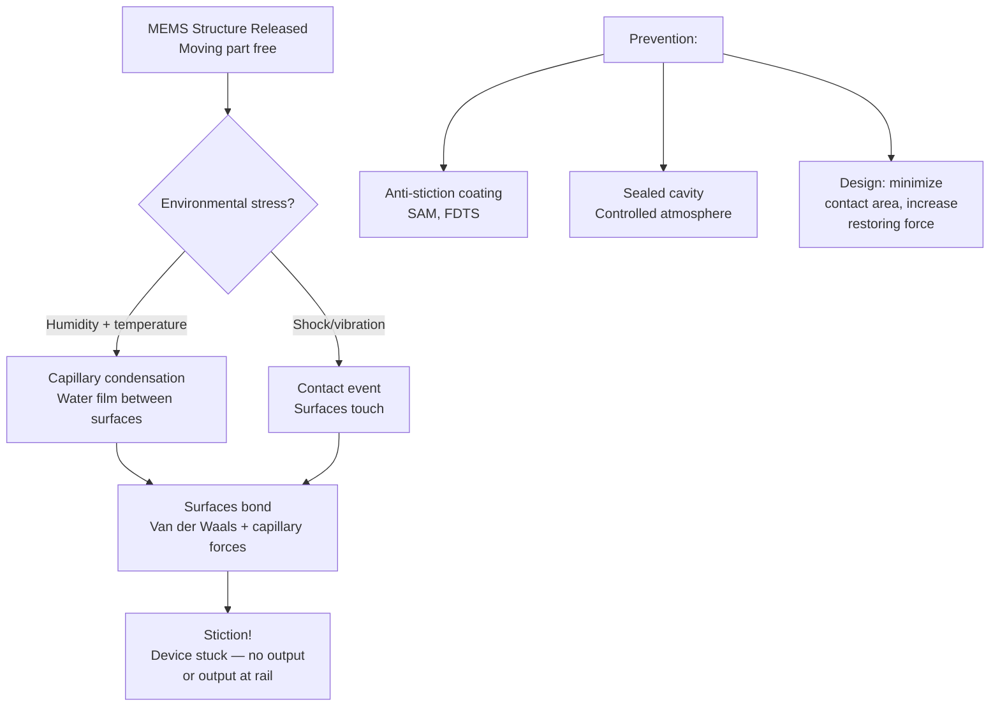
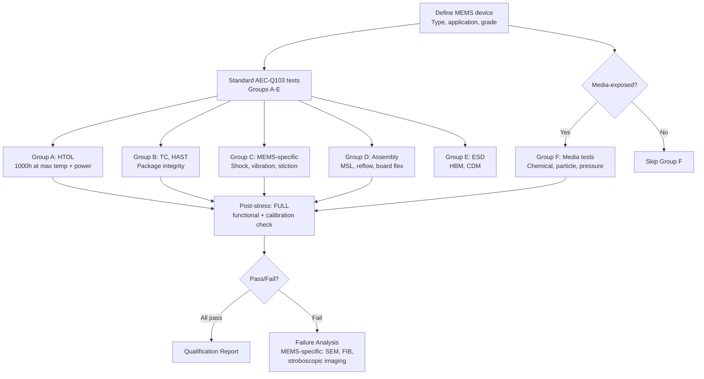
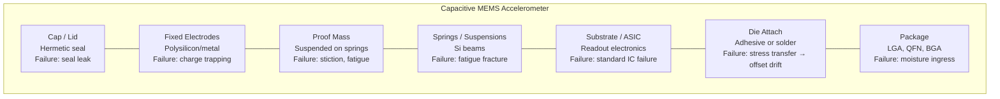
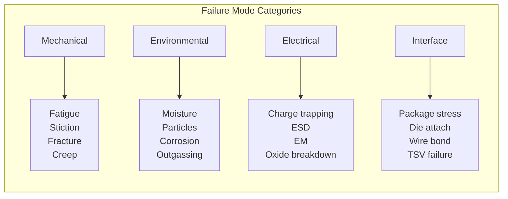

# AEC-Q103 — MEMS Device Qualification

**Topic:** AEC-Q103 — Stress Test Qualification for Sensors (MEMS-based Devices)  
**Standard:** AEC-Q103 Rev A (2017)  
**SDO:** Automotive Electronics Council (AEC) — Component Technical Committee  
**Audience:** MEMS reliability engineers, sensor system designers, automotive Tier-1 ADAS engineers  
**Prerequisites:** MEMS physics, micromachining processes, mechanical resonance, automotive sensor applications

---

## Chapter 1 — Historical Context & Origin Story

### 1.1 Timeline

| Year | Event | Impact |
|------|-------|--------|
| 1995 | First automotive MEMS accelerometer (Analog Devices ADXL50) | Airbag sensing |
| 2000 | MEMS gyroscopes for ESC (Electronic Stability Control) | Safety-critical MEMS |
| 2005 | MEMS pressure sensors mainstream (tire, intake manifold) | High-volume automotive MEMS |
| 2010 | AEC-Q103 initial development | Industry recognized MEMS need separate standard |
| 2017 | AEC-Q103 Rev A published | First formal MEMS automotive qualification |
| 2020 | MEMS microphones, LiDAR mirrors | New MEMS types entering automotive |
| 2022 | MEMS IMU for autonomous driving (6-axis) | Safety-critical (ASIL B/C) |
| 2024+ | Piezoelectric MEMS, RF MEMS (V2X) | Expanding scope |

### 1.2 Automotive MEMS Device Types

| Category | Device | Application | Key Requirement |
|----------|--------|-------------|-----------------|
| Accelerometer | Capacitive, piezoresistive | Airbag, ESC, rollover detection | Accuracy, shock survivability |
| Gyroscope | Vibratory (Coriolis) | ESC, navigation, ADAS | Bias stability, vibration rejection |
| Pressure sensor | Piezoresistive membrane, capacitive | TPMS, MAP, barometric | Long-term drift, media compatibility |
| Microphone | Capacitive membrane | Voice control, active noise cancellation | SNR stability, particle immunity |
| Mirror (scanning) | Electrostatic, electromagnetic | LiDAR, HUD | Fatigue, stiction, angle accuracy |
| Flow sensor | Thermal anemometer MEMS | MAF (Mass Air Flow) | Media compatibility, drift |
| Humidity sensor | Capacitive polymer | Cabin climate | Response time, long-term drift |
| IMU (6-axis) | 3 accelerometers + 3 gyroscopes | ADAS dead reckoning | Cross-axis sensitivity, noise |

---

## Chapter 2 — Standard Architecture & Structure

### 2.1 AEC-Q103 Test Groups

| Group | Name | Key Tests | Purpose |
|-------|------|-----------|---------|
| A | Accelerated Environment Stress (Powered) | HTOL, WHTOL | Active wearout under operation |
| B | Accelerated Environment Stress (Unpowered) | TC, HAST, high-temp storage | Package + MEMS structure |
| C | MEMS-Specific Mechanical | Mechanical shock, vibration, stiction | MEMS structural robustness |
| D | Package/Assembly | MSL, solder reflow, board flex | Manufacturing survivability |
| E | ESD | HBM, CDM | Electrical robustness |
| F | Media Compatibility (application-specific) | Chemical exposure, particle injection | Sensor survivability in harsh media |

### 2.2 What Makes MEMS Qualification Unique (vs. Q100)

| Aspect | AEC-Q100 (ICs) | AEC-Q103 (MEMS) |
|--------|----------------|-----------------|
| Moving parts | None | Mechanical structures (beams, membranes, combs) |
| Primary failure mode | Electrical degradation | Mechanical fatigue, stiction, particle interference |
| Media exposure | None (hermetic or molded) | Some devices exposed to air/fluid/pressure |
| Resonance concern | None | Mechanical resonant frequency → vibration coupling |
| Stiction | Not applicable | Critical — contact adhesion of microstructures |
| Shock/vibration | Spec concern only | Can cause structural failure of fragile MEMS |
| Particle sensitivity | Contamination (yield) | Particle lodged in MEMS → function loss |
| Hermetic seal | Not always needed | Often critical (gyroscopes, accelerometers) |
| Calibration drift | Minimal | Significant (offset, sensitivity shift over life) |

---

## Chapter 3 — Technical Deep Dive

### 3.1 MEMS-Specific Failure Mechanisms

| Mechanism | Physics | Affected Devices | Detection |
|-----------|---------|-----------------|-----------|
| **Stiction** | Surface adhesion (van der Waals, capillary) | Accelerometers, mirrors, switches | Output stuck at rail |
| **Fatigue** | Cyclic mechanical stress → crack | Gyroscopes, scanning mirrors, resonators | Frequency shift, amplitude decay |
| **Creep** | Viscoelastic deformation under sustained load | Pressure sensors (membrane) | Zero-point drift |
| **Particle contamination** | Foreign particle blocks motion | All MEMS with moving parts | Offset shift, noise increase |
| **Charge trapping** | Dielectric charging (electrostatic MEMS) | Capacitive accelerometers, RF MEMS | Bias drift, C-V hysteresis |
| **Media corrosion** | Chemical attack of MEMS surface | Pressure sensors (exhaust, fuel) | Sensitivity degradation |
| **Package stress** | Die attach / mold compound stress transfer | All (especially piezoresistive) | Offset shift with temperature |
| **Wire bond fatigue** | Mechanical resonance of bond wire | High-vibration applications | Intermittent connection |
| **Seal leakage** | Hermeticity loss over time | Gyroscopes (vacuum-sealed) | Q-factor degradation, noise |

### 3.2 Mechanical Shock Test

| Parameter | Condition |
|-----------|-----------|
| Shock level | 1500g - 30,000g (device-dependent) |
| Pulse duration | 0.3 - 1.0 ms (half-sine) |
| Directions | ±X, ±Y, ±Z (6 orientations) |
| Repetitions | 3-5 shocks per direction |
| Post-test | Full functional measurement |
| Critical for | Accelerometers (proof mass can bottom out), mirrors (hinge failure) |
| Automotive context | Tire-mounted sensors: 30,000g; chassis: 3000g; cabin: 1500g |

### 3.3 Vibration Testing (Resonance Characterization)

| Parameter | Condition |
|-----------|-----------|
| Frequency sweep | 100 Hz - 20 kHz (automotive vibration spectrum) |
| Acceleration level | 10-50 g RMS |
| Duration | 10 hours per axis |
| Axes | X, Y, Z |
| Purpose | Identify mechanical resonance frequencies, verify no output error at vibration frequencies in application band |
| Special concern | Gyroscope: vibration at drive frequency → rectification error → false output |

### 3.4 Stiction Risk and Testing



### 3.5 Long-Term Drift (Calibration Stability)

| Device | Key Drift Parameter | Typical Spec | Root Cause |
|--------|--------------------|-|------------|
| Accelerometer | Offset (mg) | < ±30 mg over life | Package stress, charge trapping |
| Gyroscope | Bias (°/s) | < ±1 °/s over life | Frequency mismatch drift, stress |
| Pressure sensor | Zero offset (mbar) | < ±5 mbar over life | Membrane creep, package stress |
| Microphone | Sensitivity (dB) | < ±1 dB over life | Membrane stress, vent blockage |

---

## Chapter 4 — Implementation Guide

### 4.1 MEMS Qualification Flow



### 4.2 Test Conditions: Gyroscope (ASIL B, ESC Application)

| Test | Condition | Duration | Sample | Accept |
|------|-----------|----------|--------|--------|
| HTOL | 125°C, powered, oscillating | 1000h | 77×3 lots | Bias drift < ±0.5°/s, no failures |
| TC | -40/+125°C, 1000 cycles | - | 77 | Offset shift < 50% of spec |
| Mechanical shock | 3000g, 6 axes | 5 per axis | 30 | Full function, no offset shift |
| Vibration | 20g, 100-10kHz sweep | 10h/axis | 30 | No false output at app frequencies |
| HAST | 130°C, 85%RH, 96h | - | 77 | No stiction, no leakage |
| Stiction test | Shock + dwell at extreme humidity | - | 30 | Recovery to spec output after event |

---

## Chapter 5 — Certification & Audit

### 5.1 MEMS-Specific Qualification Report Content

| Section | MEMS-Specific Additions |
|---------|------------------------|
| Device characterization | Resonant frequency, Q-factor, mechanical sensitivity |
| Shock test results | Peak output during shock, post-shock offset |
| Vibration test results | Frequency response, resonance identification |
| Long-term stability | Offset/sensitivity drift curves over 1000h |
| Hermetic seal | Leak rate (He fine leak), RGA (Residual Gas Analysis) |
| Media compatibility | Chemical exposure results (if applicable) |
| FMEDA (if safety-critical) | Failure mode effects for ASIL allocation |

---

## Chapter 6 — Regional & Domain Variants

### 6.1 Automotive MEMS Applications by Safety Level

| ASIL Level | Application | MEMS Device | Key Requirement |
|------------|------------|-------------|-----------------|
| ASIL D | Airbag (crash detection) | Accelerometer | < 100 µs latency, ±300g range |
| ASIL C | ESC (yaw rate) | Gyroscope | Low bias drift, vibration immunity |
| ASIL B | ADAS (dead reckoning) | IMU (6-axis) | Navigation-grade stability |
| ASIL B | TPMS | Pressure + accelerometer | 10-year battery life, tire environment |
| QM | Climate control | Humidity + temp sensor | Cost-optimized, moderate accuracy |
| QM | Voice recognition | MEMS microphone | High SNR, ANC compatibility |

---

## Chapter 7 — Comparison: MEMS Qualification Approaches

| Standard | Scope | MEMS-Specific? | Key Feature |
|----------|-------|----------------|-------------|
| AEC-Q103 | Automotive MEMS sensors | Yes | MEMS mechanical tests + application-specific |
| AEC-Q100 | ICs (including MEMS+ASIC combo) | No (electrical only) | Does not address mechanical failure modes |
| MIL-STD-883 | Military microelectronics | No | Over-stressed for commercial MEMS |
| JEDEC JESD22 | General semiconductor | Partially | Has shock/vibration but not MEMS-aware |
| IEC 62047 | MEMS devices (general) | Yes | Academic/industrial, not automotive-focused |

---

## Chapter 8 — Mermaid Architecture Diagrams

### 8.1 MEMS Accelerometer Cross-Section



### 8.2 MEMS Failure Mode Classification



---

## Chapter 9 — Case Studies & Failure Analysis

### 9.1 Gyroscope Stiction in Humid Environment

**Problem:** MEMS gyroscope for ESC system reported intermittent zero-output events in tropical climates. After event, device recovers on power cycle.

**Root cause:**
- Package hermetic seal degraded over 3 years (moisture ingress through seal ring)
- Internal humidity reached dew point during cold start (overnight condensation)
- Capillary forces caused drive structure to stick to adjacent electrode
- Device output reads zero (no oscillation = no Coriolis sensing)

**Resolution:**
- Improved seal ring design (getter material added inside cavity)
- He fine leak spec tightened from 10⁻⁸ to 10⁻⁹ atm·cc/s
- Added built-in self-test (BIST): detect loss of oscillation amplitude → diagnostic flag
- Extended HAST qualification: 500h at 130°C/85%RH (beyond standard 96h)

### 9.2 Pressure Sensor Drift in Engine Application

**Problem:** MAP (Manifold Absolute Pressure) sensor showed 15 mbar zero-point drift over 5 years. Exceeded specification (±5 mbar).

**Root cause:**
- Piezoresistive membrane sensor — offset is package-stress sensitive
- Die attach adhesive (epoxy) continued to cure/relax over years → stress on die changed
- This was NOT captured in 1000h HTOL because adhesive relaxation is very slow at moderate temperature

**Corrective action:**
- Changed die attach from epoxy to soft silicone gel (stress-decoupled)
- Added pre-aging step: 2000h at 150°C (accelerate adhesive stabilization before calibration)
- Redesigned sensor: moved from piezoresistive (stress-sensitive) to capacitive (stress-insensitive)

---

## Chapter 10 — Future Evolution & Industry Trends

| Trend | Impact on AEC-Q103 |
|-------|-------------------|
| MEMS LiDAR mirrors (automotive-grade) | High-cycle fatigue (10¹⁰+ cycles), stiction, optical quality |
| Piezoelectric MEMS (PZT, AlN) | Polarization fatigue, depolarization at high temperature |
| MEMS IMU for autonomous driving | Navigation-grade stability, ASIL C/D requirements |
| In-cabin MEMS (gesture, presence) | Consumer-grade accuracy but automotive reliability |
| MEMS for structural health monitoring | Long-term drift over 20+ years |
| 3D-stacked MEMS + ASIC (monolithic) | Combined Q100+Q103 qualification needed |
| MEMS energy harvesting | Fatigue over continuous vibration exposure |
| RF MEMS switches (V2X, radar) | Contact wear, stiction, cycling endurance |

---

## Chapter 11 — Interview Questions & Career Guide

### Tier 1: Entry-Level (0-3 years)

**Q1:** What is stiction in MEMS devices and why is it a critical failure mode?  
**A:** **Stiction** = static friction / adhesion that prevents a MEMS structure from moving after surfaces come into contact. In MEMS, structures are micrometer-scale with very small restoring forces (spring constants in µN/µm range). If surfaces touch (due to shock, humidity, or manufacturing release), adhesion forces (van der Waals: proportional to contact area, capillary: from moisture film between surfaces, electrostatic: from trapped charge) can exceed the restoring spring force. Result: device is permanently stuck → sensor output is incorrect (at rail or fixed offset). **Why critical:** It's a **complete functional failure** (not gradual degradation). It can be intermittent (temperature/humidity dependent). It may not be detected by standard electrical tests (device is electrically alive, just mechanically stuck). Prevention: anti-stiction coatings (self-assembled monolayers), hermetic sealed cavity (controlled atmosphere), design (dimples to minimize contact area, high spring constant). **AEC-Q103 test:** Mechanical shock followed by functional test verifies MEMS doesn't stick after contact event.

### Tier 2: Mid-Level (3-8 years)

**Q2:** A MEMS gyroscope has specification: bias stability < 1°/hr, angular random walk < 0.1°/√hr. After 1000h HTOL at 125°C, the bias shifted by 0.5°/s. Is this a pass or fail? Explain.  
**A:** **Clarification of units:** Bias **stability** (°/hr) is the short-term fluctuation (Allan deviation). Bias **offset** (°/s) is the long-term DC shift. These are different parameters! The question mixes them — let's address both. **(1) Bias offset drift after HTOL:** Starting bias: calibrated to ~0°/s (± offset trimmed at factory). After 1000h HTOL at 125°C: bias = 0.5°/s → that's a 0.5°/s shift. Is this acceptable? Depends on **application and re-calibration strategy**: If system recalibrates at every startup (common for ESC): 0.5°/s offset is acceptable (will be compensated). If absolute accuracy needed without recalibration: 0.5°/s >> navigation-grade (unacceptable for autonomous driving). For AEC-Q103 qualification: typically the accept criterion is that **bias remains within the factory-trimmed tolerance band** (e.g., ±5°/s for consumer-grade, ±0.5°/s for navigation-grade). So 0.5°/s shift is marginal for high-grade but may pass for automotive ESC-grade. **(2) Bias stability (short-term):** Must ALSO verify that post-HTOL the short-term stability hasn't degraded. Measure Allan deviation at τ=100s: if still < 1°/hr → short-term performance maintained. **(3) Root cause if fail:** 0.5°/s shift suggests: package stress change (die attach relaxation), frequency mismatch drift (drive and sense modes diverged), or charge trapping in sense electrodes.

### Tier 3: Senior/Lead (8-15 years)

**Q3:** Design the qualification strategy for a MEMS scanning mirror used in automotive LiDAR (ASIL B, 10-year life, 100 billion cycles).  
**A:** **(1) Cycle count analysis:** 10-year life × continuous scanning at 1 kHz (typical LiDAR scan rate): 1000 cycles/s × 3.15×10⁸ s/10yr = 3.15×10¹¹ cycles → hundreds of billions of cycles! This is extreme mechanical fatigue. **(2) Fatigue qualification:** Test at elevated amplitude (1.5× nominal) and elevated temperature (125°C) to accelerate. Use Coffin-Manson for MEMS fatigue: $N_f = C \cdot (\Delta\epsilon)^{-n}$ where n ≈ 20-30 for silicon (very steep — silicon is fatigue-resistant but not immune at 10¹¹ cycles). Run test until 10¹⁰ cycles at 1.5× amplitude, 125°C (accelerated equivalent of >10¹¹ at nominal). Monitor: resonant frequency shift (indicates micro-crack initiation). **(3) Stiction after shock:** Mirror may contact landing pad during severe shock → must not stick. Shock test: 3000g (vehicle crash) → verify mirror self-recovers to oscillation. **(4) Optical quality over life:** Mirror reflectivity must remain >95% over life. Contamination in sealed cavity → coating degradation? Verify reflectivity after HTOL. **(5) ASIL B requirements:** FMEDA: mirror failure (fatigue fracture) → loss of LiDAR → safety impact. Diagnostic: monitor oscillation amplitude per scan → detect degradation before failure. Latent fault detection: periodic self-test (compare expected angle vs. PSD feedback). **(6) Accept criteria:** 0 structural failures at 10¹⁰ accelerated cycles. Resonant frequency shift < 0.1% (no fatigue damage). Optical reflectivity > 95% after HTOL. Post-shock recovery within 1 ms.

---

## Chapter 12 — Cheat Sheet & Quick Reference

### AEC-Q103 Key Tests

```
HTOL:           Powered, max temp, 1000h → sensor drift, aging
TC:             -40/+125°C (or +150°C), 1000 cycles → package + MEMS structure
Mechanical Shock: 1500-30,000g, 6 axes → structural survival
Vibration:      100Hz-20kHz, 10-50g RMS → resonance coupling, fatigue
HAST:           130°C, 85%RH, 96h → moisture ingress, stiction
ESD HBM:        ±2000V → electrical survivability
Media test:     Application-specific chemicals/particles → sensor survivability
```

### MEMS Failure Mode Quick Reference

```
Stiction:        Surfaces adhere, device stuck
  → Test: Shock + humidity, verify recovery

Fatigue:         Cyclic stress → micro-crack → fracture
  → Test: Accelerated cycling, monitor resonant frequency

Creep:           Sustained load → permanent deformation
  → Test: Long-term HTOL, monitor offset drift

Particle:        Foreign body blocks/modifies motion
  → Test: Particle injection (media-exposed), vibration

Charge trapping: Dielectric polarization → offset drift
  → Test: HTOL with bias, monitor offset over time

Seal leak:       Hermetic cavity loses vacuum/gas
  → Test: He leak test, RGA analysis, Q-factor monitoring
```

### Application-to-Device Mapping

```
Airbag:      Accelerometer, ±300g, ASIL D, <100µs response
ESC:         Gyroscope, ±150°/s, ASIL C, <10ms latency
TPMS:        Pressure (0-500kPa) + accelerometer, 10yr battery
MAP sensor:  Pressure (20-120kPa), media-exposed, ±1% accuracy
ADAS IMU:    6-axis, navigation grade, ASIL B
Microphone:  MEMS capacitive, >65dB SNR, particle-immune
LiDAR mirror: Scanning MEMS, >10¹⁰ cycles, optical grade
```

---

*End of Document — 05_AEC_Q103_MEMS.md*
