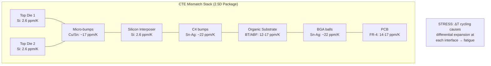
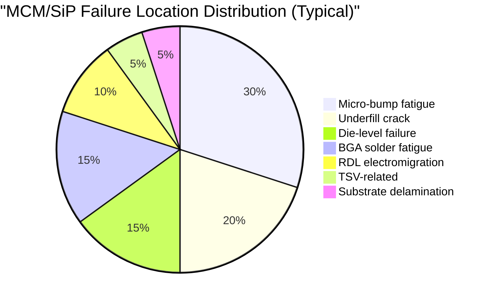

# AEC-Q104 — Multichip Module Qualification

**Topic:** AEC-Q104 — Stress Test Qualification for Multichip Modules (MCMs) and System-in-Package (SiP)  
**Standard:** AEC-Q104 Rev A (2019)  
**SDO:** Automotive Electronics Council (AEC) — Component Technical Committee  
**Audience:** Advanced packaging engineers, SiP reliability engineers, automotive semiconductor quality engineers  
**Prerequisites:** IC packaging technology, 2.5D/3D integration, AEC-Q100 fundamentals, thermal management

---

## Chapter 1 — Historical Context & Origin Story

### 1.1 Timeline

| Year | Event | Impact |
|------|-------|--------|
| 2000s | MCMs used in military/aerospace | Initial multi-die packaging concepts |
| 2010 | Automotive demand for SiP (radar, ADAS) | Need for multi-die automotive qualification |
| 2015 | 2.5D interposers (silicon/organic) emerge | New interconnect types beyond wire bond |
| 2017 | AEC-Q104 development started | Industry gap recognized |
| 2019 | AEC-Q104 Rev A published | First automotive MCM/SiP qualification standard |
| 2020 | Chiplet-based automotive SoCs | Heterogeneous integration for ADAS/AD |
| 2022 | 3D-stacked automotive chips (HBM + logic) | Emerging for AI accelerators in vehicles |
| 2024+ | UCIe (Universal Chiplet Interconnect Express) | Standardized chiplet interfaces |

### 1.2 Scope — Package Types Covered

| Technology | Description | Example |
|------------|-------------|---------|
| MCM-L | Multi-chip on laminate substrate | Radar front-end (MMIC + ASIC) |
| MCM-D | Multi-chip on deposited thin-film | High-frequency modules |
| MCM-C | Multi-chip on ceramic | Power modules |
| SiP (System-in-Package) | Multiple die + passives in single package | Connectivity module (BT + WiFi + GPS) |
| 2.5D (interposer) | Die on silicon/organic interposer | ADAS processor + HBM memory |
| 3D stacking | Die stacked vertically (TSV) | Memory-on-logic, stacked sensors |
| Fan-out wafer-level | Redistributed multi-die | eWLB multi-die integration |
| Embedded die | Die embedded in substrate | Power stage integrated in PCB |

---

## Chapter 2 — Standard Architecture & Structure

### 2.1 AEC-Q104 Philosophy: Component-Level + System-Level

The key innovation of AEC-Q104 is recognizing that MCM/SiP qualification requires BOTH:
1. **Individual die qualification** (each die per AEC-Q100/Q101/Q102/Q103 as appropriate)
2. **Module-level qualification** (interactions between dice, interconnects, substrate)

| Level | Standard | What It Tests |
|-------|----------|---------------|
| Die-level | AEC-Q100 (IC), Q101 (discrete), Q102 (opto), Q103 (MEMS) | Individual die reliability |
| Module-level | AEC-Q104 | Interconnects, substrate, thermal interactions, combined stress |

### 2.2 AEC-Q104 Test Groups

| Group | Name | Key Tests | Purpose |
|-------|------|-----------|---------|
| A | Accelerated Environmental Stress (Biased) | HTOL (module-level), WHTOL | Combined die + interconnect wearout |
| B | Accelerated Environmental Stress (Non-biased) | TC, thermal shock, HAST, high-temp storage | Package + substrate + interconnects |
| C | Module Interconnect Stress | Interconnect-specific tests (bump, pillar, TSV) | Die-to-die reliability |
| D | Assembly/Mechanical | Board-level reliability, drop, vibration | System integration |
| E | ESD | HBM, CDM (module-level) | Module electrical robustness |

### 2.3 Key Differences: AEC-Q104 vs. AEC-Q100

| Aspect | AEC-Q100 (single die) | AEC-Q104 (multi-die) |
|--------|----------------------|---------------------|
| Thermal interaction | Self-heating only | Die-to-die thermal coupling |
| Interconnect levels | Die ↔ package only | Die ↔ die, die ↔ interposer, interposer ↔ substrate |
| CTE mismatch layers | Die/die-attach/substrate | Multiple die (different Si, GaN, etc.) + interposer + substrate |
| Known-good-die (KGD) | Not applicable | Critical — must test die before assembly |
| Failure modes | Standard IC | + bump fatigue, TSV crack, interposer warp, RDL EM |
| Thermal resistance | Single Rth | Thermal coupling matrix between dice |

---

## Chapter 3 — Technical Deep Dive

### 3.1 MCM/SiP-Specific Failure Mechanisms

| Mechanism | Location | Physics | Test |
|-----------|----------|---------|------|
| Micro-bump fatigue | Die-to-die or die-to-interposer | CTE mismatch → solder/Cu pillar crack | TC, power cycling |
| TSV (Through-Silicon Via) stress | Silicon interposer or 3D stack | Cu pumping, oxide crack, keep-out zone | TC, HTOL, reliability |
| RDL (Redistribution Layer) EM | Interposer or fan-out | Electromigration in thin Cu traces | HTOL at max current density |
| Interposer warpage | Silicon or organic interposer | Thermal stress → assembly defects | Reflow simulation, TC |
| Die-to-die thermal coupling | Adjacent dice on substrate | Hot die heats neighbor → accelerated aging | HTOL with all dice active |
| Substrate delamination | Organic laminate layers | Moisture absorption → popcorn failure | MSL + reflow, HAST |
| Known-Good-Die (KGD) escape | Assembled defective die | Yield loss of entire module | Pre-assembly testing strategy |
| Underfill crack | Between die and substrate | CTE-driven crack propagation | TC, thermal shock |

### 3.2 Module-Level HTOL

| Parameter | Condition |
|-----------|-----------|
| Operating condition | ALL dice powered simultaneously (worst-case thermal coupling) |
| Junction temperature | Each die at its maximum rated Tj (may differ between dice) |
| Duration | 1000 hours |
| Monitoring | Each die's functional output + all die-to-die interfaces |
| Key difference vs. Q100 | Thermal interaction: Die A's heat affects Die B's junction temp |
| Failure criteria | Any single die or interface failure = module failure |

### 3.3 Thermal Cycling for Multi-Die Packages



### 3.4 TSV (Through-Silicon Via) Reliability

| Parameter | Issue | Impact |
|-----------|-------|--------|
| Cu pumping | Cu CTE (17ppm) >> Si CTE (2.6ppm) → Cu extrudes during heating | Bump deformation, electrical open |
| Keep-out zone (KOZ) | Stress field around TSV affects MOSFET mobility | Circuit performance shift |
| Oxide liner crack | Thermal stress cracks TSV isolation oxide | Leakage current, short circuit |
| Via-last vs. via-first | Different process = different stress profiles | Qualification strategy differs |
| Aspect ratio | High AR (10:1+) → void formation, fill issues | Resistance increase over life |

---

## Chapter 4 — Implementation Guide

### 4.1 Qualification Strategy for Automotive SiP

```mermaid
graph TB
    subgraph "Step 1: Individual Die Qualification"
        A1[Die A: ADAS SoC<br/>AEC-Q100 Grade 1]
        A2[Die B: Memory (DRAM)<br/>AEC-Q100 Grade 1]
        A3[Die C: Power IC<br/>AEC-Q100 Grade 1]
    end
    
    subgraph "Step 2: Known-Good-Die Testing"
        B1[KGD testing: full functional<br/>+ parametric at wafer level]
        B2[Burn-in at wafer level<br/>or package level]
    end
    
    subgraph "Step 3: Module-Level (AEC-Q104)"
        C1[Module HTOL<br/>All dice active simultaneously]
        C2[TC: module-level<br/>-40/+125°C, 1000 cycles]
        C3[Interconnect stress<br/>Bump/TSV specific tests]
        C4[Board-level reliability<br/>BGA-on-board thermal cycling]
    end
    
    A1 --> B1
    A2 --> B1
    A3 --> B1
    B1 --> B2 --> C1
    B1 --> C2
    B1 --> C3
    B1 --> C4
```

### 4.2 Known-Good-Die (KGD) Strategy

| Approach | Method | Trade-off |
|----------|--------|-----------|
| Wafer-level test only | Probe at speed + parametric | Lowest cost, some escapes |
| Wafer-level burn-in (WLBI) | Stress wafer at temperature | Better screen, higher cost |
| Temporary package test | Package die, test, remove | Best coverage, very expensive |
| Redundancy design | Spare elements per die | Silicon area cost, but ensures module yield |

---

## Chapter 5 — Certification & Audit

### 5.1 Q104 Qualification Report Specific Content

| Section | Multi-Die Specifics |
|---------|---------------------|
| Module description | All dice identified (part number, process node, die size) |
| Die-level qualification status | Each die's Q100/Q101/Q102/Q103 qualification reference |
| Interconnect technology | Bump type, pitch, material (Cu pillar, SnAg, etc.) |
| Thermal simulation | Module-level thermal map showing die-to-die coupling |
| KGD strategy | Test method, coverage, escape rate estimate |
| Board-level reliability | Number of TC cycles to first failure on application board |
| Interface test results | Die-to-die functional verification after stress |

---

## Chapter 6 — Regional & Domain Variants

### 6.1 Automotive MCM/SiP Applications

| Application | Package Type | Dice Integrated | Key Challenge |
|-------------|-------------|-----------------|---------------|
| 77GHz Radar front-end | MCM-L (laminate) | MMIC (SiGe/InP) + ASIC (Si) | RF performance + reliability |
| ADAS compute module | 2.5D SiP | AI accelerator + HBM + I/O die | Thermal management (>100W TDP) |
| Connectivity module | SiP (fan-out) | BT + WiFi + GNSS + MCU | Antenna integration, EMC |
| Power module (EV) | MCM-C (ceramic, DBC) | SiC MOSFETs + gate driver IC | High temp (200°C), power cycling |
| LiDAR sensor module | SiP | VCSEL + driver + TIA + SPAD array | Optical + electrical + thermal |
| Cockpit domain controller | 2.5D or 3D | CPU + GPU + memory + I/O | High power, complex thermal |

---

## Chapter 7 — Comparison with Related Standards

| Standard | Scope | Multi-Die? | Board-Level? |
|----------|-------|-----------|-------------|
| AEC-Q100 | Single-die IC | No | Optional (JEDEC JESD22-B111) |
| AEC-Q104 | Multi-die module | Yes (primary focus) | Required |
| JEDEC JEP170 | Component-level reliability for SiP | Guidance | Yes |
| IPC-9701 | Board-level solder joint reliability | N/A | Primary focus |
| JEDEC JESD22-B111 | Board-level drop test | N/A | Yes |

---

## Chapter 8 — Mermaid Architecture Diagrams

### 8.1 2.5D Package Cross-Section

```mermaid
graph TB
    subgraph "2.5D Automotive SiP Architecture"
        A[Die 1: Compute SoC<br/>7nm Si, 200mm²]
        B[Die 2: AI Accelerator<br/>7nm Si, 100mm²]
        C[Die 3: HBM Memory<br/>DRAM stack (8-high)]
        D[Micro-bumps<br/>40µm pitch, Cu pillar + SnAg]
        E[Silicon Interposer<br/>65nm Si, TSVs, 3 RDL layers]
        F[C4 Bumps<br/>150µm pitch, SnAg]
        G[Organic Substrate<br/>12-layer ABF build-up]
        H[BGA Balls<br/>0.8mm pitch, 2000+ balls]
        I[PCB<br/>Automotive-grade FR-4]
    end
    
    A --- D
    B --- D
    C --- D
    D --- E --- F --- G --- H --- I
```

### 8.2 Failure Location Probability



---

## Chapter 9 — Case Studies & Failure Analysis

### 9.1 Radar Module MCM Failure (TC)

**Problem:** 77GHz radar MCM (SiGe MMIC + digital ASIC on organic laminate) showed RF performance degradation after 500 TC cycles (-40/+125°C). Target: 1000 cycles.

**Root cause:**
- MMIC die (SiGe BiCMOS) has different CTE than ASIC die (bulk Si)
- Both mounted on same organic substrate with different die sizes
- Underfill between MMIC die and substrate cracked (stress concentration at die corner)
- Crack propagated to bump row → intermittent connection → RF impedance mismatch

**Resolution:**
- Corner bumps re-designed with larger pad diameter (reduced stress concentration)
- Underfill material changed to higher fracture toughness (from E=6GPa to E=3GPa — more compliant)
- Added corner reinforcement (capillary underfill + edge-fill combination)
- Re-qualification: passed 1500 TC cycles

### 9.2 ADAS Module HBM Thermal Coupling Failure

**Problem:** ADAS compute module (logic die + HBM2 stack on 2.5D interposer) failed HTOL at 720h. HBM temperature exceeded spec due to thermal coupling from logic die.

**Root cause:**
- Logic die at full load: 120W → Tj = 105°C
- Heat conducted through interposer to HBM stack
- HBM Tj reached 110°C (spec max = 95°C for automotive)
- HBM retention failure at elevated temperature

**Resolution:**
- Added thermal isolation trench in interposer between logic and HBM
- Redesigned interposer with thermal TSVs under HBM (heat path to bottom, not laterally from logic)
- Reduced logic die power in automotive mode (performance budget trade-off)
- HBM selected from high-temperature automotive-grade (Tj_max = 105°C)

---

## Chapter 10 — Future Evolution & Industry Trends

| Trend | Impact on AEC-Q104 |
|-------|-------------------|
| Chiplet-based automotive SoCs (UCIe) | Standard die-to-die interface → modular qualification |
| 3D stacking (logic on logic) | New thermal + mechanical stress, TSV reliability critical |
| Heterogeneous integration (Si + GaN + SiC) | Extreme CTE mismatch challenges |
| Fan-out panel-level packaging | Larger modules, new warpage challenges |
| Optical interconnects in package | Photonic dice + electronic dice combined |
| Embedded die in substrate | Dice inside PCB layers — unique stress |
| AI hardware for autonomous driving | Very high power density MCMs (200W+) |
| Redundant die for safety (ASIL D) | Dual-die lockstep in single package |

---

## Chapter 11 — Interview Questions & Career Guide

### Tier 1: Entry-Level (0-3 years)

**Q1:** Why can't we just qualify each die separately (AEC-Q100) and skip module-level testing (AEC-Q104)?  
**A:** Individual die qualification (Q100) only tests each die in isolation. When assembled into a module, new failure modes emerge: **(1) Thermal coupling:** Die A heats Die B → Die B experiences higher temperature than its individual qualification. A die qualified to 125°C may see 135°C due to neighbor's heat. **(2) Interconnect fatigue:** Die-to-die connections (micro-bumps, wire bonds, RDL) have their own reliability that is NOT tested in Q100 (which only tests die-to-package-substrate bumps). **(3) CTE interaction:** Multiple dice of different sizes on one substrate create complex stress fields that don't exist in single-die packages. **(4) Underfill stress:** Module underfill covers multiple dice → crack can propagate from one die's bump field to another's. **(5) KGD yield:** If one die in a module is marginally defective (not caught by Q100-level testing), it can fail under combined module stress.

### Tier 2: Mid-Level (3-8 years)

**Q2:** Design the Known-Good-Die (KGD) strategy for a 3-die automotive SiP containing: Die A (ADAS SoC, 12nm, $50/die), Die B (memory, $5/die), Die C (power IC, $2/die). Module cost = $200. Target yield > 95%.  
**A:** **(1) Yield impact analysis:** If individual die yields are: Die A = 92%, Die B = 98%, Die C = 99%. Without KGD: module yield = 0.92 × 0.98 × 0.99 = 89.3% → below 95% target. Each module failure wastes ~$200 (including substrate, assembly, test). Cost of waste: 10.7% × $200 = $21.4/module average waste. **(2) KGD investment strategy:** Die A ($50, dominant yield loss): FULL KGD — wafer-level burn-in + speed sort. Cost: ~$5/die. Benefit: catch the 8% defectives before assembly → saves 8% × $200 = $16/module. ROI: $16 saved / $5 invested = 3.2× return. Die B ($5, 98% yield): Standard wafer-level functional test only. 2% escape → impact = 2% × $200 = $4/module average. Not worth expensive KGD for $5 die. Die C ($2, 99% yield): Wafer sort parametric only. Minimal impact. **(3) Resulting module yield:** After KGD on Die A: yield improves to ~97% (from wafer burn-in catch). Die B: 98%. Die C: 99%. Module yield = 0.97 × 0.98 × 0.99 = 94.1% → still below 95%. Need to improve Die A KGD to achieve 99% outgoing quality → add at-speed testing at temperature. Revised: 0.99 × 0.98 × 0.99 = 96.0% → meets target.

### Tier 3: Senior/Lead (8-15 years)

**Q3:** A chiplet-based ADAS SoC uses UCIe die-to-die interconnect on an organic interposer. Define the reliability qualification that goes beyond standard AEC-Q104.  
**A:** **(1) UCIe-specific reliability concerns:** Die-to-die bump pitch: 25-55 µm (UCIe standard) — much finer than traditional C4. Fine pitch → less solder volume → lower fatigue life. Organic interposer (instead of Si): higher CTE (12-15 ppm/K vs. 2.6 for Si) → MORE stress on fine-pitch bumps. **(2) Enhanced TC qualification:** Standard Q104: 1000 cycles at -40/+125°C. For 25µm pitch on organic: need FEA simulation first — predict cycle-to-failure. Likely need: 2000+ cycles or justify with Coffin-Manson acceleration and mission profile. In-situ monitoring: daisy-chain resistance measurement per TC cycle (detect crack initiation early). **(3) EM qualification for UCIe RDL:** UCIe bandwidth: 32 GT/s per lane. Current density in RDL traces may approach EM limits. Run EM test per JEDEC JEP154: test at elevated temperature + current density. Qualify for 10-year life at automotive temperature. **(4) High-speed signal integrity over life:** After TC/HTOL: measure UCIe link eye diagram. Impedance change from bump fatigue could degrade signal integrity before complete failure. Define pre-failure criteria: eye opening must remain > 80% of initial after stress. **(5) Thermal management:** Chiplet architecture: multiple hot spots (each chiplet has different power density). Per-chiplet thermal simulation required. Verify: no chiplet exceeds Tj_max when all chiplets active simultaneously. **(6) Partial failure handling:** Chiplet architecture enables graceful degradation. Define: if one chiplet's UCIe link degrades → system falls back to reduced bandwidth. Qualify: functional safety — detect degraded link, maintain safe operation.

---

## Chapter 12 — Cheat Sheet & Quick Reference

### AEC-Q104 Scope Quick Reference

```
APPLIES TO: Multi-die packages (MCM, SiP, 2.5D, 3D stacking)
PREREQUISITE: Each die MUST be individually qualified (Q100/Q101/Q102/Q103)
ADDS: Module-level stress tests for interconnects and thermal interactions
KEY DIFFERENCE: Tests die-to-die interfaces and combined thermal effects
```

### MCM/SiP Failure Modes Quick Reference

```
Micro-bump fatigue:    Fine-pitch solder/Cu pillar cracking from TC
  → Location: Die-to-interposer or die-to-die
  → Detection: Resistance increase on daisy-chain

Underfill crack:       CTE-driven fracture propagation
  → Location: Die corner (stress concentration)
  → Detection: C-SAM (acoustic microscopy), CSAM delamination imaging

TSV Cu pumping:        Cu expands out of via during temperature cycling
  → Location: Si interposer or 3D stack
  → Detection: Protrusion measurement (AFM), electrical open

RDL electromigration:  Thin-film Cu migration under current
  → Location: Interposer redistribution layer
  → Detection: Resistance increase during HTOL

Thermal coupling:      Hot die heats adjacent die beyond spec
  → Location: Between dice on shared substrate
  → Detection: Thermal simulation + in-situ temperature measurement
```

### Decision Tree: Q100 vs. Q104

```
Single die in package? → AEC-Q100
Multiple dice in package?
  ├── Dice interact electrically? → AEC-Q104 (full)
  ├── Dice are independent (e.g., SiP with isolated dice)? → AEC-Q104 (focused on interconnect)
  └── Die + passive only? → Typically Q100 sufficient (application judgment)
```

---

*End of Document — 06_AEC_Q104_Multichip_Modules.md*
