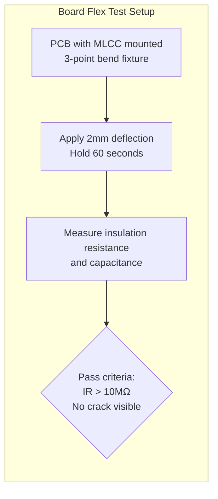
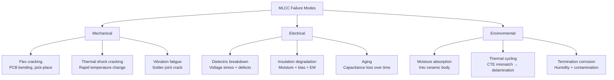
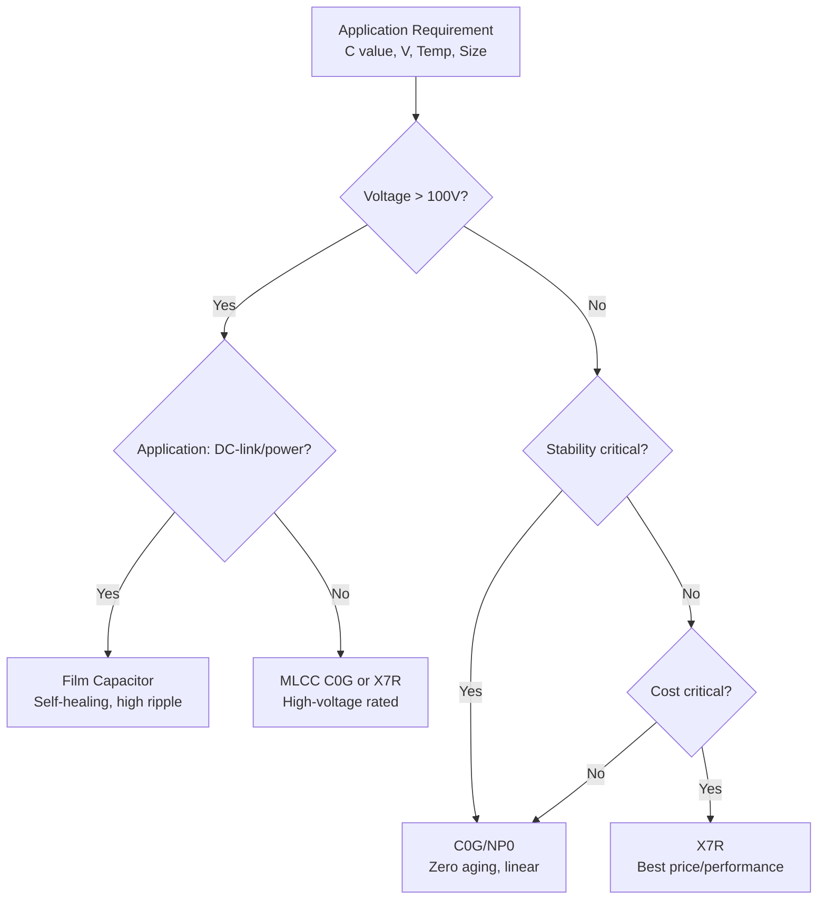

# AEC-Q200 — Passive Component Qualification

**Topic:** AEC-Q200 — Stress Test Qualification for Passive Components  
**Standard:** AEC-Q200 Rev E (2021)  
**SDO:** Automotive Electronics Council (AEC) — Component Technical Committee  
**Audience:** Passive component reliability engineers, PCB designers, automotive electronics quality engineers  
**Prerequisites:** Passive component fundamentals (R, C, L), soldering processes, failure physics of ceramic and film materials

---

## Chapter 1 — Historical Context & Origin Story

### 1.1 Timeline

| Year | Event | Impact |
|------|-------|--------|
| 2002 | AEC-Q200 Rev A | First automotive passive qualification |
| 2005 | Rev B | Lead-free solder compatibility |
| 2010 | Rev C | Updated for smaller packages (0201), higher voltages |
| 2015 | Rev D | MLCC reliability emphasis, flexure testing |
| 2021 | Rev E | Updated for EV/HV applications, current derating |

### 1.2 Passive Component Categories

| Category | Component Types | Automotive Examples |
|----------|----------------|---------------------|
| Capacitors | MLCC, film, electrolytic (Al, Ta), supercap | Decoupling, filtering, DC-link, energy storage |
| Resistors | Thick-film, thin-film, metal oxide, shunt, NTC/PTC | Sensing, current measurement, biasing |
| Inductors | Wound, multilayer, power, coupled, ferrite beads | EMC filtering, DC-DC conversion, signal isolation |
| Transformers | Signal, power, pulse | Isolated power, CAN/Ethernet magnetics |
| Thermistors | NTC, PTC | Temperature sensing, overcurrent protection |
| Varistors | MOV (Metal Oxide Varistor) | Surge/transient protection |
| Crystals/Oscillators | Quartz crystal, MEMS oscillator | Clock generation, communication timing |

---

## Chapter 2 — Standard Architecture & Structure

### 2.1 AEC-Q200 Test Groups (by Component Type)

| Group | Name | Applies To | Key Tests |
|-------|------|-----------|-----------|
| A | Environmental Stress | All passives | Temperature cycling, humidity, life test |
| B | Mechanical Stress | All passives | Vibration, shock, PCB flex (board flex test) |
| C | Solderability & Termination | All passives | Solderability, terminal strength, resistance to solder heat |
| D | Electrical Stress | Capacitors, resistors | Voltage endurance, surge, insulation resistance |
| E | Application-Specific | Selected types | Flex cracking (MLCC), piezoelectric effect, flammability |

### 2.2 Device-Specific Qualification Tables

AEC-Q200 contains separate qualification tables for each passive type:

| Table | Component | Key Stress Tests |
|-------|-----------|-----------------|
| Table 1 | Capacitors (ceramic — MLCC) | Voltage endurance, flex, humidity, TC |
| Table 2 | Capacitors (tantalum) | Surge, voltage derating, HTOL |
| Table 3 | Capacitors (aluminum electrolytic) | Endurance (ripple), humidity, life |
| Table 4 | Capacitors (film) | Voltage endurance, self-healing, humidity |
| Table 5 | Resistors (fixed) | Overload, pulse, humidity, TC |
| Table 6 | Resistors (variable) | Rotational life, contact resistance |
| Table 7 | Inductors/Transformers | DC bias saturation, pulse, humidity |
| Table 8 | Thermistors (NTC/PTC) | Resistance stability, thermal cycling |
| Table 9 | Varistors | Surge life, clamping stability |

---

## Chapter 3 — Technical Deep Dive

### 3.1 MLCC (Multi-Layer Ceramic Capacitor) — Dominant Automotive Passive

**MLCC Failure Mechanisms:**

| Mechanism | Physics | Impact | Test |
|-----------|---------|--------|------|
| Flex cracking | PCB bending → ceramic cracks → short or open | Catastrophic (potential fire) | Board flex test (2mm deflection) |
| Dielectric breakdown | Voltage > dielectric strength → insulation failure | Short circuit | Voltage endurance (2× rated, 125°C, 1000h) |
| Insulation resistance degradation | Moisture + DC bias → electromigration of electrode | Gradual leakage increase | THB (85°C/85%RH/rated voltage) |
| Delamination | Internal layer separation during soldering or TC | Reduced capacitance, increased ESR | TC + visual/acoustic inspection |
| Piezoelectric noise | BaTiO₃ generates voltage under mechanical stress | Audible noise ("singing capacitor") | Application-specific (not reliability) |
| Aging (capacitance loss) | Dielectric depolarization over time (Class II/III) | Capacitance decrease (logarithmic) | Characterized, not a failure per se |

### 3.2 MLCC Voltage Endurance (Key Q200 Test)

| Parameter | Condition |
|-----------|-----------|
| Voltage | 2× rated voltage (e.g., 100V cap tested at 200V) |
| Temperature | 125°C (or max rated temperature) |
| Duration | 1000 hours |
| Sample size | 20-50 parts × 3 lots |
| Monitor | Insulation resistance (IR) and capacitance at intervals |
| Pass criteria | IR > 10 MΩ (or spec minimum), no catastrophic failure |
| Failure mode | Dielectric breakdown → short → potential thermal event |

### 3.3 Board Flex Test (MLCC-Critical)



| Parameter | Condition |
|-----------|-----------|
| Deflection | 2mm (some OEMs require 3mm for safety-critical) |
| Board dimensions | Standard coupon (100mm × 40mm × 1.6mm) |
| Component position | Centered on board |
| Speed | 1mm/s deflection rate |
| Hold time | 60 seconds at max deflection |
| Pass criteria | No insulation resistance drop (IR stays > 10 MΩ) |
| Purpose | Verify MLCC survives PCB assembly handling, depanelization, connector insertion forces |

### 3.4 Capacitance Aging (Class II/III Ceramics)

Automotive-relevant because capacitance can decrease below minimum over vehicle lifetime:

$$C(t) = C_0 \cdot (1 - K \cdot \log_{10}(t/t_0))$$

Where:
- $C_0$ = capacitance at time $t_0$ (typically 1 hour after last heat above Curie point)
- $K$ = aging rate constant (% per decade of time)
- Typical K values: X7R = 2-5%/decade, X5R = 3-7%/decade, Y5V = 7-15%/decade

**Example:** X7R capacitor, K=3%/decade:
- After 1 year (8760h): C = C₀ × (1 - 0.03 × log₁₀(8760)) = C₀ × (1 - 0.03 × 3.94) = C₀ × 0.882 = -11.8%
- After 15 years: C = C₀ × (1 - 0.03 × log₁₀(131400)) = C₀ × (1 - 0.03 × 5.12) = C₀ × 0.846 = -15.4%

### 3.5 Aluminum Electrolytic Capacitor Endurance

| Parameter | Condition |
|-----------|-----------|
| Temperature | Maximum rated (105°C or 125°C) |
| Ripple current | Rated maximum RMS ripple |
| Duration | 2000-5000 hours (application-dependent) |
| Failure mode | Electrolyte dry-out → ESR increase → capacitance loss |
| End-of-life criteria | ESR > 2× initial OR capacitance < 80% of initial |

**Lifetime estimation (Arrhenius + ripple heating):**

$$L = L_0 \cdot 2^{(T_{max} - T_{ambient} - \Delta T_{ripple})/10}$$

Where:
- $L_0$ = rated life at max temperature (e.g., 2000h at 105°C)
- $\Delta T_{ripple}$ = temperature rise from ripple current

---

## Chapter 4 — Implementation Guide

### 4.1 Automotive MLCC Selection Guide

| Application | Voltage (system) | Recommended MLCC Voltage Rating | Dielectric | Flex Concern |
|-------------|-----------------|--------------------------------|-----------|-------------|
| ECU decoupling (5V) | 5V | 16V or 25V (≥3× derating) | X7R | Low |
| DC-link (48V mild hybrid) | 48V | 100V (2× minimum) | X7R or C0G | Medium |
| HV filter (400V EV) | 400V | 630V or 1000V | X7R (limited), C0G, film | High |
| Sensor biasing | 3.3V | 10V or 16V | C0G (for stability) | Low |
| Safety-critical (airbag) | 30V | 50V (conservative) | X7R, AEC-Q200 qualified | Medium-High |

### 4.2 Derating Guidelines (Automotive Best Practice)

| Parameter | Recommended Derating | Rationale |
|-----------|---------------------|-----------|
| Voltage | ≤ 50% of rated (DC application) | Reduces dielectric stress, extends MTTF |
| Voltage (MLCC, BaTiO₃) | ≤ 60-70% of rated | DC bias capacitance drop already reduces effective C |
| Temperature | 20°C below max rated | Exponential life improvement (Arrhenius) |
| Ripple current (electrolytic) | ≤ 70% of rated | Reduces internal heating |
| Power (resistor) | ≤ 50% of rated | Thermal margin for hot environments |

---

## Chapter 5 — Certification & Audit

### 5.1 Qualification Report Content (Passive-Specific)

| Section | Content |
|---------|---------|
| Part identification | Value, tolerance, voltage, package size, dielectric/material |
| Temperature coefficient | Measured TCC or TCR over automotive range |
| Voltage endurance | 2× rated, 1000h, all samples passing |
| Board flex (MLCC) | 2mm deflection, IR measurement, pass/fail |
| TC results | -55/+125°C (or +150°C), 1000 cycles |
| THB (humidity + bias) | 85°C/85%RH/rated voltage, 1000h |
| Solderability | Visual + solder spread after aging |
| Surge (tantalum/aluminum) | Surge voltage × repetition count |

---

## Chapter 6 — Regional & Domain Variants

### 6.1 Passive Component Stress by Automotive Application

| Application | Dominant Stress | Key Passive Challenges |
|-------------|----------------|----------------------|
| Under-hood ECU | High temperature (125-150°C) | MLCC aging, electrolytic dry-out |
| EV power electronics | High voltage + current + temperature | Film cap self-healing, MLCC flex |
| Body electronics | Moderate environment, cost-sensitive | Low cost + AEC-Q200 compliance |
| ADAS (radar, camera) | High frequency, tight tolerance | C0G for stability, thin-film resistors |
| EV battery BMS | High voltage isolation, humidity | Film caps for HV, humidity resistance |
| Chassis (ABS, ESP) | Vibration, extreme temperature | Mechanical robustness, thermal cycling |

---

## Chapter 7 — Comparison: MLCC Dielectrics

| Property | C0G (NP0) | X7R | X5R | Y5V |
|----------|-----------|-----|-----|-----|
| Temperature coefficient | ±30 ppm/°C | ±15% over -55/+125°C | ±15% over -55/+85°C | +22/-82% over -30/+85°C |
| DC bias stability | No degradation | 30-80% capacitance loss at rated V | 40-80% loss | Severe loss |
| Aging rate | 0%/decade | 2-5%/decade | 3-7%/decade | 7-15%/decade |
| Max capacitance | ~100nF (1206) | ~100µF (high-layer) | ~100µF | ~100µF |
| Automotive suitability | Excellent (reference, filter) | Good (general purpose) | Limited (consumer) | Not recommended |
| Cost | High (per µF) | Medium | Low | Lowest |
| Flex crack resistance | Better (thinner, smaller) | Moderate (large body) | Moderate | Poor (large body) |
| Piezoelectric noise | None | Significant | Significant | Severe |

---

## Chapter 8 — Mermaid Architecture Diagrams

### 8.1 MLCC Failure Mode Tree



### 8.2 Passive Component Selection Flow



---

## Chapter 9 — Case Studies & Failure Analysis

### 9.1 MLCC Flex Crack Field Failure (Airbag ECU)

**Problem:** Airbag ECU production lot showed 2% field failure rate within 6 months. Failure mode: MLCC short circuit on 100nF/50V X7R 0805 capacitor → ECU malfunction indicator.

**Root cause:**
- PCB depanelization process changed (V-score routing → higher bending force)
- 0805 MLCC located 3mm from panel edge → maximum flex zone
- Ceramic body cracked during depanelization → latent crack
- In field: thermal cycling opened crack → moisture ingress → conductive path → short

**Resolution:**
- Moved MLCC 10mm away from panel edge (design rule updated)
- Changed to flex-tolerant MLCC variant (soft termination with conductive polymer layer)
- Added 100% board flex test at production (2mm deflection, IR measurement post-flex)
- Implemented AEC-Q200 flex test in qualification for all MLCCs in safety-critical applications

### 9.2 Aluminum Electrolytic Failure in Under-Hood ECU

**Problem:** Engine ECU bulk capacitor (1000µF/25V, 105°C rated) showed ESR increase after 4 years. Caused voltage ripple to exceed regulator input spec → MCU brown-out resets.

**Analysis:**
- Under-hood ambient temperature: average 85°C in engine bay
- Electrolyte evaporation rate: L = 2000h × 2^((105-85)/10) = 2000 × 4 = 8000 hours
- Actual field exposure: 4 years × 3000h/year engine-on = 12,000 hours → EXCEEDED predicted life!
- Discrepancy: actual temperature spikes to 95°C near exhaust (worse than average model)

**Resolution:**
- Upgraded to 125°C rated capacitor (life at 85°C: 2000h × 2^((125-85)/10) = 32,000 hours)
- Alternatively: replaced with MLCC bank (ceramic has no dry-out mechanism)
- Added derating analysis to design review checklist for all electrolytic capacitors

---

## Chapter 10 — Future Evolution & Industry Trends

| Trend | Impact on AEC-Q200 |
|-------|-------------------|
| 800V EV systems | High-voltage passive qualification (film caps, HV MLCC) |
| SiC/GaN switching (high dI/dt) | EMC filter requirements, high-frequency passive performance |
| Solid-state batteries | New energy storage passives, supercapacitor qualification |
| Thinner PCBs (HDI) | Increased flex risk for MLCCs |
| Autonomous driving (ADAS ECUs) | Higher reliability requirements for all passives |
| Miniaturization (01005, 008004) | New mechanical handling challenges, different failure physics |
| Integrated passives (in substrate) | Embedded passives need combined PCB + component qualification |
| Higher operating temperatures (150°C+) | Need passives rated beyond current 125°C automotive standard |

---

## Chapter 11 — Interview Questions & Career Guide

### Tier 1: Entry-Level (0-3 years)

**Q1:** Why do MLCCs fail from PCB flex cracking, and how does AEC-Q200 address this?  
**A:** **Why flex cracking occurs:** MLCC is a ceramic body — brittle material (zero ductility). When PCB bends, the solder pads move relative to each other → ceramic is put in tension. Ceramic tensile strength is very low (~100 MPa) — any defect (void, delamination, corner) acts as crack initiation site. A crack through the MLCC body can connect internal electrodes → SHORT CIRCUIT → potentially thermal event (fire risk in some cases). **When flex occurs:** PCB depanelization (V-score break), connector insertion, press-fit pins, thermal warpage during reflow, mechanical mounting of PCB into housing. **AEC-Q200 Board Flex Test:** Mount MLCC on standard coupon. 3-point bend to 2mm deflection. Hold 60 seconds. Measure insulation resistance before, during, after. Pass: IR > 10MΩ at all times. **Prevention in design:** Keep MLCC away from panel edges (>5mm). Avoid placing MLCC near mounting holes or connectors. Use flex-tolerant termination (soft termination) for large-body MLCCs. Avoid 1210/1812/2220 sizes where possible (larger body = more susceptible). Use open-mode failure MLCCs for safety-critical circuits.

### Tier 2: Mid-Level (3-8 years)

**Q2:** Calculate the lifetime of a 47µF/25V aluminum electrolytic capacitor in an automotive application: ambient 85°C, ripple current causing 10°C temperature rise, rated life 5000h at 105°C.  
**A:** **Arrhenius-based lifetime formula:** $L_{use} = L_{rated} \times 2^{(T_{rated} - T_{core})/10}$ where $T_{core} = T_{ambient} + \Delta T_{ripple} = 85°C + 10°C = 95°C$ $L_{use} = 5000 \times 2^{(105 - 95)/10} = 5000 \times 2^1 = 10,000 \text{ hours}$ **Convert to vehicle life:** Typical automotive operation: ~1000 hours/year (engine-on time). Predicted life: 10,000h / 1000h/yr = 10 years. Target vehicle life: 15 years → **INSUFFICIENT!** **Options:** (a) Use 125°C rated capacitor: $L = 5000 × 2^{(125-95)/10} = 5000 × 8 = 40,000h$ = 40 years → adequate. (b) Reduce ambient (improve thermal design): if 75°C ambient + 10°C ripple = 85°C core: $L = 5000 × 2^{(105-85)/10} = 5000 × 4 = 20,000h$ = 20 years → adequate. (c) Reduce ripple current (lower ΔT): if ΔT = 5°C: $L = 5000 × 2^{(105-90)/10} = 5000 × 2.83 = 14,150h$ = 14 years → marginal. **Recommendation:** Use 125°C rated capacitor OR switch to MLCC (no wear-out from electrolyte).

### Tier 3: Senior/Lead (8-15 years)

**Q3:** Design the passive component qualification strategy for an 800V EV inverter DC-link capacitor bank. Consider film caps vs. MLCC stacking approach.  
**A:** **Application requirements:** DC bus voltage: 800V nominal, 900V transient. Ripple current: 200-400 Arms at switching frequency (10-100kHz for SiC). Temperature: 85°C coolant, capacitor surface ~105°C. Lifetime: 300,000 km / 15 years / 15,000 operating hours. Capacitance: 200-500µF (application-dependent). **Option A: Film capacitors (metallized polypropylene):** Voltage rating: 1100-1300V (50% derating from 800V bus). Self-healing capability: film caps can clear small dielectric breakdowns. Ripple current: excellent thermal performance (low ESR). Q200 qualification: Table 4 (film capacitors). Key test: endurance (85°C, rated voltage + rated ripple, 2000h). Additional: pulse test, self-healing capacity (number of clearings allowed). **Qualification additions for 800V:** Partial discharge testing: verify no PD at 800V DC (PD inception voltage > 900V). Humidity + high voltage: THB at 600V DC, 85°C/85%RH, 1000h. Surge: 1.5× rated voltage (1650V), 1000 surges. Temperature cycling: -40/+105°C, 1000 cycles with capacitor at 800V DC bias. **Option B: MLCC bank (series-parallel network):** Example: 100× 1µF/250V X7R in series-parallel → effective 25µF at 1000V. Advantages: smaller size, no electrolyte, longer life. Challenges: Balancing (voltage sharing in series strings). DC bias effect (X7R loses 50%+ capacitance at rated voltage). Flex cracking risk (many components → statistical failure risk). Q200 qualification: Table 1 (ceramic capacitors). Key additions: Verify DC bias capacitance at operating voltage (actual C at 800V may be 30% of nominal). Board-level flex test for ALL MLCCs in network. Series-string voltage balancing validation over temperature + life.

---

## Chapter 12 — Cheat Sheet & Quick Reference

### AEC-Q200 Key Tests by Component Type

```
MLCC:           Voltage endurance (2×V, 125°C, 1000h), Board flex (2mm), TC, THB
Film Cap:       Endurance (rated V + ripple, 85°C, 2000h), Self-heal, Surge
Al Electrolytic: Endurance (max temp + rated ripple, 2000-5000h), Shelf life
Tantalum:       Surge (1.5×V, 1000 cycles), HTOL, Humidity
Resistor:       Overload (2.5×P, 5s), Humidity, TC, Long-term stability
Inductor:       DC bias saturation, Temperature rise, Humidity, TC
Thermistor:     Resistance drift (1000h at max temp), TC, Humidity
```

### Critical Design Rules (Automotive MLCCs)

```
Voltage derating:    ≤50% of rated voltage for DC applications
Flex protection:     Keep MLCC >5mm from PCB edges and connectors
Size limitation:     Prefer ≤0805 for safety-critical (less flex-sensitive)
Soft termination:    Use for ≥1210 size on flex-prone locations
DC bias check:       Verify actual capacitance at operating voltage (X7R!)
Aging budget:        Account for 5-15% capacitance loss per decade (X7R)
Temperature:         C0G for stability, X7R for general, avoid Y5V
Series redundancy:   Open-mode MLCC for safety-critical charge storage
```

### Electrolytic Capacitor Lifetime Rule of Thumb

```
Every 10°C below max rated temperature → life doubles
Formula: L = L_rated × 2^((T_rated - T_actual)/10)

Example: 2000h at 105°C cap, operating at 65°C:
L = 2000 × 2^((105-65)/10) = 2000 × 16 = 32,000 hours
```

---

*End of Document — 07_AEC_Q200_Passive_Components.md*
