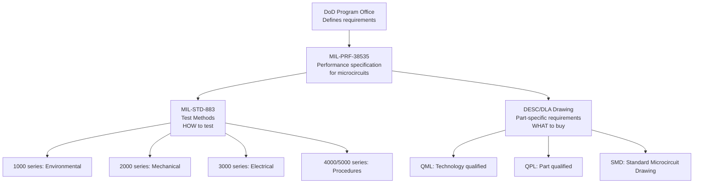
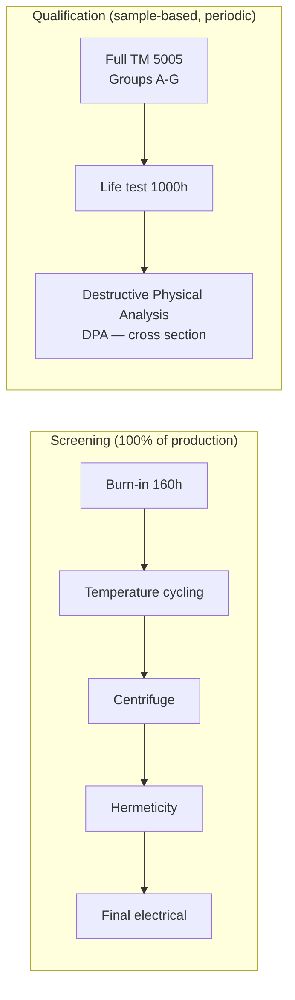

# MIL-STD-883 — Test Methods for Microelectronics

**Topic:** MIL-STD-883 — Test Methods and Procedures for Microelectronics  
**Standard:** MIL-STD-883L (current revision)  
**SDO:** United States Department of Defense (DoD), administered by Defense Logistics Agency (DLA)  
**Audience:** Military/aerospace IC reliability engineers, radiation hardness engineers, space-grade qualification engineers  
**Prerequisites:** Semiconductor physics, IC packaging, radiation effects on electronics, military procurement processes

---

## Chapter 1 — Historical Context & Origin Story

### 1.1 Timeline

| Year | Event | Impact |
|------|-------|--------|
| 1968 | MIL-STD-883 first published | First standardized IC test methodology |
| 1970s | Multiple revisions (Rev B, C) | Added environmental and mechanical tests |
| 1980s | Radiation testing added (TID, SEE) | Space and nuclear weapon requirements |
| 1991 | Perry Initiative | Encouraged use of commercial standards where possible |
| 1996 | Revision reform — MIL-STD-883E | Updated, some tests aligned with JEDEC |
| 2010 | MIL-STD-883J | Modernized, added SMD tests |
| 2018 | MIL-STD-883L | Current revision — includes TID test updates |
| 2024 | Active updates | New radiation test methods, advanced packaging |

### 1.2 Military Procurement Context

| Specification | Purpose | Relationship to 883 |
|---------------|---------|---------------------|
| MIL-PRF-38535 | Performance spec for ICs | References 883 test methods |
| MIL-PRF-19500 | Performance spec for discrete semiconductors | References MIL-STD-750 |
| QML (Qualified Manufacturers List) | Fab qualification program | Uses 883 methodology |
| QPL (Qualified Parts List) | Part-by-part qualification | Individual device per 883 |
| DESC/DLA drawings | Procurement documents | Specify 883 screening flows |

---

## Chapter 2 — Standard Architecture & Structure

### 2.1 MIL-STD-883 Test Method Organization

| Section | Title | Content |
|---------|-------|---------|
| 1000 series | Environmental Tests | Temperature cycling, thermal shock, moisture, altitude |
| 2000 series | Mechanical Tests | Shock, vibration, acceleration, bond pull/shear |
| 3000 series | Electrical Tests | Parametric, functional, ESD threshold |
| 4000 series | Test Procedures | Lot acceptance, screening flows, qualification |
| 5000 series | Process Controls | Die attach, wire bonding, package sealing |

### 2.2 Key Test Methods (Most Used)

| TM # | Name | Purpose |
|-------|------|---------|
| 1005 | Steady-state life (HTOL) | Biased temperature life test |
| 1010 | Temperature cycling | -65/+150°C (or wider) |
| 1011 | Thermal shock | Liquid-to-liquid immersion |
| 1014 | Seal tests (fine and gross leak) | Hermeticity verification |
| 1015 | Burn-in | High-temp dynamic operation (screening) |
| 2001 | Constant acceleration | Centrifuge test |
| 2002 | Mechanical shock | Half-sine impulse |
| 2004 | Lead integrity | Terminal strength |
| 2007 | Vibration, variable frequency | Resonance detection |
| 2010 | Internal visual (pre-cap) | Die inspection before lid seal |
| 2011 | Bond strength (wire pull) | Wire bond pull test |
| 2014 | Bond strength (die shear) | Die attach shear |
| 2019 | Die shear (multi-layer) | For MCMs |
| 3015 | ESD sensitivity | HBM and CDM classification |
| 5004 | Screening (Class B) | Standard military screening flow |
| 5005 | Qualification/QCI | Qualification and incoming inspection |

---

## Chapter 3 — Technical Deep Dive

### 3.1 Military Screening Flow (TM 5004 — Class B)

```mermaid
graph TB
    A[Wafer Fabrication<br/>+ Wafer-level inspection] --> B[Non-destructive Bond Pull<br/>TM 2023 — 100% visual]
    B --> C[Internal Visual (pre-cap)<br/>TM 2010 — 100% inspection]
    C --> D[Stabilization Bake<br/>150°C, 24h (or 300°C, 1h)]
    D --> E[Temperature Cycling<br/>TM 1010: -65/+150°C, 100 cycles]
    E --> F[Constant Acceleration<br/>TM 2001: 30,000g (Y1 direction)]
    F --> G[Seal Test<br/>TM 1014: Fine + Gross leak]
    G --> H[Burn-In<br/>TM 1015: 160h minimum<br/>at 125°C, dynamic bias]
    H --> I[Final Electrical<br/>TM 5004: full parametric<br/>at 25°C, -55°C, +125°C]
    I --> J[External Visual<br/>Package marking, lead condition]
    J --> K[Passed: Ship to customer<br/>with Certificate of Conformance]
```

### 3.2 Temperature Ranges (Military vs. Automotive vs. Commercial)

| Grade | Temperature Range | Application |
|-------|------------------|-------------|
| Military (MIL-STD-883) | -55°C to +125°C junction (Class B) | Avionics, ground military |
| Space (MIL-STD-883) | -55°C to +125°C + radiation hardness | Satellites, space vehicles |
| Automotive (AEC-Q100 Grade 0) | -40°C to +150°C ambient | Under-hood automotive |
| Automotive (AEC-Q100 Grade 1) | -40°C to +125°C ambient | General automotive |
| Industrial | -40°C to +85°C | Factory equipment |
| Commercial | 0°C to +70°C | Consumer electronics |

### 3.3 Hermeticity Testing (TM 1014) — Military-Unique

| Test | Method | Accept Criteria |
|------|--------|-----------------|
| Fine leak | Helium (He) tracer gas + mass spectrometer | < 5×10⁻⁸ atm·cc/s (for internal volume < 0.01 cc) |
| Fine leak | Radioactive (Kr-85) — alternative | < 1×10⁻⁸ atm·cc/s |
| Gross leak | Fluorocarbon bubble test | No bubbles visible |
| Gross leak | Weight gain (FC bath immersion) | Weight gain < threshold |

**Why military requires hermeticity:**
- Hermetic ceramic packages prevent moisture ingress (long-term reliability for 20+ year service life)
- Moisture → corrosion of aluminum metallization → open circuit
- In space: moisture → water vapor → plasma in vacuum → arcing

### 3.4 Constant Acceleration (Centrifuge) — TM 2001

| Parameter | Condition |
|-----------|-----------|
| Acceleration | 30,000g (Y1 direction — perpendicular to die) |
| Duration | 1 minute minimum |
| Purpose | Detect poorly attached die, loose particles, weak wire bonds |
| Military requirement | ALL Class B devices must pass |
| Automotive equivalent | Not required in AEC-Q100 (automotive doesn't fly at 30g!) |

### 3.5 Radiation Testing (Military/Space-Unique)

| Test | Method | Specification |
|------|--------|---------------|
| TID (Total Ionizing Dose) | Co-60 gamma source | TM 1019: dose rate, bias conditions |
| SEE (Single Event Effects) | Heavy ion beam or proton | TM 1020 (proposed) / JEDEC JESD89A |
| ELDRS (Enhanced Low Dose Rate Sensitivity) | Low dose rate Co-60 | TM 1019 Condition D |
| Neutron displacement damage | Reactor or accelerator neutrons | MIL-STD-883 TM 1017 |
| Dose rate upset (prompt dose) | Flash X-ray or LINAC | Nuclear weapon survivability |

---

## Chapter 4 — Implementation Guide

### 4.1 QML (Qualified Manufacturers List) Process

```mermaid
graph TB
    A[IC Manufacturer applies<br/>to DLA for QML status] --> B[Technology Characterization<br/>Vehicle (TCV) design + fabrication]
    B --> C[Qualification testing<br/>per MIL-STD-883 TM 5005<br/>All test groups]
    C --> D[DLA audit of<br/>fab, assembly, test facilities]
    D --> E{Approval?}
    E -->|Yes| F[QML certification<br/>granted for technology]
    E -->|No| G[Corrective action<br/>required, re-audit]
    
    F --> H[Ongoing: QCI inspections<br/>per TM 5005 Group A-D<br/>Regular interval sampling]
```

### 4.2 MIL-STD-883 vs. AEC-Q100 — Practical Comparison

| Aspect | MIL-STD-883 | AEC-Q100 |
|--------|------------|----------|
| Screening (100%) | Mandatory: burn-in, centrifuge, hermeticity, visual | Not mandatory (manufacturer's choice) |
| Package type | Primarily hermetic ceramic | Primarily plastic (QFN, BGA, QFP) |
| Temperature range | -55°C to +125°C | -40°C to +150°C (Grade 0) |
| Radiation | Required for space applications | Not required |
| Centrifuge (30,000g) | Required | Not required |
| Hermeticity | Required (fine + gross leak) | Not required (plastic packages) |
| Pre-cap visual | 100% die inspection required | Manufacturer's process control |
| Burn-in duration | 160h minimum at 125°C | Manufacturer's discretion (typical 48-168h) |
| Lot acceptance | Formal PDA/LTPD statistics | 0 failures from 77 samples × 3 lots |
| Cost per IC | $100-$10,000 (military grade) | $1-$50 (automotive grade) |
| Volume | Low (100s-1000s per year) | High (millions per year) |

---

## Chapter 5 — Certification & Audit

### 5.1 QML vs. QPL Approaches

| Approach | QML (Technology-Based) | QPL (Part-Based) |
|----------|----------------------|-------------------|
| What's qualified | Manufacturing process (technology) | Individual part number |
| Flexibility | New designs auto-covered if same technology | Each design needs separate qualification |
| Ongoing surveillance | QCI sampling (Groups A-D) | Lot-by-lot acceptance per part |
| Preferred by DoD | Yes (modern approach since 1990s) | Legacy (being phased out) |

---

## Chapter 6 — Regional & Domain Variants

### 6.1 Military/Aerospace IC Applications

| Application | Environment | Key MIL-STD-883 Tests |
|-------------|-------------|----------------------|
| Fighter jet avionics | -55/+125°C, vibration, altitude | Full Class B screening, vibration, altitude |
| Satellite (LEO) | -40/+85°C, TID 30-100 krad, SEE | Radiation (TID + SEE), hermeticity |
| Satellite (GEO) | -40/+85°C, TID 100+ krad | High-dose TID, ELDRS |
| Missile guidance | Extreme shock (100,000g), short life | Shock, centrifuge, limited life focus |
| Submarine | Humidity, shock, long service (30 years) | Hermeticity, salt atmosphere |
| Nuclear weapon | EMP, prompt dose rate, long dormancy | Dose rate upset, 20+ year shelf life |
| UAV / drone | Commercial-ish but military application | MIL-STD-883 or COTS-plus approach |

---

## Chapter 7 — Comparison: Test Method Standards

| Standard | Domain | Key Difference |
|----------|--------|----------------|
| MIL-STD-883 | US military IC test methods | Most rigorous, hermetic packages, radiation |
| MIL-STD-750 | US military discrete test methods | For diodes, transistors, thyristors |
| JEDEC JESD22 | Commercial semiconductor | Basis for most AEC-Q100 test methods |
| AEC-Q100 | Automotive IC | Plastic packages, no radiation, 0-failure based |
| ESCC (ESA) | European space | Similar to 883 but ESA-flavored |
| JAXA-QTS | Japanese space | Japan space agency equivalent |

---

## Chapter 8 — Mermaid Architecture Diagrams

### 8.1 Military IC Procurement Hierarchy



### 8.2 Screening vs. Qualification



---

## Chapter 9 — Case Studies & Failure Analysis

### 9.1 Tin Whisker Failure in Military System

**Problem:** Radar system experienced intermittent shorts after 5 years in service. Multiple boards affected.

**Root cause:**
- Component lead finish was pure tin (Sn) — inadvertently used in COTS (commercial off-the-shelf) component
- Tin whiskers grew over 5 years (compressive stress-driven)
- Whiskers bridged 0.5mm gap between adjacent leads
- Intermittent depending on vibration (whisker made/broke contact)

**MIL-STD-883 relevance:**
- TM 2010 (Internal Visual) + TM 5005 Group C (Solderability) specify lead finish requirements
- Military specification REQUIRES SnPb finish (tin-lead) for critical applications — prevents whiskers
- COTS insertion without proper evaluation violated MIL-HDBK-1547 guidance

**Resolution:**
- Replaced all affected components with QPL-listed SnPb-finished equivalents
- Added incoming inspection for lead finish (XRF measurement)
- Updated procurement specification to explicitly require SnPb or whisker-mitigated finish

### 9.2 Space IC TID Failure (ELDRS)

**Problem:** Communication satellite bipolar linear regulator failed in orbit after 7 years. Ground-based TID testing at standard dose rate (50 rad/s) showed pass to 100 krad. Orbit dose at 7 years: only 40 krad.

**Root cause:**
- Enhanced Low Dose Rate Sensitivity (ELDRS): bipolar ICs degrade MORE at the LOW dose rates experienced in space (0.001-0.01 rad/s) than at high dose rates used in standard testing
- Standard TM 1019 Condition A (high dose rate) underestimated actual in-orbit degradation
- Re-test at low dose rate (per TM 1019 Condition D) showed failure at only 30 krad

**Resolution:**
- All bipolar ICs for this program re-tested per TM 1019 Condition D (10 mrad/s dose rate)
- Alternatively: TM 1019 Condition C (accelerated at 100°C to simulate low dose rate effect)
- Design changed to use CMOS alternative (CMOS generally not ELDRS-susceptible)
- Updated procurement specs to explicitly require ELDRS testing for all bipolar devices

---

## Chapter 10 — Future Evolution & Industry Trends

| Trend | Impact on MIL-STD-883 |
|-------|----------------------|
| COTS+ / COTS-with-testing | Military using commercial parts with additional screening |
| Advanced packaging (2.5D, 3D, chiplets) | 883 test methods may need updates for non-hermetic military packages |
| GaN/SiC for military power | New failure modes, radiation response differences |
| AI/ML in test & screening | Automated defect detection, predictive screening |
| Reduced DoD volumes | Economic pressure to use commercial equivalents |
| Radiation hardened by design (RHBD) | Less reliance on special fabrication, more on design techniques |
| New radiation threats (SEE in FinFET) | FinFET and advanced nodes have different radiation response |
| Supply chain security (DMEA) | Trusted foundry programs, anti-counterfeit |

---

## Chapter 11 — Interview Questions & Career Guide

### Tier 1: Entry-Level (0-3 years)

**Q1:** What is burn-in per MIL-STD-883 TM 1015, and how does it differ from HTOL (TM 1005)?  
**A:** **Burn-in (TM 1015):** Purpose: **screen** out infant mortality failures from production lots. Applied to 100% of devices (every unit produced). Conditions: 125°C, dynamic bias (exercising all functions), 160 hours minimum. It's a **manufacturing screen** — devices that survive go to customer. Failures are discarded. This is production-level, applied to EVERY lot. **HTOL (TM 1005):** Purpose: **qualification/characterization** — determine intrinsic wear-out life. Applied to samples only (e.g., 45 parts from 3 wafer lots). Conditions: 125°C, dynamic bias, 1000 hours (or longer). It's a **qualification test** — determines if the technology/design has adequate lifetime. Done once during qualification, then periodically for surveillance (QCI). **Key difference:** Burn-in = 100%, short duration, screen. HTOL = sample, long duration, qualification. Both use similar conditions but different purpose and scope.

### Tier 2: Mid-Level (3-8 years)

**Q2:** A military program requires a CMOS ASIC for satellite use (LEO orbit, 50 krad TID requirement, 5-year mission). The ASIC is fabricated at a commercial 28nm foundry (not QML). Describe the qualification and screening approach.  
**A:** **(1) Radiation qualification (CMOS TID):** Test per MIL-STD-883 TM 1019, Condition A or C: Condition A: 50-300 rad(Si)/s dose rate. Irradiate samples to 100 krad (2× requirement for margin). Bias condition: worst-case (typically all inputs at Vdd for NMOS leakage). Post-irradiation: full parametric + functional test. Accept: all parameters within spec at 50 krad minimum. 28nm CMOS note: advanced nodes generally have good TID tolerance (thin gate oxide) but may have other sensitivities (RSCE, STI leakage). **(2) SEE testing:** Per JEDEC JESD89A or JEDEC JEP180: Heavy ion testing at accelerator (LET range 1-80 MeV·cm²/mg). Characterize: SEU rate, SEL threshold (must be > LET at mission orbit). For 28nm: SEL generally immune (thin epitaxial + guard rings), SEU may need TMR mitigation. **(3) Screening (since non-QML fab):** Cannot claim QML coverage → must do **part-level screening** per TM 5004 or equivalent. 100% burn-in: 240h at 125°C (extra hours since non-QML — lower confidence in fab process control). 100% temperature cycling: -55/+125°C, 100 cycles. 100% hermeticity test (if hermetic package — ceramic flat pack). Pre-cap visual: 100% die inspection to MIL-STD-883 TM 2010. Constant acceleration: 30,000g Y1. **(4) Ongoing lot acceptance (QCI equivalent):** Each production lot: Group A (electrical, 100%), Group B (mechanical sample), Group C (die/package sample), Group D (hermeticity, life test sample). Since non-QML: lot acceptance criteria must be explicitly agreed with military customer (typically MIL-PRF-38535 Appendix A approach).

### Tier 3: Senior/Lead (8-15 years)

**Q3:** The DoD wants to use a commercial automotive-grade ADAS chip (AEC-Q100 qualified) in a military ground vehicle application (-55/+125°C). What additional testing/qualification is needed beyond AEC-Q100?  
**A:** **(1) Temperature range extension:** AEC-Q100 Grade 1 is -40/+125°C. Military requires -55°C. Must test and characterize at -55°C: full parametric at -55°C (datasheet may not specify this). May find: NMOS threshold shift, timing violations, bandgap reference inaccuracy at -55°C. If chip marginally works at -55°C: upscreen — test 100% at -55°C, reject failures. **(2) Screening enhancement:** AEC-Q100 does NOT mandate 100% burn-in or screening. For military reliability: add 100% burn-in (per TM 1015): 160h minimum at 125°C, dynamic bias. Add temperature cycling screen: -55/+125°C, 100 cycles (wider range than automotive -40/+125°C). **(3) Mechanical tests (military-specific):** Constant acceleration: 30,000g (not required by AEC-Q100). Vibration: per MIL-STD-883 TM 2007, frequency range and levels per military vehicle spec. Shock: per TM 2002, levels appropriate for ground vehicle (500-1500g, not as severe as aircraft). **(4) Environmental: altitude, salt, fungus:** MIL-STD-810 may apply for system-level. At component level: altitude (reduced pressure → arcing concern at high voltage), salt atmosphere, fungus resistance. **(5) Supply chain / counterfeit mitigation:** Automotive parts from open market have counterfeit risk. Require: source traceability to fab, lot date code verification, XRF (lead finish check), electrical re-test on receipt. Consider: SAE AS6171 counterfeit detection testing. **(6) Radiation (if applicable):** Ground vehicle → generally NOT needed (no space radiation concern). Exception: nuclear survivability requirement → then need TID + dose rate testing. **(7) Long-term availability:** Military programs span 20-30 years. Automotive chips have 5-10 year lifecycles. Plan for: lifetime buy, last-time-buy strategy, form-fit-function replacement qualification.

---

## Chapter 12 — Cheat Sheet & Quick Reference

### MIL-STD-883 Screening Flow (Class B, Summary)

```
1. Internal visual (pre-cap): TM 2010 — 100%
2. Stabilization bake: 24h at 150°C
3. Temperature cycling: TM 1010 — -65/+150°C × 100 cycles
4. Constant acceleration: TM 2001 — 30,000g Y1
5. Fine/Gross seal: TM 1014 — He leak + fluorocarbon
6. Burn-in: TM 1015 — 160h at 125°C, dynamic bias
7. Final electrical: 25°C + -55°C + +125°C parametric
8. External visual: marking, leads, package condition
```

### Key Test Method Numbers

```
Environmental:
  TM 1005: Steady-state life test (HTOL)
  TM 1010: Temperature cycling (air-to-air)
  TM 1011: Thermal shock (liquid-to-liquid)
  TM 1014: Seal test (hermeticity)
  TM 1015: Burn-in
  TM 1019: Ionizing dose (TID) radiation

Mechanical:
  TM 2001: Constant acceleration (centrifuge)
  TM 2002: Mechanical shock
  TM 2007: Vibration, variable frequency
  TM 2010: Internal visual (pre-cap inspection)
  TM 2011: Bond pull strength
  TM 2014: Bond shear (die shear)

Electrical:
  TM 3015: ESD sensitivity (HBM, CDM)

Procedures:
  TM 5004: Screening procedures (Class B/S)
  TM 5005: Qualification and QCI
```

### Military vs. Automotive: Quick Decision

```
Need radiation hardness?      → MIL-STD-883 + TM 1019
Need -55°C operation?         → MIL-STD-883 screening
Need 100% hermeticity?        → MIL-STD-883 TM 1014
Need 30,000g centrifuge?      → MIL-STD-883 TM 2001
Need 100% burn-in guarantee?  → MIL-STD-883 TM 1015
Need AEC automotive?          → AEC-Q100 (plastic package OK)
Need both?                    → Custom spec combining elements
```

---

*End of Document — 08_MIL_STD_883_Microelectronics.md*
