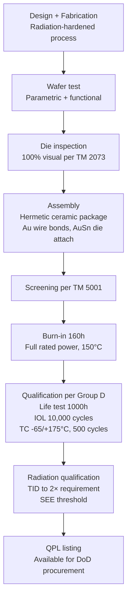

# MIL-STD-750 — Test Methods for Semiconductor Devices (Transistors & Diodes)

**Topic:** MIL-STD-750 — Test Methods for Semiconductor Devices (Discrete)  
**Standard:** MIL-STD-750F (current revision)  
**SDO:** United States Department of Defense (DoD), administered by DLA  
**Audience:** Military discrete power device engineers, radiation-hardened power electronics designers  
**Prerequisites:** Power semiconductor physics, discrete device packaging, MIL-STD-883 familiarity

---

## Chapter 1 — Historical Context & Origin Story

### 1.1 Timeline

| Year | Event | Impact |
|------|-------|--------|
| 1963 | MIL-STD-750 first published | Standardized discrete semiconductor testing |
| 1970s | Revisions for power transistors | Growing military power electronics |
| 1980s | Added SOA, safe operating area tests | Power MOSFETs entering military |
| 1995 | MIL-STD-750D | Major modernization |
| 2012 | MIL-STD-750F | Current revision, updated for modern devices |
| 2020s | SiC/GaN military power | New wide-bandgap considerations |

### 1.2 Scope — Device Types

| Category | Devices | Military Applications |
|----------|---------|---------------------|
| Diodes | Rectifier, Zener, TVS, Schottky, PIN | Power supplies, protection, radar switching |
| Transistors | BJT, MOSFET, JFET, IGBT | Motor drive, power conversion, RF |
| Thyristors | SCR, TRIAC, GTO | High-power pulsed systems, weapons |
| Optoelectronics | LED, photodiode, optocoupler | Signaling, isolation (some overlap with 883) |

---

## Chapter 2 — Standard Architecture & Structure

### 2.1 MIL-STD-750 Test Method Organization

| Series | Title | Examples |
|--------|-------|----------|
| 1000 | Environmental Tests | TC, thermal shock, moisture resistance, altitude |
| 2000 | Mechanical Tests | Shock, vibration, acceleration, lead fatigue |
| 3000 | Electrical Tests | Forward voltage, breakdown, leakage, switching |
| 4000 | Thermal Tests | Thermal resistance, thermal impedance, SOA |
| 5000 | Test Procedures | Screening, qualification flows |

### 2.2 Key Test Methods

| TM # | Name | Purpose |
|-------|------|---------|
| 1001 | Barometric pressure (altitude) | Arcing at reduced pressure |
| 1011 | Thermal shock (liquid-to-liquid) | Package integrity |
| 1026 | Steady-state life test | Biased life (equivalent to HTOL) |
| 1032 | Intermittent operating life (IOL) | Power cycling |
| 1038 | Burn-in for screening | 100% infant mortality screen |
| 1042 | Salt atmosphere | Corrosion resistance |
| 1046 | Immersion (solvent) | Package seal integrity |
| 2006 | Vibration fatigue | Lead fatigue life |
| 2036 | Terminal strength (leads) | Mechanical robustness |
| 2046 | Vibration, variable frequency | Resonance detection |
| 3101 | Forward voltage (Vf) | Diode characteristic |
| 3126 | Switching time | Turn-on / turn-off speed |
| 3131 | Reverse recovery | Diode reverse recovery time |
| 3161 | Thermal impedance | Junction-to-case thermal resistance |
| 4001 | Thermal resistance (DC) | Junction-to-case Rth measurement |
| 5001 | Screening flow | Class S and B screening |

---

## Chapter 3 — Technical Deep Dive

### 3.1 Screening Flow — TM 5001 (Class B)

```mermaid
graph TB
    A[Wafer Fab + wafer test] --> B[Die visual inspection<br/>100% pre-cap if hermetic]
    B --> C[Package assembly<br/>Die attach, wire bond, seal]
    C --> D[Stabilization bake<br/>150°C, 24h]
    D --> E[Temperature cycling<br/>TM 1010: -65/+175°C, 20 cycles<br/>or -65/+150°C, 50 cycles]
    E --> F[Centrifuge<br/>TM 2006: 20,000g]
    F --> G[Seal test (hermetic)<br/>Fine + gross leak]
    G --> H[Burn-in<br/>TM 1038: 160h at Tj_max<br/>at rated power]
    H --> I[Final electrical<br/>25°C, -55°C, +150°C<br/>All parametric]
    I --> J[External visual<br/>Marking, leads]
```

### 3.2 Intermittent Operating Life (IOL) — TM 1032 (Power Cycling)

| Parameter | Condition |
|-----------|-----------|
| Heating | Apply rated power to DUT → Tj rises to Tj_max |
| Cooling | Remove power → Tj drops to ambient |
| Cycle time | On: until Tj reaches max. Off: until Tj returns to within 10°C of ambient |
| Duration | 10,000-100,000 cycles (device/application dependent) |
| Monitoring | Vce(sat), Vf, Rth measured periodically |
| Failure criteria | Parameter exceeds limits or catastrophic failure |
| Relevance | Tests bond wire, die attach, solder fatigue under thermal cycling from self-heating |

### 3.3 Thermal Resistance Measurement — TM 4001

**Junction-to-case thermal resistance:** $R_{th(j-c)} = \frac{T_j - T_c}{P_D}$

| Method | Technique | Accuracy |
|--------|-----------|----------|
| Electrical (Vf or Vce method) | Use temperature-sensitive parameter as thermometer | ±5% (industry standard) |
| IR thermal imaging | Direct surface measurement | Good for exposed die |
| Thermal transient | JEDEC JESD51: measure cooling curve | Structure function analysis |

**Procedure (electrical method for diode):**
1. Calibrate Vf vs. temperature at low current (e.g., 1mA) → K-factor (mV/°C)
2. Apply rated heating power for thermal equilibrium (e.g., 60 seconds)
3. Switch to measurement current (1mA) rapidly (< 100µs)
4. Measure Vf immediately after switch → calculate Tj from K-factor
5. Measure case temperature (thermocouple on package tab)
6. Calculate: Rth(j-c) = (Tj - Tc) / heating power

### 3.4 Differences: MIL-STD-750 vs. AEC-Q101

| Aspect | MIL-STD-750 | AEC-Q101 |
|--------|-------------|----------|
| Package | Primarily hermetic (TO-3, TO-39, flat pack) | Plastic (TO-220, D2PAK, QFN) |
| Screening | 100% mandatory (burn-in, centrifuge, seal) | Manufacturer's discretion |
| Temperature range | -55°C to +175°C (Class B) | -40°C to +175°C (Grade 0) |
| Radiation | Required for space applications | Not required |
| Centrifuge | 20,000g (mandatory) | Not required |
| Power cycling | TM 1032 (IOL) | AEC-Q101 Group C |
| Hermeticity | Mandatory fine + gross leak | Not applicable (plastic) |
| ESD | TM 3400/3430 | AEC-Q101 references JEDEC |
| Cost per device | $50-$5000 | $0.50-$50 |

---

## Chapter 4 — Implementation Guide

### 4.1 Safe Operating Area (SOA) Verification

| Test | Method |
|------|--------|
| DC SOA | Apply Vds × Id combinations, verify no failure at each point |
| Pulsed SOA | Apply high-power pulses (10µs, 100µs, 1ms), verify survival |
| Avalanche (UIS) | Unclamped inductive switching — determine max avalanche energy |
| Linear mode SOA | Sustained linear region operation (high Vds × Id simultaneously) |
| Short circuit | Apply full bus voltage with gate on — measure withstand time |

### 4.2 Qualification Lot Structure (QPL approach)

| Group | Tests | Sample Size | Frequency |
|-------|-------|-------------|-----------|
| A | Electrical at 3 temps | 100% of lot | Every lot |
| B | Physical dimensions, marking | Per MIL-STD-750 TM 2066 | Every lot |
| C | Hermeticity, package integrity | 15 samples | Quarterly |
| D | Life test (1000h), IOL, TC | 15 samples | Semi-annually |
| E | Radiation (if applicable) | 10 samples | Per lot or annually |

---

## Chapter 5 — Certification & Audit

### 5.1 QPL Listing for Discrete Devices

| Document | Purpose |
|----------|---------|
| MIL-PRF-19500 | Performance specification for semiconductor devices |
| JAN/JANTX/JANTXV/JANS | Quality levels (increasing screening) |
| DESC/DLA drawing | Device-specific requirements |
| Source Control Drawing (SCD) | When standard part not available |

**Quality levels:**
- **JAN:** Basic military (minimal screening)
- **JANTX:** Extended testing (100% burn-in, tighter limits)
- **JANTXV:** High reliability (additional screens, tighter PDA)
- **JANS:** Space grade (most rigorous, full Class S screening)

---

## Chapter 6 — Regional & Domain Variants

| Application | Key Requirements | Specific MIL-STD-750 Focus |
|-------------|-----------------|---------------------------|
| Aircraft power (28V) | High reliability MOSFET/diode, vibration | IOL, vibration fatigue, burn-in |
| Shipboard power | Salt atmosphere, humidity, long life | TM 1042 (salt), TM 1004 (humidity) |
| Missile (short mission) | Extreme shock, limited life | Shock 30,000g+, centrifuge |
| Space solar array | Radiation (TID + displacement), extreme TC | Radiation + TC (-170/+120°C in orbit) |
| Radar transmitter | High-power pulsed operation | Pulsed SOA, thermal transient |

---

## Chapter 7 — Comparison of Discrete Device Standards

| Standard | Scope | Domain | Screening |
|----------|-------|--------|-----------|
| MIL-STD-750 | US military discrete test methods | Defense/aerospace | 100% mandatory (Class B/S) |
| AEC-Q101 | Automotive discrete qualification | Automotive | Sample-based qualification |
| JEDEC JESD22 | Commercial test methods | Consumer/industrial | Manufacturer-determined |
| ESCC 5000 series | European space discrete | Space (ESA) | Similar to MIL (100% screening) |
| IEC 60747 | International discrete standards | General | Performance specs |

---

## Chapter 8 — Mermaid Architecture Diagrams

### 8.1 Military Power MOSFET Qualification Path



---

## Chapter 9 — Case Studies & Failure Analysis

### 9.1 Power MOSFET Gate Oxide Failure (Missile Application)

**Problem:** JANTXV-rated power MOSFET (100V/30A, hermetic TO-39) failed during missile flight test. Gate shorted to source during high-dV/dt turn-off event.

**Root cause:**
- Gate oxide ESD damage during ground handling (pre-installation)
- Damage was latent (passed all screening including burn-in)
- In flight: dV/dt across drain → coupled to gate through Cgd → gate oxide overstress → breakdown

**Resolution:**
- Added ESD protection procedures for ground handling (per MIL-STD-1686)
- Added 100% gate oxide integrity screen: ramp gate to 120% of Vgs_max, measure leakage
- Updated missile integration procedures with ESD controls

### 9.2 Diode Reverse Recovery Failure in Space Power System

**Problem:** Power diode (JANS-rated, 600V fast recovery) in satellite solar array regulator showed increased reverse recovery charge after 3 years in orbit. Caused shoot-through in half-bridge → thermal failure.

**Root cause:**
- Neutron displacement damage (space radiation) altered minority carrier lifetime
- Increased trr from 50ns (beginning of life) to 150ns (3 years)
- Half-bridge dead-time designed for 50ns trr was insufficient at 150ns
- Shoot-through current spike exceeded thermal capability

**Resolution:**
- Redesigned dead-time to accommodate end-of-life trr (200ns margin)
- Qualified SiC Schottky diode replacement (no minority carrier → no trr degradation from radiation)
- Added trr specification at end-of-life radiation dose to component procurement spec

---

## Chapter 10 — Future Evolution & Industry Trends

| Trend | Impact on MIL-STD-750 |
|-------|----------------------|
| SiC MOSFETs for military power | New test methods needed (gate oxide, body diode) |
| GaN HEMTs for military radar | Dynamic Rdson, gate robustness tests |
| Additive manufacturing (packaging) | New package types, new mechanical tests |
| COTS+ discrete for military | Adapting commercial devices with military screening |
| Digital twins for lifetime prediction | In-situ monitoring replacing end-of-life testing |
| Wide-bandgap radiation response | SiC/GaN have different radiation effects than Si |

---

## Chapter 11 — Interview Questions & Career Guide

### Tier 1: Entry-Level (0-3 years)

**Q1:** What is the difference between MIL-STD-750 and MIL-STD-883?  
**A:** **MIL-STD-750:** Test methods for **discrete** semiconductor devices (transistors, diodes, thyristors). These are single-function devices with primarily power or switching functions. Tests emphasize: power handling (SOA, IOL/power cycling), thermal resistance, switching performance, and avalanche/surge capability. Referenced by MIL-PRF-19500. **MIL-STD-883:** Test methods for **microelectronics** (integrated circuits). These are complex multi-function devices with digital, analog, or mixed-signal functions. Tests emphasize: logic function, data retention, gate oxide integrity, radiation sensitivity, and interconnect reliability. Referenced by MIL-PRF-38535. **Overlap:** Both have similar environmental tests (TC, shock, vibration, hermeticity) and screening approaches. The ELECTRICAL test methods are completely different because the device types are different.

### Tier 2: Mid-Level (3-8 years)

**Q2:** Design the thermal characterization approach for a military SiC MOSFET rated 1200V/50A in a hermetic package. What MIL-STD-750 test methods apply?  
**A:** **(1) TM 4001 — Thermal resistance:** Measurement: Rth(j-c) using body diode Vf as temperature-sensitive parameter. SiC body diode Vf temperature coefficient: ~-1.5 mV/°C (verify by calibration). Apply 50A heating current at 5V Vds (250W) → reach thermal equilibrium. Switch to 100mA measurement current → read Vf → calculate Tj. Measure case temperature at package tab. Result: Rth(j-c) = (Tj - Tc) / 250W. SiC consideration: body diode of SiC may have bipolar degradation — use alternative Vds(on) method if concerned. **(2) TM 3161 — Thermal impedance (transient):** Measure Zth(j-c)(t) from 10µs to 10s. This gives structure function — identifies die attach quality, package integrity. For SiC in hermetic: AuSn die attach → very thin thermal interface → fast time constant. Compare to FEA model for quality verification. **(3) Additional for 1200V SiC:** SOA characterization at elevated case temperature (125°C). Short circuit withstand time: apply 800V bus, gate on, measure survival time (SiC: typically 3-5µs). Document in QPL data sheet: Rth vs. pulse duration (transient thermal impedance curve).

### Tier 3: Senior/Lead (8-15 years)

**Q3:** A DoD program needs 1200V/200A SiC MOSFET modules for an electric military vehicle. No QPL part exists. Define the complete qualification approach.  
**A:** Since no QPL exists, this requires a Source Control Drawing (SCD) or custom specification qualification. **(1) Approach: MIL-STD-750 tailored + power module tests:** Can't directly apply 750 screening (designed for single-die discrete in hermetic package). SiC module has multiple die, DBC substrate, wire bonds/clips, non-hermetic (silicone gel). Tailor: combine MIL-STD-750 electrical methods + AEC-Q101 module-level tests + military-specific additions. **(2) Electrical characterization (MIL-STD-750 basis):** TM 3400: breakdown voltage (1200V × 1.2 = 1440V test) at -55°C and +175°C. TM 3126: switching times (ton, toff) at rated conditions. TM 3161: thermal impedance per MOSFET position. TM 4001: Rth(j-c) for each die position. Custom: short circuit withstand time at -55°C, 25°C, 175°C (SiC SC-time varies with temp). **(3) Reliability qualification:** Power cycling: ΔTj=150°C, target 100,000 cycles (military vehicle has severe duty). TC: -55/+175°C (military range), 1000 cycles. HTRB: 175°C, 960V (80% of rated), 1000h. HTGB: 175°C, Vgs=+18V (or rated), 2000h (SiC gate oxide emphasis). Gate switching endurance: 10⁹ on/off cycles at rated voltage. **(4) Military-specific additions:** Vibration: per MIL-STD-810 for military vehicle (more severe than automotive). Shock: 50g for vehicle, 500g for equipment-level per MIL-STD-810. Altitude: verify at 70,000 ft equivalent (creepage/clearance for 1200V). Salt fog: MIL-STD-810 Method 509 (if exposed installation). **(5) Screening approach:** 100% burn-in: 160h at Tj=175°C, full rated current + blocking voltage. 100% gate oxide screen: Vgs = 120% rated, measure Ig_leakage (SiC-specific). 100% thermal impedance: compare to golden unit ±10% (detects die attach voids). 100% high-voltage: 100% HTRB at 1200V, elevated temp, 1 hour (detect weak junctions). **(6) Ongoing: lot acceptance testing:** Group A: 100% electrical at -55°C, 25°C, 175°C. Group B: Mechanical sample (vibration, shock). Group C: Package integrity (C-SAM for delamination). Group D: Life test sample (power cycling 10,000 cycles + HTRB 168h + HTGB 168h).

---

## Chapter 12 — Cheat Sheet & Quick Reference

### MIL-STD-750 Key Test Methods

```
Environmental:
  TM 1011: Thermal shock (liquid-to-liquid)
  TM 1026: Steady-state life test (HTOL equivalent)
  TM 1032: Intermittent Operating Life (power cycling)
  TM 1038: Burn-in screening
  TM 1042: Salt atmosphere

Mechanical:
  TM 2006: Vibration fatigue
  TM 2016: Shock (500-30,000g)
  TM 2036: Terminal strength
  TM 2046: Vibration, variable frequency
  TM 2056: Centrifuge (20,000g)

Electrical:
  TM 3101-3199: Diode parameters (Vf, Ir, Vbr, trr)
  TM 3401-3499: Transistor parameters (hfe, Vce, Idss, Bvdss)
  TM 3400: ESD threshold

Thermal:
  TM 4001: Thermal resistance (DC method)
  TM 3161: Thermal impedance (transient)

Procedures:
  TM 5001: Screening (Class B/S)
```

### Quality Level Hierarchy (JAN Parts)

```
JANS:   Space grade — most rigorous (Class S screening)
JANTXV: Very high reliability (enhanced Class B + tighter limits)
JANTX:  High reliability (100% burn-in, full screening)
JAN:    Basic military (minimum screening)
Commercial: No military screening (may have AEC-Q101 for auto)
```

---

*End of Document — 09_MIL_STD_750_Transistors.md*
