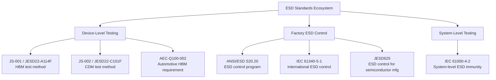
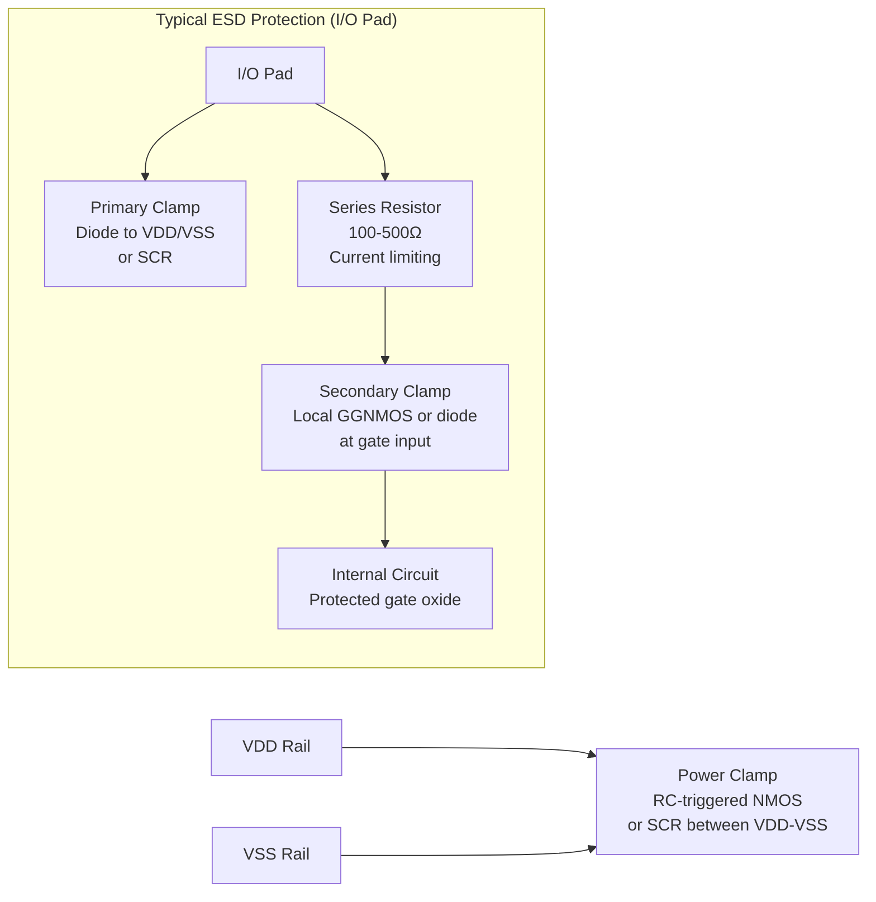
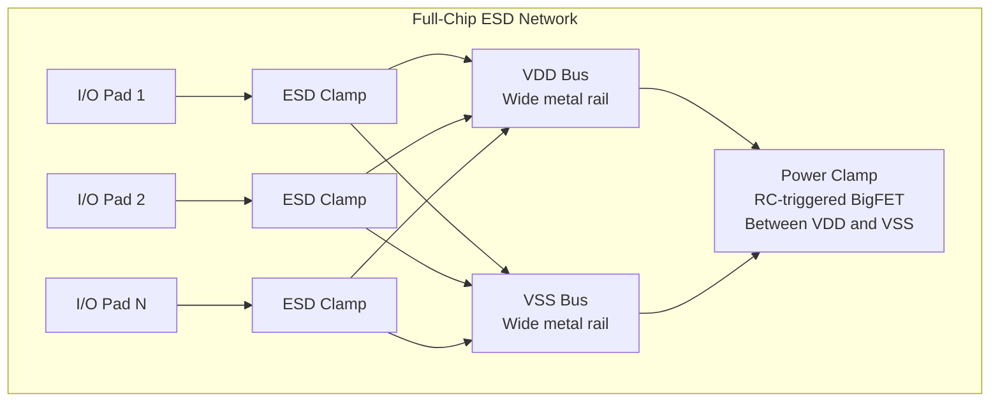

# ESD Standards — JEDEC & ESDA

**Topic:** Electrostatic Discharge (ESD) Protection Standards for Semiconductors  
**Standards:** ANSI/ESD S20.20:2021, IEC 61340-5-1:2016, JESD22-A114F (HBM), JESD22-C101F (CDM), JS-001, JS-002, AEC-Q100-002  
**SDO:** JEDEC, ESD Association (ESDA), IEC TC 101  
**Audience:** ESD design engineers, IC reliability engineers, manufacturing process engineers, ESD program managers  
**Prerequisites:** Semiconductor device physics, IC I/O design, charge/discharge fundamentals

---

## Chapter 1 — Historical Context & Origin Story

### 1.1 Timeline

| Year | Event | Impact |
|------|-------|--------|
| 1970s | ESD recognized as IC failure mechanism | Field returns from handling damage |
| 1980 | ESD Association (ESDA) founded | Industry body for ESD control |
| 1985 | MIL-STD-883 TM 3015 (first HBM standard) | Military defined first ESD test |
| 1993 | JEDEC JESD22-A114 (HBM) first revision | Commercial HBM test standard |
| 1999 | JEDEC JESD22-C101 (CDM) established | Charged Device Model standardized |
| 2009 | ESDA/JEDEC Joint Standard JS-001 (HBM) | Unified HBM test methodology |
| 2014 | ESDA/JEDEC JS-002 (CDM) | Unified CDM test methodology |
| 2019 | ANSI/ESD S20.20:2021 | Updated ESD control program standard |
| 2020 | AEC-Q100-002 Rev D | Automotive HBM requirement update |
| 2024 | JS-002 revision (field-induced CDM) | Updated CDM methodology and classification |

### 1.2 ESD Models Explained

| Model | Physical Scenario | What It Simulates |
|-------|-------------------|-------------------|
| **HBM (Human Body Model)** | Person touches IC pin | Human body discharges through device |
| **CDM (Charged Device Model)** | IC contacts grounded surface | Charged IC discharges itself rapidly |
| **MM (Machine Model)** | Metal tool touches IC | Historically used, now OBSOLETE |
| **System-Level (IEC 61000-4-2)** | ESD to powered system | System-level discharge event |

---

## Chapter 2 — Standard Architecture & Structure

### 2.1 ESD Classification Levels

**HBM Classification (JS-001 / JESD22-A114F):**

| Class | Voltage Range | Typical Requirement |
|-------|--------------|---------------------|
| 0 | < 250V | Fail (not acceptable for any application) |
| 1A | 250V - 500V | Minimum for some consumer |
| 1B | 500V - 1000V | Basic consumer |
| 1C | 1000V - 2000V | Standard consumer/industrial |
| 2 | 2000V - 4000V | **Automotive minimum (AEC-Q100-002)** |
| 3A | 4000V - 8000V | High robustness |
| 3B | > 8000V | Very high robustness |

**CDM Classification (JS-002 / JESD22-C101F):**

| Class | Voltage Range | Typical Requirement |
|-------|--------------|---------------------|
| C1 | < 125V | Very sensitive (handle with care) |
| C2 | 125V - 250V | Sensitive |
| C3 | 250V - 500V | **Industry target minimum** |
| C4 | 500V - 1000V | Robust |
| C5 | > 1000V | Very robust |

### 2.2 Key ESD Standards Hierarchy



---

## Chapter 3 — Technical Deep Dive

### 3.1 HBM (Human Body Model) — Test Circuit

| Component | Value | Represents |
|-----------|-------|------------|
| Capacitor (Cs) | 100 pF | Human body capacitance |
| Resistor (Rs) | 1500 Ω | Skin + body resistance |
| Peak current at 2000V | ~1.33 A | I_peak = V / Rs |
| Rise time | 2-10 ns | |
| Decay time (τ) | 150 ns | RC = 100pF × 1500Ω |
| Pulse energy at 2000V | 0.2 µJ | E = ½CV² |

**HBM Current Waveform:**
- Peak current: $I_{peak} = \frac{V_{ESD}}{R_s} = \frac{2000V}{1500\Omega} = 1.33A$
- Decay: $I(t) = I_{peak} \cdot e^{-t/(R_s \cdot C_s)}$

### 3.2 CDM (Charged Device Model) — Test Mechanism

| Parameter | Value | Notes |
|-----------|-------|-------|
| Capacitance | Package-dependent (1-30 pF typical) | Smaller = less energy but faster |
| Peak current at 500V | 5-15 A (much higher than HBM!) | Very fast discharge |
| Rise time | < 200 ps | Extremely fast |
| Pulse duration | < 1 ns | Very short |
| Energy at 500V | ~2 nJ (much less than HBM) | But concentrated at one location |
| Failure mechanism | Gate oxide rupture from high dV/dt | Thin oxides most vulnerable |

**Why CDM is more damaging to modern ICs than HBM:**
- Modern gate oxides: 1-5 nm thick (breakdown at 5-15V)
- CDM peak current: 5-15A in < 1ns → massive current density through small gate oxide area
- HBM has 1500Ω resistor limiting current; CDM has no resistance (just package inductance)
- CDM damage location: internal gates (not I/O protection)

### 3.3 ESD Protection Circuit Design



### 3.4 ESD Failure Mechanisms by Technology Node

| Technology | Gate Oxide | HBM Concern | CDM Concern | Typical Protection |
|------------|-----------|-------------|-------------|-------------------|
| 180nm | 3.2nm | Low (robust) | Moderate | Dual-diode + GGNMOS |
| 65nm | 1.8nm | Low | High | Dual-diode + SCR + power clamp |
| 28nm | 1.5nm | Low | Very High | Stacked diode + SCR + distributed power clamp |
| 7nm (FinFET) | ~1nm | Low | Extreme | Multi-domain ESD, CDM-focused design |
| 5nm/3nm | <1nm | Low | Extreme | Area-efficient CDM, smaller HBM target |

### 3.5 AEC-Q100-002 (Automotive ESD Requirement)

| Parameter | Requirement |
|-----------|-------------|
| HBM minimum class | Class 2 (≥ 2000V) for all automotive ICs |
| Pin combinations | All pins vs. VSS (positive and negative) |
| Post-test criteria | Full parametric pass + functional pass |
| Classification accuracy | Per JS-001 test method |
| Additional for some OEMs | ≥ 2000V corner pins, ≥ 3000V power pins |

---

## Chapter 4 — Implementation Guide

### 4.1 ESD Design Process (IC Development)

```mermaid
graph TB
    A[Chip specification<br/>Define ESD target: HBM 2kV, CDM 500V] --> B[I/O library selection<br/>Choose ESD cells with proven robustness]
    B --> C[Power clamp design<br/>RC-triggered, sized for CDM peak current]
    C --> D[Floor plan<br/>ESD cells close to pads, low-inductance rails]
    D --> E[ESD rule check (ERC)<br/>Verify all pins have protection paths]
    E --> F[TCAD/circuit simulation<br/>Verify clamping voltage < oxide breakdown]
    F --> G[Layout verification<br/>Metal width for ESD current, guard rings]
    G --> H[Silicon verification<br/>TLP (Transmission Line Pulse) characterization]
    H --> I[Full ESD qualification<br/>HBM + CDM per JS-001/JS-002]
```

### 4.2 TLP (Transmission Line Pulse) — ESD Design Characterization

| Parameter | Typical |
|-----------|---------|
| Pulse width | 100 ns (simulates HBM timing) |
| Rise time | < 10 ns |
| Current range | 0 to 5+ A (stepped) |
| Measurement | I-V curve of protection device |
| Key metrics | Trigger voltage (Vt1), holding voltage (Vh), failure current (It2) |
| Purpose | Characterize ESD device without full HBM/CDM test (faster iteration) |
| Correlation | TLP It2 × 1500Ω ≈ HBM failure voltage |

---

## Chapter 5 — Certification & Audit

### 5.1 ESD Control Program (ANSI/ESD S20.20)

| Element | Requirement |
|---------|-------------|
| ESD coordinator | Designated person responsible for program |
| ESD-protected area (EPA) | Defined zones with controlled access |
| Personnel grounding | Wrist straps (< 35 MΩ to ground), heel straps, ESD garments |
| Work surfaces | Dissipative mats (10⁶ - 10⁹ Ω) connected to ground |
| Ionization | Air ionizers for isolated conductors |
| Packaging | ESD-safe bags, boxes (shielding or dissipative) |
| Compliance verification | Regular audits, wrist strap testing, surface resistance checks |
| Training | All personnel trained on ESD awareness |
| Certification | Facility can be certified to ANSI/ESD S20.20 (third-party audit) |

---

## Chapter 6 — Regional & Domain Variants

| Standard | Region | Scope |
|----------|--------|-------|
| ANSI/ESD S20.20 | US (but globally adopted) | ESD control program |
| IEC 61340-5-1 | International (IEC) | Equivalent to S20.20 (harmonized) |
| JESD625 | Global (JEDEC) | ESD control for semiconductor manufacturing |
| AEC-Q100-002 | Automotive (global) | Automotive IC ESD requirement |
| MIL-STD-1686 | US military | ESD control for military programs |
| ESDA TR5.0-01 | Global (ESDA) | ESD handbook (best practices) |

---

## Chapter 7 — Comparison: HBM vs. CDM vs. System-Level ESD

| Aspect | HBM | CDM | System-Level (IEC 61000-4-2) |
|--------|-----|-----|------|
| Energy | 0.2 µJ at 2kV | 2 nJ at 500V | 45 µJ at 8kV |
| Peak current | 1.33 A at 2kV | 5-15 A at 500V | 30 A at 8kV |
| Pulse duration | ~150 ns | < 1 ns | ~100 ns |
| Rise time | 2-10 ns | < 200 ps | < 1 ns |
| Failure location | I/O transistors (lateral) | Internal gates (oxide) | System-level (board trace, connector) |
| Test level | Component (unpowered) | Component (unpowered) | System (powered) |
| Who designs for it | IC ESD engineer | IC ESD engineer | Board/system engineer |
| Responsibility | Silicon provider | Silicon provider | System integrator |
| Automotive requirement | ≥ 2000V (AEC-Q100-002) | ≥ 500V (target) | ±8kV contact, ±15kV air (IEC) |

---

## Chapter 8 — Mermaid Architecture Diagrams

### 8.1 ESD Event in Manufacturing/Handling

```mermaid
graph LR
    subgraph "ESD Risk Points in IC Lifecycle"
        A[Wafer fab<br/>CDM from handling tools<br/>Risk: LOW with EPA controls] --> B[Wafer test<br/>CDM from probe contact<br/>Risk: MEDIUM]
        B --> C[Assembly<br/>CDM from pick-place<br/>Risk: HIGH (device charged)]
        C --> D[Package test<br/>CDM + HBM from handlers<br/>Risk: MEDIUM]
        D --> E[Board assembly<br/>CDM during placement<br/>Risk: MEDIUM]
        E --> F[System test<br/>HBM from operators<br/>Risk: LOW with controls]
        F --> G[Field use<br/>System-level ESD<br/>Risk: varies by application]
    end
```

### 8.2 ESD Protection Design Architecture



---

## Chapter 9 — Case Studies & Failure Analysis

### 9.1 CDM Failure in Automotive MCU (28nm)

**Problem:** Automotive MCU failed CDM testing at 250V (target: 500V, Class C4). Failure pin: high-speed SerDes output.

**Root cause:**
- SerDes I/O pad had minimal ESD protection (to meet 10 Gbps signal integrity requirements)
- Large ESD diodes would add too much capacitance (> 0.5pF limit for SerDes)
- CDM peak current at 250V: ~8A through thin gate oxide of output driver pre-driver stage
- Pre-driver PMOS gate oxide ruptured (1.5nm oxide, breakdown at ~5V, CDM transient exceeded)

**Resolution:**
- Added distributed small diodes (0.05pF each, 4 in series → still < 0.2pF total)
- Added local power clamp near SerDes block (reduces voltage across pre-driver)
- Used cascode topology in output driver (distributes voltage across two devices)
- Result: passed 500V CDM with < 0.3pF capacitance penalty

### 9.2 ESD Control Program Failure in Production

**Problem:** Automotive IC production line showed 0.5% ESD-induced yield loss (detected at final test as gate oxide leakage failures). Cost: $500K/month.

**Root cause:**
- Pick-and-place machine charging devices to 500-800V during handling
- Machine's ionizer was malfunctioning (fan stopped, ionization inactive)
- Routine ionizer verification was monthly; failure occurred 3 weeks before check
- Charged devices contacted test socket → CDM event → latent gate damage

**Resolution:**
- Added real-time ionizer monitoring (alarm if ion balance or airflow drops)
- Reduced verification interval to weekly for critical machines
- Added voltage monitoring on device during pick-place (alarm if > 100V)
- Installed charge-dissipative materials on all contact surfaces
- Annual savings: $6M (eliminated ESD yield loss)

---

## Chapter 10 — Future Evolution & Industry Trends

| Trend | Impact on ESD Standards |
|-------|------------------------|
| Sub-5nm gate oxide (<1nm) | CDM more critical, lower targets may be acceptable |
| 3D ICs (stacking) | New CDM modes from inter-die charging |
| GaN/SiC power ICs | Different ESD protection strategies (no body diode) |
| Chiplets (UCIe) | ESD at die-to-die interface — new challenge |
| Automotive ADAS (fine-pitch BGAs) | CDM target reduction discussions (500V → 250V) |
| Industry HBM target reduction | 1000V HBM acceptable for some apps (cost savings on ESD area) |
| Machine model (MM) | Officially obsolete — removed from standards |
| Charged board model (CBM) | Emerging concern for large PCBs |

---

## Chapter 11 — Interview Questions & Career Guide

### Tier 1: Entry-Level (0-3 years)

**Q1:** Explain the difference between HBM and CDM ESD. Which is more of a concern for modern ICs and why?  
**A:** **HBM:** Simulates a charged PERSON touching an IC pin. Characterized by: 100pF body capacitance, 1500Ω body resistance. Results in relatively SLOW discharge (150ns time constant) with MODERATE peak current (~1.33A at 2kV). Damage typically occurs at I/O pad protection devices (junction burnout, metal fusing). Controlled by: wrist straps, grounding, ESD-safe handling procedures. **CDM:** Simulates a charged IC ITSELF contacting a grounded surface. Characterized by: package capacitance (1-30pF), very low discharge impedance (< 10Ω). Results in EXTREMELY FAST discharge (< 1ns) with HIGH peak current (5-15A at 500V). Damage typically occurs at INTERNAL gate oxides (not I/O protection — CDM current flows through internal circuits). Controlled by: ionizers (prevent device from charging), conductive work surfaces. **CDM is MORE critical for modern ICs because:** Modern gate oxides are < 2nm (breakdown at < 10V). CDM peak current creates large voltage drops across internal bus resistance. Internal circuits have NO ESD protection (only I/O pads have ESD clamps). Advanced nodes (7nm, 5nm, 3nm) have insufficient time for ESD clamp to turn on (< 200ps rise time). Industry trend: CDM failures account for majority of ESD-related yield/reliability issues.

### Tier 2: Mid-Level (3-8 years)

**Q2:** An automotive IC needs 2000V HBM and 500V CDM. The high-speed LVDS interface (3.125 Gbps) can tolerate only 0.3pF ESD capacitance. Design the ESD protection strategy.  
**A:** **(1) Challenge:** Standard dual-diode ESD clamp: 0.5-1.0pF per diode → 1-2pF total → way above 0.3pF budget. Must find low-capacitance solution. **(2) HBM 2000V strategy:** Required It2 (TLP failure current): 2000V / 1500Ω = 1.33A → ESD clamp must handle 1.33A peak. Traditional approach: large diodes (to VDD and VSS) → too much capacitance. Low-C approach: **SCR (Silicon Controlled Rectifier)** — triggers at ~7V, holds at ~1.5V. SCR has higher current capacity per unit capacitance. Small SCR (50µm): ~0.1pF, handles 2A+ in snapback. BUT: SCR latch-up risk during normal operation (must verify holding voltage > VDD). **(3) CDM 500V strategy:** CDM protection of INTERNAL circuits (not just I/O pad). Add distributed power clamps close to LVDS block (reduce IR drop on supply bus). Local clamp: small RC-triggered NMOS (reacts to fast CDM transient). Bus resistance reduction: wide VDD/VSS metals near LVDS I/O. **(4) Proposed solution:** Primary: Dual small diodes (each 0.05pF) to VDD and VSS rails = 0.1pF. Secondary: Series resistor (200Ω in polysilicon) + local GGNMOS at receiver gate = additional ESD voltage reduction internally. Power clamp: RC-triggered BigFET between VDD-VSS (100ns time constant, handles CDM surge). Total pad capacitance: 0.1pF (diodes) + 0.1pF (pad parasitic) + 0.05pF (trace) = 0.25pF < 0.3pF budget. **(5) Verification:** TLP testing: verify It2 > 1.5A (margin over 1.33A required). Very-fast TLP (vfTLP): verify CDM protection triggers in < 500ps. Signal integrity simulation: verify eye diagram open at 3.125 Gbps with 0.25pF load.

### Tier 3: Senior/Lead (8-15 years)

**Q3:** As ESD program manager for an automotive semiconductor company, design the ESD control and qualification strategy for a new 5nm automotive chip product line.  
**A:** **(1) Design-level ESD strategy (silicon):** Target: HBM 2000V (AEC-Q100-002 requirement), CDM 250V (reduced from 500V for 5nm — with OEM agreement). Justification for CDM reduction: 5nm FinFET gate oxide cannot practically achieve 500V CDM without unacceptable area/performance penalty. Mitigation: enhanced factory CDM controls (below). Full-chip ESD simulation: VFTLP at all pins, CDM current path analysis. ESD rule checking: automated ERC in layout flow (no unprotected gates to pads). **(2) Manufacturing ESD control (factory):** Enhanced CDM control for sensitive product: All handling equipment: device voltage < 50V (tighter than S20.20's 100V limit). Real-time charging monitors on pick-place, test handlers, tape-and-reel. Ionizer uptime: 99.5% minimum (monitored, alarmed). Periodic CDM audit: use field-induced CDM tester on actual product in handler → verify < 50V charging. Dissipative materials: all surfaces that contact package < 10⁹ Ω. **(3) ESD qualification testing:** HBM: per JS-001, all pin combinations, Class 2 (≥ 2000V). Verify at 25°C and -40°C (cold increases HBM failure risk for some protection types). CDM: per JS-002, all corner pins + supply pins. Target 250V CDM with full functional pass. Report CDM capability honestly to customers (some pins may be 250V, others may be higher). **(4) Customer communication:** Explain to OEM: 250V CDM is safe IF factory controls are maintained (voltage on device < 50V at all times). Provide application note: board-level ESD handling requirements for this component. Emphasize: system-level ESD (IEC 61000-4-2) protection is board/system designer's responsibility, not IC-level. **(5) Continuous improvement:** Monitor field returns for ESD signature (gate oxide leakage, junction damage). Track factory ESD events with real-time monitoring data. Annual benchmark: ESD yield loss target < 0.01% (zero for automotive).

---

## Chapter 12 — Cheat Sheet & Quick Reference

### ESD Classification Summary

```
HBM (JS-001):
  Class 2 = ≥2000V (automotive minimum, AEC-Q100-002)
  Class 1C = 1000-2000V (consumer)
  
CDM (JS-002):
  C4 = 500-1000V (robust)
  C3 = 250-500V (typical target)
  C2 = 125-250V (advanced nodes, enhanced factory control needed)

System-Level (IEC 61000-4-2):
  Level 4 = ±8kV contact, ±15kV air (automotive requirement)
```

### ESD Design Rules of Thumb

```
HBM current:     I_peak = V_ESD / 1500Ω (e.g., 2000V → 1.33A)
TLP correlation: HBM ≈ It2 × 1500Ω (e.g., It2=1.5A → HBM~2250V)
CDM current:     I_peak = 10-20× higher than HBM at same "voltage" label
ESD diode size:  ~1A/µm of diode width (technology dependent)
Capacitance:     Dual diode: ~0.5-1.0 pF/kV of HBM protection
SCR capacitance: ~0.1 pF for 2A capability (more area-efficient)
```

### Factory ESD Control Quick Reference

```
Personnel: Wrist strap (<35MΩ), heel strap, ESD smock
Surfaces:  Dissipative mat (10⁶-10⁹ Ω), grounded
Ionizers:  Balance <±50V, decay time <2s
Packaging: Shielded bags (<50V protection), dissipative boxes
Humidity:  >30% RH minimum (reduces tribocharging)
Audit:     Daily wrist strap test, weekly ionizer check
Target:    Device charging <100V (or <50V for CDM-sensitive)
```

---

*End of Document — 10_ESD_Standards_JEDEC_ESDA.md*
