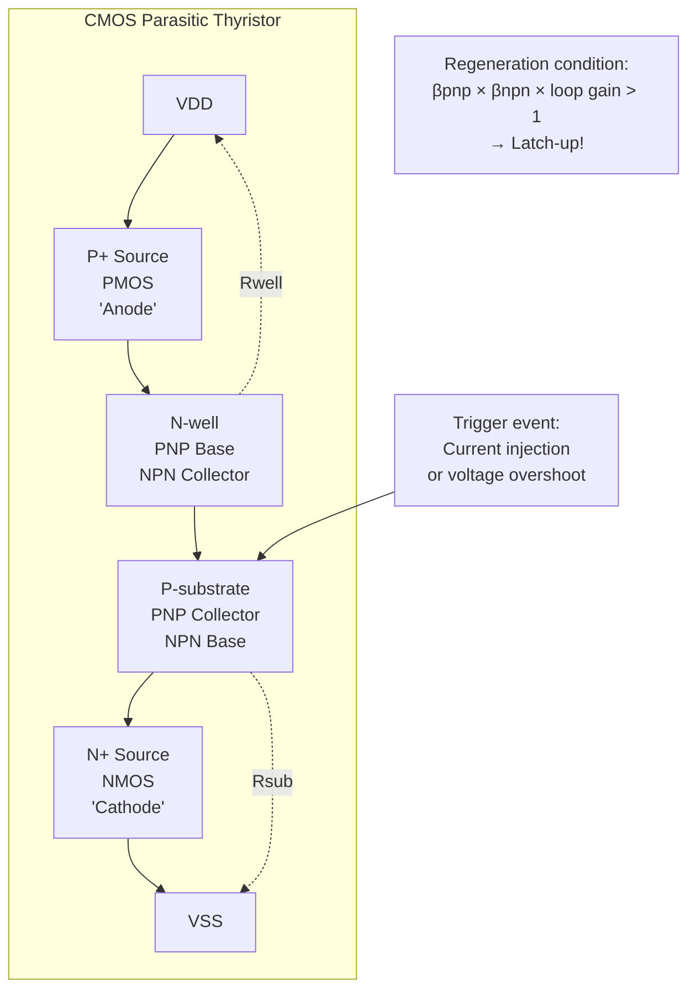
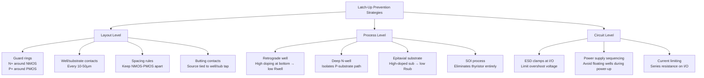
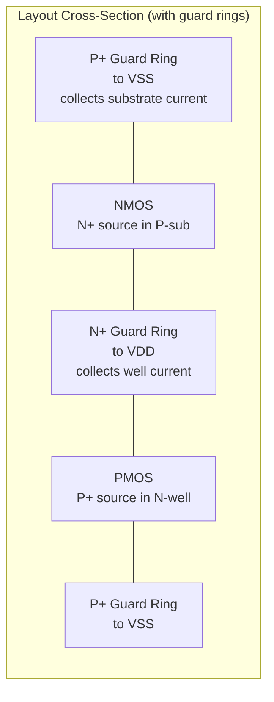

# Latch-Up Standards — JEDEC/AEC Methodology

**Topic:** Latch-Up Testing Standards for CMOS Integrated Circuits  
**Standards:** JEDEC JESD78E (Latch-Up Test), AEC-Q100-004 (Automotive Latch-Up), EIA/JEDEC-78  
**SDO:** JEDEC Solid State Technology Association, AEC  
**Audience:** CMOS IC designers, ESD/latch-up engineers, automotive IC reliability engineers  
**Prerequisites:** CMOS device physics, parasitic SCR structures, bipolar transistor action, AEC-Q100 fundamentals

---

## Chapter 1 — Historical Context & Origin Story

### 1.1 Timeline

| Year | Event | Impact |
|------|-------|--------|
| 1967 | Latch-up first reported in CMOS | Parasitic thyristor action recognized |
| 1980s | Latch-up becomes major CMOS reliability issue | Scaling increases susceptibility |
| 1988 | JEDEC JESD78 first published | First standardized latch-up test |
| 2006 | JESD78D | Updated for advanced nodes |
| 2016 | JESD78E | Current revision (voltage trigger + current trigger) |
| 2020 | AEC-Q100-004 Rev C | Automotive-specific latch-up requirements |

### 1.2 What Is Latch-Up?

Latch-up is a **parasitic thyristor** (PNPN) action in CMOS circuits that creates a low-impedance path between VDD and VSS, resulting in:
- Excessive current draw (100s of mA to amps)
- Potential device destruction (thermal failure)
- System malfunction (loss of function)

**Parasitic structure in CMOS:**

| Layer | Formed By | Role |
|-------|-----------|------|
| P (anode) | P+ source of PMOS (in N-well) | Thyristor anode |
| N (base 1) | N-well | PNP base / NPN collector |
| P (base 2) | P-substrate | NPN base / PNP collector |
| N (cathode) | N+ source of NMOS (in P-sub) | Thyristor cathode |

---

## Chapter 2 — Standard Architecture & Structure

### 2.1 JESD78E Test Methods

| Method | Trigger Type | What It Tests |
|--------|-------------|---------------|
| **I-test (Current injection)** | Force current into I/O pin | External overcurrent triggering latch-up |
| **V-test (Voltage overshoot)** | Apply voltage above VDD or below VSS | Voltage transient triggering latch-up |
| **Supply overvoltage** | Ramp VDD above maximum rated | Power supply transient triggering |

### 2.2 JESD78E Classification

| Class | I-test Current | V-test Voltage |
|-------|---------------|----------------|
| Class I | ±100 mA | 1.5 × VDD (above VDD), -1.5V (below VSS) |
| Class II | ±200 mA | 1.5 × VDD, -1.5V |
| Class III | > ±200 mA | > 1.5 × VDD |
| Class IV | Specific to application | Negotiated |

**AEC-Q100-004 Requirement:** Class II minimum for all automotive ICs.

### 2.3 AEC-Q100-004 Rev C — Automotive Requirements

| Parameter | Requirement |
|-----------|-------------|
| I-test current | ±200 mA minimum (at VDD pins and I/O pins) |
| Voltage trigger | VDD + 1.5V overshoot, VSS - 1.5V undershoot |
| Test temperature | Room temperature (25°C) + high temperature (maximum rated) |
| Pulse width | I-test: 200 µs minimum. V-test: not specified (ramp) |
| Supply current monitor | Detect > 10% increase in IDD during trigger |
| Post-trigger check | Power cycle required; verify no permanent damage |
| Pin coverage | All I/O pins + all VDD/VSS combinations |
| Accept criteria | NO latch-up at any pin at specified conditions |

---

## Chapter 3 — Technical Deep Dive

### 3.1 Latch-Up Physics



**Latch-up trigger condition:**
$$\beta_{PNP} \times \beta_{NPN} \times \text{Loop Gain} > 1$$

Where:
- $\beta_{PNP}$ = current gain of parasitic PNP (vertical)
- $\beta_{NPN}$ = current gain of parasitic NPN (lateral)
- Loop Gain includes well/substrate resistance effects

**Holding condition (once latched):**
$$I_{hold} = \frac{V_{DD} - V_{hold}}{R_{well} + R_{sub}}$$

Typically: $V_{hold}$ ≈ 1-2V (thyristor on-state), so current is:
$$I_{hold} = \frac{3.3V - 1.5V}{50\Omega + 100\Omega} ≈ 12 mA \text{ (minimum holding)}$$

But once latched, actual current can be much higher (amps), limited only by supply current capability.

### 3.2 I-Test (Current Injection)

| Step | Action |
|------|--------|
| 1 | Power device at VDD_max, measure baseline IDD |
| 2 | Select test pin (I/O pin) |
| 3 | Inject +100mA (or +200mA for Class II) into pin (current above VDD) |
| 4 | Monitor IDD during injection (pulse width ≥ 200µs) |
| 5 | Remove trigger current |
| 6 | Monitor IDD after trigger removal |
| 7 | If IDD increased > spec AND sustained after trigger removed → LATCH-UP DETECTED |
| 8 | Power cycle device, verify no permanent damage |
| 9 | Repeat with -100mA (or -200mA) — inject below VSS |
| 10 | Repeat for all I/O pins |

### 3.3 V-Test (Voltage Overshoot)

| Step | Action |
|------|--------|
| 1 | Power device at VDD_max, measure baseline IDD |
| 2 | Select test pin |
| 3 | Ramp pin voltage to VDD + 1.5V (or higher) |
| 4 | Monitor IDD during overshoot |
| 5 | Return pin to normal operating voltage |
| 6 | If IDD sustained high after voltage returns to normal → LATCH-UP |
| 7 | Power cycle, verify recovery |
| 8 | Repeat with undershoot: pin voltage to VSS - 1.5V |

### 3.4 Technology-Dependent Susceptibility

| Technology | Latch-Up Risk | Reason |
|------------|--------------|--------|
| Bulk CMOS (older nodes) | HIGH | Low-resistance substrate, high parasitic gains |
| Bulk CMOS (advanced, 28nm-) | MODERATE | Thinner epi, retrograde wells, tighter rules |
| SOI (Silicon-on-Insulator) | VERY LOW | BOX (buried oxide) eliminates parasitic thyristor |
| FinFET (7nm, 5nm) | LOW | Fin isolation reduces lateral bipolar gain |
| Deep N-well CMOS | LOW | N-well isolation interrupts PNP collector |
| Triple-well CMOS | LOW | Isolated P-well breaks substrate current path |
| GaN, SiC | NOT APPLICABLE | No CMOS parasitic structure |

---

## Chapter 4 — Implementation Guide

### 4.1 Latch-Up Prevention in IC Design



### 4.2 Layout Design Rules (Typical Advanced Node)

| Rule | Description | Typical Value |
|------|-------------|---------------|
| N-well to P+ (NMOS) spacing | Minimum distance from well edge to nearest NMOS | > 5 µm |
| Guard ring width | Minimum width of N+ or P+ guard ring | > 1 µm continuous |
| Well tap spacing | Maximum distance between well/substrate contacts | < 25 µm |
| I/O to core separation | Minimum space between I/O cells and core logic | > 10 µm with guard ring |
| Double guard ring | Required for high-current I/O | N+ inside P+, or vice versa |

---

## Chapter 5 — Certification & Audit

### 5.1 Latch-Up Test Report Content

| Section | Content |
|---------|---------|
| Device identification | Part number, process node, die size, package |
| Test conditions | VDD voltage, temperature (25°C and Tj_max) |
| Pin list | All tested pins with classification |
| I-test results | Current level, trigger pulse width, IDD during/after |
| V-test results | Voltage applied, IDD response |
| Pass/fail | Per JESD78E Class level |
| Failure analysis (if any) | Location of latch-up (cross-section, OBIRCH) |

---

## Chapter 6 — Regional & Domain Variants

### 6.1 Latch-Up Requirements by Application

| Application | Standard | Class | Additional |
|-------------|----------|-------|-----------|
| Automotive (AEC-Q100) | AEC-Q100-004 | Class II (±200mA) | Test at 25°C AND max Tj |
| Military (MIL-STD-883) | TM 5010 | Varies (often Class III+) | -55°C, 25°C, +125°C |
| Space (radiation) | SEL (Single Event Latch-up) | N/A | Heavy ion testing (different) |
| Consumer | JESD78E | Class I (±100mA) | 25°C only |
| Industrial | JESD78E | Class II | 25°C and max Tj |

### 6.2 Single Event Latch-up (SEL) — Space/Radiation

| Aspect | Electrical Latch-Up | Single Event Latch-Up (SEL) |
|--------|--------------------|-----------------------------|
| Trigger | External current/voltage event | Ionizing particle (heavy ion, proton) |
| Location | I/O and adjacent logic | Anywhere in die (random) |
| Standard | JESD78E, AEC-Q100-004 | JEDEC JESD89A, MIL-STD-883 TM 1020 |
| Prevention | Guard rings, layout rules | Same + SEL-hardened design, SOI |
| Testing | Electrical tester | Particle accelerator (heavy ion beam) |
| Risk environment | Manufacturing, field handling | Space, aviation altitude, nuclear |

---

## Chapter 7 — Comparison: Latch-Up vs. Related Phenomena

| Phenomenon | Mechanism | Sustained? | Destructive? | Standard |
|------------|-----------|-----------|-------------|----------|
| Latch-up | Parasitic SCR turn-on | Yes (until power cycled) | Yes (if not current-limited) | JESD78E |
| ESD damage | Dielectric/junction breakdown | No (instantaneous) | Yes (permanent) | JS-001, JS-002 |
| Electrical overstress (EOS) | Excessive voltage/current | No (during event) | Yes | Application-specific |
| Hot carrier injection | Channel carrier damage | No | Gradual degradation | HTOL/reliability |
| Snapback (ESD protection) | Intended NPN/SCR turn-on | Yes (designed) | No (designed to survive) | ESD design |

---

## Chapter 8 — Mermaid Architecture Diagrams

### 8.1 CMOS Cross-Section with Parasitic Thyristor

```mermaid
graph TB
    subgraph "CMOS Cross-Section (Parasitic SCR)"
        A[VDD<br/>P+ source PMOS] 
        B[N-well<br/>Rwell ≈ 50-500Ω]
        C[P-substrate<br/>Rsub ≈ 100-1000Ω]
        D[VSS<br/>N+ source NMOS]
        
        E[Parasitic PNP:<br/>P+(PMOS) → N-well → P-sub]
        F[Parasitic NPN:<br/>N+(NMOS) → P-sub → N-well]
    end
    
    subgraph "Latch-Up Path"
        G[Trigger: current into substrate<br/>raises P-sub potential] --> H[NPN turns on<br/>pulls N-well down]
        H --> I[PNP turns on<br/>injects into P-sub]
        I --> J[Positive feedback<br/>βpnp×βnpn > 1]
        J --> K[SCR ON<br/>VDD→VSS current: Amps!]
    end
```

### 8.2 Guard Ring Layout Strategy



---

## Chapter 9 — Case Studies & Failure Analysis

### 9.1 Automotive ECU Latch-Up from Load Dump

**Problem:** Engine ECU experienced latch-up during load dump transient (battery disconnected while alternator charging → 60V spike on VDD). ECU drew 2A from supply → voltage regulator current-limited → IC survived but lost function until power cycled.

**Root cause:**
- Load dump spike reached IC VDD pin (after partial clamping by TVS)
- Voltage exceeded VDD + 1.5V at I/O pins connected to external sensors
- Parasitic PNP turned on in I/O ring → triggered latch-up path
- IC drew excessive current, microcontroller hung (lost register state)
- Watchdog timer did NOT trigger because clock was also affected by latch-up

**Resolution:**
- Added external TVS diode with lower clamping voltage
- Improved IC latch-up immunity: deeper guard rings at I/O, lower Rwell (more well taps)
- Added system-level power monitoring: detect overcurrent → automatic power cycle
- Re-qualified IC to JESD78E Class III (±300mA) — exceeded AEC-Q100-004 requirement

### 9.2 Latch-Up During Hot-Plug Event

**Problem:** Automotive infotainment IC latched during connector hot-plug (connecting USB cable while system powered). Device drew 500mA excess current.

**Root cause:**
- USB data pin was connected to IC BEFORE USB VBUS was established
- IC data pin was pulled to -0.7V (USB cable capacitance discharge)
- Negative voltage on I/O pin → substrate forward-biased → NPN triggered
- Latch-up at USB I/O cell → IDD increase → thermal runaway in I/O (localized)

**Resolution:**
- Added TVS diode on USB data lines (clamping to VSS - 0.3V)
- IC redesigned: stronger guard rings around USB I/O cells
- Added ESD diode with low forward voltage to clamp negative excursions quickly
- Qualified to JESD78E Class II with negative I-test at -200mA → now passes

---

## Chapter 10 — Future Evolution & Industry Trends

| Trend | Impact on Latch-Up |
|-------|-------------------|
| FinFET (7nm, 5nm, 3nm) | Reduced latch-up risk (fin isolation, high-doped wells) |
| SOI for automotive | Eliminates latch-up concern entirely |
| GAA (Gate-All-Around) / Nanosheet | Further reduces parasitic gains |
| Higher VDD (1.0V → 0.75V → 0.5V) | Lower voltage = less energy for latch-up destruction |
| Multi-VDD designs | Cross-domain latch-up (different supply voltages) new concern |
| 3D stacking | Inter-tier latch-up (through TSV coupling) — emerging |
| Automotive voltage transients | Getting worse (EV, 48V, 800V systems → coupling) |
| Chiplets | Die-to-die interface latch-up during module-level transients |

---

## Chapter 11 — Interview Questions & Career Guide

### Tier 1: Entry-Level (0-3 years)

**Q1:** What is CMOS latch-up, what causes it, and how is it detected during testing?  
**A:** **What it is:** An unintended low-resistance current path between VDD and VSS caused by a parasitic thyristor (PNPN) structure inherent in bulk CMOS. Once triggered, the thyristor latches ON (self-sustaining) until power is removed. Current can reach amperes → device damage or destruction. **What causes it:** Any event that forward-biases one of the parasitic junctions: (1) I/O pin voltage exceeding VDD or going below VSS (e.g., inductive transient, signal overshoot). (2) Substrate/well current injection (from external fault or internal ESD event). (3) Supply voltage ramp-up/down sequence violating operating conditions. (4) Radiation particle strike (Single Event Latch-up in space). **Detection during testing:** Per JESD78E: (1) Monitor supply current (IDD) continuously. (2) Apply trigger (current injection or voltage overshoot) to each pin. (3) Remove trigger. (4) If IDD remains elevated after trigger removal → LATCH-UP detected. (5) Power cycle to clear. Verify device still functional (no permanent damage from brief latch-up).

### Tier 2: Mid-Level (3-8 years)

**Q2:** A 16nm CMOS automotive IC passes JESD78E Class II at 25°C but FAILS at 125°C. The failure occurs on a specific analog I/O pin at -150mA. Explain why temperature matters and propose a fix.  
**A:** **Why temperature matters:** At elevated temperature (125°C): (1) Parasitic bipolar gains (β) INCREASE with temperature (minority carrier lifetime increases). (2) $\beta_{PNP}$ and $\beta_{NPN}$ both rise → product exceeds unity more easily → lower trigger threshold. (3) Well and substrate resistance (Rwell, Rsub) INCREASE with temperature (mobility decreases) → higher IR drop → easier to forward-bias junctions. (4) Threshold current (trigger current needed to initiate latch-up) DECREASES at high temperature. Typical: if 25°C trigger threshold = 200mA, at 125°C it may drop to 120-150mA. This IC: fails at -150mA at 125°C (just below Class II -200mA margin at room temp). **Fix options:** (1) **Layout fix (most effective):** Add more substrate contacts (reduce Rsub → less voltage drop from injected current). Add deeper/wider guard ring around the failing analog I/O cell. Reduce N-well to nearest NMOS source distance (break parasitic NPN base width). Estimated improvement: 50-100% increase in trigger current margin. (2) **Process option:** Use retrograde well implant (increases well doping at depth → lower Rwell). Add deep N-well under failing cell (breaks vertical PNP). (3) **Circuit option:** Add clamping diode at I/O pin (limit negative excursion to -0.7V → reduce injected current). Series resistance in I/O path (limit current that can be injected by external source).

### Tier 3: Senior/Lead (8-15 years)

**Q3:** Design the latch-up immunity strategy for a mixed-signal automotive SoC with multiple voltage domains (0.75V core, 1.8V I/O, 3.3V automotive I/O, 5V analog). What are the cross-domain latch-up risks?  
**A:** **Cross-domain latch-up:** Multiple VDD rails create situations where one domain can inject into another's substrate/wells → trigger latch-up in adjacent domain. Most dangerous: 5V analog domain next to 0.75V digital core (large voltage differential). **(1) Domain isolation strategy:** Physical separation: minimum 10µm between voltage domains with continuous guard ring. Guard ring must be connected to LOCAL ground of each domain (not shared ground). Deep N-well isolation: place 5V domain in isolated deep N-well (interrupts substrate current to core). **Level-shifter cells:** latch-up designed specifically for cross-domain transition — double guard rings, larger spacing. **(2) Power sequencing risk:** If 5V domain powers up before 0.75V domain: 5V I/O forward-biases junction to unpowered core → latch-up of core circuit. Prevention: power-on sequencing (core first, then I/O) or anti-latch-up clamps that activate during ramp-up. **(3) Testing strategy:** Standard JESD78E tests within each domain. ADDITIONAL: cross-domain tests — inject current on 5V pin, monitor IDD of 0.75V domain (and vice versa). Test all power-up sequences: verify no latch-up during any sequencing order. Test at 150°C (automotive Grade 0 requirement from AEC-Q100-004). **(4) Design rules by domain:** 5V domain: double guard rings (P+ outer, N+ inner), well taps every 10µm. 3.3V domain: standard guard rings, well taps every 15µm. 1.8V domain: standard guard rings, well taps every 20µm. 0.75V core: relaxed (low voltage → less latch-up energy) BUT protect from adjacent high-V injection. **(5) Verification methodology:** Full-chip extraction of parasitic PNP/NPN gains (TCAD or compact model). Simulate worst-case trigger current for each I/O cell at 150°C. Automated layout rule check: verify guard ring continuity, well tap density, domain separation.

---

## Chapter 12 — Cheat Sheet & Quick Reference

### Latch-Up Test Summary

```
I-test:  Inject ±200mA (Class II) into I/O pin, monitor IDD
V-test:  Apply VDD+1.5V (or VSS-1.5V) to I/O pin, monitor IDD
Temp:    25°C AND max rated junction temperature
Accept:  NO latch-up at any pin (IDD must return to baseline after trigger)
Standard: JESD78E (test method) + AEC-Q100-004 (automotive requirement)
```

### Latch-Up Prevention Quick Reference

```
Layout:
  - Guard rings: continuous P+ (to VSS) around NMOS, N+ (to VDD) around PMOS
  - Well taps: every 10-25µm (denser near I/O)
  - Spacing: NMOS-to-PMOS > 5µm minimum (more at I/O)
  - Butting contacts: source tied to local well/substrate tap

Process:
  - Retrograde wells: high doping at bottom → low Rwell
  - Epitaxial substrate: low-doped epi on high-doped bulk → low Rsub
  - Deep N-well: isolates P-substrate path (blocks vertical PNP)
  - SOI: eliminates parasitic thyristor entirely

Circuit:
  - ESD clamps: limit I/O voltage excursion
  - Power sequencing: prevent floating wells during power transitions
  - Current monitoring: detect and power-cycle if latch-up occurs
```

### Temperature Effect Rule of Thumb

```
Latch-up trigger current decreases ~30-50% from 25°C to 125°C
If passing at 200mA margin at 25°C → may only have 100-140mA margin at 125°C
ALWAYS test at max operating temperature for automotive (AEC-Q100-004 requires this)
```

---

*End of Document — 11_Latch_Up_Standards.md*
