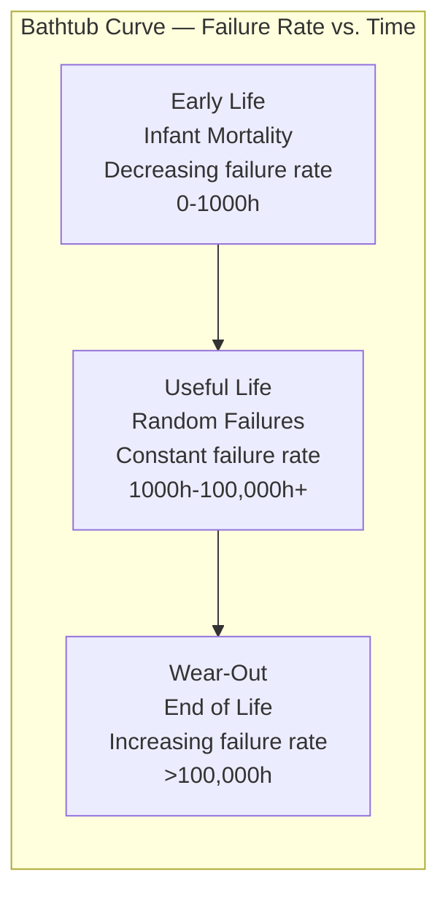
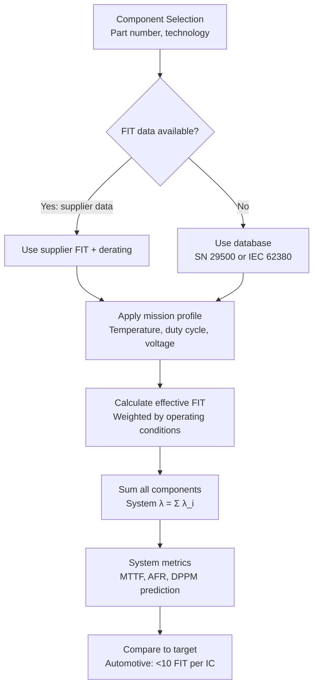
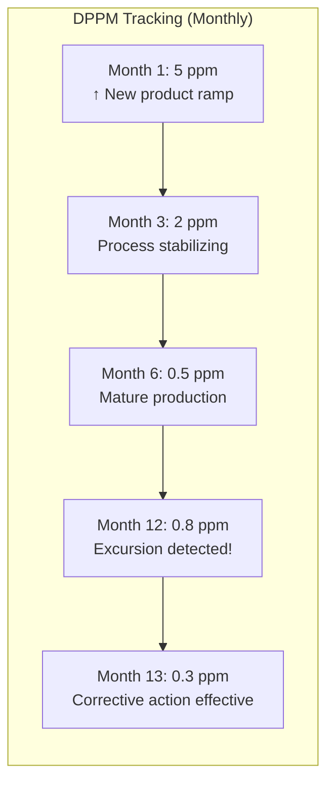

# Reliability Metrics — FIT, MTTF, DPPM

**Topic:** Semiconductor Reliability Metrics, Models, and Calculations  
**Standards:** JEDEC JEP122H (Arrhenius), JESD85 (Early Life Failure Rate), JESD91A (Lognormal), SN 29500 (Siemens FIT database)  
**SDO:** JEDEC, IEC, SN (Siemens/European)  
**Audience:** Reliability engineers, quality engineers, system-level FMEDA analysts, automotive safety engineers  
**Prerequisites:** Statistics (exponential, Weibull, lognormal distributions), semiconductor physics, acceleration models

---

## Chapter 1 — Historical Context & Origin Story

### 1.1 Timeline

| Year | Event | Impact |
|------|-------|--------|
| 1950s | Bathtub curve concept established | Reliability theory foundations |
| 1961 | MIL-HDBK-217 first published | Military reliability prediction handbook |
| 1970s | JEDEC reliability standards development | Semiconductor-specific metrics |
| 1986 | SN 29500 (Siemens Normen) | European component FIT database |
| 2004 | JEDEC JEP122 (activation energy database) | Standardized acceleration parameters |
| 2009 | JEDEC JESD85 (early life failure rate) | Methods to calculate field FIT from qualification |
| 2016 | IEC 62380 (supersedes MIL-HDBK-217F) | Updated prediction standard |
| 2020 | ISO 26262 + SN 29500 for automotive | FIT rates feed into ASIL calculations |

### 1.2 Key Metrics Overview

| Metric | Definition | Units | Typical Values (Automotive IC) |
|--------|-----------|-------|-------------------------------|
| **FIT** | Failures in Time (failures per 10⁹ device-hours) | 1 FIT = 10⁻⁹ /hour | 1-100 FIT (total device) |
| **MTTF** | Mean Time To Failure | Hours | 10⁷ - 10⁹ hours |
| **MTBF** | Mean Time Between Failures (repairable) | Hours | System-level metric |
| **DPPM** | Defective Parts Per Million (shipped) | ppm | 0-10 ppm (automotive target) |
| **AFR** | Annual Failure Rate | %/year | 0.001% - 0.1% |
| **PFH** | Probability of dangerous Failure per Hour | 1/hour | 10⁻⁷ - 10⁻⁹ (ISO 26262) |

---

## Chapter 2 — Standard Architecture & Structure

### 2.1 Relationship Between Metrics

$$\text{FIT} = \frac{10^9}{\text{MTTF (hours)}}$$

$$\text{AFR} = 1 - e^{-8760/\text{MTTF}} \approx \frac{8760}{\text{MTTF}} \text{ (for small AFR)}$$

$$\text{MTTF} = \frac{10^9}{\text{FIT}}$$

**Example:** FIT = 10 → MTTF = 10⁸ hours = 11,415 years → AFR = 0.00876%

### 2.2 Bathtub Curve Regions



| Region | Distribution | Source | Mitigation |
|--------|-------------|--------|------------|
| Infant mortality | Weibull (β < 1) | Defects, contamination, process variation | Burn-in, screening |
| Useful life (random) | Exponential (constant λ) | Random failures, cosmic rays | FIT calculation applies here |
| Wear-out | Weibull (β > 1) or Lognormal | TDDB, EM, HCI, fatigue | Qualification life test proves absence |

---

## Chapter 3 — Technical Deep Dive

### 3.1 Acceleration Models

**Arrhenius (Temperature Acceleration):**

$$AF = e^{\frac{E_a}{k_B}\left(\frac{1}{T_{use}} - \frac{1}{T_{stress}}\right)}$$

| Mechanism | Activation Energy (Ea) | Typical |
|-----------|----------------------|---------|
| Electromigration (EM) | 0.7 - 0.9 eV | 0.7 eV |
| TDDB (Time-Dependent Dielectric Breakdown) | 0.6 - 0.8 eV | 0.7 eV |
| Hot Carrier Injection (HCI) | 0.1 - 0.2 eV | Negative temperature dependence! |
| NBTI (Negative Bias Temperature Instability) | 0.5 - 0.8 eV | 0.6 eV |
| Corrosion (moisture) | 0.4 - 0.8 eV | 0.5 eV |
| Intermetallic growth | 0.5 - 1.0 eV | 0.7 eV |
| Wire bond fatigue | Coffin-Manson (not Arrhenius) | m = 3-5 |
| Solder fatigue | Coffin-Manson | m = 2-4 |

**Black's Equation (Electromigration):**

$$MTTF_{EM} = A \cdot J^{-n} \cdot e^{\frac{E_a}{k_B T}}$$

Where:
- $J$ = current density (A/cm²)
- $n$ = current density exponent (typically 1-2)
- $E_a$ = activation energy (~0.7 eV for Al, ~0.9 eV for Cu)

**Coffin-Manson (Thermal Cycling Fatigue):**

$$N_f = C \cdot (\Delta T)^{-m}$$

Where:
- $N_f$ = cycles to failure
- $\Delta T$ = temperature swing
- $m$ = fatigue exponent (2-5 depending on material)
- $C$ = material constant

**Eyring Model (Multi-Stress):**

$$AF = e^{\frac{E_a}{k_B}\left(\frac{1}{T_{use}} - \frac{1}{T_{stress}}\right)} \cdot \left(\frac{RH_{stress}}{RH_{use}}\right)^n \cdot e^{\gamma(V_{stress} - V_{use})}$$

Used for THB (Temperature Humidity Bias) acceleration.

### 3.2 FIT Rate Calculation from Qualification Data

**From HTOL (High Temperature Operating Life) data:**

Given: N samples tested for t hours at temperature T_stress with 0 failures.

$$FIT = \frac{\chi^2(\alpha, 2r+2)}{2 \cdot N \cdot t \cdot AF} \times 10^9$$

Where:
- $\chi^2(\alpha, 2r+2)$ = chi-squared value for confidence level α and r failures
- For 0 failures, 60% confidence: $\chi^2(0.6, 2) = 1.833$
- For 0 failures, 90% confidence: $\chi^2(0.9, 2) = 4.605$
- $AF$ = acceleration factor (Arrhenius from stress to use temperature)

**Example calculation:**
- N = 231 samples (77 × 3 lots, per AEC-Q100)
- t = 1000 hours
- T_stress = 125°C = 398K, T_use = 55°C = 328K
- Ea = 0.7 eV
- r = 0 failures

$AF = e^{(0.7/8.617×10^{-5})(1/328 - 1/398)} = e^{8123 × (3.049×10^{-3} - 2.513×10^{-3})} = e^{8123 × 5.36×10^{-4}} = e^{4.35} = 77.5$

$FIT_{60\%} = \frac{1.833}{2 × 231 × 1000 × 77.5} × 10^9 = \frac{1.833}{35,805,000} × 10^9 = 51.2 \text{ FIT}$

### 3.3 DPPM Calculation

$$DPPM = \frac{\text{Number of defective parts}}{\text{Total parts shipped}} \times 10^6$$

**From FIT rate to field DPPM:**

$$DPPM(t) = \left(1 - e^{-\lambda t}\right) \times 10^6 \approx \lambda \times t \times 10^6$$

Where:
- $\lambda = FIT \times 10^{-9}$ (failure rate in 1/hour)
- $t$ = warranty period in hours

**Example:** FIT = 50, warranty = 5 years (43,800 hours):
$DPPM = 50 \times 10^{-9} \times 43,800 \times 10^6 = 2.19 \text{ ppm over 5 years}$

### 3.4 Weibull Analysis

$$F(t) = 1 - e^{-(t/\eta)^\beta}$$

| Parameter | Meaning | Interpretation |
|-----------|---------|---------------|
| β (shape) | Failure rate behavior | β < 1: infant mortality, β = 1: random, β > 1: wear-out |
| η (scale) | Characteristic life (63.2% failure) | Time at which 63.2% of population fails |
| t₁₀ | 10% failure time (B10 life) | Conservative design point |

**From Weibull to FIT (constant failure rate approximation):**

Only valid in useful-life region (β ≈ 1). For wear-out (β > 1), FIT is time-dependent.

---

## Chapter 4 — Implementation Guide

### 4.1 Reliability Prediction for Automotive System

```mermaid
graph TB
    A[System architecture<br/>Block diagram] --> B[Component list<br/>Each IC, passive, connector]
    B --> C[FIT rate per component<br/>From supplier data or SN 29500]
    C --> D[Sum FIT rates<br/>λ_system = Σ λ_component × π_factors]
    D --> E[System MTTF<br/> = 10⁹ / λ_system]
    E --> F[Compare to target<br/>Automotive: system FIT < target]
    
    C --> G[π factors (derating):<br/>π_T (temperature)<br/>π_V (voltage)<br/>π_Q (quality)<br/>π_E (environment)]
```

### 4.2 ISO 26262 Safety Metrics (Using FIT Rates)

| Metric | Formula | ASIL B | ASIL C | ASIL D |
|--------|---------|--------|--------|--------|
| SPFM (Single Point Fault Metric) | 1 - (λSPF / λtotal) | ≥ 90% | ≥ 97% | ≥ 99% |
| LFM (Latent Fault Metric) | 1 - (λlatent / λtotal) | ≥ 60% | ≥ 80% | ≥ 90% |
| PMHF (Probabilistic Metric for HW Failure) | Sum of dangerous undetected | < 10⁻⁷/h | < 10⁻⁷/h | < 10⁻⁸/h |

**How FIT feeds into ISO 26262:**
- Each IC has a total FIT rate (from qualification data or supplier)
- FMEDA (Failure Mode Effects and Diagnostic Analysis) distributes FIT across failure modes
- Each failure mode classified: safe, detected, not-detected (latent), single-point
- Safety metrics calculated from these distributions

### 4.3 Mission Profile and Effective FIT

| Condition | Fraction of Time | Junction Temperature | FIT at Tj | Contribution |
|-----------|-----------------|---------------------|-----------|--------------|
| Engine off (parked) | 90% | 25°C | 2 FIT | 1.8 |
| City driving | 5% | 85°C | 15 FIT | 0.75 |
| Highway driving | 4% | 105°C | 40 FIT | 1.6 |
| Full load (hill/towing) | 1% | 125°C | 100 FIT | 1.0 |
| **Weighted average** | | | | **5.15 FIT effective** |

---

## Chapter 5 — Certification & Audit

### 5.1 Reliability Reports

| Report Type | Content | When |
|-------------|---------|------|
| Qualification reliability report | HTOL/TC/HAST results, AF calculation, FIT estimate | Initial qualification |
| Field return analysis | Failure mode, root cause, ppm rate | Ongoing production |
| FMEDA report | FIT per failure mode, safety metrics | ISO 26262 compliance |
| Reliability prediction (SN 29500) | System-level FIT estimate | System design phase |
| Warranty return rate | Monthly ppm trending | Production monitoring |

---

## Chapter 6 — Regional & Domain Variants

### 6.1 Reliability Databases

| Database | Region/Origin | Application |
|----------|-------------|-------------|
| SN 29500 | Siemens (Germany) | European automotive, industrial |
| MIL-HDBK-217F | US DoD | Military (legacy, no longer updated) |
| IEC 62380 (formerly RDF 2000) | International (French origin) | Telecom, general |
| Telcordia SR-332 | US (Bell Labs origin) | Telecommunications |
| FIDES | French military/aerospace | Modern military prediction |
| Supplier-specific | Each semiconductor vendor | Most accurate (actual field data) |

### 6.2 Target DPPM by Industry

| Industry | DPPM Target | FIT Target (component) |
|----------|-------------|----------------------|
| Automotive (OEM target) | < 1 ppm (warranty period) | < 10 FIT |
| Automotive (actual typical) | 1-10 ppm | 10-100 FIT |
| Industrial | 10-100 ppm | 50-200 FIT |
| Consumer electronics | 100-1000 ppm | 100-500 FIT |
| Military/Space | 0 defects accepted | < 1 FIT (high reliability) |
| Medical (Class III) | < 1 ppm | < 10 FIT |

---

## Chapter 7 — Comparison: Reliability Prediction Methods

| Method | Based On | Accuracy | Effort |
|--------|----------|----------|--------|
| Parts count (SN 29500) | Generic FIT databases, π-factors | ±10× | Low |
| Parts stress (MIL-HDBK-217F) | Detailed stress analysis + π-factors | ±5× | Medium |
| Physics of failure (PoF) | Actual degradation mechanisms + simulation | ±2× | High |
| Field data (Bayesian) | Real field returns + prior estimate | Best (if enough data) | Low (after data collection) |
| Qualification extrapolation (JESD85) | HTOL acceleration to use conditions | ±3× | Medium |

---

## Chapter 8 — Mermaid Architecture Diagrams

### 8.1 Reliability Prediction Flow



### 8.2 DPPM Trend Monitoring



---

## Chapter 9 — Case Studies & Failure Analysis

### 9.1 FIT Rate Misprediction for Automotive MCU

**Problem:** Automotive MCU qualified with calculated FIT = 15 (from HTOL: 0 failures in 231 samples × 1000h at 150°C). Field return rate after 2 years: equivalent to 85 FIT. Discrepancy: 5.7× higher than predicted.

**Root cause analysis:**
- Qualification HTOL was at steady-state 150°C (constant temperature)
- Field application had thermal cycling (ECU cycles on/off 10× per day)
- Dominant field failure mode: wire bond fatigue from thermal cycling — NOT a mechanism tested by HTOL
- HTOL catches: TDDB, EM, HCI (wearout at constant temp)
- HTOL misses: thermal cycling fatigue (wire bond, solder, metallization)
- Temperature cycling test (TC) was passed — but TC only applies 1000 cycles. Field: 10/day × 365 × 2yr = 7300 cycles exceeded qualification margin

**Resolution:**
- Added power temperature cycling (PTC) test: 5000 cycles at actual ΔTj
- Updated FIT prediction: include BOTH intrinsic (wearout) FIT AND extrinsic (fatigue) FIT
- Redesigned wire bond (Al to Cu ribbon) for higher fatigue life
- New predicted FIT: 15 (intrinsic) + 8 (fatigue, with new bond) = 23 FIT total

### 9.2 Zero-Defect Audit — Achieving < 1 DPPM

**Challenge:** OEM requires < 1 DPPM (less than 1 defect per million shipped) for safety-critical braking IC. Production volume: 10 million per year.

**Strategy:**
1. **Wafer-level screening:** 100% parametric + functional at 3 temperatures → catches 95% of defects
2. **Burn-in (96h at 150°C):** Accelerates infant mortality → catches another 3% of latent defects
3. **IDDQ testing:** Quiescent current measurement (sensitive to gate oxide defects) → catches 1%
4. **Statistical outlier removal:** Parts within spec but near limits → removed (precautionary)
5. **Ongoing reliability monitoring:** Every week: 500 parts through accelerated stress (HTOL 500h at 175°C)

**Results:**
- Shipped 10M units per year for 3 years = 30M total
- Field returns: 12 units (0.4 ppm) → BELOW 1 ppm target
- 8 of 12 returns were application-induced (not IC defect) → true IC DPPM = 0.13 ppm

---

## Chapter 10 — Future Evolution & Industry Trends

| Trend | Impact on Reliability Metrics |
|-------|------------------------------|
| AI/ML for reliability prediction | Replace handbook-based prediction with data-driven models |
| In-field monitoring (digital twin) | Real-time FIT estimation based on actual stress history |
| Physics of failure (PoF) dominant | Moving away from empirical databases toward simulation |
| ISO 26262 2nd edition emphasis | Stronger requirement for HW FIT quantification |
| SiC/GaN reliability databases | New materials need new FIT data (limited field history) |
| Advanced nodes (3nm, 2nm) | New failure mechanisms, different acceleration models |
| Autonomous driving (10⁻⁸ /h PMHF) | Ultra-low FIT requirements push reliability engineering |
| Zero-defect manufacturing | DPPM targets approaching 0.1 ppm (statistical challenge) |

---

## Chapter 11 — Interview Questions & Career Guide

### Tier 1: Entry-Level (0-3 years)

**Q1:** Define FIT, MTTF, and DPPM. How are they related?  
**A:** **FIT (Failures In Time):** Number of failures expected per 10⁹ device-hours of operation. Example: 10 FIT means if you operate 10⁹ devices for 1 hour (or 1 device for 10⁹ hours), you expect 10 failures. It's the standard metric for semiconductor component failure rate. **MTTF (Mean Time To Failure):** Average time until a device fails (for non-repairable items). Related to FIT: MTTF = 10⁹/FIT. Example: 10 FIT → MTTF = 10⁸ hours = 11,415 years (per individual device). **DPPM (Defective Parts Per Million):** Number of defective parts out of every million shipped. Relates to FIT through time: DPPM over period t = FIT × 10⁻⁹ × t × 10⁶ = FIT × t × 10⁻³. Example: 10 FIT over 5 years (43,800h) = 10 × 43800 × 10⁻³ = 0.44 ppm. **Key relationship:** FIT is a RATE (constant), DPPM is CUMULATIVE (grows with time), MTTF is the inverse of FIT (scaled).

### Tier 2: Mid-Level (3-8 years)

**Q2:** From AEC-Q100 HTOL data: 77 samples × 3 lots = 231 total, tested 1000h at 150°C, 0 failures. Calculate FIT at 60% and 90% confidence for use condition 85°C junction. Ea = 0.7 eV.  
**A:** **(1) Acceleration Factor:** $AF = e^{(E_a/k_B)(1/T_{use} - 1/T_{stress})}$ $T_{use} = 85°C = 358K$, $T_{stress} = 150°C = 423K$ $AF = e^{(0.7/8.617×10^{-5})(1/358 - 1/423)}$ $= e^{8123 × (2.793×10^{-3} - 2.364×10^{-3})}$ $= e^{8123 × 4.29×10^{-4}}$ $= e^{3.485} = 32.6$ **(2) Device-hours (equivalent at use condition):** Equivalent hours = N × t × AF = 231 × 1000 × 32.6 = 7,530,600 device-hours **(3) FIT at 60% confidence (0 failures):** $\chi^2(0.60, 2) = 1.833$ $FIT_{60\%} = \frac{1.833}{2 × 7,530,600} × 10^9 = \frac{1.833}{15,061,200} × 10^9 = 121.7 \text{ FIT}$ **(4) FIT at 90% confidence (0 failures):** $\chi^2(0.90, 2) = 4.605$ $FIT_{90\%} = \frac{4.605}{2 × 7,530,600} × 10^9 = \frac{4.605}{15,061,200} × 10^9 = 305.7 \text{ FIT}$ **(5) Interpretation:** At 60% confidence: FIT ≤ 122. At 90% confidence: FIT ≤ 306. For automotive safety (ISO 26262 FMEDA): use 60% confidence (industry convention). For ultra-conservative: use 90% confidence. Note: these are UPPER BOUNDS — actual FIT could be much lower, but we can't prove it with only 231 samples and 0 failures.

### Tier 3: Senior/Lead (8-15 years)

**Q3:** An OEM requires PMHF < 10⁻⁸/h for an ASIL D braking system. Your IC has a calculated FIT of 50. Design the diagnostic architecture to meet this target.  
**A:** **PMHF = Probabilistic Metric for random Hardware Failures per hour** PMHF < 10⁻⁸/h = 10 FIT as the maximum DANGEROUS UNDETECTED failure rate. Total IC FIT = 50. **(1) FMEDA breakdown (assume typical for automotive MCU):** Safe failures: 20% → 10 FIT (no safety impact regardless of detection). Detected dangerous: must be majority → need to achieve high diagnostic coverage. Undetected dangerous (residual): must be < 10 FIT (to meet PMHF). **(2) Required diagnostic coverage:** Dangerous failures = 80% × 50 = 40 FIT. Need undetected dangerous < 10 FIT. Required coverage: DC = 1 - (10/40) = 75% minimum. BUT: ASIL D requires SPFM ≥ 99%: Single-point faults (no coverage) must be < 1% of total: < 0.5 FIT allowed as single-point. Implies: must have coverage on essentially ALL failure modes. **(3) Diagnostic architecture:** Dual-core lockstep: compares outputs cycle-by-cycle → DC > 99% for logic. ECC on all memories (SRAM, flash): DC = 99%+ for memory bit-flips. ADC self-test: ramp reference voltage, verify reading → DC = 90% for ADC. Communication CRC: detects transmission errors → DC = 99% for comm paths. Watchdog (external): detects MCU hang → DC = 60% (coarse detection only). Power supply monitoring: OV/UV detection → DC = 95% for supply failures. Clock monitoring: frequency check → DC = 99% for clock failures. **(4) Resulting safety metrics:** Safe: 10 FIT (no impact). Detected: 40 FIT × 0.99 = 39.6 FIT (lockstep catches 99%). Residual (undetected dangerous): 40 × 0.01 = 0.4 FIT. PMHF contribution from this IC: 0.4 FIT × 10⁻⁹ = 4×10⁻¹⁰/h → WELL below 10⁻⁸/h target. SPFM = 1 - (SPF/(total dangerous)) = 1 - (0.4/40) = 99.0% → meets ASIL D ≥ 99%. LFM: depends on fault test interval — must run self-test periodically to detect latent faults.

---

## Chapter 12 — Cheat Sheet & Quick Reference

### Key Formulas

```
FIT = 10⁹ / MTTF(hours)
MTTF = 10⁹ / FIT
AFR ≈ FIT × 8.76 × 10⁻⁶  (for small failure rates)
DPPM(t) ≈ FIT × t(hours) × 10⁻³

Arrhenius AF = exp[(Ea/kB)(1/Tuse - 1/Tstress)]
  kB = 8.617 × 10⁻⁵ eV/K
  T in Kelvin

FIT from test (0 failures, 60% CL):
  FIT = 1.833 / (2 × N × t × AF) × 10⁹

Coffin-Manson: Nf = C × (ΔT)^(-m)
Black's EM: MTTF = A × J^(-n) × exp(Ea/kBT)
```

### Typical FIT Values (Automotive ICs)

```
Simple logic IC:          5-20 FIT
Microcontroller:          20-100 FIT
Power MOSFET:             5-50 FIT
MLCC (passive):           0.5-5 FIT
Automotive SoC (complex): 50-200 FIT
Memory (Flash/SRAM):      10-50 FIT (per Mbit varies)
```

### Activation Energies (Ea) Quick Reference

```
Electromigration (EM):    0.7-0.9 eV (Cu: 0.9, Al: 0.7)
TDDB (gate oxide):        0.6-0.8 eV
NBTI:                     0.5-0.8 eV
Corrosion:                0.4-0.8 eV
Intermetallic (Au-Al):    0.7-1.0 eV
Hot Carrier (HCI):        -0.1 to -0.2 eV (REVERSE temp dependence!)
LED lumen depreciation:   0.1-0.3 eV
General packaging:        0.5-0.7 eV
```

### Confidence Level χ² Values (0 failures)

```
60% confidence: χ²(0.60, 2) = 1.833
90% confidence: χ²(0.90, 2) = 4.605
95% confidence: χ²(0.95, 2) = 5.991
99% confidence: χ²(0.99, 2) = 9.210
```

---

*End of Document — 12_Reliability_FIT_MTTF_DPPM.md*
