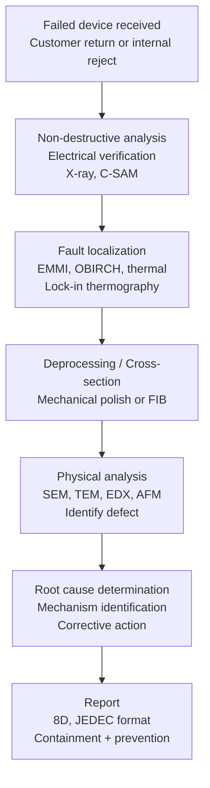
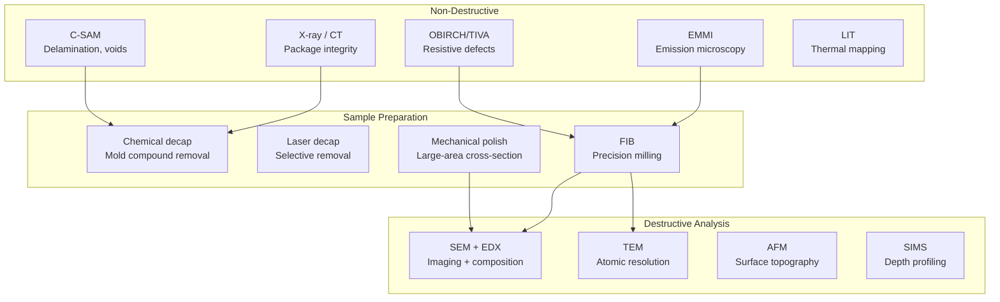
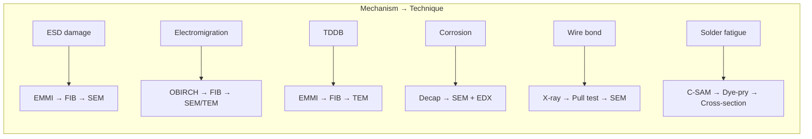

# Failure Analysis Techniques for Semiconductors

**Topic:** Semiconductor Failure Analysis Methods, Tools, and Workflow  
**Standards:** JEDEC JEP131 (FA Guideline), SEMI G85, AEC-Q001 (FA Requirements), JEDEC JESD22-B117 (Solder Joint FA)  
**SDO:** JEDEC, SEMI, AEC  
**Audience:** Failure analysis engineers, quality engineers, reliability engineers, semiconductor process engineers  
**Prerequisites:** Semiconductor device physics, IC packaging, materials science, reliability mechanisms

---

## Chapter 1 — Historical Context & Origin Story

### 1.1 Timeline

| Year | Event | Impact |
|------|-------|--------|
| 1960s | Optical microscopy for IC inspection | First FA tools |
| 1970s | SEM (Scanning Electron Microscope) for IC | Sub-micron defect imaging |
| 1980s | FIB (Focused Ion Beam) circuit edit | In-situ modification + cross-section |
| 1990s | Emission microscopy (photon, EMMI) | Non-destructive fault localization |
| 2000s | JEDEC JEP131 published | Standardized FA methodology |
| 2005 | AEC-Q001 Rev B | Automotive-specific FA requirements |
| 2010s | TEM for sub-10nm defects | Atomic-scale imaging |
| 2020s | AI/ML-assisted defect classification | Automated FA acceleration |

### 1.2 Why FA Is Critical for Automotive

| Driver | Impact |
|--------|--------|
| Zero-defect target | Must understand EVERY field failure to prevent recurrence |
| ISO 26262 compliance | Root cause required for systematic failure analysis |
| 8D reports | OEM requires formal corrective action with evidence |
| Process improvement | FA data drives yield improvement and screening optimization |
| Warranty cost reduction | Identifying dominant failure modes saves millions |

---

## Chapter 2 — Standard Architecture & Structure

### 2.1 FA Workflow (Standard Approach)



### 2.2 AEC-Q001 — FA Requirements for Automotive

| Requirement | AEC-Q001 Mandate |
|-------------|-----------------|
| FA turnaround time | < 30 calendar days (preliminary), < 60 days (final) |
| FA success rate | > 80% root cause identification rate |
| Report format | 8D (Eight Disciplines) |
| Containment | Within 24h of failure confirmation |
| Corrective action | Permanent fix with verification evidence |
| Escalation | If > 10 ppm or safety-related: immediate OEM notification |

---

## Chapter 3 — Technical Deep Dive

### 3.1 Non-Destructive Techniques

| Technique | What It Detects | Resolution | Destructive? |
|-----------|----------------|-----------|-------------|
| **X-ray (2D)** | Wire bond breaks, package cracks, voids | ~10 µm | No |
| **X-ray CT (3D)** | Internal 3D structure, solder voids, delamination | ~1 µm | No |
| **C-SAM (Acoustic)** | Delamination, die attach voids, package cracks | ~10 µm lateral | No |
| **EMMI (Emission)** | Hot spots, leakage, ESD damage, gate oxide defects | ~1 µm | No |
| **OBIRCH/TIVA** | Resistive defects, shorts, opens in metal lines | ~0.5 µm | No |
| **Lock-in Thermography** | Thermal hot spots, latch-up location, shorts | ~5 µm | No |
| **Time-Domain Reflectometry** | Open/short location in interconnect | ~50 µm | No |
| **Curve tracing** | I-V characteristics, junction behavior | N/A | No |

### 3.2 Fault Localization Techniques

**EMMI (Emission Microscopy):**
| Parameter | Details |
|-----------|---------|
| Principle | Detect photons emitted by hot carriers in silicon |
| Sensitivity | Single photon detection (InGaAs camera) |
| Application | Gate oxide leakage, ESD damage, latch-up, junction shorts |
| Limitation | Requires device powered; emission through backside for flip-chip |
| Resolution | ~1 µm (front-side), ~5 µm (backside through Si) |

**OBIRCH (Optical Beam Induced Resistance Change):**
| Parameter | Details |
|-----------|---------|
| Principle | Laser heats metal — resistance change detected in supply current |
| Application | Localize resistive opens/shorts in metal interconnects |
| Resolution | < 1 µm (limited by laser spot) |
| Advantage | Works on unpowered or powered device |
| Mode | Can detect voids in vias, thin spots in metal |

**Lock-in Thermography (LIT):**
| Parameter | Details |
|-----------|---------|
| Principle | Modulate bias, detect periodic thermal signal with IR camera |
| Sensitivity | < 100 µW power dissipation detectable |
| Application | Shorts (die-level), leakage sites, package defects |
| Advantage | Very fast survey of entire die/package |

### 3.3 Destructive Analysis Techniques

| Technique | Resolution | Application | Sample Prep |
|-----------|-----------|-------------|-------------|
| **FIB cross-section** | ~5 nm | Precise cross-section at defect site | FIB milling |
| **Mechanical cross-section** | ~0.5 µm | Large-area cross-section | Grinding + polishing |
| **SEM (Scanning Electron)** | 1-5 nm | Surface imaging, defect morphology | Decap + delayer |
| **TEM (Transmission Electron)** | < 0.1 nm (atomic) | Gate oxide thickness, crystal defects | FIB lift-out (thin lamella) |
| **EDX/EDS (Energy Dispersive X-ray)** | ~1 µm³ volume | Elemental composition (what material) | In SEM or TEM |
| **SIMS (Secondary Ion Mass Spec)** | ~50 nm lateral, monolayer depth | Dopant profiling, contamination | Sputtering |
| **AFM (Atomic Force Microscope)** | < 1 nm vertical | Surface roughness, step height | Minimal prep |
| **EBIC (Electron Beam Induced Current)** | ~100 nm | Junction mapping, defect location | Decap |
| **Photon Emission Microscopy (PEM)** | ~0.5 µm | Hot carrier sites, oxide defects | Backside thinning (flip-chip) |

### 3.4 Package-Level FA Techniques

| Technique | Application |
|-----------|------------|
| Decapsulation (chemical) | Remove mold compound to expose die (fuming HNO₃, H₂SO₄) |
| Decapsulation (laser) | Selective mold removal without die damage |
| Decapsulation (plasma) | Gentle removal for sensitive devices (MEMS) |
| Dye and pry | Apply dye to solder joints, separate → identify crack propagation |
| Cross-section (mechanical) | Grind and polish to expose wire bonds, die attach, solder |
| Wire bond pull/shear | Measure bond strength after environmental stress |
| Die shear | Measure die attach strength |

---

## Chapter 4 — Implementation Guide

### 4.1 FA Decision Tree

```mermaid
graph TB
    A[Failed device received] --> B{Electrical failure<br/>confirmed?}
    B -->|No| C[NTF - No Trouble Found<br/>Verify test conditions<br/>Check customer application]
    B -->|Yes| D{Failure type?}
    
    D -->|Short circuit| E[X-ray + C-SAM<br/>→ EMMI/LIT<br/>→ FIB cross-section]
    D -->|Open circuit| F[X-ray (wire bond?)<br/>→ OBIRCH<br/>→ Cross-section at open]
    D -->|Parametric drift| G[Curve trace<br/>→ EMMI (if leakage)<br/>→ Focused analysis]
    D -->|Functional failure| H[Scan chain debug<br/>→ EMMI<br/>→ Probing/FIB edit]
    
    E --> I[Root cause + 8D report]
    F --> I
    G --> I
    H --> I
```

### 4.2 Common Failure Modes and FA Approach

| Failure Mode | Symptom | Primary FA Technique | What to Look For |
|-------------|---------|---------------------|-----------------|
| Gate oxide breakdown | Igs leakage, Vth shift | EMMI → FIB cross-section → TEM | Oxide thinning, trap, TDDB crater |
| Electromigration | Open circuit, resistance increase | OBIRCH → FIB → SEM | Void in metal, hillock |
| ESD damage | Junction leakage, Igs increase | EMMI → cross-section | Melt filament, junction damage |
| Wire bond open | No connection (intermittent or permanent) | X-ray → bond pull → cross-section | Heel crack, lift-off, corrosion |
| Solder fatigue | Rth increase, intermittent | C-SAM → dye-and-pry → cross-section | Crack propagation in solder |
| Contamination | Leakage between lines, corrosion | EMMI → delayer → SEM/EDX | Foreign element (Na, Cl, K) |
| Latch-up damage | High current burn mark | LIT/EMMI → cross-section | Thermal damage in substrate |
| Particle defect | Random functional failure | Optical → SEM → EDX | Bridging particle between lines |
| Moisture corrosion | Resistance change, leakage | X-ray → decap → SEM/EDX | Al corrosion, Cu migration |

---

## Chapter 5 — Certification & Audit

### 5.1 8D Report Structure (Automotive FA Standard)

| Discipline | Content |
|-----------|---------|
| D0 | Emergency response / containment |
| D1 | Team formation (FA team members) |
| D2 | Problem description (symptom, quantity, lot, conditions) |
| D3 | Interim containment action (hold lots, sort, screen) |
| D4 | Root cause analysis (FA evidence, mechanism identification) |
| D5 | Corrective action (permanent fix — design, process, or material change) |
| D6 | Verification of corrective action (proof it works — data) |
| D7 | Prevention of recurrence (systemic changes — design rules, FMEA update) |
| D8 | Closure (customer acceptance, lessons learned) |

---

## Chapter 6 — Regional & Domain Variants

### 6.1 FA Capability Requirements by Application

| Industry | FA Depth Required | Typical Turnaround | Success Rate Target |
|----------|------------------|-------------------|---------------------|
| Automotive (OEM) | Full physical root cause | 30 days | > 80% |
| Automotive (safety-critical) | Full + mechanism confirmation | 15 days (preliminary) | > 90% |
| Space/Military | Full + DPA (Destructive Physical Analysis) | 60 days | > 95% |
| Consumer | Often limited (cost vs. benefit) | 45 days | > 60% |
| Medical | Full + regulatory documentation | 30 days | > 85% |

---

## Chapter 7 — Comparison: FA Techniques by Scale

| Feature Size | Primary Tools | Challenge |
|-------------|---------------|-----------|
| > 1 µm (legacy) | Optical, SEM, mechanical cross-section | Easy — well-established |
| 100nm - 1µm | SEM, FIB, EMMI | Standard modern FA |
| 10nm - 100nm | FIB + TEM, high-res SEM | Precise sample prep critical |
| < 10nm (FinFET, GAA) | TEM (aberration-corrected), atom probe | Extremely difficult sample prep |
| 3D stacking (TSV) | X-ray CT, multi-level FIB | Access to buried defects |

---

## Chapter 8 — Mermaid Architecture Diagrams

### 8.1 FA Lab Equipment Ecosystem



### 8.2 Failure Mechanism vs. FA Technique Matrix



---

## Chapter 9 — Case Studies & Failure Analysis

### 9.1 Automotive MCU Field Return — Intermittent Reset

**Problem:** 15 ppm of automotive MCUs exhibited intermittent reset in field after 18 months. Power-on reset triggered without external cause.

**FA workflow:**
1. **Electrical verification:** Confirmed: device resets when supply drops below POR threshold (2.7V). Supply was stable → internal voltage droop suspected.
2. **Non-destructive:** C-SAM — no delamination. X-ray — wire bonds intact.
3. **Emission microscopy:** Under bias: faint emission at a specific via in power distribution network.
4. **OBIRCH:** Confirmed high resistance at that via location.
5. **FIB cross-section at via:** Revealed electromigration void in Via-2 (top of via), 70% blocked.
6. **TEM:** Copper grain boundary diffusion caused void — current density at that via was 2× design rule limit.

**Root cause:** Design error — current density calculation missed this particular via because it was shared between two power domains (double the expected current).

**Corrective action:** Added redundant vias at the location (3× via array instead of single via), updated DRC rule to check shared-domain via current.

### 9.2 ESD Damage — Latent Failure

**Problem:** Batch of ICs passed all production tests but showed gate leakage failures after 3 months in field. Failure rate: 200 ppm (catastrophic for automotive).

**FA workflow:**
1. **Curve trace:** Elevated gate leakage (Igs = 100nA, spec < 1nA) on specific I/O pin.
2. **EMMI:** Emission spot at the I/O ESD protection diode — indicating damaged junction.
3. **FIB cross-section:** Found melted silicon filament between N+ diffusion and P-well — characteristic ESD damage signature.
4. **Lot trace:** All failures from same production week. Investigated handling.
5. **Found:** Pick-and-place machine ionizer was offline for maintenance during that week → devices charged to 500V+ → CDM damage during placement.
6. **Damage was LATENT:** Device initially functioned (leakage was 5nA, within spec). But damage progressed under field bias (positive feedback: leakage → heating → more leakage).

**Corrective action:**
- Added real-time ionizer monitoring (alarm for any downtime > 5 minutes)
- Added IDDQ (quiescent current) screen to production test (catches latent ESD: marginal leakage at sensitive supply)
- Recalled and screened affected lot (found 0.5% with elevated Igs → prevented field failures)

---

## Chapter 10 — Future Evolution & Industry Trends

| Trend | Impact on FA |
|-------|-------------|
| Sub-5nm technology (FinFET, GAA) | FA at atomic scale — need aberration-corrected TEM |
| 3D stacking (chiplets, HBM) | Access to buried defects extremely difficult |
| AI/ML defect classification | Automated SEM image analysis, pattern recognition |
| In-line (production) FA | Move FA earlier — find defects at wafer level |
| Non-destructive 3D imaging (nano-CT) | Eliminate need for cross-sectioning |
| Atom probe tomography | 3D elemental mapping at atomic scale |
| Correlative microscopy | Link optical + SEM + TEM on same defect site |
| Big data (FA + yield + process) | Predictive failure analysis from manufacturing data |

---

## Chapter 11 — Interview Questions & Career Guide

### Tier 1: Entry-Level (0-3 years)

**Q1:** Describe the general workflow for failure analysis of a returned automotive IC.  
**A:** **(1) Receiving and documentation:** Log device with customer complaint information (symptom, application conditions, lot code, failure timeline). Photograph external condition. **(2) Electrical verification:** Reproduce the failure at the FA lab. Measure: supply current (IDD), functional test, parametric test. Confirm the device actually fails. (20-30% of returns are NTF — No Trouble Found.) **(3) Non-destructive analysis:** X-ray: check wire bonds, package cracks, die position. C-SAM: check for delamination at die attach, lead frame. Lock-in thermography / EMMI: if electrical anomaly confirmed, localize the defect. **(4) Fault localization:** Use EMMI (for leakage/ESD), OBIRCH (for opens/resistance), or probing (for logic failures) to pinpoint defect location. **(5) Destructive analysis:** Decapsulate (remove package material). Optical inspection of die surface. FIB cross-section at the localized defect. SEM/TEM imaging to identify physical defect. **(6) Root cause and reporting:** Identify failure mechanism (EM, TDDB, ESD, contamination, etc.). Determine root cause (design, process, application, handling). Write 8D report with corrective action.

### Tier 2: Mid-Level (3-8 years)

**Q2:** You receive 5 failed automotive ICs with the same symptom: Vth shifted by +300mV on all NMOS devices. Propose the FA approach and most likely root cause.  
**A:** **(1) Observations:** All NMOS Vth shifted positive (+300mV) → suggests negative charge trapped in gate dielectric or at interface. All devices from same lot. Consistent shift (not random) suggests systematic mechanism, not random defect. **(2) Most likely mechanisms:** NBTI (Negative Bias Temperature Instability): affects PMOS primarily (negative Vth shift on PMOS), NOT NMOS. Rule out. PBTI (Positive Bias Temperature Instability): affects NMOS under positive gate bias → interface traps → positive Vth shift. YES, this matches! Hot Carrier Injection (HCI): affects NMOS → interface damage → Vth shift. Possible but typically logarithmic (slow), not 300mV sudden. Contamination (mobile ions): Na⁺/K⁺ under gate → screen charge → Vth shift. Possible if batch-specific. **(3) FA approach:** Electrical: confirm Vth shift at all temperatures (-40, 25, 125°C). If shift is temp-independent → fixed charge (contamination). If shift reduces at high temp → trapped charge (PBTI recoverable). Gate oxide analysis: FIB cross-section of NMOS gate → TEM for oxide quality. SIMS: check for Na, K, Fe contamination in gate oxide. Compare to reference (good device from different lot): same fab location? **(4) Most likely root cause:** If from same lot + systematic: contamination event during gate oxide deposition (Na mobile ions). Contamination source: furnace tube contamination, wafer handling, chemical purity. Corrective action: clean furnace, tighten chemical purity spec, add IDDQ/Vth monitor at wafer level.

### Tier 3: Senior/Lead (8-15 years)

**Q3:** As FA lab manager, an OEM escalates: 50 ppm field failure rate on your flagship automotive SoC, 6 months after production start. You have 20 returned units. Design the FA campaign to identify root cause within 2 weeks.  
**A:** 50 ppm is a CRISIS for automotive. 20 units gives statistical significance. **(1) Triage (Day 1-2):** Electrical characterization of all 20 units: categorize failure modes. Expected: most will cluster into 1-2 dominant mechanisms. Likely result: 15 same failure mode (dominant), 5 others (random). Focus on the 15. **(2) Non-destructive survey (Day 2-4):** All 20: X-ray + C-SAM (quick survey for gross defects). 5 of the 15 dominant-mode devices: EMMI + OBIRCH (localize fault). Expected outcome: consistent defect location → systematic issue. **(3) Focused destructive (Day 4-8):** 3 devices: FIB cross-section at defect location → SEM/TEM. 2 reference (good) devices: same cross-section for comparison. Expected: physical defect visible (void, crack, contamination, oxide defect). **(4) Root cause identification (Day 8-10):** Identify mechanism: process defect? design marginality? application overstress? Lot analysis: all 20 from same wafer lot? same fab? Correlation with process data: check SPC charts for anomaly during that lot. **(5) Immediate containment (Day 1 in parallel):** Identify all lots with same process conditions. Apply screening test (if possible — IDDQ, elevated-voltage stress, etc.). Hold suspect inventory pending FA result. Notify OEM of status. **(6) Corrective action + verification (Day 10-14):** Define process fix or design change. Verify fix: stress test on new lot → confirm defect eliminated. Present 8D to OEM with evidence. **(7) Lab resource allocation:** Dedicate 3 FA engineers full-time. Reserve equipment: SEM + FIB + TEM have priority scheduling. Parallel track: lot genealogy analysis by quality team.

---

## Chapter 12 — Cheat Sheet & Quick Reference

### FA Technique Selection Guide

```
Symptom: Short circuit (high IDD)
  → LIT or EMMI (find hot spot) → FIB cross-section → SEM

Symptom: Open circuit (pin not responding)
  → X-ray (bond wire?) → OBIRCH (metal open?) → FIB → SEM

Symptom: Leakage (elevated Igs or Ids_off)
  → EMMI (find emission) → FIB at emission → TEM (gate oxide)

Symptom: Parametric drift (Vth, gain, speed)
  → Electrical characterization → TEM (interface) → SIMS (contamination)

Symptom: Intermittent
  → Temperature cycling during test → OBIRCH (resistance change) → Cross-section

Symptom: Package failure
  → C-SAM (delamination) → X-ray (bond wire) → Dye-pry (solder)
```

### FA Equipment Quick Reference

```
Non-destructive:
  X-ray (2D/3D CT):  Package, bonds, solder voids — ~10µm resolution
  C-SAM:             Delamination, die attach voids — ~10µm
  EMMI:              Hot spots, leakage, ESD — ~1µm
  OBIRCH/TIVA:       Metal opens/shorts — ~0.5µm
  LIT:               Thermal mapping — ~5µm

Sample prep:
  Chemical decap:    H₂SO₄ or HNO₃ — bulk mold removal
  Laser decap:       Selective, non-invasive — for sensitive die
  FIB:               Precision cross-section — nm accuracy

Analysis:
  SEM + EDX:         Imaging + elemental ID — nm resolution
  TEM:               Atomic structure — sub-Å
  SIMS:              Depth profiling, contamination — ppb sensitivity
  AFM:               Surface roughness — nm vertical resolution
```

---

*End of Document — 13_Failure_Analysis_Techniques.md*
