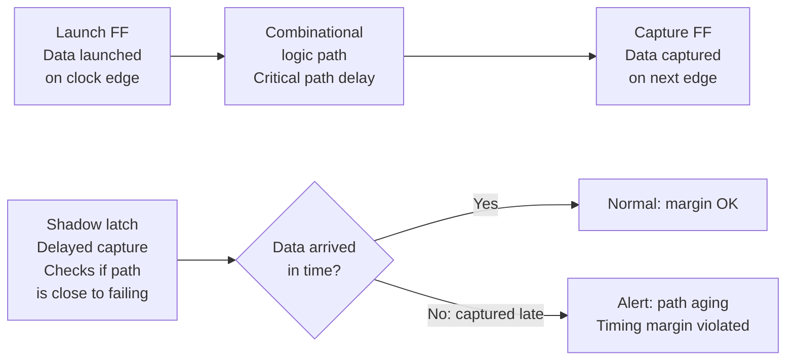
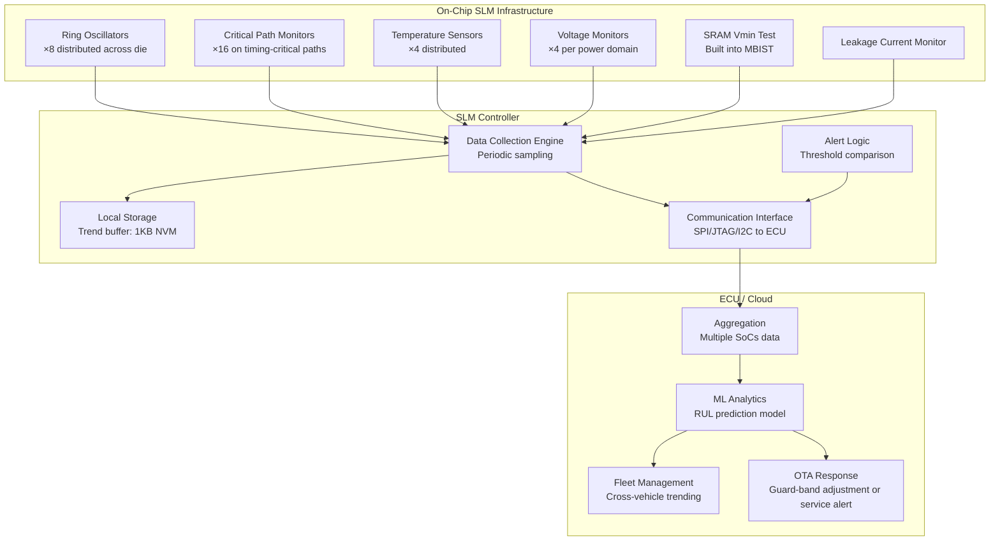
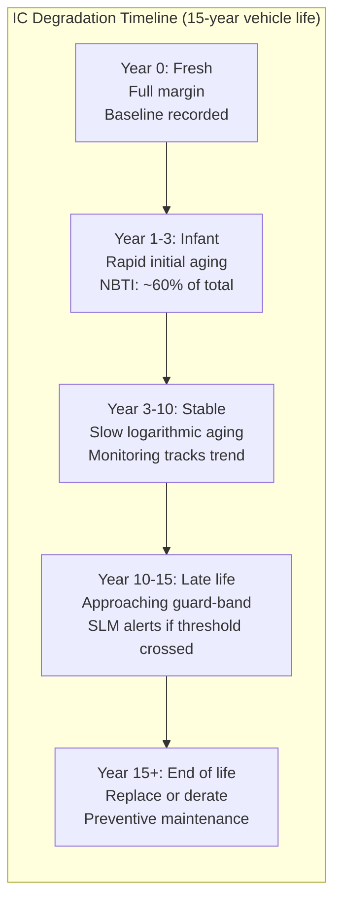
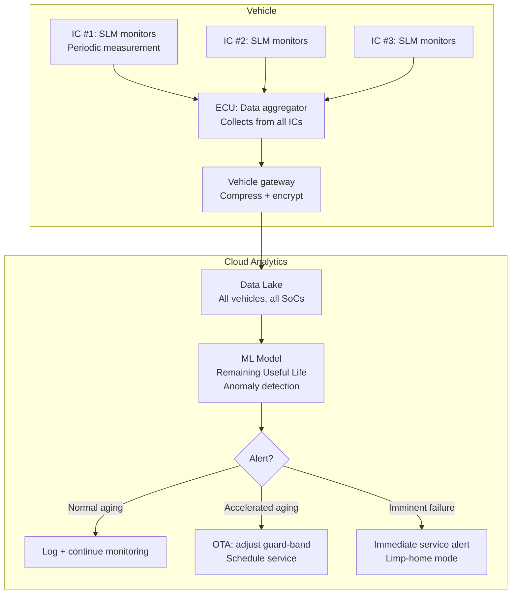

# Silicon Lifecycle Management (SLM)

**Topic:** Silicon Lifecycle Management — In-Field Monitoring, Degradation Tracking, and Predictive Maintenance for ICs  
**Standards:** ISO 26262 Part 11 (Semiconductor-Specific), JEDEC JEP001 (Foundry Process Qualification), IEEE P2851 (SLM Standard), JEDEC JEP180  
**SDO:** IEEE, JEDEC, ISO  
**Audience:** Semiconductor reliability engineers, automotive system architects, IC design engineers, safety engineers  
**Prerequisites:** IC reliability mechanisms, CMOS degradation physics, ISO 26262 concepts, on-chip monitoring fundamentals

---

## Chapter 1 — Historical Context & Origin Story

### 1.1 Timeline

| Year | Event | Impact |
|------|-------|--------|
| 2000s | On-chip ring oscillators for process monitoring | First in-silicon health indicators |
| 2010 | ISO 26262 published (Part 11: Semiconductors) | Mandatory HW safety metrics for automotive ICs |
| 2015 | Industry shift toward "smart" ICs with self-test | Built-in self-test (BIST) beyond manufacturing |
| 2018 | IEEE P2851 working group formed | First standard specifically for SLM |
| 2019 | Synopsys Silicon Lifecycle Management platform | Commercial SLM IP available |
| 2020 | JEDEC JEP180 (In-System Test) | JEDEC acknowledges in-field monitoring |
| 2022 | IEEE 2851-2023 approved | First published SLM standard |
| 2023-24 | Major foundries (TSMC, Samsung) offer SLM IP | SLM becomes standard automotive offering |

### 1.2 Why SLM Emerged

| Driver | Challenge | SLM Solution |
|--------|-----------|--------------|
| Autonomous driving (ASIL D) | PMHF < 10⁻⁸/h requires continuous monitoring | In-field degradation detection |
| Extended vehicle lifetime (15+ years) | IC wear-out may occur within vehicle life | Predictive remaining useful life (RUL) |
| Zero-defect requirements | Post-manufacturing latent defects | In-system test catches escapes |
| Advanced nodes (7nm, 5nm, 3nm) | Higher variability, faster degradation | Continuous process characterization |
| V2X and OTA updates | IC operates in varying conditions | Real-time stress tracking |
| Functional safety (ISO 26262) | Diagnostic coverage during operation | Online safety mechanisms |

---

## Chapter 2 — Standard Architecture & Structure

### 2.1 SLM Framework (IEEE 2851)

```mermaid
graph TB
    subgraph "Silicon Lifecycle Phases"
        A[Design & Verification<br/>DfT, monitors, IP selection] --> B[Manufacturing<br/>Wafer test, sort, characterization]
        B --> C[Package & Assembly<br/>Final test, burn-in]
        C --> D[In-System Test<br/>Board-level, integration test]
        D --> E[In-Field Operation<br/>Mission mode monitoring]
        E --> F[End of Life<br/>Degradation, replacement decision]
    end
    
    subgraph "SLM Data Flow"
        G[On-chip sensors<br/>Ring oscillators<br/>Voltage monitors<br/>Temperature sensors] --> H[SLM controller<br/>Collects, processes,<br/>stores sensor data]
        H --> I[Off-chip analytics<br/>Cloud/ECU aggregation<br/>ML models<br/>RUL prediction]
    end
```



### 2.2 IEEE 2851 Scope

| Aspect | Coverage |
|--------|----------|
| On-chip monitors | Path delay monitors, ring oscillators, leakage sensors, voltage droops |
| Data infrastructure | Sensor interfaces, data collection, compression, communication |
| Analytics | Degradation modeling, anomaly detection, remaining useful life |
| Security | Authenticated access, tamper detection, data integrity |
| Applications | Manufacturing yield, in-field safety, predictive maintenance, counterfeit detection |

---

## Chapter 3 — Technical Deep Dive

### 3.1 On-Chip Monitoring IP Blocks

| Monitor Type | What It Measures | Degradation Mechanism Detected |
|-------------|-----------------|-------------------------------|
| **Ring Oscillator (RO)** | Frequency (gate delay) | NBTI, HCI, PBTI (Vth shift → slower) |
| **Critical Path Monitor** | Timing margin | All aging (shows when paths approach failure) |
| **Voltage Droop Detector** | Supply voltage transients | IR drop, PDN integrity, decoupling degradation |
| **Temperature Sensor** | Junction temperature | Thermal stress tracking |
| **Leakage Monitor** | Off-state current | Gate oxide degradation (TDDB onset) |
| **SRAM Stability** | SRAM Vmin (minimum voltage) | NBTI/PBTI (most sensitive indicator) |
| **PLL Jitter Monitor** | Clock jitter | Aging of PLL components |
| **I/O Eye Diagram** | Signal integrity | Interconnect degradation |

### 3.2 Ring Oscillator Aging Monitor (Detailed)

**Principle:** Ring oscillator frequency is directly proportional to transistor speed. As NBTI/HCI/PBTI degrade transistors, frequency decreases.

$$\Delta f_{RO} / f_{RO} \approx -\Delta V_{th} / (V_{DD} - V_{th})$$

**Implementation:**
- Place multiple ROs (NMOS-stressed, PMOS-stressed, reference)
- Measure frequency periodically (e.g., every power-on or every 1000 operating hours)
- Compare to baseline (initial frequency from production test)
- Trend the degradation over time

**Typical automotive aging budget:**
| Parameter | Fresh | End of Life (15 years) | Alert Threshold |
|-----------|-------|----------------------|-----------------|
| RO frequency | 1000 MHz | 920 MHz (-8%) | 950 MHz (-5%, trigger warning) |
| Vth shift (PMOS) | 0 mV | +50 mV | +35 mV |
| Timing margin | +10% | -2% (guard-banded) | +2% (alert: margin shrinking) |

### 3.3 Critical Path Monitoring



**In-field timing margin measurement:**
- Shadow path (slightly delayed clock) captures data
- If shadow path captures different data than main path → timing violation imminent
- Can detect aging BEFORE functional failure occurs

### 3.4 SRAM as Aging Canary

SRAM cells are the most sensitive structures on a chip (minimum geometry, balanced design):
- SRAM bit cells use minimum-size transistors → most affected by Vth variation
- **Vmin tracking:** periodically lower SRAM supply voltage until first bit fails
- Rising Vmin over time = measurable degradation signal
- SRAM fails BEFORE logic paths → early warning system

| SRAM Metric | Interpretation |
|-------------|---------------|
| Vmin increase of 20 mV/year | Normal aging rate |
| Vmin increase of 50+ mV/year | Excessive aging — investigate thermal/voltage conditions |
| Sudden Vmin jump (50+ mV) | Possible defect activation — alert |
| Vmin approaching operational Vdd - 10% | End-of-life approaching — plan replacement |

### 3.5 ISO 26262 Part 11 — Semiconductor Safety Requirements

| Clause | Topic | SLM Relevance |
|--------|-------|---------------|
| 11.4.2 | Hardware architectural metrics | FIT rates feed from SLM monitoring |
| 11.4.3 | Evaluation of safety goal violations | In-field monitoring detects degradation |
| 11.4.4 | Systematic capabilities | Design + verification + SLM infrastructure |
| 11.4.5 | Dependent failures | Common cause analysis for on-chip monitors |
| 11.4.6 | Safety mechanisms | Online diagnostic = SLM capability |
| 11.4.7 | IC-specific failure modes | Aging mechanisms tracked by SLM |

---

## Chapter 4 — Implementation Guide

### 4.1 SLM Architecture for Automotive SoC



### 4.2 SLM Implementation Steps

| Phase | Activity | Deliverable |
|-------|----------|-------------|
| 1. Design | Select monitor IP, placement, coverage analysis | SLM architecture spec |
| 2. Integration | Connect monitors to SLM controller, define sampling rate | RTL integration |
| 3. Characterization | Silicon characterization: baseline + accelerated aging | Aging model coefficients |
| 4. Production test | Record baseline values per device (fingerprint) | Stored in OTP/NVM |
| 5. In-field deployment | Periodic measurement + comparison to baseline | Health reports to ECU |
| 6. Analytics | Fleet-wide trending, ML model training | RUL predictions |

### 4.3 Sampling Strategy

| Monitor Type | Sampling Rate | Data Volume | Justification |
|-------------|--------------|-------------|---------------|
| Ring oscillator frequency | Every power-on + every 100h | 16 bytes/sample | Primary aging indicator |
| Critical path margin | Every 1000h | 32 bytes/sample | Timing health check |
| Temperature (max recorded) | Continuous (peak hold) | 4 bytes/interval | Stress tracking |
| SRAM Vmin | Every service interval (annual) | 64 bytes | Requires dedicated test mode |
| Voltage droop events | Event-triggered | Variable | Anomaly detection |

---

## Chapter 5 — Certification & Audit

### 5.1 Safety Case for SLM (ISO 26262)

| Safety Argument | Evidence |
|----------------|----------|
| SLM monitors detect aging before failure | Accelerated aging test → monitors trigger alert before functional failure |
| Monitor coverage is sufficient | FMEDA shows monitors cover > X% of aging failure modes |
| SLM does not introduce new failure modes | Analysis: SLM IP is non-interfering (separate power, clock, reset) |
| SLM data is trustworthy | ECC on stored data, CRC on communication, redundant sensors |
| Alert response is adequate | System reaction time < fault tolerant time interval (FTTI) |

### 5.2 Diagnostic Coverage from SLM

| Monitor | Failure Modes Detected | Diagnostic Coverage |
|---------|----------------------|-------------------|
| Ring oscillator | Vth drift, mobility degradation | 60% of logic aging failures |
| Critical path monitor | All timing-related degradation | 90% of timing failures (if placed on critical paths) |
| SRAM Vmin | NBTI, PBTI, read stability degradation | 80% of SRAM aging |
| Voltage monitor | PDN degradation, regulator failure | 70% of power-related failures |
| Temperature sensor | Over-temperature events | 95% of thermal stress events |

---

## Chapter 6 — Regional & Domain Variants

### 6.1 SLM Adoption by Domain

| Domain | SLM Maturity | Driver | Typical Monitors |
|--------|-------------|--------|-----------------|
| Automotive (ADAS/AD) | High (mandatory for ASIL C/D) | ISO 26262, zero-defect | Full SLM suite |
| Automotive (body/infotainment) | Medium | Cost-driven reliability | Basic (temp + voltage) |
| Data center (HPC) | High | Uptime SLA, predictive maintenance | Full + thermal management |
| Aerospace/Defense | Medium-High | Mission reliability | Custom radiation-hardened monitors |
| Industrial | Medium | Equipment uptime | Temperature + lifetime counters |
| Consumer | Low | Not cost-justified | Minimal (thermal throttling only) |
| Medical (implantable) | High | Patient safety | Battery + degradation monitors |

---

## Chapter 7 — Comparison: SLM Approaches

| Approach | Pros | Cons | Best For |
|----------|------|------|----------|
| Ring oscillator array | Simple, well-understood, small area | Only measures average aging, not specific path | General aging tracking |
| Critical path replica | Directly measures actual timing margin | Area overhead, may not cover all paths | Timing-critical designs |
| SRAM canary | Most sensitive, early warning | Requires dedicated test mode (disruptive) | High-reliability applications |
| Embedded sensors (temp, voltage) | Continuous, non-invasive | Indirect — doesn't measure aging directly | Stress tracking + analytics |
| In-system LBIST (Logic BIST) | Tests actual functionality | Test time required, coverage depends on patterns | Manufacturing escape detection |
| ML-based prediction | Can predict future from trends | Requires training data, model accuracy varies | Fleet-scale analytics |

---

## Chapter 8 — Mermaid Architecture Diagrams

### 8.1 Degradation Over Vehicle Lifetime



### 8.2 SLM Data Flow — Vehicle to Cloud



---

## Chapter 9 — Case Studies & Failure Analysis

### 9.1 SLM Prevents Field Failure in ADAS Processor

**Scenario:** Fleet of 100,000 vehicles with ADAS SoC (7nm, ASIL D). SLM infrastructure: 12 ring oscillators, 24 critical path monitors, 4 temperature sensors.

**Event at Month 18:**
- Cloud analytics detects: 200 vehicles show ring oscillator degradation 3× faster than fleet average
- All 200 vehicles from same geographic region (hot climate: average ambient 45°C vs. 25°C fleet average)
- Critical path monitor shows timing margin reduced from +12% to +4% (normal fleet: still at +9%)

**Response:**
1. **Immediate:** OTA update reduces clock frequency by 5% for affected vehicles (increases timing margin from +4% to +9%)
2. **Investigation:** Junction temperature data shows these SoCs operating at 125°C (vs. 105°C fleet average) — thermal solution marginal in hot climate
3. **Long-term fix:** Thermal paste replacement at next service (improves thermal path, reduces Tj by 15°C)
4. **After fix:** Aging rate returns to normal, no functional failures occurred

**Impact:** Without SLM, these 200 SoCs would have experienced timing failures around Month 24-30. With SLM, proactive intervention prevented ALL field failures (0 safety incidents).

### 9.2 Manufacturing Escape Detection via In-System Test

**Scenario:** Automotive MCU production: 1 million units shipped. SLM includes LBIST (Logic Built-In Self-Test) that runs during vehicle initialization (2-second boot sequence).

**Event at Month 6:**
- 15 units trigger LBIST failure during vehicle start → ECU enters safe state, driver warned
- Failure mode: specific logic block fails LBIST pattern (same block in all 15 units)
- Analysis: all 15 from same wafer lot → process defect escaped production test

**Investigation:**
- Production test missed defect because specific test pattern doesn't cover this corner
- In-system LBIST uses different (longer) pattern set → catches it
- Defect: marginal via resistance that degraded slightly in field → now fails at cold temperature

**Corrective action:**
- Added test pattern to production test (prevents future escapes)
- Screened remaining inventory from that lot (found 8 more marginal units)
- LBIST caught the problem SAFELY (before any function was relied upon by driver)

---

## Chapter 10 — Future Evolution & Industry Trends

| Trend | Timeline | Impact |
|-------|----------|--------|
| IEEE 2851 mandatory for ASIL D | 2025-2027 | SLM becomes design requirement |
| Digital twin per IC instance | 2025-2030 | Physics model + real sensor data → precise RUL |
| Cross-domain SLM (IC + board + system) | 2026-2028 | Holistic vehicle health prediction |
| SLM for chiplet architectures | 2025-2027 | Monitor inter-chiplet interfaces |
| Federated learning (fleet-wide) | 2025-2028 | ML models improve without sharing raw data |
| SLM integrated into AUTOSAR | 2026+ | Standard software API for SLM data |
| Quantum-aware aging models | 2028+ | Sub-3nm: quantum effects in degradation modeling |
| SLM as cybersecurity sensor | 2025+ | Detect hardware trojans, counterfeit, tampering via fingerprint drift |

---

## Chapter 11 — Interview Questions & Career Guide

### Tier 1: Entry-Level (0-3 years)

**Q1:** What is Silicon Lifecycle Management (SLM) and why is it important for automotive semiconductors?  
**A:** SLM is a methodology for monitoring the health and degradation of integrated circuits throughout their operational lifetime — from manufacturing through in-field use to end-of-life. For automotive, it's critical because: **(1) Long lifetime:** Automotive ICs must operate for 15+ years. Degradation mechanisms (NBTI, HCI, EM, TDDB) accumulate over time. SLM tracks this degradation. **(2) Safety (ISO 26262):** ASIL D requires < 10⁻⁸/h dangerous failure probability. SLM provides ONLINE diagnostic coverage — detecting degradation BEFORE it causes a safety failure. **(3) Zero-defect target:** Some manufacturing defects are latent (escape production test but activate in field). SLM can run in-system tests during vehicle boot to catch these. **(4) Predictive maintenance:** Instead of time-based replacement (wasteful) or failure-based replacement (dangerous), SLM enables condition-based maintenance: replace only when the IC shows signs of degradation approaching end-of-life. **Key SLM monitors:** Ring oscillators (aging speed), critical path monitors (timing margin), temperature sensors, voltage monitors, SRAM stability (aging canary).

### Tier 2: Mid-Level (3-8 years)

**Q2:** How does ring oscillator frequency degradation correlate with device aging, and what are the limitations of using RO as the sole aging indicator?  
**A:** **Correlation:** Ring oscillator frequency is determined by: $f_{RO} = 1/(2 \cdot N \cdot t_{pd})$ where $t_{pd}$ = gate delay = $C_{load} \cdot V_{DD} / I_{drive}$. Aging (NBTI, PBTI, HCI) increases Vth → reduces Idrive → increases tpd → decreases fRO. Typical relationship: $\Delta f/f \approx -\Delta V_{th}/(V_{DD} - V_{th})$. For automotive 15-year life: expect 5-10% frequency degradation (at 16nm/7nm nodes, 105°C mission profile). **Advantages:** Simple to implement (small area: ~100 gates), well-understood physics, directly proportional to transistor aging, can be measured in nanoseconds (non-disruptive). **Limitations:** **(1)** RO measures AVERAGE aging of its transistors — doesn't tell you about SPECIFIC critical paths that may age differently (due to different switching activity, duty cycle, input patterns). **(2)** RO is typically always-on during measurement — different stress pattern than actual logic (which has variable activity). May over- or under-predict actual circuit aging. **(3)** RO doesn't detect INTERCONNECT aging (electromigration in metal lines, via voiding). Only transistor aging is captured. **(4)** RO placement matters — an RO in a cool corner of the die may not represent the hot-spot aging. Need multiple ROs distributed across die. **(5)** Recovery effects: NBTI partially recovers when stress is removed. RO may measure during recovery phase → under-reports actual degradation. **Best practice:** Use RO as primary indicator BUT supplement with critical path monitors (catches path-specific aging) and voltage/thermal monitors (catch non-transistor effects).

### Tier 3: Senior/Lead (8-15 years)

**Q3:** Design the SLM strategy for an ASIL D autonomous driving SoC that must demonstrate 15-year reliable operation. Address monitor selection, coverage analysis, data management, and safety argumentation.  
**A:** **(1) Monitor selection for ASIL D SoC:** Logic aging: 16× ring oscillators (4 types: NMOS/PMOS stressed, inverter, NAND — distributed across 4 die quadrants). Critical paths: 32× path delay monitors on identified timing-critical paths (from STA: paths with < 15% margin). Memory: SRAM Vmin test (integrated into MBIST, runs at boot + periodically). Interconnect: 4× resistive chain monitors (long metal segments as proxy for EM susceptibility). Power: 8× voltage droop detectors (one per power domain). Thermal: 6× distributed temperature sensors (PVT: process, voltage, temperature). Supply current: 1× total IDDQ monitor (leakage health). Clock: PLL lock detector + jitter monitor. **(2) Coverage analysis (FMEDA integration):** Map each monitor to failure modes it detects: RO → Vth degradation → covers 60% of logic random failure modes. Path monitor → timing failures → covers 90% of timing-critical failures. SRAM Vmin → memory aging → covers 80% of SRAM failures. Combined diagnostic coverage from SLM: ~70% of total HW random failures. Remaining uncovered → hardware redundancy (lockstep, ECC, voter). **(3) Data management architecture:** On-chip: SLM controller with 2KB NVM for trend storage (128 data points × 16 bytes). Per device: stores aging trajectory (baseline + periodic samples). Communication: via SPI to ECU, encrypted + authenticated (no tampering). ECU: aggregates SLM data from all ICs, compresses, sends to cloud monthly. Cloud: fleet-wide ML model (trained on accelerated aging characterization + early fleet data). **(4) Safety argumentation (ISO 26262 Part 11):** Claim: SLM provides online safety mechanism for age-related degradation. Evidence: Accelerated aging silicon test shows: RO frequency drops 5% BEFORE any functional failure occurs (margin: 2-3 years of additional aging before failure). Confirmed on 100+ devices under accelerated stress. Independence: SLM monitors have separate power domain, clock, and reset from main function (no dependent failure with monitored function). Failure of SLM itself: detected by periodic self-test of monitors (inject known signal, verify measurement). FTTI: Degradation occurs over months/years → SLM measurement interval (100h) is << degradation time constant → adequate detection before failure.

---

## Chapter 12 — Cheat Sheet & Quick Reference

### SLM Monitor Summary

```
Monitor             | Detects                    | Area    | Non-invasive?
Ring Oscillator     | Vth aging (NBTI/HCI/PBTI)  | Tiny    | Yes
Critical Path       | Actual timing margin       | Medium  | Yes (in-mission)
SRAM Vmin           | Most sensitive aging       | None*   | Requires test mode
Voltage Droop       | PDN integrity              | Small   | Yes
Temperature         | Thermal stress             | Small   | Yes
Leakage Current     | Gate oxide health          | Small   | Yes
LBIST               | Manufacturing escapes      | Medium  | Requires boot time

* Uses existing SRAM + MBIST infrastructure
```

### Typical Aging Budgets (Automotive, 15-year life, 105°C Tj)

```
Ring oscillator frequency: -5% to -10% over life
PMOS Vth shift (NBTI):    +30 to +80 mV
NMOS Vth shift (PBTI):    +10 to +30 mV (less than PMOS)
SRAM Vmin increase:        +50 to +100 mV
Critical path margin loss: -5% to -12%
Metal EM (at design rules): No degradation (designed for > 20 years)
```

### SLM Alert Thresholds (Example)

```
Level 0 (Normal):    Aging within expected trajectory (±20%)
Level 1 (Watch):     Aging 1.5× faster than nominal → increase monitoring frequency
Level 2 (Warning):   Aging 3× faster OR margin < 5% → OTA derating (reduce freq/voltage)
Level 3 (Critical):  Margin < 2% OR sudden anomaly → schedule immediate service
Level 4 (Failure):   Functional failure detected → safe state + service required
```

---

*End of Document — 14_Silicon_Lifecycle_Management.md*
