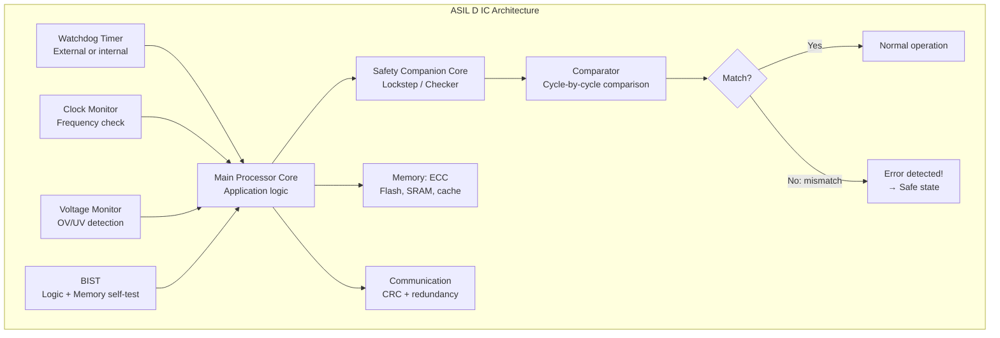
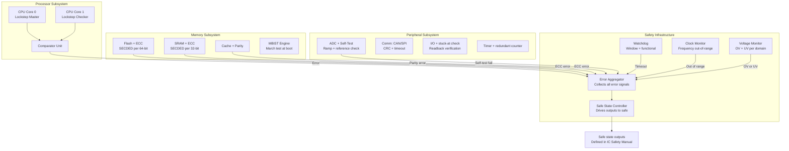
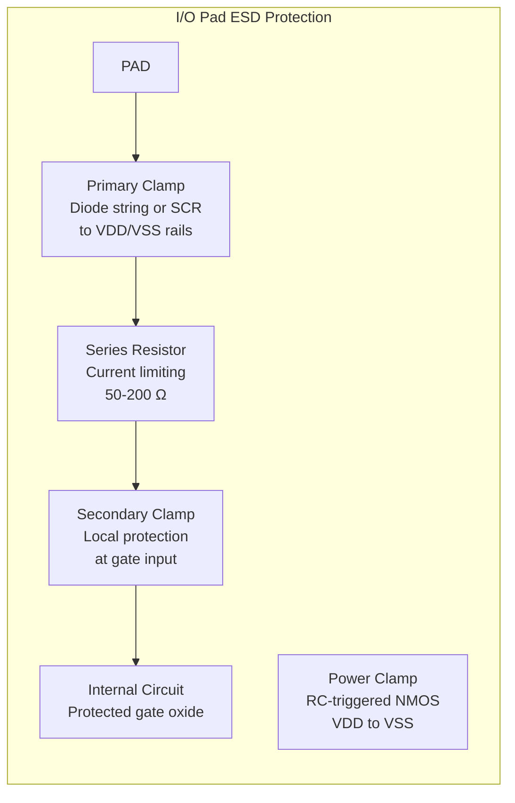

# Automotive-Grade IC Design (Design for Reliability)

**Topic:** Design for Reliability (DfR) in Automotive Integrated Circuits — Circuit Techniques, Redundancy, Self-Test, and Diagnostic Coverage  
**Standards:** ISO 26262 Part 5 (HW Design), Part 11 (Semiconductors), AEC-Q100 Grade 0-3 Design Requirements, JEDEC JEP122H (Reliability Models)  
**SDO:** ISO, AEC, JEDEC, SAE  
**Audience:** IC design engineers, automotive system architects, reliability engineers, functional safety engineers  
**Prerequisites:** CMOS circuit design, digital/analog design, semiconductor physics, ISO 26262 concepts, verification methodology

---

## Chapter 1 — Historical Context & Origin Story

### 1.1 Timeline

| Year | Event | Impact |
|------|-------|--------|
| 1980s | MIL-STD-883 drives hi-rel design | Military reliability design principles established |
| 1994 | AEC founded (Chrysler, Ford, GM, Delco) | Automotive-specific qualification requirements |
| 1998 | AEC-Q100 Rev A | First automotive IC qualification standard |
| 2004 | ISO 26262 Part 5 draft | Hardware design for functional safety |
| 2011 | ISO 26262 published | Safety integrity levels mandate design techniques |
| 2015 | ASIL D SoCs for ADAS emerge | Complex ICs require sophisticated safety architecture |
| 2018 | AEC-Q100 Rev H | Grade 0 (-40 to +150°C), updated stress requirements |
| 2020s | Autonomous driving ICs | ASIL D + zero-defect → maximum DfR investment |

### 1.2 Automotive IC Design Challenges

| Challenge | Consumer IC | Automotive IC |
|-----------|-------------|---------------|
| Temperature range | 0 to +85°C (Tj: +105°C) | -40 to +150°C (Grade 0: Tj: +175°C) |
| Lifetime | 3-5 years | 15-20 years (300,000 km) |
| Defect tolerance | Acceptable ppm | < 1 ppm target |
| Safety requirement | None | ASIL A to ASIL D |
| Diagnostic coverage | Not required | 60-99% depending on ASIL |
| Supply voltage variation | ±5% | ±10% + cranking transients |
| EMC/ESD | Basic compliance | Severe requirements (ISO 11452, HBM 2kV+) |

---

## Chapter 2 — Standard Architecture & Structure

### 2.1 Automotive IC Safety Architecture



### 2.2 AEC-Q100 Grade Requirements

| Grade | Ambient Temp Range | Junction Temp Max | Application |
|-------|-------------------|-------------------|-------------|
| Grade 0 | -40°C to +150°C | +175°C | Under-hood, on-engine |
| Grade 1 | -40°C to +125°C | +150°C | Under-hood, general |
| Grade 2 | -40°C to +105°C | +125°C | Passenger compartment |
| Grade 3 | -40°C to +85°C | +105°C | Climate-controlled zones |

**Design implications per grade:**

| Design Aspect | Grade 3 | Grade 1 | Grade 0 |
|---------------|---------|---------|---------|
| Metal EM margin | Standard rules | +20% current density derating | +40% derating |
| Gate oxide voltage | Standard Vdd max | Additional Vmax margin | Larger margin, thicker oxide option |
| Thermal design | Standard | Enhanced heat spreading | Extreme thermal: may need copper pillar, TMV |
| ESD protection | Standard 2kV HBM | Same | Same (often larger clamps for robustness) |
| Voltage regulators | ±5% accuracy | ±3% accuracy (wider temp) | ±2% accuracy (extreme temp) |

---

## Chapter 3 — Technical Deep Dive

### 3.1 Design for Reliability Techniques (Circuit Level)

**3.1.1 Electromigration (EM) Prevention:**

$$J_{max} = \frac{J_{DC,rule}}{1 + \frac{t_{stress}}{t_{qual}} \cdot AF_{temp}}$$

| Technique | Implementation | EM Improvement |
|-----------|---------------|----------------|
| Wire width increase | Min + 20-50% on critical nets | Linear reduction in J |
| Redundant vias | Via arrays (2×2 min, 3×3 preferred) | Redundancy: even if one via fails, current path exists |
| Cu vs. Al metallization | Cu backend (standard < 130nm) | Cu EM lifetime ~10× better than Al |
| Slotted wide metal | Slots in wide buses prevent stress buildup | Required by DRC for width > 10µm |
| Temperature-aware routing | Route high-current paths away from hotspots | Lower J at same current |
| Current density verification | EM DRC checks all nets vs. rules | Catches violations before tapeout |

**3.1.2 NBTI/PBTI Guard-Banding:**

| Technique | Implementation | Effect |
|-----------|---------------|--------|
| Vth upsize | Use higher-Vth cells on non-critical paths | More Vth margin before timing failure |
| Timing guard-band | 10-15% timing margin over nominal | Absorbs Vth shift without path failure |
| Cell library aging models | Liberty models with aging corners | STA includes end-of-life timing |
| Duty-cycle aware design | Avoid static-high PMOS inputs | Reduces NBTI stress on specific nets |
| Voltage island lower Vdd | Run non-critical blocks at lower voltage | NBTI ∝ exp(voltage) — lower V = less aging |

**3.1.3 Hot Carrier Injection (HCI) Prevention:**

| Technique | Implementation |
|-----------|---------------|
| Avoid high-frequency toggling on long-channel paths | HCI worst at maximum switching |
| Reduce Vdd for high-activity blocks | HCI ∝ (Vds - Vdsat)², lower V helps enormously |
| Use LDD (Lightly Doped Drain) | Standard in modern processes (reduces E-field at drain) |
| Gate-length biasing | Slightly longer channels on high-stress paths |

### 3.2 Safety Mechanisms for ISO 26262

| Safety Mechanism | Diagnostic Coverage | ASIL Application | Area Overhead |
|-----------------|--------------------|--------------------|--------------|
| **Dual-core lockstep** | > 99% (logic) | ASIL D | ~100% (core duplicated) |
| **ECC (SECDED)** | 99%+ (memory) | ASIL B-D | 10-15% per memory |
| **ECC (DECTED)** | 99.9%+ (memory) | ASIL D | 20-25% per memory |
| **Parity** | 50% (memory) | ASIL A-B | 3-5% per memory |
| **CRC (communication)** | 99%+ (data transfer) | ASIL B-D | Small |
| **Watchdog timer** | 60% (program flow) | All ASIL | Minimal |
| **Program flow monitoring** | 90% (execution sequence) | ASIL C-D | 5-10% |
| **ADC self-test** | 90% (analog) | ASIL B-D | 5-10% |
| **Logic BIST** | 95-99% (stuck-at faults) | ASIL C-D | 5-10% |
| **Memory BIST (March)** | 99%+ (memory cells) | ASIL B-D | 3-5% |
| **Supply monitor (OV/UV)** | 95% (power) | All ASIL | Minimal |
| **Clock monitor** | 99% (clock domain) | ASIL B-D | Minimal |
| **Temperature monitor** | 80% (thermal) | ASIL B-D | Minimal |

### 3.3 Lockstep Architecture (Detailed)

```mermaid
graph TB
    subgraph "Dual-Core Lockstep (DCLS)"
        A[Clock] --> B[Core 0<br/>Master]
        A --> C[Core 1<br/>Checker<br/>Delayed by N cycles]
        
        B --> D[Output Register]
        C --> E[Output Register<br/>Delayed alignment]
        
        D --> F[Comparator<br/>Bit-by-bit XOR]
        E --> F
        
        F --> G{All bits match?}
        G -->|Yes| H[Output to bus<br/>Normal operation]
        G -->|No| I[Error signal<br/>→ NMI → Safe state]
    end
    
    subgraph "Key Design Points"
        J[Spatial diversity:<br/>Cores placed apart on die]
        K[Temporal diversity:<br/>N-cycle delay (catches transient faults)]
        L[Common cause avoidance:<br/>Separate clock trees, separate reset]
    end
```

**DCLS Implementation Considerations:**

| Aspect | Requirement |
|--------|------------|
| Delay (N cycles) | 2-4 cycles typical (catches transient radiation events) |
| Physical separation | > 100µm between cores (spatial diversity vs. particle strikes) |
| Clock diversity | Separate clock buffers (not shared tree) |
| Reset diversity | Separate reset paths (or at minimum, separate sync stages) |
| Power | Can share same supply (ISO 26262 allows — analyzed as dependent failure) |
| Comparison scope | All outputs: address, data, control signals |
| Error response latency | < 2 clock cycles from mismatch to NMI assertion |

### 3.4 Memory Protection

| Memory Type | Protection | Detection | Correction |
|-------------|-----------|-----------|------------|
| Flash (program) | SECDED ECC (per 32/64-bit word) | All 1-bit, all 2-bit errors | All 1-bit errors |
| SRAM (data) | SECDED ECC | All 1-bit, all 2-bit errors | All 1-bit errors |
| Cache (data) | Parity (L1) or ECC (L2/L3) | 1-bit (parity) or multi-bit (ECC) | Cache: invalidate + refetch |
| Cache (tag) | Parity | Detect corruption | Invalidate entry |
| Register file | Parity or ECC | Detect bit-flip | Triple modular redundancy (TMR) for critical regs |
| OTP/NVM | CRC per block | Block corruption | No correction (read-only) — flag error |

### 3.5 Analog Safety Mechanisms

| ADC Safety Mechanism | How It Works | Coverage |
|---------------------|--------------|----------|
| Reference voltage check | ADC converts known reference → compare to expected | Detects Vref drift |
| Ramp test | Apply known linear ramp → check ADC output linearity | Detects INL/DNL degradation |
| Cross-comparison | Two ADCs sample same signal → compare results | Detects single ADC failure |
| Stuck-at detection | Verify ADC output changes over time (not stuck) | Detects ADC latch-up |
| Conversion watchdog | Timer: conversion must complete within window | Detects SAR/sigma-delta hang |

---

## Chapter 4 — Implementation Guide

### 4.1 Design Flow for Automotive IC

```mermaid
graph TB
    A[System Safety Requirements<br/>ISO 26262 TSC, ASIL] --> B[IC Safety Architecture<br/>FMEDA, safety mechanisms selection]
    B --> C[RTL Design<br/>Functional + safety mechanisms]
    C --> D[Verification<br/>Formal + simulation + fault injection]
    D --> E[Synthesis + PnR<br/>Timing closure with aging corners]
    E --> F[Physical Verification<br/>DRC + EM check + ESD check]
    F --> G[Sign-off<br/>Multi-corner multi-mode<br/>Including aging (EOL) corner]
    G --> H[Tapeout<br/>GDS to foundry]
    H --> I[Silicon Characterization<br/>AEC-Q100 qualification]
    I --> J[Production<br/>Test program + screening]
```

### 4.2 Automotive Timing Sign-off Corners

| Corner | Voltage | Temperature | Process | Aging | Purpose |
|--------|---------|-------------|---------|-------|---------|
| SS/0.9V/-40°C | Low | Cold | Slow | Fresh | Timing: setup (worst speed) |
| FF/1.1V/+125°C | High | Hot | Fast | Fresh | Timing: hold (worst speed-up) |
| SS/0.9V/+125°C/EOL | Low | Hot | Slow | +15yr aging | Aging: worst-case end-of-life |
| TT/1.0V/+25°C | Nominal | Room | Typical | Fresh | Reference (characterization) |
| SS/0.9V/+125°C + EM | Low | Hot | Slow | + EM resistance | EM impact on timing |

**End-of-life (EOL) aging corner:**
- Library cells characterized with NBTI/PBTI/HCI models
- Typical 15-year aging at Grade 1 conditions: Vth shift = +40-80 mV (PMOS), +15-30 mV (NMOS)
- Applied as modified Liberty (.lib) file or additional STA constraint

### 4.3 ESD Protection Design

| Protection Level | HBM Target | CDM Target | Design Approach |
|-----------------|-----------|-----------|-----------------|
| I/O pins | 2-4 kV HBM | 500V-1kV CDM | Primary + secondary clamp, guard ring |
| Power pins | 2-4 kV HBM | N/A | Large power clamp + ESD bus |
| Internal (cross-domain) | N/A | 250V CDM | Local CDM protection at domain crossings |
| RF pins | 500V-1kV HBM (lower for performance) | 250-500V CDM | Minimal, tuned for capacitance |

**Automotive-specific ESD considerations:**
- Must survive assembly (board-level) CDM events
- Powered-pin ESD (ISO 7637): transient energy during hot-plug
- Chassis ground shift: ±40V transients on communication pins
- Requires robust clamps that don't degrade over 15-year lifetime

### 4.4 Design Rules for Automotive Reliability

| Rule Category | Standard (Consumer) | Automotive Grade 1 | Automotive Grade 0 |
|---------------|--------------------|--------------------|-------------------|
| Metal EM current density | Jmax per DRM | 0.8× Jmax | 0.6× Jmax |
| Via redundancy | Single via allowed | Min 2× via (critical nets) | Min 3× via (all signal nets) |
| Gate oxide voltage | Vdd max | Vdd max - 5% | Vdd max - 10% |
| Antenna ratio | Standard | Standard + 10% margin | Standard + 20% margin |
| Metal density | 20-80% fill | 30-70% (tighter) for thermal uniformity | 35-65% |
| Guard rings | Optional | Required for substrate noise isolation | Required + wider spacing |
| Latch-up spacing | Standard | +20% over standard | +50% over standard |

---

## Chapter 5 — Certification & Audit

### 5.1 Safety Case Documentation

| Document | Content | Who Reviews |
|----------|---------|-------------|
| IC Safety Manual | Safety mechanisms, failure modes, diagnostic coverage, usage constraints | OEM + Tier 1 |
| FMEDA Report | FIT per failure mode, DC for each safety mechanism | Safety assessor |
| DFA (Dependent Failure Analysis) | Common cause, cascading failure analysis for on-chip mechanisms | Safety assessor |
| Verification report (fault injection) | Proof that safety mechanisms detect injected faults | Independent assessor |
| AEC-Q100 qualification report | All stress test results (HTOL, TC, HAST, etc.) | Customer quality |
| Reliability prediction | FIT estimate with confidence level | Customer reliability |

### 5.2 FMEDA Structure for IC

| Failure Mode | FIT Rate | Safe? | Detected? | DC | Classification |
|-------------|----------|-------|-----------|-----|----------------|
| CPU register bit-flip | 5 FIT | No | Yes (lockstep) | 99% | Detected (safe fault residual: 0.05 FIT) |
| Flash bit-flip | 3 FIT | No | Yes (ECC) | 99.5% | Detected (residual: 0.015 FIT) |
| ADC gain drift | 2 FIT | No | Yes (self-test) | 90% | Partly detected (0.2 FIT residual) |
| Clock failure | 1 FIT | No | Yes (monitor) | 99% | Detected |
| Power supply drift | 1 FIT | No | Yes (OV/UV) | 95% | Detected (0.05 FIT residual) |
| **TOTAL** | **50 FIT** | | | | **Residual: 0.5 FIT** |

---

## Chapter 6 — Regional & Domain Variants

### 6.1 Automotive IC Design Standards by Region

| Region | Key Standards | Emphasis |
|--------|-------------|----------|
| Europe (Germany) | ISO 26262 + VDA requirements | Functional safety, FMEDA rigor |
| USA | ISO 26262 + AEC-Q100 | Qualification-driven, reliability metrics |
| Japan | ISO 26262 + JAMA/JAPIA requirements | Quality management, zero-defect culture |
| China | GB/T 34590 (ISO 26262 equivalent) + local qualification | Growing domestic IC demand |
| Korea | K-ISO 26262 + Hyundai/Kia specs | Alignment with ISO, local testing |

---

## Chapter 7 — Comparison: Safety Architectures

| Architecture | Diagnostic Coverage | Area Overhead | Latency | Best For |
|-------------|--------------------|----|---------|----------|
| Dual-core lockstep (DCLS) | 99%+ | 100% (core area) | 0-4 cycles | ASIL D: processors |
| TMR (Triple Modular Redundancy) | 99.9%+ | 200% | 0 cycles (voting) | Space, extreme reliability |
| Information redundancy (ECC) | 99%+ (per word) | 10-25% | 1 cycle (decode) | Memory protection |
| Temporal redundancy (re-execution) | 60-90% | ~0% | 2× execution time | Low-cost ASIL B |
| Diverse redundancy (different implementation) | 99%+ | 100%+ | Comparison time | Software/algorithm diversity |
| Coded processing (AN codes) | 90-95% | 30-50% | Moderate | Data path protection |

---

## Chapter 8 — Mermaid Architecture Diagrams

### 8.1 Complete Automotive MCU Safety Architecture



### 8.2 ESD Protection Network



---

## Chapter 9 — Case Studies & Failure Analysis

### 9.1 ASIL D MCU Lockstep Design Trade-offs

**Challenge:** Design MCU for autonomous braking ECU (ASIL D). Requirements: PMHF < 10⁻⁸/h, SPFM > 99%, LFM > 90%, startup self-test < 10ms.

**Design decisions:**
1. **Core architecture:** Dual-core lockstep (ARM Cortex-R52 in split-lock mode) — DC = 99.5% for core logic.
2. **Memory:** SECDED ECC on all SRAM and Flash — DC = 99.9% for memory.
3. **Startup BIST:** March C+ algorithm on all SRAM (256KB): completes in 3ms at 200MHz. Flash ECC check (CRC over entire image): 5ms.
4. **Analog:** Dual ADC with cross-comparison + reference self-test. DC = 95%.
5. **Clock:** Dual oscillator with cross-monitoring (one crystal + one RC). DC = 99%.
6. **Power:** Each rail has OV/UV monitor + independent reference. DC = 95%.

**FMEDA result:**
- Total IC FIT: 65 FIT
- Safe failures: 15 FIT (29%)
- Detected: 48.5 FIT (74.6%)  
- Undetected (SPF + residual): 0.5 FIT (0.77%)
- Latent: 1.0 FIT (1.5%)
- SPFM = 1 - 0.5/50 = 99.0% ✓
- LFM = 1 - 1.0/50 = 98.0% ✓
- PMHF contribution: 0.5 FIT = 5×10⁻¹⁰/h << 10⁻⁸/h ✓

### 9.2 Grade 0 Power Management IC — Thermal Design Challenge

**Challenge:** Power management IC for engine-mounted ECU. Must operate at Tj = 175°C continuous. Junction-to-ambient thermal resistance limited by package.

**Thermal design strategy:**
1. **Power budget:** At 175°C, leakage power doubles every 10°C → total power at 175°C is 3× the power at 125°C. Designed for 300mW at 175°C including leakage.
2. **Electromigration:** At 175°C, EM lifetime reduces by 10× vs. 125°C. All metal widths increased by 2× over standard rules.
3. **NBTI/PBTI:** At 175°C, aging accelerates ~5× vs. 125°C. Timing margin increased from 10% to 25%.
4. **Package:** Exposed pad QFN with thermal vias → Rth_JA = 25°C/W. At 300mW: ΔT = 7.5°C → Tj = Tamb + 7.5°C. Tamb_max = 150°C → Tj = 157.5°C (margin to 175°C).
5. **Gate oxide:** Used thick-oxide I/O devices for analog (higher Vbd margin at temperature). Core logic: standard thin-oxide but derated to 90% Vdd_max.

**Qualification result:** Passed AEC-Q100 Grade 0 (1000h HTOL at 175°C, 0 failures in 231 units).

---

## Chapter 10 — Future Evolution & Industry Trends

| Trend | Impact on Automotive IC Design |
|-------|-------------------------------|
| Chiplet architectures | Automotive reliability for chiplet interconnects (UCIe automotive profile) |
| 3nm/2nm automotive | New aging models, increased variability → more guard-band needed |
| RISC-V automotive cores | Open-source lockstep designs, customizable safety mechanisms |
| AI accelerators in vehicle | New failure modes for neural network hardware (bit-flip → wrong decision) |
| In-field updates (OTA) | Design must accommodate SW safety mechanism updates |
| SiC/GaN power ICs | Different reliability mechanisms than Si CMOS (needs new design rules) |
| Radiation hardening (autonomous) | Even sea-level neutron SEU must be addressed for AD at 10⁻⁸/h PMHF |
| ISO 26262 3rd edition | Stricter requirements for AI safety, semiconductor-specific updates |

---

## Chapter 11 — Interview Questions & Career Guide

### Tier 1: Entry-Level (0-3 years)

**Q1:** What is dual-core lockstep and why is it used in automotive MCUs?  
**A:** Dual-core lockstep (DCLS) is a safety mechanism where two identical CPU cores execute the same program simultaneously, and a hardware comparator checks their outputs every clock cycle. If the outputs differ (mismatch), an error is flagged and the system enters a safe state. **Why:** It provides > 99% diagnostic coverage for random hardware faults in the processor logic. A single bit-flip (from aging, radiation, or defect) in one core will cause a mismatch → detected within 1-2 clock cycles. **Used for:** ASIL D applications (autonomous braking, steering) where the processor must never produce a wrong result silently. **Trade-off:** 100% area overhead for the processor core (effectively doubles core area). But for safety-critical automotive: this is the accepted cost.

### Tier 2: Mid-Level (3-8 years)

**Q2:** Explain how you would perform timing sign-off for an automotive IC that must operate for 15 years at Grade 1 conditions. What corners do you need beyond standard consumer sign-off?  
**A:** **(1) Standard corners (also needed for automotive):** Worst-case speed (setup): SS process, low voltage (0.9×Vnom), and either cold (-40°C) or hot (+125°C) depending on technology. Worst-case hold: FF process, high voltage (1.1×Vnom), best temperature for speed. **(2) Automotive-specific additions:** **End-of-Life (EOL) aging corner:** Apply NBTI/PBTI/HCI degradation models for 15-year life at Grade 1 mission profile (Tj_avg = 105°C, Tj_max = 150°C, duty cycle). This results in: PMOS Vth shift: +50-80 mV, NMOS Vth shift: +15-30 mV. Implemented as a degraded Liberty (.lib) file or STA derating factor. Must still meet setup timing at this corner. Typical margin needed: 10-15% slower than fresh. **Temperature cycling stress:** Not a timing corner per se, but verify that interconnect resistance increase (from thermal cycling fatigue) doesn't violate timing. Some flows add 5-10% RC derating. **Power supply droop:** Automotive Vdd can droop during cranking (engine start). Add corner: Vdd = 0.85×Vnom (transient droop). Verify timing under this condition. **(3) OCV (On-Chip Variation):** Automotive uses tighter OCV derating (less margin for mismatch) OR larger OCV factors depending on approach. Some automotive: use path-based AOCV with additional aging factor. **(4) IR drop aware timing:** Perform static + dynamic IR drop analysis. Apply per-instance voltage drop to timing analysis. Automotive: tighter IR drop budget (< 3-5% vs. 10% for consumer).

### Tier 3: Senior/Lead (8-15 years)

**Q3:** You are designing an ASIL D SoC for Level 4 autonomous driving. The PMHF budget for your chip is 5×10⁻⁹/h. Your initial FMEDA shows PMHF = 2×10⁻⁸/h. Describe your strategy to close this 4× gap.  
**A:** Current: PMHF = 2×10⁻⁸/h (= 20 FIT dangerous undetected). Target: 5×10⁻⁹/h (= 5 FIT). Gap: need to eliminate 15 FIT of undetected dangerous failures. **(1) Identify top contributors (Pareto):** From FMEDA, the top undetected contributors are typically: Logic (CPU, accelerators) without coverage: maybe 8 FIT. Analog (ADC, PLL, regulators) partially covered: maybe 5 FIT. Interconnect/busses: maybe 4 FIT. Memories: maybe 3 FIT (if ECC already applied, residual is small). Focus on the top 3 areas. **(2) Increase diagnostic coverage — Logic (8 → 1 FIT):** Add lockstep for CPU (if not already): covers 99% → residual from 8 FIT logic: 0.08 FIT. For accelerators: add output signature checking (comparator with independent reference computation): DC ~95% → residual: 0.4 FIT. For non-lockstep logic: add end-to-end data protection (CRC on data busses): DC ~90%. Result: logic contribution reduced from 8 to ~1 FIT. **(3) Analog (5 → 1 FIT):** ADC: add redundant ADC (dual conversion with comparison): DC → 99%. PLL: add redundant PLL with automatic switchover + frequency comparator. Voltage regulators: add independent bandgap + comparator for each rail. Result: analog contribution reduced from 5 to ~1 FIT. **(4) Interconnect/Bus (4 → 1 FIT):** Add end-to-end ECC/CRC on all data transfers (not just communication peripherals). Add address parity + timeout monitors on internal bus fabric. Result: bus contribution from 4 to ~1 FIT. **(5) Re-do FMEDA:** New PMHF estimate: Logic 1 + Analog 1 + Bus 1 + Memory 0.5 = 3.5 FIT = 3.5×10⁻⁹/h. Now < 5×10⁻⁹/h target. ✓ **(6) Area/power cost:** Lockstep: +100% core area (major cost). Redundant ADC: +5% die area. Bus protection: +10% logic area. Total die area increase: ~40-50% over consumer version. This is the cost of ASIL D. **(7) Alternative (if area budget is constrained):** Instead of full lockstep: use light-lock (signature-based checking every N cycles) — DC ~90% instead of 99%. Trade reduced DC for less area. May need other compensating mechanisms to close gap.

### Tier 4: Distinguished/Principal (15+ years)

**Q4:** As the chief architect for a next-generation automotive SoC platform targeting ASIL D, how do you architect the safety concept for a heterogeneous chiplet-based design where different chiplets come from different foundries?  
**A:** Chiplet architecture introduces unique safety challenges that monolithic SoCs don't face. **(1) Inter-chiplet interface as new failure mode:** Die-to-die (D2D) links (e.g., UCIe) are a critical new reliability concern: thermal cycling at bump interconnects, electromigration in micro-bumps, signal integrity degradation. Safety mechanism for D2D: end-to-end CRC + retry + link-level parity. Detect degradation: track BER (bit error rate) on D2D link. Rising BER = degradation signal. Allocate FIT budget: D2D interface failures may be 10-30 FIT (must be included in FMEDA). **(2) Multi-foundry challenge:** Each chiplet has its own FIT data (from its foundry's qualification). Combine: System FMEDA = Σ(FIT per chiplet) + FIT(D2D interfaces) + FIT(package). Challenge: different foundries provide FIT data at different confidence levels, different test conditions. Harmonization needed: define common conditions for FIT normalization. **(3) Dependent failure analysis (DFA):** Chiplets share package substrate → common cause: substrate crack affects multiple chiplets simultaneously. Chiplets share power delivery → common cause: regulator failure kills multiple chiplets. Must analyze: Can a single physical defect defeat both a function AND its safety mechanism if they're on different chiplets? If chiplets share thermal path: thermal event on one chiplet can affect neighbor (proximity effect). Mitigation: physical separation on substrate, independent power per safety-critical chiplet pair, thermal simulation of worst-case scenarios. **(4) Safety architecture mapping to chiplets:** Option A: Each chiplet self-contained with its own safety mechanisms (lockstep within chiplet). Advantage: independence. Disadvantage: area overhead on every chiplet. Option B: Dedicated "safety chiplet" that monitors other chiplets (external checker). Advantage: concentrated expertise, smaller main chiplets. Disadvantage: D2D latency for error detection → may exceed FTTI. Recommended: Hybrid — each chiplet has local safety (ECC, basic monitors) + system-level safety chiplet provides cross-checking and coordination. **(5) Qualification challenge:** AEC-Q100 designed for monolithic ICs. Multi-chiplet: need Q100 per chiplet + package-level qualification. Die-to-die interconnect reliability: no existing AEC standard → work with AEC to define (or use JEDEC chiplet reliability specs once available). Accelerated life test must stress D2D interface specifically (thermal cycling, EM, moisture).

---

## Chapter 12 — Cheat Sheet & Quick Reference

### Design for Reliability Checklist

```
□ EM: All nets verified vs. automotive current density rules (0.8× or 0.6× Jmax)
□ EM: Via redundancy: min 2× on critical, 3× on power
□ NBTI: Timing sign-off includes EOL aging corner (15-year @ mission profile)
□ ESD: All pins meet 2kV HBM, 500V CDM minimum
□ ESD: Power clamp sized for full ESD current
□ Latch-up: Guard rings on all N/P boundaries, spacing per automotive rules
□ Temperature: Characterized -40°C to +150°C (Grade 1) or +175°C (Grade 0)
□ Voltage: Design operates at ±10% Vnom + cranking droop
□ BIST: Memory BIST (March C+) covers all SRAM/Flash
□ BIST: Logic BIST for manufacturing + in-field test
□ Safety: FMEDA covers all blocks, DC meets ASIL target
□ Safety: Lockstep/ECC/CRC per architecture
□ Safety: Independent monitors (watchdog, clock, voltage, temperature)
□ Packaging: Die attach voids < 5%, wire bond pull/shear verified
```

### Area Overhead for Safety Mechanisms

```
Feature                        | Area Overhead | Diagnostic Coverage
Dual-core lockstep             | +100% (core)  | 99%+ (logic)
ECC (SECDED) per memory        | +12-15%       | 99%+ (memory)
Logic BIST controller          | +5-8%         | 95%+ (stuck-at)
Memory BIST controller         | +3-5%         | 99%+ (memory)
CRC on communication           | +2-3%         | 99%+ (data transfer)
Voltage + clock monitors       | +1%           | 95-99% (supply/clock)
Watchdog timer                 | +0.5%         | 60% (program flow)
Full ASIL D infrastructure     | +40-60% total | >99% overall DC
```

### Quick Automotive IC Specs

```
Grade 0:  Tj_max = 175°C,  Tamb = 150°C,  Under-hood on-engine
Grade 1:  Tj_max = 150°C,  Tamb = 125°C,  Under-hood general
Grade 2:  Tj_max = 125°C,  Tamb = 105°C,  Passenger compartment
Grade 3:  Tj_max = 105°C,  Tamb = 85°C,   Climate-controlled

Lifetime target: 15 years / 300,000 km
DPPM target: < 1 ppm (field)
ESD: 2kV HBM, 500V CDM (minimum)
EMC: per ISO 11452-x, CISPR 25
Qualification: AEC-Q100 (11 test groups)
Safety: ISO 26262 Part 5 + Part 11
```

---

*End of Document — 15_Automotive_Grade_IC_Design.md*
