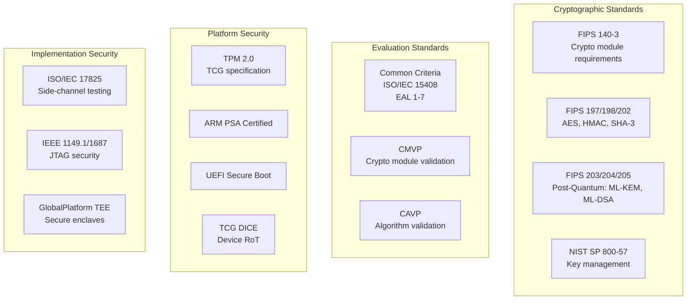
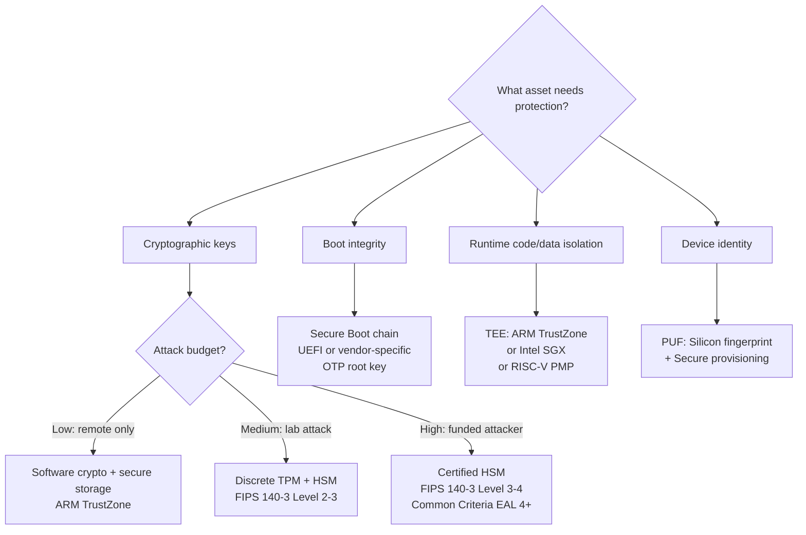
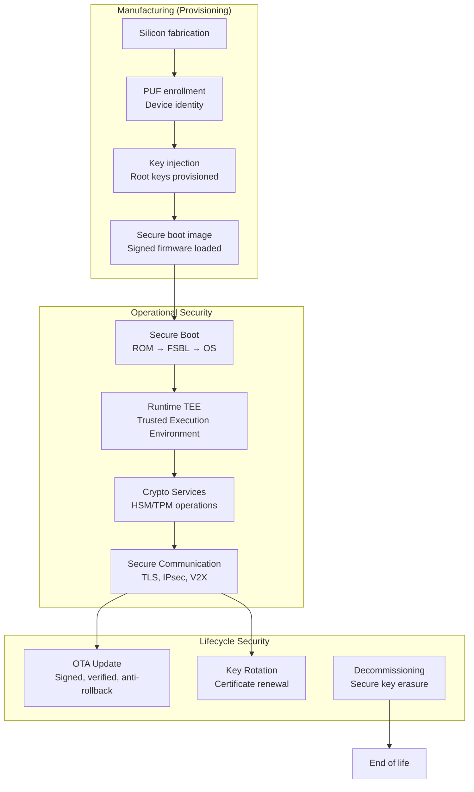

# Hardware Security & Cryptography — Overview

**Topic:** Hardware Security Standards Landscape — Cryptographic Modules, Trusted Computing, Secure Boot, Side-Channel Protection  
**Standards:** FIPS 140-3, Common Criteria (ISO/IEC 15408), TPM 2.0, ARM PSA, NIST SP 800-series  
**SDO:** NIST, ISO/IEC, TCG, GlobalPlatform, ARM, NIAP  
**Audience:** Security architects, hardware security engineers, embedded systems engineers, cryptographic module designers  
**Prerequisites:** Cryptography fundamentals (symmetric/asymmetric), embedded systems, semiconductor design basics

---

## Chapter 1 — Historical Context & Origin Story

### 1.1 Timeline of Hardware Security

| Year | Event | Impact |
|------|-------|--------|
| 1976 | Diffie-Hellman key exchange | Asymmetric cryptography born |
| 1977 | RSA algorithm + DES (FIPS 46) | Foundation of modern crypto |
| 1994 | Shor's algorithm | Quantum threat identified (RSA/ECC vulnerable) |
| 1997 | AES competition begins (NIST) | Replace aging DES |
| 1999 | Kocher: timing attack on RSA | Side-channel analysis field established |
| 2001 | AES (Rijndael) selected — FIPS 197 | Global symmetric standard |
| 2004 | TPM 1.1b (TCG formed) | Hardware root of trust for PCs |
| 2006 | TPM 1.2 + Common Criteria EAL 4 norm | Payment/government security baseline |
| 2011 | FIPS 140-2 dominance | US federal crypto module requirement |
| 2014 | Heartbleed (OpenSSL) | Hardware crypto modules gain urgency |
| 2016 | NIST PQC competition + TrustZone-M | Post-quantum + embedded security |
| 2019 | FIPS 140-3 published | Replaces FIPS 140-2 (ISO 19790 aligned) |
| 2022 | NIST PQC finalists: Kyber, Dilithium | Post-quantum migration begins |
| 2024 | FIPS 203/204/205 published | Official PQC standards |

### 1.2 Why Hardware Security Matters

| Threat | Software-Only Mitigation | Hardware Security Advantage |
|--------|--------------------------|---------------------------|
| Key extraction | Encrypted storage (breakable) | HSM/TPM: keys never leave hardware |
| Boot tampering | Signature check in SW (bypassable) | Secure Boot: HW root of trust validates chain |
| Side-channel attacks | Constant-time code (difficult, error-prone) | HW countermeasures: masking, shielding |
| Physical tampering | Cannot detect | Tamper-response: zeroize on intrusion |
| Firmware rollback | Version counter in flash (writable) | HW fuse-based anti-rollback (one-time programmable) |
| Supply chain counterfeit | Cannot detect reliably | PUF: unique silicon fingerprint per device |

---

## Chapter 2 — Standard Architecture & Structure

### 2.1 Hardware Security Standards Taxonomy



### 2.2 Security Levels Comparison

| Standard | Level 1 | Level 2 | Level 3 | Level 4/Max |
|----------|---------|---------|---------|-------------|
| **FIPS 140-3** | Software crypto, no physical | Tamper-evident coatings | Tamper-response (active) | Environmental failure protection |
| **Common Criteria** | EAL 1: Functionally tested | EAL 3: Methodically tested | EAL 5: Semi-formally designed | EAL 7: Formally verified |
| **ARM PSA** | Level 1: Security by design | Level 2: Lab attack resistant | Level 3: Substantial attack resistant | — |
| **TPM** | Software TPM | Firmware TPM (fTPM) | Discrete TPM chip | Integrated TPM (SoC) |

---

## Chapter 3 — Technical Deep Dive

### 3.1 Cryptographic Algorithm Landscape (2024)

| Algorithm | Type | Key Size | Security Level | Status |
|-----------|------|----------|---------------|--------|
| AES-128/192/256 | Symmetric (block cipher) | 128/192/256 bit | 128/192/256 bit security | FIPS 197: Active |
| SHA-256/384/512 | Hash | — | 128/192/256 bit | FIPS 180-4: Active |
| SHA-3 (Keccak) | Hash | — | 128/192/256 bit | FIPS 202: Active |
| RSA-2048/3072/4096 | Asymmetric (signature/encrypt) | 2048/3072/4096 | 112/128/152 bit | FIPS 186-5: Active (PQ vulnerable) |
| ECDSA P-256/P-384 | Asymmetric (signature) | 256/384 bit | 128/192 bit | FIPS 186-5: Active (PQ vulnerable) |
| EdDSA (Ed25519) | Asymmetric (signature) | 256 bit | 128 bit | RFC 8032: Active (PQ vulnerable) |
| ML-KEM (Kyber) | PQ Key Encapsulation | 768/1024/1536 | 128/192/256 bit | FIPS 203: Active (PQ safe) |
| ML-DSA (Dilithium) | PQ Signature | 2/3/5 | 128/192/256 bit | FIPS 204: Active (PQ safe) |
| SLH-DSA (SPHINCS+) | PQ Signature (hash-based) | 128/192/256 | Stateless, conservative | FIPS 205: Active (PQ safe) |

### 3.2 Hardware Security Module (HSM) Architecture

```mermaid
graph TB
    subgraph "HSM Internal Architecture"
        A[Tamper-Responsive Enclosure<br/>Mesh + sensors + zeroize]
        B[Cryptographic Processor<br/>Dedicated crypto accelerator]
        C[Key Storage<br/>Battery-backed SRAM<br/>Zeroizes on tamper]
        D[Random Number Generator<br/>True RNG (physical entropy)]
        E[Firmware<br/>Signed, measured boot]
        F[Interface Controller<br/>API: PKCS#11, JCE, CAPI]
    end
    
    A --> B
    B --> C
    B --> D
    B --> E
    B --> F
```

### 3.3 Trust Chain Architecture

| Level | Component | Trust Basis | Verification |
|-------|-----------|-------------|--------------|
| 0 (Immutable) | ROM Boot Loader | Silicon (fused, cannot be changed) | None needed (immutable) |
| 1 | First-stage bootloader (FSBL) | Signed by ROM key, verified by Level 0 | RSA/ECDSA signature check |
| 2 | Second-stage bootloader (U-Boot/UEFI) | Signed, verified by Level 1 | Signature + version (anti-rollback) |
| 3 | OS Kernel | Signed, verified by Level 2 | Signature + hash (dm-verity) |
| 4 | Applications / Containers | Signed, verified by Level 3 | Code signing + integrity check |

### 3.4 Side-Channel Attack Categories

| Attack Type | What Is Leaked | Countermeasure |
|-------------|---------------|----------------|
| Timing | Execution time varies with secret data | Constant-time implementation |
| Power (SPA/DPA) | Power consumption correlates with data | Masking, hiding, noise injection |
| Electromagnetic (EMA) | EM emissions from chip | Shielding, randomized execution |
| Cache timing | Cache hit/miss patterns reveal data | Constant-time memory access, cache partitioning |
| Fault injection (glitching) | Voltage/clock glitch causes wrong computation | Redundancy, error detection, glitch sensors |
| Acoustic | CPU coil whine encodes data | Physical isolation |
| Photon emission | IR photons from transistor switching | Shielding (backside attacks remain challenging) |

---

## Chapter 4 — Implementation Guide

### 4.1 Selecting Security Architecture for Embedded System



### 4.2 Automotive Hardware Security

| Component | Automotive Standard | Security Requirement |
|-----------|-------------------|---------------------|
| ECU secure boot | UNECE WP.29 R155/R156 | Verified boot with anti-rollback |
| V2X communication | IEEE 1609.2, ETSI ITS | ECDSA P-256 signing per message |
| OTA updates | ISO 24089 | Signed + encrypted update packages |
| Diagnostics (UDS) | ISO 14229 Security Access | Challenge-response authentication |
| Key storage | SHE/EVITA/HSM | Hardware-protected key slots |
| Immobilizer | Transponder crypto | AES-128 authentication |

---

## Chapter 5 — Certification & Audit

### 5.1 FIPS 140-3 Certification Process

| Phase | Activity | Duration |
|-------|----------|----------|
| 1 | Select NVLAP-accredited lab | — |
| 2 | Pre-assessment (gap analysis) | 2-4 weeks |
| 3 | Design documentation | 3-6 months |
| 4 | Lab testing | 3-12 months |
| 5 | CMVP review | 6-18 months (backlog) |
| 6 | Certificate issued | Total: 12-36 months |

### 5.2 Common Criteria Certification

| EAL Level | Documentation Required | Testing Depth | Typical Duration |
|-----------|----------------------|---------------|-----------------|
| EAL 1 | Basic functional spec | Functional testing | 3-6 months |
| EAL 2 | Design docs + test evidence | Structural testing | 6-12 months |
| EAL 4 | Full design + source (parts) | Methodical vulnerability analysis | 12-24 months |
| EAL 5+ | Formal methods (semiformal) | Independent vulnerability analysis | 24-48 months |

---

## Chapter 6 — Regional & Domain Variants

| Region | Scheme | Key Standards |
|--------|--------|--------------|
| USA | NIAP (Common Criteria), CMVP (FIPS) | FIPS 140-3 mandatory for federal |
| Europe | SOGIS-MRA, EUCC (EU Cybersecurity Act) | Common Criteria + EN standards |
| Japan | JISEC (CC), JCMVP (crypto modules) | Aligned with ISO/IEC 19790 |
| Korea | KCMVP (Korean CMVP) | Korean crypto module certification |
| China | OSCCA (GM/T standards), GM/T 0028 | SM2/SM3/SM4 algorithms mandatory |
| India | CCA (Certification Authority) | EMV + FIPS alignment |

---

## Chapter 7 — Comparison: Security Architectures

| Architecture | Trust Boundary | Key Protection | Performance | Cost |
|-------------|---------------|----------------|-------------|------|
| Software-only crypto | Process boundary | In RAM (extractable) | Fast (CPU) | Free |
| ARM TrustZone | HW-enforced secure world | Secure memory (no export) | Fast (same CPU) | Low (IP license) |
| Discrete TPM chip | Separate chip boundary | NV in TPM (tamper-evident) | Slow (I2C/SPI link) | Medium ($1-3) |
| Integrated HSM (SoC) | On-die secure island | Dedicated key RAM | Fast (on-die bus) | Medium (silicon area) |
| External HSM (network) | Physical enclosure | Tamper-zeroize SRAM | Medium (network latency) | High ($5K-50K+) |
| Smart card / SE | Dedicated chip | Certified key storage | Slow (contact interface) | Low ($0.50-5) |

---

## Chapter 8 — Mermaid Architecture Diagrams

### 8.1 Complete Hardware Security Ecosystem



### 8.2 Attack Surface Map

```mermaid
graph LR
    subgraph "Physical Attacks"
        A[Probing: FIB, microprobing]
        B[Side-channel: power, EM, timing]
        C[Fault injection: voltage glitch, laser]
        D[Decapping + reverse engineering]
    end
    
    subgraph "Logical Attacks"
        E[Buffer overflow / RCE]
        F[Privilege escalation]
        G[Firmware downgrade / rollback]
        H[Protocol attacks (TLS, key exchange)]
    end
    
    subgraph "Supply Chain"
        I[Counterfeit ICs]
        J[Hardware trojans]
        K[Compromised firmware]
    end
```

---

## Chapter 9 — Case Studies & Failure Analysis

### 9.1 TPM Reset Attack (Practical Cold Boot Variant)

**Attack:** Researcher demonstrates that discrete TPM (I2C/SPI bus) can be sniffed during boot. PCR values and session data visible on bus. By intercepting the communication, attacker extracts disk encryption key (BitLocker).

**Root cause:** Unencrypted TPM bus communication between CPU and discrete TPM chip.

**Mitigation:** Use integrated TPM (fTPM in SoC) — no exposed bus. Or: use encrypted sessions (TPM2_StartAuthSession with parameter encryption). Microsoft added bus encryption requirement for Windows 11 Secured-Core PCs.

### 9.2 Automotive ECU Key Extraction via Side-Channel

**Attack:** Researchers perform DPA (Differential Power Analysis) on automotive ECU during CAN authentication. By measuring power consumption over 10,000 authentication attempts, they extract the 128-bit AES key used for seed-key challenge-response.

**Impact:** Attacker can now impersonate authorized diagnostic tool → reprogram ECU, disable immobilizer, steal vehicle.

**Mitigation:** Hardware AES accelerator with masking countermeasures (SHE 2.0 / EVITA Medium HSM). Limits authentication attempts (lockout after 3 failures). Move to HSM with FIPS 140-2/3 Level 3 certification (demonstrated SCA resistance).

---

## Chapter 10 — Future Evolution & Industry Trends

| Trend | Timeline | Impact |
|-------|----------|--------|
| Post-Quantum Cryptography (PQC) migration | 2024-2030 | All RSA/ECC hardware must add PQC support |
| FIPS 140-3 replaces FIPS 140-2 completely | March 2026 | All new submissions must be FIPS 140-3 |
| EU Cyber Resilience Act (CRA) | 2025-2027 | Mandatory security certification for connected products |
| Confidential Computing (hardware-enforced) | 2024-2028 | TEE becomes standard for cloud + edge |
| Quantum Key Distribution (QKD) | 2028+ | Hardware quantum channel for key exchange |
| RISC-V security extensions | 2024-2026 | Open-source alternative to TrustZone |
| AI model protection (DRM for neural networks) | 2025+ | Hardware enclaves protect model weights |
| Zero Trust Architecture (HW-rooted) | 2024+ | Every device must prove identity via HW attestation |

---

## Chapter 11 — Interview Questions & Career Guide

### Tier 1: Entry-Level (0-3 years)

**Q1:** Explain the difference between FIPS 140-3 Level 1 through Level 4.  
**A:** FIPS 140-3 defines security levels for cryptographic modules: **Level 1:** Basic security. Software or hardware crypto with no physical security requirements. Just algorithm correctness. Example: OpenSSL running on standard Linux. **Level 2:** Tamper-evidence. Physical security mechanisms that show evidence of tampering (e.g., tamper-evident seals, pick-resistant locks). Role-based authentication required. Example: HSM with tamper-evident coating. **Level 3:** Tamper-response. Physical mechanisms that ACTIVELY respond to tampering (e.g., zeroize keys if enclosure opened). Identity-based authentication. High-strength enclosures. Example: Network HSM (Thales Luna, Entrust nShield). **Level 4:** Environmental failure protection. Protection against environmental attacks (temperature, voltage, radiation). If environmental conditions go outside normal operating range, module zeroizes. Extremely rare (very few products achieve Level 4). Example: Military crypto devices.

### Tier 2: Mid-Level (3-8 years)

**Q2:** How does a Secure Boot chain of trust work, and what happens if one link is compromised?  
**A:** **Chain of trust:** Each stage verifies the next before executing it. Level 0 (Root of Trust): Immutable ROM code + OTP public key hash. Cannot be changed. This is the "anchor." Level 1: ROM loads first bootloader from flash, checks its RSA/ECDSA signature against the OTP key. If valid → execute. If invalid → boot fails (brick or recovery mode). Level 2: First bootloader loads second bootloader (U-Boot, UEFI), verifies its signature. Also checks version counter (anti-rollback: new firmware must have higher version than fused counter). Level 3: Bootloader loads OS kernel, verifies signature. Level 4: OS verifies application/driver signatures. **If compromised:** If Level 0 (ROM key) is compromised: GAME OVER. Device is permanently compromised. Only mitigation: hardware recall (replace SoC). This is why ROM key is burned into one-time-programmable fuses. If Level 1 bootloader has vulnerability: Attacker who can exploit it can bypass all subsequent checks. Fix: OTA update the bootloader + burn anti-rollback fuse (prevents downgrade to vulnerable version). If application signing key leaks: Attacker can sign malicious code. Fix: revoke key (if revocation mechanism exists), issue new key, update trust list. **Critical design principle:** The root of trust must be MINIMAL and IMMUTABLE. Less code in ROM = less attack surface. Typical ROM bootloader: 10-50KB only.

### Tier 3: Senior/Lead (8-15 years)

**Q3:** Design the hardware security architecture for an automotive V2X (Vehicle-to-Everything) communication module that must sign 10 messages/second with ECDSA P-256 and be prepared for post-quantum migration.  
**A:** **Requirements:** 10 ECDSA-P256 signatures/second (real-time V2X safety messages). Private key MUST NOT be extractable (even by vehicle owner). Crypto-agility: must support PQC (ML-DSA) migration via OTA within 5 years. Lifetime: 15 years automotive. Operating temperature: -40 to +85°C (passenger compartment). **Architecture:** **(1) Hardware:** Dedicated HSM SoC (e.g., SHE+/EVITA Full or equivalent): Hardware ECDSA P-256 accelerator: < 5ms per signature (supports 10/s with margin). Hardware SHA-256 accelerator (message hashing). True Random Number Generator (TRNG) — compliant with AIS 31 Class PTG.2. Key storage: secure NVM (OTP for root key, writable for operational keys — encrypted at rest). Tamper detection: voltage/temperature/clock glitch sensors. Side-channel countermeasures: masked ECDSA implementation. **(2) PQC readiness:** Reserve flash/RAM for ML-DSA implementation (signature size: 2.4KB vs. 64 bytes for ECDSA). HSM must have updatable firmware (signed update mechanism). Hardware accelerator for SHA-3/SHAKE (needed by ML-DSA). Reserve NVM key slots for PQC keys (larger key sizes: ML-DSA public key = 1.3KB). Transition plan: hybrid signatures during migration (ECDSA + ML-DSA both in message). **(3) Key management:** V2X uses pseudonym certificates (privacy): HSM stores multiple pseudonym private keys (e.g., 20 active at a time). Certificate provisioning via SCMS (Security Credential Management System). Key rotation: weekly pseudonym change (HSM receives new certs via encrypted channel). Root CA trust: IEEE 1609.2 certificate chain stored in HSM. **(4) Certification:** Target: Common Criteria EAL 4+ (automotive security PP) or FIPS 140-3 Level 2 minimum. Side-channel testing: TVLA (Test Vector Leakage Assessment) per ISO 17825. AEC-Q100 qualification for automotive temperature/reliability.

---

## Chapter 12 — Cheat Sheet & Quick Reference

### Standards Quick Reference

```
FIPS 140-3:     Crypto module certification (Levels 1-4)
Common Criteria: Product security evaluation (EAL 1-7)
TPM 2.0:        Hardware root of trust (TCG spec)
ARM PSA:        Platform Security Architecture (Levels 1-3)
NIST PQC:       FIPS 203 (ML-KEM), 204 (ML-DSA), 205 (SLH-DSA)
ISO/IEC 19790:  International FIPS 140 equivalent
ISO/IEC 15408:  Common Criteria (international)
UEFI Secure Boot: x86/ARM boot chain verification
DICE (TCG):     Lightweight device identity
```

### Algorithm Selection Guide (2024)

```
Symmetric encryption:     AES-256-GCM (authenticated encryption)
Hashing:                  SHA-256 (general), SHA-3 (new designs)
Key agreement:            ECDH P-256 (current), ML-KEM-768 (PQ ready)
Digital signature:        ECDSA P-256 (current), ML-DSA-65 (PQ ready)
MAC:                      HMAC-SHA-256 or AES-CMAC
Key derivation:           HKDF (RFC 5869)
Random numbers:           Hardware TRNG + DRBG (NIST SP 800-90A)
```

### Key Lengths and Security Equivalence

```
Security Level    Symmetric    RSA         ECC          PQ (ML-KEM)
128-bit           AES-128      RSA-3072    P-256        ML-KEM-768
192-bit           AES-192      RSA-7680    P-384        ML-KEM-1024
256-bit           AES-256      RSA-15360   P-521        ML-KEM-1536
```

---

*End of Document — 00_Hardware_Security_Overview.md*
