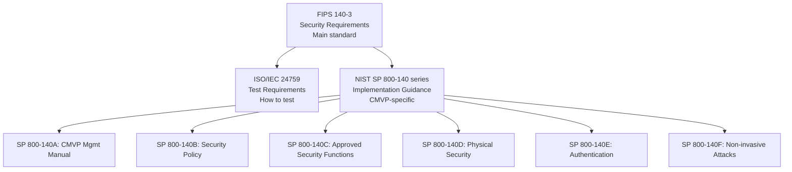
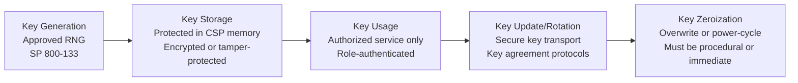
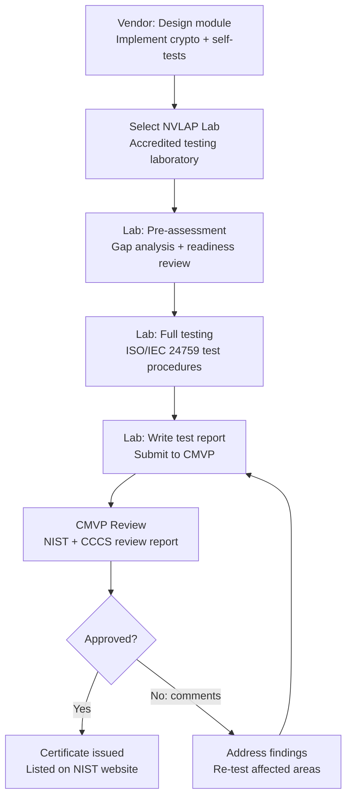
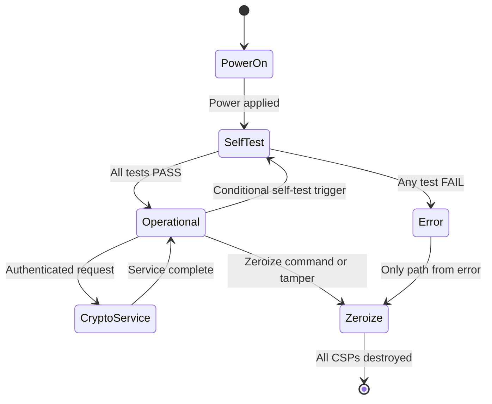
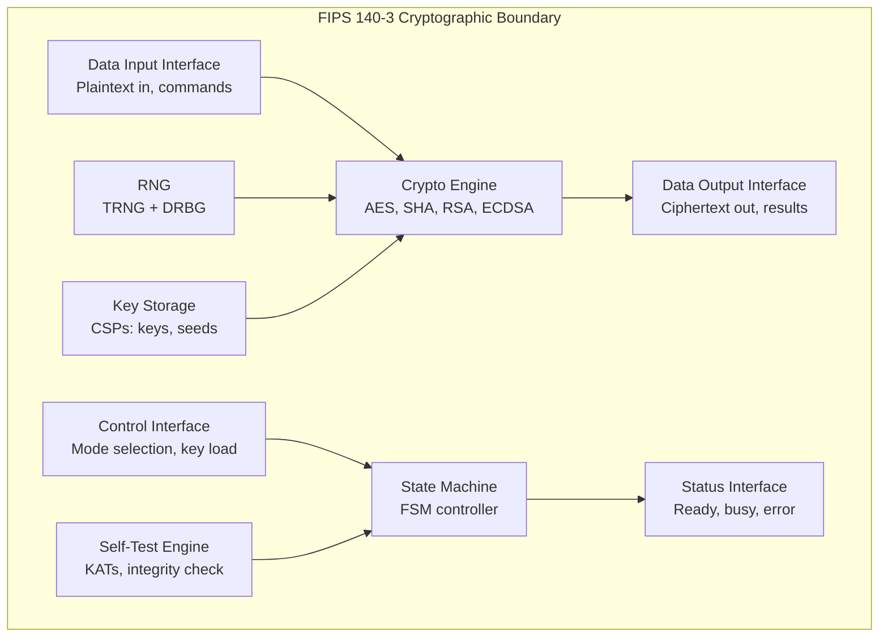

# FIPS 140-3 — Security Requirements for Cryptographic Modules

**Topic:** FIPS 140-3 Standard — Cryptographic Module Validation, Security Levels, Testing, and Certification  
**Standards:** FIPS 140-3 (2019), ISO/IEC 19790:2012+Amd1, ISO/IEC 24759:2017, NIST SP 800-140 series  
**SDO:** NIST, CCCS (Canadian Centre for Cyber Security)  
**Audience:** Cryptographic module designers, security architects, compliance engineers, CMVP test lab engineers  
**Prerequisites:** Cryptography fundamentals, hardware/software module design, security engineering

---

## Chapter 1 — Historical Context & Origin Story

### 1.1 Timeline

| Year | Event | Impact |
|------|-------|--------|
| 1994 | FIPS 140-1 published | First crypto module security standard |
| 2001 | FIPS 140-2 published | Major revision (11 security areas, 4 levels) |
| 2012 | ISO/IEC 19790 published | International equivalent (basis for FIPS 140-3) |
| 2019 | FIPS 140-3 published (effective Sep 2019) | Aligns with ISO 19790, replaces FIPS 140-2 |
| 2020 | CMVP begins accepting FIPS 140-3 submissions | Transition begins |
| 2021 | FIPS 140-2 testing sunset announced | No new FIPS 140-2 submissions after Sep 2021 |
| 2026 | FIPS 140-2 certificates: historical list | All active certs must be FIPS 140-3 for new procurement |

### 1.2 FIPS 140-2 vs. FIPS 140-3 Key Differences

| Aspect | FIPS 140-2 | FIPS 140-3 |
|--------|-----------|-----------|
| Basis | US-developed | ISO/IEC 19790 aligned |
| Security levels | 4 levels (1-4) | 4 levels (1-4, redefined) |
| Security areas | 11 areas | 12+ areas (reorganized) |
| Testing standard | Derived Test Requirements (DTR) | ISO/IEC 24759 |
| Non-invasive attacks | Not explicitly required | Level 3/4: SCA testing required |
| Entropy assessment | SP 800-90B reference | Mandatory entropy source validation |
| Software modules | Allowed at all levels | More explicit SW/FW/HW categorization |
| Degraded mode | Allowed with restrictions | More structured error handling |
| Algorithm transitions | Implicit | Explicit algorithm lifecycle (approved/deprecated) |

---

## Chapter 2 — Standard Architecture & Structure

### 2.1 FIPS 140-3 Document Structure



### 2.2 Security Areas (FIPS 140-3 / ISO 19790)

| # | Security Area | Description |
|---|-------------|-------------|
| 1 | Cryptographic module specification | Module boundary, interfaces, modes |
| 2 | Cryptographic module interfaces | Data input/output, control, status |
| 3 | Roles, services, and authentication | Operator roles, authentication mechanisms |
| 4 | Software/Firmware security | Code integrity, approved algorithms |
| 5 | Operational environment | OS requirements (for SW modules) |
| 6 | Physical security | Tamper evidence/response, environmental |
| 7 | Non-invasive security | Side-channel countermeasures |
| 8 | Sensitive security parameter management | Key generation, storage, zeroization |
| 9 | Self-tests | Power-up + conditional self-tests |
| 10 | Life-cycle assurance | Configuration management, secure delivery |
| 11 | Mitigation of other attacks | Additional attacks not in other areas |

---

## Chapter 3 — Technical Deep Dive

### 3.1 Security Levels Detailed

**Level 1 — Basic Security:**
| Requirement | Details |
|-------------|---------|
| Physical | No physical security beyond production-grade components |
| Crypto | Approved algorithms only (AES, SHA, RSA, ECDSA, etc.) |
| Self-tests | Power-up self-test + conditional tests (KAT, integrity) |
| Roles | Minimum: Crypto Officer + User roles |
| Environment | General-purpose OS acceptable (if SW module) |
| Example | OpenSSL FIPS module, BoringCrypto |

**Level 2 — Tamper-Evidence:**
| Requirement | Details |
|-------------|---------|
| Physical | Tamper-evident coatings or seals (show evidence of access) |
| Authentication | Role-based minimum (password or token) |
| OS | Evaluated OS (CC EAL 2+ or equivalent) for SW modules |
| Crypto | Same as Level 1 |
| Example | Hardware token with tamper-evident enclosure |

**Level 3 — Tamper-Response:**
| Requirement | Details |
|-------------|---------|
| Physical | Active tamper-response: zeroize CSPs on intrusion attempt |
| Construction | Hard epoxy coating, conductive mesh envelope |
| Authentication | Identity-based (multi-factor) |
| Non-invasive | Must demonstrate SCA resistance (ISO 17825 / SP 800-140F) |
| Key management | Keys encrypted in transit, never in plaintext outside module |
| Example | Network HSM (Thales Luna 7, Entrust nShield) |

**Level 4 — Environmental Failure Protection:**
| Requirement | Details |
|-------------|---------|
| Physical | Level 3 + environmental envelope |
| Environmental | Zeroize if temperature or voltage outside operating range |
| Testing | Fault induction testing required |
| Certification | Very few products ever achieve Level 4 |
| Example | Military communication equipment |

### 3.2 Self-Test Requirements

| Self-Test Type | When Executed | What Is Tested |
|---------------|--------------|----------------|
| Power-up self-test (POST) | Every power-on / reset | Algorithm KATs (Known Answer Tests) for all implemented algorithms |
| Software integrity test | Power-on | HMAC or signature over module code → verify integrity |
| Conditional self-tests | On specific events | Pair-wise consistency (key generation), CRNG test (each generation) |
| Continuous RNG test | Every RNG output | Compare consecutive blocks — must differ (detects stuck TRNG) |
| Periodic self-test | Optional (vendor-defined) | Re-run KATs at defined intervals |

**Known Answer Test (KAT) examples:**
```
AES-256 KAT:
  Input:  Known plaintext + known key
  Expected: Known ciphertext
  Test:   Encrypt, compare output to expected → PASS/FAIL
  
SHA-256 KAT:
  Input:  Known message
  Expected: Known hash digest
  Test:   Hash, compare → PASS/FAIL

RSA KAT:
  Sign known message with test key → verify signature
```

### 3.3 Key Lifecycle Management



### 3.4 Approved Algorithms (as of 2024)

| Category | Approved Algorithms |
|----------|-------------------|
| Symmetric encryption | AES (128/192/256), TDEA (3-key, legacy only) |
| Block cipher modes | ECB, CBC, CFB, OFB, CTR, CCM, GCM, XTS, KW/KWP |
| Hashing | SHA-1 (signature verification only), SHA-2 (224/256/384/512), SHA-3 |
| Digital signature | RSA (≥2048), ECDSA (P-256/P-384/P-521), EdDSA, ML-DSA |
| Key establishment | RSA, DH (≥2048), ECDH (P-256+), ML-KEM |
| MAC | HMAC (SHA-2, SHA-3), CMAC (AES), GMAC |
| RNG | DRBG (CTR_DRBG, Hash_DRBG, HMAC_DRBG per SP 800-90A) |
| Key derivation | SP 800-108 (KDF), SP 800-56C, HKDF |

---

## Chapter 4 — Implementation Guide

### 4.1 FIPS 140-3 Module Design Decisions

| Decision | Options | Trade-off |
|----------|---------|-----------|
| Module type | Hardware / Firmware / Software / Hybrid | HW: harder to update. SW: easier but lower physical security |
| Security level | 1 / 2 / 3 / 4 | Higher = more cost + longer certification |
| Boundary | Single chip / Multi-chip / Software boundary | Must be clearly defined in Security Policy |
| Algorithms | Select from approved list | More algorithms = more testing/cost |
| Roles | Crypto Officer + User (minimum) | Additional roles = more auth complexity |
| RNG | Hardware TRNG + DRBG | TRNG entropy assessment (SP 800-90B) adds months |
| Operating environment | GP OS / Limited / Modifiable | Level 2+ software: need evaluated OS |

### 4.2 Common Pitfalls in FIPS 140-3 Certification

| Pitfall | Impact | Avoidance |
|---------|--------|-----------|
| Unclear module boundary | Rework + restart testing | Define boundary clearly FIRST (in Security Policy) |
| Using non-approved algorithm for security function | Failure | Audit ALL crypto usage — even internal (key wrap, etc.) |
| Insufficient zeroization | Failure at Level 3+ | Verify ALL CSP storage locations are zeroized (including temp buffers) |
| TRNG entropy insufficient | Entropy assessment failure | Over-engineer entropy source (target > 1 bit/sample for SP 800-90B) |
| Self-test coverage gap | Missing KAT for a mode | KAT required for EVERY approved algorithm AND mode in the module |
| Security Policy documentation errors | Delays in review | Iterative review with lab BEFORE formal submission |
| Algorithm deprecation during testing | Re-submission | Check SP 800-131A transition dates, plan ahead |

---

## Chapter 5 — Certification & Audit

### 5.1 CMVP Certification Process



### 5.2 Documentation Package

| Document | Content |
|----------|---------|
| Security Policy (SP) | Public document: module description, boundary, services, algorithms, levels |
| Finite State Machine (FSM) | All states + transitions (power-up, operational, error, zeroize) |
| Design documentation | Architecture, interfaces, crypto mechanism descriptions |
| Source code | For software modules: full source for lab review |
| Test procedures | Vendor test plans (for lab reference) |
| Entropy Assessment Report | SP 800-90B analysis for each entropy source |
| Physical Security description | For Level 2+: tamper mechanism design |

---

## Chapter 6 — Regional & Domain Variants

| Program | Region | Relationship to FIPS 140-3 |
|---------|--------|---------------------------|
| CMVP | USA + Canada | Primary certification body for FIPS 140-3 |
| KCMVP | South Korea | Korean equivalent (uses Korean algorithms SM3-like) |
| JCMVP | Japan | Japanese CMVP (accepts FIPS 140-2/3 with mapping) |
| ISO/IEC 19790 | International | FIPS 140-3 is derived from this |
| NIAP (CC) | USA | Common Criteria (complementary to FIPS, not replacement) |
| SOGIS-MRA | Europe | CC mutual recognition (separate from FIPS) |
| PCI HSM | Global (PCI SSC) | Payment-specific HSM requirements (references FIPS) |

---

## Chapter 7 — Comparison: FIPS 140-3 Levels

| Feature | Level 1 | Level 2 | Level 3 | Level 4 |
|---------|---------|---------|---------|---------|
| Algorithm correctness | ✓ | ✓ | ✓ | ✓ |
| Self-tests (KAT, integrity) | ✓ | ✓ | ✓ | ✓ |
| Role-based authentication | ✓ | ✓ | Identity-based | Identity-based (MFA) |
| Tamper evidence | — | ✓ (seals) | ✓ (active response) | ✓ + environmental |
| Key zeroization | Procedural | Procedural | Immediate (auto) | Immediate + environmental trigger |
| Non-invasive attack resistance | — | — | ✓ (SCA testing) | ✓ (SCA + fault injection) |
| OS requirements (SW) | Any | EAL 2+ or equivalent | EAL 3+ | EAL 4+ |
| Typical certification time | 6-12 months | 9-18 months | 12-24 months | 24-36+ months |
| Typical cost | $50K-200K | $100K-400K | $200K-800K | $500K-2M+ |

---

## Chapter 8 — Mermaid Architecture Diagrams

### 8.1 FIPS 140-3 Module State Machine



### 8.2 Cryptographic Boundary



---

## Chapter 9 — Case Studies & Failure Analysis

### 9.1 OpenSSL FIPS Module Certification Journey

**Background:** OpenSSL FIPS Object Module — one of the most widely deployed FIPS-validated software crypto modules.

**Challenges faced:**
- Certification of OpenSSL 3.0 FIPS provider took 3+ years
- Entropy source validation (SP 800-90B) was the most time-consuming aspect
- Module boundary definition for an open-source library was complex (what's inside vs. outside?)
- Algorithm deprecation during testing: 3DES was being deprecated → had to decide include/exclude

**Lessons learned:**
- Start entropy assessment EARLY (it takes 6-12 months alone)
- Define module boundary in a way that minimizes re-certification for minor changes
- Modular architecture: separating FIPS crypto from non-FIPS code reduces testing scope
- Version management: every code change within module requires regression testing

### 9.2 HSM Firmware Update Vulnerability

**Scenario:** Network HSM (FIPS 140-2 Level 3 certified) found to have vulnerability in firmware update mechanism. Attacker with physical access could load unsigned firmware → extract keys.

**Root cause:** Firmware update mechanism was OUTSIDE the cryptographic boundary (not covered by FIPS testing). The signing verification for firmware updates had a TOCTOU (time-of-check vs. time-of-use) race condition.

**Impact:** CMVP revoked the certificate. Vendor had to redesign firmware update mechanism, re-certify (18 months).

**Lesson:** Include firmware update mechanism INSIDE the cryptographic boundary. FIPS 140-3 addresses this more explicitly than 140-2 (firmware integrity is a self-test requirement).

---

## Chapter 10 — Future Evolution & Industry Trends

| Trend | Impact on FIPS 140-3 |
|-------|---------------------|
| Post-Quantum Cryptography | FIPS 203/204/205 algorithms must be added to modules |
| Algorithm agility | Modules designed for easy algorithm addition without full re-certification |
| Cloud HSM / KMS | FIPS 140-3 for cloud services (multi-tenant boundary challenges) |
| Automated CMVP (ACMVP) | NIST developing automated testing to reduce certification backlog |
| SP 800-140 updates | Continuous updates to implementation guidance |
| Side-channel as standard | Level 3 SCA testing becoming more rigorous (ISO 17825 updates) |
| Entropy-as-a-Service | Cloud entropy sources need FIPS 140-3 entropy validation |

---

## Chapter 11 — Interview Questions & Career Guide

### Tier 1: Entry-Level (0-3 years)

**Q1:** What are the self-test requirements in FIPS 140-3 and why are they important?  
**A:** FIPS 140-3 requires two categories of self-tests: **(1) Power-up self-tests (POST):** Run every time the module is powered on or reset. Include: Known Answer Tests (KATs) — test each algorithm with known input/output; Firmware/Software integrity test — HMAC or digital signature over module code; Continuous RNG test — verify RNG output is not stuck. If ANY self-test fails: module enters error state, no crypto services available, must zeroize before reuse. **(2) Conditional self-tests:** Run on specific events: Key generation → pairwise consistency test (sign then verify, encrypt then decrypt); Manual key entry → check for weak keys; RNG reseed → verify new seed is different from old. **Why important:** Self-tests ensure the module hasn't been corrupted (malware, hardware failure, aging) and algorithms are functioning correctly. They're the module's "health check." Without them, you could unknowingly use a broken crypto implementation (weak randomness, wrong algorithm output → total security failure). In real incidents: stuck TRNG (Debian OpenSSL bug 2008) would have been caught by continuous RNG self-test.

### Tier 2: Mid-Level (3-8 years)

**Q2:** You're designing a hardware crypto module targeting FIPS 140-3 Level 3 certification. Describe the physical security, key management, and non-invasive attack resistance requirements.  
**A:** **Physical Security (Level 3):** Tamper-response envelope: active detection mesh (conductive traces on PCB/epoxy) surrounding crypto boundary. If mesh is broken/probed → immediate zeroization of all CSPs (keys destroyed in < 1 second). Must be effective against: drilling, milling, chemical removal of encapsulant. Temperature + voltage sensors: if outside operating range (could indicate fault injection attempt) → zeroize. Tamper switches: case-open detection with battery-backed zeroize circuit. **Key Management:** All CSPs stored in volatile memory (battery-backed SRAM) — power loss/tamper = automatic zeroization. Key import/export: only in encrypted form (wrapped with KEK). Never plaintext outside boundary. Key generation: NIST SP 800-133 compliant (approved DRBG with sufficient entropy). Zeroization: Must overwrite ALL CSP memory locations (not just pointers). Verify zeroization by reading back. **Non-Invasive Attack Resistance (ISO 17825 / SP 800-140F):** Must demonstrate resistance to: SPA (Simple Power Analysis), DPA (Differential Power Analysis), timing attacks. Countermeasures: masking (randomize intermediate values), hiding (add noise, randomize execution order), constant-time implementation. Testing: Lab performs TVLA (Test Vector Leakage Assessment) — statistical test that no information leaks in power traces. Must pass with t-test below threshold (typically |t| < 4.5) for all test vectors.

---

## Chapter 12 — Cheat Sheet & Quick Reference

### FIPS 140-3 Levels Summary

```
Level 1: Software OK, no physical security, algorithm correctness
Level 2: Tamper-evident (seals/coatings), role-based auth
Level 3: Tamper-response (active zeroize), SCA resistance, identity auth
Level 4: Level 3 + environmental protection (voltage/temp envelope)
```

### Self-Test Requirements

```
Power-up tests (mandatory):
  - KAT for each approved algorithm and mode
  - Software/firmware integrity check (HMAC or signature)
  - RNG health test

Conditional tests:
  - Pairwise consistency (on key generation)
  - CRNG test (continuous, per output)
  - Bypass test (if bypass mode exists)
```

### CMVP Process Timeline

```
Phase 1: Design + documentation:        3-6 months
Phase 2: Lab testing (ISO 24759):        3-12 months  
Phase 3: CMVP review:                    6-18 months (backlog!)
Total typical (Level 3):                 18-36 months
Cost (Level 3, hardware):               $200K-800K
```

### Key References

```
FIPS 140-3:        Main security requirements
ISO/IEC 24759:     Test procedures
SP 800-140A-F:     Implementation guidance (CMVP-specific)
SP 800-90A/B/C:    Random number generation
SP 800-131A:       Algorithm transitions (deprecation dates)
SP 800-57:         Key management recommendations
SP 800-133:        Key generation requirements
```

---

*End of Document — 01_FIPS_140_3_Cryptographic_Modules.md*
