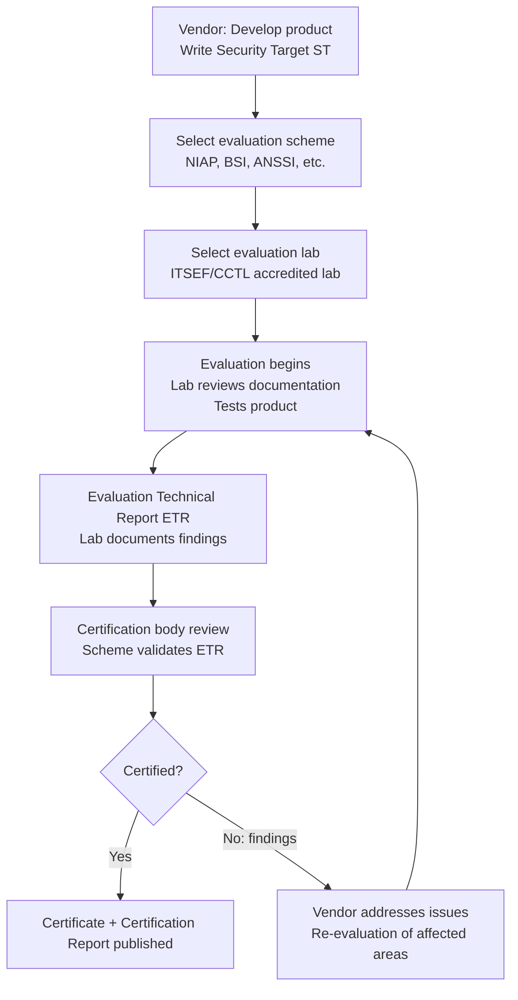
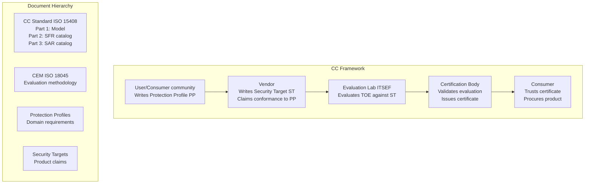

# Common Criteria — ISO/IEC 15408

**Topic:** Common Criteria for Information Technology Security Evaluation (CC) — EAL Levels, Protection Profiles, Security Targets  
**Standards:** ISO/IEC 15408:2022 (Parts 1-3), ISO/IEC 18045:2022 (CEM — Evaluation Methodology)  
**SDO:** ISO/IEC JTC 1/SC 27, CCRA (Common Criteria Recognition Arrangement)  
**Audience:** Security product evaluators, architects designing certified products, compliance officers, government procurement  
**Prerequisites:** Information security fundamentals, security engineering concepts, risk assessment

---

## Chapter 1 — Historical Context & Origin Story

### 1.1 Timeline

| Year | Event | Impact |
|------|-------|--------|
| 1985 | TCSEC ("Orange Book") — US DoD | First computer security evaluation criteria |
| 1991 | ITSEC (Europe) | European equivalent to TCSEC |
| 1993 | CTCPEC (Canada) | Canadian criteria |
| 1996 | Common Criteria v1.0 | Unified international standard from TCSEC+ITSEC+CTCPEC |
| 1999 | CC v2.1 → ISO/IEC 15408:1999 | First ISO publication |
| 2005 | CC v3.0 (major revision) | Simplified assurance levels, modular approach |
| 2009 | CC v3.1 Rev 3 | Refined Protection Profiles (PP) concept |
| 2012 | CCRA (Recognition Arrangement) revised | Mutual recognition up to EAL 2 only (cPP required for higher) |
| 2017 | CC v3.1 Rev 5 | Current widely-used version |
| 2022 | CC:2022 (CC v4.0 equivalent via ISO) | Major modernization (composite evaluation, modular PP) |

### 1.2 CC vs. Predecessors

| Feature | TCSEC (Orange Book) | ITSEC | Common Criteria |
|---------|--------------------|----|-----------------|
| Origin | USA (NSA/DoD) | Europe (UK/Germany/France/NL) | International (ISO) |
| Levels | D, C1, C2, B1, B2, B3, A1 | E0-E6 | EAL 1-7 |
| Flexibility | Rigid classes | More flexible | Highly flexible (PP + ST) |
| Mutual recognition | US only | European only | 31 countries (CCRA) |
| Still active? | Superseded | Superseded | Yes (current) |

---

## Chapter 2 — Standard Architecture & Structure

### 2.1 Common Criteria Document Structure

```mermaid
graph TB
    subgraph "ISO/IEC 15408 Parts"
        A[Part 1: Introduction & General Model<br/>Concepts, evaluation process overview]
        B[Part 2: Security Functional Components<br/>11 classes of security functions: FAU, FCS, FDP, FIA, FMT, FPR, FPT, FRU, FTA, FTP, FCO]
        C[Part 3: Security Assurance Components<br/>Assurance classes: ADV, AGD, ALC, ASE, ATE, AVA]
    end
    
    subgraph "Supporting Documents"
        D[ISO/IEC 18045 (CEM)<br/>Common Evaluation Methodology]
        E[Protection Profiles (PP)<br/>Domain-specific requirements]
        F[Security Targets (ST)<br/>Vendor's security claims]
    end
    
    A --> D
    B --> E
    C --> D
```

### 2.2 EAL (Evaluation Assurance Levels)

| EAL | Name | Description | Typical Products |
|-----|------|-------------|-----------------|
| EAL 1 | Functionally tested | Basic assurance, independent testing | Low-risk consumer products |
| EAL 2 | Structurally tested | Security analysis + developer testing evidence | Network devices, firewalls |
| EAL 3 | Methodically tested and checked | Design + test documentation reviewed | Middleware, enterprise SW |
| EAL 4 | Methodically designed, tested, reviewed | Full design documentation, source code review (partial) | Smart cards, OS, payment |
| EAL 5 | Semi-formally designed and tested | Formal (semiformal) security model | Crypto devices, military |
| EAL 6 | Semi-formally verified design | Semi-formal verification of design correspondence | High-security crypto |
| EAL 7 | Formally verified design | Full formal methods (mathematical proof) | Government TOP SECRET (rare) |

### 2.3 Key Concepts

| Concept | Definition |
|---------|------------|
| **TOE** (Target of Evaluation) | The product/system being evaluated |
| **PP** (Protection Profile) | Domain-specific security requirements (written by user community) |
| **ST** (Security Target) | Vendor document claiming what security the TOE provides |
| **SFR** (Security Functional Requirements) | What security functions the TOE must provide |
| **SAR** (Security Assurance Requirements) | How thoroughly the security is evaluated (EAL) |
| **TSF** (TOE Security Functionality) | The actual implementation of security within the TOE |
| **SOF** (Strength of Function) | Mechanism strength (e.g., crypto key length) |

---

## Chapter 3 — Technical Deep Dive

### 3.1 Security Functional Classes (Part 2)

| Class | Acronym | Description | Example Requirements |
|-------|---------|-------------|---------------------|
| Security Audit | FAU | Audit event generation, review, storage | Log all access attempts |
| Cryptographic Support | FCS | Key management, crypto operations | AES-256, RSA key generation |
| User Data Protection | FDP | Access control, information flow control | DAC, MAC, data isolation |
| Identification/Authentication | FIA | User identity verification | Password, biometric, certificate |
| Security Management | FMT | Security attribute management | Role management, policy config |
| Privacy | FPR | Anonymity, pseudonymity, unlinkability | Data minimization |
| TSF Protection | FPT | Self-protection of security functions | Integrity monitoring, fail-secure |
| Resource Utilization | FRU | Fault tolerance, resource allocation | Priority, quotas |
| TOE Access | FTA | Session management, access control | Login limits, concurrent sessions |
| Trusted Path/Channels | FTP | Trusted communication channels | Secure admin channel |
| Communication | FCO | Non-repudiation | Proof of origin/receipt |

### 3.2 Assurance Classes (Part 3)

| Class | Acronym | Description | EAL 1 | EAL 4 | EAL 7 |
|-------|---------|-------------|--------|--------|--------|
| Development | ADV | Design documentation | Basic | Detailed design + implementation representation | Formal model + correspondence proof |
| Guidance documents | AGD | User/admin guidance | ✓ | ✓ (detailed) | ✓ |
| Life-cycle support | ALC | Dev environment, CM, delivery | — | CM + secure delivery | CM + development tools analysis |
| Security Target eval | ASE | ST conformance review | ✓ | ✓ | ✓ |
| Tests | ATE | Testing coverage + evidence | Vendor tests | Independent testing (all SFR) | Formal verification |
| Vulnerability assessment | AVA | Vulnerability analysis | — | Methodical (attack potential: Enhanced-Basic) | High attack potential |

### 3.3 Attack Potential Calculation

| Factor | Values |
|--------|--------|
| Elapsed time | ≤ 1 day (0), ≤ 1 week (1), ≤ 1 month (4), ≤ 6 months (7), > 6 months (10) |
| Expertise | Layman (0), Proficient (3), Expert (6), Multiple experts (8) |
| Knowledge of TOE | Public (0), Restricted (3), Sensitive (7), Critical (11) |
| Window of opportunity | Unlimited (0), Easy (1), Moderate (4), Difficult (10) |
| Equipment | None (0), Standard (2), Specialized (4), Bespoke (7), Multiple bespoke (9) |
| **Total** | **Sum → Attack potential rating** |

| Total Score | Rating | Required for |
|-------------|--------|-------------|
| ≤ 10 | Basic | EAL 1-2 |
| 11-13 | Enhanced-Basic | EAL 3-4 |
| 14-19 | Moderate | EAL 4+ |
| 20-24 | High | EAL 5-6 |
| ≥ 25 | Beyond High | EAL 7 |

---

## Chapter 4 — Implementation Guide

### 4.1 CC Evaluation Process



### 4.2 Protection Profile (PP) Structure

| Section | Content |
|---------|---------|
| PP Introduction | PP reference, TOE overview |
| Conformance claims | CC version, PP conformance (strict/demonstrable) |
| Security Problem Definition | Threats, OSPs (Org Security Policies), Assumptions |
| Security Objectives | For the TOE and for the operational environment |
| Security Functional Requirements | Specific SFRs from Part 2 |
| Security Assurance Requirements | Required EAL or augmented assurance |
| Rationale | Traceability: threats → objectives → requirements |

### 4.3 Key Protection Profiles (Domain-Specific)

| PP | Domain | Typical EAL | Issuing Scheme |
|----|--------|-------------|---------------|
| PP for Mobile Device Fundamentals | Smartphones, tablets | EAL 1 (cPP) | NIAP |
| PP for General Purpose OS | Windows, Linux, macOS | EAL 1 (cPP) | NIAP |
| PP for Network Devices (NDcPP) | Firewalls, routers, switches | EAL 1 (cPP) | NIAP |
| PP for Smartcards (BSI-PP-0084) | Payment, ID cards | EAL 4+ | BSI (Germany) |
| PP for Hardware Security Module | HSM (signing, key storage) | EAL 4+ | Various |
| PP for Biometric Systems | Fingerprint, face recognition | EAL 2-4 | ANSSI |
| PP for IoT Devices | Connected consumer/industrial | EAL 1-2 | NIAP |
| PP for MFP/Hardcopy Devices | Printers, copiers | EAL 2 | NIAP |

---

## Chapter 5 — Certification & Audit

### 5.1 CCRA (Common Criteria Recognition Arrangement)

| Level | Mutual Recognition | Countries |
|-------|-------------------|-----------|
| Up to cPP (collaborative PP) | Full mutual recognition | All 31 CCRA members |
| EAL 1-2 (without cPP) | Recognized by arrangement | All 31 members |
| EAL 3-7 (without cPP) | NOT mutually recognized | Only issuing country |
| National schemes above EAL 2 | Country-specific acceptance | Bilateral agreements |

**CCRA Members (31 nations):** USA (NIAP), Canada, UK, Germany (BSI), France (ANSSI), Netherlands, Spain, Italy, Japan, Korea, Australia, India, Singapore, etc.

### 5.2 Evaluation Duration and Cost

| EAL | Typical Duration | Estimated Cost |
|-----|-----------------|----------------|
| EAL 1 (cPP) | 3-6 months | $50K-150K |
| EAL 2 | 6-12 months | $100K-300K |
| EAL 4 | 12-24 months | $200K-500K |
| EAL 4+ (augmented) | 18-30 months | $300K-800K |
| EAL 5-6 | 24-48 months | $500K-2M+ |
| EAL 7 | 36-60+ months | $1M-5M+ |

---

## Chapter 6 — Regional & Domain Variants

### 6.1 National CC Schemes

| Country | Scheme | Certification Body | Speciality |
|---------|--------|-------------------|------------|
| USA | NIAP | NSA/CCEVS | Military, government IT |
| Germany | BSI | Federal Office (BSI) | Smart cards, payment, eID |
| France | ANSSI | ANSSI/CESTI | Government crypto, defense |
| UK | NCSC (formerly CESG) | NCSC UK | Telecom, government |
| Netherlands | NSCIB | TÜV/Brightsight | Smart cards, payment |
| Japan | JISEC | IPA | Consumer IT, network |
| Korea | KECS | NIS/KISA | Telecom, government |
| India | STQC (IC3S) | MeitY | Government procurement |
| Canada | CCCS | CCCS | Government IT |

---

## Chapter 7 — Comparison with Other Security Certifications

| Feature | Common Criteria | FIPS 140-3 | ARM PSA Certified | SESIP (GP) |
|---------|----------------|-----------|-------------------|------------|
| Scope | Entire product security | Crypto module only | Platform security | IoT security |
| Levels | EAL 1-7 | Level 1-4 | Level 1-3 | Level 1-5 |
| Focus | Functional + assurance | Crypto correctness + physical | Architecture + resilience | IoT-specific threats |
| Cost | $50K-5M+ | $50K-800K | $10K-100K | $10K-50K |
| Duration | 3-60 months | 12-36 months | 1-6 months | 1-3 months |
| Mutual recognition | 31 countries (CCRA) | USA+Canada (+references) | Global (ARM ecosystem) | Global (GP) |
| Best for | Government procurement | Crypto compliance (US federal) | IoT/embedded design | Connected IoT products |

---

## Chapter 8 — Mermaid Architecture Diagrams

### 8.1 CC Evaluation Relationships



### 8.2 TOE Architecture (Typical Smart Card)

```mermaid
graph TB
    subgraph "TOE: Smart Card IC"
        A[Communication Interface<br/>ISO 7816 / NFC]
        B[Operating System<br/>Card OS (Java Card / MULTOS)]
        C[Cryptographic Engine<br/>AES, RSA, ECC HW accelerator]
        D[Secure Storage<br/>EEPROM with integrity]
        E[Random Number Generator<br/>True RNG]
        F[Security Mechanisms<br/>Voltage/clock glitch detection<br/>Light sensor<br/>Active shielding]
    end
    
    subgraph "Security Functions (SFR)"
        G[FCS: Crypto operations]
        H[FIA: PIN verification + biometric]
        I[FDP: Access control to files]
        J[FPT: Self-protection, tamper]
    end
    
    C --> G
    B --> H
    D --> I
    F --> J
```

---

## Chapter 9 — Case Studies & Failure Analysis

### 9.1 Smart Card PP Evaluation (BSI)

**Product:** Java Card smart card for eID (electronic identity card) — targeting EAL 4+ against BSI PP-0084.

**Evaluation scope:** Hardware IC (evaluated separately: EAL 5+) + Card OS + Applet → composite evaluation.

**Key challenges:**
- AVA_VAN.5 (vulnerability analysis): Lab performed 6 months of physical attack testing (SPA, DPA, FI, probing)
- Had to demonstrate resistance against profiled SCA attacks (templates)
- One finding: timing variation detected in ECC point multiplication → vendor implemented constant-time fix → re-test passed
- Total evaluation: 24 months, cost ~€400K

**Outcome:** Certificate issued. Card deployed in national eID program (10M+ cards).

### 9.2 Network Device cPP (NIAP) Failure

**Product:** Enterprise firewall targeting NIAP Network Device collaborative PP (NDcPP).

**Problem during evaluation:**
- Lab found that TLS implementation accepted TLS 1.0 connections (cPP requires TLS 1.2 minimum)
- Vendor had disabled TLS 1.0 in admin interface but NOT in inter-device management plane
- Additionally: audit log could be filled (resource exhaustion) → denial of audit service

**Corrective actions:**
- Disable TLS 1.0/1.1 on ALL interfaces
- Add log rotation + overflow handling (oldest entries overwritten, alert generated)
- Re-test affected areas: 4 weeks additional testing

**Lesson:** cPPs define MINIMUM requirements clearly — but vendors must verify ALL interfaces (not just user-facing ones) comply with each SFR.

---

## Chapter 10 — Future Evolution & Industry Trends

| Trend | Impact on CC |
|-------|-------------|
| CC:2022 (version 4.0 approach) | Modular PP composition, multi-assurance evaluation |
| EU Cybersecurity Act (EUCC scheme) | CC-based certification mandatory for certain products in EU |
| Collaborative Protection Profiles (cPP) | Faster, more practical evaluations with mutual recognition |
| Automated evaluation tools | AI-assisted documentation review, automated test generation |
| Continuous assurance (patch management) | Post-certification monitoring (assurance maintenance) |
| IoT-specific schemes (SESIP, EUCC) | Lighter-weight alternatives based on CC methodology |
| Supply chain security | CC expanding to cover development environment security |
| Quantum-resistance evaluation | New cPPs will require PQC readiness demonstration |

---

## Chapter 11 — Interview Questions & Career Guide

### Tier 1: Entry-Level (0-3 years)

**Q1:** What is the difference between a Protection Profile (PP) and a Security Target (ST)?  
**A:** **Protection Profile (PP):** Written by the USER community or government agency. Defines security requirements for a TYPE of product (e.g., "all firewalls must have these features at this assurance level"). Implementation-independent — doesn't specify HOW, only WHAT security is needed. Example: NIAP NDcPP (Network Devices collaborative PP) — defines requirements for any firewall/router. **Security Target (ST):** Written by the VENDOR for their SPECIFIC product. Claims: "My product provides these specific security functions and meets this PP (or subset)." Implementation-specific — maps requirements to actual product features. Example: "Cisco ASA Firewall v9.x Security Target" — claims conformance to NDcPP. **Relationship:** PP is like a "job description" (what's needed). ST is like a "resume" (what this specific product offers). Evaluation checks: does the ST correctly implement what the PP requires?

### Tier 2: Mid-Level (3-8 years)

**Q2:** Explain the vulnerability assessment (AVA_VAN) at different EAL levels and how attack potential is calculated.  
**A:** **AVA_VAN levels:** AVA_VAN.1 (EAL 1): Vulnerability survey — public vulnerability databases checked. No active penetration testing. AVA_VAN.2 (EAL 2-3): Basic attack potential — evaluator performs basic penetration testing. Must resist attackers with "Basic" attack potential (score ≤ 10). AVA_VAN.3 (EAL 3-4): Enhanced-Basic — methodical vulnerability analysis + testing. Must resist "Enhanced-Basic" (score 11-13). AVA_VAN.4 (EAL 4-5): Moderate — focused penetration testing by expert evaluator. Must resist "Moderate" (score 14-19). AVA_VAN.5 (EAL 5-7): High — extensive testing including physical attacks, side-channel analysis, fault injection. Must resist "High" attack potential (score 20-24). **Attack potential calculation** uses 5 factors (elapsed time, expertise, knowledge of TOE, window of opportunity, equipment). Each factor gets a score → sum = total attack potential needed to break the product. If required attack potential to exploit any vulnerability is HIGHER than the level being evaluated against → product passes.

---

## Chapter 12 — Cheat Sheet & Quick Reference

### EAL Summary

```
EAL 1: Functional testing (basic independent test)
EAL 2: Structural testing (design reviewed)
EAL 3: Methodically tested + checked (some source review)
EAL 4: Methodically designed + tested (significant source review, independent testing)
EAL 5: Semi-formally designed + tested (formal security model)
EAL 6: Semi-formally verified (formal correspondence)
EAL 7: Formally verified (mathematical proof of correctness)
```

### CC Terminology Quick Reference

```
TOE:  Target of Evaluation (the product)
PP:   Protection Profile (requirements for product type)
ST:   Security Target (vendor's specific claims)
SFR:  Security Functional Requirements (what it does)
SAR:  Security Assurance Requirements (how well it's verified)
TSF:  TOE Security Functionality (the security implementation)
CEM:  Common Evaluation Methodology (how to evaluate)
ITSEF: IT Security Evaluation Facility (the lab)
ETR:  Evaluation Technical Report (lab's output)
CCRA: Common Criteria Recognition Arrangement (mutual recognition)
```

### Cost/Duration Planning

```
EAL 1 (cPP):   3-6 months,   $50K-150K     → IoT, consumer
EAL 2:         6-12 months,  $100K-300K    → Enterprise IT
EAL 4:         12-24 months, $200K-500K    → Smart cards, payment
EAL 4+:        18-30 months, $300K-800K    → HSM, crypto
EAL 5+:        24-48 months, $500K-2M+     → Military/government
```

---

*End of Document — 02_Common_Criteria_ISO_15408.md*
