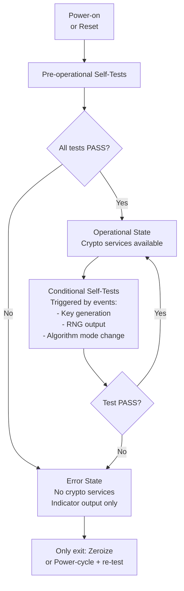
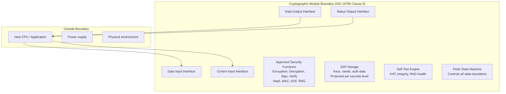
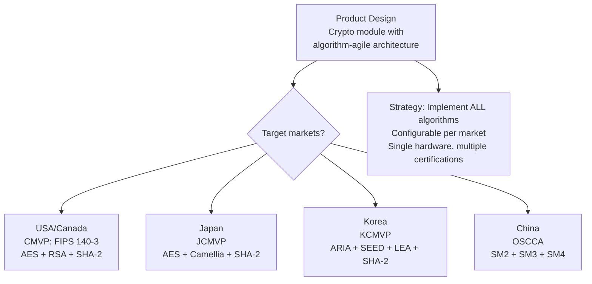

# ISO/IEC 19790 — Security Requirements for Cryptographic Modules

**Topic:** ISO/IEC 19790 International Cryptographic Module Standard — Requirements, Testing, and Alignment with FIPS 140-3  
**Standards:** ISO/IEC 19790:2012+Amd1:2015, ISO/IEC 24759:2017 (Test Requirements), ISO/IEC 19896 (Competence of Testers)  
**SDO:** ISO/IEC JTC 1/SC 27  
**Audience:** Cryptographic module designers, international compliance engineers, security evaluators, global product managers  
**Prerequisites:** Cryptography, module security concepts, familiarity with FIPS 140 framework

---

## Chapter 1 — Historical Context & Origin Story

### 1.1 Timeline

| Year | Event | Impact |
|------|-------|--------|
| 1994 | FIPS 140-1 (US-only standard) | First crypto module standard |
| 2001 | FIPS 140-2 (US-only) | De facto global standard (but US-governed) |
| 2006 | ISO/IEC 19790:2006 first published | International equivalent begins |
| 2012 | ISO/IEC 19790:2012 major revision | Becomes basis for FIPS 140-3 |
| 2015 | ISO/IEC 19790:2012 Amd1 | Corrections and clarifications |
| 2017 | ISO/IEC 24759:2017 | Test requirements (replaces ISO 24759:2008) |
| 2019 | FIPS 140-3 published (derived from 19790) | US standard now aligned with ISO |
| 2022+ | ISO/IEC 19790 revision discussions | Addressing PQC, updated attack models |

### 1.2 Relationship: ISO 19790 vs. FIPS 140-3

| Aspect | ISO/IEC 19790 | FIPS 140-3 |
|--------|--------------|-----------|
| Scope | International (ISO member countries) | USA + Canada (CMVP) |
| Content | Security requirements for crypto modules | Same (derived from ISO 19790) |
| Differences | Generic (no specific algorithm approval list) | Adds: NIST-approved algorithm list, SP 800-140 series |
| Testing | ISO/IEC 24759 (generic test methods) | ISO 24759 + SP 800-140 (CMVP-specific additions) |
| Certification | Each country's own scheme (JCMVP, KCMVP, etc.) | CMVP (NIST + CCCS) |
| Algorithm approval | No specific list (references national policies) | NIST approved algorithms only |

---

## Chapter 2 — Standard Architecture & Structure

### 2.1 ISO 19790 Structure

| Clause | Topic |
|--------|-------|
| 1-3 | Scope, references, definitions |
| 4 | Security levels (1-4) |
| 5 | Cryptographic module specification |
| 6 | Cryptographic module interfaces |
| 7 | Roles, services, authentication |
| 8 | Software/firmware security |
| 9 | Operational environment |
| 10 | Physical security |
| 11 | Non-invasive security |
| 12 | Sensitive security parameter management |
| 13 | Self-tests |
| 14 | Life-cycle assurance |
| 15 | Mitigation of other attacks |

### 2.2 Security Level Mapping

| Level | Physical | Authentication | Non-invasive | Environment |
|-------|----------|---------------|-------------|-------------|
| 1 | Production-grade | Role-based (implicit or explicit) | None | No restrictions |
| 2 | Tamper-evident (seals) | Role-based (explicit) | None | Evaluated OS (for SW) |
| 3 | Tamper-response + detection | Identity-based | Resistance required | Restricted environment |
| 4 | Environmental failure protection | Identity-based (MFA) | Full resistance + fault injection | Controlled environment |

---

## Chapter 3 — Technical Deep Dive

### 3.1 Module Types Defined in ISO 19790

| Type | Description | Example |
|------|-------------|---------|
| Hardware module | Physical boundary is hardware enclosure | HSM, TPM chip, crypto card |
| Software module | Boundary is software execution (process, container) | OpenSSL FIPS module, BoringCrypto |
| Firmware module | Code stored in hardware, not easily modifiable | Embedded crypto co-processor firmware |
| Hybrid software module | Software module using hardware-protected environment | SW in TEE (TrustZone) |
| Hybrid firmware module | Firmware with hardware-assisted protection | fTPM firmware in SoC |

### 3.2 Interface Requirements

| Interface | Level 1 | Level 2 | Level 3 | Level 4 |
|-----------|---------|---------|---------|---------|
| Data Input | Logically distinct | Logically distinct | Physically/logically distinct | Physically separate |
| Data Output | Logically distinct | Logically distinct | Physically/logically distinct | Physically separate |
| Control Input | Logically distinct | Logically distinct | Physically/logically distinct | Physically separate |
| Status Output | Logically distinct | Logically distinct | Physically/logically distinct | Physically separate |

### 3.3 Self-Test Requirements



**Pre-operational self-tests:**
- Known-answer tests (KAT) for each approved algorithm
- Module integrity test (HMAC/signature over code)
- Critical function tests (RNG health)

**Conditional self-tests:**
- Pairwise consistency test (after key pair generation)
- Continuous RNG test (each output)
- Software/firmware load test (if updatable)

### 3.4 SSP (Sensitive Security Parameter) Management

| SSP Type | Lifecycle Requirement |
|----------|---------------------|
| Secret key (symmetric) | Generated internally or imported encrypted → stored protected → zeroized when no longer needed |
| Private key (asymmetric) | Generated by approved method → never exported in plaintext → zeroized |
| Seed/entropy | From approved RNG → stored temporarily → zeroized after use |
| Authentication data | PIN/password stored in protected form → compared securely → zeroized after comparison |
| CSP (Critical Security Parameter) | Subset of SSP: keys, seeds that if disclosed compromise security |
| PSP (Public Security Parameter) | Public keys, certificates: need integrity protection (not confidentiality) |

---

## Chapter 4 — Implementation Guide

### 4.1 National Schemes Using ISO 19790

| Country | Scheme Name | Based On | Additional Requirements |
|---------|------------|----------|------------------------|
| USA + Canada | CMVP (FIPS 140-3) | ISO 19790 + SP 800-140 series | NIST approved algorithms only |
| Japan | JCMVP | ISO 19790 | JIS standards reference, JCATT testing |
| South Korea | KCMVP | ISO 19790 (adapted) | KISA algorithms (ARIA, SEED, LEA) |
| France | ANSSI QR | ISO 19790 + ANSSI requirements | French-specific crypto recommendations |
| Germany | BSI TR-02102 | ISO 19790 (reference) | BSI algorithm recommendations |
| Australia | ASD (ACSC) | FIPS 140-2/3 (accepted) | Follows CMVP directly |
| Singapore | CSA | ISO 19790 + local | NIST alignment |

### 4.2 Cross-Recognition

```mermaid
graph TB
    A[Product with CMVP Certificate<br/>FIPS 140-3 validated] --> B{Accepted in Japan?}
    B -->|Partially| C[JCMVP may accept CMVP evidence<br/>But requires Japanese evaluation]
    
    A --> D{Accepted in Korea?}
    D -->|No: different algorithms| E[Must get KCMVP<br/>Requires ARIA/SEED/LEA support]
    
    A --> F{Accepted in EU?}
    F -->|Reference only| G[EU uses CC (ISO 15408)<br/>FIPS 140-3 is supplementary evidence]
```

### 4.3 Mapping to Product Design

| Design Decision | ISO 19790 Clause | Impact |
|----------------|-------------------|--------|
| Module boundary definition | Clause 5 | MOST CRITICAL: defines what's tested |
| Physical enclosure design | Clause 10 | Level 3+: tamper-response mechanism |
| Algorithm selection | Clause 12 + national policy | Must use nationally-approved algorithms |
| Self-test implementation | Clause 13 | KAT per algorithm, integrity check |
| Key storage design | Clause 12 | CSPs must be protected at module's security level |
| RNG design | Clause 12 | Approved DRBG + entropy source assessment |
| Firmware update mechanism | Clause 8/14 | Must maintain module integrity post-update |

---

## Chapter 5 — Certification & Audit

### 5.1 Testing Process (ISO 24759)

| Phase | Activity | Duration |
|-------|----------|----------|
| 1 | Lab review of documentation (Security Policy, FSM, design) | 2-8 weeks |
| 2 | Algorithm testing (CAVP equivalent or national algorithm test) | 2-4 weeks |
| 3 | Module testing (self-tests, interfaces, roles, services) | 4-12 weeks |
| 4 | Physical security testing (Level 2+: tamper evidence/response) | 2-8 weeks |
| 5 | Non-invasive testing (Level 3+: SCA resistance) | 4-12 weeks |
| 6 | Write evaluation report | 2-4 weeks |
| 7 | Certification body review | 4-24 weeks (depends on backlog) |

### 5.2 Documentation Requirements

| Document | Content | Level |
|----------|---------|-------|
| Security Policy | Public: module description, boundary, services, levels | All |
| Finite State Model | All states and transitions | All |
| Design specification | Architecture, data flow, interfaces | Level 2+ |
| Source code / HDL | Implementation for review | Level 3+ |
| Entropy Assessment | SP 800-90B or equivalent | All (with TRNG) |
| Physical security spec | Tamper mechanisms (Level 2+) | Level 2+ |
| Test evidence | Developer test results | All |

---

## Chapter 6 — Regional & Domain Variants

### 6.1 Algorithm Requirements by Scheme

| Scheme | Symmetric | Hash | Asymmetric | Notes |
|--------|-----------|------|------------|-------|
| CMVP (USA) | AES, 3TDEA (deprecated) | SHA-2, SHA-3 | RSA-2048+, ECDSA P-256+ | NIST-only algorithms |
| KCMVP (Korea) | ARIA, SEED, LEA, AES | SHA-2, LSH | RSA, ECDSA, KCDSA | Korean national algorithms required |
| JCMVP (Japan) | AES, Camellia | SHA-2, SHA-3 | RSA, ECDSA | Camellia (Japanese algorithm) accepted |
| China (OSCCA) | SM4 | SM3 | SM2, SM9 | Chinese national algorithms REQUIRED |
| France (ANSSI) | AES | SHA-2, SHA-3 | RSA, ECC (FRP256v1) | French curve accepted |

---

## Chapter 7 — Comparison: International Crypto Module Schemes

| Feature | CMVP (FIPS 140-3) | JCMVP | KCMVP | CC (ISO 15408) |
|---------|-------------------|-------|-------|----------------|
| Basis | ISO 19790 + SP 800-140 | ISO 19790 | Modified ISO 19790 | ISO 15408 (different standard) |
| Focus | Crypto module only | Crypto module only | Crypto module only | Entire product security |
| Levels | 4 levels | 4 levels | 3 levels | 7 EAL levels |
| Duration | 12-36 months | 6-18 months | 3-12 months | 3-60 months |
| Cost | $50K-800K | $30K-200K | $20K-100K | $50K-5M |
| Mutual recognition | USA + Canada + references | Japan only | Korea only | 31 CCRA countries |
| Algorithm validation | CAVP (automated) | JCATT | KCMVP algo test | Part of evaluation |

---

## Chapter 8 — Mermaid Architecture Diagrams

### 8.1 ISO 19790 Module Boundary Concept



### 8.2 Multi-Country Certification Strategy



---

## Chapter 9 — Case Studies & Failure Analysis

### 9.1 Multi-Market HSM: Achieving CMVP + JCMVP + KCMVP

**Challenge:** Enterprise HSM vendor needs certification in USA (CMVP), Japan (JCMVP), and Korea (KCMVP) simultaneously.

**Architecture decision:**
- Hardware platform: single HSM design with algorithm-agile crypto engine
- Supported algorithms: AES + RSA + ECC + SHA-2 (CMVP) + Camellia (JCMVP) + ARIA + SEED + LEA + KCDSA (KCMVP)
- KAT self-tests: for ALL implemented algorithms (increases boot time by 2 seconds)
- Security Policy: three versions (one per scheme, different algorithm lists)

**Execution:**
- Lab testing: coordinated with NVLAP lab (CMVP), JCATT lab (JCMVP), KISA lab (KCMVP)
- Shared evidence: physical security assessment (identical hardware) → shared across schemes
- Algorithm-specific testing: run separately per scheme
- Total time: 24 months (staggered submissions)
- Total cost: ~$600K (combined, significant savings from shared hardware evidence)

### 9.2 Algorithm Sunset Challenge

**Problem:** Crypto module certified 2018 (FIPS 140-2) includes 3TDEA (Triple DES) as an approved algorithm. NIST deprecated 3TDEA after 2023 (for new encryption). Module's FIPS cert references 3TDEA.

**Impact:** Certificate remains valid but module can no longer use 3TDEA for new encryption (only decryption of legacy data). Any update to the module requires removing 3TDEA from approved services.

**Lesson for ISO 19790:** Design crypto modules with algorithm removal capability. Algorithm-agile architecture allows disabling algorithms via configuration without hardware change. Plan for sunset: certification documents should clearly separate mandatory vs. optional algorithms.

---

## Chapter 10 — Future Evolution & Industry Trends

| Trend | Impact on ISO 19790 |
|-------|---------------------|
| ISO 19790 revision (next edition) | PQC algorithms, updated attack models |
| Harmonization with FIPS 140-3 | Closer alignment of test procedures |
| Automated testing | Reduce certification time and cost |
| PQC integration | ML-KEM, ML-DSA must be added to algorithm lists |
| Cloud/virtual modules | Clear guidance for multi-tenant crypto module boundary |
| IoT lightweight crypto | Smaller module profiles (constrained devices) |
| National algorithm proliferation | More countries defining national algorithms → complexity |
| Mutual recognition expansion | Efforts to establish cross-scheme recognition |

---

## Chapter 11 — Interview Questions & Career Guide

### Tier 1: Entry-Level (0-3 years)

**Q1:** What is ISO/IEC 19790 and how does it relate to FIPS 140-3?  
**A:** ISO/IEC 19790 is the international standard defining security requirements for cryptographic modules. It specifies 4 security levels (similar to FIPS 140) covering physical security, key management, self-tests, interfaces, and non-invasive attack resistance. FIPS 140-3 (NIST) is DERIVED FROM ISO 19790 — it takes the same structure but adds US-specific requirements: only NIST-approved algorithms, testing conducted through CMVP, SP 800-140 series provides additional implementation guidance. In practice: if you design to ISO 19790 requirements, you're 90% of the way to FIPS 140-3 compliance. The remaining 10% is algorithm-specific (must use NIST algorithms) and CMVP-specific testing procedures. Other countries also reference ISO 19790: Japan (JCMVP), Korea (KCMVP) each add their own national algorithm requirements on top.

### Tier 2: Mid-Level (3-8 years)

**Q2:** Your company needs crypto module certification in USA, Japan, and Korea. Describe the architecture choices that minimize total certification effort.  
**A:** **(1) Single hardware, algorithm-agile:** Design one crypto module hardware that supports ALL required algorithms: USA: AES, SHA-2/3, RSA, ECDSA (NIST curves). Japan: add Camellia (Japanese block cipher). Korea: add ARIA, SEED, LEA (Korean block ciphers), KCDSA (Korean signature). Implementation: use programmable crypto engine or include all algorithm accelerators. **(2) Shared physical security assessment:** Physical security testing (tamper evidence/response) is hardware-dependent. Same hardware → test once, share evidence across all three certifications. This saves ~30% of total testing cost. **(3) Separate algorithm validation:** Each scheme has its own algorithm validation (CAVP for CMVP, JCATT for JCMVP, KISA for KCMVP). Must run separately. Cannot share. **(4) Three Security Policies (documentation):** Each scheme requires a Security Policy listing approved algorithms and services. Write three versions referencing the same module, different algorithm sets. **(5) Lab coordination:** Ideally, use a lab accredited by multiple schemes (some exist). Or coordinate closely between labs to avoid conflicting requirements. **(6) Timeline management:** Start with the longest process (CMVP: 24-36 months). Japan and Korea can start in parallel (shorter cycles). **(7) Future-proofing:** Include PQC algorithm support (ML-KEM, ML-DSA) — even if not yet required by all schemes. When schemes add PQC, you can certify quickly. **(8) Cost estimate:** single design → $400-600K total vs. three separate designs → $1.2-1.8M+.

---

## Chapter 12 — Cheat Sheet & Quick Reference

### ISO 19790 vs. FIPS 140-3 Mapping

```
ISO 19790 Clause    | FIPS 140-3 Area           | SP 800-140x
Clause 5: Module spec    | Module specification      | SP 800-140A
Clause 6: Interfaces     | Module interfaces         | —
Clause 7: Roles/Auth     | Roles, services, auth     | SP 800-140E
Clause 8: SW/FW security | Software/firmware         | —
Clause 9: Op environment | Operational environment   | —
Clause 10: Physical      | Physical security         | SP 800-140D
Clause 11: Non-invasive  | Non-invasive security     | SP 800-140F
Clause 12: SSP mgmt      | SSP management            | —
Clause 13: Self-tests    | Self-tests                | SP 800-140C
Clause 14: Life-cycle    | Life-cycle assurance      | —
Clause 15: Other attacks | Mitigation of other       | —
```

### National Scheme Quick Reference

```
USA/Canada:  CMVP, FIPS 140-3, NIST algorithms, CAVP
Japan:       JCMVP, ISO 19790, AES+Camellia, JCATT
Korea:       KCMVP, ISO 19790 (modified), ARIA+SEED+LEA
China:       OSCCA, GM/T 0028, SM2/SM3/SM4 (mandatory)
France:      ANSSI QR, ISO 19790 (reference), AES+French curves
Germany:     BSI TR-02102 (recommendations), CC primarily
```

---

*End of Document — 03_ISO_IEC_19790_Crypto_Modules.md*
