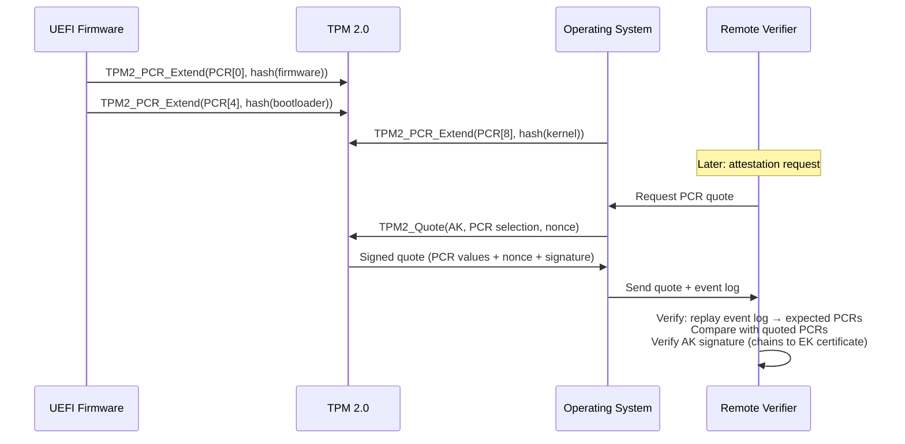
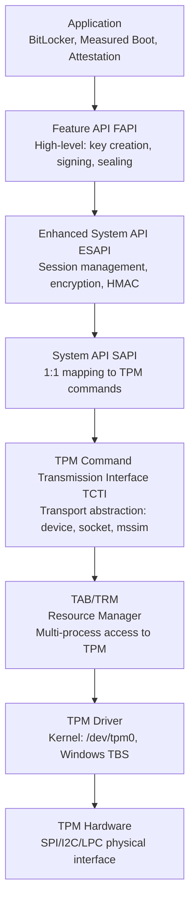
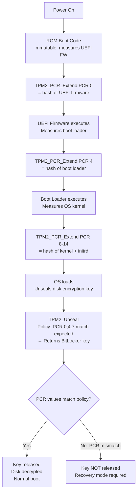
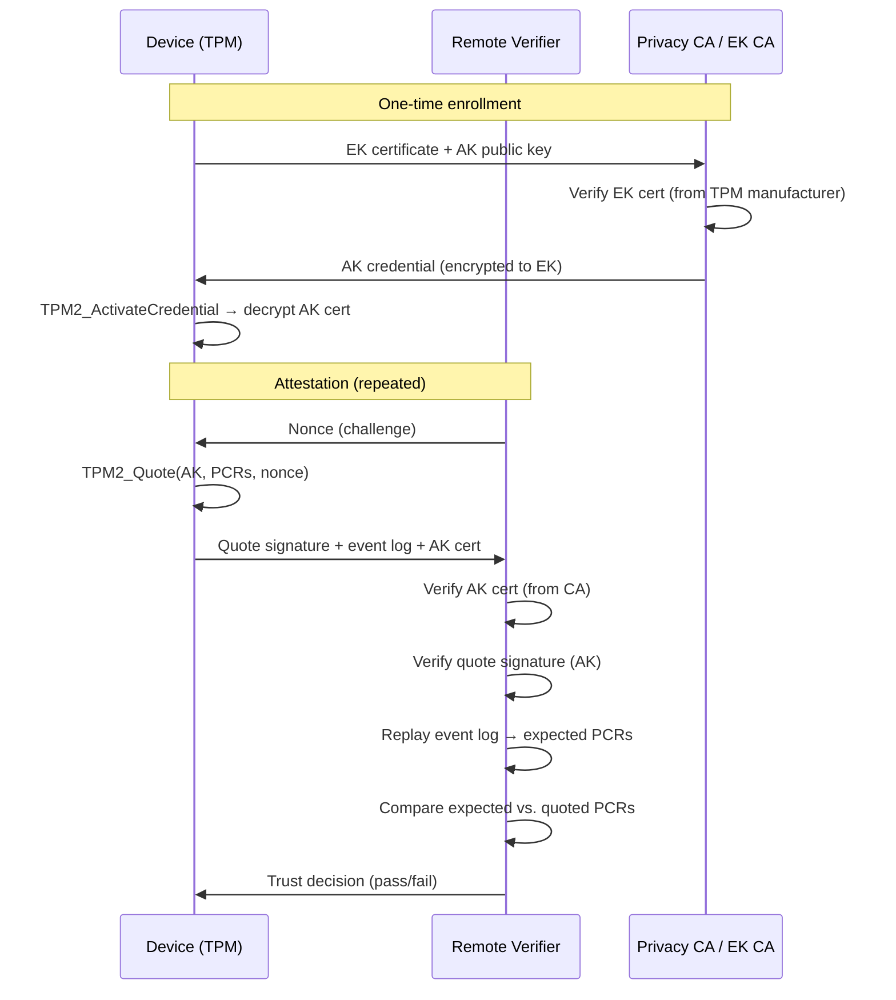

# TPM 2.0 — Trusted Platform Module

**Topic:** TPM 2.0 Architecture, Commands, Platform Integration, and Attestation  
**Standards:** TCG TPM 2.0 Library Specification (Parts 1-4), ISO/IEC 11889:2015, TCG PC Client Platform Firmware Profile  
**SDO:** TCG (Trusted Computing Group), ISO/IEC  
**Audience:** Platform security architects, firmware/BIOS engineers, OS security developers, embedded security engineers  
**Prerequisites:** Cryptography (RSA, ECC, SHA), secure boot concepts, platform firmware (UEFI)

---

## Chapter 1 — Historical Context & Origin Story

### 1.1 Timeline

| Year | Event | Impact |
|------|-------|--------|
| 1999 | TCPA (Trusted Computing Platform Alliance) formed | Industry consortium for trusted computing |
| 2003 | TCG (Trusted Computing Group) replaces TCPA | Broader scope, more members |
| 2004 | TPM 1.1b specification | First widely deployed TPM (Infineon, Atmel) |
| 2006 | TPM 1.2 specification | Added DAA (Direct Anonymous Attestation) |
| 2009 | Windows Vista/7: BitLocker uses TPM | First mass-market TPM usage |
| 2014 | TPM 2.0 specification published | Major redesign: algorithm agility, multiple hierarchies |
| 2015 | ISO/IEC 11889:2015 (TPM 2.0 as ISO standard) | International standardization |
| 2016 | Windows 10: TPM 2.0 required for certification | OEM mandate drives adoption |
| 2019 | fTPM (firmware TPM) widespread | Intel PTT, AMD fTPM: no discrete chip needed |
| 2021 | Windows 11: TPM 2.0 mandatory | Universal PC requirement |
| 2024 | TPM 2.0 v1.83 (latest revision) | Enhanced PQC awareness, updated algorithms |

### 1.2 TPM 1.2 vs. TPM 2.0

| Feature | TPM 1.2 | TPM 2.0 |
|---------|---------|---------|
| Algorithms | RSA-2048, SHA-1 only | Algorithm agile: RSA, ECC, SHA-256/384/512, AES, SM2/SM3/SM4 |
| Hierarchies | Single owner + SRK | Multiple: Platform, Storage, Endorsement, Null |
| PCR banks | 24 PCRs (SHA-1) | Multiple banks (SHA-256 + SHA-384 simultaneously) |
| Authorization | OIAP/OSAP (complex) | Enhanced Authorization (EA): policy-based |
| Key types | Fixed (storage keys, signing keys) | Flexible (restricted/unrestricted, sign/decrypt/certify) |
| NV storage | Simple NV Index | NV with authorization policies, counters, extend |
| Session encryption | Limited | Full parameter encryption (encrypt/decrypt sessions) |

---

## Chapter 2 — Standard Architecture & Structure

### 2.1 TPM 2.0 Architecture

```mermaid
graph TB
    subgraph "TPM 2.0 Internal Architecture"
        A[Command Interface<br/>Command buffer / Response buffer]
        B[Cryptographic Engine<br/>RSA, ECC, AES, SHA<br/>Asymmetric + Symmetric]
        C[Random Number Generator<br/>Hardware TRNG + DRBG]
        D[Key Management<br/>Hierarchies: Platform, Storage, Endorsement, Null]
        E[Platform Configuration Registers<br/>PCR[0] through PCR[23]<br/>Multiple hash banks]
        F[Non-Volatile Storage<br/>NV Indexes, persistent objects]
        G[Authorization Subsystem<br/>Enhanced Authorization EA<br/>Policy-based access control]
    end
    
    subgraph "External Interfaces"
        H[Host Interface<br/>SPI / I2C / LPC / MMIO]
        I[Platform Firmware<br/>UEFI / BIOS]
        J[Operating System<br/>TPM driver + TSS]
    end
    
    H --> A
    I --> H
    J --> H
```

### 2.2 TPM Hierarchies

| Hierarchy | Purpose | Primary Key | Control |
|-----------|---------|-------------|---------|
| **Platform** | Platform manufacturer control | Platform primary seed | OEM (firmware access) |
| **Storage** | Owner/user data protection | Storage Root Key (SRK) | Owner (OS/user) |
| **Endorsement** | Device identity / attestation | Endorsement Key (EK) | Privacy-sensitive (CA) |
| **Null** | Ephemeral operations | Ephemeral primary | Anyone (no auth) |

### 2.3 PCR (Platform Configuration Registers)

| PCR | Measured Component | Extended By |
|-----|-------------------|-------------|
| PCR[0] | BIOS/UEFI firmware code | UEFI firmware |
| PCR[1] | BIOS/UEFI configuration | UEFI firmware |
| PCR[2] | Option ROMs | UEFI firmware |
| PCR[3] | Option ROM configuration | UEFI firmware |
| PCR[4] | MBR / Boot loader code | UEFI firmware / boot manager |
| PCR[5] | MBR / Boot loader config (GPT) | UEFI firmware |
| PCR[6] | Platform state (resume, S4) | UEFI firmware |
| PCR[7] | Secure Boot state | UEFI Secure Boot |
| PCR[8-15] | OS-specific (Linux IMA, etc.) | Operating system |
| PCR[16] | Debug PCR | Testing |
| PCR[17-22] | DRTM (Dynamic Root of Trust) | Intel TXT / AMD SEV |
| PCR[23] | Application-specific | Applications |

**PCR Extend operation:**
$$PCR_{new} = Hash(PCR_{old} \| measurement)$$

PCRs can only be extended (never directly written). This creates a chain: the final PCR value represents the ENTIRE measurement sequence.

---

## Chapter 3 — Technical Deep Dive

### 3.1 Key Types and Properties

| Property | Options | Description |
|----------|---------|-------------|
| Type | Asymmetric / Symmetric | RSA, ECC / AES, HMAC |
| Restricted | Yes / No | Restricted: can only sign data structures from TPM (attestation). Unrestricted: sign anything |
| Decrypt | Yes / No | Can be used for decryption operations |
| Sign | Yes / No | Can be used for signing operations |
| fixedTPM | Yes / No | Key cannot be duplicated outside this TPM |
| fixedParent | Yes / No | Key cannot be moved to different parent |
| sensitiveDataOrigin | Yes / No | Private key generated internally by TPM |
| userWithAuth | Yes / No | User can authorize with password |

**Common Key Configurations:**

| Key Role | Type | Restricted | Fixed | Use |
|----------|------|-----------|-------|-----|
| Endorsement Key (EK) | RSA-2048/ECC-P256 | Restricted Decrypt | fixedTPM | Device identity, privacy CA |
| Attestation Key (AK) | RSA-2048/ECC-P256 | Restricted Sign | fixedTPM | PCR quotes, certification |
| Storage Key | RSA-2048/ECC-P256 | Restricted Decrypt | fixedTPM | Wrap (protect) other keys |
| Signing Key | RSA/ECC | Unrestricted Sign | configurable | General-purpose signing |
| Sealing Key | Symmetric | — | fixedTPM | Seal/unseal data to PCR state |

### 3.2 Measured Boot / Attestation



### 3.3 Sealing (Binding Data to Platform State)

**Concept:** Encrypt data such that it can ONLY be decrypted when TPM PCRs match specific values (= platform is in known-good state).

**Use case:** BitLocker disk encryption key sealed to PCR[7] (Secure Boot state). If Secure Boot is disabled or firmware is modified → PCRs change → TPM refuses to unseal → disk remains encrypted.

```
Seal:
  TPM2_Create(parentKey, sensitiveData, policy: PCR[7]=expected_value)
  → Returns: encrypted blob (only TPM can decrypt, only if PCR matches)

Unseal:
  TPM2_Unseal(sealedObject, authSession with policy satisfied)
  → Returns: plaintext data (ONLY if current PCR[7] == expected value)
```

### 3.4 Enhanced Authorization (EA) Policies

| Policy Command | Purpose |
|---------------|---------|
| TPM2_PolicyPCR | Require specific PCR values |
| TPM2_PolicyPassword | Require password |
| TPM2_PolicyAuthValue | Require HMAC auth |
| TPM2_PolicyLocality | Restrict to specific TPM locality (DRTM) |
| TPM2_PolicyNV | Condition on NV index value |
| TPM2_PolicyOR | OR combination of policies |
| TPM2_PolicyCommandCode | Restrict to specific TPM command |
| TPM2_PolicyCounterTimer | Time-based restrictions |
| TPM2_PolicySecret | Require authorization from another key |

**Example policy (BitLocker-like):**
```
PolicyPCR(PCR[7] == Secure_Boot_enabled)
AND PolicyPCR(PCR[11] == BitLocker_config_hash)
AND PolicyLocality(locality 0)
```

---

## Chapter 4 — Implementation Guide

### 4.1 TPM Form Factors

| Form Factor | Description | Performance | Security Level |
|-------------|-------------|-------------|---------------|
| Discrete TPM (dTPM) | Separate chip on motherboard (SPI/I2C) | Slow (bus limited) | High (separate attack surface) |
| Firmware TPM (fTPM) | Runs in TEE of main SoC (ARM TrustZone, Intel ME) | Fast (on-die) | Medium (shares SoC) |
| Integrated TPM (iTPM) | Dedicated on-die module in SoC | Fast (on-die) | High (dedicated) |
| Virtual TPM (vTPM) | Software emulation for VMs | Fast | Low (software only) |
| Hypervisor TPM | TPM service from hypervisor | Medium | Depends on hypervisor security |

### 4.2 TPM Software Stack (TSS)



### 4.3 TPM Integration for Automotive

| Use Case | TPM Feature Used |
|----------|-----------------|
| Secure Boot (ECU) | PCR measurement + sealing FW decryption key to PCR state |
| V2X identity | EK-based device identity + attestation certificate |
| OTA update verification | Signing key attestation (prove key is in TPM, not extractable) |
| Odometer protection | Monotonic NV counter (increment-only, tamper-resistant) |
| Fleet management | Remote attestation (prove ECU firmware is authentic) |
| Key storage (TLS) | Storage hierarchy: TLS private key wrapped by SRK |

---

## Chapter 5 — Certification & Audit

### 5.1 TPM Certification Landscape

| Certification | Requirement | Common Level |
|---------------|------------|--------------|
| TCG TPM 2.0 compliance | Passes TCG compliance test suite | Required for TPM branding |
| Common Criteria | EAL 4+ for TPM chip | BSI PP-0084 or equivalent |
| FIPS 140-2/3 | Crypto module validation | Level 2 (typical for discrete TPM) |
| Windows Hardware Lab Kit | Microsoft certification testing | Required for Windows certification |
| Automotive (AEC-Q100) | For discrete TPM in vehicle | Grade 2 or Grade 3 |

---

## Chapter 6 — Regional & Domain Variants

| Region/Domain | TPM Status | Notes |
|---------------|-----------|-------|
| US/Europe (PC) | Mandatory (Windows 11) | Discrete or fTPM |
| US Government | Required (NIST SP 800-155) | Measured boot with TPM attestation |
| China | TCM (Trusted Cryptography Module) | Chinese equivalent (SM2/SM3/SM4 algorithms) |
| Automotive | Growing adoption | ISO 26262 + TPM for secure boot, V2X identity |
| IoT/Embedded | Partial (ARM PSA + DICE as alternative) | TPM too large for constrained devices → DICE |
| Cloud/Data center | vTPM for VMs | Each VM gets virtual TPM instance |

---

## Chapter 7 — Comparison: TPM vs. Alternatives

| Feature | TPM 2.0 | ARM TrustZone | Intel SGX | DICE (TCG) | SE (Secure Element) |
|---------|---------|---------------|-----------|------------|-------------------|
| Form factor | Discrete chip or fTPM | CPU feature (built-in) | CPU enclave | Minimal HW (ROM + seed) | Separate chip (NFC/contact) |
| Key storage | NV + wrapped keys | Secure world memory | Enclave memory | Derived keys only | Secure NV |
| Attestation | PCR Quote (remote) | Proprietary | DCAP remote attestation | CDI certificate chain | Certificate-based |
| Algorithm support | RSA, ECC, AES, SHA | All (CPU-native) | All (CPU) | SHA-256 / HMAC | ECC, AES, RSA |
| Standardization | TCG / ISO 11889 | ARM specification | Intel specification | TCG DICE | GP / ISO 7816 |
| Size (gate count) | 100K-500K gates | 0 (CPU feature) | 0 (CPU feature) | <10K gates | 50K-200K gates |
| Best for | PC platform integrity | Mobile/embedded TEE | Cloud confidential compute | IoT device identity | Payment, NFC, identity |

---

## Chapter 8 — Mermaid Architecture Diagrams

### 8.1 TPM-Based Secure Boot Flow



### 8.2 Remote Attestation Protocol



---

## Chapter 9 — Case Studies & Failure Analysis

### 9.1 TPM Bus Sniffing Attack (BitLocker Bypass)

**Attack (2021):** Researcher demonstrates: discrete TPM connected via SPI/LPC bus to CPU. During boot, CPU requests TPM2_Unseal → TPM sends BitLocker Volume Master Key (VMK) in plaintext over the bus. Attacker with physical access + logic analyzer captures VMK.

**Root cause:** Communication between CPU and discrete TPM is unencrypted by default. TPM2_Unseal response contains the sealed secret in plaintext on the bus.

**Mitigations:**
1. **Parameter encryption:** TPM 2.0 supports encrypted sessions (TPM2_StartAuthSession with encryptDecrypt=TRUE). Must be implemented by OS. Windows added this for newer systems.
2. **fTPM:** Use firmware TPM (Intel PTT, AMD fTPM). Key material never crosses an exposed bus (stays within SoC).
3. **PIN-based sealing:** Add TPM2_PolicyAuthValue (require PIN at boot). Even if VMK is captured, attacker needs PIN to derive the actual key.
4. **Pre-boot authentication:** Require user presence before TPM unseals key.

### 9.2 fTPM Voltage Glitching Attack (faulTPM, 2023)

**Attack:** Researchers demonstrated that AMD fTPM (running in PSP/ASP ARM core) is vulnerable to voltage fault injection. By precisely glitching the SoC voltage during TPM command execution, they could bypass authorization checks and extract sealed secrets.

**Impact:** fTPM trusted as equivalent to discrete TPM → but physically attacking the main SoC CAN compromise fTPM.

**Mitigations:**
- AMD released PSP firmware updates with glitch detection
- Defense in depth: combine TPM sealing with PIN (even if TPM is compromised, attacker needs PIN)
- For high-security: use discrete TPM with its own tamper-response mechanism
- Long-term: SoC manufacturers adding voltage glitch sensors to PSP subsystem

---

## Chapter 10 — Future Evolution & Industry Trends

| Trend | Impact on TPM |
|-------|---------------|
| Post-Quantum Cryptography | TPM 2.0 spec adding ML-KEM, ML-DSA algorithm support |
| TPM for automotive/IoT | Smaller TPM implementations for constrained environments |
| DICE integration | DICE provides initial identity → TPM provides operational security |
| Confidential computing | TPM attestation integral to VM confidential boot (SEV, TDX) |
| Supply chain security | TPM EK + attestation proves hardware authenticity |
| Passkey / FIDO2 | TPM as FIDO2 authenticator (hardware-bound passkey) |
| Windows Pluton | Microsoft's integrated security processor (fTPM successor) |
| Measured boot standardization | Linux IMA/EVM + TPM becoming universal |

---

## Chapter 11 — Interview Questions & Career Guide

### Tier 1: Entry-Level (0-3 years)

**Q1:** What is a TPM and what are PCRs? How does measured boot work?  
**A:** **TPM (Trusted Platform Module):** A dedicated security chip (or firmware component) that provides hardware-rooted cryptographic services: key generation/storage, random numbers, sealing, attestation. Keys stored in TPM cannot be extracted (hardware-protected). **PCRs (Platform Configuration Registers):** Special registers inside TPM (typically 24 per hash bank). They can only be EXTENDED (not directly written): $PCR_{new} = SHA256(PCR_{old} \| new\_measurement)$. This means the final PCR value represents the ENTIRE boot chain — any change anywhere changes the final value. **Measured boot:** Each boot stage (firmware → bootloader → kernel) MEASURES (hashes) the next stage BEFORE executing it, extending the hash into a PCR. The TPM accumulates these measurements. Later, the final PCR values can be QUOTED (signed by TPM) and sent to a remote verifier, who replays the event log and confirms: "this platform booted exactly these components, in this order." This is attestation — proving WHAT software is running without modifying it.

### Tier 2: Mid-Level (3-8 years)

**Q2:** Explain TPM 2.0 Enhanced Authorization (EA) policies. How would you design a policy that allows a key to be used only when the platform is in a specific boot state AND a specific user authenticates?  
**A:** **Enhanced Authorization (EA):** TPM 2.0's flexible policy engine. A policy is a sequence of policy commands that define conditions. When using a key, the caller must satisfy the policy (start a policy session and execute the same policy commands with current values matching). The TPM computes a policyDigest from the policy commands — stored with the key at creation time. At usage time, the session policyDigest must match. **Compound policy (PCR + auth):** Goal: Key usable only if (1) PCR[7] == known_Secure_Boot_value AND (2) user provides correct password. *Design:* At key creation: `TPM2_PolicyPCR(sessionHandle, pcrDigest=expected, pcrSelection=PCR7)` then `TPM2_PolicyAuthValue(sessionHandle)`. The resulting policyDigest is stored with the key. At usage time: Start policy session: `TPM2_StartAuthSession(type=POLICY)`. Execute same policy commands: `TPM2_PolicyPCR(session, expected PCR7 digest, PCR7)` — TPM checks current PCR[7] matches expected. If not → session fails. `TPM2_PolicyAuthValue(session)` — tells TPM the command's authValue (password) HMAC must be validated. Now execute the command (e.g., TPM2_Sign) with this session + HMAC of password. TPM verifies: session policyDigest matches key's authPolicy AND HMAC validates password. **Key property:** If EITHER condition is not met (wrong boot state OR wrong password), the key cannot be used. The policy is enforced entirely in TPM hardware — no software bypass possible.

---

## Chapter 12 — Cheat Sheet & Quick Reference

### Essential TPM 2.0 Commands

```
TPM2_CreatePrimary   — Create primary key from hierarchy seed
TPM2_Create          — Create child key under a parent
TPM2_Load            — Load key into TPM for use
TPM2_Sign            — Sign data with loaded key
TPM2_VerifySignature — Verify signature
TPM2_RSA_Encrypt/Decrypt — Asymmetric encrypt/decrypt
TPM2_PCR_Extend      — Extend measurement into PCR
TPM2_PCR_Read        — Read current PCR values
TPM2_Quote           — Sign PCR values (attestation)
TPM2_Seal (Create with data) — Seal secret to policy
TPM2_Unseal          — Unseal secret (if policy satisfied)
TPM2_NV_Write/Read   — Non-volatile storage access
TPM2_GetRandom       — Get random bytes from TPM TRNG
TPM2_StartAuthSession — Begin auth session (HMAC or policy)
TPM2_PolicyPCR       — Policy: require specific PCR state
TPM2_PolicyAuthValue — Policy: require password/HMAC
```

### PCR Usage (PC Client Platform)

```
PCR[0]:  UEFI firmware code
PCR[1]:  UEFI firmware config
PCR[4]:  Boot loader (GRUB, Windows Boot Manager)
PCR[5]:  GPT / boot configuration
PCR[7]:  Secure Boot policy (UEFI variables)
PCR[8-15]: OS-defined (IMA, dm-verity)
PCR[17-22]: DRTM (Intel TXT, AMD SEV)
```

### TPM Hierarchies

```
Platform:     OEM control (firmware access)     — Platform auth
Storage:      Owner/user control (OS access)    — Storage Root Key (SRK)
Endorsement:  Device identity (privacy-critical) — Endorsement Key (EK)
Null:         Ephemeral (anyone, no persistence) — Session keys
```

---

*End of Document — 04_TPM_2_0_TCG_Specification.md*
