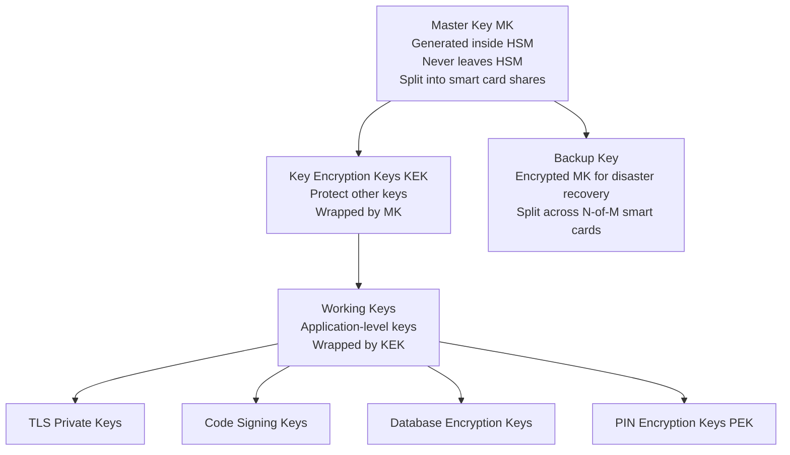
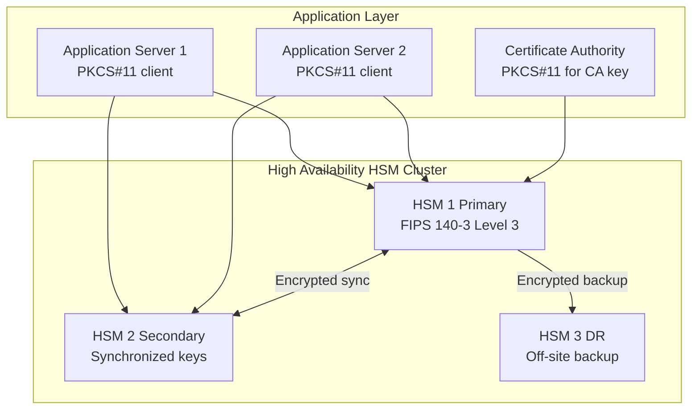
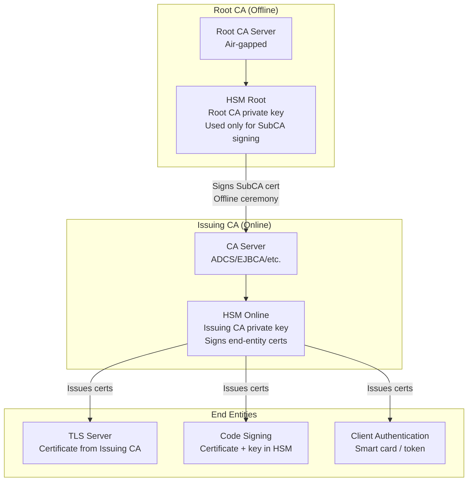
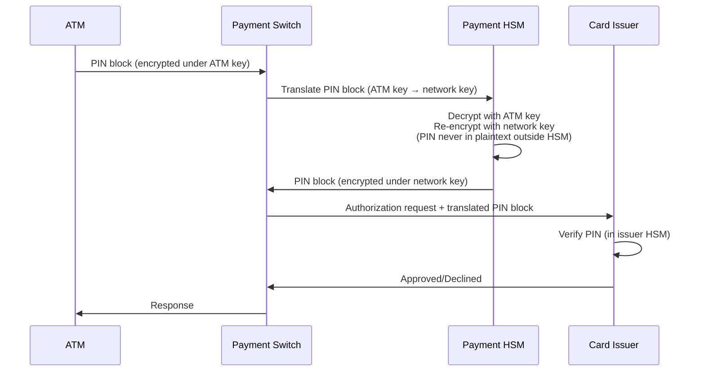

# HSM Standards and Design

**Topic:** Hardware Security Modules — Architecture, Certification, Key Management, and Deployment  
**Standards:** FIPS 140-3 Level 3/4, PCI HSM (PCI PTS), EN 419221-5, Common Criteria PP for HSM  
**SDO:** NIST, PCI SSC, CEN/CENELEC, TCG  
**Audience:** Security architects, key management engineers, payment security specialists, PKI infrastructure engineers  
**Prerequisites:** Cryptography, FIPS 140-3 concepts, key management, PKI

---

## Chapter 1 — Historical Context & Origin Story

### 1.1 Timeline

| Year | Event | Impact |
|------|-------|--------|
| 1970s | IBM develops first hardware crypto modules for banking | Origin of HSM concept |
| 1980s | PIN verification modules for ATM networks | Dedicated payment HSMs |
| 1990s | FIPS 140-1 drives standardization | Government crypto module requirements |
| 2001 | FIPS 140-2 → HSM market explosion | Thales, nCipher, Utimaco grow |
| 2005 | PCI DSS references HSM for key protection | Payment industry mandate |
| 2012 | Cloud HSM services emerge (AWS CloudHSM) | HSM-as-a-Service |
| 2015 | nCipher acquired by Thales → Luna + nShield | Market consolidation |
| 2019 | FIPS 140-3 published | New certification baseline |
| 2020s | Cloud-native HSM, KMS integration, PQC readiness | Modern HSM evolution |

### 1.2 HSM Use Cases

| Domain | Use Case | HSM Role |
|--------|----------|----------|
| Payment (PCI) | PIN translation, card verification | Generate/store PIN encryption keys |
| PKI / Certificate Authority | Root CA key protection | Sign certificates, protect CA private key |
| Code signing | Software/firmware signature | Protect code-signing private keys |
| Database encryption (TDE) | Encrypt database master key | HSM holds Master Encryption Key (MEK) |
| TLS/SSL offloading | Protect TLS private keys | HSM performs TLS handshake signing |
| Blockchain / Digital assets | Protect wallet private keys | Transaction signing in HSM |
| Government / Defense | Classified data encryption | Encrypt/decrypt communications |
| Automotive (V2X) | V2X pseudonym key generation | Batch key generation for vehicles |

---

## Chapter 2 — Standard Architecture & Structure

### 2.1 HSM Internal Architecture

```mermaid
graph TB
    subgraph "HSM Physical Boundary (Tamper-Responsive)"
        A[Host Interface<br/>PCIe, USB, Ethernet<br/>or Serial]
        B[Command Processor<br/>Parse commands, enforce policy]
        C[Cryptographic Engine<br/>AES, RSA, ECC accelerators<br/>SHA, HMAC, DRBG]
        D[Key Storage<br/>Battery-backed SRAM<br/>Zeroizes on tamper]
        E[True RNG<br/>Physical entropy source]
        F[Tamper Detection<br/>Mesh, temperature, voltage<br/>Intrusion sensors]
        G[Firmware<br/>Signed, integrity-checked<br/>Updateable (authenticated)]
    end
    
    subgraph "Tamper Response"
        F --> H[Zeroize Circuit<br/>Destroy all keys<br/>in < 10ms on tamper]
        H --> D
    end
    
    A --> B --> C
    C --> D
    C --> E
```

### 2.2 HSM Categories

| Category | Form Factor | Typical Use | Examples |
|----------|-------------|-------------|---------|
| Network HSM | 1U/2U rackmount appliance | PKI, general purpose, cloud | Thales Luna 7, Entrust nShield |
| Payment HSM | Rackmount (PCI-certified) | PIN processing, tokenization | Thales payShield 10K, Utimaco |
| PCIe HSM | PCIe card (installed in server) | Low-latency, dedicated server | Thales Luna PCIe, Utimaco Se |
| USB HSM | USB token | Development, small-scale CA | YubiHSM, Nitrokey HSM |
| Cloud HSM | Cloud service (dedicated tenant) | Cloud-native applications | AWS CloudHSM, Azure Dedicated HSM, GCP Cloud HSM |
| Embedded HSM | SoC-integrated or discrete chip | Automotive, IoT, embedded | Infineon SLx, Microchip ATECC, NXP SE050 |

---

## Chapter 3 — Technical Deep Dive

### 3.1 Key Hierarchy in HSM



### 3.2 Key Management Operations

| Operation | Description | Security Requirement |
|-----------|-------------|---------------------|
| Key Generation | HSM generates key using internal TRNG | Key never exists in plaintext outside HSM |
| Key Wrapping | Export key encrypted under KEK | Wrapped blob useless without HSM |
| Key Import | Load externally-generated key into HSM | Must be encrypted in transit (key ceremony) |
| Key Backup | Export HSM state for disaster recovery | M-of-N secret sharing (smart cards) |
| Key Rotation | Generate new key, re-encrypt data | Automated or manual ceremony |
| Key Destruction | Zeroize key material | Cryptographic erasure (immediate) |
| Key Cloning | Replicate key to second HSM (HA) | Secure channel between HSMs |

### 3.3 HSM APIs / Interfaces

| API | Standard | Description |
|-----|----------|-------------|
| **PKCS#11** (Cryptoki) | OASIS (formerly RSA Labs) | Industry-standard crypto token interface. Most universal HSM API. |
| **JCE/JCA** | Java (Oracle) | Java Cryptography Extension — HSM as JCE provider |
| **Microsoft CAPI/CNG** | Microsoft | Windows crypto API — HSM as CSP/KSP |
| **OpenSSL Engine/Provider** | OpenSSL | HSM as OpenSSL crypto backend |
| **Proprietary** | Vendor-specific | Thales CADP, Entrust KMIP, custom APIs |
| **KMIP** | OASIS | Key Management Interoperability Protocol (key lifecycle) |
| **REST/gRPC** | Cloud vendors | AWS KMS API, Azure Key Vault, GCP KMS |

### 3.4 Physical Security Mechanisms (FIPS 140-3 Level 3/4)

| Mechanism | Purpose | Implementation |
|-----------|---------|---------------|
| Conductive mesh | Detect drilling/probing | PCB traces around crypto boundary — break = tamper |
| Epoxy potting | Prevent physical access | Crypto module encased in opaque epoxy |
| Temperature sensor | Detect freeze attacks | Tamper if temp outside -20 to +80°C range |
| Voltage sensor | Detect glitching/probing | Tamper if voltage outside operating range |
| Light sensor | Detect decapping | Photo-diode under lid |
| Intrusion switches | Detect enclosure open | Mechanical switches on all access points |
| Battery backup | Maintain zeroize capability | Battery keeps tamper-detect active even when powered off |
| Active shielding | Defeat EM probing | Metal layers carry active signals (checkable) |

### 3.5 PCI HSM Requirements (Payment)

| Requirement | PCI HSM Standard |
|-------------|-----------------|
| Physical security | Tamper-responsive enclosure (equivalent to FIPS Level 3+) |
| Key management | PIN block format (ISO 9564), PIN translation keys |
| Algorithm support | 3DES (legacy), AES-256 for new deployments |
| Dual control | All key loading requires two authorized personnel |
| Audit logging | Tamper-evident log of all key management operations |
| Firmware integrity | Signed firmware, authenticated update |
| Remote management | Encrypted, authenticated management channel |
| NIST algorithm compliance | Must support NIST-approved algorithms |

---

## Chapter 4 — Implementation Guide

### 4.1 HSM Deployment Architecture



### 4.2 Key Ceremony (Root CA Setup)

| Step | Action | Personnel | Verification |
|------|--------|-----------|--------------|
| 1 | Initialize HSM, set Security Officer PIN | SO (2 persons) | Dual control |
| 2 | Generate Master Key (inside HSM) | SO | Key generation verified |
| 3 | Split MK to M-of-N smart cards | SO (M witnesses) | Each share holder confirmed |
| 4 | Generate Root CA key pair (inside HSM) | SO + CA Admin | Key attributes verified |
| 5 | Generate CSR from HSM | CA Admin | CSR contents verified |
| 6 | Self-sign Root CA certificate | CA Admin + SO | Certificate reviewed |
| 7 | Export public key / certificate | CA Admin | Hash of cert recorded |
| 8 | Document ceremony (audit log) | All attendees sign | Ceremony script + photos |
| 9 | Seal smart card shares in envelopes | Individual holders | Stored in separate safes |

### 4.3 HSM Selection Criteria

| Criterion | Questions to Ask |
|-----------|-----------------|
| Certification | FIPS 140-3 Level? Common Criteria EAL? PCI HSM? |
| Performance | Signatures/second? Encryption throughput? |
| Key capacity | How many keys can be stored? |
| Algorithm support | AES, RSA, ECC, SHA-3? PQC (ML-KEM, ML-DSA)? |
| API support | PKCS#11, JCE, CNG, KMIP? |
| High availability | Active-active clustering? Geo-replication? |
| Backup/recovery | M-of-N smart card? Remote backup? |
| Management | Web GUI? CLI? SNMP monitoring? |
| Form factor | Network, PCIe, USB, cloud? |
| Cost | Hardware + annual support + certification maintenance |

---

## Chapter 5 — Certification & Audit

### 5.1 HSM Certification Matrix

| Standard | Level | What It Proves | Duration |
|----------|-------|---------------|----------|
| FIPS 140-3 Level 3 | Most common for enterprise HSM | Tamper-response, SCA resistance, key protection | 18-36 months |
| Common Criteria EAL 4+ | Product security evaluation | Full security evaluation against PP | 18-30 months |
| PCI HSM v3.0 | Payment-specific | Meets PCI payment security requirements | 12-18 months |
| eIDAS (EU) | Qualified signature creation device | EU electronic signature regulation | 12-24 months |
| EN 419221-5 | Trustworthy systems | EU server signing requirements | 12-18 months |

### 5.2 Audit Requirements

| Audit Type | Frequency | Focus |
|-----------|-----------|-------|
| Key management audit | Annual | Key ceremony records, access logs, role separation |
| Physical security check | Quarterly | Tamper seals intact, environment controls |
| Firmware patch management | Per patch | Authenticated update, integrity verified |
| Access control review | Semi-annual | Who has SO/User access, smart card holders |
| Backup verification | Annual | DR recovery test (restore keys to backup HSM) |

---

## Chapter 6 — Regional & Domain Variants

| Domain | HSM Requirement | Key Standard |
|--------|----------------|--------------|
| US Government | FIPS 140-3 Level 3 mandatory | NIST SP 800-57, CNSS Policy |
| EU (eIDAS) | QSCD (Qualified Signature Creation Device) | EN 419221-5, CEN/TS 419261 |
| Payment (PCI) | PCI HSM + PCI PIN Security | PCI PTS HSM, ISO 9564 (PIN) |
| Banking (SWIFT) | SWIFT CSP compliance | FIPS 140-2/3 Level 3 |
| Healthcare (US) | FIPS 140 (HIPAA encryption) | NIST SP 800-111 |
| Telecom (5G) | Network equipment security | 3GPP TS 33.501 |
| Automotive (V2X) | SCMS (Security Credential Management) | IEEE 1609.2, SAE J3061 |

---

## Chapter 7 — Comparison: Major HSM Vendors

| Feature | Thales Luna 7 | Entrust nShield | Utimaco SecurityServer | AWS CloudHSM | YubiHSM 2 |
|---------|--------------|----------------|------------------------|-------------|-----------|
| Form Factor | Network/PCIe | Network/PCIe | Network/PCIe | Cloud service | USB |
| FIPS Level | 140-3 Level 3 | 140-2 Level 3 | 140-2 Level 4 | 140-2 Level 3 | 140-2 Level 3 |
| RSA 2048 signs/sec | 10,000+ | 6,000+ | 5,000+ | 1,000+ | 50+ |
| ECC P-256 signs/sec | 20,000+ | 10,000+ | 8,000+ | 2,000+ | 100+ |
| Key storage | 100+ keys | 1M+ keys (CodeSafe) | 10,000+ keys | Unlimited | 256 keys |
| PQC support | Coming (ML-KEM/DSA) | Planned | Planned | Not yet | No |
| API | PKCS#11, JCE, CNG | PKCS#11, JCE, CodeSafe | PKCS#11, JCE, REST | PKCS#11, JCE | PKCS#11, REST |
| Typical cost | $25K-100K | $20K-80K | $20K-70K | $1.50/hr | $650 |

---

## Chapter 8 — Mermaid Architecture Diagrams

### 8.1 HSM in PKI Architecture



### 8.2 Payment HSM Transaction Flow



---

## Chapter 9 — Case Studies & Failure Analysis

### 9.1 Cloud HSM Key Isolation Breach

**Scenario:** Multi-tenant cloud HSM service. Customer A and Customer B share same physical HSM cluster (isolated by partition/access policy).

**Vulnerability discovered:** HSM firmware bug allowed a specific malformed PKCS#11 command to return key handle from wrong partition under certain race conditions.

**Impact:** Customer A could theoretically access Customer B's key material (though no actual exploitation confirmed in production).

**Response:** HSM vendor issued emergency firmware patch, cloud provider applied within 48 hours, all customers notified. No FIPS certificate revoked (firmware update within maintenance boundary).

**Lesson:** Multi-tenant HSM requires rigorous partition isolation testing. Cloud HSM customers should consider: dedicated HSM instances (not shared) for highest-sensitivity keys (e.g., Root CA keys).

### 9.2 Payment HSM Key Ceremony Failure

**Problem:** Bank performing annual key rotation for PIN encryption keys. During key ceremony, old Master Key smart card failed (battery dead on smart card after 3 years). Only had M-1 of required M shares accessible.

**Impact:** Cannot reconstruct Master Key → cannot perform key rotation → potential PCI compliance failure.

**Resolution:** Emergency recovery using DR backup HSM (kept in separate location with its own smart card set). DR HSM reconstructed Master Key from backup shares. Lesson: regularly test ALL smart card shares (annual verification) and maintain redundant backup sets.

---

## Chapter 10 — Future Evolution & Industry Trends

| Trend | Impact on HSM |
|-------|---------------|
| Post-Quantum Cryptography | HSMs must support ML-KEM, ML-DSA (larger keys, different operations) |
| Cloud-native applications | HSM-as-a-Service, serverless integration, API-first design |
| Confidential computing | HSM integration with Intel TDX, AMD SEV for key provisioning |
| Quantum Key Distribution | HSMs as endpoints for QKD networks |
| KMIP standardization | Unified key management across multi-cloud, multi-HSM |
| DevSecOps integration | HSM in CI/CD pipelines (automated code signing) |
| Distributed/edge HSM | Lightweight HSM at edge locations (5G, automotive) |
| Regulatory expansion | More industries mandating HSM (healthcare, energy, automotive) |

---

## Chapter 11 — Interview Questions & Career Guide

### Tier 1: Entry-Level (0-3 years)

**Q1:** What is an HSM and why can't you just store cryptographic keys in software?  
**A:** An HSM (Hardware Security Module) is a dedicated tamper-resistant hardware device that generates, stores, and manages cryptographic keys. Keys inside an HSM never exist in plaintext outside the physical boundary. **Why not software?** Software keys are stored in memory/disk — vulnerable to: memory dumps (cold boot attack, /proc/mem), OS compromise (malware extracts key), insider threat (admin copies key file), backup exposure (key in backup tape). HSM solves this: keys are generated INSIDE the HSM and NEVER LEAVE in plaintext. Crypto operations happen INSIDE the HSM (you send "sign this data" → HSM returns signature, but private key never exits). Physical tamper: if someone tries to open the HSM, it zeroizes (destroys) all keys immediately. **When is HSM required:** Any key where compromise has severe consequences: CA root key, payment PIN keys, database master key, code signing key. Regulations (PCI DSS, eIDAS, HIPAA) often mandate HSM for specific key types.

### Tier 2: Mid-Level (3-8 years)

**Q2:** Design a high-availability HSM architecture for an enterprise PKI serving 100,000 certificates per day.  
**A:** **Requirements:** 100K certs/day = ~1.2 certs/second (not performance-intensive). HA: < 5 minutes downtime per year (99.999%). Disaster recovery: survive loss of primary data center. **Architecture:** **(1) Primary site:** 2× network HSMs (active-active cluster), load-balanced. Both HSMs hold identical key material (synchronized). CA server connects via PKCS#11, round-robin between HSMs. If one HSM fails: other handles all traffic (tested at 2× capacity). **(2) DR site:** 1× network HSM (standby), synchronized with primary cluster. On primary site loss: DR HSM + standby CA server activated. RTO: < 30 minutes. **(3) Key backup:** Master Key split into 5-of-8 smart card scheme (8 holders, need any 5 to reconstruct). Smart cards distributed: 4 at primary site (different safes), 4 at DR site. Quarterly: verify all smart cards readable. **(4) Performance verification:** RSA-2048 signing: 10,000 ops/sec per HSM (capacity: 8.6M/day). At 100K/day: utilizing < 2% capacity → massive headroom. **(5) Monitoring:** SNMP + syslog: HSM health, tamper status, temperature. Alert on: HSM unreachable (> 30s), tamper alarm, certificate rate anomaly. **(6) Security:** HSM management: requires 2-person authentication (dual control). Firmware updates: authenticated (signed by vendor), applied during maintenance window. Network: HSMs on isolated VLAN, firewall rules: only CA servers + management stations.

---

## Chapter 12 — Cheat Sheet & Quick Reference

### HSM Selection Checklist

```
□ Certification: FIPS 140-3 Level 3 minimum
□ Performance: meets signing/encryption throughput requirement
□ Key capacity: sufficient for current + 5-year growth
□ Algorithms: AES-256, RSA-2048/4096, ECC P-256/P-384, SHA-256/384
□ PQC readiness: ML-KEM, ML-DSA support (or firmware-upgradeable)
□ API: PKCS#11 (universal), + JCE/CNG as needed
□ HA: Active-active clustering, automatic failover
□ Backup: M-of-N smart card scheme, remote backup option
□ Management: Web/CLI admin, SNMP monitoring, syslog
□ Physical: Tamper-response (not just tamper-evident)
□ Compliance: PCI HSM (if payment), eIDAS (if EU signing)
```

### Key Types Stored in HSM

```
Root CA private key:       Most sensitive (offline HSM, air-gapped)
Issuing CA private key:    Online HSM, high-performance signing
TLS/SSL private keys:      If regulatory/high-value
Code signing keys:         Protect against malware injection
Database master key (TDE): Encrypt/decrypt data encryption keys
PIN encryption keys:       Payment HSM only
Token signing keys:        OAuth/SAML token signing
KMS master key:            Cloud KMS root of trust
```

### Cost Planning

```
Enterprise network HSM:    $25K-100K (hardware) + $5K-15K/year support
Cloud HSM (dedicated):     $1-2/hour (~$10K-15K/year)
Cloud KMS (multi-tenant):  $1/key/month + $0.03/10K operations
USB HSM (development):     $650-1500
FIPS certification:        $200K-800K (one-time for vendor)
Annual key ceremony:       $5K-20K (personnel time + auditor)
```

---

*End of Document — 05_HSM_Standards_and_Design.md*
