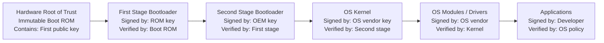
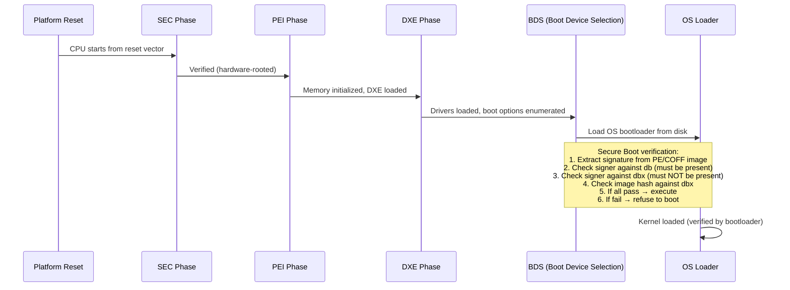
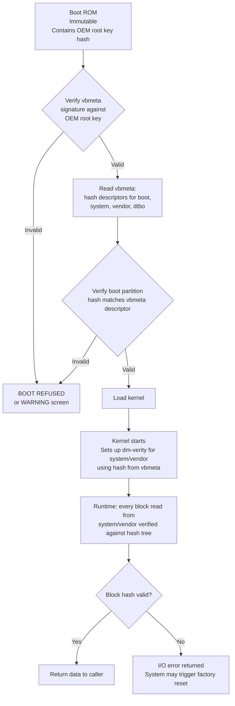
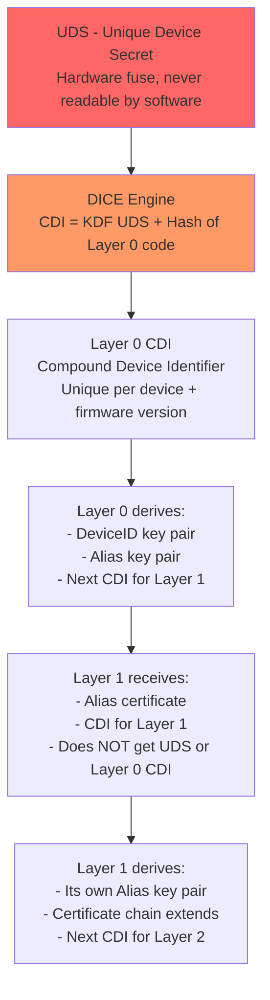
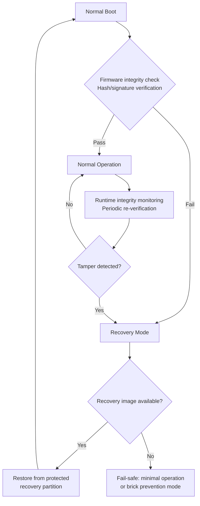
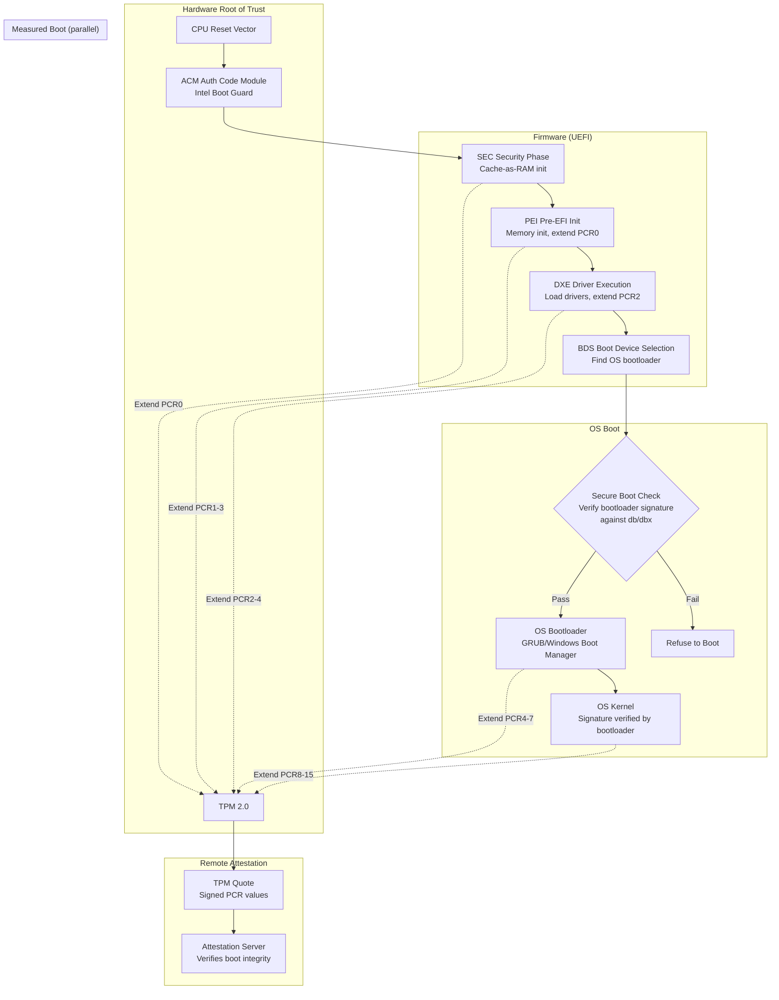
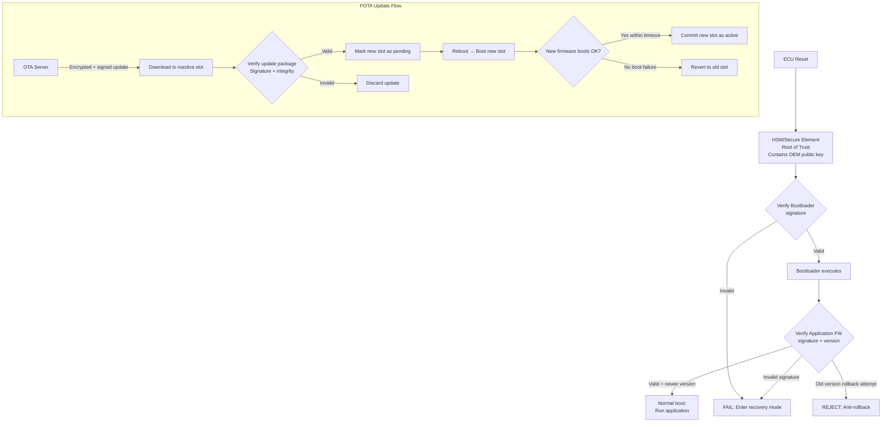

# Secure Boot & Chain of Trust

**Topic:** Secure Boot Architectures — UEFI Secure Boot, Android Verified Boot, DICE, SRTM/DRTM, Platform Integrity  
**Standards:** UEFI Specification 2.10, Android Verified Boot 2.0 (AVB), TCG SRTM/DRTM, NIST SP 800-193, NIST SP 800-155, TCG DICE  
**SDO:** UEFI Forum, Google (Android), TCG, NIST, ARM (TrustZone)  
**Audience:** Firmware security engineers, platform architects, embedded security engineers, OEM boot security teams  
**Prerequisites:** Boot process fundamentals, cryptographic signatures, hash chains, firmware architecture

---

## Chapter 1 — Historical Context & Origin Story

### 1.1 Timeline

| Year | Event | Impact |
|------|-------|--------|
| 1999 | Intel EFI specification | Replacement for BIOS, foundation for Secure Boot |
| 2005 | UEFI Forum established | Multi-vendor governance |
| 2006 | TCG defines SRTM (Static Root of Trust for Measurement) | TPM-based measured boot |
| 2008 | TXT (Trusted eXecution Technology) — Intel DRTM | Late launch trust establishment |
| 2012 | UEFI Secure Boot mandatory (Windows 8 logo) | First mass-market secure boot |
| 2013 | Android Verified Boot (dm-verity) | Partition integrity verification |
| 2016 | Android Verified Boot 2.0 (AVB2) | Rollback protection, chained verification |
| 2017 | NIST SP 800-193 (Platform Firmware Resiliency) | Protect, Detect, Recover framework |
| 2018 | TCG DICE (Device Identifier Composition Engine) | Lightweight identity + attestation for IoT |
| 2020 | ARM PSA Certified (Platform Security Architecture) | Standardized embedded secure boot |
| 2022 | NIST SP 800-155 Rev 1 (BIOS Integrity Measurement) | Firmware integrity guidelines |
| 2023 | Project Cerberus / Caliptra (open-source RoT) | Open hardware root of trust for servers |

### 1.2 Why Secure Boot Matters

| Attack | Without Secure Boot | With Secure Boot |
|--------|---------------------|------------------|
| Bootkit / BIOS rootkit | Malware persists below OS — invisible to antivirus | Firmware must be signed → unsigned code rejected |
| Evil maid (physical access) | Attacker replaces bootloader → intercepts disk encryption | Modified bootloader fails signature check → won't boot |
| Supply chain attack | Modified firmware shipped to customer | Each boot stage verifies next → tampering detected |
| Firmware downgrade | Attacker re-installs vulnerable old firmware | Anti-rollback counter prevents downgrade |

---

## Chapter 2 — Standard Architecture & Structure

### 2.1 Chain of Trust Concept



**Principle:** Each stage verifies the integrity and authenticity of the NEXT stage before transferring control. Chain starts from an immutable root (hardware) and extends to software.

### 2.2 Trust Anchor Types

| Type | Description | Example |
|------|-------------|---------|
| Immutable Boot ROM | First code that executes after reset; burned into silicon | ARM BootROM, Qualcomm PBL |
| OTP Fuses | One-time programmable; stores public key hash | Qualcomm QFPROM, NXP SRK |
| TPM/Root of Trust IC | Discrete chip with sealed keys and measurements | TPM 2.0 chip |
| On-die Root of Trust | Integrated into SoC (not separate chip) | Apple Secure Enclave, Google Titan |

---

## Chapter 3 — Technical Deep Dive

### 3.1 UEFI Secure Boot

#### Key Database Structure

| Variable | Content | Access |
|----------|---------|--------|
| **PK** (Platform Key) | Single key: platform owner (OEM). Controls all other DB changes | Authenticated write only |
| **KEK** (Key Exchange Key) | Keys authorized to update db/dbx. Usually: OEM + Microsoft | Authenticated write |
| **db** (Allowed Signatures) | Keys/hashes authorized to run. Microsoft UEFI CA + OEM keys | Authenticated write |
| **dbx** (Forbidden Signatures) | Revoked keys/hashes. Updated via Windows Update | Authenticated write |
| **dbt** (Timestamps) | Timestamp certificates for signature verification | Authenticated write |

#### UEFI Secure Boot Flow



### 3.2 Android Verified Boot 2.0 (AVB)

#### Partition Verification

| Partition | Verification Method | Hash Location |
|-----------|-------------------|---------------|
| boot (kernel + ramdisk) | Hash tree NOT used; entire image verified | VBMeta structure at end of partition |
| system | dm-verity (hash tree) | Hash tree appended to partition |
| vendor | dm-verity (hash tree) | Hash tree appended |
| vbmeta | Signed metadata structure | Self-verifying (signature in structure) |
| dtbo (device tree) | Hash in vbmeta | Verified before boot |

#### AVB Flow



#### Rollback Protection

| Mechanism | Implementation |
|-----------|---------------|
| Rollback index | Each vbmeta has monotonically increasing version number |
| RPMB storage | Rollback index stored in eMMC RPMB (Replay Protected Memory Block) |
| Anti-rollback fuses | Some SoCs use OTP fuses (irreversible, finite) |
| Protection | Prevents attacker from installing older (vulnerable) firmware |

### 3.3 TCG Measured Boot (SRTM/DRTM)

| Concept | SRTM (Static Root of Trust) | DRTM (Dynamic Root of Trust) |
|---------|---------------------------|----------------------------|
| Trust starts at | Power-on reset | Late launch event (runtime) |
| Root of Trust | BIOS/UEFI firmware + TPM | CPU instruction + TPM |
| PCR extension | Each boot stage extends TPM PCRs | DRTM resets specific PCRs, measures launched code |
| Advantages | Measures entire boot chain | Can establish trust even if BIOS compromised |
| Disadvantages | If early firmware is compromised, measurements meaningless | More complex, CPU-specific |
| Technology | Standard TPM measured boot | Intel TXT, AMD SEV (SKINIT) |

### 3.4 TCG DICE (Device Identifier Composition Engine)



**DICE Properties:**
- UDS never accessible to software (fuse-protected)
- If firmware changes → CDI changes → all derived keys change → old attestation invalid
- Each layer only gets its own CDI (cannot impersonate lower layers)
- Lightweight (no TPM needed — suitable for IoT/constrained devices)

### 3.5 NIST SP 800-193: Platform Firmware Resiliency

| Principle | Requirement |
|-----------|-------------|
| **Protection** | Firmware stored in protected flash (write-protect, signed updates only) |
| **Detection** | Integrity check of firmware at boot and periodically at runtime |
| **Recovery** | Ability to restore firmware to known-good state if corruption detected |



---

## Chapter 4 — Implementation Guide

### 4.1 Platform-Specific Secure Boot Implementations

| Platform | Root of Trust | Verification Chain | Anti-Rollback |
|----------|--------------|-------------------|---------------|
| x86/UEFI (PC) | PK in UEFI variables (flash) | PK → KEK → db → OS loader | dbx (revocation), Secure Version Number |
| Android (Qualcomm) | OEM root key hash in QFPROM fuses | PBL → XBL → ABL → vbmeta → kernel | RPMB rollback index |
| Android (MediaTek) | Root key hash in eFuse | Preloader → LK → vbmeta → kernel | eFuse anti-rollback bits |
| ARM Cortex-M (IoT) | Boot ROM + OTP key hash | ROM → MCUboot → Application | Hardware monotonic counter |
| Apple (iPhone/Mac) | Secure Enclave + iBoot ROM | SecureROM → LLB → iBoot → kernel | Nonce-based (personalization) |
| Automotive (AUTOSAR) | HSM/SHE + Secure Boot Manager | HSM → Bootloader → RTOS → Application | HSM counter |

### 4.2 Secure Boot Implementation Checklist

| Step | Action | Verification |
|------|--------|--------------|
| 1 | Define cryptographic boundary (what's verified) | Document all boot stages |
| 2 | Establish root of trust (immutable code/key) | Verify ROM is truly immutable |
| 3 | Implement signature verification in each stage | Test with invalid signatures → must fail |
| 4 | Implement anti-rollback mechanism | Test downgrade attempt → must be rejected |
| 5 | Define recovery mechanism (SP 800-193) | Test corrupted firmware → recovery works |
| 6 | Key provisioning (manufacturing) | Secure key injection in factory |
| 7 | Key revocation mechanism | Test key revocation → old signatures rejected |
| 8 | Attestation (optional but recommended) | Remote verifier can check boot integrity |

---

## Chapter 5 — Certification & Audit

### 5.1 Relevant Certifications

| Certification | Secure Boot Coverage |
|--------------|---------------------|
| FIPS 140-3 | Self-test includes firmware integrity check (boot verification) |
| Common Criteria (BSI PP-0084) | Protection Profile for Secure Boot |
| ARM PSA Certified (Level 1-3) | Secure Boot is mandatory requirement at all levels |
| Android CDD | AVB required for GMS-certified devices |
| NIST SP 800-193 | Firmware resiliency (Protect, Detect, Recover) |
| Automotive SPICE + ISO 21434 | Secure boot as cybersecurity measure |

### 5.2 Testing Secure Boot

| Test Category | Test Description | Expected Result |
|--------------|-----------------|-----------------|
| Positive boot | All signatures valid, latest firmware | Boot succeeds normally |
| Invalid signature | Modify one byte in signed image | Boot refused, error displayed |
| Revoked key | Sign with revoked key (in dbx) | Boot refused |
| Rollback attempt | Install older firmware version | Anti-rollback rejects |
| Recovery test | Corrupt primary firmware | System recovers from backup |
| Key update | Update PK/KEK (authenticated) | New keys active, old signatures work if in db |
| Timing attack | Measure verification time (constant-time?) | No side-channel leakage |

---

## Chapter 6 — Regional & Domain Variants

| Domain | Secure Boot Specifics |
|--------|----------------------|
| PC/Server (Enterprise) | UEFI Secure Boot + Measured Boot (TPM PCRs) + BitLocker sealing |
| Mobile (Android) | AVB 2.0 + dm-verity + hardware-backed keystore |
| Mobile (iOS) | Secure chain from SecureROM → Kernel (fully Apple-controlled) |
| Automotive | AUTOSAR SecOC + HSM-verified boot + FOTA (Firmware Over-The-Air) |
| IoT/Embedded | MCUboot + DICE + lightweight (no TPM, constrained resources) |
| Server/Cloud | Project Cerberus/Caliptra (hardware RoT for BMC/firmware) |
| Telecom (5G) | O-RAN Alliance: secure boot of RAN equipment |

---

## Chapter 7 — Comparison: Secure Boot Technologies

| Feature | UEFI Secure Boot | Android AVB 2.0 | MCUboot | DICE |
|---------|-----------------|-----------------|---------|------|
| Target | x86/ARM64 PCs/servers | Android smartphones | IoT/embedded MCUs | IoT (identity + boot) |
| Verification | Signature of PE/COFF images | Hash tree + signed vbmeta | Signature of image slot | Measurement-based (CDI) |
| Algorithm | RSA-2048/4096, SHA-256 | RSA-2048/4096, SHA-256 | RSA/ECDSA + SHA-256 | SHA-256/384 + ECC |
| Anti-rollback | dbx revocation list | Monotonic counter (RPMB) | Hardware counter | CDI changes on update |
| Recovery | Recovery from backup (SP 800-193) | Factory reset | Swap to backup slot (A/B) | Re-enrollment |
| Attestation | TPM quotes (measured boot) | Android Key Attestation | Optional | Built-in (Alias certs) |
| Complexity | High (UEFI spec ~3000 pages) | Medium | Low | Very low |
| Open source | TianoCore (reference) | AOSP (Google) | MCUboot (Apache 2.0) | Open DICE (Google) |

---

## Chapter 8 — Mermaid Architecture Diagrams

### 8.1 Complete x86 Boot Security Architecture



### 8.2 Automotive Secure Boot with FOTA



---

## Chapter 9 — Case Studies & Failure Analysis

### 9.1 UEFI Secure Boot Bypass: BlackLotus Bootkit (2023)

**Attack:** BlackLotus is the first known UEFI bootkit to bypass Secure Boot on fully updated Windows 11 systems.

**Mechanism:** Exploited CVE-2022-21894 (Secure Boot Security Feature Bypass). Even after Microsoft patched, the old signed bootloaders were NOT immediately added to dbx (revocation list) because revoking them would break many systems (recovery media, old OS installations).

**Root cause:** UEFI Secure Boot's revocation mechanism (dbx) is difficult to deploy aggressively because revoking signed bootloaders can brick systems that still use them.

**Industry response:** Microsoft announced phased dbx updates (2023-2024). UEFI Forum working on improved revocation mechanisms. Measured boot (TPM) provides defense-in-depth: even if secure boot is bypassed, TPM measurements will differ → attestation reveals compromise.

**Lesson:** Signature-based boot verification is only as strong as its revocation mechanism. Defense-in-depth requires: Secure Boot (prevention) + Measured Boot (detection) + Recovery (NIST SP 800-193).

### 9.2 Android Bootloader Unlock and Security

**Design decision:** Android allows users to unlock bootloader (for custom ROMs). When unlocked: AVB verification shows WARNING but boots anyway. Device state: UNLOCKED.

**Security impact:** Unlocked bootloader → attacker with physical access can install malicious firmware. Hardware-backed keystore detects unlocked state → some keys destroyed or marked untrustworthy.

**Enterprise mitigation:** Android Enterprise: devices with locked bootloader required. Knox (Samsung): eFuse blown on unlock → enterprise warranty void, Knox keys destroyed permanently.

---

## Chapter 10 — Future Evolution & Industry Trends

| Trend | Impact |
|-------|--------|
| Post-quantum secure boot | Boot signatures must transition to ML-DSA (larger signatures: 2-4KB) |
| Project Caliptra (open-source) | Open hardware RoT for data center servers (AMD/Google/Microsoft/NVIDIA) |
| Measured boot everywhere | IoT/automotive: attestation becoming mandatory |
| DICE proliferation | Replacing TPM for constrained devices (IoT/automotive) |
| Firmware transparency | Public log of firmware builds (like Certificate Transparency for firmware) |
| SBOM for firmware | Firmware bill of materials → boot-time supply chain verification |
| Confidential computing integration | Secure boot → attested launch → encrypted memory (TDX/SEV/CCA) |
| Secure boot for AI models | Verifying integrity of ML model weights at load time |

---

## Chapter 11 — Interview Questions & Career Guide

### Tier 1: Entry-Level (0-3 years)

**Q1:** Explain the chain of trust in secure boot. Why must it start from hardware?  
**A:** Chain of trust means each boot stage verifies the next before handing off control. It starts from hardware because you need an IMMUTABLE starting point — something that can't be modified by an attacker. This is the Boot ROM: code burned into silicon that executes first after reset. The ROM contains (or can verify) the first public key. It verifies the first-stage bootloader's signature. Then that bootloader verifies the next stage, and so on until the OS kernel. If this chain could start from modifiable software (e.g., flash-stored firmware without verification), an attacker could replace the first code that runs → entire chain is compromised. Hardware immutability is the foundation: ROM code can't be changed (it's in mask ROM or OTP), root key can't be modified (fuse-programmed).

### Tier 2: Mid-Level (3-8 years)

**Q2:** Compare UEFI Secure Boot and Android Verified Boot (AVB). What are the key architectural differences and why?  
**A:** **(1) Verification scope:** UEFI Secure Boot verifies the bootloader and option ROMs (Authenticode signatures). It does NOT verify the OS kernel/filesystem directly (that's done by the bootloader). AVB verifies EVERYTHING: vbmeta → boot partition → system/vendor partitions (dm-verity). AVB provides full-chain verification from ROM to every filesystem block. **(2) Verification method:** UEFI: check signature against a database of allowed signers (db). If signer in db AND not in dbx → allowed. AVB: check signature against hardcoded OEM root key (in fuses). Single root of trust, not a database of multiple signers. **(3) Revocation:** UEFI: dbx (blacklist of hashes/signers). Hard to deploy (can break systems). AVB: rollback index (monotonic counter). Simple: if version < stored counter, reject. No complex revocation lists. **(4) Runtime protection:** UEFI: none (once OS boots, Secure Boot's job is done). AVB: dm-verity continues verifying every disk read at runtime (filesystem integrity). **(5) Why different?** PC ecosystem: multiple OS vendors, multiple bootloaders → need flexible trust database (db). Android: single OEM controls the device → single root key is sufficient. PC: users own the hardware → must support multiple OSes. Android: device is a controlled platform → tighter control acceptable.

### Tier 3: Senior (8-15 years)

**Q3:** You're designing the secure boot architecture for an automotive ECU that must support FOTA updates and meet ISO 21434 cybersecurity requirements. Detail your design.  
**A:** **Hardware:** SoC with hardware root of trust (immutable boot ROM) + dedicated HSM (e.g., Infineon SHE/HSM or NXP SE050). OEM root public key hash burned in OTP fuses. Anti-rollback counter in HSM (monotonic, hardware-backed). **Boot chain:** ROM → HSM-verified 1st-stage bootloader → 2nd-stage (A/B slots) → RTOS/Hypervisor → Applications. Each transition: signature verification (ECDSA-P256 for speed, or ML-DSA for PQC readiness). **FOTA design:** A/B partition scheme (never modify running partition). Download update to inactive slot. Verify signature + rollback index. Reboot to new slot. Watchdog: if new firmware doesn't report healthy within 30 seconds → automatic fallback to previous slot. HSM commits new rollback counter ONLY after successful boot verification. **ISO 21434 alignment:** Threat analysis: boot bypass listed as critical threat. Security goal: ensure only OEM-authorized firmware executes. Verification & Validation: test all failure paths (invalid sig, rollback, recovery). Incident response: remote attestation so backend can detect compromised ECU. **Key management:** OEM root key: offline HSM (air-gapped). Signing key: separate per ECU family (limit blast radius). Key rotation: possible via chained certificates (new signing key signed by root). Key revocation: new vbmeta with updated trust anchor (pushed via FOTA).

---

## Chapter 12 — Cheat Sheet & Quick Reference

### Secure Boot Technologies Summary

```
UEFI Secure Boot:      PC/Server, PK→KEK→db→loader, Authenticode signatures
Android AVB 2.0:       Smartphones, vbmeta chain, dm-verity runtime protection
Intel Boot Guard:      x86 hardware-rooted (ACM), verifies UEFI firmware itself
ARM TrustZone Boot:    Secure world boot (BL1→BL2→BL31→BL33), ARM Trusted Firmware
MCUboot:               IoT/embedded, A/B image slots, hardware key storage
DICE:                  IoT identity, measurement-based CDI derivation, no TPM needed
AUTOSAR SecOC:         Automotive, message authentication (not boot—but related)
```

### Anti-Rollback Mechanisms

```
dbx (UEFI):            Blacklist of revoked hashes/signers
RPMB counter (Android): Monotonic counter in eMMC replay-protected memory
OTP fuses:             Irreversible bits (limited count)
HSM counter:           Hardware monotonic counter (automotive/IoT)
Nonce-based (Apple):   Server-issued nonce → prevents replay of old firmware
```

### Decision Tree: Choosing Secure Boot Technology

```
Is target a PC/server?
  → UEFI Secure Boot + Measured Boot (TPM)

Is target an Android device?
  → AVB 2.0 (mandatory for GMS)

Is target a constrained IoT device (<1MB RAM)?
  → MCUboot + DICE

Is target an automotive ECU?
  → HSM-rooted boot + A/B update + DICE or custom

Do you need remote attestation?
  → Add TPM measured boot OR DICE alias certificates

Do you need runtime filesystem integrity?
  → dm-verity (Android/Linux) or IMA (Linux Integrity Measurement Architecture)
```

---

*End of Document — 06_Secure_Boot_Chain_of_Trust.md*
