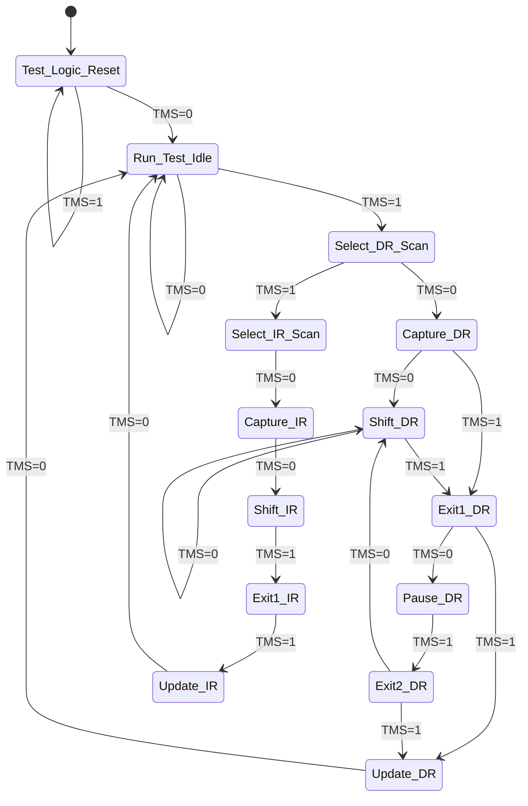
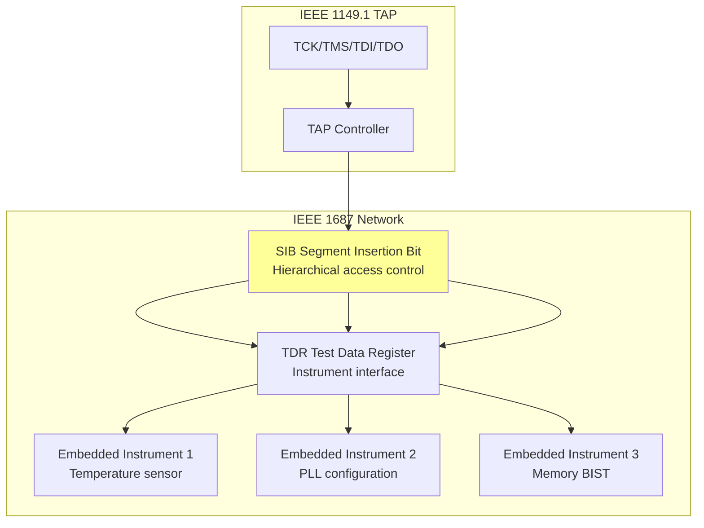
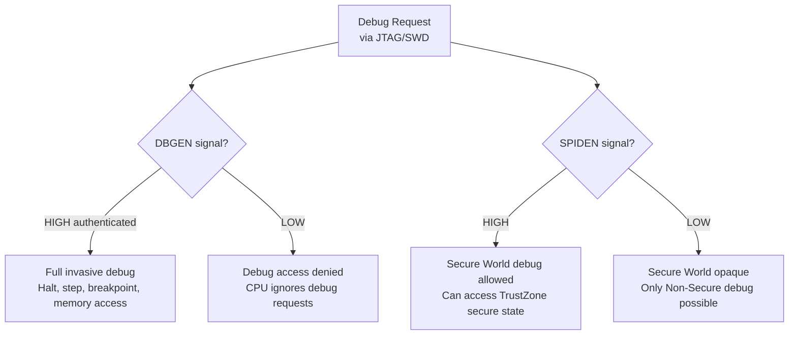
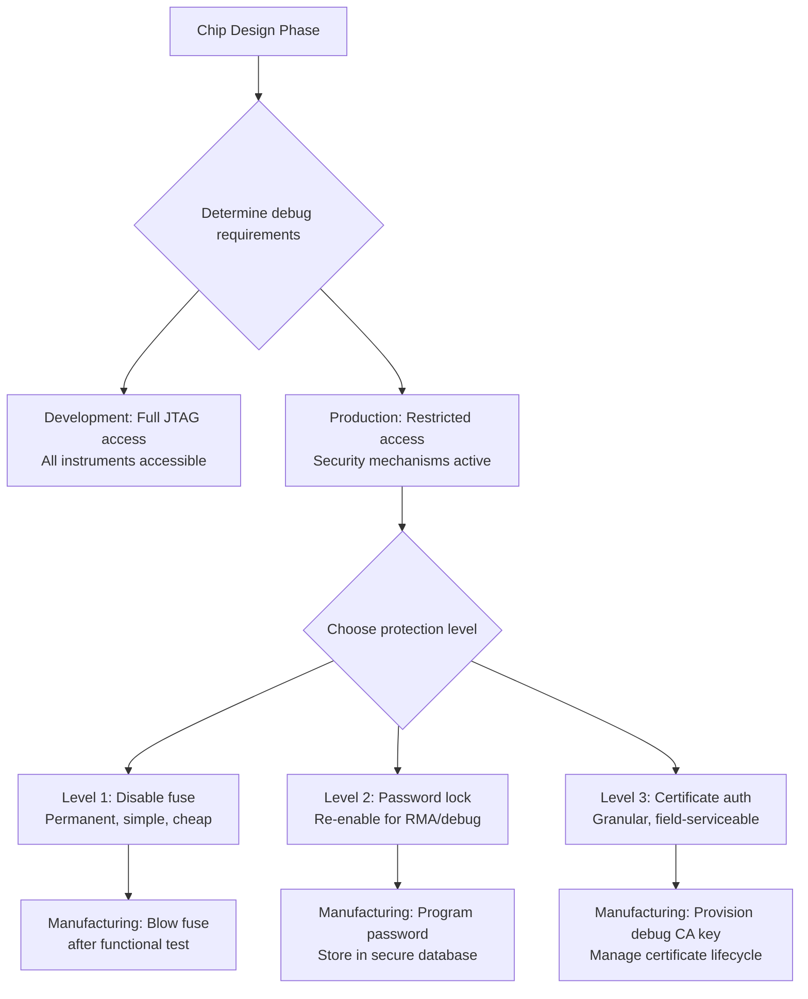
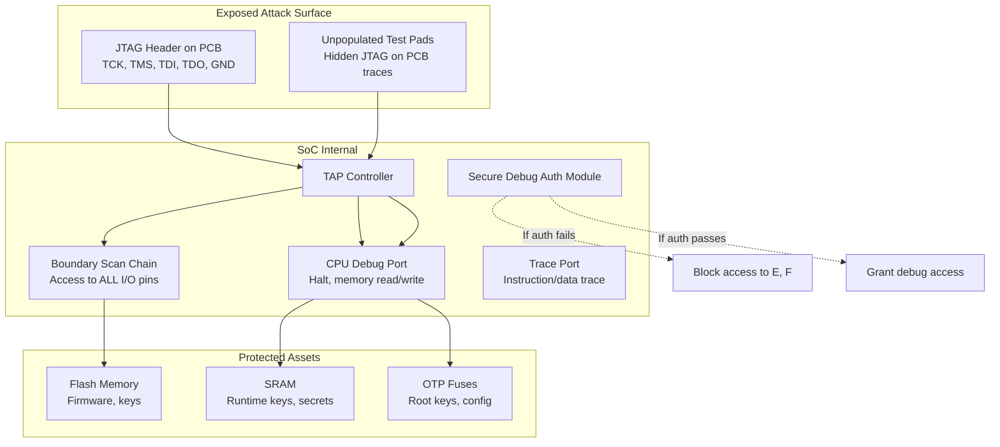
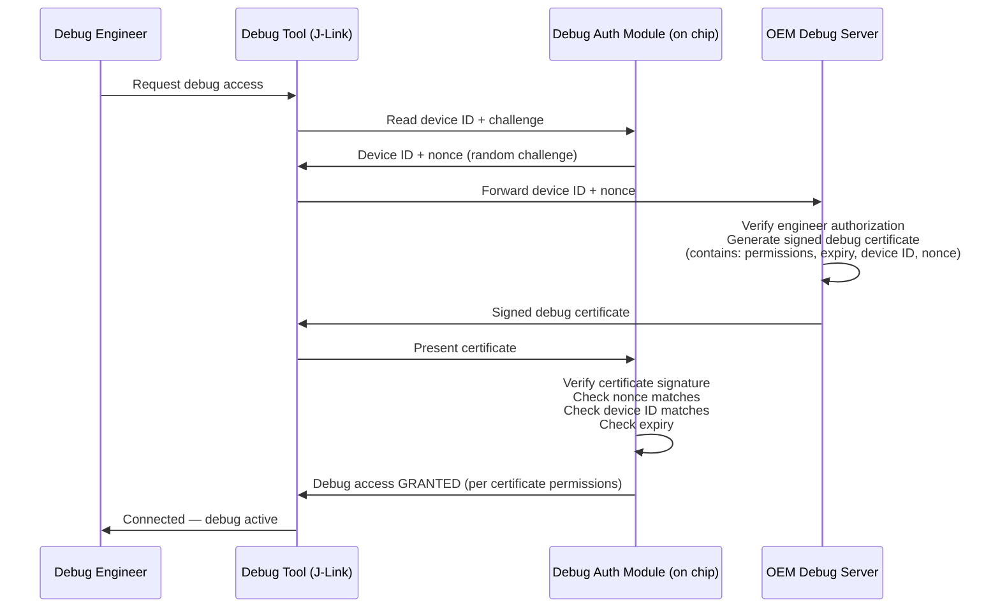

# JTAG Security — IEEE 1149.1, IEEE 1149.7, IEEE 1687 (iJTAG)

**Topic:** JTAG Debug Port Security — Boundary Scan, Secure Debug Access, and Protection Mechanisms  
**Standards:** IEEE 1149.1 (JTAG), IEEE 1149.7 (Compact JTAG), IEEE 1687 (iJTAG), ARM CoreSight, RISC-V Debug Spec  
**SDO:** IEEE, ARM, RISC-V Foundation  
**Audience:** Hardware security engineers, SoC designers, penetration testers, secure debug architects  
**Prerequisites:** Digital logic, chip design basics, debug interfaces, embedded systems

---

## Chapter 1 — Historical Context & Origin Story

### 1.1 Timeline

| Year | Event | Impact |
|------|-------|--------|
| 1985 | Joint Test Action Group (JTAG) formed | Industry consortium to solve board testing |
| 1990 | IEEE 1149.1 (boundary scan) standardized | Universal test access port for PCBs |
| 1994 | ARM7TDMI: JTAG used for CPU debug | JTAG becomes debug interface standard |
| 2001 | IEEE 1149.6 (AC-coupled, differential) | High-speed boundary scan |
| 2006 | IEEE 1149.7 (Compact JTAG) | Reduced pin count (2-wire: TMSC, TCKC) |
| 2014 | IEEE 1687 (iJTAG) standard | Internal JTAG: access embedded instruments |
| 2015+ | Secure debug architectures emerge | ARM CoreSight authentication, JTAG locking |
| 2019 | ARM SDC-600 (Secure Debug Channel) | Authenticated debug over CoreSight |
| 2020 | RISC-V External Debug Support (0.13.2) | Standardized RISC-V debug mechanism |
| 2022+ | NIST SP 800-193: debug port as attack vector | Firmware resiliency considers debug access |

### 1.2 JTAG as Attack Vector

| Attack | Method | Impact |
|--------|--------|--------|
| Firmware extraction | Read flash via JTAG boundary scan | Steal proprietary firmware/keys |
| Runtime memory read | Halt CPU, dump SRAM/registers | Extract cryptographic keys from memory |
| Code injection | Halt CPU, modify memory, resume | Execute arbitrary code with full privilege |
| Bypass secure boot | Modify boot flow (skip verification) | Load unsigned firmware |
| Glitching assist | Use JTAG to observe internal state during glitch | Refine fault injection attacks |
| Clone device | Extract all firmware + configuration | Produce counterfeit hardware |

---

## Chapter 2 — Standard Architecture & Structure

### 2.1 IEEE 1149.1 TAP (Test Access Port)

| Signal | Direction | Description |
|--------|-----------|-------------|
| **TCK** | Input | Test Clock |
| **TMS** | Input | Test Mode Select (drives TAP state machine) |
| **TDI** | Input | Test Data In (serial data input) |
| **TDO** | Output | Test Data Out (serial data output) |
| **TRST#** | Input (optional) | Test Reset (asynchronous TAP reset) |

### 2.2 TAP Controller State Machine



### 2.3 Standard JTAG Instructions (IEEE 1149.1)

| Instruction | Opcode (typical) | Function |
|-------------|-----------------|----------|
| BYPASS | All 1s | Pass through (1-bit shift register) |
| EXTEST | 000...0 | Drive/sample boundary scan cells |
| SAMPLE/PRELOAD | Vendor-defined | Sample pin states without interfering |
| IDCODE | Vendor-defined | Read device identification register |
| INTEST | Vendor-defined | Test internal logic via boundary cells |
| HIGHZ | Vendor-defined | Tri-state all output pins |
| CLAMP | Vendor-defined | Hold outputs while shifting |

---

## Chapter 3 — Technical Deep Dive

### 3.1 IEEE 1149.7 (Compact JTAG / cJTAG)

| Feature | IEEE 1149.1 | IEEE 1149.7 |
|---------|-------------|-------------|
| Pins required | 4-5 (TCK, TMS, TDI, TDO, optional TRST) | 2 (TMSC, TCKC) |
| Bandwidth | TCK frequency × 1 bit/clock | Higher (multi-bit per clock in advanced modes) |
| Star topology | No (daisy-chain only) | Yes (addressable devices) |
| Power-down debug | No | Yes (can wake device via debug port) |
| Compatibility | N/A | Backward-compatible with 1149.1 |
| Use case | Board test, debug | Mobile/IoT (pin-constrained SoCs) |

### 3.2 IEEE 1687 (iJTAG — Internal JTAG)

**Purpose:** Access internal embedded instruments (on-chip sensors, BIST engines, configuration registers) through the JTAG TAP using a standardized methodology.



**Key iJTAG Concepts:**

| Concept | Description |
|---------|-------------|
| SIB (Segment Insertion Bit) | Gates access to instrument segments (open/close path) |
| TDR (Test Data Register) | Interface register to each instrument |
| ICL (Instrument Connectivity Language) | Describes how instruments connect to scan chain |
| PDL (Procedural Description Language) | Describes how to operate instruments |
| Retargeting | Automatic generation of vectors from chip-level to board-level |

### 3.3 Debug Security Mechanisms

| Mechanism | Security Level | Description |
|-----------|---------------|-------------|
| **No protection** | None | JTAG always accessible (development boards) |
| **JTAG disable fuse** | Permanent | OTP fuse: once blown, JTAG permanently disabled |
| **JTAG lock (password)** | Medium | Require password/key before JTAG responds |
| **Secure debug (certificate-based)** | High | Debug access requires signed certificate (ARM SDC-600) |
| **JTAG with authentication challenge** | High | Challenge-response protocol before access granted |
| **Physical wire cutting** | Permanent | Traces physically severed in production (irreversible) |
| **Debug port multiplexing** | Obfuscation | JTAG pins re-used as GPIO in production (no header) |

### 3.4 ARM CoreSight Debug Authentication

| Signal | Meaning | Effect |
|--------|---------|--------|
| DBGEN | Invasive debug enable | If LOW: CPU halt/step disabled |
| NIDEN | Non-invasive debug enable | If LOW: performance counters/trace disabled |
| SPIDEN | Secure invasive debug enable | If LOW: cannot debug Secure World (TrustZone) |
| SPNIDEN | Secure non-invasive debug enable | If LOW: cannot trace Secure World |



### 3.5 ARM Secure Debug Channel (SDC-600)

| Feature | Description |
|---------|-------------|
| Authentication | Certificate-based (X.509): debug certificate presented to device |
| Authorization | Certificate contains permissions (which cores, which privilege levels) |
| Channel encryption | Encrypted debug link (prevents snooping of debug data) |
| Key provisioning | Device provisioned with debug CA public key during manufacturing |
| Revocation | Certificate validity can include expiry time, CRL reference |
| Use case | Field debug of deployed devices without permanently enabling JTAG |

---

## Chapter 4 — Implementation Guide

### 4.1 JTAG Security Design Flow



### 4.2 Secure Debug Architecture (Best Practice)

| Component | Implementation |
|-----------|---------------|
| Debug Authentication Module (DAM) | Hardware block: receives challenge, validates certificate/response |
| Secure Non-Volatile Storage | Stores debug policy (what's allowed when authenticated) |
| Challenge generator | TRNG-based challenge (prevent replay attacks) |
| Timeout / attempt limiting | Lock out after N failed authentication attempts |
| Audit log | Record debug access events (who authenticated, when) |
| Granular permissions | Per-subsystem access control (CPU debug, bus trace, register access) |

### 4.3 Manufacturing JTAG Flow

| Stage | JTAG State | Purpose |
|-------|------------|---------|
| Wafer test | Full access (boundary scan + debug) | Test all die functionality |
| Package test | Full access | Final test after packaging |
| Board-level test | Boundary scan (1149.1) | Verify soldering, connections |
| Programming | Full access (or ISP mode) | Flash firmware, provision keys |
| Security provisioning | Write OTP fuses (keys, config) | Set debug policy, blow lock fuse |
| Production lock | JTAG restricted/disabled | Security active, debug locked |
| Field RMA | Authenticated access (if implemented) | Controlled debug for failure analysis |

---

## Chapter 5 — Certification & Audit

### 5.1 JTAG Security in Certification Standards

| Standard | JTAG Requirement |
|----------|-----------------|
| Common Criteria (EAL 4+) | Debug interfaces must be disabled or protected in production |
| FIPS 140-3 (Level 3+) | Physical ports that could leak CSPs must be disabled |
| EMVCo (payment cards) | JTAG/test pads must be eliminated or permanently disabled |
| ARM PSA Certified (Level 2) | Secure debug: authenticated access or permanent disable |
| Automotive (ISO 21434) | Debug ports identified as attack surface in TARA |
| PCI PTS (payment terminals) | Test/debug features not accessible in production |

### 5.2 Penetration Testing for JTAG

| Test | Method | Tool |
|------|--------|------|
| JTAG port discovery | Scan all pins for TAP response (IDCODE) | JTAGulator, Bus Pirate |
| Boundary scan extraction | Read flash/EEPROM via boundary scan cells | OpenOCD, UrJTAG |
| Debug access test | Attempt CPU halt after "disable" | OpenOCD + GDB, Segger J-Link |
| Fuse verification | Read fuse state via JTAG (if accessible) | Vendor-specific tools |
| Glitch + JTAG | Voltage glitch to bypass JTAG lock, then access | ChipWhisperer + JTAG adapter |
| Hidden JTAG discovery | Decap chip, trace JTAG signals | Microscope + FIB |

---

## Chapter 6 — Regional & Domain Variants

| Domain | JTAG Security Approach |
|--------|----------------------|
| Consumer electronics | Minimal: JTAG pads removed from production PCB, no fuse protection |
| Automotive ECU | Medium: JTAG locked via password, RMA unlock procedure |
| Payment terminal/card | High: JTAG permanently disabled (fuses) + pads physically removed |
| Military/defense | Maximum: JTAG eliminated from silicon (no TAP controller in production metal layers) |
| Smartphone SoC | High: Secure debug (certificate-based), disabled by default |
| IoT (mass market) | Low-medium: Often unprotected (cost pressure) — major vulnerability |
| FPGA | Medium: Bitstream encryption, JTAG protected by key |

---

## Chapter 7 — Comparison: Debug Interface Standards

| Feature | IEEE 1149.1 (JTAG) | IEEE 1149.7 (cJTAG) | SWD (ARM) | IEEE 1687 (iJTAG) |
|---------|-------------------|---------------------|-----------|-------------------|
| Pins | 4-5 | 2 | 2 (SWDIO, SWCLK) | Via 1149.1 TAP |
| Purpose | Board test + debug | Board test + debug (pin-constrained) | CPU debug only (ARM) | Internal instrument access |
| Topology | Daisy-chain | Star + daisy-chain | Point-to-point | Hierarchical (SIBs) |
| Security std | None (separate) | None (separate) | CoreSight auth signals | None (instrument-level) |
| Target device | Any digital IC | Mobile/IoT SoCs | ARM Cortex CPUs | SoCs with embedded instruments |
| Invasive debug | Yes (via vendor extensions) | Yes | Yes (halt, step, breakpoint) | No (instrument access only) |

---

## Chapter 8 — Mermaid Architecture Diagrams

### 8.1 JTAG Attack Surface on Embedded System



### 8.2 Secure Debug Certificate Flow



---

## Chapter 9 — Case Studies & Failure Analysis

### 9.1 Xbox 360 — JTAG Hack (King Kong Exploit)

**Target:** Microsoft Xbox 360 (2006-era security)

**Attack:** Researchers discovered that even though JTAG was "disabled" in production, the CPU's JTAG TAP was still physically present. Using a timing exploit during boot (before security was fully initialized), they could:
1. Assert JTAG during a brief window
2. Read/write hypervisor memory
3. Modify the hypervisor to skip signature checks
4. Load unsigned (homebrew/pirated) games

**Root cause:** JTAG "disable" was done in software (during boot) rather than hardware (fuse/permanent). Window of opportunity existed between reset and software disable.

**Fix (later revisions):** Microsoft blew eFuses to permanently disable JTAG in production. Hardware design revision eliminated the timing window.

**Lesson:** JTAG disable MUST be hardware-enforced (fuse or dedicated gate) before ANY software executes. Software-only JTAG disable has a race condition at every reset.

### 9.2 Automotive ECU — JTAG Left Enabled in Production

**Target:** Tier-1 automotive ECU (engine management)

**Discovery:** Security researcher purchased ECU from junk yard, found JTAG test pads on PCB. Connected Bus Pirate → full CPU debug access. Extracted firmware → reverse-engineered proprietary engine calibration data.

**Impact:** Competitors could extract calibration parameters. More critically: an attacker could modify firmware to alter emission controls (defeat device) or engine behavior (safety risk).

**Root cause:** OEM specified "disable JTAG" in requirements but Tier-1 supplier didn't implement (needed JTAG for field returns). No verification test existed to confirm JTAG was locked in production units.

**Mitigation:** Added to production test sequence: verify JTAG access is denied (automated test). Implemented hardware fuse-based JTAG disable. For field debug: separate authenticated debug path via CAN/UDS (not JTAG).

---

## Chapter 10 — Future Evolution & Industry Trends

| Trend | Impact on JTAG Security |
|-------|------------------------|
| RISC-V debug standardization | Unified external debug specification with security extensions |
| Authenticated debug everywhere | All production chips require certificate-based debug access |
| Debug over functional interface | Debug via USB/PCIe/network (no dedicated pins) — new attack surface |
| AI-assisted vulnerability discovery | Automated tools find hidden JTAG access points |
| Chiplet architectures | Each chiplet may have its own debug interface — complex security |
| ISO 21434 (automotive cybersecurity) | JTAG security explicitly required in TARA threat analysis |
| Supply chain security (NIST) | Debug ports identified as supply chain attack vector |
| Post-silicon validation evolution | iJTAG (1687) expanding for in-field diagnostics |

---

## Chapter 11 — Interview Questions & Career Guide

### Tier 1: Entry-Level (0-3 years)

**Q1:** What is JTAG and why is it a security concern?  
**A:** JTAG (IEEE 1149.1) is a standard interface for testing and debugging integrated circuits. It provides: (1) Boundary scan: test PCB connections by driving/reading IC pins via serial shift register. (2) CPU debug: halt the processor, read/write memory and registers, set breakpoints. **Security concern:** JTAG gives an attacker complete access to the chip's internals. With JTAG access, an attacker can: extract firmware (read flash memory), extract cryptographic keys (read SRAM/registers), bypass secure boot (modify memory to skip verification), inject code (write malicious instructions). It's the "master key" to the hardware. **Protections:** permanently disable (fuse), password protection, certificate-based authentication, or physically remove test pads from production boards.

### Tier 2: Mid-Level (3-8 years)

**Q2:** Design a secure debug architecture for a production SoC that allows authorized field debug while preventing unauthorized access.  
**A:** **Requirements:** production devices have debug disabled by default. Authorized engineers (with time-limited credentials) can enable debug for failure analysis. No permanent security degradation after debug session. **Architecture:** **(1) Hardware Debug Authentication Module (DAM):** on-chip block connected between TAP controller and debug subsystem. Before DAM authenticates, no debug signals reach CPU/trace. DAM contains: TRNG (for challenge), ECC public key (OEM debug CA), anti-replay logic. **(2) Flow:** Engineer connects debug probe → reads device ID from chip (unprotected). Sends device ID to OEM debug server. Server verifies engineer's authorization (role + device family). Server signs debug certificate: {device_id, permissions, nonce, expiry_time}. Certificate sent to chip via debug port. DAM verifies: signature valid (using stored CA public key), device_id matches, nonce matches challenge. If valid → assert DBGEN/SPIDEN signals (enable debug per permissions). **(3) Permissions granularity:** Certificate specifies: which cores debuggable, secure/non-secure world access, trace enable, time limit. **(4) Anti-replay:** Each debug session requires fresh challenge from DAM's TRNG. Old certificates cannot be replayed. **(5) Audit:** DAM logs: timestamp + certificate hash of each successful authentication (stored in on-chip NV memory). OEM can audit which devices were debugged, when, by whom. **(6) Fallback:** If OEM server unreachable, no debug access (fail-secure). For truly critical field situations: "break-glass" physical procedure (destroy certain fuses) — but permanently flags device as debug-compromised.

---

## Chapter 12 — Cheat Sheet & Quick Reference

### JTAG Standards Family

```
IEEE 1149.1 (1990): Boundary Scan (original JTAG)
IEEE 1149.4 (1999): Mixed-signal boundary scan (analog)
IEEE 1149.6 (2003): AC-coupled/differential boundary scan
IEEE 1149.7 (2009): Compact JTAG (2-wire, star topology)
IEEE 1687 (2014): iJTAG (internal instrument access)
IEEE 1838 (2019): 3D IC test access (TSV-based)
```

### JTAG Security Protection Levels

```
Level 0: No protection (dev boards)
Level 1: Remove test header from production PCB (obfuscation only)
Level 2: Blow disable fuse — permanent JTAG disable
Level 3: Password/key-based JTAG lock (re-enable possible)
Level 4: Certificate-based authenticated debug (ARM SDC-600)
Level 5: No JTAG in production silicon (TAP removed from netlist)
```

### Common JTAG Tools

```
OpenOCD:        Open source JTAG/SWD debug (most platforms)
Segger J-Link:  Commercial JTAG/SWD probe (ARM focus)
Lauterbach:     High-end trace + debug (automotive, complex SoCs)
Bus Pirate:     Low-cost universal bus tool (JTAG + SPI + I2C)
JTAGulator:     Automated JTAG pin discovery (security research)
UrJTAG:         Open source boundary scan tool
ChipWhisperer:  Side-channel + glitching + JTAG (security research)
```

---

*End of Document — 07_JTAG_Security_IEEE_1149.md*
