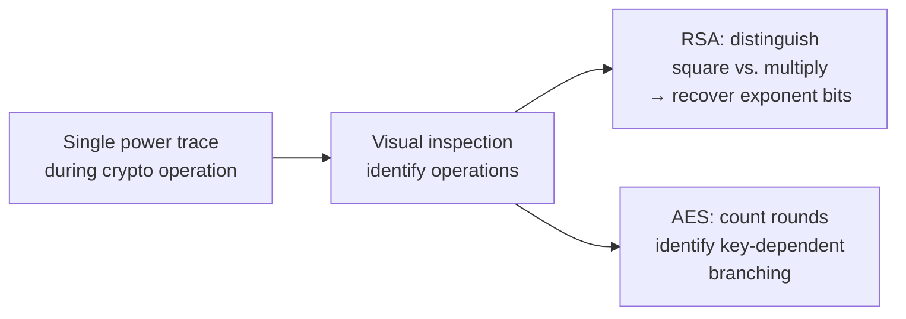
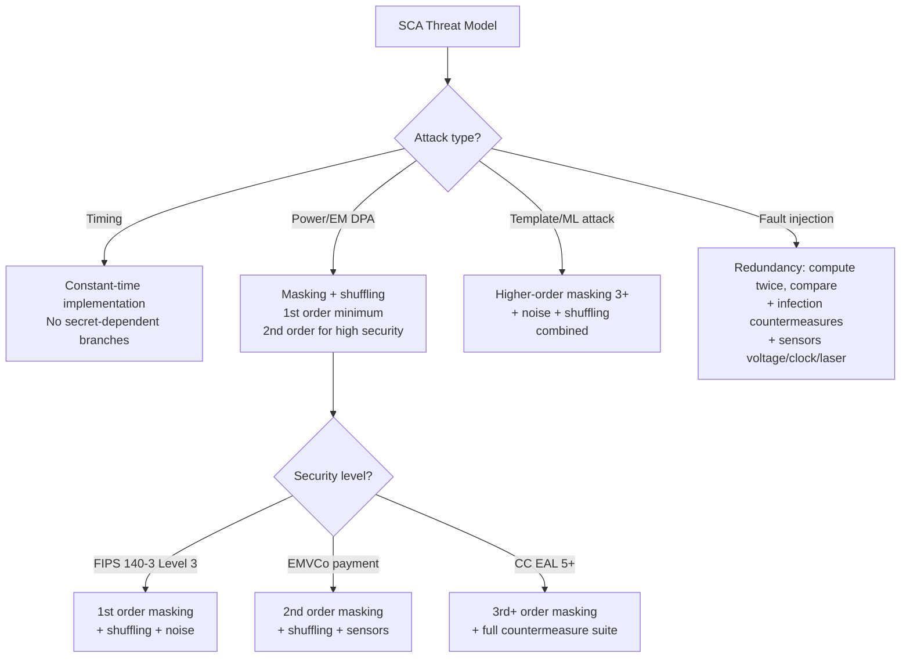
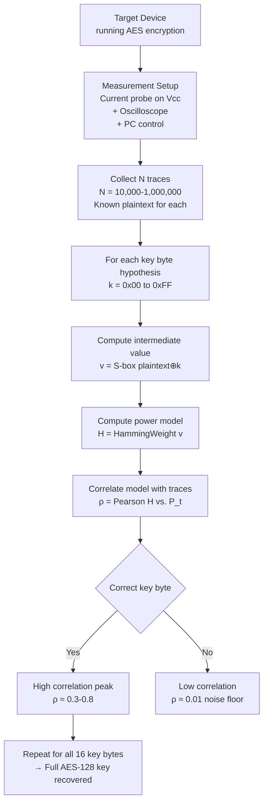
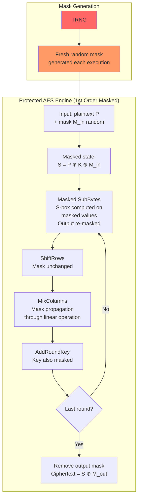

# Side-Channel Attack Standards & Countermeasures

**Topic:** Side-Channel Analysis (SCA) — Standards, Attack Methodologies, and Countermeasure Design  
**Standards:** ISO/IEC 17825:2016, ISO/IEC 20085-1/2, EMVCo SCA Requirements, NIST SP 800-185, JIL Attack Rating  
**SDO:** ISO/IEC JTC 1/SC 27, EMVCo, Common Criteria (JIL), NIST  
**Audience:** Cryptographic hardware designers, security evaluators, side-channel analysts, IC security engineers  
**Prerequisites:** Digital electronics, cryptographic algorithm internals, signal processing, statistics

---

## Chapter 1 — Historical Context & Origin Story

### 1.1 Timeline

| Year | Event | Impact |
|------|-------|--------|
| 1996 | Paul Kocher publishes timing attack on RSA | First practical SCA demonstrated |
| 1999 | Kocher, Jaffe, Jun: DPA (Differential Power Analysis) | Revolutionized hardware crypto attacks |
| 2000 | SPA (Simple Power Analysis) attacks on smart cards | Industry wake-up call |
| 2001 | EM emanation attacks demonstrated | No physical contact needed |
| 2004 | Template attacks (most powerful profiled SCA) | Theoretical minimum traces |
| 2007 | Cache timing attacks (software SCA) | Extends SCA to software implementations |
| 2013 | ISO/IEC 17825:2016 drafted | First international SCA testing standard |
| 2015 | TVLA (Test Vector Leakage Assessment) methodology | Standardized leakage detection |
| 2016 | ISO/IEC 17825:2016 published | Non-invasive testing for crypto modules |
| 2017 | Spectre/Meltdown (microarchitectural SCA) | CPU-level side channels |
| 2019 | EMVCo SCA testing requirements updated | Payment industry SCA mandate |
| 2020 | Deep learning SCA attacks | AI-powered power analysis |
| 2022+ | ISO/IEC 20085 parts 1&2 (test tool requirements) | Standardizing SCA testing equipment |

### 1.2 Side-Channel Taxonomy

| Channel | Observable | Measurement |
|---------|-----------|-------------|
| Timing | Execution time variations | Precision timer / clock |
| Power (SPA/DPA) | Current consumption variations | Current probe + oscilloscope |
| Electromagnetic (EM) | EM radiation during computation | Near-field EM probe + spectrum analyzer |
| Acoustic | Sound emitted by components | Microphone (capacitor whine) |
| Photonic | Photon emission from transistors | Photon detector (backside imaging) |
| Cache (software) | Cache hit/miss timing | Software timing measurement |
| Thermal | Temperature variations | Thermal camera (slow, low resolution) |
| Fault (active) | Induced error responses | Laser/voltage/clock glitching |

---

## Chapter 2 — Standard Architecture & Structure

### 2.1 ISO/IEC 17825:2016 — Testing Methods for Crypto Module Non-Invasive Attack Mitigation

| Section | Content |
|---------|---------|
| Scope | Non-invasive attack testing methods for FIPS 140-3 Level 3+ |
| Metrics | Information leakage metrics (SNR, mutual information) |
| Test classes | Test Class A (generic leakage detection), Test Class B (specific attack) |
| Procedures | Equipment requirements, measurement setup, statistical analysis |
| Pass/fail criteria | Defined thresholds for leakage detection |
| Reporting | Report format for SCA evaluation results |

### 2.2 Attack Classification (JIL Rating)

| Rating | Expertise | Equipment | Time | Attack Potential |
|--------|-----------|-----------|------|-----------------|
| 1 (Basic) | Layman | Standard | Hours | Low |
| 2 | Proficient | Specialized | Days | Low-Medium |
| 3 | Expert | Specialized | Weeks | Medium |
| 4 | Expert | Bespoke | Months | High |
| 5 (Beyond high) | Multiple experts | Custom lab | >6 months | Beyond High |

---

## Chapter 3 — Technical Deep Dive

### 3.1 Power Analysis Attacks

#### Simple Power Analysis (SPA)



**How it works:** Directly observe power consumption pattern of a SINGLE execution. Different operations (add vs. multiply, branch taken vs. not taken) have visibly different power signatures. If secret data controls which operation executes → secret is visible.

#### Differential Power Analysis (DPA)

| Step | Action |
|------|--------|
| 1 | Collect N power traces (N = 1000-100000) with known plaintexts |
| 2 | For each key hypothesis (e.g., 256 possibilities for one AES key byte): |
| 3 | Compute intermediate value (e.g., S-box output) using hypothetical key |
| 4 | Partition traces based on predicted bit value (group 0 vs. group 1) |
| 5 | Compute difference of means between groups |
| 6 | Correct key hypothesis → large difference peak (correlation) |
| 7 | Wrong key hypotheses → flat (no correlation) |

**Mathematical basis:**

$$\text{DPA peak} = \frac{1}{|G_0|}\sum_{i \in G_0} T_i - \frac{1}{|G_1|}\sum_{i \in G_1} T_i$$

Where $G_0$ and $G_1$ are trace groups partitioned by a key-dependent intermediate bit.

#### Correlation Power Analysis (CPA)

More efficient than DPA. Uses Pearson correlation:

$$\rho = \frac{\text{cov}(H, P)}{\sigma_H \cdot \sigma_P}$$

Where $H$ = Hamming weight/distance model of intermediate value, $P$ = measured power at each time sample.

### 3.2 Electromagnetic Analysis (EMA)

| Aspect | Near-field EM | Far-field EM |
|--------|---------------|--------------|
| Distance | < 1 cm (probe on chip surface) | > 1 m |
| Resolution | Can target specific circuit blocks | Aggregate signal from entire device |
| Equipment | Near-field probe + LNA + oscilloscope | Antenna + spectrum analyzer |
| Advantage over power | Can bypass filtering on power pins | Non-invasive, no physical contact |
| Advantage | Spatial resolution: isolate crypto core leakage | Applicable from distance (covert) |

### 3.3 TVLA (Test Vector Leakage Assessment)

**Purpose:** Generic leakage detection methodology — determines IF a device leaks (without necessarily extracting the key).

```mermaid
graph TB
    A[Collect two trace sets:<br/>Set A: fixed known plaintext<br/>Set B: random plaintexts<br/>Same key for both] --> B[Compute Welch's t-test<br/>at each time sample]
    B --> C{|t-value| > 4.5?}
    C -->|Yes at any point| D[FAIL: Device has detectable leakage<br/>at that time point]
    C -->|No at all points| E[PASS: No detectable leakage<br/>at this confidence level<br/>with this number of traces]
```

**Welch's t-statistic:**

$$t = \frac{\bar{X}_A - \bar{X}_B}{\sqrt{\frac{s_A^2}{n_A} + \frac{s_B^2}{n_B}}}$$

**Threshold:** $|t| > 4.5$ indicates leakage with confidence > 99.999%.

### 3.4 Fault Injection (Active Side-Channel)

| Technique | Method | Effect |
|-----------|--------|--------|
| Voltage glitching | Brief voltage spike/drop on Vcc | Skip instruction, corrupt computation |
| Clock glitching | Shorten clock period (setup time violation) | Incorrect register values |
| Laser fault injection | Focused laser beam on die (backside) | Flip specific bits/registers |
| EM fault injection | Localized EM pulse near chip | Corrupt nearby logic values |
| Body biasing | Inject current through substrate | Affect multiple transistors |

**Differential Fault Analysis (DFA):**
1. Encrypt same plaintext normally → correct ciphertext $C$
2. Inject fault during last round of AES → faulty ciphertext $C'$
3. Analyze difference $C \oplus C'$ → recover round key
4. Requires only 2-4 fault pairs to recover full AES-128 key

---

## Chapter 4 — Implementation Guide

### 4.1 SCA Countermeasures

#### Hiding Countermeasures

| Technique | Mechanism | Overhead |
|-----------|-----------|----------|
| Constant-time code | Eliminate timing variations (no branches on secret) | 10-30% performance |
| Random delays | Insert random dummy operations | 2-5× slowdown |
| Shuffling | Randomize order of operations (e.g., S-box order in AES) | 5-20% overhead |
| Noise generation | Parallel random activity to mask signal | 2-5× power increase |
| Amplitude randomization | Random voltage scaling of power supply | Hardware redesign |
| Dual-rail logic | Complementary signals (constant Hamming weight) | 2× area, complex routing |
| Wave Dynamic Differential Logic (WDDL) | Pre-charge + evaluate (constant transitions) | 3× area |

#### Masking Countermeasures

| Order | Technique | Traces needed (attacker) | Overhead |
|-------|-----------|-------------------------|----------|
| 1st order | Split secret into 2 shares: $x = x_1 \oplus r$ | ~$N^2$ (squared vs. unmasked) | 2× area/time |
| 2nd order | 3 shares: $x = x_1 \oplus x_2 \oplus r$ | ~$N^3$ | 3-4× area/time |
| 3rd order | 4 shares | ~$N^4$ | 5-8× area/time |
| $d$-th order | $d+1$ shares | ~$N^{d+1}$ | Exponential |

**Boolean masking for AES:**

$$\text{Unmasked: } y = \text{S-box}(x \oplus k)$$
$$\text{Masked: } y' = \text{S-box}_{\text{masked}}(x' \oplus k', r_{\text{in}}, r_{\text{out}})$$

Where $x' = x \oplus r_x$, $k' = k \oplus r_k$, and output $y' = y \oplus r_{\text{out}}$.

### 4.2 Countermeasure Selection Guide



### 4.3 Design Verification for SCA Resistance

| Verification Stage | Method | Tool |
|-------------------|--------|------|
| RTL simulation | Gate-level power simulation with leakage models | Custom scripts, TVLA on simulated traces |
| FPGA prototype | Measure actual traces on FPGA (fast iteration) | ChipWhisperer, PicoScope |
| ASIC prototype | Lab measurement on test chip | Lab-grade oscilloscope + EM probes |
| Pre-certification | Internal TVLA evaluation (replicate lab setup) | Riscure Inspector, Rambus DPA Workstation |
| Certification | Accredited lab evaluation | ISO 17025 accredited SCA lab |

---

## Chapter 5 — Certification & Audit

### 5.1 SCA Evaluation in Common Criteria

| EAL | SCA Requirement |
|-----|----------------|
| EAL 1-3 | No SCA testing required |
| EAL 4 (augmented AVA_VAN.4) | Basic SCA evaluation (limited effort) |
| EAL 5+ | Full SCA evaluation (expert attacker model) |
| EMVCo | Mandatory SCA testing (payment cards) |
| FIPS 140-3 Level 3+ | ISO 17825 non-invasive testing |
| FIPS 140-3 Level 4 | Enhanced non-invasive + fault injection testing |

### 5.2 EMVCo SCA Evaluation

| Phase | Activity |
|-------|----------|
| 1 | Review implementation (source code, countermeasure documentation) |
| 2 | Test setup (equipment calibration, measurement configuration) |
| 3 | TVLA: generic leakage detection (fixed vs. random) |
| 4 | Specific attacks: CPA on AES, DPA on key schedule |
| 5 | Higher-order attacks (if 1st order protected) |
| 6 | Fault injection attacks (DFA, safe error, BFA) |
| 7 | Reporting: pass/fail per attack, countermeasure effectiveness rating |

### 5.3 Accredited SCA Testing Labs

| Lab | Location | Accreditation |
|-----|----------|--------------|
| Riscure | Netherlands | EMVCo, CC, FIPS |
| Brightsight (Eurosmart) | Netherlands | CC, EMVCo |
| SGS Brightsight | Multiple | EMVCo, CC |
| UL (Underwriters Lab) | Multiple | FIPS, CC |
| T-Systems | Germany | CC (BSI scheme) |
| Thales ITSEF | France | CC (ANSSI scheme) |
| SERMA Technologies | France | CC, EMVCo |
| Qualcomm (internal) | USA | Internal evaluation |

---

## Chapter 6 — Regional & Domain Variants

| Domain | SCA Requirement | Standard |
|--------|----------------|----------|
| Payment (EMVCo) | Mandatory: all payment chips must pass SCA evaluation | EMVCo Security Evaluation Process |
| Government (high) | FIPS 140-3 Level 3/4: ISO 17825 non-invasive testing | NIST SP + ISO 17825 |
| Automotive | Emerging: ISO 21434 identifies SCA as potential threat | No mandatory SCA testing yet |
| IoT (consumer) | None required (but recommended for secure elements) | Vendor decision |
| Smart cards (ID/passport) | Common Criteria EAL 5+ with SCA | BSI/ANSSI PP for smart cards |
| Secure enclave/TEE | SCA resistance expected but testing varies | Platform-dependent |

---

## Chapter 7 — Comparison: SCA Countermeasure Approaches

| Countermeasure | Power SCA | EM SCA | Timing SCA | Fault | Area Cost | Performance Cost |
|---------------|-----------|--------|------------|-------|-----------|-----------------|
| Constant-time code | Partial | Partial | Complete | None | ~0% | 10-30% |
| 1st order masking | Good | Good | N/A | None | 2× | 2× |
| 2nd order masking | Very good | Very good | N/A | None | 3-4× | 3-4× |
| Shuffling | Good | Good | None | None | 10% | 20% |
| Noise injection | Moderate | Low | None | None | 2× power | ~0% |
| Dual-rail logic | Excellent | Good | N/A | None | 3× area | 2× |
| Redundancy (detect fault) | None | None | None | Good | 2× | 2× |
| Sensor (voltage/clock/EM) | None | None | None | Good | 5-10% | ~0% |

---

## Chapter 8 — Mermaid Architecture Diagrams

### 8.1 DPA Attack Flow



### 8.2 Masked AES Implementation Architecture



---

## Chapter 9 — Case Studies & Failure Analysis

### 9.1 DPA Attack on Unprotected AES Smart Card

**Target:** Smart card implementing AES-128 without SCA countermeasures.

**Setup:** Current probe on Vcc pin, 500 MHz oscilloscope, 100 MHz sampling. Card performs AES encryption on command (known plaintext, secret key stored on card).

**Attack execution:**
- Collected 5,000 power traces (plaintext varied randomly each time)
- Applied CPA (Hamming weight model) targeting first S-box output
- Result: all 16 key bytes recovered with ~500-1,000 traces per byte
- Total attack time: 30 minutes (automated collection + analysis)
- Equipment cost: ~$10,000 (oscilloscope + probes + software)

**Lesson:** Unprotected AES is trivially broken by DPA. Even "difficult to access" cards (e.g., contactless) emit EM → no physical probe needed.

### 9.2 Defeating First-Order Masking via Higher-Order Attack

**Target:** Smart card with 1st-order Boolean masking on AES.

**Challenge:** Standard 1st-order DPA attacks fail (mask randomizes leakage).

**2nd-order attack:**
- Measure power at TWO time points: when mask $r$ is processed, and when masked value $x \oplus r$ is processed
- Combine measurements: $C(t_1, t_2) = (P_{t_1} - \bar{P}) \cdot (P_{t_2} - \bar{P})$ (centered product)
- This "recombination" removes the mask's effect
- Required traces: ~50,000-500,000 (vs. 1,000 for unmasked)
- Result: key recovered, but effort increased ~100× vs. unmasked

**Lesson:** 1st-order masking does NOT prevent attacks — it increases cost (more traces, more sophisticated analysis). For high-security applications (EAL 5+, EMVCo), 2nd-order or higher masking is required.

---

## Chapter 10 — Future Evolution & Industry Trends

| Trend | Impact |
|-------|--------|
| Deep learning SCA | Neural networks automate attack (replace manual analysis). Potential to break complex countermeasures |
| Leakage assessment at design time | EDA tools simulate SCA leakage pre-silicon (shift left) |
| Post-quantum SCA | New PQC algorithms (lattice-based) have different SCA vulnerabilities → new countermeasures needed |
| Combined attacks | SCA + fault injection combined (most powerful, hardest to protect) |
| Remote SCA | Power/EM measurement via remote interfaces (USB, network power delivery) |
| ISO standardization expansion | ISO 20085 (test tool requirements), ongoing ISO 17825 revision |
| Formal verification of countermeasures | Mathematical proof that masking scheme is $d$-th order secure |
| Threshold implementations | Provably secure masking using secret sharing (information-theoretic security) |

---

## Chapter 11 — Interview Questions & Career Guide

### Tier 1: Entry-Level (0-3 years)

**Q1:** What is a side-channel attack and how does DPA work at a high level?  
**A:** A side-channel attack extracts secret information from a cryptographic device by measuring its physical behavior (power consumption, timing, electromagnetic emissions) rather than attacking the math of the algorithm. **DPA (Differential Power Analysis):** When a processor computes AES, each operation consumes slightly different power depending on the DATA being processed. DPA exploits this: (1) Collect many power traces (thousands of encryptions with known plaintexts). (2) For each possible key byte (256 guesses), predict what the chip is computing at a specific point (e.g., S-box output). (3) Predict the power consumption (Hamming weight model). (4) Correlate predicted power with actual measured power. (5) The correct key guess produces high correlation; wrong guesses produce noise. This works because even tiny data-dependent power differences (millivolts) become statistically visible when averaged over thousands of traces.

### Tier 2: Mid-Level (3-8 years)

**Q2:** Explain Boolean masking as an SCA countermeasure. What is its limitation?  
**A:** **Boolean masking** splits every sensitive intermediate value into shares: instead of processing $x$ directly, the hardware processes $x' = x \oplus r$ (masked value) and $r$ (random mask), separately. Since $r$ is freshly random for each execution, the power consumption of processing $x'$ is independent of the secret $x$ — it depends on $x \oplus r$ which is uniformly random. **AES implementation:** Every S-box computation operates on masked values. The mask must be propagated through the entire algorithm: AddRoundKey (trivial: $(x \oplus r) \oplus k = (x \oplus k) \oplus r$), ShiftRows (mask follows), MixColumns (linear: mask propagates), SubBytes (non-linear: requires special masked S-box implementation). **Limitation:** 1st-order masking is secure against 1st-order DPA (single-point analysis) but vulnerable to higher-order attacks: if attacker analyzes power at two time points simultaneously (when $r$ is loaded AND when $x \oplus r$ is computed), they can statistically recombine and eliminate the mask. This requires more traces (~100-1000× more) and more sophisticated analysis, but is not a fundamental barrier. For high-security: use 2nd or 3rd-order masking (more shares, exponentially harder to attack, but also exponentially more expensive to implement).

### Tier 3: Senior (8-15 years)

**Q3:** You're designing a secure element chip targeting EMVCo SCA certification. Describe your countermeasure strategy.  
**A:** **Target:** Pass EMVCo evaluation (expert attacker with lab-grade equipment, ~$1M budget, months of effort). **Strategy — defense in depth:** **(1) Algorithmic masking (primary):** 2nd-order Boolean masking on AES-128/256. All S-box computations use 3 shares. Masking verified formally (tool: maskVerif or SILVER). This defeats standard CPA/DPA and raises 3rd-order attack effort to impractical levels. **(2) Shuffling:** Randomize order of 16 S-box computations each round (16! = 20 trillion permutations). Forces attacker to de-shuffle before correlating (exponential complexity). **(3) Noise:** Dedicated noise generator (parallel random logic switching during crypto operation). Reduces signal-to-noise ratio by >10dB. **(4) Amplitude jittering:** Slight random variation of internal clock frequency per round (± 5%). Misaligns traces in time domain. **(5) Fault sensors:** Voltage glitch detector (instant reset if Vcc deviates >5%). Clock frequency monitor (reset if period violated). Light sensor (detect decapping). Temperature sensor (detect freeze attack). **(6) Random delays:** Insert 0-50 random dummy cycles between AES rounds. **(7) Post-silicon validation:** Run internal TVLA (10M traces, fixed vs. random). Target: |t| < 4.5 at ALL time points. If any leakage detected → iterate design. **(8) EMVCo evaluation preparation:** Engage accredited lab early (Riscure/Brightsight) for pre-evaluation. Budget: 6-12 months evaluation, 2-3 re-spins typical.

---

## Chapter 12 — Cheat Sheet & Quick Reference

### SCA Attack Types Quick Reference

```
SPA:   Simple Power Analysis — visual inspection of single trace
DPA:   Differential Power Analysis — statistical (many traces, partition)
CPA:   Correlation Power Analysis — Pearson correlation (most efficient)
EMA:   Electromagnetic Analysis — EM probe instead of power probe
DEMA:  Differential EMA — DPA applied to EM measurements
Template: Profiled attack — characterize device, then attack with few traces
DFA:   Differential Fault Analysis — inject fault, analyze faulty output
BFA:   Bellcore Fault Attack (RSA-CRT specific)
TVLA:  Test Vector Leakage Assessment — detect IF leakage exists
```

### Key Metrics

```
SNR (Signal-to-Noise Ratio):     Higher = easier to attack
Number of traces to disclosure:  Metric for countermeasure strength
  Unprotected AES:               ~100-1000 traces
  1st order masked:              ~50,000-500,000 traces
  2nd order masked:              ~1M-100M traces
  3rd order masked:              Impractical (~billions)
  
TVLA threshold:                  |t| > 4.5 → leakage detected
Correlation threshold:           ρ > 5σ_noise → likely correct key
```

### Countermeasure Decision Matrix

```
Consumer IoT (low cost):      Constant-time code + shuffling
Payment card (EMVCo):         2nd-order masking + shuffling + sensors
Government (FIPS L3):         1st-order masking + noise + shuffling
Military/classified:          3rd-order + all countermeasures
Server HSM (physical access): Physical tamper-response (no SCA possible)
```

---

*End of Document — 08_Side_Channel_Attack_Standards.md*
