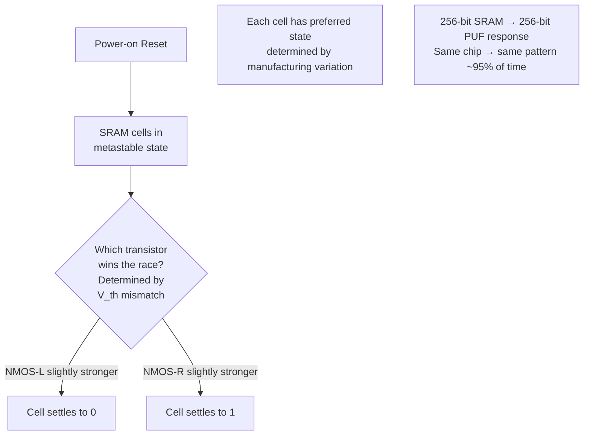
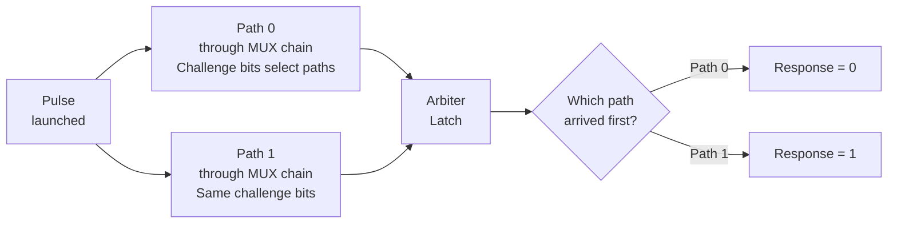
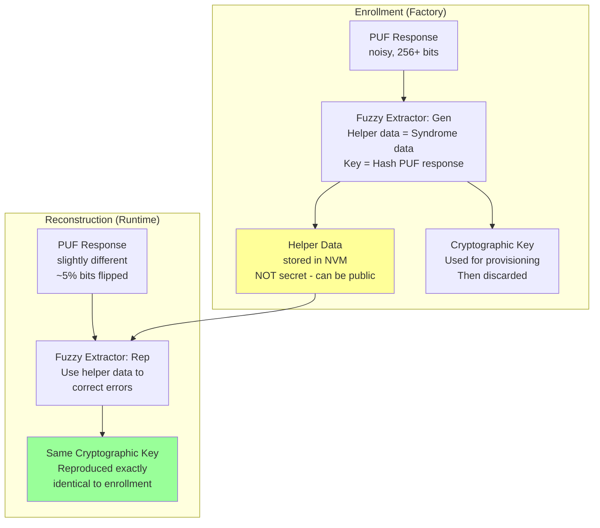
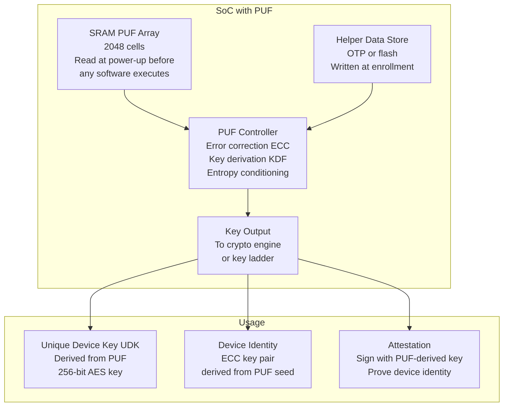
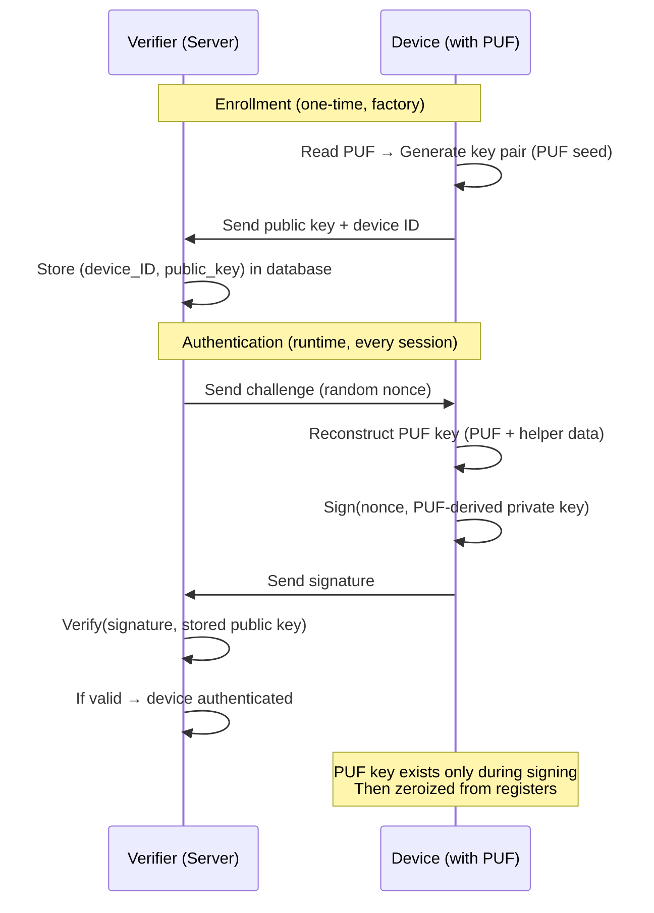

# PUF — Physical Unclonable Functions

**Topic:** Physical Unclonable Functions — Silicon Fingerprinting, Key Generation, Authentication Protocols  
**Standards:** ISO/IEC 20897:2020, NIST IR 8101 (PUF Overview), IEEE P3212 (PUF Quality Metrics)  
**SDO:** ISO/IEC JTC 1/SC 27, NIST, IEEE  
**Audience:** IC security designers, authentication system architects, IoT security engineers, key management specialists  
**Prerequisites:** CMOS process variation, digital design, cryptographic key management, error correction codes

---

## Chapter 1 — Historical Context & Origin Story

### 1.1 Timeline

| Year | Event | Impact |
|------|-------|--------|
| 2001 | Pappu: optical PUF concept (PhD thesis, MIT) | First PUF demonstration |
| 2002 | Gassend et al.: silicon PUF (arbiter PUF) | First electronic PUF |
| 2004 | SRAM PUF demonstrated (power-up values) | Simplest, most practical PUF type |
| 2007 | Ring Oscillator PUF | FPGA-compatible PUF |
| 2010 | Intrinsic-ID (now Synopsys): commercial SRAM PUF IP | First commercial PUF product |
| 2013 | Weak PUF attacks: machine learning modeling | Security concern for simple PUFs |
| 2015 | PUF-based key generation with fuzzy extractors | Reliable key derivation from noisy PUF |
| 2020 | ISO/IEC 20897:2020 published | First international PUF testing standard |
| 2021+ | IEEE P3212 (PUF quality metrics) drafting | Standardized evaluation methodology |
| 2023+ | PUF for PQC: PUF-derived keys for lattice crypto | Post-quantum integration |

### 1.2 PUF Concept

| Aspect | Description |
|--------|-------------|
| **What** | A hardware primitive that exploits manufacturing process variations to create a unique, unclonable device identity |
| **Analogy** | Like a silicon fingerprint — each chip has unique random variations even from the same mask |
| **Source of randomness** | Transistor threshold voltage ($V_{th}$) variations, wire delays, SRAM metastability |
| **Key property** | Same challenge → same response (for same chip). Different chip → different response |
| **Unclonability** | Cannot duplicate manufacturing variations (atomic-scale differences) |
| **No key storage** | Key is derived from physics at runtime — never stored in NVM (no extraction from powered-off chip) |

---

## Chapter 2 — Standard Architecture & Structure

### 2.1 PUF Classification

| Type | Challenge Space | Use Case |
|------|----------------|----------|
| **Weak PUF** (SRAM, butterfly) | Small (1 fixed challenge → 1 response) | Key generation (derive a fixed key) |
| **Strong PUF** (arbiter, XOR arbiter) | Exponential (many challenge-response pairs) | Authentication protocol (CRP-based) |

### 2.2 PUF Metrics (ISO/IEC 20897)

| Metric | Definition | Target |
|--------|-----------|--------|
| **Uniqueness** | Inter-chip Hamming distance (should be ~50%) | 50% ± 5% |
| **Reliability** | Intra-chip Hamming distance across conditions (should be ~0%) | < 5% raw (< 0% after ECC) |
| **Uniformity** | Proportion of 1s in response (should be 50%) | 50% ± 5% |
| **Bit-aliasing** | Same bit position across chips (should be 50% = 0, 50% = 1) | 50% ± 5% |
| **Min-entropy** | Information content per bit (should be close to 1) | > 0.9 bits/bit |

---

## Chapter 3 — Technical Deep Dive

### 3.1 PUF Types

#### SRAM PUF



**Properties:**
- No additional hardware needed (existing SRAM reused)
- Power-up pattern is the PUF response
- ~5% of bits are unstable (flip between readings) → need error correction
- Available in virtually every digital chip

#### Arbiter PUF



- Challenge = N-bit vector controlling MUX switches
- Response = which path is faster (1 bit per challenge)
- $2^N$ possible challenges → strong PUF
- **Vulnerability:** linear delay model → machine learning attack with ~$N^2$ CRPs

#### Ring Oscillator PUF

| Component | Function |
|-----------|----------|
| Multiple ring oscillators | Each oscillates at slightly different frequency (process variation) |
| Frequency counters | Count oscillations in fixed time window |
| Comparator | Compare frequencies of pairs → output 1 if RO_A > RO_B, else 0 |

- Challenge = which pair of ROs to compare
- Response = comparison result
- More reliable than SRAM (frequency is stable)
- Larger area per bit

### 3.2 PUF Key Generation Architecture



### 3.3 Error Correction for PUF

| Challenge | Solution |
|-----------|----------|
| PUF bits flip (~5% bit error rate) | Error Correction Codes (BCH, repetition, Golay) |
| Need exact key every time | Fuzzy extractor: helper data enables error correction |
| Helper data must not leak key | Information-theoretic security: helper data is independent of key |
| Temperature drift affects reliability | Characterize across temperature range (-40 to +125°C) |
| Aging (NBTI/HCI degrades transistors) | Design margin + periodic re-enrollment if needed |

**Typical ECC scheme for SRAM PUF:**

| Parameter | Value |
|-----------|-------|
| Raw PUF bits | 2048 bits |
| Raw bit error rate | 5% |
| ECC: BCH(127,64,21) | Corrects up to 10 errors per 127 bits |
| After ECC | 0 errors (with overwhelming probability) |
| Output key length | 128 bits (after privacy amplification/hashing) |
| Helper data size | ~1024 bits |
| Failure probability | < $10^{-9}$ (one failure per billion reconstructions) |

### 3.4 PUF Security Properties

| Property | Meaning | Implication |
|----------|---------|-------------|
| Unclonability | Cannot fabricate chip with same PUF response | Anti-counterfeiting |
| Tamper evidence | Invasive probing changes PUF response | Physical attack destroys identity |
| No key-at-rest | Key exists only during computation (volatile) | Cold boot attack doesn't extract key |
| Unpredictability | Response cannot be predicted from other responses | Mathematical security |
| Anti-aging (weak) | PUF response may drift over time → reliability challenge | Need design margin |

---

## Chapter 4 — Implementation Guide

### 4.1 PUF Integration in SoC



### 4.2 PUF Use Cases

| Use Case | How PUF Helps |
|----------|---------------|
| **Secure key storage without NVM** | Key derived from PUF at runtime → no key in flash (unhackable at rest) |
| **Device authentication** | Each device has unique PUF → challenge-response authentication |
| **Anti-counterfeiting** | PUF is unclonable → fake chips can't reproduce correct response |
| **Root of trust seed** | DICE/secure boot: PUF provides unique device secret (UDS) |
| **IP protection (FPGA)** | PUF-derived key encrypts bitstream → only correct FPGA can decrypt |
| **Supply chain integrity** | Enrolled PUF at factory → verify same chip arrives at customer |

### 4.3 PUF Enrollment Process

| Step | Action | Who |
|------|--------|-----|
| 1 | Read raw PUF response (multiple readings for reliability) | Manufacturing test |
| 2 | Run fuzzy extractor enrollment (Gen): produce helper data + key | PUF controller HW |
| 3 | Store helper data in OTP/NVM on chip | Manufacturing programming |
| 4 | Optionally: register device identity (PUF-derived public key) in database | Cloud/OEM server |
| 5 | Key is discarded (or used to sign initial certificate) | Secure provisioning system |
| 6 | At runtime: PUF + helper data → same key reconstructed | PUF controller HW |

---

## Chapter 5 — Certification & Audit

### 5.1 PUF in Certification Standards

| Standard | PUF Relevance |
|----------|---------------|
| ISO/IEC 20897:2020 | Specific: PUF characterization and evaluation methods |
| Common Criteria | PUF as key generation mechanism (evaluator checks entropy, reliability) |
| FIPS 140-3 | PUF as entropy source (must meet SP 800-90B entropy requirements) |
| EMVCo | PUF acceptable if demonstrated entropy + reliability + SCA resistance |
| NIST IR 8101 | Overview document: PUF challenges and opportunities |
| IEEE P3212 | Upcoming: standardized quality metrics for PUF |

### 5.2 Evaluation Challenges

| Challenge | Concern |
|-----------|---------|
| Entropy quantification | How much true entropy does PUF provide? (correlation between bits?) |
| Reliability across conditions | Does PUF maintain < 10⁻⁹ failure rate from -40°C to +125°C? |
| Aging | After 10+ years, does PUF still reconstruct correctly? |
| Modeling attacks (strong PUF) | Can ML model predict PUF responses? → disqualifies as strong PUF |
| Side-channel during reconstruction | Does ECC/KDF leak the PUF response or derived key? |
| Helper data leakage | Does helper data reduce entropy of derived key? |

---

## Chapter 6 — Regional & Domain Variants

| Domain | PUF Application |
|--------|----------------|
| IoT/consumer | Low-cost authentication (no secure NVM needed) |
| Automotive | ECU identity, secure boot seed (PUF in SHE/HSM modules) |
| FPGA | Bitstream encryption key (Xilinx/AMD SRAM PUF, Intel/Altera PUF) |
| Smart cards | Key storage alternative (emerging, not yet mainstream) |
| Military/defense | Anti-tamper + anti-counterfeiting (chip authentication) |
| Supply chain | Provenance tracking (enroll at fab, verify at assembly/customer) |

---

## Chapter 7 — Comparison: PUF Types

| Feature | SRAM PUF | Arbiter PUF | Ring Oscillator PUF | Butterfly PUF |
|---------|----------|-------------|--------------------|--------------| 
| Type | Weak | Strong | Weak/Strong | Weak |
| Area overhead | Zero (reuse SRAM) | Small (MUX chain) | Medium (many ROs) | Small (cross-coupled) |
| Reliability | Moderate (5% BER) | Low-moderate (10-15% BER) | High (1-3% BER) | Moderate (5-8% BER) |
| Uniqueness | ~50% | ~50% | ~50% | ~47% |
| ML attack resistance | N/A (weak PUF) | Low (linear model) | N/A (weak PUF) | N/A (weak PUF) |
| FPGA-friendly | Depends on architecture | Yes | Yes | Yes |
| ASIC-friendly | Yes | Yes | Yes | Yes |
| Commercial products | Synopsys (Intrinsic-ID) | Research | Verayo | Research |
| Typical response size | 256-4096 bits | 1 bit per challenge | Pair comparisons | 256-1024 bits |

---

## Chapter 8 — Mermaid Architecture Diagrams

### 8.1 PUF-Based Secure Boot Architecture

```mermaid
graph TB
    A[Power On] --> B[PUF Reads<br/>SRAM power-up values<br/>Before any SW executes]
    B --> C[PUF Controller<br/>+ Helper Data<br/>→ Reconstruct UDK<br/>Unique Device Key 256-bit]
    C --> D[Key Derivation<br/>KDF UDK || 'boot' <br/>→ Boot verification key]
    D --> E{Verify bootloader<br/>signature using<br/>PUF-derived key}
    E -->|Valid| F[Boot continues<br/>Key ladder derives<br/>further keys for each stage]
    E -->|Invalid| G[Boot halted<br/>Tamper event logged]
    
    H[Factory Enrollment:<br/>PUF response → Helper Data<br/>PUF-derived public key<br/>signed into certificate<br/>by OEM CA]
    
    style B fill:#f96
    style C fill:#ff9
```

### 8.2 PUF Authentication Protocol



---

## Chapter 9 — Case Studies & Failure Analysis

### 9.1 SRAM PUF Reliability in Automotive Temperature Range

**Challenge:** Automotive requires operation from -40°C to +150°C (AEC-Q100 Grade 0). SRAM PUF bit error rate (BER) increases with temperature (some cells become "unstable" at temperature extremes).

**Measured data (65nm process):**
- 25°C: BER = 3.2%
- -40°C: BER = 4.8%
- +125°C: BER = 7.1%
- +150°C: BER = 9.3%

**Solution:** Used BCH ECC with margin for worst case (9.3% BER). BCH(255,131,37) corrects up to 18 errors per 255 bits. At 9.3% BER: expected errors = 23.7 per 255 bits → TOO MANY. Upgraded to concatenated code: repetition(3) + BCH(255,131,37). After repetition: effective BER = 2.6% → BCH handles remaining errors. **Cost:** 3× more PUF cells needed (from 2048 to 6144). Trade-off accepted for automotive reliability requirement.

### 9.2 Machine Learning Attack on Arbiter PUF

**Target:** 64-stage arbiter PUF (proposed for CRP-based authentication).

**Attack:** Collected 10,000 challenge-response pairs (CRPs) from the PUF. Trained logistic regression model on the CRPs (exploiting linear delay model). After training: model predicts PUF response with >99% accuracy for unseen challenges.

**Impact:** Strong PUF is "broken" — attacker can build software clone that passes authentication.

**Countermeasures attempted:**
- XOR arbiter PUF (XOR multiple arbiter PUFs) → raises attack to ~$O(2^k)$ for $k$ XOR stages. With $k=5$: still broken with neural networks (~100K CRPs).
- Feed-forward arbiter PUF → partially resistant, but still breakable with deep learning.
- Controlled PUF (limit CRP access via hash function) → effective but loses "strong PUF" property.

**Lesson:** Simple strong PUFs (arbiter, RO-based) are NOT secure against ML modeling attacks with sufficient CRPs exposed. For authentication: use controlled PUFs (limit CRP exposure) or use weak PUF + standard crypto (PUF as key source, authenticate with standard signatures).

---

## Chapter 10 — Future Evolution & Industry Trends

| Trend | Impact |
|-------|--------|
| PUF + DICE integration | PUF provides UDS for DICE identity derivation |
| PQC key generation from PUF | PUF seeds lattice-based key pairs |
| Aging compensation | On-chip aging monitors + periodic re-enrollment |
| PUF in advanced nodes (3nm, 2nm) | Process variation characteristics change → PUF design must adapt |
| Chiplet PUF | Each chiplet has its own PUF identity → composite device identity |
| PUF standardization (IEEE P3212) | Unified quality metrics → easier evaluation |
| PUF for supply chain | Enroll at foundry → track through assembly → verify at end customer |
| Quantum-resistant PUF protocols | PUF + lattice-based crypto for post-quantum authentication |

---

## Chapter 11 — Interview Questions & Career Guide

### Tier 1: Entry-Level (0-3 years)

**Q1:** What is a PUF and how does it differ from traditional key storage?  
**A:** A PUF (Physical Unclonable Function) exploits random manufacturing variations in silicon to create a unique, unclonable identifier for each chip — like a silicon fingerprint. **Traditional key storage:** A secret key is generated, then stored in non-volatile memory (flash, OTP fuses, battery-backed SRAM). At rest (powered off), the key exists in physical memory → vulnerable to extraction (probing, cold boot, flash read-out). **PUF approach:** No key is stored anywhere. At power-on, the PUF circuit generates a response determined by that specific chip's manufacturing variations. Combined with helper data + error correction, this produces a cryptographic key. When powered off: no key exists in any memory. An attacker reading all NVM finds only helper data (which is useless without the physical PUF circuit). **Key advantages:** (1) No key at rest → immune to flash readout attacks. (2) Unclonable → counterfeit chips can't reproduce the key. (3) Tamper-evident → invasive probing changes manufacturing characteristics → key changes.

### Tier 2: Mid-Level (3-8 years)

**Q2:** Design a PUF-based key generation system for an IoT device. Address reliability across temperature and lifetime.  
**A:** **Architecture:** SRAM PUF (zero area overhead, use existing SRAM). **Raw PUF:** 4096 SRAM cells read at every power-on (before software access). **Target:** 256-bit AES key, failure rate < $10^{-9}$, temperature range -20°C to +85°C (industrial). **Reliability analysis:** Raw BER measured across temperature: worst case 6% at -20°C. **ECC design:** Need to correct 6% of 4096 bits = 245 errors. Use soft-decision decoding with concatenated code: inner repetition(5) → effective BER = 0.5%. Then BCH(511,259,61): corrects 30 errors per 511 bits. After ECC: effective output = 259×8/5 = 414 bits (before compression). Hash to 256 bits (SHA-256) for final key. **Helper data:** Generated during factory enrollment: ECC syndrome data (~2KB stored in OTP). Helper data is public (information-theoretically independent of key via privacy amplification). **Aging mitigation:** Characterize SRAM PUF at time 0 and after accelerated aging (HTOL 1000 hours, 125°C). If additional bit flips exceed ECC margin → increase raw PUF size. In this design: 4096 cells with 6% worst-case has 30% ECC margin → sufficient for 10-year lifetime. **Implementation:** PUF read happens in hardware (before CPU starts). Key is ready when software first accesses it. Key never leaves secure hardware boundary (used directly by crypto accelerator).

---

## Chapter 12 — Cheat Sheet & Quick Reference

### PUF Types Summary

```
SRAM PUF:           Power-up values of SRAM cells (most common, zero area overhead)
Arbiter PUF:        Race condition between two paths (strong PUF, ML-vulnerable)
Ring Oscillator:    Frequency comparison between RO pairs (reliable, larger area)
Butterfly PUF:      Cross-coupled NOR/NAND cells (FPGA-friendly)
Glitch PUF:        Timing glitches in combinational logic
DRAM PUF:          Retention-time based (data decay after refresh disable)
Flash PUF:         Partial programming of flash cells
```

### Key Formulas

```
Uniqueness (inter-chip):
  HD_inter = (1/C(n,2)) × Σ HD(R_i, R_j) / L × 100%
  Target: 50%

Reliability (intra-chip):
  HD_intra = (1/M) × Σ HD(R_i,0, R_i,t) / L × 100%
  Target: 0% (after ECC)

Min-entropy:
  H_∞ = -log₂(max(P(0), P(1))) per bit
  Target: > 0.9
```

### PUF vs. Alternatives

```
                    PUF              OTP Fuses        Battery SRAM     Secure Element
Key at rest:        No (volatile)    Yes (permanent)  Yes (volatile)   Yes (tamper-resp)
Clone resistance:   Inherent         Must be secret   Must be secret   Must be secret
Area cost:          Zero (SRAM)      Per-bit fuse     SRAM + battery   External chip
Reliability risk:   BER + aging      Fuse integrity   Battery life     Component failure
Read-out attack:    Very hard        Possible (FIB)   Possible (probe) Tamper-response
Typical use:        IoT, FPGA        Key programming  HSM, TPM         Payment, mobile
```

---

*End of Document — 09_PUF_Physical_Unclonable_Functions.md*
