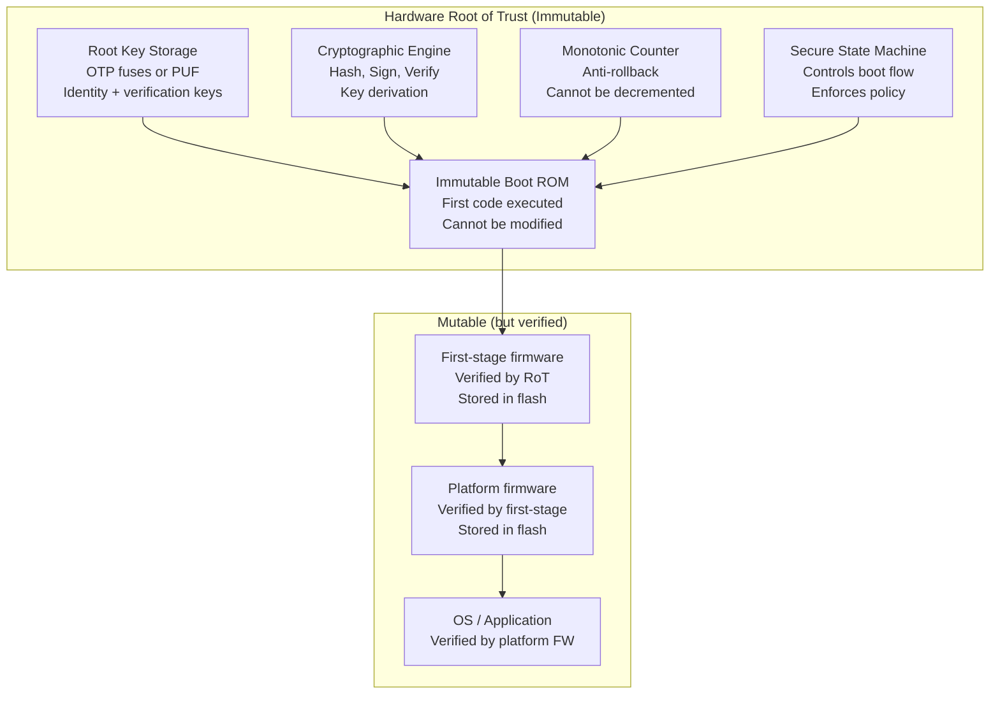
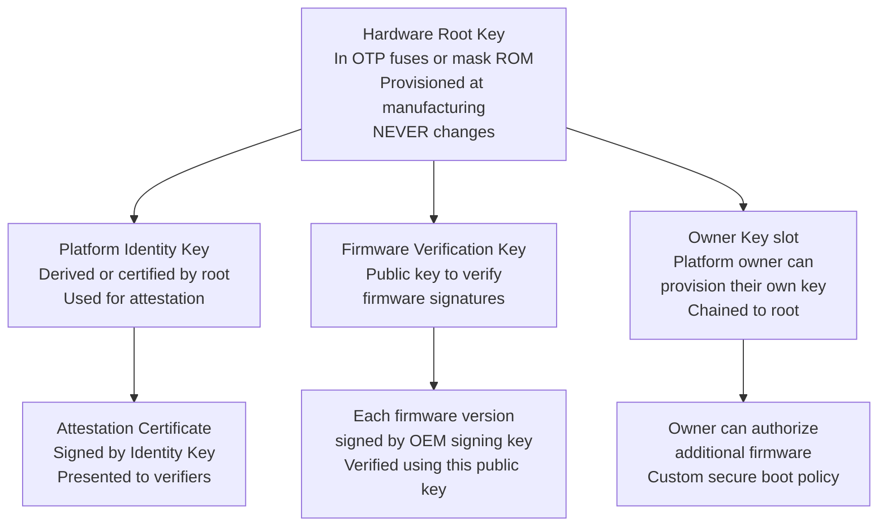
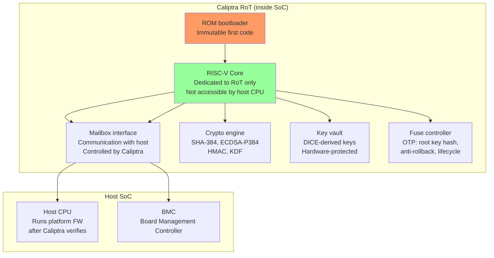
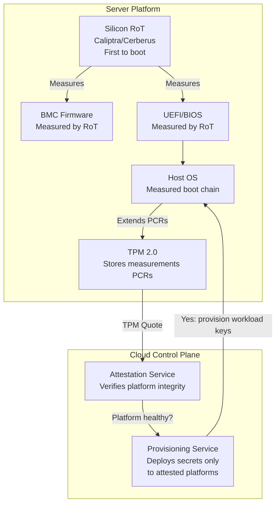
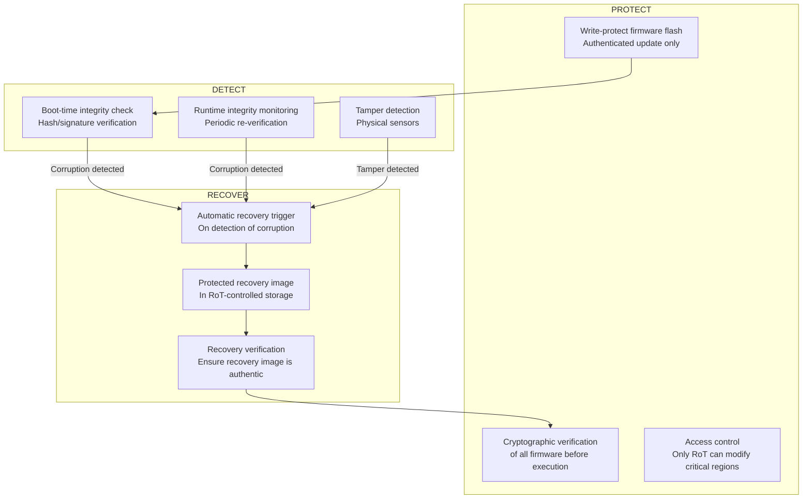
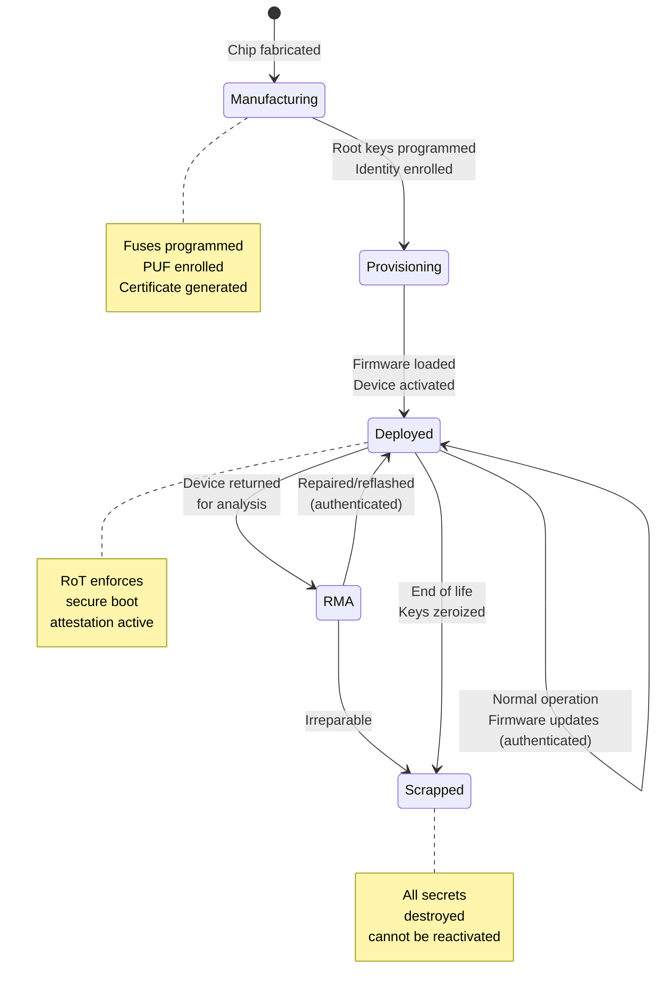

# Root of Trust Architecture

**Topic:** Hardware Root of Trust — Architecture, Standards, Immutable Trust Anchors, and Platform Integrity  
**Standards:** NIST SP 800-193, TCG Roots of Trust, ARM PSA, DICE (TCG), OCP Caliptra, Project Cerberus  
**SDO:** NIST, TCG, ARM, OCP (Open Compute Project), RISC-V  
**Audience:** Platform security architects, SoC designers, firmware security engineers, cloud infrastructure security  
**Prerequisites:** Secure boot concepts, cryptography, chip architecture, trusted computing

---

## Chapter 1 — Historical Context & Origin Story

### 1.1 Timeline

| Year | Event | Impact |
|------|-------|--------|
| 1999 | TCG (Trusted Computing Group) formed | Standardized trusted platform concepts |
| 2003 | TPM 1.2 specification | First hardware root of trust standard |
| 2006 | TCG defines Roots of Trust taxonomy | RTS, RTR, RTM formalized |
| 2014 | TPM 2.0 specification | Enhanced RoT with crypto agility |
| 2017 | NIST SP 800-193 (Platform Firmware Resiliency) | Protect/Detect/Recover framework |
| 2018 | TCG DICE specification | Lightweight RoT for IoT/embedded |
| 2019 | ARM PSA (Platform Security Architecture) | Standardized embedded RoT requirements |
| 2020 | Google OpenTitan (open-source silicon RoT) | Transparent, auditable RoT |
| 2021 | OCP Caliptra (open-source SoC RoT) | Cloud server silicon RoT |
| 2022 | Microsoft Pluton (CPU-integrated RoT) | RoT inside CPU die (AMD/Intel/Qualcomm) |
| 2023 | Project Cerberus (platform RoT for BMC) | Open firmware attestation for servers |
| 2024 | NIST SP 800-193 Rev 1 discussions | Updated for cloud-native, disaggregated systems |

### 1.2 Why Hardware Root of Trust?

| Without Hardware RoT | With Hardware RoT |
|---------------------|-------------------|
| Trust starts from mutable firmware → can be compromised silently | Trust starts from immutable hardware → attacker cannot modify foundation |
| First-boot code in flash → attacker replaces flash content | First-boot code in ROM → unmodifiable, always runs first |
| Keys stored in accessible NVM → extractable | Keys in hardware-protected storage → not readable by software |
| No attestation → cannot prove platform integrity remotely | RoT provides attestation → remote verifier confirms boot integrity |
| Firmware update = overwrite flash → no authentication | RoT enforces authenticated updates → only signed firmware accepted |

---

## Chapter 2 — Standard Architecture & Structure

### 2.1 TCG Roots of Trust Taxonomy

| Root of Trust | Function | Example |
|--------------|----------|---------|
| **RTM** (Root of Trust for Measurement) | First entity that performs integrity measurement (hash) of next component | Boot ROM, CRTM (Core Root of Trust for Measurement) |
| **RTS** (Root of Trust for Storage) | Securely stores measurements and secrets | TPM (PCRs, sealed storage) |
| **RTR** (Root of Trust for Reporting) | Provides attestation (signed proof of measurements) | TPM (Quote operation) |
| **RTU** (Root of Trust for Update) | Ensures only authenticated firmware updates | Secure update engine |
| **RTRec** (Root of Trust for Recovery) | Restores platform to known-good state | Recovery ROM + golden image |

### 2.2 Hardware RoT Architecture (Generic)



---

## Chapter 3 — Technical Deep Dive

### 3.1 Immutable Boot ROM Design

| Requirement | Implementation |
|-------------|---------------|
| Immutability | Mask ROM (part of silicon mask set) or OTP ROM (programmed once at factory) |
| Minimal attack surface | < 10KB code (smallest possible, formally verifiable) |
| No external dependencies | Does not load any configuration from mutable storage before first verification |
| Contains | Hash/signature verification algorithm, root public key (or hash of key in fuses) |
| First action | Verify integrity of next-stage firmware in flash |
| Error handling | If verification fails → halt or enter recovery mode (never execute unverified code) |

### 3.2 Root Key Hierarchy



### 3.3 DICE (Device Identifier Composition Engine)

| Layer | CDI Source | Identity |
|-------|-----------|----------|
| Layer 0 (Hardware) | $CDI_0 = KDF(UDS, Hash(FW_0))$ | Device Identity (hardware-bound) |
| Layer 1 (Firmware) | $CDI_1 = KDF(CDI_0, Hash(FW_1))$ | Firmware Identity |
| Layer 2 (OS) | $CDI_2 = KDF(CDI_1, Hash(OS))$ | OS Identity |
| Layer N | $CDI_N = KDF(CDI_{N-1}, Hash(SW_N))$ | Software Identity |

**Key properties:**
- UDS (Unique Device Secret) is NEVER accessible to any software layer
- Each layer's CDI depends on ALL firmware below it → firmware change = new identity
- Each layer only receives CDI from layer below (cannot access lower layers' CDIs)
- Attestation: each layer creates alias certificate → chain proves entire SW stack

### 3.4 ARM PSA (Platform Security Architecture)

| PSA Level | Requirements |
|-----------|-------------|
| Level 1 | Security model defined, threat model created, PSA-RoT present |
| Level 2 | Tested against Level 1 + lab evaluation of RoT isolation |
| Level 3 | Level 2 + substantial resistance to hardware and software attacks |

**ARM PSA-RoT Components:**

| Component | Function |
|-----------|----------|
| Secure Boot | Verify firmware integrity from immutable RoT |
| Secure Storage | Isolated key/data storage (hardware-protected) |
| Attestation | Report device identity + firmware state (signed) |
| Crypto services | Provide crypto to non-secure world (isolated) |
| Lifecycle management | Manage device state (provisioning → deployed → decommissioned) |

### 3.5 OCP Caliptra (Silicon Root of Trust)



**Caliptra features:**
- Open-source RTL (auditable, no black boxes)
- DICE identity: device + firmware bound
- Runs before host CPU starts (measures host firmware)
- Mailbox: host requests crypto services from Caliptra
- Anti-rollback: fuse-based monotonic counter

### 3.6 Google OpenTitan

| Feature | Description |
|---------|-------------|
| Architecture | Open-source silicon RoT (full chip design: RTL, FW, tooling) |
| Core | RISC-V Ibex (32-bit) |
| Crypto | AES-128/256, SHA-256/384/512, ECDSA P-256, HMAC, KMAC |
| Key manager | Hardware key ladder (DICE-compliant) |
| Lifecycle | Manufacturing → development → production → RMA → scrapped |
| Flash controller | Integrity-protected, scrambled, access-controlled |
| Alert handler | Monitors security violations, escalates to response |
| Transparency | All design public (GitHub), community-reviewed |

### 3.7 Microsoft Pluton

| Feature | Description |
|---------|-------------|
| Integration | Inside CPU die (AMD Ryzen, Intel, Qualcomm) |
| No external bus | Keys never travel on external bus (no sniffing) |
| Firmware update | Updated via Windows Update (cloud-managed) |
| Capabilities | TPM functionality + RoT + firmware protection |
| Attack surface | Eliminates physical attack on TPM ↔ CPU bus |

---

## Chapter 4 — Implementation Guide

### 4.1 Designing a Hardware Root of Trust

| Design Decision | Options | Trade-off |
|----------------|---------|-----------|
| RoT location | Discrete chip vs. integrated in SoC | Discrete: easier cert, SoC: lower cost, no bus |
| Key storage | OTP fuses vs. PUF vs. battery-SRAM | Fuses: simple/permanent; PUF: no key-at-rest |
| Boot ROM size | Minimal (2-10KB) vs. full bootloader | Minimal: less attack surface; full: more features |
| Crypto algorithms | ECC-P256 vs. P384 vs. RSA-2048 | ECC: smaller keys, faster; RSA: legacy compat |
| Identity standard | TPM 2.0 vs. DICE vs. custom | TPM: ecosystem; DICE: lightweight/modern |
| Open vs. proprietary | OpenTitan/Caliptra vs. vendor-specific | Open: auditable; proprietary: differentiation |

### 4.2 RoT Integration Checklist

| Step | Action |
|------|--------|
| 1 | Define trust boundary (what's inside RoT perimeter) |
| 2 | Ensure RoT executes FIRST after reset (before any mutable code) |
| 3 | Root key provisioned securely during manufacturing (key ceremony) |
| 4 | Boot ROM verified (static analysis, formal methods if possible) |
| 5 | Anti-rollback mechanism (monotonic counter or fuses) |
| 6 | Recovery mechanism (NIST SP 800-193: restore from known-good image) |
| 7 | Attestation capability (sign measurements for remote verifier) |
| 8 | Lifecycle management (manufacturing → provisioned → field → decommission) |
| 9 | Physical security appropriate to threat model (tamper response if needed) |
| 10 | Side-channel resistance for crypto operations in RoT |

### 4.3 Root of Trust in Server/Cloud Architecture



---

## Chapter 5 — Certification & Audit

### 5.1 Relevant Standards and Certifications

| Standard | RoT Coverage |
|----------|-------------|
| NIST SP 800-193 | Platform firmware resiliency: Protect, Detect, Recover |
| TCG PC Client spec | TPM-based measured boot for PCs |
| ARM PSA Certified | Three levels of IoT/embedded security |
| FIPS 140-3 | RoT crypto module certification |
| Common Criteria | Protection Profiles for RoT (e.g., BSI-CC-PP-0084) |
| SESIP (GlobalPlatform) | Security Evaluation Standard for IoT Platforms |
| OCP Security spec | Data center silicon RoT requirements |

### 5.2 Evaluation Criteria

| Criterion | What Evaluator Checks |
|-----------|----------------------|
| Immutability | ROM truly un-modifiable (mask ROM or verified OTP)? |
| First execution | RoT code runs before any other code (no preemption possible)? |
| Key protection | Root keys not accessible to software (even privileged)? |
| Isolation | RoT execution environment isolated from host? |
| Minimal TCB | RoT code size minimal, auditable, formally verified? |
| Side-channel | RoT crypto resistant to SCA? |
| Physical | Appropriate tamper protection for threat model? |
| Recovery | Can recover from compromised firmware without RoT compromise? |

---

## Chapter 6 — Regional & Domain Variants

| Domain | RoT Approach |
|--------|-------------|
| PC/Laptop | TPM 2.0 (discrete or firmware) + Intel/AMD Boot Guard |
| Cloud server | Caliptra (silicon RoT) + Cerberus (platform RoT) + TPM |
| Mobile (Android) | SoC-integrated RoT (Qualcomm SPU, Samsung Knox, Google Titan M2) |
| Mobile (Apple) | Secure Enclave Processor (SEP) — custom Apple RoT |
| Automotive | HSM module (SHE 2.0, Infineon AURIX HSM, NXP HSE) |
| IoT/embedded | DICE (lightweight), ARM PSA-RoT, PUF-based |
| Payment | Secure Element (SE) with CC EAL 5+, FIPS 140-3 Level 3 |
| FPGA | Configuration security (encrypted bitstream, PUF key) |

---

## Chapter 7 — Comparison: Root of Trust Implementations

| Feature | TPM 2.0 | DICE | Caliptra | OpenTitan | Pluton |
|---------|---------|------|----------|-----------|--------|
| Type | Discrete/firmware/integrated | Lightweight specification | Silicon RoT (SoC) | Standalone chip | CPU-integrated |
| Standard | TCG TPM 2.0 | TCG DICE | OCP specification | OpenTitan project | Microsoft specification |
| Target | PC, server, IoT | IoT, embedded | Cloud servers, SoCs | General purpose | PC (consumer/enterprise) |
| Crypto | RSA, ECC, AES, SHA | SHA + ECC (minimal) | SHA-384, ECDSA-P384 | AES, SHA, ECC, KMAC | TPM-equivalent |
| Open source | Some (sw-TPM) | Spec is open | Yes (RTL + FW) | Yes (full chip) | No (proprietary) |
| Area | Small chip or IP block | Minimal (few gates) | ~100K gates | Full chip | Inside CPU |
| Attestation | PCR-based quote | Certificate chain | DICE + Caliptra ext | DICE-based | Windows-integrated |
| Key storage | Shielded NVM | PUF or fuses + KDF | Fuses + key vault | Flash + scrambling | CPU-internal |

---

## Chapter 8 — Mermaid Architecture Diagrams

### 8.1 NIST SP 800-193: Protect, Detect, Recover



### 8.2 Device Lifecycle with RoT



---

## Chapter 9 — Case Studies & Failure Analysis

### 9.1 TPM Bus Sniffing Attack (2021)

**Target:** Discrete TPM chip (connected to CPU via LPC/SPI bus on motherboard).

**Attack:** Researcher soldered probe wires to the LPC bus between TPM and CPU. Captured TPM communication during boot. Extracted BitLocker Volume Master Key (VMK) from the bus — because Windows sends the VMK in plaintext over the TPM bus after TPM unseal operation.

**Impact:** Full disk encryption (BitLocker) bypassed in minutes with $50 equipment.

**Root cause:** Discrete TPM communicates over an external bus (LPC/SPI) that can be probed. The unsealed key travels in plaintext on this bus.

**Mitigations:**
- **Firmware TPM (fTPM):** TPM functionality inside CPU (no external bus) — AMD, Intel
- **Microsoft Pluton:** RoT inside CPU die (no bus to probe at all)
- **TPM + PIN:** Require user PIN (not just TPM unseal) — key derived from TPM + PIN
- **Encrypted TPM bus:** Some designs encrypt TPM communication (TPM 2.0 session encryption)

**Lesson:** Discrete silicon RoT has physical attack surface on the interconnect bus. Modern trend: integrate RoT INTO the main processor die (Pluton, Apple SEP, Google Titan M2) to eliminate bus-level attacks.

### 9.2 Automotive: HSM Root of Trust Compromise via Debug

**Target:** Automotive ECU with integrated HSM (root of trust for secure boot and key storage).

**Vulnerability:** HSM was correctly implemented, but the APPLICATION PROCESSOR had unsecured JTAG. Attacker used JTAG to: (1) Halt application processor. (2) Modify communication buffer between app processor and HSM. (3) Trick HSM into signing attacker's firmware (by placing attacker's hash in the "firmware to verify" buffer).

**Root cause:** RoT (HSM) was secure, but the interface between HSM and host processor was not protected against host-side compromise. HSM trusted data from the application processor without independent verification.

**Fix:** HSM must independently read firmware from flash (not accept host-provided hash). HSM has its own flash controller — reads firmware directly. Host processor cannot influence what HSM measures.

---

## Chapter 10 — Future Evolution & Industry Trends

| Trend | Impact |
|-------|--------|
| RoT convergence | TPM + secure boot + DICE converging into single integrated standard |
| Open-source silicon RoT | OpenTitan, Caliptra driving transparency (auditable security) |
| CPU-integrated RoT | Pluton (Microsoft), SEP (Apple) — no external bus attack surface |
| Post-quantum RoT | RoT must support PQC algorithms for key generation + verification |
| Confidential computing | RoT provides attestation for TEE launch (TDX, SEV, CCA) |
| Supply chain security | RoT proves provenance (chip → board → system → deployment) |
| Disaggregated systems | Each chiplet/component needs its own RoT → composite attestation |
| Zero-trust infrastructure | Every platform must attest before accessing resources |

---

## Chapter 11 — Interview Questions & Career Guide

### Tier 1: Entry-Level (0-3 years)

**Q1:** What is a Hardware Root of Trust and why must it be in hardware?  
**A:** A Hardware Root of Trust (HRoT) is the foundational component that ALL security on a platform ultimately depends on. It's the first thing that executes after power-on and the first thing that makes a trust decision (verify next firmware). **Why hardware (not software)?** A root of trust must be IMMUTABLE — it cannot be modified by any attacker regardless of their software privileges. If the root were in modifiable flash, an attacker with flash access could replace it → all security built on top collapses. Hardware guarantees: (1) Boot ROM burned into silicon — no write interface exists. (2) Root keys in OTP fuses — physically one-time programmable, no erase. (3) Executes before any software — cannot be preempted or bypassed. This creates an unforgeable starting point. From this immutable anchor, a chain of trust extends: each subsequent component is verified before execution.

### Tier 2: Mid-Level (3-8 years)

**Q2:** Compare TPM 2.0, DICE, and Caliptra as root of trust solutions. When would you choose each?  
**A:** **TPM 2.0:** Separate secure element (discrete chip or firmware). Standardized by TCG. Provides: measurement storage (PCRs), key generation/storage, attestation (Quote), sealing (bind data to platform state). Choose when: PC/server environment, need standardized ecosystem (Windows BitLocker, Linux IMA), hardware-based key protection. Limitation: discrete TPM has bus attack surface; fTPM shares CPU with host (less isolation). **DICE:** Minimal specification (just a key derivation flow). No separate chip needed — can be pure logic in boot ROM. Provides: device identity bound to firmware (CDI changes if firmware changes). Choose when: constrained IoT, automotive, embedded. Minimal area/cost. Need firmware-bound identity without full TPM weight. Limitation: no sealed storage, no complex key management (just identity + attestation). **Caliptra:** Dedicated RISC-V core inside SoC (open-source). Provides: all of DICE + independent measurement engine + firmware verification + key vault. Choose when: cloud/datacenter SoCs (high-assurance servers), want open-source transparency, need strong isolation from host CPU. Think of it as "TPM-level functionality, DICE identity model, integrated into SoC, fully open-source."

### Tier 3: Senior (8-15 years)

**Q3:** Design the root of trust architecture for a next-generation server platform supporting confidential computing.  
**A:** **Requirements:** Attest platform to cloud orchestrator. Protect tenant workloads (confidential VMs). Survive BMC compromise. Support PQC transition. **Architecture:** **(1) Silicon RoT (Caliptra model):** Dedicated RISC-V core inside server SoC. Immutable boot ROM (8KB). Fuse-stored root key (ECDSA-P384 + ML-DSA-65 for PQC readiness). Independent flash controller (RoT reads firmware directly from SPI flash — host CPU cannot interfere). **Boot flow:** RoT boots first → measures BMC firmware + host BIOS → extends measurements into RoT-internal PCR equivalent → THEN releases host CPU from reset. **Attestation:** RoT signs DICE certificate chain. Attestation includes: hardware identity + all firmware hashes + security configuration (debug disabled, fuse state). Remote attestation service verifies before provisioning workload secrets. **(2) Confidential computing integration:** CPU provides memory encryption (like Intel TDX or AMD SEV). RoT measures: CPU microcode + security configuration. Launch measurement of confidential VM included in attestation. Result: remote verifier gets proof that: hardware is genuine (RoT identity) + firmware is correct (measured boot) + VM launched correctly (launch measurement) + memory is encrypted (configuration attestation). **(3) Recovery (NIST 800-193):** Golden firmware image in RoT-controlled flash region (write-protected from host). If primary firmware corrupted → RoT recovers automatically. Recovery image itself signed by RoT root key. **(4) Supply chain:** Caliptra open-source RTL → auditable by customers. RoT identity certificate chains to server OEM CA → verifiable provenance. **(5) Anti-rollback:** Hardware monotonic counter (fuse-based, 256+ bits). Each firmware version increments counter. Old firmware cannot be re-installed even with RoT access.

---

## Chapter 12 — Cheat Sheet & Quick Reference

### Root of Trust Types

```
Silicon RoT:        Logic inside SoC die (Caliptra, OpenTitan, Pluton)
Discrete RoT:       Separate chip on board (TPM, Titan, SE)
Firmware RoT:       Software RoT in TEE (fTPM in TrustZone) — weaker isolation
Boot ROM RoT:       Mask ROM in SoC (first code, immutable)
Platform RoT:       Manages platform firmware (Cerberus for BMC)
```

### TCG Roots of Trust Functions

```
RTM  - Root of Trust for Measurement:   First to measure (hash) next component
RTS  - Root of Trust for Storage:        Securely stores measurements/secrets
RTR  - Root of Trust for Reporting:      Signs attestation evidence
RTU  - Root of Trust for Update:         Authenticates firmware updates
RTRec - Root of Trust for Recovery:      Restores known-good state
```

### Key Standards Reference

```
NIST SP 800-193:    Firmware Resiliency (Protect, Detect, Recover)
TCG TPM 2.0:        Trusted Platform Module specification
TCG DICE:           Device Identifier Composition Engine
ARM PSA:            Platform Security Architecture (IoT focus)
OCP Caliptra:       Open-source silicon RoT for cloud
OpenTitan:          Open-source standalone RoT chip
SESIP:              GlobalPlatform IoT security evaluation
```

### Decision Tree: Selecting RoT Technology

```
Server / Cloud?
  → Caliptra (silicon, open-source) + TPM 2.0 (ecosystem)

PC / Laptop?
  → TPM 2.0 (discrete or fTPM) + Boot Guard/Secure Boot

Mobile phone?
  → Vendor SoC RoT (Titan M2, SEP, SPU) — integrated

IoT / Embedded (cost-sensitive)?
  → DICE (minimal) + PSA-RoT (ARM)

Automotive ECU?
  → Integrated HSM (SHE 2.0 / Evita Full) + DICE identity

Need transparency / auditability?
  → OpenTitan (full chip open-source)

Need remote attestation?
  → TPM Quote OR DICE certificate chain
```

---

*End of Document — 10_Root_of_Trust_Architecture.md*
