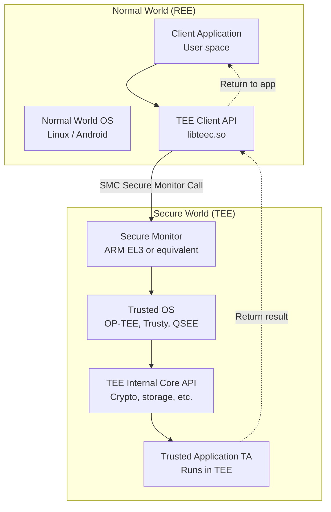
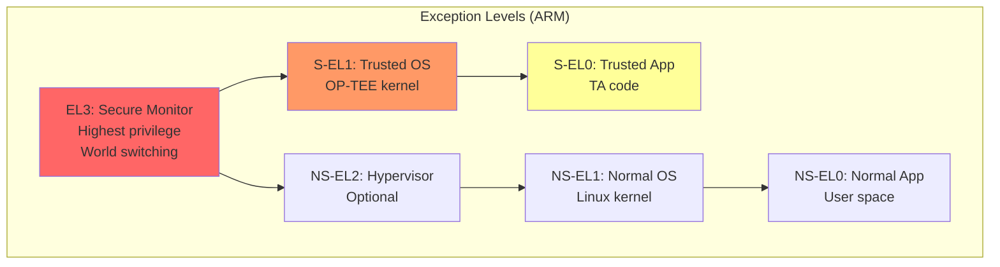
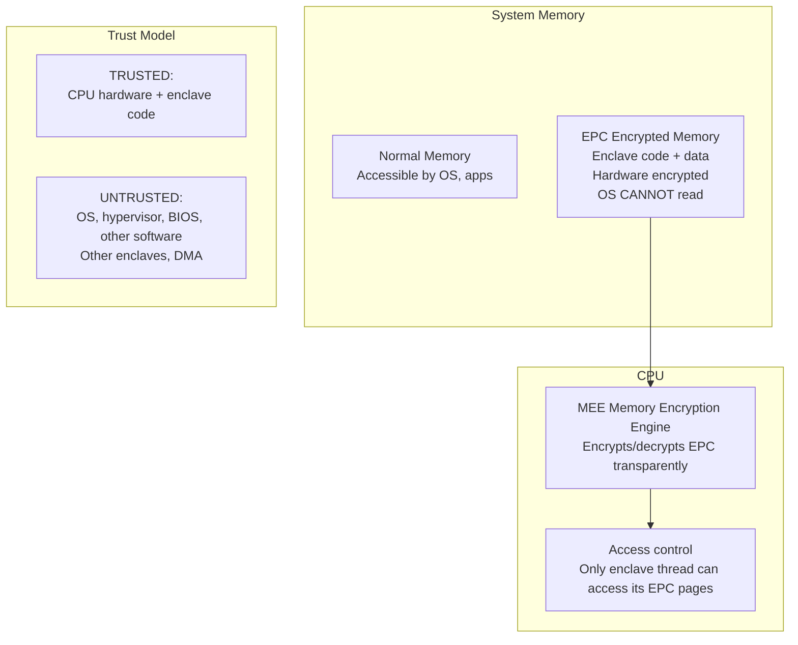
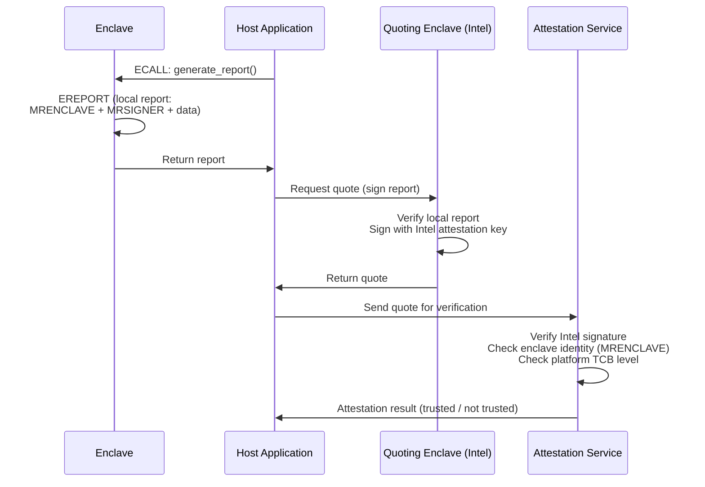
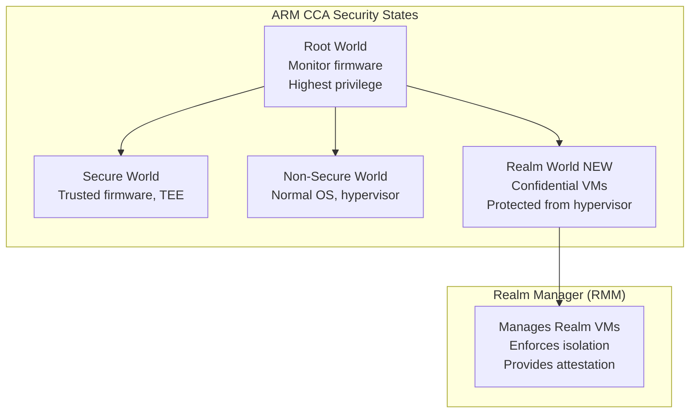
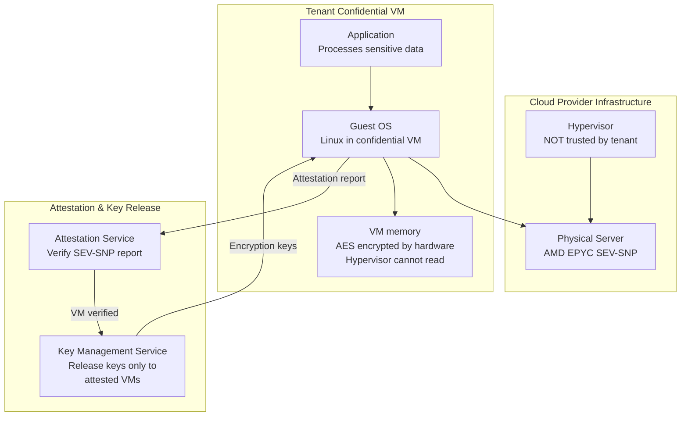
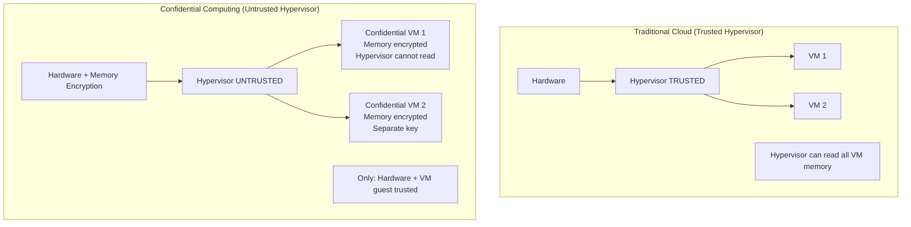
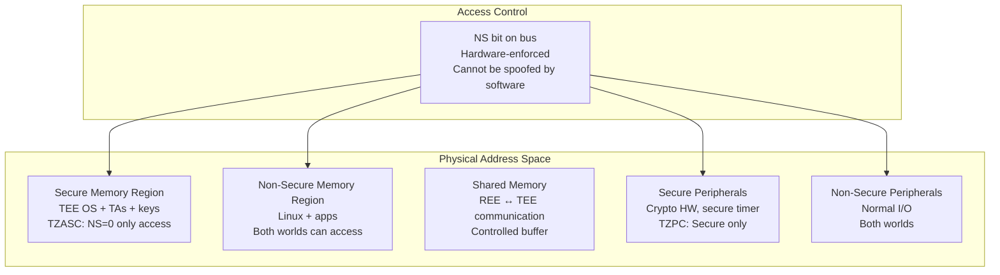

# Secure Enclave & TEE Standards

**Topic:** Trusted Execution Environments — Architecture, Standards, Isolation Mechanisms, and Platform Security  
**Standards:** GlobalPlatform TEE, ARM TrustZone, Intel SGX/TDX, AMD SEV, RISC-V PMP/ePMP, Arm CCA  
**SDO:** GlobalPlatform, ARM, Intel, AMD, RISC-V Foundation, TCG  
**Audience:** TEE architects, platform security engineers, confidential computing developers, OS security engineers  
**Prerequisites:** CPU architecture, privilege levels, memory management, virtualization, cryptography

---

## Chapter 1 — Historical Context & Origin Story

### 1.1 Timeline

| Year | Event | Impact |
|------|-------|--------|
| 2003 | ARM TrustZone introduced (ARM1176) | Hardware-partitioned secure world |
| 2006 | GlobalPlatform TEE specification v1.0 | Standardized TEE API |
| 2009 | Samsung Knox uses TrustZone | Commercial TEE deployment at scale |
| 2013 | Intel SGX announced (Skylake CPUs) | Application-level enclaves |
| 2016 | AMD SEV (Secure Encrypted Virtualization) | VM-level memory encryption |
| 2017 | RISC-V PMP (Physical Memory Protection) | Open-source hardware isolation |
| 2018 | Intel SGX v2 (scalable enclaves, EDMM) | Dynamic memory management |
| 2019 | AMD SEV-ES (Encrypted State) | Register state encryption |
| 2020 | ARM CCA (Confidential Compute Architecture) | Realm-based isolation |
| 2021 | Intel TDX (Trust Domain Extensions) | VM-level confidential computing |
| 2022 | AMD SEV-SNP (Secure Nested Paging) | Strong integrity + attestation |
| 2023 | RISC-V CoVE (Confidential Virtual Extension) | RISC-V confidential computing |
| 2024 | Arm CCA in production (ARMv9.2) | Realms deployed in cloud |

### 1.2 TEE vs. Secure Enclave Distinction

| Concept | Trusted Execution Environment (TEE) | Secure Enclave |
|---------|-------------------------------------|----------------|
| Scope | Entire isolated execution domain | Specific isolated computation |
| Example | ARM TrustZone Secure World | Intel SGX enclave |
| Isolation | CPU mode/world separation | Page-level memory encryption |
| OS in TEE | Yes (Trusted OS runs in TEE) | No (enclave is user-mode only) |
| Trust model | Trust the TEE OS | Trust ONLY enclave code (not even OS) |
| Attack model | Protect from Normal World | Protect from OS, hypervisor, hardware |

---

## Chapter 2 — Standard Architecture & Structure

### 2.1 GlobalPlatform TEE Specification

| Component | Specification | Function |
|-----------|--------------|----------|
| TEE Internal Core API | GPD_SPE_010 | Crypto, storage, time, arithmetic for TAs |
| TEE Client API | GPD_SPE_007 | Normal world app ↔ TA communication |
| TEE System Architecture | GPD_SPE_009 | TEE structure, TA loading, memory model |
| TEE Secure Element API | GPD_SPE_015 | TEE ↔ Secure Element communication |
| TEE Protection Profile | GPD_SPE_021 | Common Criteria evaluation basis |
| TEE TA Debugging | GPD_SPE_022 | Debug interface for trusted applications |

### 2.2 TEE Architecture (GlobalPlatform)



---

## Chapter 3 — Technical Deep Dive

### 3.1 ARM TrustZone

| Feature | Description |
|---------|-------------|
| Security state | CPU has two worlds: Secure (S) and Non-Secure (NS) |
| EL3 (Secure Monitor) | Switches between worlds; highest privilege |
| NS bit | Propagated on bus transactions → hardware enforces access control |
| Memory partitioning | TZASC (TrustZone Address Space Controller) assigns regions |
| Peripheral partitioning | TZPC assigns peripherals to Secure or Non-Secure |
| Interrupt routing | GIC routes IRQs to specific world (FIQ typically → Secure) |



### 3.2 Intel SGX (Software Guard Extensions)

| Concept | Description |
|---------|-------------|
| Enclave | Protected memory region; encrypted in DRAM |
| EPC (Enclave Page Cache) | Hardware-encrypted memory for enclaves |
| Sealing | Encrypt data to enclave identity (persists across power cycles) |
| Attestation | Prove to remote party what code is running in enclave |
| TCB | Only CPU hardware + enclave code (OS/hypervisor EXCLUDED) |



**SGX Attestation Flow:**



### 3.3 AMD SEV / SEV-ES / SEV-SNP

| Generation | Protection | What's Protected |
|-----------|-----------|-----------------|
| SEV | Memory encryption (per-VM keys) | VM memory from hypervisor |
| SEV-ES | + Register state encryption | VM registers during VMEXIT |
| SEV-SNP | + Integrity + attestation | Memory integrity (anti-replay), attestation |

**Key architecture:**

| Component | Function |
|-----------|----------|
| AMD-SP (Secure Processor) | ARM Cortex-A5 inside AMD CPU; manages SEV keys |
| AES-128 memory encryption | Each VM has unique encryption key (hardware-managed) |
| RMP (Reverse Map Table) | Tracks which VM owns each page (integrity) |
| VMPL (VM Permission Levels) | 4 privilege levels within a single VM |
| Attestation | AMD-SP signs measurement of guest (launch + runtime) |

### 3.4 Intel TDX (Trust Domain Extensions)

| Feature | Description |
|---------|-------------|
| Trust Domain (TD) | Isolated VM with hardware-encrypted memory |
| SEAM module | Intel-signed firmware managing TDs (replaces hypervisor trust) |
| Memory encryption | AES-128-XTS per TD (hardware key, not accessible to hypervisor) |
| Integrity | TD memory pages have integrity protection (MAC) |
| Attestation | TD can generate attestation report (signed by Intel) |
| Trust model | Hypervisor removed from TCB (similar to SEV-SNP) |

### 3.5 ARM Confidential Compute Architecture (CCA)



**CCA vs. SEV-SNP vs. TDX:**

| Feature | ARM CCA | AMD SEV-SNP | Intel TDX |
|---------|---------|-------------|-----------|
| Architecture | ARMv9 | x86 (AMD) | x86 (Intel) |
| Isolation unit | Realm (VM or process) | VM (guest) | Trust Domain (VM) |
| Memory encryption | Hardware (per-realm key) | AES-128 per VM | AES-128-XTS per TD |
| Integrity | Yes (GPT-based) | Yes (RMP) | Yes (MAC) |
| Attestation | CCA attestation token | AMD-SP signed report | Intel SEAM signed report |
| Extra privilege levels | 4 worlds (Root, Secure, NS, Realm) | VMPL (4 levels in VM) | No extra in-TD levels |

### 3.6 RISC-V PMP / ePMP

| Feature | PMP (Physical Memory Protection) | ePMP (Enhanced PMP) |
|---------|----------------------------------|---------------------|
| Mechanism | Hardware registers configure memory region access rules | Enhanced: lock M-mode out of U/S regions |
| Granularity | Per-region (8-16 regions typical) | Same + machine-mode lockout |
| Use case | M-mode configures protection for S/U modes | Secure enclaves (Keystone, Sanctum) |
| Trust model | Machine mode (M) is trusted, configures PMP for lower modes | ePMP can restrict M-mode access too |

---

## Chapter 4 — Implementation Guide

### 4.1 Choosing a TEE Technology

| Criterion | TrustZone | SGX | SEV-SNP | TDX | CCA |
|-----------|-----------|-----|---------|-----|-----|
| Platform | ARM SoCs | Intel (deprecated for client) | AMD EPYC | Intel Xeon (4th gen+) | ARMv9 |
| Isolation granularity | Entire secure world | Per-application enclave | Per-VM | Per-VM | Per-realm |
| Best for | Mobile, IoT, embedded | Sensitive computation (legacy) | Cloud VMs | Cloud VMs | Cloud + edge |
| Memory limit | Configurable (TZASC) | Limited EPC (256MB+) | Full RAM per VM | Full RAM per TD | Full RAM per realm |
| OS in trusted domain | Yes (Trusted OS) | No (user-mode only) | Yes (full guest OS) | Yes (full guest OS) | Yes (full realm OS) |
| Performance overhead | Minimal (world switch ~μs) | 5-20% (enclave transitions) | 2-5% (encryption) | 2-5% (encryption) | 2-5% (estimated) |

### 4.2 OP-TEE (Open Portable TEE) Implementation

| Component | Description |
|-----------|-------------|
| OP-TEE OS | Open-source Trusted OS (GlobalPlatform compliant) |
| Trusted Applications | Loaded into Secure World (signed, authenticated) |
| Shared memory | REE ↔ TEE communication (designated shared buffer) |
| Crypto | Built-in: AES, RSA, ECC, SHA, HMAC |
| Secure storage | Encrypted + integrity-protected TA data (stored in normal flash, encrypted by TEE) |
| Platforms | ARM Cortex-A (TrustZone): HiKey, i.MX, QEMU, Raspberry Pi |

### 4.3 Confidential Computing Deployment Architecture



---

## Chapter 5 — Certification & Audit

### 5.1 TEE Certifications

| Standard | Applicable To | Level |
|----------|--------------|-------|
| GlobalPlatform TEE PP | TEE implementations | CC EAL 2-5 (varies by PP) |
| FIPS 140-3 | Crypto within TEE | Level 1-2 (software module in TEE) |
| ARM PSA Certified | TrustZone-based platforms | PSA Level 1-3 |
| Common Criteria (BSI) | Specific TEE products | EAL 4+ typical |
| SESIP (GlobalPlatform) | IoT platforms with TEE | Level 1-5 |
| PCI (payment) | TEE for payment (e.g., Samsung Knox) | PCI PTS compliance |

### 5.2 Security Evaluation Concerns

| Concern | Evaluation Focus |
|---------|-----------------|
| Isolation strength | Can Normal World access Secure World memory? (hardware verification) |
| Side channels | Can Normal World extract secrets via cache/power/timing? |
| Secure boot of TEE | Is TEE OS itself securely booted (verified)? |
| TA authentication | Only signed TAs can load? Signature verification? |
| Rollback protection | Can old (vulnerable) TA version be re-installed? |
| Debug interface | Is secure debug properly controlled? |
| Shared memory | Is shared memory properly sanitized (no info leak)? |

---

## Chapter 6 — Regional & Domain Variants

| Domain | TEE Usage |
|--------|-----------|
| Mobile (Android) | TrustZone: Keymaster, Gatekeeper, DRM (Widevine) |
| Mobile (iOS) | Secure Enclave Processor (proprietary, similar concept) |
| Payment | TEE for mobile payment (Samsung Pay, Google Pay) — GP TEE |
| Cloud (IaaS) | Confidential VMs: SEV-SNP (Azure, GCP), TDX (Azure) |
| Cloud (PaaS) | Confidential containers: SGX enclaves (Azure), Nitro (AWS) |
| Automotive | TrustZone for key storage, secure OTA, V2X credentials |
| IoT | TrustZone-M (Cortex-M33+), PMP (RISC-V) |
| Healthcare | Confidential computing for medical data processing |

---

## Chapter 7 — Comparison: TEE Technologies

| Feature | ARM TrustZone | Intel SGX | AMD SEV-SNP | Intel TDX | ARM CCA |
|---------|--------------|-----------|-------------|-----------|---------|
| Year | 2003 | 2015 | 2020 | 2023 | 2022 |
| Isolation | Two worlds (S/NS) | Per-enclave | Per-VM | Per-TD | Per-realm |
| Memory encryption | No (just access control) | Yes (MEE) | Yes (AES-128) | Yes (AES-XTS) | Yes (MEC) |
| OS in protected domain | Yes (Trusted OS) | No (user-mode) | Yes (guest OS) | Yes (guest OS) | Yes (realm OS) |
| Attestation | Limited (vendor-specific) | Intel DCAP | AMD SP report | Intel SEAM | CCA token |
| Performance | <1% (world switch) | 5-20% | 2-5% | 2-5% | 2-5% (est.) |
| Max protected memory | Configurable | 256MB-1TB (SGX2) | Full RAM | Full RAM | Full RAM |
| Open source | OP-TEE (OS), HW proprietary | SDK open, HW proprietary | SVSM (open) | TDX module (open) | RMM (open) |
| Main use case | Mobile TEE, embedded | Legacy enclaves | Cloud confidential VMs | Cloud confidential VMs | Cloud + edge |
| Status (2024) | Mature, widespread | Deprecated (client), server only | Production (Azure, GCP) | Production (Azure) | Early production |

---

## Chapter 8 — Mermaid Architecture Diagrams

### 8.1 Confidential Computing Trust Model



### 8.2 ARM TrustZone Memory Partitioning



---

## Chapter 9 — Case Studies & Failure Analysis

### 9.1 SGX Side-Channel: Foreshadow (L1 Terminal Fault)

**Attack (2018):** Foreshadow (CVE-2018-3615) exploited L1 cache timing to extract secrets from SGX enclaves.

**Mechanism:** When CPU speculatively accesses a page marked as "not present" (terminal fault), it reads stale L1 cache data. If enclave data was in L1 cache → attacker can read it via speculative execution + cache side-channel.

**Impact:** Complete compromise of SGX enclave secrets (attestation keys, sealed data). Broke SGX's security guarantee (OS cannot read enclave memory).

**Mitigations:** Microcode update (flush L1 on enclave transitions). Hyperthreading: flush L1 on context switch. Performance impact: 5-30% depending on workload.

**Lesson:** Hardware isolation (encryption + access control) is necessary but not sufficient. Microarchitectural side channels (speculative execution, caches) can bypass hardware access control. Defense requires: hardware fixes + microcode patches + software mitigations.

### 9.2 TrustZone TEE Compromise via TA Vulnerability

**Target:** Android device with Qualcomm QSEE (TrustZone TEE).

**Attack:** Researcher found buffer overflow in a Trusted Application (TA) running inside the Secure World. Exploit achieved: (1) Code execution inside QSEE (Secure World). (2) Read arbitrary Secure World memory (extract DRM keys, hardware attestation keys). (3) Potentially modify secure boot chain.

**Root cause:** TEE is only as secure as its software. A vulnerable TA running inside TrustZone has full Secure World access. Unlike SGX (where each enclave is isolated from others), TrustZone's Secure World is a single trust domain — any Secure World code compromise breaks everything.

**Mitigations:** S-EL2 (Secure World hypervisor, ARMv8.4+): isolate TAs from each other within Secure World. TA sandboxing: limit TA access to only needed resources. Formal verification of critical TAs. Reduce number of TAs (smaller attack surface).

---

## Chapter 10 — Future Evolution & Industry Trends

| Trend | Impact |
|-------|--------|
| Confidential computing standardization | CCC (Confidential Computing Consortium) driving interoperability |
| Multi-vendor attestation | Standardized attestation format across SGX/SEV/TDX/CCA |
| Confidential containers | Run containers in TEE without modifying application |
| Confidential AI/ML | Train/inference on encrypted data (model + data protected) |
| Post-quantum TEE | TEE attestation and sealing with PQC algorithms |
| Hardware disaggregation | TEE per chiplet in disaggregated architectures |
| Formal verification | Mathematical proof of TEE isolation properties |
| GPU TEE | NVIDIA Confidential Computing (H100 CC mode) |
| Standardized APIs | Portable code across different TEE technologies |

---

## Chapter 11 — Interview Questions & Career Guide

### Tier 1: Entry-Level (0-3 years)

**Q1:** What is a TEE and how does ARM TrustZone provide isolation?  
**A:** A TEE (Trusted Execution Environment) is a hardware-isolated region of a processor that runs security-sensitive code separately from the main OS. Even if the OS is compromised, TEE contents remain protected. **ARM TrustZone isolation:** The CPU has two "worlds": Secure World and Normal World. A hardware bit (NS bit) tags every bus transaction as Secure or Non-Secure. Memory controllers (TZASC) and peripheral controllers (TZPC) enforce: Normal World cannot access Secure World resources. This is hardware-enforced — no software can bypass it (not even kernel-level malware in Normal World). The Secure World runs a small Trusted OS (like OP-TEE) and Trusted Applications (TAs) that handle sensitive operations: key storage, biometric matching, DRM, payment. Normal World apps communicate with TAs through a controlled interface (shared memory + SMC calls).

### Tier 2: Mid-Level (3-8 years)

**Q2:** Compare Intel SGX enclaves with AMD SEV-SNP confidential VMs. What are the trust models and when would you choose each?  
**A:** **Trust model comparison:** SGX: trust ONLY CPU hardware + your enclave code. Everything else is untrusted (OS, hypervisor, BIOS, other enclaves, DMA devices). The enclave runs in user mode (ring 3); the OS provides system calls but is not trusted. SEV-SNP: trust CPU hardware + your entire VM (guest OS + applications). The hypervisor is untrusted (cannot read VM memory). The guest OS IS trusted (it's inside the protected boundary). **When to choose SGX:** Processing specific secrets within an untrusted OS (e.g., key management in an untrusted cloud VM). Small TCB requirement (enclave code only — no OS in TCB). Specific computation on sensitive data (minimal code). **When to choose SEV-SNP:** Running entire workloads (unmodified applications) in confidential VMs. Lift-and-shift existing applications to confidential computing (no code modification). Need full OS functionality inside protected domain. Multi-process workloads that would be impractical in a single enclave. **Key differences:** SGX: application-level, small TCB, but limited memory, complex programming model. SEV-SNP: VM-level, larger TCB (includes guest OS), but transparent to applications, full memory, no programming model changes.

### Tier 3: Senior (8-15 years)

**Q3:** Design a confidential computing platform for a multi-tenant AI inference service where neither the model owner nor the data owner trusts the cloud provider.  
**A:** **Requirements:** Model owner sends encrypted model to cloud. Data owner sends encrypted inference request. Cloud provider processes inference but cannot see model weights OR input data OR results. Only data owner receives result. **Architecture:** **(1) Hardware:** AMD EPYC with SEV-SNP (or Intel TDX). Confidential VM runs inference workload. Memory encrypted by hardware — hypervisor/cloud provider cannot read. **(2) Attestation-first key release:** Before any secrets are provisioned: Confidential VM generates attestation report (hardware-signed by AMD-SP). Model owner's KMS verifies attestation: correct firmware, correct application, SEV-SNP active. If verified → model owner releases model decryption key to VM (encrypted channel to VM). Similarly: data owner verifies attestation → releases data encryption key. **(3) Inside confidential VM:** Model decrypted in memory (protected by SEV-SNP). Input data decrypted in memory. Inference computed. Result encrypted with data owner's public key → sent back. **(4) GPU integration (if needed):** NVIDIA H100 in CC mode: GPU memory also encrypted, attestable. Model loaded into confidential GPU memory. Inference computed in GPU TEE. **(5) Multi-party trust:** Neither model owner, data owner, nor cloud provider can access the other's secrets. Only hardware TCB + inference code are trusted. All parties verify attestation independently. **(6) Audit trail:** Confidential VM logs: what model version loaded, how many inferences run, data access patterns. Log signed by VM (attestation key) — cloud provider cannot forge. **(7) Key rotation:** Model key rotated per-session. Data key unique per request. If VM is compromised after key release → impact limited to that session.

---

## Chapter 12 — Cheat Sheet & Quick Reference

### TEE Technologies Summary

```
ARM TrustZone:     Two worlds (Secure/Non-Secure), hardware NS bit, mobile/IoT
ARM TrustZone-M:   For Cortex-M (microcontrollers), SAU/IDAU based
Intel SGX:         Per-application enclaves, encrypted EPC, deprecated for client
Intel TDX:         Per-VM Trust Domains, full VM encryption, server
AMD SEV-SNP:       Per-VM encryption + integrity + attestation, server
ARM CCA:           Realms (new world), granule protection, ARMv9
RISC-V Keystone:   PMP-based enclaves (open-source)
RISC-V CoVE:       Confidential Virtual Extensions (upcoming)
Apple SEP:         Proprietary secure enclave (iPhone/Mac)
```

### GlobalPlatform TEE API Key Functions

```
Client API (Normal World):
  TEEC_InitializeContext()    - Connect to TEE
  TEEC_OpenSession()          - Open session with TA
  TEEC_InvokeCommand()        - Send command to TA
  TEEC_CloseSession()         - Close TA session

Internal Core API (Trusted App):
  TEE_AllocateTransientObject()  - Create key object
  TEE_CipherInit/Update/Final()  - Encrypt/decrypt
  TEE_CreatePersistentObject()   - Secure storage write
  TEE_GenerateRandom()           - Generate random bytes
  TEE_GetPropertyAsString()      - Read TA properties
```

### Confidential Computing Decision Matrix

```
Need: Mobile DRM/payment/biometric?
  → ARM TrustZone (OP-TEE or vendor TEE)

Need: Cloud VM protection from hypervisor?
  → AMD SEV-SNP (Azure/GCP) or Intel TDX (Azure)

Need: Specific secret processing (minimal TCB)?
  → Intel SGX (if still supported on server) or future per-process TEE

Need: IoT/embedded isolation?
  → TrustZone-M (ARM Cortex-M33+) or RISC-V PMP

Need: Open-source auditable TEE?
  → OP-TEE (ARM), Keystone (RISC-V)
```

---

*End of Document — 11_Secure_Enclave_TEE_Standards.md*
