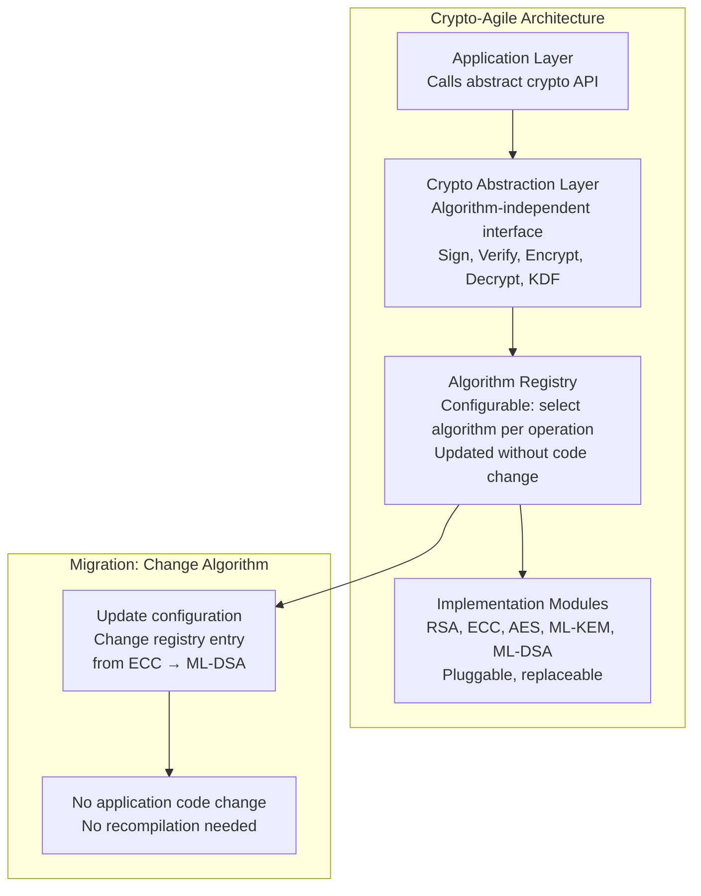
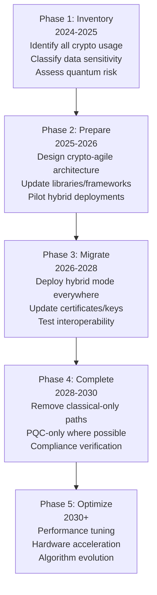
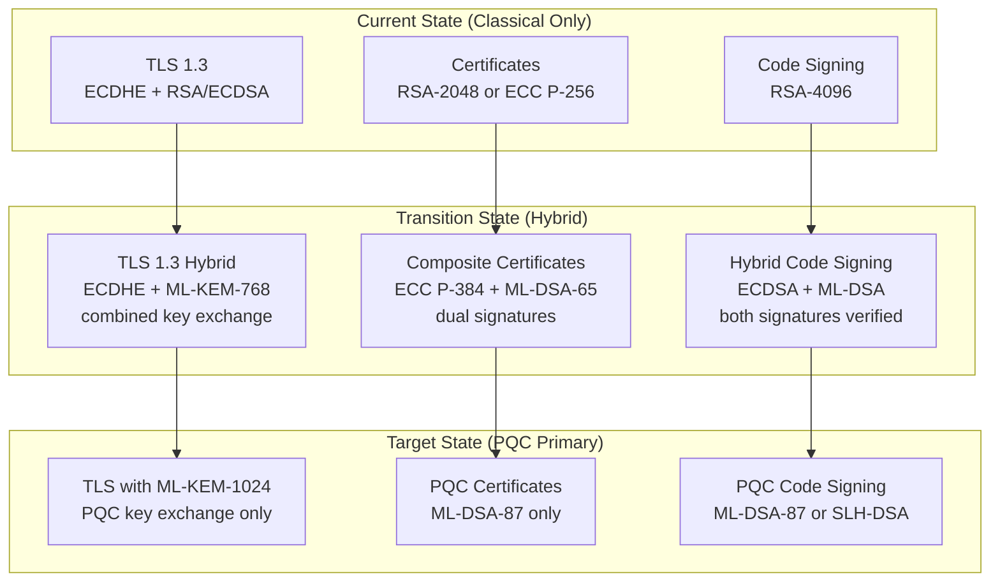
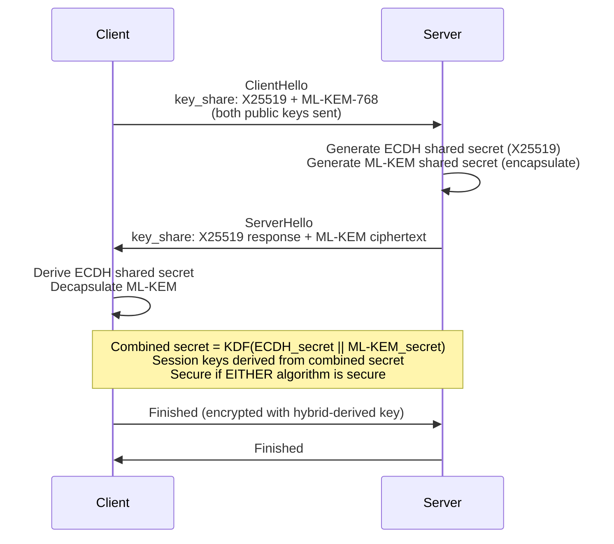

# Crypto Agility & Post-Quantum Migration

**Topic:** Cryptographic Agility — Standards, PQC Migration Strategy, Hybrid Approaches, Algorithm Transition  
**Standards:** NIST SP 800-131A Rev 2, FIPS 203 (ML-KEM), FIPS 204 (ML-DSA), FIPS 205 (SLH-DSA), CNSA 2.0, ETSI PQC Standards  
**SDO:** NIST, NSA (CNSA), ETSI, IETF, ISO/IEC JTC 1/SC 27  
**Audience:** Security architects, cryptography engineers, PKI administrators, compliance officers, product security teams  
**Prerequisites:** Public-key cryptography (RSA, ECC), symmetric crypto (AES), hash functions, quantum computing basics

---

## Chapter 1 — Historical Context & Origin Story

### 1.1 Timeline

| Year | Event | Impact |
|------|-------|--------|
| 1994 | Shor's algorithm published | Theoretical quantum break of RSA/ECC |
| 2015 | NSA announces CNSA 1.0 (move to larger keys) | First government response to quantum threat |
| 2016 | NIST Post-Quantum Cryptography competition launched | 82 submissions from global teams |
| 2017 | NIST PQC Round 1 (69 candidates selected) | Community evaluation begins |
| 2019 | NIST PQC Round 2 (26 candidates) | Narrowing field |
| 2020 | NIST PQC Round 3 (7 finalists + 8 alternates) | Final selection approaching |
| 2022 | NIST selects winners: CRYSTALS-Kyber, CRYSTALS-Dilithium, SPHINCS+, FALCON | Algorithms for standardization |
| 2022 | NSA CNSA 2.0 published | PQC migration timeline for US government |
| 2024 | FIPS 203 (ML-KEM), FIPS 204 (ML-DSA), FIPS 205 (SLH-DSA) published | PQC standards finalized |
| 2024 | NIST selects additional signatures (HBS: XMSS, LMS already standardized) | Stateful hash-based signatures |
| 2025+ | Industry migration begins | Protocols updated (TLS 1.3, X.509, IPsec) |
| 2030 | CNSA 2.0 deadline for most systems | Exclusive PQC required for US gov |
| 2033+ | Cryptographically Relevant Quantum Computer (CRQC) estimated | Actual quantum threat materializes |

### 1.2 The Quantum Threat

| Algorithm | Quantum Attack | Impact |
|-----------|---------------|--------|
| RSA (all sizes) | Shor's algorithm: factor N in polynomial time | Completely broken |
| ECC (all curves) | Shor's algorithm: solve ECDLP in polynomial time | Completely broken |
| DH / ECDH | Shor's algorithm | Key exchange broken |
| AES-128 | Grover's algorithm: $2^{64}$ search | Weakened (use AES-256) |
| AES-256 | Grover's algorithm: $2^{128}$ search | Still secure |
| SHA-256 | Grover's: $2^{128}$ preimage | Still secure |
| SHA-384/512 | Grover's: $2^{192}$/$2^{256}$ preimage | Still secure |

**"Harvest Now, Decrypt Later" (HNDL):**
Adversaries record encrypted communications TODAY, intending to decrypt them LATER when quantum computers exist. Data with long secrecy requirements (military, health, financial) is at risk NOW — must be protected with PQC today.

---

## Chapter 2 — Standard Architecture & Structure

### 2.1 NIST PQC Standards (Published 2024)

| Standard | Algorithm | Type | Based On |
|----------|-----------|------|----------|
| **FIPS 203** | ML-KEM (Module-Lattice Key Encapsulation) | Key exchange / encapsulation | CRYSTALS-Kyber |
| **FIPS 204** | ML-DSA (Module-Lattice Digital Signature) | Digital signature | CRYSTALS-Dilithium |
| **FIPS 205** | SLH-DSA (Stateless Hash-Based Signature) | Digital signature (hash-based) | SPHINCS+ |
| **FIPS 206** (draft) | FN-DSA (FFT-over-NTRU-lattice Signature) | Digital signature | FALCON |

### 2.2 Algorithm Parameters

| Algorithm | Security Level | Public Key Size | Signature/Ciphertext Size | Performance |
|-----------|---------------|----------------|---------------------------|-------------|
| ML-KEM-512 | NIST Level 1 (AES-128 equiv) | 800 bytes | 768 bytes (ciphertext) | Very fast |
| ML-KEM-768 | NIST Level 3 (AES-192 equiv) | 1,184 bytes | 1,088 bytes | Fast |
| ML-KEM-1024 | NIST Level 5 (AES-256 equiv) | 1,568 bytes | 1,568 bytes | Fast |
| ML-DSA-44 | NIST Level 2 | 1,312 bytes | 2,420 bytes | Fast |
| ML-DSA-65 | NIST Level 3 | 1,952 bytes | 3,309 bytes | Fast |
| ML-DSA-87 | NIST Level 5 | 2,592 bytes | 4,627 bytes | Moderate |
| SLH-DSA-128s | NIST Level 1 | 32 bytes | 7,856 bytes | Slow |
| SLH-DSA-256f | NIST Level 5 | 64 bytes | 49,856 bytes | Very slow |

**Comparison with classical:**

| | RSA-2048 | ECC P-256 | ML-KEM-768 | ML-DSA-65 |
|---|---------|-----------|-----------|-----------|
| Public key | 256 bytes | 64 bytes | 1,184 bytes | 1,952 bytes |
| Signature/ciphertext | 256 bytes | 64 bytes | 1,088 bytes | 3,309 bytes |
| Key generation | Slow | Fast | Very fast | Fast |
| Sign/encapsulate | Moderate | Fast | Very fast | Fast |
| Verify/decapsulate | Fast | Moderate | Very fast | Fast |

---

## Chapter 3 — Technical Deep Dive

### 3.1 Crypto Agility — Definition and Architecture

**Crypto agility:** The ability of a system to switch cryptographic algorithms without requiring significant re-engineering.



### 3.2 Hybrid Approach (Transition Strategy)

| Hybrid Mode | Description | Rationale |
|-------------|-------------|-----------|
| **Hybrid key exchange** | Combine classical (ECDH) + PQC (ML-KEM) | If PQC broken → ECDH still protects. If quantum arrives → ML-KEM protects |
| **Hybrid signature** | Sign with both classical + PQC keys | Backwards compatibility + forward security |
| **Composite certificate** | X.509 certificate with two public keys + two signatures | Gradual PKI migration |

**Hybrid TLS 1.3 key exchange:**

$$\text{Shared Secret} = \text{KDF}(\text{ECDH\_secret} \| \text{ML-KEM\_secret})$$

Both must be compromised to break the session key → security is the stronger of the two.

### 3.3 NSA CNSA 2.0 Timeline

| Capability | Transition Start | Exclusive PQC Required |
|-----------|-----------------|----------------------|
| Software/firmware signing | 2025 | 2030 |
| Web browsers/TLS | 2025 | 2030 |
| Networking (IPsec, MACsec) | 2025 | 2030 |
| Operating systems | 2027 | 2033 |
| Custom/legacy applications | 2027 | 2033 |
| SCADA/ICS | 2030 | 2035 |
| Niche systems (embedded) | 2030 | 2035 |

**CNSA 2.0 Algorithm Selection:**

| Use | Algorithm | Standard |
|-----|-----------|----------|
| Key exchange | ML-KEM-1024 | FIPS 203 |
| Digital signature | ML-DSA-87 (primary) or SLH-DSA-256 (hash-based backup) | FIPS 204/205 |
| Symmetric encryption | AES-256 | FIPS 197 |
| Hash | SHA-384 or SHA-512 | FIPS 180-4 |

### 3.4 PQC Migration Challenges

| Challenge | Description | Mitigation |
|-----------|-------------|------------|
| Larger keys/signatures | ML-DSA signature: 3.3KB vs. ECC: 64 bytes | Optimize protocols, increase buffer sizes |
| Certificate size explosion | X.509 cert with ML-DSA: ~4KB vs. ~1KB (ECC) | Certificate compression (TLS), stapling |
| Bandwidth-constrained protocols | IoT, automotive CAN/LIN (limited payload) | SLH-DSA smallest pubkey (32B), or stateful HBS |
| Hardware acceleration | New accelerators needed for lattice operations | FPGA/ASIC updates, algorithm IP cores |
| Backwards compatibility | Old systems can't verify new signatures | Hybrid certificates (dual signature) |
| Standardization dependencies | TLS, IPsec, X.509, CMS all need updates | IETF drafts progressing (2024-2025) |
| Testing and validation | CAVP for PQC algorithms needed | NIST developing PQC algorithm validation |
| Stateful HBS management | XMSS/LMS: must track state (never reuse key) | Hardware state management, or use stateless SLH-DSA |

### 3.5 Protocol Migration Status

| Protocol | PQC Status (2024) |
|----------|-------------------|
| TLS 1.3 | Hybrid ML-KEM + X25519 deployed (Chrome, Cloudflare) |
| X.509 certificates | IETF draft for composite certificates |
| S/MIME (email) | IETF draft for PQC CMS |
| IPsec/IKEv2 | IETF RFC 9370 (PQC in IKEv2 framework) |
| SSH | IETF draft-kampanakis-curdle-ssh-pq |
| Code signing | Hybrid signatures (Microsoft experimenting) |
| DNSSEC | Research (signatures too large for UDP) |
| Blockchain | Research (various PQC signature schemes) |
| PKI (CA infrastructure) | Migration planning, root CA re-issuance needed |

---

## Chapter 4 — Implementation Guide

### 4.1 PQC Migration Roadmap



### 4.2 Crypto Inventory (Phase 1)

| Category | What to Inventory |
|----------|-------------------|
| Libraries | OpenSSL version, BoringSSL, libsodium, JCE providers |
| Protocols | TLS versions, IPsec, SSH, custom protocols |
| Certificates | All X.509 certs (algorithm, key size, expiry) |
| Key management | HSM configuration, KMS, key types stored |
| Hardware | Crypto accelerators, HSMs, TPMs (algorithm support) |
| Embedded/IoT | Firmware crypto (often hardcoded, difficult to update) |
| Data at rest | Encryption algorithms for stored data |
| Data in transit | All encrypted channels and their algorithms |
| Authentication | Signature algorithms (JWT, SAML, certificate auth) |

### 4.3 Implementing Crypto Agility

| Principle | Implementation |
|-----------|---------------|
| Abstract crypto interface | Never call algorithm directly (use abstraction layer) |
| Configuration-driven algorithm selection | Algorithm choice in config file/database (not code) |
| Algorithm negotiation | Protocols negotiate algorithm at connection time |
| Dual-format support | During transition: accept both old and new formats |
| Key format extensibility | Key storage format supports new algorithm types |
| Certificate agility | Support composite/hybrid certificates |
| Graceful degradation | If PQC not available → fall back to classical (with logging) |

### 4.4 Library / Framework Status (2024)

| Library | PQC Support | Notes |
|---------|-------------|-------|
| liboqs (Open Quantum Safe) | All NIST finalists | Reference implementation, not production-hardened |
| OpenSSL 3.x | ML-KEM, ML-DSA (via provider) | Production use emerging |
| BoringSSL (Google) | ML-KEM-768 hybrid (deployed in Chrome) | Production |
| AWS-LC | ML-KEM | Production (AWS infrastructure) |
| wolfSSL | ML-KEM, ML-DSA, XMSS | Production (embedded focus) |
| Bouncy Castle (Java) | ML-KEM, ML-DSA, SLH-DSA, FALCON | Production |
| Microsoft CNG | Coming (Windows 11 24H2+) | Preview |
| mbedTLS | ML-KEM (experimental) | Embedded focus |

---

## Chapter 5 — Certification & Audit

### 5.1 PQC Validation (NIST CMVP)

| Status | Detail |
|--------|--------|
| FIPS 203/204/205 published | Algorithms standardized (August 2024) |
| Algorithm validation (ACVP) | NIST developing automated tests for PQC |
| FIPS 140-3 modules with PQC | First modules expected 2025-2026 |
| Transition guidance | NIST SP 800-131A Rev 3 (coming) |

### 5.2 Compliance Requirements

| Framework | PQC Requirement |
|-----------|----------------|
| CNSA 2.0 (US Gov) | Mandatory timeline: 2025-2035 (phased) |
| EU Cyber Resilience Act | "State of the art" crypto → implies PQC when available |
| PCI DSS v4.0 | "Strong cryptography" → will eventually include PQC |
| HIPAA | "Appropriate encryption" → PQC recommended for long-lived data |
| FIPS 140-3 | PQC modules must be validated (when available) |
| Common Criteria | PQC evaluation criteria being developed |

---

## Chapter 6 — Regional & Domain Variants

| Region/Domain | PQC Strategy |
|---------------|-------------|
| USA (NSA/DoD) | CNSA 2.0: aggressive timeline, ML-KEM-1024 + ML-DSA-87 |
| EU (ENISA/BSI) | Recommend hybrid approach, BSI: ML-KEM + FrodoKEM (conservative) |
| France (ANSSI) | Hybrid mandatory during transition, conservative parameter choices |
| Germany (BSI) | Additional: FrodoKEM recommended (more conservative than ML-KEM) |
| China | SM series post-quantum (under development by OSCCA) |
| Automotive | Long vehicle lifetime (15+ years) → must deploy PQC NOW for V2X |
| Financial | HNDL risk for long-lived transactions → early hybrid adoption |
| Healthcare | Patient data retained 50+ years → immediate PQC for data at rest |
| IoT (constrained) | Challenge: limited compute/bandwidth → lightweight PQC needed |
| Telecommunications | 5G security → 3GPP studying PQC integration |

---

## Chapter 7 — Comparison: PQC Algorithm Families

| Family | Example | Security Basis | Key Size | Sig/CT Size | Speed | Confidence |
|--------|---------|----------------|----------|-------------|-------|------------|
| Lattice (structured) | ML-KEM, ML-DSA | Module-LWE/SIS problem | Medium | Medium | Very fast | High (most studied) |
| Lattice (unstructured) | FrodoKEM | Standard LWE | Large | Large | Moderate | Very high (conservative) |
| Hash-based (stateless) | SLH-DSA (SPHINCS+) | Hash function security | Tiny (32-64B) | Very large (8-50KB) | Slow | Very high (minimal assumptions) |
| Hash-based (stateful) | XMSS, LMS | Hash function security | Small | Small | Fast | Very high (proven secure) |
| Code-based | Classic McEliece | Code decoding problem | Very large (0.5-1MB) | Small | Fast | Very high (40+ years studied) |
| Isogeny (deprecated) | SIKE | Supersingular isogeny | Tiny | Tiny | Slow | **BROKEN** (2022) |
| Multivariate | Rainbow | MQ problem | Large | Small | Fast | **BROKEN** (2022) |

---

## Chapter 8 — Mermaid Architecture Diagrams

### 8.1 PQC Migration Architecture



### 8.2 Hybrid TLS 1.3 Key Exchange



---

## Chapter 9 — Case Studies & Failure Analysis

### 9.1 SIKE Broken — Cautionary Tale for PQC

**Background:** SIKE (Supersingular Isogeny Key Encapsulation) was a NIST PQC Round 4 alternate candidate. Valued for extremely small key sizes (compared to lattice schemes).

**Event (July 2022):** Castryck and Decru published a classical attack that broke SIKE in minutes on a laptop computer. The attack exploited the mathematical structure of supersingular isogenies.

**Impact:** SIKE immediately disqualified from NIST competition. Any system deployed with SIKE would be completely insecure.

**Lesson for crypto agility:** This demonstrates why crypto agility is essential even for PQC algorithms. Even "well-studied" algorithms can be broken. Systems MUST be able to: (1) Detect compromised algorithm. (2) Switch to alternative algorithm. (3) Re-key/re-sign with new algorithm. Without crypto agility: a broken algorithm means full system redesign. **Also demonstrates value of hybrid approach:** If SIKE was used in hybrid (SIKE + ECDH), the system remains secure when SIKE is broken (ECDH still protecting).

### 9.2 Google Chrome ML-KEM Deployment (2023-2024)

**Objective:** Protect Chrome TLS connections against "harvest now, decrypt later" attacks using PQC key exchange.

**Approach:** Hybrid key exchange: X25519 (classical ECDH) + ML-KEM-768 (PQC). Deployed in Chrome 115+ (2023). Server-side: Cloudflare, Google services enabled support.

**Challenges encountered:**
- **Larger ClientHello:** ML-KEM public key adds ~1.2KB to ClientHello message. Some middleboxes (firewalls, intrusion detection) rejected messages > 255 bytes in certain TLS record fields → broke connections.
- **Solution:** Split ClientHello across multiple TLS records. Updated middlebox firmware.
- **Performance:** Negligible impact on handshake time (ML-KEM is fast). Main cost: bandwidth (extra 2-3KB per handshake).

**Result:** By 2024, significant percentage of Chrome TLS connections use hybrid PQC key exchange. First large-scale PQC deployment in production. Demonstrated that migration is feasible without breaking the internet.

---

## Chapter 10 — Future Evolution & Industry Trends

| Trend | Timeline | Impact |
|-------|----------|--------|
| TLS 1.3 hybrid standardized (IETF) | 2025 | Universal PQC in web traffic |
| X.509 composite certificates (IETF) | 2025-2026 | PKI migration path defined |
| FIPS 140-3 modules with PQC | 2025-2026 | Government can procure PQC products |
| CNSA 2.0 enforcement begins | 2025 | US government migration starts |
| Quantum computers: 1000+ logical qubits | 2028-2033? | Estimated timeline for crypto-relevant QC |
| PQC hardware acceleration | 2025-2027 | ASICs/FPGAs with lattice crypto engines |
| Algorithm evolution (NIST on-ramp) | Ongoing | Additional PQC algorithms standardized |
| Stateful HBS in constrained devices | 2025+ | XMSS/LMS for firmware signing (small signatures) |
| PQC in payment systems | 2027+ | PCI requiring PQC for long-lived keys |
| Full PQC transition complete | 2035+ | Classical crypto deprecated |

---

## Chapter 11 — Interview Questions & Career Guide

### Tier 1: Entry-Level (0-3 years)

**Q1:** Why do we need post-quantum cryptography? What does a quantum computer break?  
**A:** Quantum computers running Shor's algorithm can break ALL currently-used public-key cryptography: RSA (factoring large numbers), ECC/ECDSA (discrete logarithm on elliptic curves), DH/ECDH (key exchange). Shor's algorithm solves these problems in polynomial time on a quantum computer (vs. exponential on classical). **What survives quantum:** Symmetric crypto (AES) and hash functions (SHA) are only weakened by Grover's algorithm (square root speedup) → AES-256 remains secure, SHA-256 remains secure. **The urgency:** Even though large quantum computers don't exist yet (estimated 2028-2035), adversaries can record encrypted data TODAY and decrypt it when quantum computers arrive ("harvest now, decrypt later"). Data that needs to remain secret for 10+ years (medical records, state secrets, financial data) must be protected with PQC NOW.

### Tier 2: Mid-Level (3-8 years)

**Q2:** Explain the hybrid approach for PQC migration. Why not switch directly to PQC?  
**A:** **Hybrid:** Use BOTH a classical algorithm (ECC/RSA) AND a PQC algorithm (ML-KEM/ML-DSA) simultaneously. The combined system is secure if EITHER algorithm is secure. **Why not direct switch?** (1) **Confidence:** PQC algorithms are relatively new (standardized 2024). While well-studied, they lack the 40+ years of cryptanalysis that RSA/ECC have. SIKE was broken in 2022 → demonstrates risk. Hybrid ensures that if a PQC algorithm is unexpectedly broken, classical algorithm still protects. (2) **Interoperability:** Not all systems support PQC yet. Hybrid allows new systems to get PQC protection while remaining compatible with old systems (which process only the classical part). (3) **Regulatory:** Some compliance frameworks still require classical algorithms (FIPS 140 transitions take time). Hybrid satisfies both old and new requirements simultaneously. (4) **Fallback:** If PQC implementation has bugs (new code, less tested), classical algorithm provides safety net. **When to go PQC-only?** After years of deployment, when confidence is high, all peers support PQC, and regulations allow (estimated 2030-2035 for most use cases).

### Tier 3: Senior (8-15 years)

**Q3:** You're responsible for PQC migration of an enterprise with 50,000 servers, 200,000 IoT devices, and a private PKI. Design the migration plan.  
**A:** **Phase 1 (6 months): Crypto inventory + risk assessment.** Automated scanning of all servers: identify TLS configurations, certificate algorithms, SSH keys, IPsec policies. IoT devices: firmware audit (which crypto library, algorithm, updateability). PKI: map all CA certificates, intermediate CAs, cross-certifications. Risk classification: (a) High risk (HNDL-sensitive): customer financial data, healthcare records → migrate first. (b) Medium: internal communications → migrate in Phase 3. (c) Low risk: short-lived data → migrate last. **Phase 2 (12 months): Architecture preparation.** Update crypto libraries: deploy OpenSSL 3.x with PQC provider across server fleet. PKI: issue new Root CA with composite key (ECC P-384 + ML-DSA-65). Issue hybrid intermediate CA certificates. TLS: configure servers for hybrid key exchange (X25519 + ML-KEM-768). Test: interoperability testing across all systems. IoT: assess which devices can receive firmware updates (OTA). Devices that CANNOT be updated → plan for hardware replacement (long-term). **Phase 3 (18 months): Hybrid deployment.** Roll out hybrid TLS to all servers (config change, no code change if crypto-agile). PKI: begin issuing hybrid end-entity certificates. IPsec: enable IKEv2 with hybrid key exchange. SSH: deploy hybrid key exchange (post-quantum SSH). Code signing: dual-sign all firmware (classical + PQC). IoT: firmware update with PQC library for updatable devices. **Phase 4 (12 months): Validation + compliance.** Penetration testing: verify PQC is active on all connections. Compliance audit: map to CNSA 2.0 timeline requirements. Monitor: track any connections still using classical-only (alert + remediate). IoT hardware refresh: budget for replacing non-updatable devices. **Phase 5 (ongoing): Classical deprecation.** Remove classical-only cipher suites from server configurations. Revoke classical-only certificates as they expire. Target: 100% PQC (hybrid or PQC-only) by 2030.

### Tier 4: Distinguished (15+ years)

**Q4:** How do you assess and manage the risk of a PQC algorithm being broken after deployment?  
**A:** **Risk framework:** Assign each PQC algorithm a confidence level (based on years of study, diversity of researchers, mathematical hardness basis). ML-KEM/ML-DSA (structured lattice): high confidence but structured → potential for algebraic attacks. SLH-DSA (hash-based): highest confidence (security reduces to hash function). FrodoKEM (unstructured lattice): very high (no structure to exploit, but larger). **Mitigation strategy:** (1) **Diversity:** Deploy different algorithm families in different systems. Don't put all eggs in one basket (all lattice-based). Use SLH-DSA for highest-value long-term signatures (root CA). Use ML-DSA for performance-sensitive operations. (2) **Hybrid everywhere:** ALWAYS combine with classical during transition. Even after transition: maintain ability to add second algorithm. (3) **Crypto agility enforcement:** All systems must support algorithm rotation within 90 days (architect + test for this). (4) **Monitoring:** Track academic crypto community for advances in lattice attacks. Subscribe to NIST advisories. (5) **Pre-planned response:** If ML-KEM broken → switch to FrodoKEM (already tested in backup role). If all lattice broken → fall back to hash-based (SLH-DSA) + code-based (Classic McEliece). (6) **Data protection:** For highest-sensitivity data: use multiple independent algorithms simultaneously (encrypt under two different schemes → attacker must break both).

---

## Chapter 12 — Cheat Sheet & Quick Reference

### PQC Algorithm Quick Reference

```
Key Exchange (KEM):
  ML-KEM-768:    Recommended default (NIST Level 3, good balance)
  ML-KEM-1024:   High security (CNSA 2.0, NIST Level 5)
  ML-KEM-512:    Constrained devices (NIST Level 1)

Digital Signatures:
  ML-DSA-65:     Recommended default (NIST Level 3, fast)
  ML-DSA-87:     High security (CNSA 2.0, NIST Level 5)
  SLH-DSA:       Conservative choice (hash-based, minimal assumptions)
  XMSS/LMS:      Stateful hash-based (small sigs, but state management)

DO NOT USE:
  SIKE:          BROKEN (2022)
  Rainbow:       BROKEN (2022)
  Any non-NIST-standardized PQC in production
```

### CNSA 2.0 Algorithm Requirements

```
Symmetric:           AES-256
Hash:                SHA-384 minimum
Key exchange:        ML-KEM-1024 (FIPS 203)
Digital signature:   ML-DSA-87 (FIPS 204) or SLH-DSA-256 (FIPS 205)
```

### Migration Priority Decision

```
Data lifespan > 10 years?
  → Migrate NOW (hybrid at minimum)

System lifetime > 10 years (automotive, IoT, infrastructure)?
  → Migrate NOW (cannot update later)

Internet-facing TLS?
  → Deploy hybrid ML-KEM + ECDH (Chrome/Cloudflare already support)

Internal enterprise only?
  → Plan for 2026-2028 migration

Compliance: US government (CNSA 2.0)?
  → Must begin by 2025, complete by 2030

Size-constrained protocol (CAN bus, LoRaWAN)?
  → Research: XMSS/LMS (small signatures) or wait for NIST lightweight PQC
```

### Size Comparison Table

```
                    Pub Key    Sig/CT     Total (handshake overhead)
RSA-2048:           256B       256B       512B
ECC P-256:          64B        64B        128B
ML-KEM-768:         1,184B     1,088B     2,272B
ML-DSA-65:          1,952B     3,309B     5,261B
SLH-DSA-128s:       32B        7,856B     7,888B
Classic McEliece:   524KB      128B       524KB+
```

---

*End of Document — 12_Crypto_Agility_Migration.md*
