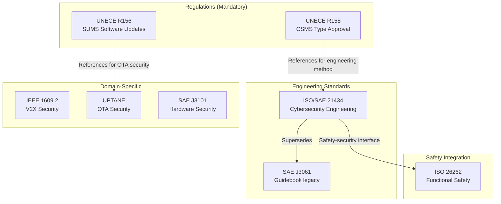
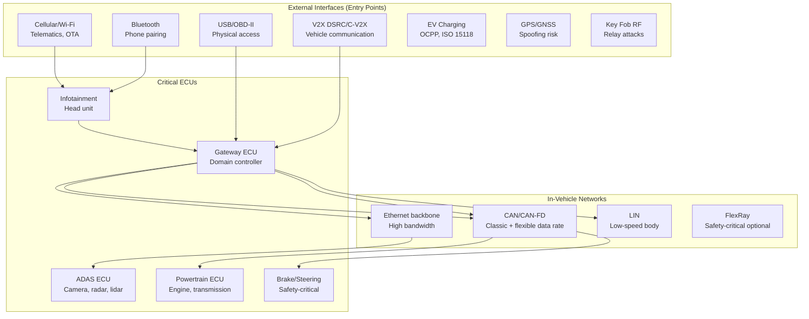
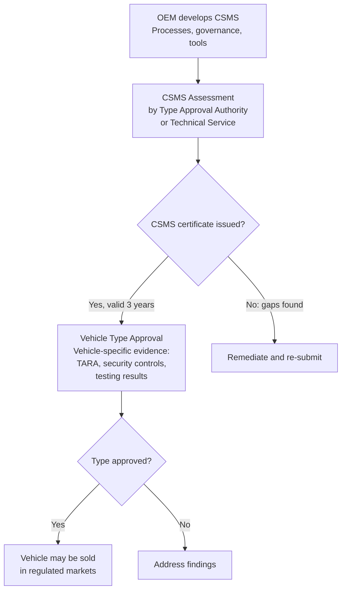
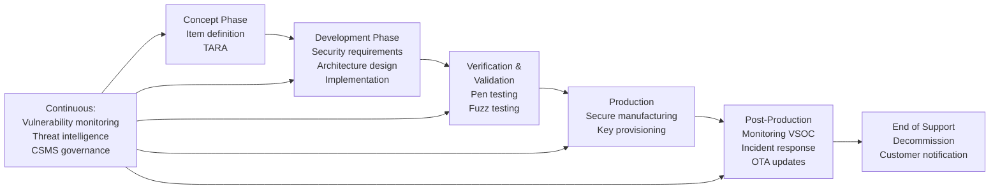
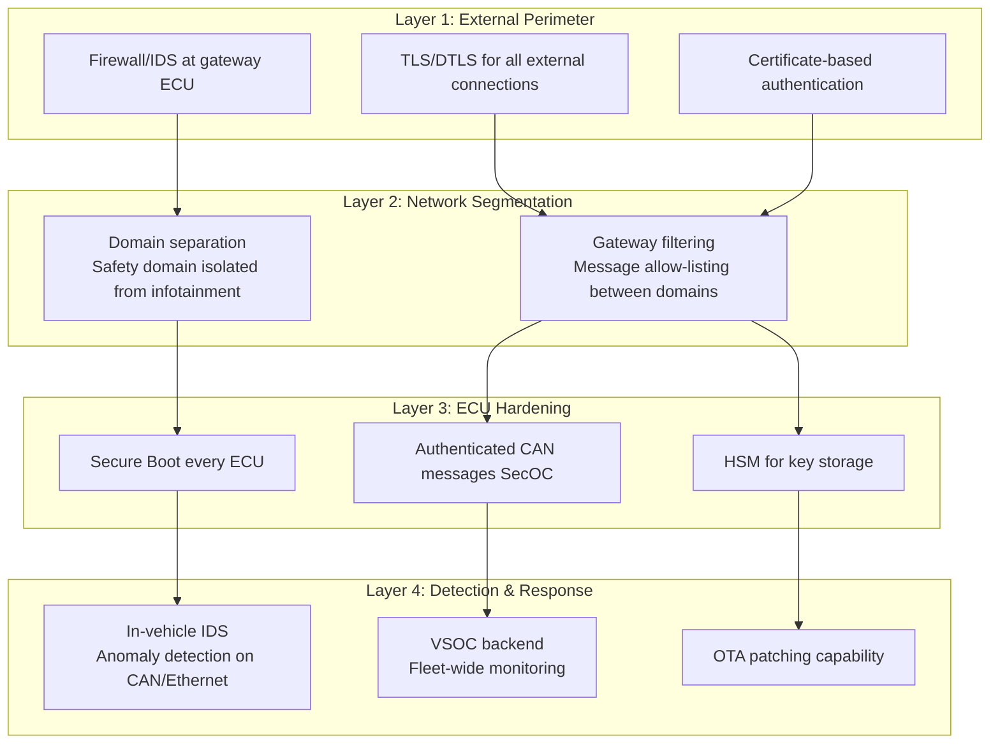

# Vehicle Cybersecurity Landscape

**Topic:** Automotive Cybersecurity — Standards Ecosystem, Regulatory Framework, and Industry Overview  
**Standards:** ISO/SAE 21434, UNECE R155/R156, SAE J3061, IEEE 1609.2, UPTANE  
**SDO:** ISO, SAE, UNECE WP.29, IEEE, ETSI  
**Audience:** Automotive cybersecurity engineers, product security managers, OEM compliance teams, Tier-1 security architects  
**Prerequisites:** Automotive E/E architecture basics, networking (CAN, Ethernet), general cybersecurity concepts

---

## Chapter 1 — Historical Context & Origin Story

### 1.1 Timeline

| Year | Event | Impact |
|------|-------|--------|
| 2010 | Koscher et al.: First academic vehicle CAN bus attack | Demonstrated remote ECU compromise |
| 2013 | Miller & Valasek: Toyota Prius physical access attack | Steering/braking via CAN injection |
| 2015 | **Jeep Cherokee remote hack** (Miller/Valasek) | 1.4M vehicles recalled; industry wake-up |
| 2016 | SAE J3061 published (Cybersecurity Guidebook) | First automotive cyber guideline |
| 2016 | Tesla Model S CAN bus research (Keen Security Lab) | Remote attack via browser exploit |
| 2017 | UNECE WP.29 IWG on Cybersecurity begins | Regulation development starts |
| 2019 | ISO/SAE 21434 Committee Draft | Engineering standard takes shape |
| 2020 | UNECE WP.29 adopts R155/R156 | Regulations finalized |
| 2021 | ISO/SAE 21434:2021 published | Full cybersecurity engineering standard |
| 2022 | UNECE R155 mandatory (new vehicle types, EU) | Type approval requires CSMS |
| 2024 | UNECE R155 mandatory (ALL new vehicles, EU) | Complete enforcement |
| 2024 | China GB/T cybersecurity standards | Chinese market requirements |

### 1.2 The Jeep Cherokee Attack (2015)

| Stage | Attack Step | System Compromised |
|-------|-------------|-------------------|
| 1 | Access Uconnect head unit via Sprint cellular network | Telematic unit (external) |
| 2 | Exploit D-Bus vulnerability in Uconnect Linux OS | Head unit OS (gateway) |
| 3 | Reflash V850 chip (CAN gateway) via SPI | CAN bus gateway |
| 4 | Inject arbitrary CAN messages | Vehicle CAN bus |
| 5 | Control steering, brakes, transmission (at low speed) | Safety-critical systems |

**Industry impact:** FCA recalled 1.4M vehicles. NHTSA issued guidance. Congress proposed SPY Car Act. Automotive industry acknowledged cybersecurity as safety-critical. Directly motivated ISO/SAE 21434 and UNECE R155.

---

## Chapter 2 — Standard Architecture & Structure

### 2.1 Vehicle Cybersecurity Standards Map



### 2.2 ISO/SAE 21434 Structure (High-Level)

| Clause | Topic | Key Activities |
|--------|-------|---------------|
| 4 | General considerations | Context, stakeholders |
| 5 | Organizational cybersecurity management | CSMS, culture, governance |
| 6 | Project-dependent cybersecurity management | Planning, tailoring |
| 7 | Distributed cybersecurity activities | Supply chain management |
| 8 | Continual cybersecurity activities | Monitoring, vulnerabilities |
| 9 | Concept phase | Item definition, TARA |
| 10 | Product development | Requirements, design, verification |
| 11 | Cybersecurity validation | System-level testing |
| 12 | Production | Manufacturing cybersecurity |
| 13 | Operations and maintenance | Incident response, updates |
| 14 | End of cybersecurity support | Decommissioning |
| 15 | TARA | Threat Analysis and Risk Assessment |

---

## Chapter 3 — Technical Deep Dive

### 3.1 Vehicle Attack Surface



### 3.2 Cybersecurity Assurance Level (CAL)

| CAL | Rigor | When Applied | Example |
|-----|-------|-------------|---------|
| CAL 1 | Low | Low-risk components, indirect attack paths | Body control module (windows) |
| CAL 2 | Medium | Moderate risk, some attack feasibility | Infotainment system |
| CAL 3 | High | High risk, safety-relevant + connected | ADAS domain controller |
| CAL 4 | Very High | Critical risk, direct safety impact + high attack feasibility | Autonomous driving platform |

### 3.3 UNECE R155 Requirements Summary

| Requirement Area | Key Demands |
|-----------------|-------------|
| CSMS (Cybersecurity Management System) | OEM must demonstrate systematic cybersecurity processes |
| Risk management | Identify, assess, treat cybersecurity risks |
| Design security | Security by design throughout development |
| Supply chain | Manage cybersecurity risks from suppliers |
| Detection | Monitor vehicles in field for cyber threats |
| Response | Incident response process for cyber events |
| Update capability | Mechanisms to securely address vulnerabilities |
| Type approval evidence | Documentation proving compliance to authority |

---

## Chapter 4 — Implementation Guide

### 4.1 CSMS Implementation for OEMs

| Step | Activity | Output |
|------|----------|--------|
| 1 | Gap analysis against R155/ISO 21434 | Gap report, remediation plan |
| 2 | Define cybersecurity governance | Roles, responsibilities, RACI matrix |
| 3 | Establish TARA process | Methodology, tools, templates |
| 4 | Integrate into development process | Gates, work products, reviews |
| 5 | Supply chain cybersecurity requirements | Supplier CDA (Cybersecurity Development Agreement) |
| 6 | VSOC (Vehicle Security Operations Center) setup | Monitoring, detection, response |
| 7 | Audit and certificate of compliance | Type approval authority assessment |

### 4.2 Key Roles in Automotive Cybersecurity

| Role | Responsibility |
|------|---------------|
| Cybersecurity Manager | Overall CSMS ownership, type approval liaison |
| TARA Analyst | Threat analysis, risk assessment, security goals |
| Security Architect | Secure architecture design, control specification |
| Security Tester (Pen tester) | Verification, penetration testing, fuzz testing |
| VSOC Analyst | Field monitoring, incident triage, response |
| Supplier Cybersecurity Lead | Ensure supplier development meets CAL requirements |

---

## Chapter 5 — Certification & Audit

### 5.1 UNECE R155 Type Approval Process



### 5.2 Assessment Bodies

| Region | Authority | Technical Services |
|--------|-----------|-------------------|
| EU | National type approval authorities (KBA Germany, RDW Netherlands, etc.) | TÜV, DEKRA, Applus+IDIADA |
| UK | VCA (Vehicle Certification Agency) | TRL, Horiba MIRA |
| Japan | MLIT (Ministry of Land, Infrastructure, Transport) | JASIC, JARI |
| South Korea | KATRI | Korean technical services |
| Australia | DITRDC | Accredited test facilities |

---

## Chapter 6 — Regional & Domain Variants

| Region | Regulation | Status |
|--------|-----------|--------|
| EU/UNECE contracting parties | R155/R156 mandatory | Enforced since 2024 (all new vehicles) |
| China | GB/T 40857 + GB/T 40856 | Mandatory (phased enforcement) |
| USA | No federal mandate (NHTSA guidance only) | Voluntary best practices + market pressure |
| Japan | Follows UNECE R155 (contracting party) | Mandatory (same timeline as EU) |
| South Korea | Follows UNECE R155 | Mandatory |
| India | Evaluating UNECE R155 adoption | In progress |

---

## Chapter 7 — Comparison: Vehicle Cybersecurity Standards

| Feature | ISO/SAE 21434 | UNECE R155 | SAE J3061 | ISO 26262 |
|---------|--------------|-----------|-----------|-----------|
| Type | Engineering standard | Regulation (law) | Guidebook | Engineering standard |
| Scope | Cybersecurity engineering process | Type approval requirement | Cybersecurity guidance | Functional safety |
| Mandatory? | Referenced by R155 | Yes (UNECE countries) | No (informative) | Referenced by regulations |
| Lifecycle | Full (concept → decommission) | Full (CSMS + vehicle) | Development focus | Full (safety lifecycle) |
| Risk method | TARA (Threat Analysis) | Requires risk assessment | TARA-like | HARA (Hazard Analysis) |
| Assurance levels | CAL 1-4 | Not specified (met via 21434) | Not formal | ASIL A-D |
| Published | 2021 | 2021 (mandatory 2022/2024) | 2016 | 2018 (2nd edition) |

---

## Chapter 8 — Mermaid Architecture Diagrams

### 8.1 Automotive Cybersecurity Lifecycle (ISO/SAE 21434)



### 8.2 Defense-in-Depth Vehicle Architecture



---

## Chapter 9 — Case Studies & Failure Analysis

### 9.1 Jeep Cherokee (2015) — Detailed Impact Analysis

**Vulnerability chain:** Cellular modem (Sprint network) → Uconnect head unit (Linux, open D-Bus) → CAN gateway (V850 chip, reflashable via SPI) → CAN bus (unrestricted message injection)

**What was missing:** No network segmentation (head unit had direct CAN access). No authenticated CAN messages (any ECU accepts any CAN frame). No intrusion detection. No secure boot verification on gateway reflash.

**Industry response:** FCA recall + OTA patch. NHTSA cybersecurity guidance. SAE J3061 published (2016). Directly motivated ISO/SAE 21434 development. UNECE began regulatory work.

### 9.2 Tesla Model S (2016-2020) — Responsible Disclosure Model

**Keen Security Lab attacks:** Multiple remote chains (browser exploit → gateway → CAN bus). Tesla's response: (1) Fixed within 10 days via OTA update. (2) Bug bounty program expanded. (3) Gateway hardened (code signing, process isolation). (4) CAN message authentication added progressively.

**Positive lesson:** OTA update capability is critical cybersecurity enabler. Fast patch deployment (days vs. months for recall) dramatically reduces risk window.

---

## Chapter 10 — Future Evolution & Industry Trends

| Trend | Impact |
|-------|--------|
| Software-Defined Vehicles (SDV) | More software = larger attack surface + easier patching |
| Vehicle SOC / XDR | Cloud-based fleet-wide threat detection and response |
| Zero-trust vehicle architecture | Every ECU authenticates, no implicit trust |
| V2X deployment (mass market) | New attack surface: vehicle-to-vehicle communication |
| AI/ML in vehicles | Adversarial attacks on perception (camera/lidar spoofing) |
| Autonomous driving (L3+) | Cybersecurity = safety (direct physical harm from cyber attack) |
| Regulatory expansion | USA may mandate (congressional pressure), China enforcing |
| Post-quantum for V2X | Long vehicle lifetime (15+ years) requires PQC now |
| Secure-by-design SoCs | Automotive chips with integrated HSM, secure boot, crypto |

---

## Chapter 11 — Interview Questions & Career Guide

### Tier 1: Entry-Level (0-3 years)

**Q1:** What is ISO/SAE 21434 and why was it created?  
**A:** ISO/SAE 21434 is the international standard for automotive cybersecurity engineering. It defines a systematic process for managing cybersecurity risk throughout the entire vehicle lifecycle — from concept through decommissioning. It was created because: (1) Connected vehicles have expanding attack surfaces (cellular, Wi-Fi, Bluetooth, V2X, OBD-II). (2) The 2015 Jeep Cherokee remote hack demonstrated that cyber attacks can control safety-critical vehicle functions. (3) Regulations (UNECE R155) require OEMs to have a Cybersecurity Management System (CSMS) for vehicle type approval. (4) Automotive industry needed a standardized engineering approach (like ISO 26262 for safety, but for security). Key elements: TARA (Threat Analysis and Risk Assessment), cybersecurity goals, security requirements, verification by penetration testing, and continuous monitoring post-production.

### Tier 2: Mid-Level (3-8 years)

**Q2:** Explain UNECE R155 and its relationship to ISO/SAE 21434. What must an OEM demonstrate for type approval?  
**A:** UNECE R155 is a **regulation** (law) that requires vehicle manufacturers to have an approved Cybersecurity Management System (CSMS) before they can obtain type approval to sell vehicles in UNECE contracting parties (EU, Japan, Korea, etc.). **Relationship to ISO/SAE 21434:** R155 says WHAT must be achieved (cybersecurity management + vehicle-level security). ISO/SAE 21434 provides HOW to achieve it (engineering methodology). R155 references ISO 21434 as the recommended engineering approach. **For type approval, OEM must demonstrate:** (1) CSMS certificate: systematic processes for cybersecurity governance, risk management, supply chain management, incident response (valid 3 years, renewable). (2) Vehicle-type evidence: specific to each vehicle model — TARA results, security controls implemented, testing evidence (penetration testing, fuzz testing), monitoring plan for post-production. (3) Both assessed by Type Approval Authority (or their Technical Service: TÜV, DEKRA, etc.). Failure = cannot sell the vehicle in regulated markets.

---

## Chapter 12 — Cheat Sheet & Quick Reference

### Vehicle Cybersecurity Standards Quick Reference

```
ISO/SAE 21434:    Engineering standard (HOW to do cybersecurity)
UNECE R155:       Regulation (MUST have CSMS for type approval)
UNECE R156:       Regulation (MUST have SUMS for software updates)
SAE J3061:        Legacy guidebook (superseded by 21434)
SAE J3101:        Hardware security environments for vehicles
IEEE 1609.2:      V2X security services
UPTANE:           OTA update security framework
```

### Key Terms

```
CSMS:   Cybersecurity Management System (organizational)
SUMS:   Software Update Management System
TARA:   Threat Analysis and Risk Assessment
CAL:    Cybersecurity Assurance Level (1-4)
VSOC:   Vehicle Security Operations Center
SecOC:  Secure On-board Communication (AUTOSAR)
V2X:    Vehicle-to-Everything (V2V, V2I, V2N)
SCMS:   Security Credential Management System (V2X PKI)
```

### Attack Surface Priority

```
HIGH RISK:       Cellular/Wi-Fi (remote, scalable attacks)
HIGH RISK:       V2X (broadcast, spoofable without PKI)
MEDIUM RISK:     Bluetooth (proximity, pairing vulnerabilities)
MEDIUM RISK:     EV Charging (ISO 15118 PnC)
LOW-MEDIUM RISK: OBD-II (physical access required)
LOW RISK:        LIN bus (limited functionality, physical)
```

---

*End of Document — 00_Vehicle_Cyber_Landscape.md*
