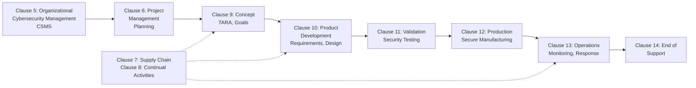
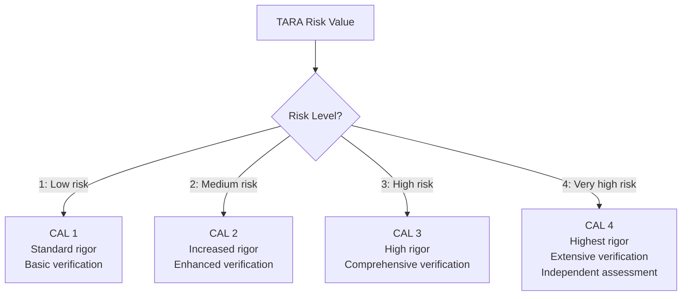
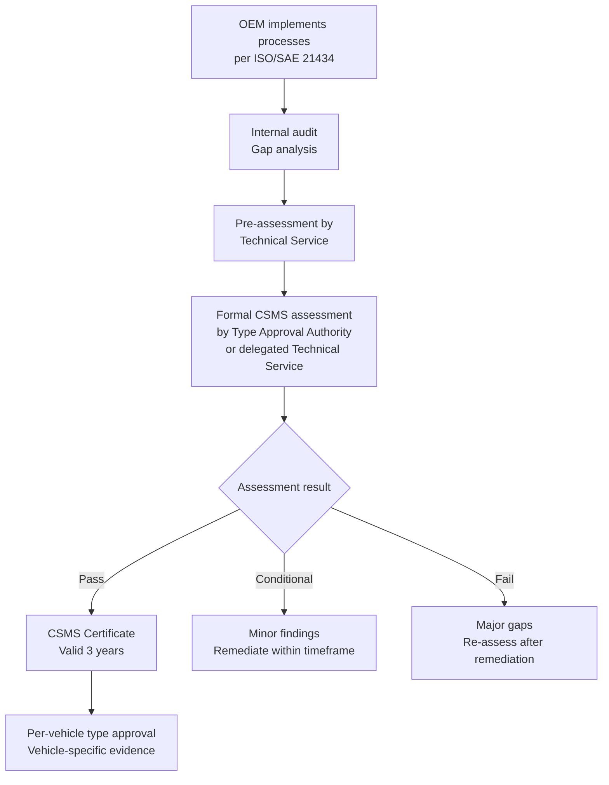
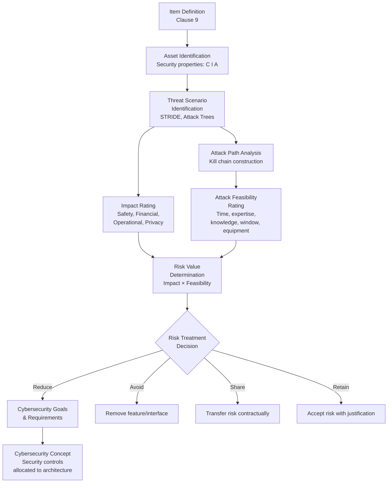
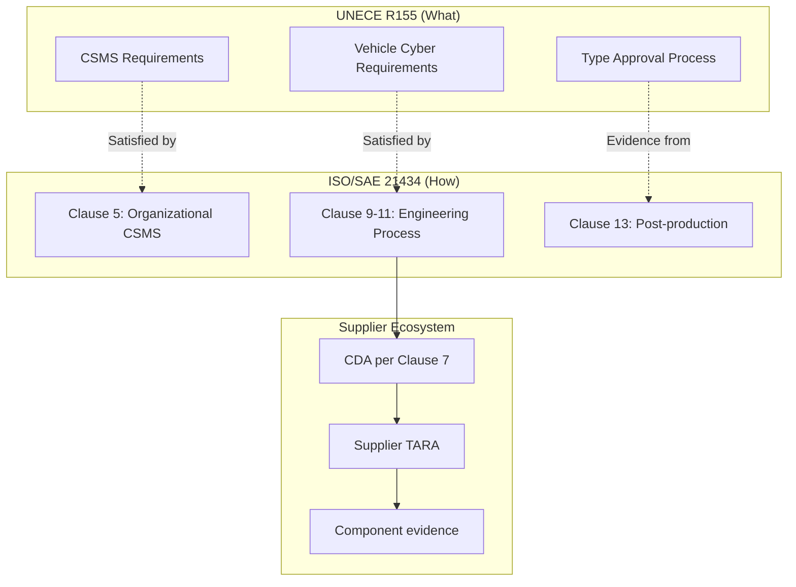

# ISO/SAE 21434 — Cybersecurity Engineering

**Topic:** Road Vehicles — Cybersecurity Engineering Lifecycle Standard  
**Standard:** ISO/SAE 21434:2021  
**SDO:** ISO (International Organization for Standardization) & SAE International (joint development)  
**Audience:** Automotive cybersecurity engineers, security architects, OEM development managers, Tier-1 suppliers  
**Prerequisites:** ISO 26262 concepts, automotive E/E architecture, general cybersecurity principles, TARA basics

---

## Chapter 1 — Historical Context & Origin Story

### 1.1 Genesis of ISO/SAE 21434

| Year | Milestone | Significance |
|------|-----------|-------------|
| 2014 | SAE begins J3061 development | First automotive cybersecurity guidebook effort |
| 2015 | Jeep Cherokee remote hack | Industry-wide call for mandatory cybersecurity |
| 2016 | SAE J3061 published | Guidebook (informative, not normative) |
| 2016 | ISO & SAE agree to joint standard | Combining global expertise |
| 2017 | ISO/SAE 21434 project initiated (ISO TC 22/SC 32/WG 11) | Formal standard development begins |
| 2019 | Committee Draft (CD) published | Industry review and comment |
| 2020 | Draft International Standard (DIS) | Near-final version |
| 2021 | **ISO/SAE 21434:2021 published** | Full international standard |
| 2022 | UNECE R155 references ISO/SAE 21434 | Regulatory backing established |

### 1.2 Why Joint ISO/SAE?

- **ISO:** Global standardization body with automotive committee (TC 22); ensures worldwide applicability
- **SAE:** Strong automotive engineering heritage (USA); contributed J3061 experience and industry expertise
- **Joint benefit:** Single unified global standard prevents fragmentation between US/EU/Asia approaches

---

## Chapter 2 — Standard Architecture & Structure

### 2.1 Clause Structure

| Clause | Title | Content |
|--------|-------|---------|
| 1-3 | Scope, Normative references, Terms | Definitions and boundaries |
| 4 | General considerations | Context and applicability |
| 5 | Organizational cybersecurity management | CSMS policies, culture, governance |
| 6 | Project-dependent cybersecurity management | Planning, tailoring per project |
| 7 | Distributed cybersecurity activities | Supply chain cybersecurity |
| 8 | Continual cybersecurity activities | Vulnerability monitoring, sharing |
| 9 | Concept phase | Item definition, TARA, cybersecurity goals |
| 10 | Product development | Cybersecurity requirements, design, integration |
| 11 | Cybersecurity validation | System-level security testing |
| 12 | Production | Secure manufacturing, key injection |
| 13 | Operations and maintenance | Field monitoring, incident response, updates |
| 14 | End of cybersecurity support | Decommissioning procedures |
| 15 | Threat Analysis and Risk Assessment (TARA) | Core risk methodology |
| Annex A | Cybersecurity assurance levels (CAL) | CAL 1-4 definitions |
| Annex B | Examples of TARA methods | STRIDE, attack trees, EVITA |
| Annex C-H | Additional guidance | Work products, examples |

### 2.2 Lifecycle Phases



---

## Chapter 3 — Technical Deep Dive

### 3.1 Item Definition and Asset Identification

**Item definition** establishes the cybersecurity boundary:
- Functional description of the item
- Architecture (hardware, software, interfaces)
- External interfaces and communication channels
- Operating environment and assumptions

**Asset identification:**
- **Damage assets:** What can be harmed (safety, financial, operational, privacy)
- **Security properties:** CIA (Confidentiality, Integrity, Availability) + Authenticity, Authorization, Non-repudiation

### 3.2 TARA Process (Clause 15)

| Step | Activity | Output |
|------|----------|--------|
| 1 | Asset identification | List of assets and their security properties |
| 2 | Threat scenario identification | Threats per asset (using STRIDE or attack trees) |
| 3 | Impact rating | Damage scenarios rated: Safety, Financial, Operational, Privacy (S/F/O/P) |
| 4 | Attack path analysis | How threat is realized (kill chain) |
| 5 | Attack feasibility rating | Based on: elapsed time, expertise, knowledge, window, equipment |
| 6 | Risk value determination | Impact × Feasibility → risk level |
| 7 | Risk treatment decision | Avoid, Reduce, Share, Retain |
| 8 | Cybersecurity goals | High-level security objectives per threat |
| 9 | Cybersecurity claims/requirements | Derived from goals |

### 3.3 Impact Rating Categories

| Category | Level | Example |
|----------|-------|---------|
| Safety | Severe | Loss of life or permanent injury |
| Safety | Major | Life-threatening, survival probable |
| Safety | Moderate | Injury (light/moderate) |
| Safety | Negligible | No injury |
| Financial | Severe | Existential damage to OEM (recall, lawsuit) |
| Financial | Major | Significant cost (millions) |
| Operational | Severe | Vehicle inoperable for extended period |
| Privacy | Severe | Highly sensitive personal data exposed to public |

### 3.4 Attack Feasibility Rating

| Parameter | Values |
|-----------|--------|
| Elapsed time | ≤1 day, ≤1 week, ≤1 month, ≤6 months, >6 months |
| Specialist expertise | Layman, Proficient, Expert, Multiple experts |
| Knowledge of item | Public, Restricted, Confidential, Strictly confidential |
| Window of opportunity | Unlimited, Easy, Moderate, Difficult, None |
| Equipment | Standard, Specialized, Bespoke, Multiple bespoke |

### 3.5 CAL (Cybersecurity Assurance Level)



| CAL | Verification Requirements | Documentation |
|-----|--------------------------|---------------|
| CAL 1 | Review, analysis | Standard work products |
| CAL 2 | Review, analysis, testing | Detailed work products |
| CAL 3 | Review, analysis, testing, independent review | Comprehensive evidence |
| CAL 4 | Review, analysis, extensive testing, independent assessment | Full audit trail + independent confirmation |

---

## Chapter 4 — Implementation Guide

### 4.1 Work Products Summary

| Phase | Key Work Products |
|-------|------------------|
| Concept (Clause 9) | Item definition, TARA report, Cybersecurity goals, Cybersecurity concept |
| Development (Clause 10) | Cybersecurity specifications, Architecture design, Component design, Test plans |
| Validation (Clause 11) | Validation plan, Penetration test report, Fuzz test results, Validation report |
| Production (Clause 12) | Production control plan, Key management plan |
| Operations (Clause 13) | Monitoring plan, Incident response plan, Update plan |

### 4.2 Cybersecurity Concept

The cybersecurity concept translates goals into architectural decisions:

```
Cybersecurity Goal → Cybersecurity Requirement → Security Control → Allocation to component
```

**Example:**
- Goal: "Prevent unauthorized CAN message injection from infotainment to powertrain"
- Requirement: "All CAN messages from gateway to powertrain domain SHALL be authenticated"
- Control: "SecOC (Secure On-board Communication) with CMAC using per-ECU keys"
- Allocation: "HSM in gateway ECU generates/verifies MACs; powertrain ECUs verify"

### 4.3 Development Phase Activities

| Activity | Description | Evidence |
|----------|-------------|----------|
| Security requirements specification | Derived from cybersecurity concept | SRS (Security Requirements Specification) |
| Secure architecture design | Defense-in-depth, segmentation, trust boundaries | Architecture design document |
| Secure implementation | Secure coding (MISRA, CERT C), code review | Code review reports |
| Security testing | Fuzz testing, static analysis, dynamic analysis | Test reports |
| Integration testing | Interface testing, combined attacks | Integration test report |
| Vulnerability analysis | Automated scanning + manual review | Vulnerability report |
| Penetration testing | Emulate attacker (based on TARA attack paths) | Pentest report |

---

## Chapter 5 — Certification & Audit

### 5.1 How ISO/SAE 21434 Relates to Certification

**Important distinction:** ISO/SAE 21434 itself is NOT directly certified — it is an engineering standard. However:
- UNECE R155 requires a CSMS certificate (assessed by type approval authority)
- ISO/SAE 21434 is the primary method to demonstrate CSMS compliance
- Technical Services (TÜV, DEKRA) assess organizations against ISO/SAE 21434 processes

### 5.2 Assessment Flow



### 5.3 Common Audit Findings

| Finding | Root Cause | Remediation |
|---------|-----------|-------------|
| Incomplete TARA | Missing attack paths, no update after architecture change | Systematic TARA process with triggers for update |
| No supply chain cybersecurity | No CDA with suppliers, unclear responsibilities | Clause 7 implementation: CDA template, supplier assessments |
| Insufficient testing | Only functional testing, no dedicated security testing | Dedicated pentest team, fuzz testing infrastructure |
| Missing monitoring | No VSOC, no field threat intelligence | Establish VSOC with fleet monitoring |
| Documentation gaps | Activities done but not documented | Work product templates aligned to standard |

---

## Chapter 6 — Regional & Domain Variants

| Region/Domain | ISO/SAE 21434 Application |
|---------------|--------------------------|
| EU (UNECE R155 scope) | Primary engineering method for type approval |
| China | GB/T 40857 references ISO/SAE 21434 methodology |
| Japan | Directly applies (UNECE contracting party) |
| USA | NHTSA guidance references it; OEMs adopt voluntarily for export compliance |
| Commercial vehicles | Same standard (heavy trucks, buses included in scope) |
| Off-highway | ISO 24089 for OTA; cybersecurity work ongoing (ISO AWI 24882) |
| Two/three-wheelers | L-category included in R155 scope (limited applicability) |

---

## Chapter 7 — Comparison with Related Standards

| Aspect | ISO/SAE 21434 | ISO 26262 | IEC 62443 |
|--------|--------------|-----------|-----------|
| Domain | Automotive cybersecurity | Automotive functional safety | Industrial automation security |
| Scope | Road vehicles (E/E systems) | Road vehicles (E/E systems) | Industrial control systems |
| Risk method | TARA | HARA | Threat modeling + SL assignment |
| Levels | CAL 1-4 | ASIL A-D | SL 1-4 (Security Level) |
| Lifecycle | Concept → decommission | Concept → decommission | Design → decommission |
| Regulatory link | UNECE R155 | EU GSR, UNECE R13H | IEC standards (not vehicle regulation) |
| Safety integration | References ISO 26262 (Clause 6.4.6) | Cross-references cybersecurity | Not automotive-specific |
| Supply chain | Clause 7 (CDA) | Clause 5 (DIA) | ISA-62443-2-4 |

---

## Chapter 8 — Mermaid Architecture Diagrams

### 8.1 TARA Flow



### 8.2 Relationship to UNECE R155



---

## Chapter 9 — Case Studies & Failure Analysis

### 9.1 Case Study: Implementing ISO/SAE 21434 at a Tier-1 Supplier

**Scenario:** Major Tier-1 developing next-gen ADAS domain controller with V2X connectivity. OEM customer requires CAL 3 evidence per ISO/SAE 21434.

**Implementation steps:**
1. **Gap analysis:** Existing process covered functional safety (ISO 26262 ASIL D) but lacked systematic cybersecurity. No TARA process, no dedicated security testing, no VSOC contribution.
2. **Organization changes:** Appointed Cybersecurity Manager. Created Security Architecture team (4 engineers). Contracted penetration testing team.
3. **Process integration:** Extended V-model gates to include cybersecurity milestones. TARA at concept phase (new gate: "Cybersecurity concept review"). Security requirements traced alongside safety requirements.
4. **TARA result:** 47 threat scenarios identified. 12 rated high risk (CAL 3/4). Key threats: remote code execution via V2X stack, CAN message spoofing via gateway compromise.
5. **Security controls:** HSM for key management, secure boot chain, SecOC for all CAN messages, TLS for Ethernet, V2X certificate validation, anomaly detection.
6. **Testing:** Fuzz testing (200+ hours, 3 findings). Penetration testing (4-week engagement, 1 critical finding in TLS implementation). Static analysis (SAST on 2M LOC).
7. **Result:** Passed OEM cybersecurity assessment. Contributed to vehicle type approval evidence.

---

## Chapter 10 — Future Evolution & Industry Trends

| Trend | Expected Impact on ISO/SAE 21434 |
|-------|--------------------------------|
| Second edition development | Lessons learned incorporated, clarifications on CAL application |
| AI/ML components | New TARA considerations: adversarial inputs, model poisoning |
| SDV architectures | Centralized compute changes threat model (fewer ECUs, larger blast radius) |
| Post-quantum cryptography | New security requirements for 15+ year vehicle lifetime |
| Convergence with ISO 26262 | SOTIF (ISO 21448) + cybersecurity integration |
| Cloud/backend scope | Extended scope beyond vehicle perimeter |
| Chinese harmonization | GB/T alignment with ISO/SAE 21434 methodology |

---

## Chapter 11 — Interview Questions & Career Guide

### Tier 1: Entry-Level (0-3 years)

**Q1:** What are the main phases of ISO/SAE 21434 and what happens in each?  
**A:** The standard covers: (1) **Organizational cybersecurity management (Clause 5):** Establish CSMS - governance, roles, culture, training. (2) **Concept phase (Clause 9):** Item definition, TARA (threat analysis, risk assessment), cybersecurity goals. (3) **Product development (Clause 10):** Security requirements specification, secure design, implementation, integration, verification. (4) **Validation (Clause 11):** System-level security testing including penetration testing. (5) **Production (Clause 12):** Secure manufacturing, key provisioning. (6) **Operations (Clause 13):** Field monitoring (VSOC), incident response, update management. (7) **End of support (Clause 14):** Decommissioning, customer notification.

### Tier 2: Mid-Level (3-8 years)

**Q2:** Explain how CAL (Cybersecurity Assurance Level) differs from ASIL. How do you determine the appropriate CAL?  
**A:** **ASIL** (ISO 26262) is determined by HARA: Severity × Exposure × Controllability → ASIL A-D. It measures safety risk from hardware/software failures. **CAL** (ISO/SAE 21434) is determined by TARA: Impact × Attack Feasibility → Risk Value → CAL 1-4. It measures security risk from intentional attacks. Key differences: (1) CAL considers attacker capability and motivation (not random failure). (2) CAL rating can change over time as new attack techniques emerge (unlike ASIL which is relatively stable). (3) A component can have ASIL D + CAL 1 (safety-critical but hard to attack) or ASIL QM + CAL 4 (not safety-critical but highly exposed). (4) CAL determines the rigor of security verification: CAL 4 requires independent assessment and extensive penetration testing.

### Tier 3: Senior/Staff (8-15 years)

**Q3:** How do you manage the interface between ISO 26262 and ISO/SAE 21434 in practice? What conflicts arise?  
**A:** The safety-security interface is managed through: (1) **Shared item definition:** Both standards need item boundary, but cybersecurity includes external attack interfaces that safety may not consider. (2) **Cross-analysis:** HARA identifies safety hazards; TARA identifies cyber threats that could trigger those hazards. A mapping matrix links threat scenarios to hazardous events. (3) **Conflicts:** Safety may demand redundancy (two independent channels) while security prefers minimal attack surface (fewer interfaces). Resolution: risk-based trade-off documented jointly. (4) **Common architecture:** Security controls (e.g., SecOC) must not introduce systematic failures or reduce diagnostic coverage → verified by safety analysis. (5) **Organizational:** Joint safety-security reviews at architecture gates. Some organizations combine the roles (cybersecurity-safety analyst) for efficiency.

### Tier 4: Distinguished/Fellow (15+ years)

**Q4:** Design a CSMS for a global OEM producing 5 million vehicles/year across 12 platforms. How do you scale ISO/SAE 21434 processes while maintaining CAL rigor?

---

## Chapter 12 — Cheat Sheet & Quick Reference

### ISO/SAE 21434 Decision Tree

```
New project/item → Define item boundary → Perform TARA
    ├── Risk = Low → CAL 1 → Standard verification
    ├── Risk = Medium → CAL 2 → Enhanced verification + review
    ├── Risk = High → CAL 3 → Comprehensive testing + independent review
    └── Risk = Very High → CAL 4 → Extensive testing + independent assessment
    
Supply chain → CDA (Cybersecurity Development Agreement) per Clause 7
    ├── Define interface agreement  
    ├── Distribute cybersecurity requirements
    └── Verify supplier evidence per agreed CAL

Post-production → Monitoring (Clause 8 + 13)
    ├── Monitor CVEs, threat intelligence
    ├── Assess applicability to fleet
    └── Trigger update or incident response
```

### Key Work Products

```
WP-09-01: Item Definition               WP-09-02: TARA Report
WP-09-03: Cybersecurity Goals           WP-09-04: Cybersecurity Concept  
WP-10-01: Cybersecurity Specifications  WP-10-02: Architecture Design
WP-10-03: Integration/Test Report       WP-11-01: Validation Report
WP-12-01: Production Control Plan       WP-13-01: Monitoring Plan
WP-07-01: Cybersecurity Interface Agreement (CDA)
```

---

*End of Document — 01_ISO_SAE_21434_Engineering.md*
