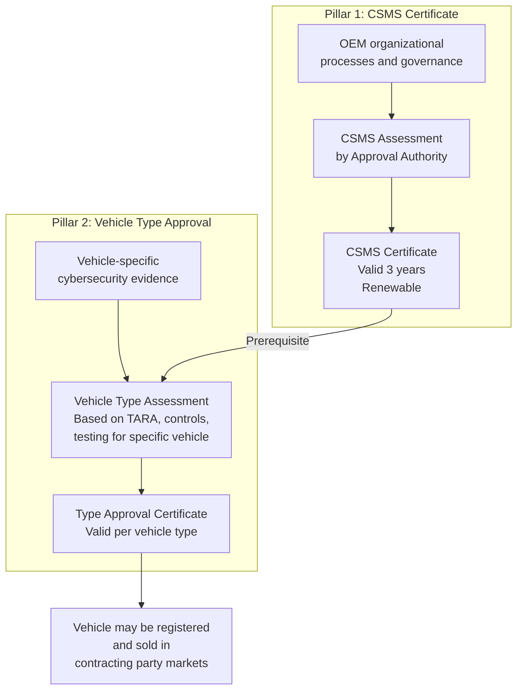
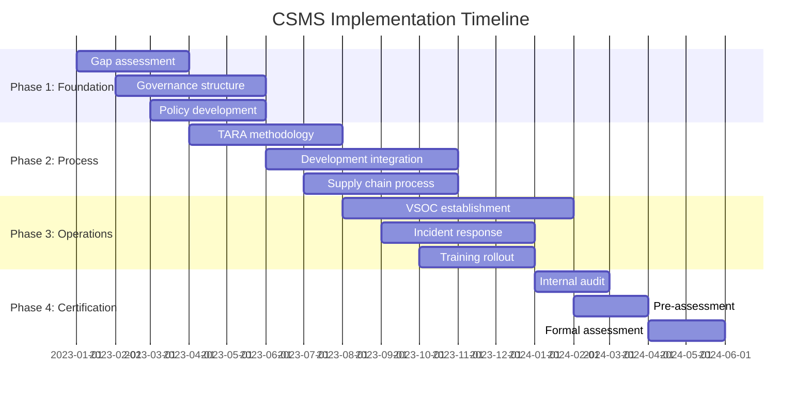
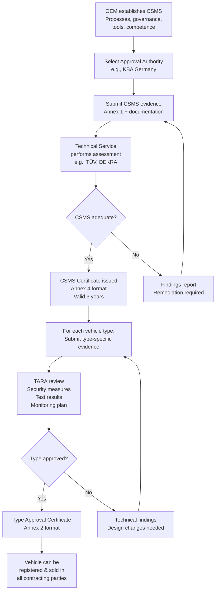
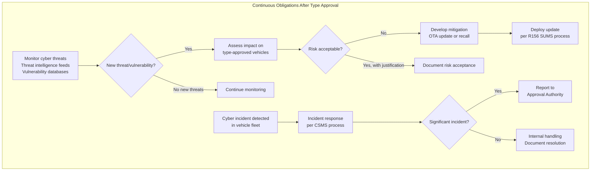

# UNECE R155 — CSMS & Type Approval

**Topic:** Cybersecurity Management System (CSMS) and Vehicle Type Approval under UNECE Regulation 155  
**Standard:** UNECE WP.29 R155 (UN Regulation No. 155 — Uniform provisions concerning the approval of vehicles with regards to cyber security and cyber security management system)  
**SDO:** UNECE (United Nations Economic Commission for Europe) — World Forum for Harmonization of Vehicle Regulations (WP.29)  
**Audience:** OEM regulatory/homologation teams, cybersecurity compliance managers, Type Approval engineers, Technical Service auditors  
**Prerequisites:** ISO/SAE 21434 fundamentals, vehicle type approval process basics, CSMS concepts

---

## Chapter 1 — Historical Context & Origin Story

### 1.1 Development Timeline

| Year | Milestone | Detail |
|------|-----------|--------|
| 2014 | UNECE WP.29 acknowledges cyber threat | Informal Group on ITS/AD discusses cybersecurity |
| 2016 | IWG on Cybersecurity and OTA formally established | Task Force CS/OTA under GRVA (automated vehicles) |
| 2017 | First regulatory text drafts circulated | Industry and government contributions |
| 2018 | Interpretive Document published | Guidance on assessment approach |
| 2019 | Final draft R155/R156 prepared | Public consultation completed |
| 2020 | **UNECE WP.29 adopts R155 and R156** (June 24) | Formal adoption by contracting parties |
| 2021 | Entry into force (January 22) | Contracting parties begin enforcement preparation |
| 2022 | **Mandatory for new vehicle types** (July 1) | OEMs must have CSMS certificate for new type approvals |
| 2024 | **Mandatory for ALL new vehicles** (July 7) | All vehicles produced must have type approval with R155 |
| 2024+ | Revision discussions ongoing | Scope expansion, enhanced requirements |

### 1.2 Why a UN Regulation?

- **Harmonization:** One regulation accepted by 50+ contracting parties (EU, Japan, Korea, Australia, etc.)
- **Market access:** Without R155 compliance, vehicles cannot be sold in these markets
- **Level playing field:** All OEMs face same cybersecurity requirements regardless of origin
- **Precedent:** First-ever cybersecurity regulation for vehicles globally

---

## Chapter 2 — Standard Architecture & Structure

### 2.1 R155 Document Structure

| Part | Content |
|------|---------|
| Preamble | Scope, definitions, application |
| Section 5 | Application for approval (documentation requirements) |
| Section 6 | Approval conditions |
| Section 7 | CSMS requirements (7.2) and Vehicle type requirements (7.3) |
| Annex 1 | Information document (data OEM provides) |
| Annex 2 | Communication form (certificate format) |
| Annex 3 | Identification of type (what constitutes a type) |
| Annex 4 | Template for CSMS certificate |
| Annex 5 | List of threats and mitigations (informative) |

### 2.2 Two-Pillar Assessment



---

## Chapter 3 — Technical Deep Dive

### 3.1 CSMS Requirements (Section 7.2)

| Requirement | Description |
|-------------|-------------|
| 7.2.2.1 | Process to identify and manage cybersecurity risks for vehicles |
| 7.2.2.2 | Process to protect vehicles against identified risks (design/development) |
| 7.2.2.3 | Process to detect and respond to potential cybersecurity attacks |
| 7.2.2.4 | Process to evaluate if cybersecurity measures remain effective |
| 7.2.2.5 | Process for managing supplier cybersecurity |
| 7.2.2.6 | Process for reporting to approval authority (significant incidents) |

### 3.2 Vehicle Type Requirements (Section 7.3)

| Area | Requirement |
|------|-------------|
| 7.3.3 | Risk assessment for vehicle type (threats identified, treated) |
| 7.3.4 | Security measures appropriate to identified risks |
| 7.3.5 | Measures verified through appropriate testing |
| 7.3.6 | Post-production monitoring and response capability |
| 7.3.7 | Capability to provide security updates where needed |

### 3.3 Annex 5 — Threat Categories and Mitigations

R155 Annex 5 provides a comprehensive threat taxonomy:

| Threat Category | Examples |
|----------------|----------|
| Back-end servers | Data breach, unauthorized access, server compromise |
| Communication channels | Spoofing, eavesdropping, man-in-the-middle, replay |
| Update procedures | Compromised update, denial of update |
| Human actions | Social engineering, physical tampering |
| External connectivity | Remote services exploitation, third-party app vulnerabilities |
| Vehicle data/code | Extraction of proprietary algorithms, manipulation of parameters |
| Vehicle functions | Unauthorized activation/deactivation of safety functions |

### 3.4 Evidence Requirements

| Evidence Type | Purpose |
|---------------|---------|
| TARA documentation | Demonstrates systematic threat identification |
| Security architecture | Shows defense-in-depth design |
| Test reports (pentest, fuzz) | Proves security controls work |
| Supplier management evidence | Shows supply chain cybersecurity |
| Monitoring plan | Demonstrates post-production readiness |
| Incident response plan | Shows ability to handle cyber events |

---

## Chapter 4 — Implementation Guide

### 4.1 CSMS Implementation Roadmap



### 4.2 CSMS Governance Structure

| Role | Responsibility | Reporting |
|------|---------------|-----------|
| CSMS Owner (C-level sponsor) | Executive accountability | Board level |
| Cybersecurity Manager | Day-to-day CSMS operations | CSMS Owner |
| TARA Analysts (per project) | Threat analysis for vehicle programs | CS Manager |
| VSOC Manager | Field monitoring and response | CS Manager |
| Supply Chain Security Lead | Supplier cybersecurity requirements | CS Manager |
| Technical Services Liaison | Audit preparation, evidence management | CS Manager |

### 4.3 Documentation Hierarchy

```
CSMS Level (Organizational):
├── Cybersecurity Policy (top-level commitment)
├── CSMS Manual (process descriptions)
├── Procedures (detailed work instructions)
├── Templates (work product templates)
└── Records (completed assessments, audit results)

Vehicle Type Level (Per model):
├── Item Definition
├── TARA Report (threats, impacts, feasibility, treatments)
├── Security Architecture Document
├── Test Reports (penetration test, fuzz test)
├── Validation Report
└── Monitoring & Update Plan
```

---

## Chapter 5 — Certification & Audit

### 5.1 CSMS Assessment Process

| Stage | Activities | Duration |
|-------|-----------|----------|
| Application | OEM submits information document (Annex 1) + CSMS evidence | 1-2 weeks |
| Document review | Approval authority reviews CSMS documentation | 4-8 weeks |
| On-site assessment | Auditors verify process implementation | 3-5 days |
| Interview personnel | Confirm understanding and competence | Part of on-site |
| Sampling of projects | Examine CSMS application on actual vehicle programs | Part of on-site |
| Finding resolution | Address any non-conformities | 2-8 weeks |
| Certificate issuance | CSMS certificate issued (valid 3 years) | 2-4 weeks post-resolution |

### 5.2 Vehicle Type Assessment

| Step | Assessment Focus |
|------|-----------------|
| 1 | Confirm CSMS certificate is valid |
| 2 | Review vehicle-specific TARA (completeness, methodology) |
| 3 | Verify security measures address identified threats |
| 4 | Assess testing evidence (scope, depth, findings resolution) |
| 5 | Review post-production monitoring plan |
| 6 | Assess update capability for the vehicle type |
| 7 | Issue type approval or request remediation |

### 5.3 Certificate Maintenance

| Activity | Frequency | Trigger |
|----------|-----------|---------|
| CSMS renewal | Every 3 years | Expiration |
| Annual surveillance | Yearly | Standard practice |
| Triggered reassessment | As needed | Significant incident, process change |
| Vehicle type amendment | As needed | Major design change, new variant |

---

## Chapter 6 — Regional & Domain Variants

### 6.1 UNECE Contracting Parties (R155 Applicable)

| Region | Status | Notes |
|--------|--------|-------|
| European Union (27 members) | Mandatory (enforced) | Via EU Regulation 2019/2144 (GSR) |
| United Kingdom | Mandatory (adopted) | Post-Brexit: domestic implementation |
| Japan | Mandatory | Direct contracting party |
| South Korea | Mandatory | Direct contracting party |
| Australia | Mandatory | Direct contracting party |
| Turkey | Mandatory | Direct contracting party |
| Russia | Adopted (enforcement delayed) | Contracting party |
| South Africa | Adopted | Contracting party |

### 6.2 Non-UNECE Markets

| Market | Approach |
|--------|----------|
| USA | No federal equivalent; NHTSA voluntary guidance; OEMs comply for export |
| China | Own regulations: GB/T 40857, GB/T 40856 (methodology similar to R155) |
| India | Considering adoption; AIS standards under development |
| Brazil | No current equivalent; INMETRO reviewing |

---

## Chapter 7 — Comparison with Related Regulations

| Feature | UNECE R155 (Cybersecurity) | UNECE R156 (Software Updates) | EU GDPR | EU Cyber Resilience Act |
|---------|--------------------------|-------------------------------|---------|------------------------|
| Scope | Vehicle cybersecurity | Vehicle software updates | Personal data protection | Digital products (not vehicles directly) |
| Requires | CSMS certificate + vehicle type approval | SUMS certificate + vehicle type approval | DPO, DPIA, consent | Conformity assessment |
| Target | OEM (vehicle manufacturer) | OEM | Data controller | Manufacturer |
| Enforcement | Cannot sell vehicle in market | Cannot sell vehicle in market | Fines (up to 4% revenue) | Market surveillance |
| Lifecycle | Full (design → decommission) | Update process only | Data lifecycle | Product lifecycle |
| Renewal | 3 years (CSMS) | 3 years (SUMS) | Continuous | Per product |

---

## Chapter 8 — Mermaid Architecture Diagrams

### 8.1 R155 Type Approval Complete Flow



### 8.2 Post-Production Obligations



---

## Chapter 9 — Case Studies & Failure Analysis

### 9.1 Case Study: OEM Achieves R155 Type Approval (European Market)

**Scenario:** European OEM with 8 vehicle platforms. New platform launching 2024 requires R155 type approval.

**Approach:**
1. **CSMS establishment (18 months):** Hired cybersecurity team (20 people). Implemented processes per ISO/SAE 21434. Built VSOC (Vehicle Security Operations Center) with 24/7 monitoring. Trained 200 engineers.
2. **Technical Service selection:** Contracted TÜV SÜD as Technical Service for CSMS assessment.
3. **Pre-assessment (2 months):** Identified 12 minor findings (documentation gaps, supplier process maturity).
4. **Remediation (3 months):** Closed all findings. Key fix: supplier CDA process standardized.
5. **Formal assessment (1 week on-site):** Passed with 3 observations (recommendations, not blockers).
6. **CSMS certificate issued:** Valid until 2027.
7. **Vehicle type approval:** New platform TARA showed 85 threat scenarios, 23 high-risk. All treated with verified security controls. Penetration testing (6 weeks) found 2 medium findings — fixed before submission.

### 9.2 Failure Case: Rejected Type Approval

**Scenario:** OEM attempted type approval without dedicated CSMS. Used existing quality processes (ISO 9001) as cybersecurity process proxy.

**Assessment findings (Major Non-Conformities):**
- No dedicated cybersecurity governance (no CSMS owner, no cybersecurity policy)
- TARA performed ad-hoc by individual engineers (no systematic methodology)
- No supply chain cybersecurity requirements (no CDA with any supplier)
- No VSOC or field monitoring capability
- Penetration testing limited to IT infrastructure (not vehicle systems)

**Result:** Application rejected. OEM required 12+ months remediation before re-assessment.

---

## Chapter 10 — Future Evolution & Industry Trends

| Trend | Expected Impact |
|-------|----------------|
| R155 revision (post-2025) | Enhanced requirements for AI/ML, V2X, cloud backends |
| Scope expansion | Possible inclusion of aftermarket devices, fleet management |
| Harmonization with China | Mutual recognition discussions ongoing |
| Performance-based requirements | Move from process-based to measurable security outcomes |
| Automated assessment tools | Technical Services developing automated evidence evaluation |
| Integration with R156 | Closer coupling of cybersecurity and software update requirements |
| Heavy-duty vehicles | Separate or amended requirements for trucks/buses |
| Post-quantum transition | Future amendments may mandate PQC-ready architectures |

---

## Chapter 11 — Interview Questions & Career Guide

### Tier 1: Entry-Level (0-3 years)

**Q1:** What is the difference between a CSMS certificate and a vehicle type approval under R155?  
**A:** **CSMS certificate:** Confirms the OEM has adequate organizational cybersecurity processes (governance, TARA methodology, supply chain management, monitoring, incident response). It is assessed once for the organization and is valid for 3 years. It does NOT prove any specific vehicle is secure. **Vehicle type approval:** Confirms a specific vehicle type has been developed using the CSMS processes and demonstrates adequate cybersecurity (specific TARA, specific security controls, specific test evidence). Each vehicle platform/type needs its own type approval. **Relationship:** CSMS certificate is a prerequisite for vehicle type approval. Without a valid CSMS certificate, the authority will not assess the vehicle type.

### Tier 2: Mid-Level (3-8 years)

**Q2:** An OEM discovers a critical vulnerability in a type-approved vehicle already in production. What are the R155 obligations?  
**A:** (1) **Assessment:** The OEM must assess the vulnerability against their TARA for the affected vehicle type — determine impact rating and attack feasibility. (2) **If risk is unacceptable:** Develop mitigation (OTA update if possible, or recall if not). Timeline should be risk-proportionate but R155 expects "without undue delay." (3) **Notification:** If the incident is "significant" (affecting vehicle safety/security at scale), the OEM must notify the approval authority. (4) **Update deployment:** Delivered per R156 SUMS process (integrity, rollback capability, user notification). (5) **Documentation:** All actions documented as evidence of CSMS effectiveness (Clause 7.2.2.3 — detect and respond). (6) **May trigger:** Approval authority review; if systemic CSMS failure, could affect CSMS certificate.

### Tier 3: Senior/Staff (8-15 years)

**Q3:** How do you design a CSMS for a global OEM that needs type approval in both UNECE (R155) and Chinese (GB/T 40857) markets? What are the key differences and harmonization challenges?  
**A:** Design a unified CSMS core with regional adaptations: (1) **Common core:** ISO/SAE 21434-based engineering process satisfies both. TARA methodology, secure development lifecycle, and testing are similar in both frameworks. (2) **Differences:** China requires data localization (vehicle data stored domestically). Chinese standards have additional requirements around data classification and cross-border transfer. Assessment authority is different (Chinese MIIT vs. European KBA/TÜV). (3) **Harmonization:** Maintain one CSMS with regional chapters. Use superset approach (meet strictest requirement). Work with both Technical Services simultaneously for efficiency. (4) **Practical challenges:** Language (documentation in Chinese for Chinese authority), different audit cultures, different timelines, different vehicle categories scope.

---

## Chapter 12 — Cheat Sheet & Quick Reference

### R155 Key Facts

```
Regulation:       UNECE R155 (adopted June 2020, enforced July 2022/2024)
Scope:            M, N, O categories + L6/L7 (with ECUs) vehicles
Assessment:       Two pillars — CSMS (org-level) + Vehicle Type (per model)
CSMS validity:    3 years (renewable)
Contracting:      50+ parties (EU, Japan, Korea, Australia, etc.)
NOT applicable:   USA (no federal equivalent), China (own GB/T regulations)
Reference std:    ISO/SAE 21434 (engineering methodology)
Companion:        R156 (Software Update Management System)
```

### Compliance Checklist

```
□ Cybersecurity policy documented and approved by management
□ CSMS owner appointed (executive level)
□ TARA methodology defined and applied to all vehicle programs
□ Supply chain process: CDA with all relevant suppliers
□ Development process includes security requirements, design, testing
□ VSOC established (or contracted) with monitoring capability
□ Incident response plan documented and exercised
□ Update capability demonstrated (OTA or recall process)
□ Training program for cybersecurity personnel
□ Internal audit conducted (at least annually)
□ Documentation package prepared for Technical Service review
```

### Penalty for Non-Compliance

```
Cannot obtain type approval → Cannot register vehicle → Cannot sell in market
Revenue impact: Entire regulated market excluded (EU = ~15M vehicles/year)
Reputation: Public record of rejected/withdrawn type approval
```

---

*End of Document — 02_UNECE_R155_CSMS_TypeApproval.md*
