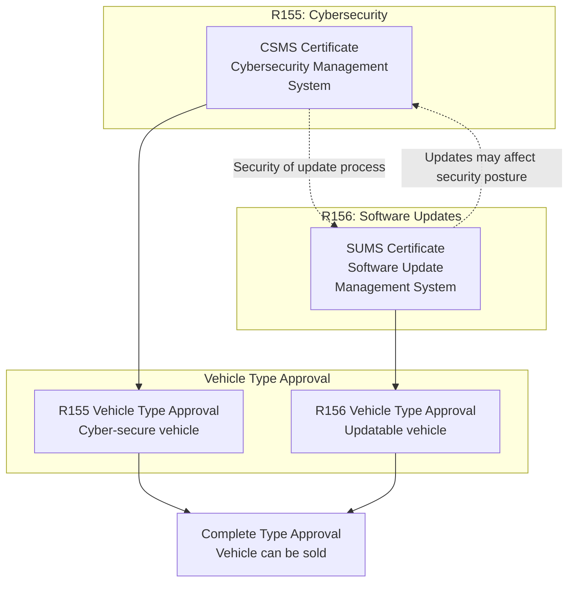
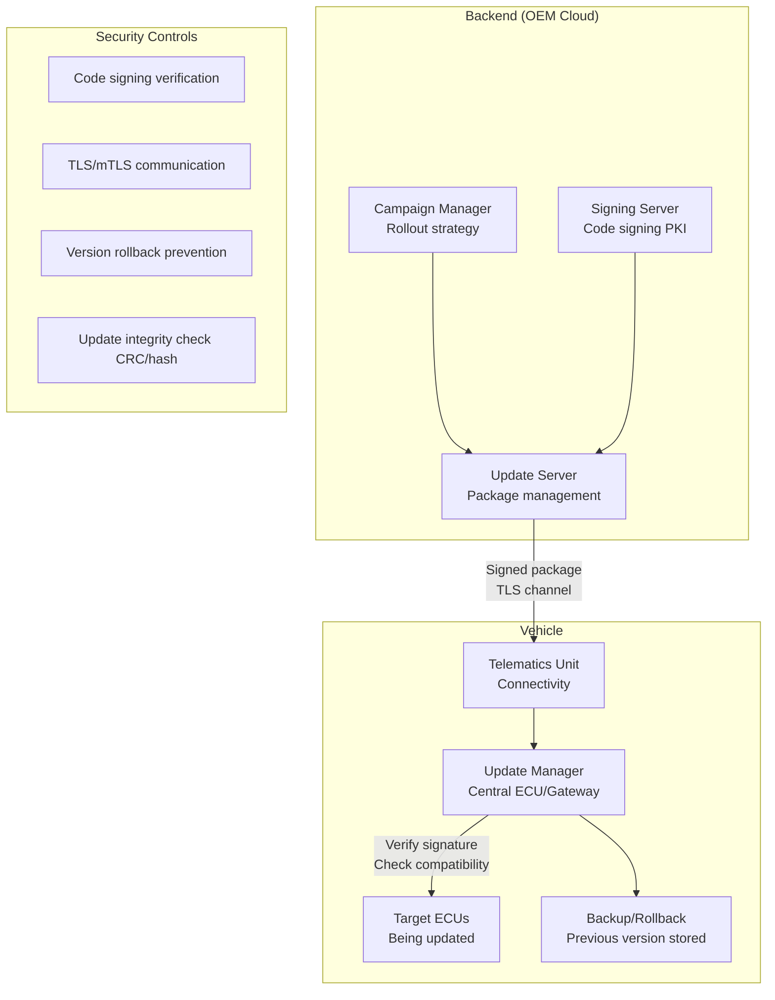
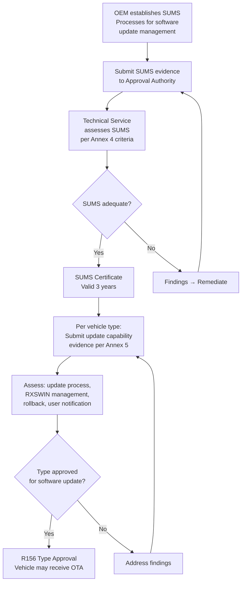
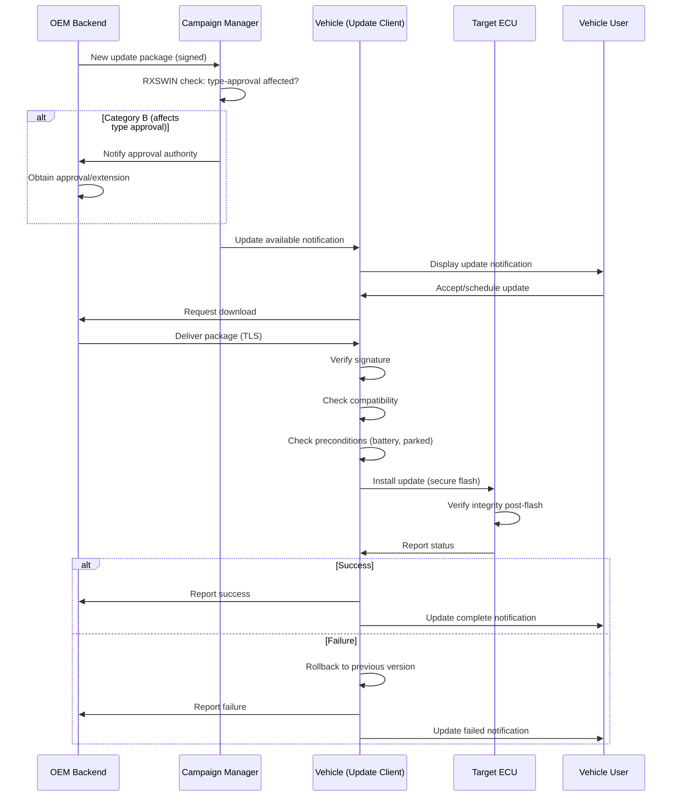
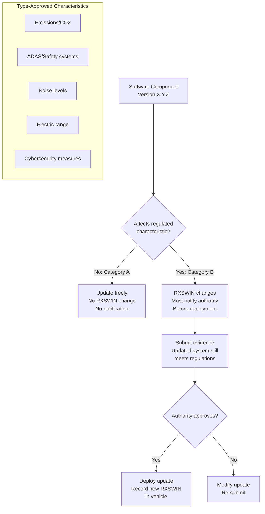

# UNECE R156 — OTA & Software Update Management System (SUMS)

**Topic:** Software Update Management System (SUMS) for Vehicles — Over-the-Air and Workshop Updates  
**Standard:** UNECE WP.29 R156 (UN Regulation No. 156 — Uniform provisions concerning the approval of vehicles with regards to software update and software update management system)  
**SDO:** UNECE (United Nations Economic Commission for Europe) — World Forum WP.29/GRVA  
**Audience:** OEM software platform teams, OTA architects, homologation engineers, technical service assessors  
**Prerequisites:** UNECE R155 (CSMS), automotive OTA architecture basics, ISO/SAE 21434

---

## Chapter 1 — Historical Context & Origin Story

### 1.1 Why Software Update Regulation?

| Driver | Concern |
|--------|---------|
| Tesla OTA precedent (2012+) | Demonstrated vehicles can be remotely updated (features, safety) |
| Safety implications | OTA update could introduce unintended behavior in safety-critical systems |
| Cybersecurity risk | Update channel is attack vector if not properly secured |
| Type approval integrity | Post-production updates could change approved vehicle characteristics |
| Consumer protection | Users need transparency about what is being changed |

### 1.2 Timeline

| Year | Event |
|------|-------|
| 2017 | UNECE WP.29 IWG on CS/OTA begins regulatory work |
| 2018 | Draft provisions for software update management |
| 2020 | **R156 adopted** alongside R155 (June 24) |
| 2021 | Entry into force (January 22) |
| 2022 | Mandatory for new vehicle types (July) |
| 2024 | Mandatory for all new vehicles (July) |
| 2025+ | Revision discussions (enhanced requirements) |

---

## Chapter 2 — Standard Architecture & Structure

### 2.1 R156 Structure

| Section | Content |
|---------|---------|
| 1-4 | Scope, definitions, application |
| 5 | SUMS requirements (organizational system) |
| 6 | Vehicle type requirements (per vehicle type) |
| 7 | RXSWIN (Rx Software Identification Number) |
| 8 | Provisions for modifications (type approval amendments) |
| Annex 1 | Information document template |
| Annex 2 | Communication form (certificate) |
| Annex 3 | SUMS certificate template |
| Annex 4 | Assessment of SUMS |
| Annex 5 | Assessment of vehicle type for software update |

### 2.2 SUMS vs. CSMS Relationship



---

## Chapter 3 — Technical Deep Dive

### 3.1 SUMS Requirements (Section 5)

| Requirement | Description |
|-------------|-------------|
| 5.1 | Process to identify which vehicle configurations are affected by an update |
| 5.2 | Process to determine update dependencies (SW/HW compatibility) |
| 5.3 | Process to assess if update affects type-approved characteristics |
| 5.4 | Process to ensure update integrity and authenticity |
| 5.5 | Process to protect update delivery from compromise |
| 5.6 | Process to ensure sufficient power during update |
| 5.7 | Process to verify successful installation |
| 5.8 | Process to handle failed updates (rollback/recovery) |
| 5.9 | Process to inform vehicle owner/user about updates |
| 5.10 | Process to record update history (audit trail) |

### 3.2 RXSWIN (Rx Software Identification Number)

RXSWIN is a unique identifier that links software versions to type approval:

```
RXSWIN = Regulated Software IDentification Number
Purpose: Track which software version was type-approved
         Detect if update changes type-approved characteristics

Example structure:
  RXSWIN-EU-[OEM code]-[Vehicle type]-[System]-[Version]
  RXSWIN-EU-BMW-G20-ADAS-v3.2.1
```

**When RXSWIN changes:** If an update modifies a system that affects type approval (e.g., emissions ECU, ADAS calibration), the OEM must:
1. Notify approval authority BEFORE deployment
2. Demonstrate updated system still meets regulations
3. Obtain amended type approval or extension

### 3.3 Update Categories

| Category | Description | Type Approval Impact | Example |
|----------|-------------|---------------------|---------|
| Category A | Update does NOT affect type-approved characteristics | No notification needed | Infotainment UI fix |
| Category B | Update DOES affect type-approved characteristics | Must notify authority + get approval | ADAS algorithm change |
| Category C | Critical safety update (emergency) | Expedited process; notify + deploy | Safety vulnerability patch |

### 3.4 OTA Architecture Requirements



---

## Chapter 4 — Implementation Guide

### 4.1 OTA Platform Implementation

| Component | Function | Key Requirement |
|-----------|----------|----------------|
| Backend campaign manager | Define target vehicles, schedule, rollout % | Version management, compatibility matrix |
| Package builder | Create update packages (delta/full) | Signing, compression, metadata |
| Delivery infrastructure | CDN/cellular distribution | TLS, bandwidth management, resume |
| Vehicle update client | Download, verify, install | Signature verification, pre-condition checks |
| Recovery mechanism | Handle failed updates | A/B partition or rollback partition |
| Reporting/telemetry | Installation status feedback | Success/failure tracking per vehicle |
| RXSWIN tracker | Identify which updates change type-approved systems | Automated classification engine |

### 4.2 Update Integrity Chain

```
1. Build system → Package created
2. Code signing → Package signed with OEM private key
3. Upload → Package stored in secure backend
4. Delivery → TLS-encrypted channel to vehicle
5. Reception → Vehicle verifies TLS certificate
6. Verification → Vehicle verifies code signature (public key in HSM/secure storage)
7. Compatibility → Vehicle checks HW/SW prerequisites
8. Pre-conditions → Sufficient battery, vehicle parked, user consent
9. Installation → Flash target ECU (via secure boot loader)
10. Post-verification → ECU reports successful boot with new version
11. Rollback ready → Previous version retained until verification passes
```

### 4.3 User Notification Requirements

| Notification Type | When | Content |
|------------------|------|---------|
| Update available | Update downloaded/ready | What system affected, estimated time |
| User consent (if needed) | Before installation that affects driving | Clear description of changes |
| Installation status | During/after installation | Progress, success/failure |
| Post-update information | After successful install | What changed, any new features/restrictions |
| Failed update | If rollback triggered | What happened, vehicle status, next steps |

---

## Chapter 5 — Certification & Audit

### 5.1 SUMS Assessment Process



### 5.2 Common Assessment Points

| Assessment Focus | What Auditor Checks |
|-----------------|---------------------|
| Configuration management | Can OEM identify exactly which SW version is on which vehicle? |
| Dependency management | Does OEM know which updates are compatible with which HW/SW? |
| Signing infrastructure | Is code signing properly managed (HSM, key ceremonies, access control)? |
| Rollback capability | Can vehicle recover from failed update safely? |
| RXSWIN tracking | Does OEM correctly identify when type-approval is affected? |
| User consent | Is user properly informed and consent obtained where required? |
| Battery management | Does system prevent update if battery insufficient (safety)? |
| Post-update verification | Does system confirm successful installation? |

---

## Chapter 6 — Regional & Domain Variants

| Region | R156 Status | Notes |
|--------|-------------|-------|
| EU | Mandatory (2022/2024) | Via General Safety Regulation 2019/2144 |
| Japan | Mandatory (follows UNECE) | Direct contracting party |
| South Korea | Mandatory | Direct contracting party |
| UK | Mandatory (domestic adoption) | Post-Brexit implementation |
| China | Own regulation (similar intent) | GB/T standards for OTA management |
| USA | No federal requirement | NHTSA investigating; market-driven OTA |
| India | Under consideration | AIS standards development |

---

## Chapter 7 — Comparison with Related Standards

| Feature | R156 (SUMS) | UPTANE | ISO 24089 | Apple/Google OTA |
|---------|-------------|--------|-----------|-----------------|
| Scope | Vehicle software updates (regulation) | OTA security framework | ISO standard for SW update engineering | Consumer device updates |
| Mandatory | Yes (UNECE markets) | No (best practice) | No (engineering guidance) | No (vendor choice) |
| Focus | Type approval + safety | Security against attacks | Engineering process | User experience |
| Rollback | Required | Defined (delegations) | Recommended | Varies |
| User consent | Required for safety-affecting | Not specified | Recommended | Varies by platform |
| RXSWIN | Yes (regulatory tracking) | No | References R156 | Not applicable |
| Signing | Required | Threshold signing (multiple keys) | Required | Required |

---

## Chapter 8 — Mermaid Architecture Diagrams

### 8.1 Complete OTA Update Flow (R156 Compliant)



### 8.2 RXSWIN Management



---

## Chapter 9 — Case Studies & Failure Analysis

### 9.1 Case Study: Tesla OTA Model (Pre-Regulation)

**Context:** Tesla pioneered automotive OTA from 2012. By 2020, Tesla had deployed thousands of OTA updates including safety-critical changes (Autopilot, regenerative braking, battery management).

**What R156 means for Tesla-like OTA:**
- Category A updates (UI, maps, entertainment): continue as before
- Category B updates (Autopilot algorithms, range, braking): must notify authority before deployment in UNECE markets
- RXSWIN tracking required for each regulated system
- Rollback must be available (Tesla uses A/B partition approach — compliant)
- User notification already strong (Tesla app notifications)

**Challenge:** Speed of deployment. Tesla deploys updates in days. R156 Category B may require weeks for authority approval → potential delay in safety patches.

### 9.2 Failure Case: Bricked ECU During OTA

**Scenario:** An OEM deployed a gateway ECU update via OTA. Power interruption during flash (user started vehicle mid-update despite warning) resulted in corrupted firmware. Gateway ECU bricked → vehicle immobilized.

**Root cause:** (1) Update was allowed while vehicle was not in "safe state" (engine off, parked, charging). (2) No hardware-level protection (dual-bank flash) on gateway ECU. (3) Recovery boot loader existed but required workshop tool to activate.

**R156 compliance gap:** R156 requires pre-condition checks (sufficient power, safe state) and recovery mechanism. This OEM failed both: (1) Precondition checking was advisory (user could dismiss). (2) Recovery required physical workshop visit (not field-recoverable).

---

## Chapter 10 — Future Evolution & Industry Trends

| Trend | Impact on R156 |
|-------|---------------|
| Continuous deployment (SDV) | Frequent small updates vs. large infrequent packages |
| Feature-on-demand (FoD) | SW activation after purchase — is this an "update"? |
| Cloud-native vehicles | Backend logic changes — are these in-scope? |
| Autonomous driving updates | Extremely safety-critical OTA — higher scrutiny |
| Multi-OEM platforms | Shared platforms need shared RXSWIN management |
| Real-time approval | Authorities may develop automated review for Category B |
| Blockchain audit trail | Immutable update history for forensics |

---

## Chapter 11 — Interview Questions & Career Guide

### Tier 1: Entry-Level (0-3 years)

**Q1:** What is UNECE R156 and why is it needed?  
**A:** UNECE R156 is a regulation requiring vehicle manufacturers to have an approved Software Update Management System (SUMS) before vehicles can receive software updates (OTA or workshop). It exists because: (1) Modern vehicles receive frequent software updates that can change safety-critical behavior. (2) A compromised update channel could inject malicious software. (3) Type approval must remain valid — an update that changes emissions or safety behavior could invalidate the original approval. (4) Consumers need transparency about changes to their vehicle. Key elements: SUMS certificate (organizational process), vehicle type approval (per model), RXSWIN (tracking regulated software versions), rollback capability, and user notification.

### Tier 2: Mid-Level (3-8 years)

**Q2:** Explain RXSWIN. How does an OEM determine whether an update requires RXSWIN change and authority notification?  
**A:** RXSWIN (Rx Software Identification Number) is a unique identifier linking a specific software configuration to its type-approved characteristics. **Determination process:** (1) OEM maintains a mapping of which software components affect which regulated characteristics (emissions, safety systems, noise, range). (2) When an update is prepared, the RXSWIN classification engine checks: "Does this update modify any component in the regulated mapping?" (3) If YES → Category B: RXSWIN changes, authority must be notified before deployment, evidence that updated system still meets regulations must be provided. (4) If NO → Category A: RXSWIN unchanged, no notification needed, update can be deployed freely. **Challenges:** Gray areas (e.g., updating ML model used for both convenience and safety functions), managing dependencies (updating middleware that underlies both regulated and non-regulated components), timeliness of authority response for urgent security patches.

### Tier 3: Senior/Staff (8-15 years)

**Q3:** Design an OTA architecture that is R156-compliant, supports 5 million vehicles in field, handles both Category A and Category B updates efficiently, and ensures zero-downtime for safety systems.

---

## Chapter 12 — Cheat Sheet & Quick Reference

### R156 Key Facts

```
Regulation:      UNECE R156 (adopted June 2020)
Scope:           Vehicles with software-updateable systems
Certificate:     SUMS (Software Update Management System) — valid 3 years
Companion:       R155 (Cybersecurity) — security of update process
RXSWIN:          Tracks regulated software versions
Categories:      A (no type approval impact) | B (requires authority notification)
Mandatory:       New types Jul 2022; all new vehicles Jul 2024 (UNECE parties)
ISO companion:   ISO 24089 (Road vehicles — Software update engineering)
```

### R156 Compliance Essentials

```
□ SUMS process documented and implemented
□ Configuration management: know exact SW on every vehicle
□ Compatibility checking: update vs. HW/SW prerequisites
□ Code signing: all packages cryptographically signed
□ Delivery security: TLS/mTLS for OTA channel
□ Pre-condition checks: battery, parked, safe state
□ Rollback/recovery: handle failed updates safely
□ RXSWIN management: classify updates (Cat A/B)
□ Authority notification: before Cat B deployment
□ User notification: inform about updates and changes
□ Audit trail: complete history of all updates per VIN
□ Post-update verification: confirm successful installation
```

---

*End of Document — 03_UNECE_R156_OTA_SUMS.md*
