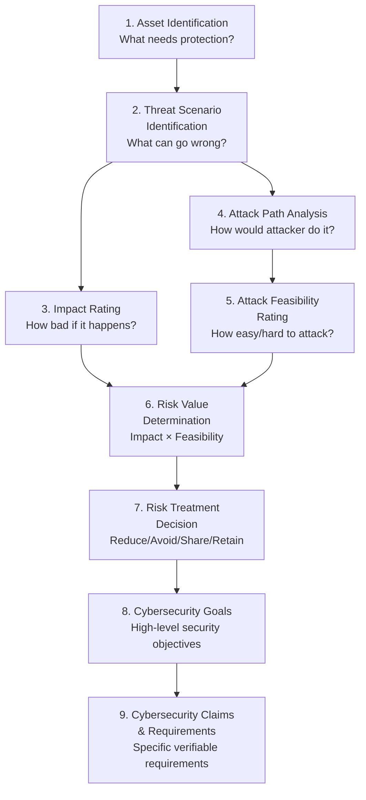
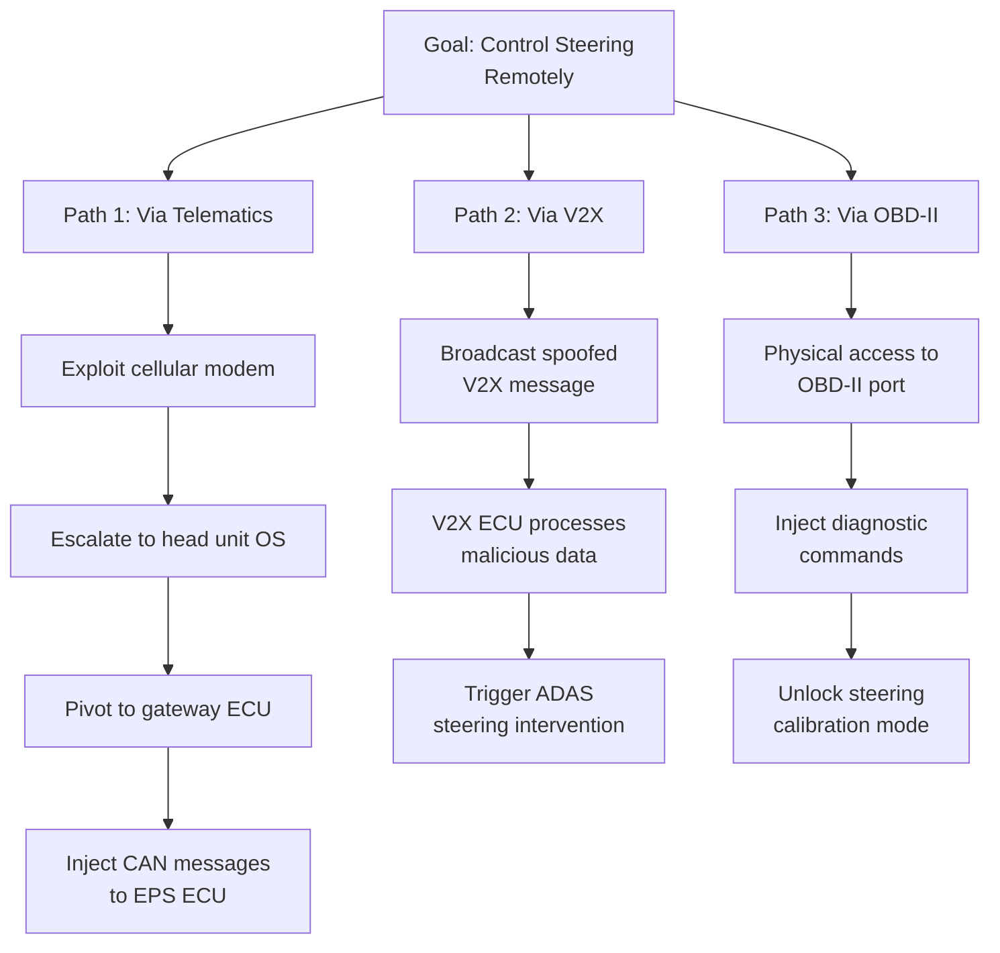
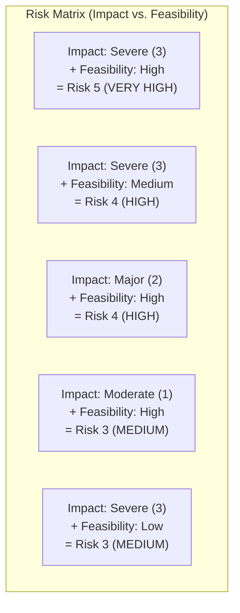
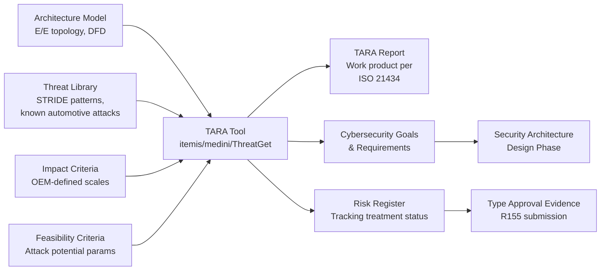

# TARA Methodology — Threat Analysis and Risk Assessment

**Topic:** Threat Analysis and Risk Assessment for Automotive Cybersecurity  
**Standard:** ISO/SAE 21434:2021 Clause 15, EVITA Project Methodology, HEAVENS Model  
**SDO:** ISO/SAE (primary), EVITA Consortium (EU FP7), HEAVENS Consortium  
**Audience:** TARA analysts, cybersecurity engineers, security architects, product managers  
**Prerequisites:** ISO/SAE 21434 overview, cybersecurity fundamentals, automotive E/E architecture, risk management principles

---

## Chapter 1 — Historical Context & Origin Story

### 1.1 Evolution of Automotive Threat Assessment

| Year | Framework/Event | Contribution |
|------|----------------|-------------|
| 2008-2011 | **EVITA Project** (EU FP7) | First automotive-specific threat model with severity/attack potential rating |
| 2012-2015 | **HEAVENS Project** (Sweden) | Security-relevant threat analysis aligned with functional safety |
| 2015 | Jeep Cherokee hack | Validated need for systematic threat assessment |
| 2016 | SAE J3061 | Included TARA-like methodology (Annex B) |
| 2016 | Microsoft STRIDE adaptation for automotive | Attack taxonomy for vehicle systems |
| 2021 | **ISO/SAE 21434 Clause 15** | Standardized TARA methodology for automotive |
| 2022+ | Tool vendor implementations | Automated TARA platforms emerge |

### 1.2 Why Automotive TARA Differs from IT Risk Assessment

| Factor | IT Risk Assessment | Automotive TARA |
|--------|-------------------|----------------|
| Safety impact | Rarely life-threatening | Can cause fatalities |
| Asset lifetime | 3-5 years | 15-20 years |
| Patch capability | Easy (always connected) | Limited (OTA constraints, recall cost) |
| Attacker motivation | Financial (data theft) | Multiple (theft, terrorism, extortion, research) |
| Physical access | Usually protected (data center) | Public (vehicle in parking lot) |
| Regulatory consequence | Fines | Cannot sell vehicle (type approval revoked) |

---

## Chapter 2 — Standard Architecture & Structure

### 2.1 ISO/SAE 21434 TARA Process (Clause 15)



### 2.2 TARA in the Development Lifecycle

| Lifecycle Phase | TARA Activity |
|----------------|---------------|
| Concept (Clause 9) | Initial TARA — full assessment |
| Development (Clause 10) | TARA refinement — detailed attack paths as architecture evolves |
| Validation (Clause 11) | TARA verification — pentest validates threat scenarios |
| Post-production (Clause 13) | TARA update — new threats discovered in field |
| Change management | TARA delta — assess impact of design changes |

---

## Chapter 3 — Technical Deep Dive

### 3.1 Step 1: Asset Identification

**Assets = what has value and needs protection**

| Asset Type | Examples | Security Properties |
|------------|----------|-------------------|
| Safety functions | Braking, steering, airbag deployment | Integrity, Availability |
| Vehicle data | Location history, driving patterns, biometrics | Confidentiality, Integrity |
| Authentication credentials | Cryptographic keys, certificates, passwords | Confidentiality, Integrity |
| Software/firmware | ECU firmware, calibration data | Integrity, Authenticity |
| Communication | CAN messages, V2X broadcast, OTA channel | Integrity, Authenticity, Availability |
| Financial assets | Subscription features, odometer value | Integrity |

### 3.2 Step 2: Threat Scenario Identification

#### STRIDE for Automotive

| STRIDE Category | Automotive Example |
|----------------|-------------------|
| **S**poofing | Fake V2X messages claiming road hazard (causes emergency braking) |
| **T**ampering | Modify CAN message to change reported speed (odometer fraud) |
| **R**epudiation | Deny that OBD diagnostic was performed (warranty fraud) |
| **I**nformation Disclosure | Extract proprietary ADAS algorithms via debug port |
| **D**enial of Service | Flood CAN bus to prevent brake ECU from receiving commands |
| **E**levation of Privilege | Gain root access on infotainment → pivot to safety domain |

#### Attack Tree Example



### 3.3 Step 3: Impact Rating

| Category | Negligible (0) | Moderate (1) | Major (2) | Severe (3) |
|----------|---------------|-------------|-----------|-----------|
| **Safety** | No injury | Light/moderate injury | Life-threatening, survival probable | Death or life-threatening, survival uncertain |
| **Financial** | No/negligible loss | €1K-100K loss | €100K-10M loss | >€10M or existential |
| **Operational** | No impact | Slight inconvenience | Vehicle inoperable (temporary) | Vehicle inoperable (extended/permanent) |
| **Privacy** | Anonymous/no PII | Limited PII, few people | Sensitive PII, identifiable | Highly sensitive PII, public exposure |

**Overall impact = MAX(Safety, Financial, Operational, Privacy)**

### 3.4 Step 4: Attack Path Analysis

For each threat scenario, construct the kill chain:

```
Entry point → Intermediate step(s) → Target asset → Impact
```

| Element | Description |
|---------|-------------|
| Entry point | External interface used for initial access |
| Lateral movement | How attacker moves from entry to target |
| Exploitation | What vulnerability is exploited at each step |
| Prerequisites | What attacker needs (knowledge, tools, access) |
| Indicators | What evidence would this attack leave |

### 3.5 Step 5: Attack Feasibility Rating

#### Method 1: Attack Potential (based on Common Criteria / EVITA)

| Parameter | Values → Score |
|-----------|---------------|
| Elapsed time | ≤1 day (0), ≤1 week (1), ≤1 month (4), ≤6 months (10), >6 months (19) |
| Specialist expertise | Layman (0), Proficient (3), Expert (6), Multiple experts (8) |
| Knowledge of item | Public (0), Restricted (3), Confidential (7), Strictly confidential (11) |
| Window of opportunity | Unlimited (0), Easy (1), Moderate (4), Difficult (10) |
| Equipment | Standard (0), Specialized (4), Bespoke (7), Multiple bespoke (9) |

**Total attack potential = Sum of all parameters**

| Total Score | Attack Feasibility | Interpretation |
|-------------|-------------------|----------------|
| 0-9 | High | Easy to attack, accessible |
| 10-13 | Medium | Feasible with moderate effort |
| 14-19 | Low | Difficult, requires significant resources |
| 20-24 | Very Low | Extremely difficult |
| ≥25 | Negligible | Practically infeasible |

#### Method 2: CVSS-based (alternative)

Some organizations adapt CVSS v3.1 for automotive context:
- Attack Vector: Network/Adjacent/Local/Physical
- Attack Complexity: Low/High
- Privileges Required: None/Low/High
- User Interaction: None/Required

### 3.6 Step 6: Risk Value Determination



| | Feasibility: High | Feasibility: Medium | Feasibility: Low | Feasibility: Very Low |
|---|---|---|---|---|
| **Impact: Severe** | Risk 5 (CAL 4) | Risk 4 (CAL 3-4) | Risk 3 (CAL 2-3) | Risk 2 (CAL 1-2) |
| **Impact: Major** | Risk 4 (CAL 3-4) | Risk 3 (CAL 2-3) | Risk 2 (CAL 1-2) | Risk 1 (CAL 1) |
| **Impact: Moderate** | Risk 3 (CAL 2-3) | Risk 2 (CAL 1-2) | Risk 1 (CAL 1) | Risk 1 (CAL 1) |
| **Impact: Negligible** | Risk 2 (CAL 1) | Risk 1 (CAL 1) | Risk 1 (Retain) | Retain |

### 3.7 Step 7: Risk Treatment

| Treatment | When Applied | Example |
|-----------|-------------|---------|
| **Reduce** | Risk unacceptable; mitigation possible | Add SecOC authentication to CAN messages |
| **Avoid** | Remove the risky element entirely | Remove cellular connectivity from safety domain |
| **Share** | Transfer risk to another party | Require supplier to implement security control (via CDA) |
| **Retain** | Residual risk acceptable after analysis | Accept risk of physical OBD-II attack (requires physical access) |

---

## Chapter 4 — Implementation Guide

### 4.1 TARA Workshop Process

| Phase | Duration | Activities | Participants |
|-------|----------|-----------|--------------|
| Preparation | 1 week | Gather architecture docs, item definition, previous TARAs | TARA lead |
| Asset workshop | 0.5 day | Identify assets, security properties, damage scenarios | Security + system engineers |
| Threat workshop | 1-2 days | STRIDE per interface, attack trees for high-value assets | Security + domain experts |
| Rating workshop | 0.5 day | Impact and feasibility scoring (consensus-based) | Cross-functional team |
| Treatment workshop | 0.5 day | Select treatments, define cybersecurity goals | Security architect + PM |
| Documentation | 1 week | Formal TARA report, work products per ISO 21434 | TARA analyst |

### 4.2 TARA Tools

| Tool | Type | Features |
|------|------|----------|
| itemis SECURE | Commercial | ISO 21434 native, STRIDE, attack trees, risk matrices |
| Ansys medini analyze | Commercial | Integrated safety (HARA) and security (TARA) |
| ThreatGet (AIT) | Commercial | Model-based threat analysis, automotive-specific |
| Microsoft Threat Modeling Tool | Free | STRIDE-based, DFD modeling (requires automotive adaptation) |
| OWASP Threat Dragon | Open source | Web-based threat modeling (generic, adaptable) |
| Custom Excel/Confluence | Manual | Many OEMs still use templates in spreadsheets |

### 4.3 TARA Output: Cybersecurity Goals

```
Threat Scenario: Unauthorized CAN message injection from infotainment to powertrain domain
Impact: Severe (Safety — unintended acceleration/braking)
Feasibility: Medium (requires infotainment compromise + gateway bypass)
Risk: 4 (HIGH) → CAL 3

Cybersecurity Goal CG-001:
"All CAN messages from gateway to powertrain domain SHALL be authenticated 
 such that unauthorized injection is detected and rejected."

Cybersecurity Requirement CR-001:
"The gateway ECU SHALL implement SecOC (AUTOSAR Secure On-board Communication) 
 with CMAC-AES-128 for all safety-critical CAN messages to powertrain domain."
 
Cybersecurity Requirement CR-002:
"The powertrain ECU SHALL reject any CAN message that fails MAC verification 
 and enter a safe state within 50ms of detection."
```

---

## Chapter 5 — Certification & Audit

### 5.1 TARA as Type Approval Evidence

| Auditor Check | What They Verify |
|---------------|-----------------|
| Completeness | All external interfaces analyzed? All threat categories considered? |
| Methodology consistency | Same rating criteria applied across all threats? |
| Impact justification | Are safety impacts traceable to ISO 26262 hazard analysis? |
| Feasibility realism | Are attack feasibility ratings realistic (not overly optimistic)? |
| Treatment adequacy | Do treatments actually address the identified risk? |
| Goal traceability | Every high-risk threat → cybersecurity goal → requirement → control? |
| Residual risk | Is retained risk explicitly justified and accepted? |

### 5.2 Common TARA Audit Findings

| Finding | Root Cause | Fix |
|---------|-----------|-----|
| "Selective analysis" — some interfaces not analyzed | Ad-hoc approach, no systematic coverage | Use DFD to ensure all interfaces covered |
| "Optimistic feasibility" — attacks rated too difficult | Engineering bias ("nobody would do that") | Use objective criteria (attack potential table) |
| "Missing update trigger" — architecture changed but TARA not updated | No process linkage | Gate in change management: "Does this affect TARA?" |
| "Orphan goals" — cybersecurity goal without requirement | Incomplete derivation | Traceability matrix: goal → requirement → design → test |

---

## Chapter 6 — Regional & Domain Variants

### 6.1 TARA Method Variants

| Method | Origin | Key Difference |
|--------|--------|---------------|
| ISO/SAE 21434 TARA | International standard | Reference methodology (attack potential-based) |
| EVITA | EU FP7 project | Severity + combined attack potential (predecessor) |
| HEAVENS | Swedish consortium | Aligned with ISO 26262 ASIL thinking |
| STRIDE-per-element | Microsoft (adapted) | Systematic: one pass per DFD element per STRIDE category |
| PASTA | OWASP | Process for Attack Simulation and Threat Analysis (7 stages) |
| TVRA (ETSI) | Telecom (ETSI TS 102 165-1) | Used for V2X/telecom-adjacent vehicle systems |
| OCTAVE | CERT/SEI | Organizational risk focus (less technical detail) |

---

## Chapter 7 — Comparison: TARA vs. Related Methods

| Feature | TARA (ISO 21434) | HARA (ISO 26262) | FMEA (IEC 60812) | CVSS (FIRST) |
|---------|------------------|-------------------|-------------------|--------------|
| Purpose | Cybersecurity risk | Safety risk | Failure mode analysis | Vulnerability scoring |
| Trigger | Intentional attack | Random failure/fault | Component failure | Known vulnerability |
| Input | Threat scenarios | Hazardous events | Failure modes | CVE details |
| Rating | Impact × Feasibility | S × E × C → ASIL | S × O × D → RPN | Base × Temporal × Environmental |
| Output | Cybersecurity goals, CAL | Safety goals, ASIL | Recommended actions | CVSS score |
| Lifecycle | Concept → post-production | Concept → decommission | Design phase (typically) | Vulnerability disclosure |
| Update trigger | New threat intelligence | Safety-relevant change | Design change | New exploit discovered |

---

## Chapter 8 — Mermaid Architecture Diagrams

### 8.1 Complete TARA Process with Decision Points

```mermaid
flowchart TD
    A[Item Definition<br/>System boundary, interfaces,<br/>architecture, DFD] --> B[Asset Identification<br/>What has value?<br/>Safety, Financial, Privacy, Operational]
    
    B --> C[Threat Scenario Identification<br/>STRIDE per interface<br/>Attack trees for critical paths]
    
    C --> D[Impact Rating<br/>S/F/O/P damage scenarios<br/>Worst case per threat]
    
    C --> E[Attack Path Analysis<br/>Kill chain: entry → pivot → target<br/>Prerequisites, indicators]
    
    E --> F[Attack Feasibility Rating<br/>Time, expertise, knowledge,<br/>window, equipment → score]
    
    D --> G[Risk Value = f(Impact, Feasibility)]
    F --> G
    
    G --> H{Risk acceptable?}
    H -->|No: Risk too high| I[Risk Treatment Selection]
    H -->|Yes: Risk low enough| J[Retain with justification]
    
    I --> K{Treatment type?}
    K -->|Reduce| L[Define cybersecurity goal<br/>Derive requirements<br/>Allocate to architecture]
    K -->|Avoid| M[Remove interface/feature<br/>Eliminate attack surface]
    K -->|Share| N[Contractual transfer<br/>CDA with supplier]
    
    L --> O[Verify: residual risk<br/>acceptable after treatment?]
    O -->|Yes| P[Document in TARA report]
    O -->|No| I
```

### 8.2 TARA Tool Data Flow



---

## Chapter 9 — Case Studies & Failure Analysis

### 9.1 Case Study: TARA for Connected ADAS Domain Controller

**Item:** ADAS domain controller with Ethernet connection to gateway, camera/radar inputs, V2X receiver, and cellular connectivity for OTA updates.

**TARA summary:**

| # | Threat | Impact | Feasibility | Risk | Treatment |
|---|--------|--------|-------------|------|-----------|
| T-01 | Remote code execution via cellular stack | Severe (S) | Medium | 4 (HIGH) | Reduce: network segmentation + IDS |
| T-02 | V2X message spoofing → false ADAS intervention | Severe (S) | High | 5 (VERY HIGH) | Reduce: IEEE 1609.2 cert validation + plausibility |
| T-03 | Camera feed manipulation (adversarial input) | Severe (S) | Low | 3 (MEDIUM) | Reduce: sensor fusion + anomaly detection |
| T-04 | Firmware extraction via JTAG | Major (F) | Medium | 3 (MEDIUM) | Reduce: JTAG disable in production |
| T-05 | OTA update man-in-the-middle | Severe (S) | Low | 3 (MEDIUM) | Reduce: code signing + TLS pinning |
| T-06 | DoS on Ethernet backbone | Major (O) | High | 4 (HIGH) | Reduce: rate limiting + redundant path |

**Result:** 6 high/very-high risk items → 6 cybersecurity goals → 18 cybersecurity requirements → allocated across ADAS SoC, gateway, backend infrastructure.

---

## Chapter 10 — Future Evolution & Industry Trends

| Trend | Impact on TARA |
|-------|---------------|
| AI/ML threats | New threat categories: model poisoning, adversarial inputs, data extraction |
| Automated TARA | ML-assisted threat identification from architecture models |
| Continuous TARA | Real-time TARA updates from field threat intelligence |
| Standardized threat databases | Industry-shared threat libraries (AutoISAC) |
| TARA-safety integration | Unified HARA+TARA workshops (ISO PAS 8800 effort) |
| Supply chain TARA | Distributed TARA across OEM and Tier-1/Tier-2 |
| Quantitative risk | Moving from qualitative (Low/Medium/High) to probabilistic |
| Post-quantum threats | Feasibility re-rating when quantum computing matures |

---

## Chapter 11 — Interview Questions & Career Guide

### Tier 1: Entry-Level (0-3 years)

**Q1:** Walk through the TARA process steps and explain what each produces.  
**A:** (1) **Asset identification:** Identify what needs protection — safety functions (braking), data (location), credentials (keys). Output: asset list with security properties (CIA). (2) **Threat scenario identification:** Determine what can go wrong — use STRIDE per interface or attack trees. Output: threat scenario catalog. (3) **Impact rating:** Assess damage if threat is realized — rate Safety, Financial, Operational, Privacy impact. Output: impact score per threat. (4) **Attack path analysis:** Determine how attacker would execute — build kill chains showing entry point, lateral movement, target. Output: attack path descriptions. (5) **Attack feasibility rating:** How easy/difficult — score based on time, expertise, knowledge, window, equipment needed. Output: feasibility score. (6) **Risk value determination:** Combine impact and feasibility into overall risk level. (7) **Risk treatment:** Decide how to handle — Reduce, Avoid, Share, Retain. (8) **Cybersecurity goals:** Define high-level security objectives. (9) **Cybersecurity requirements:** Derive specific, verifiable requirements from goals.

### Tier 2: Mid-Level (3-8 years)

**Q2:** How do you handle "attack feasibility creep" — the fact that attacks become easier over time? How does this affect TARA maintenance?  
**A:** Attack feasibility changes because: (1) New tools become available (making attacks easier). (2) Knowledge becomes public (papers, CVEs, presentations). (3) Computing power increases (brute force becomes feasible). (4) New attack techniques discovered. **Management approach:** (1) Scheduled TARA reviews (at minimum annually for production vehicles). (2) Threat intelligence monitoring (CVE feeds, AutoISAC, security conferences). (3) Re-rate feasibility when significant new information emerges. (4) Define triggers: "If a tool automating attack path X is published, reassess T-XX." (5) Design security controls with margin — assume feasibility will increase by 1-2 levels over vehicle lifetime (15 years). (6) Use crypto agility to replace algorithms when they weaken. (7) OTA update capability as the ultimate response to increased feasibility.

### Tier 3: Senior/Staff (8-15 years)

**Q3:** Design a TARA program for a global OEM with 12 vehicle platforms, 200+ ECUs per vehicle, and 50+ Tier-1 suppliers. How do you scale TARA without creating a bottleneck?  
**A:** (1) **Layered TARA:** Platform-level TARA (shared architecture = shared threats), vehicle-type delta TARA (variant-specific threats), component-level TARA (supplier responsibility). (2) **Reusable threat library:** Maintain OEM threat pattern library — when same interface appears on multiple platforms, reuse threat analysis with variant-specific delta. (3) **Supplier TARA integration:** CDA requires suppliers to perform component-level TARA per agreed methodology. OEM reviews and integrates into vehicle-level TARA. (4) **Tooling:** Invest in model-based TARA tool that auto-generates threats from architecture models (reduce manual effort by 50-70%). (5) **Staffing model:** Central TARA CoE (10-15 experts) + embedded TARA analysts per platform (2-3 per platform). (6) **Governance:** TARA review at concept gate (mandatory), architecture gate (delta review), release gate (verification evidence).

---

## Chapter 12 — Cheat Sheet & Quick Reference

### TARA Quick Process

```
1. DEFINE → What is the item? What are its interfaces? (DFD/architecture)
2. ASSETS → What has value? (Safety, Data, IP, Functions)
3. THREATS → What can go wrong? (STRIDE per interface)
4. IMPACT → How bad? (Safety/Financial/Operational/Privacy: 0-3)
5. PATHS → How would attacker do it? (Kill chain: entry→pivot→target)
6. FEASIBILITY → How easy? (Time+Expertise+Knowledge+Window+Equipment)
7. RISK → Impact × Feasibility → Risk level (1-5)
8. TREAT → Reduce / Avoid / Share / Retain
9. GOALS → What security objectives address the risk?
10. REQUIREMENTS → Specific, verifiable security demands
```

### Attack Feasibility Quick Scoring

```
EASY attack (score 0-9):    Public knowledge + standard tools + unlimited access
MEDIUM attack (score 10-13): Restricted knowledge + specialized tools + limited window
HARD attack (score 14-19):   Confidential knowledge + bespoke tools + moderate expertise
VERY HARD (score 20-24):     Top-secret knowledge + multiple bespoke tools + months of effort
INFEASIBLE (score ≥25):      Practically impossible with current technology
```

### Common Automotive Threats (Top 10)

```
1. Remote code execution via telematics (cellular/Wi-Fi)
2. CAN message injection (via compromised gateway)
3. V2X message spoofing (no certificate validation)
4. OTA update manipulation (code signing bypass)
5. Relay attack on key fob (proximity amplification)
6. OBD-II diagnostic abuse (physical access)
7. Infotainment privilege escalation (to safety domain)
8. Sensor spoofing (GPS, lidar, camera)
9. Charging station MITM (ISO 15118 PnC)
10. Debug port exploitation (JTAG/SWD left enabled)
```

---

*End of Document — 04_TARA_Methodology.md*
