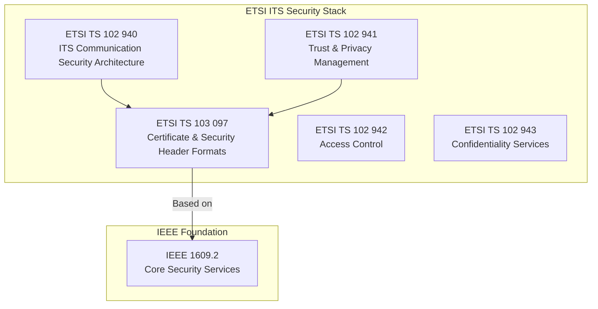
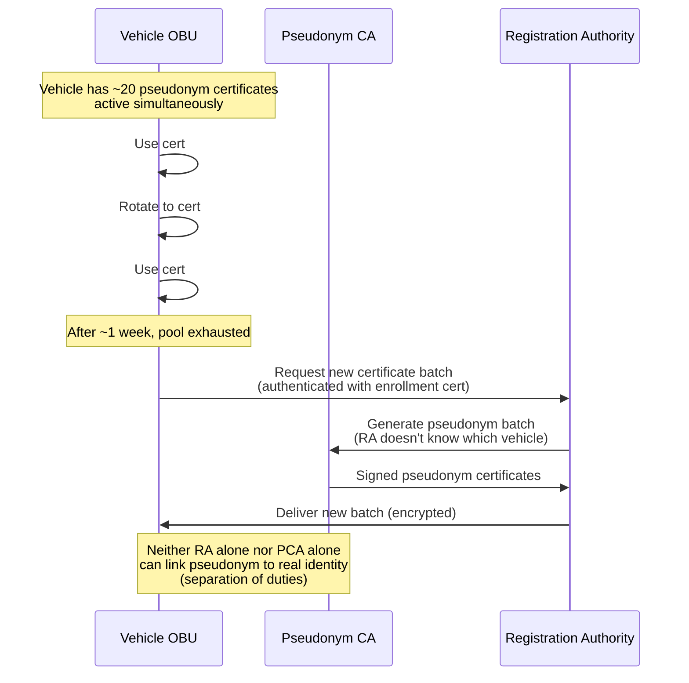
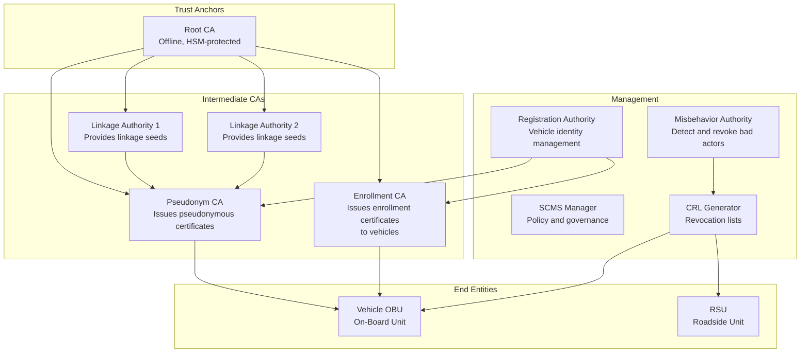
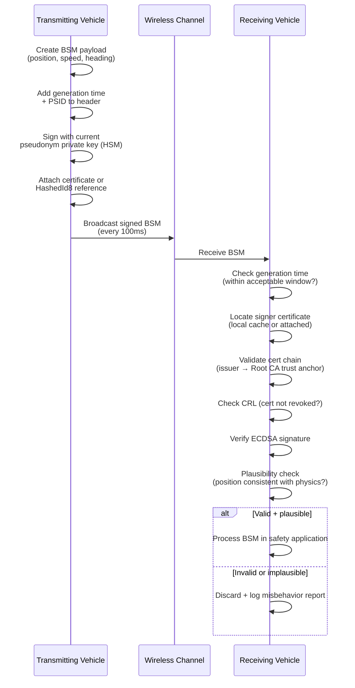

# V2X Security — IEEE 1609.2 & Communication Security

**Topic:** Vehicle-to-Everything (V2X) Communication Security — DSRC/WAVE and C-V2X  
**Standards:** IEEE 1609.2/1609.2a, IEEE 1609.3/4, ETSI TS 103 097, ETSI TS 102 940, SAE J2945  
**SDO:** IEEE, ETSI, SAE, 5GAA  
**Audience:** V2X security engineers, connected vehicle architects, PKI specialists, ITS system designers  
**Prerequisites:** Public key cryptography, certificate management, wireless communications, ISO/SAE 21434 basics

---

## Chapter 1 — Historical Context & Origin Story

### 1.1 V2X Evolution Timeline

| Year | Event | Significance |
|------|-------|-------------|
| 1999 | US FCC allocates 5.9 GHz band for DSRC | Spectrum designated for vehicle safety |
| 2004 | IEEE 802.11p development begins | Physical/MAC layer for vehicular communications |
| 2006 | IEEE 1609 family begins (WAVE) | Protocol suite for wireless vehicular access |
| 2010 | IEEE 1609.2 first edition | Security services for V2X |
| 2013 | US DOT Safety Pilot (Ann Arbor, MI) | 3,000 vehicles with DSRC + SCMS |
| 2016 | IEEE 1609.2-2016 revision | Enhanced certificate formats |
| 2017 | 3GPP Release 14: C-V2X (LTE-V2X) | Cellular alternative to DSRC |
| 2018 | ETSI ITS security framework complete | European V2X security architecture |
| 2020 | 3GPP Release 16: NR-V2X (5G) | Next-gen cellular V2X |
| 2022 | FCC reallocates 5.9 GHz (US) | 30 MHz for C-V2X, 20 MHz for DSRC transition |
| 2023 | IEEE 1609.2b (2022) published | Updated security (PQC considerations) |
| 2024+ | Mass V2X deployment begins | China leading with C-V2X deployment |

### 1.2 Two Technology Paths

| Feature | DSRC (IEEE 802.11p / WAVE) | C-V2X (3GPP PC5) |
|---------|---------------------------|-------------------|
| PHY/MAC | IEEE 802.11p (OFDM) | 3GPP sidelink (SC-FDMA) |
| Latency | ~2ms | ~5-10ms (LTE), ~1ms (NR) |
| Range | ~300m typical | ~450m (LTE), potentially >1km (NR) |
| Security layer | IEEE 1609.2 | IEEE 1609.2 (application layer) |
| Spectrum | 5.9 GHz (shared) | 5.9 GHz (PC5 sidelink) |
| Ecosystem | US (legacy), EU (transition) | China (primary), US (future) |

**Key insight:** Both DSRC and C-V2X use **IEEE 1609.2** at the application/security layer. The security framework is technology-agnostic.

---

## Chapter 2 — Standard Architecture & Structure

### 2.1 IEEE 1609 Protocol Family

| Standard | Layer | Function |
|----------|-------|----------|
| IEEE 802.11p / 802.11bd | PHY/MAC | Radio access technology |
| IEEE 1609.4 | MAC Extension | Multi-channel operation |
| IEEE 1609.3 | Network/Transport | WAVE Short Message Protocol (WSMP) |
| **IEEE 1609.2** | **Security** | **Security services (signing, encryption, certificates)** |
| SAE J2735 | Application | Message dictionary (BSM, MAP, SPaT, etc.) |
| SAE J2945 | Application | Minimum performance requirements (V2V safety) |

### 2.2 ETSI ITS Security Architecture



---

## Chapter 3 — Technical Deep Dive

### 3.1 IEEE 1609.2 Security Services

| Service | Purpose | Mechanism |
|---------|---------|-----------|
| Data authentication | Verify message originated from legitimate source | ECDSA signature (P-256 or brainpoolP256r1) |
| Data integrity | Detect message tampering | Cryptographic signature covers full payload |
| Anonymity/privacy | Prevent long-term tracking of vehicles | Pseudonymous certificates (rotating frequently) |
| Confidentiality (optional) | Protect payload content | ECIES encryption |
| Replay protection | Prevent message replay | Timestamp + generation time validation |

### 3.2 Certificate Structure (IEEE 1609.2)

```
IEEE 1609.2 Certificate:
├── Version (v3)
├── Type: Explicit (full public key) or Implicit (reconstructible)
├── Issuer: HashedId8 of issuing CA
├── To-Be-Signed Data:
│   ├── ID: linkage-based (for pseudonymity) or name-based
│   ├── Validity Period: start + duration
│   ├── Verification Key: public key for signature verification
│   │   ├── Algorithm: ECDSA-P256-SHA256 or ECDSA-brainpoolP256r1
│   │   └── Key value (compressed point)
│   ├── Geographic Region (optional): where cert is valid
│   ├── App Permissions (PSID): which applications authorized
│   │   ├── BSM (Basic Safety Message): PSID 0x20
│   │   ├── Signal Phase & Timing: PSID 0x8002
│   │   └── MAP: PSID 0x8003
│   └── Cert Issue Permissions (for CA certs only)
├── Signature: Issuer's signature over TBS data
└── (Implicit: Reconstruction value instead of full key + signature)
```

### 3.3 Signed Message Format

```
Ieee1609Dot2Data:
├── Protocol Version: 3
├── Content:
│   └── Signed Data:
│       ├── Hash Algorithm: SHA-256
│       ├── TBS Data:
│       │   ├── Payload: BSM/SPaT/MAP content
│       │   ├── Header Info:
│       │   │   ├── PSID: application identifier
│       │   │   ├── Generation Time: microseconds since epoch
│       │   │   └── Generation Location (optional)
│       │   └── External Data Hash (optional)
│       └── Signer:
│           ├── Certificate (full cert, for first message)
│           ├── HashedId8 (cert digest, for subsequent messages)
│           └── Or self-signed (for anonymous messages)
│       └── Signature: ECDSA over SHA-256(TBS Data)
```

### 3.4 Pseudonymous Certificates and Privacy



**Privacy properties:**
- **Unlinkability:** Different pseudonyms cannot be linked to same vehicle by external observer
- **Separation of duties:** Registration Authority knows identity but not pseudonyms; Pseudonym CA creates pseudonyms but doesn't know identity
- **Revocation:** Misbehavior authority can link all pseudonyms of a misbehaving vehicle (threshold)

### 3.5 Misbehavior Detection

| Misbehavior Type | Detection Method | Response |
|-----------------|-----------------|----------|
| Fake position | Plausibility check (BSM position vs. map, physics) | Report to Misbehavior Authority |
| Fake speed/heading | Consistency check (position change vs. reported speed) | Local filtering |
| Replay attack | Generation time validation (message too old) | Discard message |
| Certificate revocation | Check CRL/OCSP before trusting | Ignore messages from revoked cert |
| Sybil attack (many fake vehicles) | Certificate linkage analysis | Revoke all linked pseudonyms |

---

## Chapter 4 — Implementation Guide

### 4.1 OBU (On-Board Unit) Security Implementation

| Component | Function | Implementation |
|-----------|----------|---------------|
| HSM/Secure Element | Store private keys, perform signing | Dedicated crypto chip (SHE+, HSM) |
| Certificate store | Hold active pseudonym pool | Secure storage (encrypted flash) |
| Signing engine | Sign BSM at 10 Hz (100ms per message) | Hardware-accelerated ECDSA |
| Verification engine | Verify received messages (~1000/sec in dense traffic) | Parallel ECDSA verification (batch) |
| Privacy module | Manage pseudonym rotation | Synchronized cert + MAC address change |
| Misbehavior detection | Local plausibility checks | Application-layer filtering |

### 4.2 Performance Requirements

| Operation | Target | Constraint |
|-----------|--------|-----------|
| BSM signing | ≤1ms | Must not delay 10 Hz broadcast |
| Message verification | ≤5ms per message | Must verify all received BSMs in real-time |
| Verification throughput | ≥1,500 verifications/sec | Dense intersection scenario |
| Certificate rotation | Seamless (no message gap) | Pre-compute next cert, atomic switch |
| Certificate provisioning | <30 seconds for batch | Background task (not latency-critical) |

### 4.3 Key Management Lifecycle

```
1. MANUFACTURING: Install Root CA trust anchor + enrollment certificate
2. INITIAL PROVISIONING: Vehicle contacts SCMS, obtains first pseudonym batch
3. OPERATIONAL: 
   - Rotate pseudonyms (every 5 min or per trip)
   - Sign outgoing BSMs with current pseudonym
   - Verify incoming messages against trust chain
4. REPLENISHMENT: Request new pseudonym batch before pool exhausted
5. REVOCATION (if misbehavior detected): 
   - All pseudonyms of misbehaving vehicle added to CRL
   - Enrollment certificate may be revoked
6. END OF LIFE: Remove all credentials, factory reset
```

---

## Chapter 5 — Certification & Audit

### 5.1 V2X Device Certification

| Program | Region | Scope |
|---------|--------|-------|
| OmniAir Certification | North America | DSRC/C-V2X interoperability + security |
| C2C-CC (Car-to-Car Communication Consortium) | Europe | ITS-G5 + C-V2X conformance |
| IMT-2020 (5G) Promotion Group | China | C-V2X certification |
| UNECE R155/R156 | Global | Overall vehicle cybersecurity (includes V2X) |

### 5.2 SCMS Operator Requirements

| Requirement | Purpose |
|-------------|---------|
| Physical security (data center) | Protect CA private keys |
| HSM-based key management | Keys never in software/memory |
| Operational procedures (dual control) | Key ceremonies require multiple people |
| Audit logging | All certificate operations recorded |
| Disaster recovery | Service continuity for provisioning |
| Policy compliance (Certificate Policy, CPS) | Documented operational rules |

---

## Chapter 6 — Regional & Domain Variants

| Region | Technology | PKI System | Status |
|--------|-----------|-----------|--------|
| USA | DSRC → C-V2X transition | SCMS (US DOT) | Deployment pending FCC finalization |
| EU | ITS-G5 → C-V2X transition | EU C-ITS PKI (CCMS) | Delegated Acts + pilot deployments |
| China | C-V2X (PC5) | China V2X CA system | Mass deployment in 20+ cities |
| Japan | DSRC (700 MHz) + C-V2X | Japan ITS PKI | Highway deployment active |
| South Korea | C-V2X | Korea V2X PKI | Deployment in progress |
| Australia | C-V2X | TBD (evaluating SCMS) | Pilot phase |

### 6.1 Key Regional Differences

| Feature | US (SCMS) | EU (CCMS) | China |
|---------|-----------|-----------|-------|
| Certificate format | IEEE 1609.2 | ETSI TS 103 097 | GB/T (IEEE 1609.2 based) |
| Privacy model | Butterfly key expansion | Pseudonym batch (similar) | Government-accessible identity |
| Misbehavior authority | Separate from CAs | Integrated | Government-operated |
| Cross-border trust | SCMS manager | EU CTL (Certificate Trust List) | Domestic only |
| Algorithm | ECDSA P-256 | ECDSA brainpoolP256r1 | SM2 (Chinese algorithm) |

---

## Chapter 7 — Comparison: V2X Security Frameworks

| Feature | IEEE 1609.2 (US) | ETSI TS 103 097 (EU) | China GB/T | Direct comparison |
|---------|-----------------|---------------------|-----------|------------------|
| Base crypto | ECDSA P-256 | ECDSA brainpoolP256r1 | SM2/SM3/SM4 | Different curves/algorithms |
| Certificate format | Ieee1609Dot2 (COER) | EtsiTs103097 (COER) | GB/T format | Similar structure, different encoding choices |
| Privacy | Pseudonym rotation + butterfly keys | Pseudonym rotation | Conditional anonymity | US/EU stronger privacy; China weaker |
| Revocation | CRL + linkage seeds | CRL + CTL updates | CRL | Mechanisms similar |
| Max cert size | ~200 bytes (implicit) | ~220 bytes | ~250 bytes | All compact for broadcast |
| Trust model | Multi-CA (distributed) | EU CTL (centralized list) | Single root (government) | Different governance models |

---

## Chapter 8 — Mermaid Architecture Diagrams

### 8.1 SCMS Architecture (US DOT Model)



### 8.2 V2X Message Security Flow



---

## Chapter 9 — Case Studies & Failure Analysis

### 9.1 US DOT Safety Pilot (Ann Arbor, 2012-2014)

**Scale:** 2,800+ equipped vehicles, 29 RSUs, 6 months of continuous operation.

**Security deployment:** Full SCMS operational: enrollment, pseudonym provisioning, rotation, verification. Key findings:
- HSM-based signing met 10 Hz requirement
- Certificate rotation worked (5-minute interval)
- Verification throughput sufficient for suburban density
- No security incidents during pilot
- PKI overhead: ~200 bytes per BSM (acceptable)

**Limitation identified:** Dense urban scenario (1,000+ vehicles) would require batch verification optimization.

### 9.2 Potential Attack: V2X Ghost Vehicle Attack

**Threat:** Attacker with compromised credentials (stolen OBU) broadcasts fake BSMs claiming to be multiple vehicles, causing receiving vehicles to brake or swerve unnecessarily.

**Why it works without mitigations:** Each BSM is individually valid (proper signature, valid certificate). Receiver has no way to verify that the claimed position is actually occupied.

**Mitigations:**
1. **Misbehavior detection:** Physics-based checks (can a vehicle appear/disappear instantly?)
2. **Collective detection:** If multiple receivers disagree about a claimed vehicle, report
3. **Revocation:** Once detected, all certificates of misbehaving OBU revoked via CRL
4. **Sensor fusion:** Cross-check V2X data with radar/camera observations

---

## Chapter 10 — Future Evolution & Industry Trends

| Trend | Impact on V2X Security |
|-------|----------------------|
| Post-quantum cryptography | IEEE 1609.2 must transition to PQC (larger signatures = bandwidth challenge) |
| NR-V2X (5G sidelink) | Higher bandwidth may ease PQC overhead |
| Multi-access edge computing (MEC) | Security at edge for low-latency V2X services |
| Vehicle-to-Network (V2N) integration | Combine sidelink (PC5) security with network (Uu) security |
| AI-based misbehavior detection | ML models for anomaly detection in V2X data |
| Cross-border interoperability | EU-US-Asia certificate trust bridging |
| Cooperative automated driving | V2X security critical for platooning, intersection coordination |
| Subscription-based V2X | As-a-service model changes provisioning model |

---

## Chapter 11 — Interview Questions & Career Guide

### Tier 1: Entry-Level (0-3 years)

**Q1:** Why do V2X messages need digital signatures? Why not just encrypt them?  
**A:** V2X safety messages (BSMs) are **broadcast** — sent to all vehicles within range. Encryption would require every receiver to have a shared key (impractical for broadcast). Instead, we need: (1) **Authentication:** Verify the message came from a legitimate V2X participant (not a random radio device). (2) **Integrity:** Ensure the message wasn't modified in transit. (3) **Non-repudiation:** Enable misbehavior detection (trace back to issuer if needed). Digital signatures (ECDSA) provide all three. Encryption is used only for unicast V2X messages (e.g., certificate provisioning) where confidentiality is needed. BSM content (position, speed) is not confidential — it's meant to be received by everyone nearby.

### Tier 2: Mid-Level (3-8 years)

**Q2:** Explain the privacy architecture of SCMS. How does pseudonymous certificate management prevent tracking while still enabling revocation?  
**A:** **Privacy goal:** An external observer should not be able to track a vehicle over time by its V2X transmissions. **Mechanism:** (1) Vehicle gets a POOL of ~20 pseudonymous certificates simultaneously. (2) Vehicle rotates to a different pseudonym every 5 minutes (also changes MAC address simultaneously). (3) External observer sees different identities with no linkage. **Separation of duties:** Registration Authority (RA) knows vehicle identity but never sees which pseudonyms are issued. Pseudonym CA (PCA) creates pseudonyms but doesn't know which vehicle requested them (RA blinds the request). Result: No single entity can link pseudonym → real identity. **Revocation despite privacy:** Linkage Authorities (LA1, LA2) each provide a "linkage seed" embedded in every pseudonym of the same vehicle. Neither LA alone can extract identity. But when Misbehavior Authority decides to revoke, it obtains BOTH linkage seeds → can compute linkage values for ALL pseudonyms of that vehicle → generates CRL entries covering entire pool.

### Tier 3: Senior/Staff (8-15 years)

**Q3:** Design the V2X security architecture for a mixed DSRC + C-V2X deployment. How do you handle certificate interoperability, dual-stack verification, and transition from one technology to another?

---

## Chapter 12 — Cheat Sheet & Quick Reference

### V2X Security Quick Reference

```
IEEE 1609.2:         Security services (signing, verification, certificates)
SCMS (US):           PKI system for V2X credential management
EU C-ITS PKI:        European equivalent (ETSI TS 102 940/941)
Certificate format:  Compact (~200 bytes), COER-encoded
Signing algorithm:   ECDSA P-256 (US) / brainpoolP256r1 (EU) / SM2 (China)
BSM rate:            10 Hz (100ms interval)
Pseudonym rotation:  Every 5 minutes (typical) + MAC address change
Verification rate:   1,500+ messages/second (dense scenario)
Trust anchors:       Root CA (offline) → Intermediate CAs → End-entity certs
```

### V2X Attack Surface

```
HIGH: Fake BSM broadcast (spoofed position/speed) → ghost vehicles
HIGH: Denial of service (jam 5.9 GHz band) → lose safety messages
MEDIUM: Privacy violation (track vehicle via pseudonym linkage)
MEDIUM: Compromised OBU credential (clone/steal keys)
LOW: CRL manipulation (prevent revocation awareness)
LOW: Time synchronization attack (GPS spoofing → invalid timestamps)
```

---

*End of Document — 05_V2X_Security_IEEE_1609.md*
