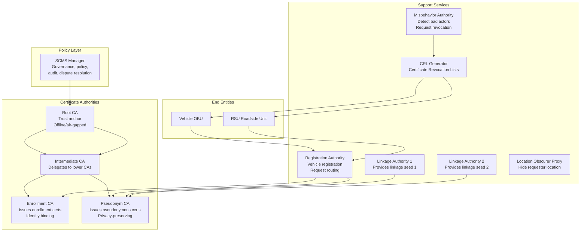
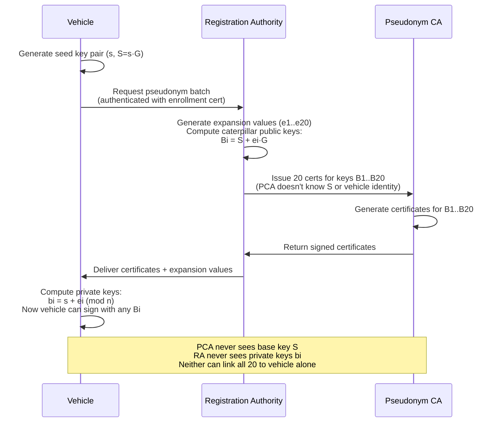
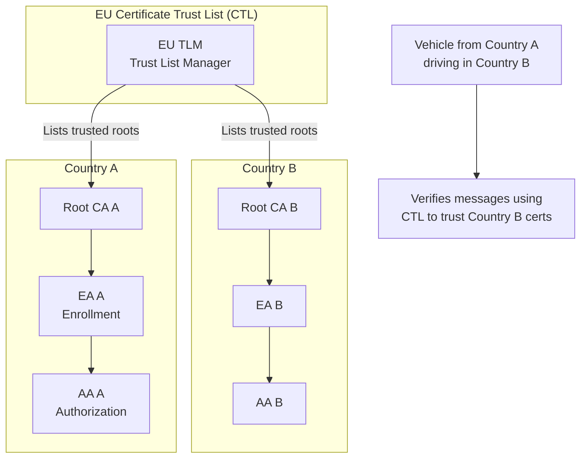
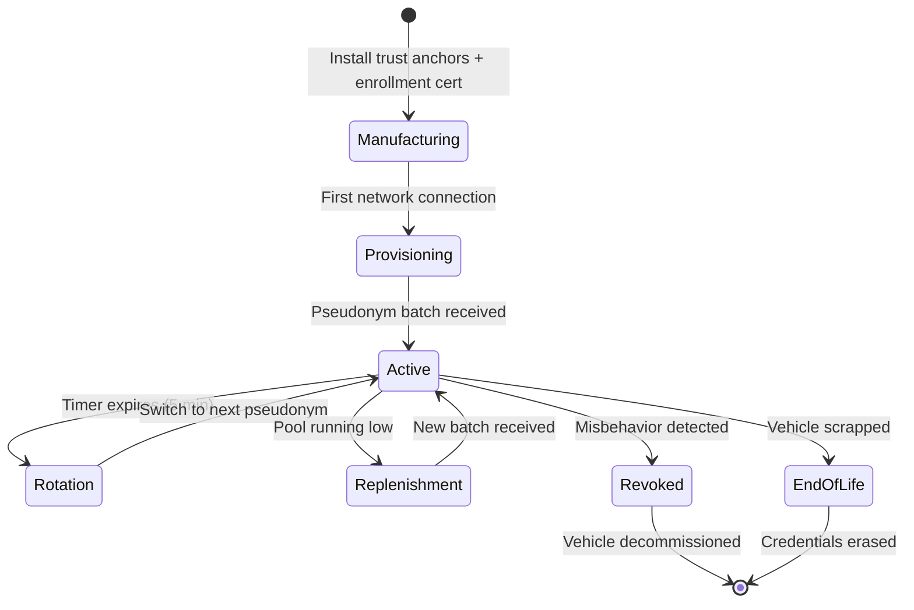
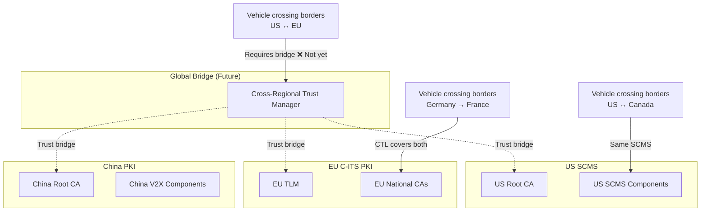

# Vehicle PKI & SCMS — Security Credential Management

**Topic:** Vehicle Public Key Infrastructure and Security Credential Management System for V2X  
**Standards:** IEEE 1609.2, SCMS (US DOT), ETSI TS 102 940/941, EU C-ITS PKI (CCMS)  
**SDO:** IEEE, US DOT, ETSI, C2C-CC, EU Commission  
**Audience:** PKI architects, V2X security engineers, certificate management specialists, ITS operators  
**Prerequisites:** PKI fundamentals (X.509), elliptic curve cryptography, IEEE 1609.2 basics, V2X concepts

---

## Chapter 1 — Historical Context & Origin Story

### 1.1 Timeline

| Year | Event | Significance |
|------|-------|-------------|
| 2006 | US DOT VII Program begins | First vehicle PKI research |
| 2009 | CAMP (Crash Avoidance Metrics Partnership) security study | PKI requirements for V2V |
| 2012 | SCMS design finalized (Leidos/CAMP) | Full architecture with privacy |
| 2013 | Safety Pilot (Ann Arbor): SCMS operational | First real-world V2X PKI deployment |
| 2016 | NHTSA proposed V2V mandate | Would have required nationwide SCMS |
| 2017 | EU C-ITS PKI framework (ETSI) | European PKI architecture defined |
| 2018 | C-Roads platform: cross-border PKI pilots | Austria, Netherlands, Germany |
| 2020 | EU CCMS (Cooperative Certificate Management System) | Centralized European trust management |
| 2021 | SCMS transition planning (US DOT → industry) | Governance shift to industry consortium |
| 2023 | China V2X PKI operational | National-level V2X certificate system |
| 2024+ | Cross-regional trust bridging discussions | US-EU-Asia interoperability |

### 1.2 Why Vehicle PKI is Unique

| Challenge | V2X PKI Requirement | Traditional PKI (Web) |
|-----------|--------------------|--------------------|
| Scale | 300M+ vehicles (US alone) | ~680M active web certs |
| Privacy | Cannot reveal identity via certs | Identity in certificate (common name) |
| Performance | Sign at 10 Hz, verify 1000+/sec | Transaction-based (ms tolerance ok) |
| Lifetime | Vehicle: 15-20 years | Certificate: 1-2 years |
| Connectivity | Intermittent (rural areas) | Always online |
| Revocation | Must work without real-time connectivity | OCSP real-time check common |
| Certificate size | ~200 bytes (compact, broadcast) | ~1-2 KB (X.509) |

---

## Chapter 2 — Standard Architecture & Structure

### 2.1 SCMS Component Architecture



### 2.2 EU C-ITS PKI (CCMS)

| Component | EU Equivalent | Function |
|-----------|--------------|----------|
| Root CA | EU C-ITS Trust List Manager | Manage trust anchors via CTL |
| Enrollment CA | Enrollment Authority (EA) | Issue enrollment credentials |
| Pseudonym CA | Authorization Authority (AA) | Issue authorization tickets (pseudonyms) |
| CRL Generator | Certificate Trust List (CTL) + CRL | Revocation via CTL updates |
| SCMS Manager | C-ITS Certificate Policy Authority (CPA) | Governance |

---

## Chapter 3 — Technical Deep Dive

### 3.1 Certificate Types in SCMS

| Certificate Type | Purpose | Lifetime | Quantity per Vehicle |
|-----------------|---------|----------|---------------------|
| Root CA Certificate | Trust anchor | 20+ years | 1 (stored in all devices) |
| Enrollment Certificate | Identity credential | 5-20 years (vehicle lifetime) | 1 per device |
| Pseudonym Certificate | Privacy-preserving broadcast signing | 1 week | 20 per batch, new batch weekly |
| Identification Certificate | Non-privacy applications (RSU, infrastructure) | 1-3 years | 1 per RSU |

### 3.2 Butterfly Key Expansion (SCMS Privacy Innovation)

**Problem:** If Pseudonym CA issues 20 certs for one vehicle, PCA knows all 20 belong to same vehicle.

**Solution:** Butterfly key expansion — vehicle generates base key pair, RA uses cocoon keys to derive pseudonymous keys such that PCA generates certificates without knowing the base identity.



### 3.3 Linkage-Based Revocation

**Problem:** Pseudonymous certificates have no identity — how to revoke all certs of a misbehaving vehicle?

**Solution:** Each pseudonym cert contains encrypted linkage values from two independent Linkage Authorities.

```
Certificate linkage data:
  - LA1 linkage value: f(LA1_seed, cert_index)
  - LA2 linkage value: f(LA2_seed, cert_index)

To revoke:
  1. Misbehavior Authority requests BOTH linkage seeds from LA1 + LA2
  2. Neither LA alone can identify the vehicle
  3. With both seeds, CRL Generator computes ALL linkage values
  4. CRL contains linkage values → all pseudonyms of bad actor are revocable
```

### 3.4 Certificate Provisioning Protocol

| Step | Action | Security Control |
|------|--------|-----------------|
| 1 | Vehicle boots, connects to network | TLS to RA |
| 2 | Authenticate with enrollment certificate | Mutual authentication |
| 3 | Request pseudonym batch (e.g., 20 certs for next week) | Signed request |
| 4 | RA validates eligibility (not revoked, within quota) | Policy enforcement |
| 5 | RA initiates butterfly expansion with PCA | Blinded request |
| 6 | PCA generates and signs certificates | HSM-based signing |
| 7 | Certificates delivered to vehicle (encrypted) | End-to-end encryption |
| 8 | Vehicle stores in secure certificate pool | HSM/secure storage |
| 9 | Vehicle downloads latest CRL | Integrity-verified |

### 3.5 CRL (Certificate Revocation List) Management

| Challenge | Solution |
|-----------|----------|
| CRL size (millions of vehicles) | Hash-based CRL (compact representation) |
| Distribution (intermittent connectivity) | Multiple channels: cellular, RSU broadcast, V2V relay |
| Timeliness (revocation delay) | Short-lived pseudonyms (1 week) limit exposure window |
| Storage on vehicle | Incremental CRL updates (delta CRL) |
| Verification without connectivity | Local CRL cache valid for 24 hours minimum |

---

## Chapter 4 — Implementation Guide

### 4.1 OBU Certificate Management Implementation

| Component | Implementation Detail |
|-----------|---------------------|
| Secure key storage | HSM/SE (Common Criteria EAL4+ or equivalent) |
| Certificate pool management | 20 active pseudonym certs + next batch pre-fetched |
| Rotation scheduler | Timer-based (5 min) + trip-based + random jitter |
| Provisioning client | HTTPS to SCMS RA (with enrollment cert as client auth) |
| CRL processing | Parse, store, query during verification |
| Certificate validation | Chain validation + expiry check + CRL check |

### 4.2 SCMS Operations Setup

| Requirement | Specification |
|-------------|--------------|
| Root CA | Offline/air-gapped, HSM (FIPS 140-2 Level 3+), ceremony-based |
| Enrollment CA | Online (protected network), HSM, high availability |
| Pseudonym CA | Online, HSM, high throughput (millions of certs/day) |
| Registration Authority | Online, front-end for vehicles, load-balanced |
| Linkage Authorities | Separate organizations, separate jurisdictions |
| CRL Generator | Near-real-time, distributed delivery |
| Disaster recovery | Multi-site, RTO <4 hours |
| Audit | Continuous logging, annual third-party audit |

### 4.3 Cross-Domain Trust (EU C-ITS)



---

## Chapter 5 — Certification & Audit

### 5.1 SCMS Operator Certification

| Area | Audit Requirement |
|------|------------------|
| Physical security | FIPS 140-2 Level 3 for Root CA HSM; Level 2 for operational CAs |
| Personnel | Background checks, dual-control for key ceremonies |
| Operations | SOC 2 Type II or equivalent operational audit |
| Policy compliance | Certificate Policy (CP) and CPS (Certification Practice Statement) |
| Incident response | Documented key compromise procedure (root CA revocation) |
| Availability | 99.9% for provisioning services; 99.99% for CRL delivery |

### 5.2 EU CPOC (C-ITS Point of Contact) Requirements

Each EU member state designates a CPOC responsible for:
- Operating or delegating EA/AA services
- Ensuring compliance with EU Certificate Policy
- Reporting to European TLM for trust list updates
- Cross-border cooperation with other CPOCs

---

## Chapter 6 — Regional & Domain Variants

| Region | PKI System | Key Features |
|--------|-----------|-------------|
| USA (SCMS) | Multi-organizational, privacy-focused | Butterfly keys, dual linkage authorities, strong privacy |
| EU (CCMS/C-ITS PKI) | Federated (per-country CAs, EU trust list) | CTL-based trust, pseudonym authorization tickets |
| China | Government-operated, centralized | SM2 crypto, conditional privacy (government access) |
| Japan | Hybrid (government + industry) | 700 MHz DSRC focused, transitioning to C-V2X |
| South Korea | Government-backed, KISA-managed | National PKI integration |

---

## Chapter 7 — Comparison: SCMS vs. EU C-ITS PKI vs. Web PKI

| Feature | SCMS (US) | EU C-ITS PKI | Web PKI (X.509) |
|---------|-----------|-------------|-----------------|
| Certificate format | IEEE 1609.2 (compact) | ETSI TS 103 097 (compact) | X.509v3 (verbose) |
| Size | ~200 bytes | ~220 bytes | ~1-2 KB |
| Privacy | Strong (pseudonymous, unlinkable) | Strong (pseudonymous) | None (identity in cert) |
| Revocation | CRL + linkage values | CRL + CTL | CRL + OCSP |
| Governance | Industry consortium | EU Commission + member states | Browser vendors (CA/Browser Forum) |
| Scale target | 300M+ vehicles (US) | 250M+ vehicles (EU) | ~680M active certs |
| Crypto | ECDSA P-256 | ECDSA brainpoolP256r1 | RSA-2048 / ECDSA P-256 |
| Cross-border | Single system (US nationwide) | CTL for EU-wide trust | Global trust via root programs |
| Post-quantum plan | Under study (NIST PQC) | Under study (ETSI QSC) | Hybrid certs emerging |

---

## Chapter 8 — Mermaid Architecture Diagrams

### 8.1 End-to-End Certificate Lifecycle



### 8.2 Multi-Region Interoperability Model



---

## Chapter 9 — Case Studies & Failure Analysis

### 9.1 Case Study: C-Roads Cross-Border PKI (EU)

**Scenario:** Vehicles equipped with ITS-G5 crossing borders between Austria, Germany, and Netherlands during C-Roads pilot.

**Challenge:** Each country operates its own EA/AA. Vehicle from Austria broadcasting BSMs in Germany — German vehicles must trust Austrian certificates.

**Solution:** EU Certificate Trust List (CTL): All participating Root CAs registered in single trust list. Every vehicle carries latest CTL. Certificate chain validation: message cert → issuing AA → country Root CA → check CTL.

**Result:** Seamless cross-border V2X communication verified during pilot. Latency for unknown cert validation: <50ms additional (one-time CA lookup per new issuer).

### 9.2 Failure Analysis: Key Compromise Scenario

**Scenario:** An Enrollment CA private key is compromised (stolen from HSM due to insider threat).

**Impact:** Attacker can issue enrollment certificates → obtain legitimate pseudonyms → mount undetectable attacks.

**Response per SCMS design:**
1. Detect via audit logs (abnormal cert issuance patterns)
2. Revoke compromised Enrollment CA certificate
3. All vehicles enrolled by that CA must re-enroll (via backup enrollment cert or out-of-band process)
4. CRL updated with compromised CA identifier
5. Root CA issues new Enrollment CA (ceremony-based)
6. All existing pseudonyms from compromised CA path are invalidated

**Design lesson:** SCMS mandates compartmentalization: compromise of one CA type does not compromise others.

---

## Chapter 10 — Future Evolution & Industry Trends

| Trend | Impact on Vehicle PKI |
|-------|---------------------|
| Post-quantum cryptography (PQC) | Certificate sizes increase dramatically (lattice-based ~1-2KB); need protocol redesign |
| Hybrid certificates | Current ECDSA + PQC algorithm in same cert (transition period) |
| Cross-regional trust | US-EU-Asia interoperability frameworks needed for global vehicles |
| V2N convergence | Sidelink (PC5) and network (Uu) security integration |
| Subscription-based V2X | PKI provisioning for aftermarket/subscription models |
| Quantum key distribution (QKD) | Long-term: quantum-safe key exchange for PKI infrastructure |
| Blockchain-based trust | Alternative to centralized CRL (distributed revocation) |
| Edge-based certificate validation | MEC (Multi-access Edge Computing) for fast cert chain verification |

---

## Chapter 11 — Interview Questions & Career Guide

### Tier 1: Entry-Level (0-3 years)

**Q1:** Why does V2X use a custom PKI (SCMS) rather than standard X.509/TLS PKI?  
**A:** Standard web PKI (X.509/TLS) is inadequate for V2X because: (1) **Privacy:** X.509 certificates contain identity (Common Name, organization). V2X requires anonymity — a parked vehicle's broadcast shouldn't reveal owner. SCMS uses pseudonymous certificates. (2) **Size:** X.509 certificates are 1-2KB. V2X BSMs are broadcast at 10 Hz — cannot attach 2KB cert to each message. SCMS certificates are ~200 bytes. (3) **Scale:** 300M+ vehicles needing millions of pseudonyms. Web PKI isn't designed for this volume of short-lived certificates. (4) **Revocation without identity:** Need to revoke all certs of a misbehaving vehicle without revealing which vehicle it is to other participants. SCMS uses linkage-based revocation. (5) **Performance:** Must sign at 10 Hz and verify 1000+ msgs/sec. SCMS uses ECDSA (fast) vs. RSA (slower) and implicit certificates (smaller).

### Tier 2: Mid-Level (3-8 years)

**Q2:** Explain the privacy guarantees of SCMS butterfly key expansion. What information does each component learn?  
**A:** **Vehicle** knows: its identity, all its pseudonym private keys. **Registration Authority** knows: vehicle identity (enrollment cert), which batch requests belong to which vehicle, BUT NOT which pseudonym certificates resulted (butterfly expansion blinds this). **Pseudonym CA** knows: it signed a set of pseudonymous certificates for public keys B1..B20, BUT NOT which vehicle requested them (RA forwards blinded request). **Linkage Authorities (LA1, LA2):** Each knows one linkage seed per vehicle, BUT cannot alone link pseudonyms to identity. Both seeds together enable revocation. **External observer:** Sees pseudonymous certificates that rotate every 5 minutes — cannot link consecutive certificates without linkage seeds. **Result:** No single entity (except the vehicle itself) has complete knowledge of identity ↔ pseudonym mapping. This requires collusion of RA + PCA to break privacy (by design, they are separate organizations).

### Tier 3: Senior/Staff (8-15 years)

**Q3:** Design a PKI migration strategy for transitioning from ECDSA P-256 to a post-quantum algorithm in a fleet of 50 million vehicles with 15-year lifetime. What are the key challenges and how do you maintain backward compatibility during transition?

---

## Chapter 12 — Cheat Sheet & Quick Reference

### Vehicle PKI Quick Reference

```
SCMS (US):        Security Credential Management System
CCMS (EU):        Cooperative Certificate Management System  
Enrollment cert:  Long-lived identity credential (vehicle lifetime)
Pseudonym cert:   Short-lived privacy-preserving cert (1 week batches)
Rotation:         Every 5 minutes (typical) + MAC address change
Batch size:       ~20 pseudonyms per request
Crypto:           ECDSA P-256 (US), brainpoolP256r1 (EU), SM2 (China)
Cert size:        ~200 bytes (compact, IEEE 1609.2 format)
Privacy:          Butterfly key expansion + dual linkage authorities
Revocation:       CRL with linkage values (covers all pseudonyms of bad actor)
Trust anchor:     Root CA (offline, ceremony-based, 20+ year lifetime)
```

### SCMS Components Cheat Sheet

```
Root CA:             Trust anchor (offline, air-gapped)
Enrollment CA:       Issues enrollment certificates (identity-binding)
Pseudonym CA:        Issues pseudonymous certificates (no identity knowledge)
Registration Authority: Front-end for vehicles (request routing, policy)
Linkage Authority 1: Provides linkage seed 1 (organization A)
Linkage Authority 2: Provides linkage seed 2 (organization B)
Misbehavior Authority: Detects bad actors, triggers revocation
CRL Generator:       Computes and distributes revocation lists
Location Obscurer:   Hides vehicle's network location during provisioning
SCMS Manager:        Overall governance and policy
```

---

*End of Document — 06_Vehicle_PKI_SCMS.md*
