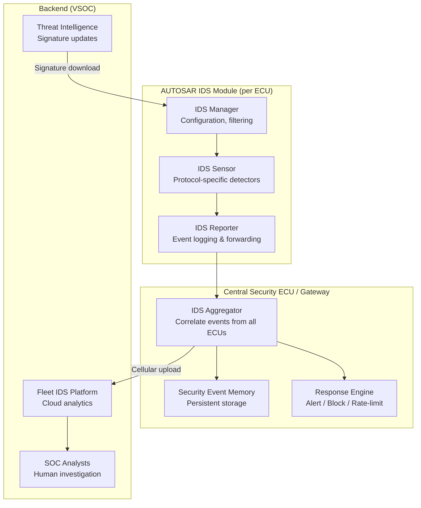
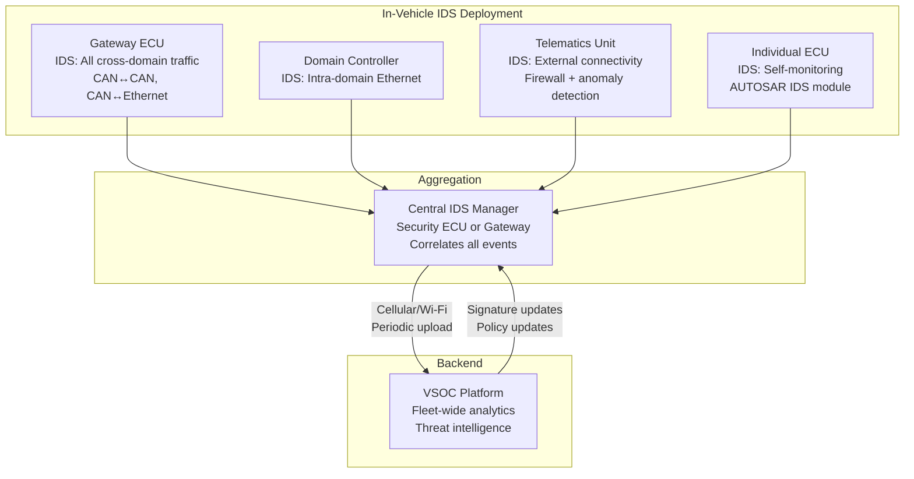
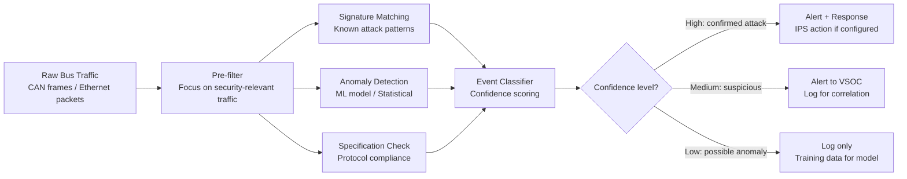
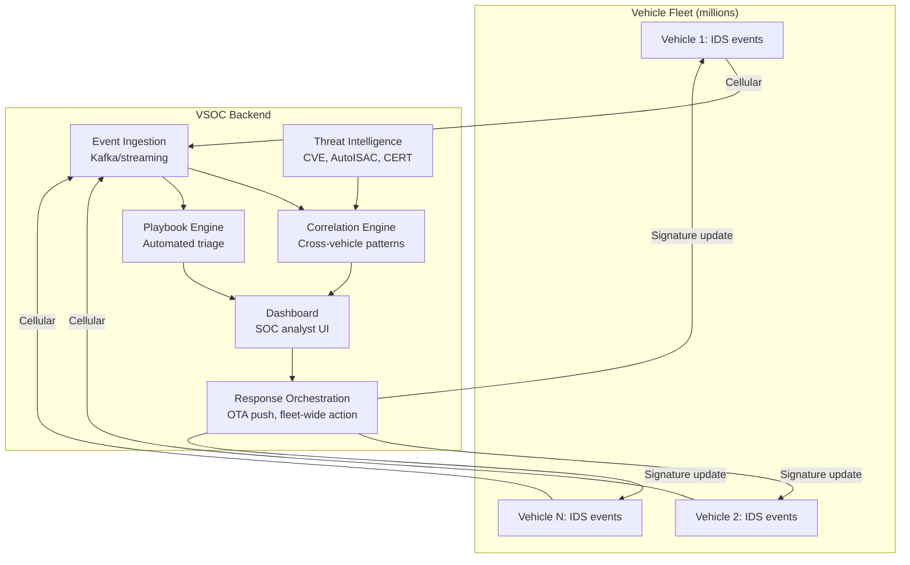

# In-Vehicle Intrusion Detection and Prevention Systems (IDS/IPS)

**Topic:** Automotive Intrusion Detection & Prevention — In-Vehicle Network Security Monitoring  
**Standards:** ISO/SAE 21434 Clause 13, SAE J3061, AUTOSAR IDS Module, ENISA Guidelines  
**SDO:** ISO/SAE, SAE, AUTOSAR, ENISA, AutoISAC  
**Audience:** Vehicle security architects, VSOC engineers, in-vehicle IDS developers, ADAS network designers  
**Prerequisites:** CAN/CAN-FD/Ethernet protocols, automotive E/E architecture, network security basics, ISO/SAE 21434

---

## Chapter 1 — Historical Context & Origin Story

### 1.1 Evolution Timeline

| Year | Event | Significance |
|------|-------|-------------|
| 2010 | Koscher et al. demonstrate CAN injection | Proved in-vehicle networks have zero authentication |
| 2013 | Miller/Valasek: physical CAN attacks published | Detailed attack methodology available |
| 2015 | Jeep Cherokee remote attack | Remote CAN injection → safety compromise |
| 2016 | SAE J3061 recommends threat monitoring | First formal automotive IDS guidance |
| 2016 | Argus, Upstream, Arilou founded | Automotive IDS startup ecosystem emerges |
| 2017 | AUTOSAR begins IDS module specification | Standardized IDS interface in ECU software |
| 2019 | First OEM IDS deployments (production vehicles) | BMW, Mercedes-Benz deploy vehicle IDS |
| 2021 | ISO/SAE 21434: Clause 13 requires monitoring | Standard mandates post-production detection |
| 2022 | UNECE R155: detection/response required for type approval | Regulatory mandate for monitoring capability |
| 2023 | VSOC (Vehicle SOC) market matures | Fleet-level monitoring platforms operational |
| 2024 | AI-based anomaly detection in production | ML models deployed for CAN/Ethernet |

### 1.2 Why In-Vehicle IDS is Necessary

| Vehicle Network Property | Security Implication |
|--------------------------|---------------------|
| CAN has no authentication | Any device on bus can send any message ID |
| CAN has no encryption | All traffic visible to any connected device |
| Broadcast protocol | Every ECU receives every message on the bus |
| No source identification | Cannot attribute message to specific ECU |
| Fixed message IDs | Legitimate traffic patterns are predictable (opportunity for detection) |
| Safety-critical real-time | IDS must not add latency or interrupt function |

---

## Chapter 2 — Standard Architecture & Structure

### 2.1 AUTOSAR IDS Architecture



### 2.2 IDS within ISO/SAE 21434 and R155

| Requirement Source | IDS-Related Mandate |
|-------------------|-------------------|
| ISO/SAE 21434 Clause 8 | Continual cybersecurity activities: monitoring, vulnerability management |
| ISO/SAE 21434 Clause 13 | Post-production: cybersecurity monitoring and response |
| UNECE R155 Section 7.2.2.3 | Process to detect and respond to attacks on vehicles in the field |
| UNECE R155 Section 7.3.6 | Post-production monitoring and response capability per vehicle type |

---

## Chapter 3 — Technical Deep Dive

### 3.1 Detection Methods

| Method | How it Works | Strengths | Weaknesses |
|--------|-------------|-----------|------------|
| **Signature-based** | Match known attack patterns | Low false positives, fast | Cannot detect unknown attacks |
| **Anomaly-based (statistical)** | Detect deviations from normal traffic baseline | Detects novel attacks | Higher false positive rate |
| **Anomaly-based (ML)** | Machine learning model of normal behavior | Adapts to complex patterns | Requires training data, explainability |
| **Specification-based** | Compare against protocol/message specifications | Very accurate for protocol violations | Cannot detect valid-but-malicious messages |
| **Physics-based** | Cross-check sensor data with physical models | Detects spoofed sensor data | Domain-specific, complex |
| **Timing-based** | Detect unusual message timing/frequency | Simple, effective for CAN | Some attacks preserve timing |

### 3.2 CAN Bus IDS Techniques

| Technique | What it Detects | Implementation |
|-----------|----------------|----------------|
| Message frequency monitoring | Missing or extra messages (DoS, injection) | Count messages per ID per time window |
| Message timing analysis | Irregular intervals (injection between normal messages) | Statistical model of inter-message time |
| Payload range checking | Out-of-range signal values (tampering) | DBC-based value range validation |
| Payload entropy analysis | Unusual randomness in data fields | Shannon entropy per byte/field |
| Sequence analysis | Broken state machines (wrong order of messages) | Protocol state model |
| ECU fingerprinting (clock skew) | Identify if message comes from legitimate ECU | Measure oscillator drift unique to each ECU |
| Bus voltage fingerprinting | Identify transmitting ECU by electrical characteristics | Analog signal analysis of CAN transceiver |

### 3.3 Automotive Ethernet IDS

| Layer | Technique | Example |
|-------|-----------|---------|
| L2 (Ethernet) | MAC address spoofing detection | Unexpected source MAC on port |
| L3 (IP) | IP spoofing, unexpected traffic flows | Flow table violation |
| L4 (TCP/UDP) | Port scanning, connection anomalies | New port opened on ECU |
| L7 (Application) | Protocol anomalies (SOME/IP, DoIP, UDS) | Malformed SOME/IP service discovery |
| Cross-layer | Deep packet inspection (DPI) | SOME/IP method ID + payload analysis |

### 3.4 Response Actions (IPS Capability)

| Action | When Applied | Risk |
|--------|-------------|------|
| **Log only** | Low-confidence detection, monitoring mode | None (no intervention) |
| **Alert to VSOC** | Medium-confidence, needs human analysis | None (no intervention) |
| **Rate limiting** | Suspected DoS (too many messages) | May delay legitimate traffic |
| **Message blocking** | High-confidence attack on non-safety bus | Could block legitimate message |
| **Isolation** | Compromised ECU quarantined from safety domain | May reduce functionality |
| **Safe state trigger** | Attack confirmed on safety-critical path | Vehicle enters degraded mode |

**Critical constraint:** IPS actions must NEVER cause a safety hazard. Blocking a legitimate brake message to stop an "attack" could cause an accident. Rule: **Safety > Security.** If uncertain, LOG and ALERT but do NOT block safety-critical traffic.

---

## Chapter 4 — Implementation Guide

### 4.1 IDS Deployment Architecture



### 4.2 IDS Resource Requirements

| Platform | CPU Overhead | Memory | Storage |
|----------|-------------|--------|---------|
| Gateway ECU (CAN IDS) | 5-15% additional | 2-8 MB RAM for models | 1-4 MB event log |
| Domain controller (Ethernet IDS) | 10-20% additional | 16-64 MB for DPI rules | 4-16 MB event log |
| Telematics unit (external IDS) | 15-25% additional | 32-128 MB | 8-32 MB |
| Cloud VSOC (per vehicle) | Cloud compute | Cloud storage | 30-90 day retention |

### 4.3 IDS Tuning Process

| Phase | Activity | Duration |
|-------|----------|----------|
| 1. Baseline | Record normal traffic for all driving conditions | 4-12 weeks |
| 2. Model training | Build anomaly detection models from baseline | 2-4 weeks |
| 3. Passive monitoring | Deploy IDS in LOG-ONLY mode, measure false positives | 4-8 weeks |
| 4. Threshold tuning | Adjust thresholds to achieve target FP/FN rate | 2-4 weeks |
| 5. Active deployment | Enable alerting (and selective blocking for IPS) | Ongoing |
| 6. Continuous improvement | Update models with new data, new attack signatures | Ongoing |

---

## Chapter 5 — Certification & Audit

### 5.1 IDS Evidence for Type Approval (R155)

| Evidence | Purpose |
|----------|---------|
| IDS architecture document | Shows monitoring coverage of all attack surfaces |
| Detection capability matrix | Maps each TARA threat to specific IDS detection |
| False positive/negative rates | Demonstrates IDS effectiveness |
| VSOC operations procedure | Shows human response to IDS alerts |
| Signature update process | Shows ongoing detection improvement |
| Incident response integration | Shows IDS alerts trigger response actions |

### 5.2 AUTOSAR IDS Compliance

| AUTOSAR Requirement | Implementation |
|--------------------|----------------|
| IdsM (IDS Manager) | Configuration, filtering, event qualification |
| IdsSensor | Protocol-specific detection at each bus interface |
| IdsReporter | Standardized event format for aggregation |
| Security Event Memory (SecMem) | Non-volatile storage of security events |
| IdsM state machine | Normal → Suspicious → Confirmed → Response |

---

## Chapter 6 — Regional & Domain Variants

| Region/Standard | IDS Requirement |
|----------------|----------------|
| UNECE R155 (EU, Japan, Korea) | Mandatory detection + response capability |
| China GB/T 40857 | Requires intrusion detection for connected vehicles |
| USA (NHTSA guidance) | Recommended but not mandated |
| ISO/SAE 21434 | Standard method for implementing detection requirement |
| AUTOSAR (Adaptive + Classic) | Standardized IDS module interface |
| AutoISAC | Shared threat intelligence for automotive IDS |

---

## Chapter 7 — Comparison: Vehicle IDS vs. Enterprise IDS

| Feature | Vehicle IDS | Enterprise Network IDS |
|---------|-------------|----------------------|
| Protocol | CAN, CAN-FD, Ethernet, LIN, FlexRay | TCP/IP, HTTP, DNS, SMTP |
| Bandwidth | CAN: 500 Kbps; Ethernet: 100M-1G | 1-100 Gbps |
| Latency tolerance | Microseconds (CAN) to milliseconds | Milliseconds to seconds |
| False positive cost | Could trigger unnecessary safe-state (vehicle stops) | Alert fatigue |
| False negative cost | Undetected attack → physical harm | Data breach |
| Update frequency | OTA (weeks-months) | Continuous (cloud-connected) |
| Resource constraints | Limited CPU/RAM in ECU | Dedicated security appliances |
| Safety constraint | Must not cause safety hazard | No safety constraint |
| Lifecycle | 15-20 years | 3-5 years |

---

## Chapter 8 — Mermaid Architecture Diagrams

### 8.1 IDS Detection Pipeline



### 8.2 VSOC (Vehicle Security Operations Center) Architecture



---

## Chapter 9 — Case Studies & Failure Analysis

### 9.1 Case Study: CAN Bus Anomaly Detection in Production

**Scenario:** European OEM deploys CAN bus IDS on gateway ECU of a premium SUV platform (2023 SOP). IDS monitors all inter-domain CAN traffic.

**Detection methods deployed:**
- Message frequency monitoring (±5% threshold from learned baseline)
- Timing analysis (inter-message interval deviation > 3σ triggers alert)
- Payload range checking (DBC-defined valid ranges for all signals)
- ECU clock skew fingerprinting (identifies source ECU by timing drift)

**Results after 6 months in field (500,000 vehicles):**
- 142 alerts raised to VSOC
- 137 false positives (attributable to: unusual driving conditions, aftermarket devices on OBD-II, dealer tool sessions)
- 5 true positive alerts:
  - 3 cases: aftermarket OBD dongle sending unexpected messages (benign)
  - 2 cases: suspected diagnostic tool abuse at unauthorized workshop

**Lesson:** CAN IDS in field has very low true attack rate but is valuable for situational awareness and early warning. False positive tuning is critical for VSOC efficiency.

### 9.2 Failure Analysis: IDS Blind Spot

**Scenario:** IDS deployed only on gateway ECU monitoring cross-domain traffic. Attacker compromises infotainment Linux OS and sends crafted Ethernet frames directly to ADAS domain controller (same Ethernet switch, no gateway traversal).

**Why IDS missed it:** Gateway-only IDS doesn't see intra-switch traffic. Ethernet IDS requires port mirroring or switch-level monitoring.

**Fix:** Deploy IDS at multiple points: (1) Gateway (cross-domain), (2) Ethernet switch (port mirroring/TAP), (3) Domain controller (endpoint IDS). Defense-in-depth approach to detection.

---

## Chapter 10 — Future Evolution & Industry Trends

| Trend | Impact on Vehicle IDS |
|-------|---------------------|
| AI/ML-based detection | More accurate anomaly detection, fewer false positives |
| Federated learning | Train models across fleet without sharing raw data |
| XDR (Extended Detection & Response) | Unified vehicle + cloud + mobile app security |
| SOAR integration | Automated response playbooks for common scenarios |
| V2X monitoring | IDS extended to V2X message plausibility |
| SDV (Software-Defined Vehicle) | Centralized compute enables more powerful IDS |
| Threat intelligence sharing | AutoISAC real-time feeds into vehicle IDS signatures |
| Hardware-assisted detection | Security co-processors for dedicated IDS functions |
| Digital twin for IDS testing | Simulate attacks against vehicle model for IDS validation |

---

## Chapter 11 — Interview Questions & Career Guide

### Tier 1: Entry-Level (0-3 years)

**Q1:** Why can't we simply use firewalls (block unwanted traffic) instead of IDS for vehicle networks?  
**A:** (1) **CAN bus has no native firewall capability:** CAN is a broadcast protocol — every ECU sees every message. There's no concept of "blocking" a CAN frame at the bus level (any ECU can transmit any message ID). A gateway can filter between domains, but cannot prevent injection within a domain. (2) **Legitimate vs. malicious is context-dependent:** A message ID 0x123 with specific data might be legitimate braking command or injected attack — they look identical on the wire. Only timing, frequency, and context distinguish them (requires IDS intelligence). (3) **Safety constraint:** Blocking a message that turns out to be legitimate could cause a safety hazard (missing brake command). IDS detects and alerts; only high-confidence confirmed attacks trigger blocking (IPS). (4) **Defense-in-depth:** IDS complements prevention (SecOC, secure boot, segmentation). If prevention fails, IDS is the detection layer.

### Tier 2: Mid-Level (3-8 years)

**Q2:** How do you handle the false positive problem in automotive IDS? What's an acceptable false positive rate and why?  
**A:** **Target FP rate:** <1 false alert per vehicle per month sent to VSOC. Rationale: with 1M vehicles, 1 FP/vehicle/month = 1M alerts/month = 33K alerts/day. With 10 analysts, that's 3,300 alerts/analyst/day — still too many. Need <0.1 FP/vehicle/month for scalable VSOC. **Handling techniques:** (1) Multi-stage classification: low confidence = log only, medium = aggregate, high = alert. (2) Temporal correlation: only alert if anomaly persists for N consecutive intervals. (3) Context awareness: account for driving mode, diagnostic sessions, aftermarket devices. (4) Adaptive thresholds: learn per-vehicle baseline (each vehicle has slightly different traffic patterns due to configuration). (5) Fleet correlation: if same "anomaly" appears in 10,000 vehicles simultaneously, it's probably a normal condition (firmware update, seasonal). (6) Whitelist OBD/diagnostic tools: dealer/authorized tool signatures = suppress alerts during known sessions.

### Tier 3: Senior/Staff (8-15 years)

**Q3:** Design a complete vehicle IDS/IPS + VSOC architecture for a fleet of 2 million connected vehicles. Address: detection coverage, false positive management, response latency, scalability, regulatory compliance, and cost.

---

## Chapter 12 — Cheat Sheet & Quick Reference

### Vehicle IDS Quick Reference

```
DEPLOYMENT POINTS:
  Gateway ECU:        Cross-domain traffic monitoring (CAN↔CAN, CAN↔Ethernet)
  Domain controller:  Intra-domain Ethernet traffic
  Telematics unit:    External connectivity (firewall + anomaly detection)
  Individual ECU:     Self-monitoring (AUTOSAR IDS module)
  VSOC (backend):     Fleet-wide correlation and analysis

DETECTION METHODS:
  Signature-based:    Known attack patterns (low FP, misses novel attacks)
  Anomaly (statistical): Deviation from learned baseline
  Anomaly (ML):       Neural network / random forest model
  Specification:      Protocol compliance checking
  Physics-based:      Sensor data vs. physical model
  Timing/frequency:   Message interval analysis

RESPONSE HIERARCHY (least to most invasive):
  1. Log only         → Training data, forensics
  2. Alert to VSOC    → Human analysis
  3. Rate limiting    → Slow suspicious traffic
  4. Message blocking → Block confirmed malicious (non-safety only!)
  5. ECU isolation    → Quarantine compromised node
  6. Safe state       → Last resort for confirmed safety threat
```

### IDS Metrics

```
Detection rate:     >95% for known attacks, >80% for novel attacks
False positive:     <0.1 alerts/vehicle/month to VSOC (after filtering)
Latency:           <10ms detection for CAN anomalies
VSOC response:     <4 hours for critical alerts, <24h for medium
Coverage:          100% of external interfaces + all inter-domain traffic
```

---

*End of Document — 07_In_Vehicle_IDS_IPS.md*
