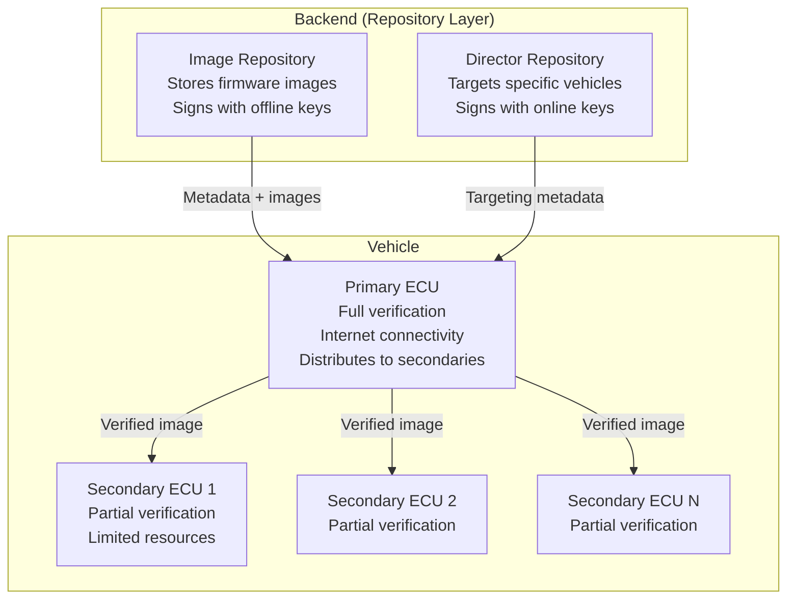
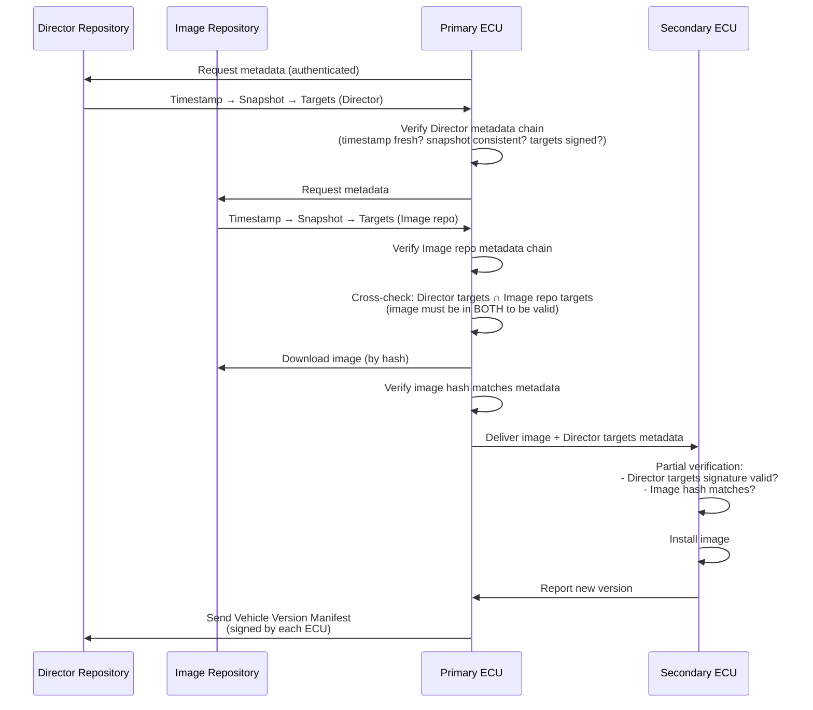
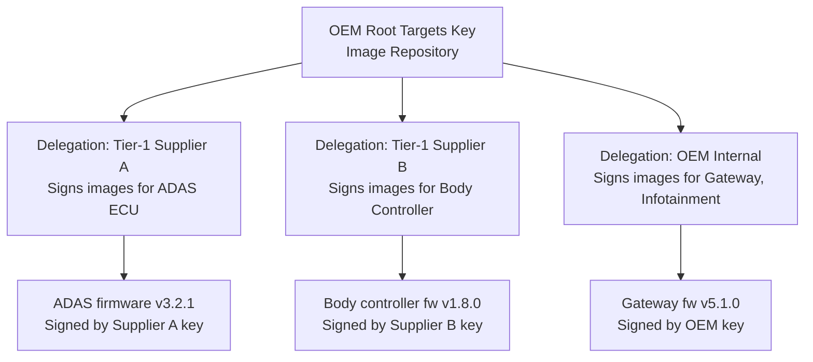
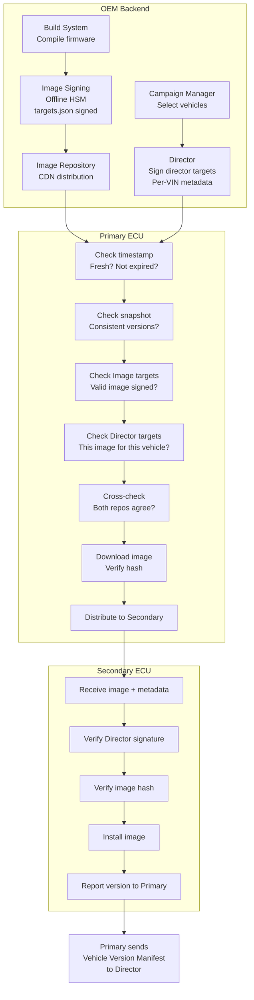
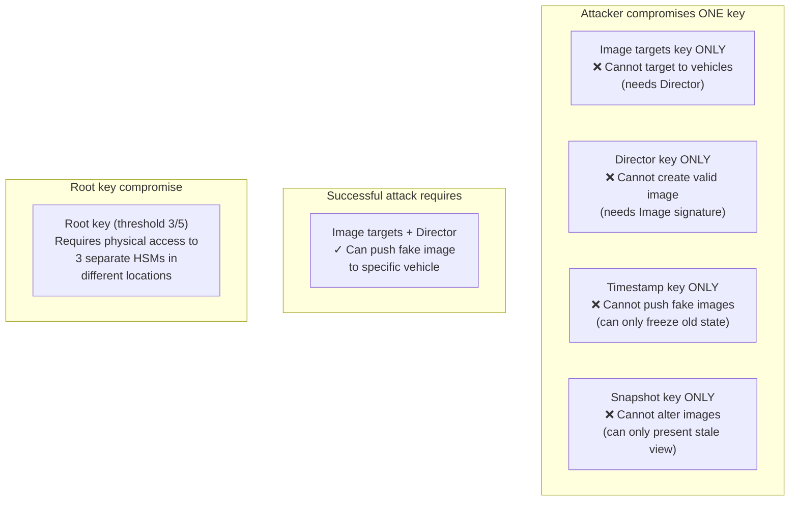

# OTA Security & UPTANE Framework

**Topic:** Secure Over-the-Air (OTA) Update Frameworks for Automotive — UPTANE and TUF  
**Standards:** UPTANE Standard (IEEE-ISTO 6100.1.0.0), TUF (The Update Framework), UNECE R156  
**SDO:** UPTANE Alliance (NYU, UMTRI, SwRI), IEEE-ISTO, Linux Foundation, UNECE  
**Audience:** OTA platform architects, automotive security engineers, embedded software engineers, DevOps teams  
**Prerequisites:** Cryptographic signatures, PKI concepts, embedded update mechanisms, UNECE R156 basics

---

## Chapter 1 — Historical Context & Origin Story

### 1.1 Timeline

| Year | Event | Significance |
|------|-------|-------------|
| 2010 | TUF (The Update Framework) created at NYU | Academic framework for secure software updates |
| 2013 | Automotive OTA research begins (UMTRI + NYU) | Apply TUF principles to vehicle context |
| 2016 | **UPTANE specification 1.0 published** | First automotive-specific secure OTA framework |
| 2017 | DHS (US Dept. Homeland Security) funds UPTANE | Government recognition of importance |
| 2018 | UPTANE adopted by major OEMs/Tier-1s | OTA Express (HERE), Airbiquity, others implement |
| 2019 | IEEE-ISTO 6100.1.0.0 (UPTANE standard) | Formal standardization |
| 2020 | UNECE R156 adopted (references secure update principles) | Regulatory alignment with UPTANE concepts |
| 2021 | TUF becomes CNCF graduated project | Cloud-native adoption (container/package security) |
| 2022 | UPTANE 2.0 development begins | Enhanced for SDV architectures |
| 2023 | Major OEMs confirm UPTANE-based production systems | BMW, GM, others publicly reference UPTANE |

### 1.2 Why UPTANE was Created

**Problem:** Standard software update mechanisms (apt, HTTPS download) fail for automotive because:

| Automotive Challenge | Standard Update Weakness |
|---------------------|--------------------------|
| ECU has no internet connection (via gateway) | Assumes direct connectivity |
| ECU has limited resources (no TLS stack) | Assumes full crypto library |
| Attacker may compromise backend server | Single signing key = single point of failure |
| Vehicle lifetime 15+ years | Key compromise over time inevitable |
| Must update specific ECU in specific vehicle | Generic update mechanism lacks targeting |
| Rollback attack: install old vulnerable version | Standard systems don't prevent rollback |
| Partial compromise: one server hacked | Attacker can push arbitrary update |

---

## Chapter 2 — Standard Architecture & Structure

### 2.1 UPTANE Core Architecture



### 2.2 Key Separation (Compromise Resilience)

| Role | Key Type | Storage | Compromise Impact |
|------|----------|---------|------------------|
| Root | Offline (threshold) | HSM, ceremony | Catastrophic (must be prevented) |
| Targets (Image repo) | Offline | HSM, air-gapped build server | Attacker can sign malicious images |
| Snapshot | Online | Automated signing server | Attacker can freeze updates (prevent new) |
| Timestamp | Online | Automated signing server | Attacker can replay old metadata |
| Director targets | Online | Vehicle management backend | Attacker can target wrong images to vehicles |

**Key insight:** Compromising ANY SINGLE key is insufficient to mount a successful attack. Attacker needs BOTH Image repo key (to sign malicious image) AND Director key (to target it to vehicles).

---

## Chapter 3 — Technical Deep Dive

### 3.1 TUF Roles (Foundation of UPTANE)

| Role | Purpose | Metadata It Signs |
|------|---------|-------------------|
| **Root** | Trust anchor; delegates to other roles | Public keys of all roles; key rotation |
| **Targets** | Specifies valid software images | Hash + size of each image file |
| **Snapshot** | Consistent view of all target metadata | Version numbers of all targets metadata |
| **Timestamp** | Freshness guarantee | Hash of current snapshot metadata |

### 3.2 UPTANE Extensions Beyond TUF

| UPTANE Addition | Purpose |
|----------------|---------|
| Director Repository | Per-vehicle targeting (which ECU gets which image) |
| Primary/Secondary model | Support resource-constrained ECUs |
| Partial verification | Secondary ECUs verify fewer metadata fields |
| Full verification | Primary ECU verifies complete chain |
| Vehicle Version Manifest | ECU reports its current state to backend |
| Custom metadata | Vehicle-specific: VIN, ECU serial, HW revision |
| Delegations | Support multiple image suppliers (Tier-1s) |

### 3.3 Metadata Verification Flow



### 3.4 Attack Resilience Matrix

| Attack | How UPTANE Prevents It |
|--------|----------------------|
| **Arbitrary software** | Image must be signed by Image repo targets key (offline) |
| **Rollback** | Metadata includes version counter; Primary rejects older version |
| **Freeze** | Timestamp metadata expires (short lifetime ~1 day); Primary detects stale |
| **Mix-and-match** | Snapshot metadata ensures consistent versions; can't combine incompatible |
| **Partial compromise (Director)** | Director alone cannot create valid image (needs Image repo signature too) |
| **Partial compromise (Image repo)** | Image repo alone cannot target image to vehicle (needs Director) |
| **Endless data** | Metadata specifies image size; Primary rejects download exceeding declared size |
| **Extraneous dependencies** | Targets metadata explicitly lists only authorized images per ECU |
| **Wrong target** | Director targets specifies exactly which ECU should receive which image |

### 3.5 Delegations (Multi-Supplier Support)



**Benefit:** Tier-1 suppliers can sign their own firmware with their own keys. OEM delegates trust. If Supplier A's key is compromised, only ADAS images are at risk — other ECUs unaffected.

---

## Chapter 4 — Implementation Guide

### 4.1 Backend Implementation

| Component | Implementation | Technology |
|-----------|---------------|-----------|
| Image Repository | Air-gapped signing server + CDN for image distribution | HSM + S3/CDN |
| Director Repository | Online server per vehicle fleet | Microservices + DB |
| Timestamp service | Automated signing every ~1 hour | Cron + HSM |
| Snapshot service | Triggered on any targets metadata change | Event-driven + HSM |
| Root key ceremony | Offline, multi-party, threshold signing | HSM + ceremony room |
| Delegation management | UI/API for adding/revoking Tier-1 signing keys | Admin portal |

### 4.2 Primary ECU Implementation

| Function | Requirement |
|----------|-------------|
| Full verification | Verify all 4 TUF roles + Director + Image repo cross-check |
| Key storage | Root CA trust anchor in secure storage (OTP/HSM) |
| Metadata cache | Store latest valid metadata for freshness comparison |
| Image download | HTTPS to Image repo CDN, resume capable |
| Image distribution | Forward images to secondaries (CAN/Ethernet/SPI) |
| Version manifest | Collect versions from all ECUs, sign, upload to Director |
| Rollback counter | Monotonic counter (hardware-backed) for anti-rollback |

### 4.3 Secondary ECU Implementation (Resource-Constrained)

| Function | Minimal Requirement |
|----------|-------------------|
| Partial verification | Verify Director targets signature + image hash |
| Key storage | Director targets public key (ROM or OTP fuse) |
| Image reception | Receive image from Primary (bus-specific protocol) |
| Hash verification | SHA-256 of received image vs. metadata |
| Installation | Flash image to non-active partition |
| Version reporting | Report current version to Primary |

### 4.4 Key Management

| Key | Ceremony | Rotation Frequency | Compromise Recovery |
|-----|----------|-------------------|-------------------|
| Root | 3-of-5 threshold, offline, multi-site | Every 2-3 years | Revoke/rotate with remaining threshold |
| Image targets | Offline, build-system integrated | Yearly or on compromise | Re-sign all images with new key |
| Snapshot | Online, automated | Yearly | Revoke, vehicles fetch new key via root |
| Timestamp | Online, automated | Yearly | Revoke, short expiry limits exposure |
| Director targets | Online, automated | Yearly | Revoke, vehicles re-verify via Image repo |

---

## Chapter 5 — Certification & Audit

### 5.1 UPTANE Compliance for R156

| R156 Requirement | UPTANE Feature Addressing It |
|-----------------|-------------------------------|
| Update integrity | Cryptographic signatures on all images + metadata |
| Update authenticity | Multi-key signing (Image repo + Director) |
| Rollback prevention | Version counters in metadata, anti-rollback verification |
| Failed update recovery | Primary/Secondary model supports partial failure recovery |
| Targeting accuracy | Director metadata specifies exact ECU/VIN targeting |
| Audit trail | Vehicle Version Manifest provides verifiable state history |
| Supply chain security | Delegations allow per-supplier key management |

### 5.2 Conformance Testing

| Test Category | What is Verified |
|---------------|-----------------|
| Metadata verification | Primary correctly validates all metadata chains |
| Cross-repository check | Image must pass BOTH Director + Image repo validation |
| Rollback rejection | Vehicle refuses older version metadata/images |
| Freeze detection | Vehicle detects expired timestamp and alerts |
| Partial compromise | Verify that single-key compromise is insufficient |
| Secondary verification | Secondaries correctly verify Director targets + hash |
| Recovery scenarios | Vehicle handles network failure, power loss during update |

---

## Chapter 6 — Regional & Domain Variants

| Context | UPTANE Application |
|---------|-------------------|
| Passenger vehicles (OEM OTA) | Primary use case — full UPTANE architecture |
| Commercial vehicles (trucks) | Extended: workshop update + OTA hybrid |
| Motorcycles/scooters | Lightweight: single-ECU mode (Primary-only) |
| Aftermarket devices | Simplified UPTANE for aftermarket telematics |
| Fleet management | Director per fleet operator (managed vehicles) |
| Agricultural/construction | UPTANE adapted for off-highway (intermittent connectivity) |
| EU C-Roads RSU | UPTANE for RSU firmware management |

---

## Chapter 7 — Comparison: UPTANE vs. Other Update Frameworks

| Feature | UPTANE | TUF | Simple HTTPS+signing | A/B + Code signing |
|---------|--------|-----|---------------------|-------------------|
| Automotive-specific | Yes | No (general) | No | No |
| Multi-key security | Yes (5+ roles) | Yes (4 roles) | Single key | Single key |
| Compromise resilience | High (need multiple keys) | High | Low (1 key = game over) | Low |
| Rollback protection | Yes (version counters) | Yes | Often missing | Sometimes |
| Freeze detection | Yes (timestamp expiry) | Yes | No | No |
| Per-vehicle targeting | Yes (Director) | No | Varies | No |
| Resource-constrained ECU | Yes (Secondary/partial) | No | No | Sometimes |
| Supply chain (delegations) | Yes | Yes | No | No |
| R156 alignment | Designed for it | Partial | Partial | Partial |
| Industry adoption | Growing (OEMs, Tier-1s) | High (Linux, Python, containers) | Common (legacy) | Common (mobile) |

---

## Chapter 8 — Mermaid Architecture Diagrams

### 8.1 Full UPTANE Update Flow



### 8.2 Compromise Resilience Model



---

## Chapter 9 — Case Studies & Failure Analysis

### 9.1 Case Study: UPTANE Deployment at Major OEM

**Scenario:** Global OEM with 5 million connected vehicles deploys UPTANE-based OTA system.

**Architecture:**
- Image Repository: air-gapped signing room at HQ (Root key ceremony), CDN (Cloudflare) for distribution
- Director Repository: AWS-hosted, per-vehicle targeting database
- Primary ECU: Head unit (Linux-based) with HSM
- Secondary ECUs: 30+ per vehicle (ADAS, powertrain, body, chassis — all via CAN/Ethernet from Primary)

**Key decisions:**
- Root key: 3-of-5 threshold, keys stored in 5 HSMs across 3 countries
- Timestamp renewal: every 2 hours (aggressive to limit freeze window)
- Pseudonym rotation: 1 week pseudonym certs for Vehicle Version Manifest
- Delegation: 4 Tier-1 suppliers have delegated signing authority for their ECU images

**Results:** 
- 2.1 million OTA campaigns executed (2022-2024)
- 0 security incidents (no unauthorized image installed)
- 3 freeze detection alerts (DNS infrastructure issue prevented timestamp fetch → vehicles correctly alerted operators)

### 9.2 Failure Analysis: OTA Without UPTANE

**Scenario:** Tier-1 supplier uses simple HTTPS + single code signing key for ECU updates (pre-UPTANE era).

**Attack:** Attacker compromises build server, obtains signing key. Signs malicious firmware. Pushes via HTTPS to all connected vehicles.

**Result:** All vehicles in fleet receive and install compromised firmware (no Director targeting, no cross-repository check). Discovery takes 2 weeks. Recall required.

**UPTANE would have prevented:** (1) Build server compromise = only Image key compromised. Without Director key, cannot target to vehicles. (2) Even if Director also compromised, root metadata rotation would limit exposure. (3) Version manifest allows detection of unexpected firmware versions across fleet.

---

## Chapter 10 — Future Evolution & Industry Trends

| Trend | Impact on UPTANE/OTA Security |
|-------|------------------------------|
| UPTANE 2.0 specification | SDV support, cloud-native, container-based ECU updates |
| Post-quantum signatures | Larger signatures in metadata; need format update |
| Continuous deployment (CI/CD for vehicles) | More frequent updates → higher Director throughput needed |
| Feature-on-demand (FoD) | Activation keys as a form of "update" — new use case |
| Container-based ECU software | Docker/OCI image signing (Notation, cosign) integration |
| Multi-tenant platforms | Shared compute, multiple software providers → delegation critical |
| Blockchain audit trail | Immutable record of all updates per VIN (forensics/compliance) |
| Edge computing for update distribution | V2V and RSU-based distribution for bandwidth efficiency |

---

## Chapter 11 — Interview Questions & Career Guide

### Tier 1: Entry-Level (0-3 years)

**Q1:** What is UPTANE and why is it more secure than simple code signing for automotive OTA?  
**A:** UPTANE is a security framework specifically designed for automotive over-the-air software updates. It extends TUF (The Update Framework) with automotive-specific features. **Why more secure than simple code signing:** (1) **Multi-key architecture:** Simple code signing uses ONE key — if compromised, attacker can sign any malicious image. UPTANE uses 5+ keys with different roles (Root, Targets, Snapshot, Timestamp, Director). Compromising a single key is insufficient for a successful attack. (2) **Dual-repository verification:** An image must be authorized by BOTH the Image Repository (signs the image itself) AND the Director Repository (targets it to a specific vehicle). Need both to succeed. (3) **Rollback prevention:** Metadata includes version counters. Vehicle rejects attempts to install older (vulnerable) versions. (4) **Freeze detection:** Timestamp metadata expires quickly (~hours). If attacker prevents update delivery, vehicle detects stale state. (5) **Per-vehicle targeting:** Director specifies exactly which vehicle/ECU gets which image — prevents broad fleet-wide attacks.

### Tier 2: Mid-Level (3-8 years)

**Q2:** Explain the Primary/Secondary architecture in UPTANE. How does a resource-constrained ECU (Secondary) that cannot perform full TUF verification still achieve security?  
**A:** **Primary ECU:** A powerful ECU (typically head unit or gateway) with internet connectivity and full crypto capability. It performs FULL verification: validates all metadata (Root → Timestamp → Snapshot → Targets from both Image and Director repos), cross-checks both repositories agree, downloads images, and distributes to Secondaries. **Secondary ECU:** A constrained ECU (e.g., 32-bit MCU, no network stack) that performs PARTIAL verification: (1) Receives image + Director targets metadata from Primary. (2) Verifies Director targets signature (has Director public key in ROM). (3) Verifies image hash matches what Director metadata says. (4) Trusts that Primary already validated the full chain. **Security guarantee:** Even with partial verification, Secondary is protected against: arbitrary image installation (hash must match), targeting errors (Director metadata specifies this ECU), and unauthorized sources (Director signature required). **What Secondary trusts:** Primary's full verification filtered out invalid/unauthorized images before forwarding.

### Tier 3: Senior/Staff (8-15 years)

**Q3:** Design a key ceremony and rotation strategy for an UPTANE deployment across 10 million vehicles with 20-year vehicle lifetime. How do you handle root key rotation when some vehicles may be offline for months?

---

## Chapter 12 — Cheat Sheet & Quick Reference

### UPTANE Quick Reference

```
UPTANE:           Secure OTA framework for automotive (extends TUF)
Standard:         IEEE-ISTO 6100.1.0.0 (2019)
Origin:           NYU + UMTRI + SwRI (US government funded)
Key principle:    Multi-key compromise resilience — no single point of failure

REPOSITORIES:
  Image Repository:    Signs firmware images (OFFLINE keys, high security)
  Director Repository: Targets specific vehicles (ONLINE keys, per-vehicle)

VEHICLE ROLES:
  Primary ECU:    Full verification, internet connectivity, distributes to secondaries
  Secondary ECU:  Partial verification, receives from Primary

TUF METADATA ROLES:
  Root:       Trust anchor (threshold signing, offline)
  Targets:    Authorized images (hash, size, version)
  Snapshot:   Consistent metadata versions (prevents mix-and-match)
  Timestamp:  Freshness (short expiry, prevents freeze)
```

### UPTANE Attack Prevention Summary

```
Attack type → UPTANE prevention:
  Arbitrary image      → Must be signed by Image repo offline key
  Rollback             → Version counter in metadata (monotonic)
  Freeze               → Timestamp expires (~hours), detected by Primary
  Mix-and-match        → Snapshot ensures consistent version set
  Wrong target         → Director specifies exact ECU/VIN
  Single key compromise → Need multiple keys (Image + Director minimum)
  Endless data         → Metadata declares expected size, reject if exceeded
```

---

*End of Document — 08_OTA_Security_UPTANE.md*
