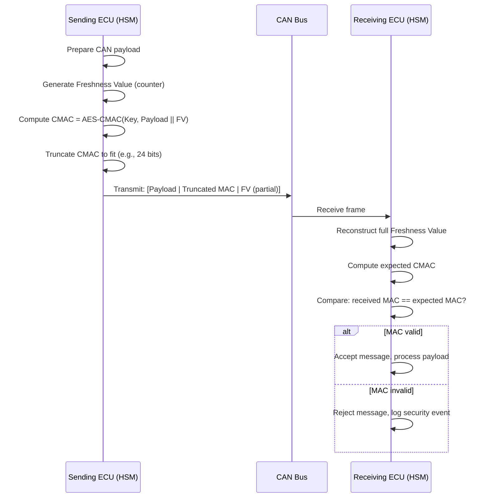
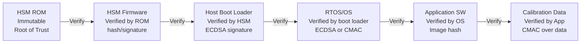
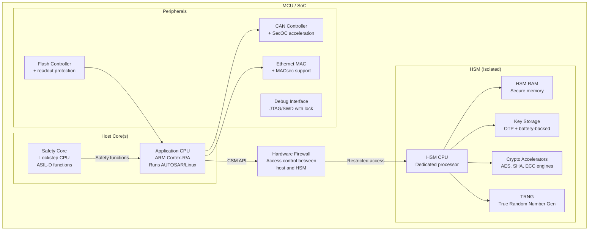
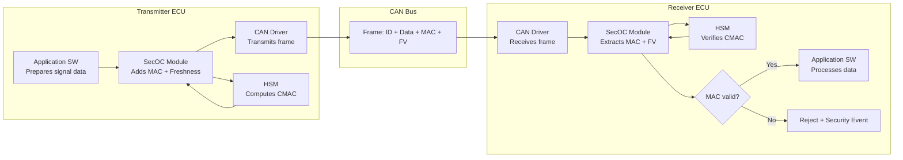

# Secure ECU Design

**Topic:** Secure Electronic Control Unit Architecture and Hardware/Software Security Design  
**Standards:** SAE J3101, ISO/SAE 21434, AUTOSAR SecOC, EVITA, SHE/SHE+, ISO 11452  
**SDO:** SAE, ISO, AUTOSAR, EVITA Consortium, HIS (Hersteller Initiative Software)  
**Audience:** ECU hardware designers, embedded security architects, firmware engineers, Tier-1 product owners  
**Prerequisites:** Microcontroller architecture, embedded systems programming, cryptographic primitives, automotive E/E basics

---

## Chapter 1 — Historical Context & Origin Story

### 1.1 Evolution of ECU Security

| Year | Development | Impact |
|------|-------------|--------|
| 2000s | ECUs designed with zero security (cost-optimized) | No authentication, no encryption, open debug ports |
| 2008 | EVITA project defines HSM requirements for automotive | First formal security hardware specification |
| 2009 | SHE (Secure Hardware Extension) specification by HIS | Minimum security module for automotive MCUs |
| 2012 | SHE+ (extended SHE) specification | Enhanced key management, larger key count |
| 2015 | Jeep Cherokee attack demonstrates ECU vulnerability | Lack of secure boot, no CAN authentication |
| 2016 | SAE J3101: Hardware Protected Security Environments | Formal SAE standard for ECU security hardware |
| 2017 | AUTOSAR SecOC (Secure On-board Communication) | Standardized CAN message authentication |
| 2018 | Automotive-grade HSMs in production (Infineon AURIX, NXP S32) | Hardware security widely available |
| 2021 | ISO/SAE 21434 requires security by design | Standard mandates secure ECU development |
| 2023 | Integrated HSM standard in all new automotive SoCs | HSM becomes baseline, not optional |

### 1.2 Why ECUs Were Historically Insecure

| Cost Pressure | Security Trade-off |
|--------------|-------------------|
| $0.01 counts in high-volume (millions) | No dedicated security silicon |
| 8/16-bit MCUs (limited resources) | No room for crypto libraries |
| Time-to-market (18-month development) | Security adds validation time |
| Isolated networks (no internet) | "Security through obscurity" |
| No regulatory requirement | No business incentive |
| 15-year lifetime designs | Conservative: proven designs only |

---

## Chapter 2 — Standard Architecture & Structure

### 2.1 Secure ECU Architecture Layers

```mermaid
graph TB
    subgraph "Hardware Security Layer"
        A[HSM / Secure Element<br/>Key storage, crypto acceleration,<br/>secure boot ROM, tamper detection]
        B[Secure Boot Hardware<br/>ROM boot loader, OTP fuses,<br/>immutable root of trust]
        C[Debug Protection<br/>JTAG disable/lock,<br/>authenticated debug]
    end
    
    subgraph "Firmware Security Layer"
        D[Secure Boot Chain<br/>ROM → Boot loader → OS → Application<br/>Each stage verified]
        E[Secure Communication<br/>SecOC (CAN), TLS (Ethernet),<br/>MACsec (Ethernet L2)]
        F[Secure Storage<br/>Encrypted NVM,<br/>authenticated calibration data]
    end
    
    subgraph "Application Security Layer"
        G[Access Control<br/>Role-based diagnostic access,<br/>security access levels]
        H[Runtime Protection<br/>MPU/MMU isolation,<br/>stack protection, ASLR]
        I[Update Security<br/>Authenticated firmware update,<br/>anti-rollback]
    end
    
    A --> D --> G
    B --> D
    C --> G
    A --> E
    A --> F
    D --> H
    D --> I
```

### 2.2 SAE J3101 Security Environment Types

| Type | Description | Example Hardware |
|------|-------------|-----------------|
| Type 1 | Integrated security module (within MCU) | SHE module in Infineon AURIX |
| Type 2 | Dedicated security co-processor (on-chip) | HSM in NXP S32K3 |
| Type 3 | External secure element (separate chip) | NXP SE050, Infineon OPTIGA |
| Type 4 | Full Hardware Security Module (external) | Utimaco CryptoServer (high-end) |

---

## Chapter 3 — Technical Deep Dive

### 3.1 SHE (Secure Hardware Extension) Specification

| Feature | SHE Specification |
|---------|------------------|
| Key slots | 10 symmetric keys (AES-128) + 1 Master ECU Key + 1 Boot MAC Key |
| Algorithm | AES-128 (ECB, CBC, CMAC) |
| Secure boot | MAC-based (BOOT_MAC_KEY verifies firmware image) |
| Key management | Authenticated key update (M1-M5 protocol) |
| Random number | TRNG (True Random Number Generator) |
| Monotonic counter | Anti-replay for key updates |
| Debug protection | Key-based JTAG unlock |
| UID | Unique device identifier (fused at manufacturing) |

### 3.2 HSM (Hardware Security Module) — Automotive Grade

| Feature | Automotive HSM (e.g., AURIX HSM, S32K HSM) |
|---------|---------------------------------------------|
| Algorithms | AES-128/256, SHA-256/384/512, ECDSA P-256, RSA-2048, CMAC, HMAC |
| Key storage | 100-500+ keys, protected by tamper-resistant hardware |
| Secure boot | Multi-stage: HSM ROM → HSM firmware → Host boot → Application |
| Isolation | Separate CPU core, separate memory, hardware firewall |
| Performance | AES: >1 Gbps; ECDSA sign: <5ms; ECDSA verify: <10ms |
| Certification | CC EAL4+ or EVITA Medium/Full |
| Firmware update | Authenticated HSM firmware update (independent of host) |
| Side-channel resistance | DPA/SPA countermeasures (masking, shuffling) |

### 3.3 AUTOSAR SecOC (Secure On-board Communication)



**SecOC Key Parameters:**

| Parameter | Typical Value | Trade-off |
|-----------|--------------|-----------|
| MAC length (truncated) | 24-64 bits | Shorter = more payload space; longer = better security |
| Freshness counter length | 4-8 bits in message + synced counter | Shorter = less overhead; needs sync mechanism |
| Key length | AES-128 (128 bits) | Standard for automotive |
| Messages per key | Lifecycle or rotation policy | Long-lived keys vs. rotation complexity |

### 3.4 Secure Boot Chain



### 3.5 Anti-Tampering and Debug Protection

| Protection | Mechanism | Purpose |
|------------|-----------|---------|
| JTAG disable (permanent) | OTP fuse blown at end-of-line | Prevent debug access in production |
| JTAG authenticated access | Password/certificate-based unlock | Allow authorized debug only |
| Readback protection | Flash readout disabled | Prevent firmware extraction |
| Voltage glitch detection | Analog monitors | Detect fault injection attacks |
| Clock glitch detection | PLL monitoring | Detect frequency manipulation |
| Temperature monitoring | Out-of-range → reset | Detect thermal attacks |
| Memory encryption | AES-encrypted external flash | Protect code at rest |

---

## Chapter 4 — Implementation Guide

### 4.1 Secure ECU Development Workflow

| Phase | Security Activities |
|-------|-------------------|
| Requirements | Define security requirements from TARA/CAL |
| Architecture | Select HSM type, define trust boundaries, specify SecOC parameters |
| Hardware design | Integrate HSM, route secure boot, physical anti-tamper |
| Software design | Crypto abstraction layer, secure storage API, SecOC integration |
| Implementation | Secure coding (MISRA, CERT C), crypto library integration |
| Verification | Security testing (fuzz, pentest, side-channel evaluation) |
| Production | Key injection, fuse programming, certificate provisioning |
| Field | Secure OTA update, monitoring, incident response |

### 4.2 Key Provisioning at Manufacturing

| Step | Activity | Security Control |
|------|----------|-----------------|
| 1 | Chip arrives from semiconductor (unique ID fused) | Tamper-evident packaging |
| 2 | ECU assembly at Tier-1 | Secure production environment |
| 3 | HSM firmware loaded (first boot) | Factory authentication |
| 4 | Master ECU Key injected | HSM Key Injection Machine (secured room) |
| 5 | Derived keys generated in HSM | From master key + derivation parameters |
| 6 | Certificates installed (if PKI-based) | Certificate from OEM PKI |
| 7 | Debug port locked (fuses blown) | Permanent disable or authenticated |
| 8 | Secure boot activated | Verify boot integrity |
| 9 | End-of-line security test | Confirm all security features active |

### 4.3 Crypto Abstraction (AUTOSAR Crypto Stack)

```
Application Layer
    ↓ CSM (Crypto Service Manager) — request interface
    ↓ CryIf (Crypto Interface) — routing to driver
    ↓ Crypto Driver (HSM driver or SW implementation)
    ↓ HSM Hardware
```

| AUTOSAR Module | Function |
|---------------|----------|
| CSM (Crypto Service Manager) | Application-facing API (encrypt, sign, verify, hash) |
| CryIf (Crypto Interface) | Routes crypto requests to appropriate driver |
| Cry (Crypto Driver) | Hardware abstraction for HSM |
| KeyM (Key Manager) | Certificate handling, key storage management |
| SecOC | Secure on-board communication (MAC generation/verification) |
| IdsM (IDS Manager) | Security event reporting |

---

## Chapter 5 — Certification & Audit

### 5.1 Security Evaluation of ECU Hardware

| Standard | Level | What it Covers |
|----------|-------|---------------|
| Common Criteria (ISO 15408) | EAL4+ | Security IC evaluation (ST, TOE) |
| EVITA | Light/Medium/Full | Automotive security module profiles |
| FIPS 140-3 (if required) | Level 2-3 | Cryptographic module validation |
| ISO/SAE 21434 + R155 | CAL 1-4 | Process compliance + security evidence |

### 5.2 EVITA Security Levels

| EVITA Level | Target | Key Features |
|-------------|--------|-------------|
| Light | Body/comfort ECUs | Symmetric crypto (AES), secure boot, basic tamper |
| Medium | Powertrain, chassis | Asymmetric crypto (ECC), HSM isolation, advanced tamper |
| Full | Gateway, telematics, ADAS | Full HSM, all crypto, multi-app isolation, high certification |

### 5.3 Type Approval Evidence for Secure ECU

| Evidence | What it Demonstrates |
|----------|---------------------|
| Security architecture document | Defense-in-depth design per CAL requirements |
| HSM certification (CC/EVITA) | Hardware meets security strength claims |
| Secure boot evidence | Boot chain integrity from ROM to application |
| SecOC implementation evidence | CAN message authentication operational |
| Penetration test report | ECU tested against TARA attack paths |
| Key management documentation | Keys provisioned, stored, rotated securely |
| Debug protection evidence | Production ECUs have locked debug interfaces |

---

## Chapter 6 — Regional & Domain Variants

| Domain | ECU Security Focus |
|--------|-------------------|
| ADAS/Autonomous | Highest security (CAL 3-4): HSM, secure boot, authenticated sensor data |
| Powertrain | High security (CAL 2-3): SecOC, secure calibration, emission compliance |
| Infotainment | Medium-high (CAL 2-3): Linux hardening, app sandboxing, DRM |
| Body/comfort | Medium (CAL 1-2): Basic SecOC, secure boot |
| Charging (EV) | High (ISO 15118 PnC): Certificate management, secure communication |
| V2X (OBU) | Very high: SCMS credential management, high-speed signing |

---

## Chapter 7 — Comparison: ECU Security Solutions

| Feature | SHE | SHE+ | Integrated HSM | External SE | Full HSM |
|---------|-----|------|----------------|------------|----------|
| Key count | 10 | 20+ | 100-500 | 50-200 | Unlimited |
| Algorithms | AES-128 only | AES-128 | AES + ECC + SHA + RSA | AES + ECC | All |
| Isolation | Minimal | Moderate | Separate core + memory | Separate chip | Separate device |
| Performance | Low | Medium | High | Medium | Very high |
| Cost | ~$0.10 | ~$0.30 | ~$1-3 (in SoC) | ~$1-5 (chip) | ~$100+ |
| Certification | None formal | None formal | CC EAL4+ / EVITA | CC EAL5-6 | FIPS 140-3 L3 |
| Use case | Legacy body ECUs | Mid-range ECUs | ADAS, gateway, domain ctrl | IoT, payment | Enterprise/V2X backend |

---

## Chapter 8 — Mermaid Architecture Diagrams

### 8.1 Complete Secure ECU Block Diagram



### 8.2 SecOC Message Flow (CAN)



---

## Chapter 9 — Case Studies & Failure Analysis

### 9.1 Case Study: Securing a Legacy CAN ECU (Retrofit)

**Scenario:** Brake ECU (ASIL D, CAN-only, existing design from 2018) needs SecOC added for R155 compliance. No hardware change allowed (cost/safety requalification).

**Challenge:** MCU has SHE module (AES-128 only, 10 key slots) but no crypto co-processor. Current CPU load: 85%.

**Solution:**
1. Use SHE CMAC capability for SecOC (AES-128-CMAC)
2. Protect top 8 safety-critical message IDs (not all 50+ messages)
3. Truncate MAC to 24 bits (fits in existing CAN frame padding)
4. Freshness: 4-bit counter in message + synchronized 28-bit counter locally
5. CPU impact: ~3% additional (SHE hardware does crypto)
6. Key management: master key derived keys, provisioned via SHE key update protocol

**Result:** SecOC operational for critical messages. Meets CAL 2 requirement. No hardware redesign needed. Production SOP maintained.

### 9.2 Failure Analysis: Debug Port Left Open

**Scenario:** Production ECU shipped with JTAG port unlocked (fuse not blown due to production process error). Researcher extracts firmware, finds encryption keys in plaintext.

**Root cause:** End-of-line tester checks secure boot but does NOT verify JTAG lock status. 5,000 ECUs shipped with open debug port.

**Impact:** Firmware reverse-engineered. Proprietary algorithms extracted. Keys extracted → could authenticate as legitimate ECU.

**Fix:** (1) Add JTAG lock verification to end-of-line test. (2) Store keys in HSM only (never in host flash). (3) Derive per-ECU keys from master + UID (compromising one ECU doesn't compromise fleet). (4) Add production audit: sample testing of debug lock on random units.

---

## Chapter 10 — Future Evolution & Industry Trends

| Trend | Impact on Secure ECU Design |
|-------|---------------------------|
| Centralized compute (SDV) | Fewer ECUs but more powerful; HSM per domain controller |
| RISC-V with integrated security | Open-source ISA with custom security extensions |
| Post-quantum crypto in ECU | PQC algorithms require larger key storage, more RAM |
| Hardware-isolated containers | Multiple SW suppliers on one SoC with hardware isolation |
| Automotive Ethernet MACsec | L2 encryption becomes standard for in-vehicle Ethernet |
| AI accelerators + security | Secure enclave for ML model protection |
| Chiplet architectures | Security IP as chiplet module (reusable across SoCs) |
| ISO 21434 2nd edition | May specify minimum hardware security requirements |

---

## Chapter 11 — Interview Questions & Career Guide

### Tier 1: Entry-Level (0-3 years)

**Q1:** What is SecOC and why is it needed for CAN bus communication?  
**A:** SecOC (Secure On-board Communication) is an AUTOSAR module that adds message authentication to CAN bus frames. **Why needed:** CAN protocol has NO built-in authentication — any device on the bus can send any message ID, and every ECU will accept it. This means an attacker who gains access to the CAN bus (e.g., via compromised infotainment or OBD-II) can inject fake messages to control brakes, steering, etc. **How SecOC works:** (1) Transmitting ECU computes a Message Authentication Code (MAC) using a shared secret key + the message payload + a freshness value (counter). (2) The MAC is truncated (to fit in limited CAN bandwidth) and appended to the message. (3) Receiving ECU recomputes the expected MAC and compares. If mismatch → reject the message. **Result:** Only ECUs with the correct key can send authenticated messages. Injection attacks are detected and rejected.

### Tier 2: Mid-Level (3-8 years)

**Q2:** Compare SHE, integrated HSM, and external secure element for automotive ECU security. When would you choose each?  
**A:** **SHE (Secure Hardware Extension):** Minimum security module. AES-128 only, 10 key slots, basic secure boot. **Choose when:** Legacy/cost-sensitive ECU (body domain), only needs SecOC + secure boot, MCU already has SHE integrated (no additional cost). **Integrated HSM:** Full security co-processor within the MCU die. Supports AES, ECC, SHA, RSA. 100+ keys. Separate core with hardware isolation. **Choose when:** Modern ECU needing comprehensive security (gateway, ADAS domain controller), need asymmetric crypto (TLS, ECDSA for OTA), high-performance crypto (Gbps encryption for Ethernet). **External Secure Element:** Separate security chip on PCB. Often CC EAL5+ certified. **Choose when:** Highest security assurance needed (V2X credential storage), require independent certification (CC evaluation of security module only), or adding security to existing MCU without integrated HSM. **Trade-offs:** SHE: cheapest, lowest capability. Integrated HSM: best performance/integration, moderate cost. External SE: highest certification, adds BOM cost + board space.

### Tier 3: Senior/Staff (8-15 years)

**Q3:** Design the security architecture for a next-generation ADAS domain controller (ASIL D, 200 TOPS AI accelerator, 10 cameras, V2X, 100+ Ethernet connections). What are the key security design decisions and their safety implications?

---

## Chapter 12 — Cheat Sheet & Quick Reference

### Secure ECU Design Checklist

```
HARDWARE:
□ HSM/SE integrated (appropriate level for CAL)
□ Secure boot ROM (immutable root of trust)
□ Debug port protection (locked in production)
□ Anti-tamper (glitch detection, temperature monitoring)
□ True Random Number Generator (TRNG)
□ Monotonic counter (anti-rollback)

FIRMWARE:
□ Secure boot chain (ROM → bootloader → OS → app)
□ SecOC for CAN messages (at minimum safety-critical IDs)
□ TLS/DTLS for Ethernet communication
□ Encrypted storage (keys never in plaintext in flash)
□ AUTOSAR Crypto Stack (CSM, CryIf, Cry driver)
□ Secure firmware update (authenticated, anti-rollback)

PRODUCTION:
□ Key injection in secure environment
□ Debug lock verified at end-of-line
□ Certificate provisioning (if PKI-based)
□ Per-ECU unique keys (not fleet-wide shared keys)
□ UID-based key derivation

OPERATIONS:
□ OTA-updatable security parameters
□ Key rotation capability
□ Security event logging (for IDS)
□ Diagnostic access control (security levels)
```

### Security Technologies per Bus Type

```
CAN/CAN-FD:  SecOC (CMAC, truncated MAC in frame)
Ethernet:    TLS 1.3 / DTLS 1.3 / MACsec (802.1AE)
LIN:         Limited (no standard security; protect at gateway)
FlexRay:     Frame-level MAC (similar to SecOC concept)
SPI/I2C:     Hardware isolation (on-chip only, trusted)
```

---

*End of Document — 09_Secure_ECU_Design.md*
