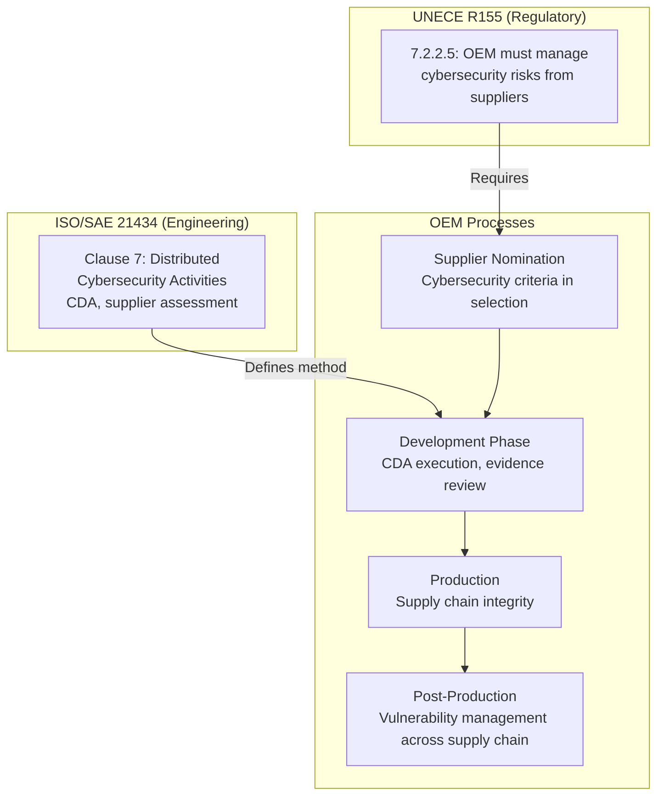
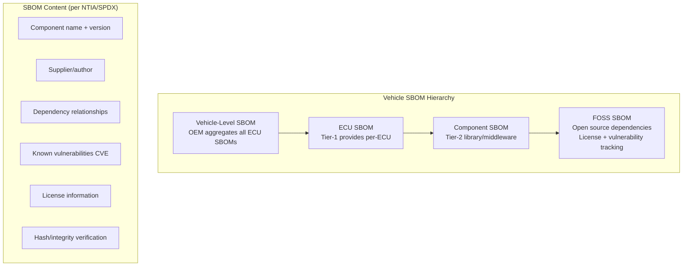
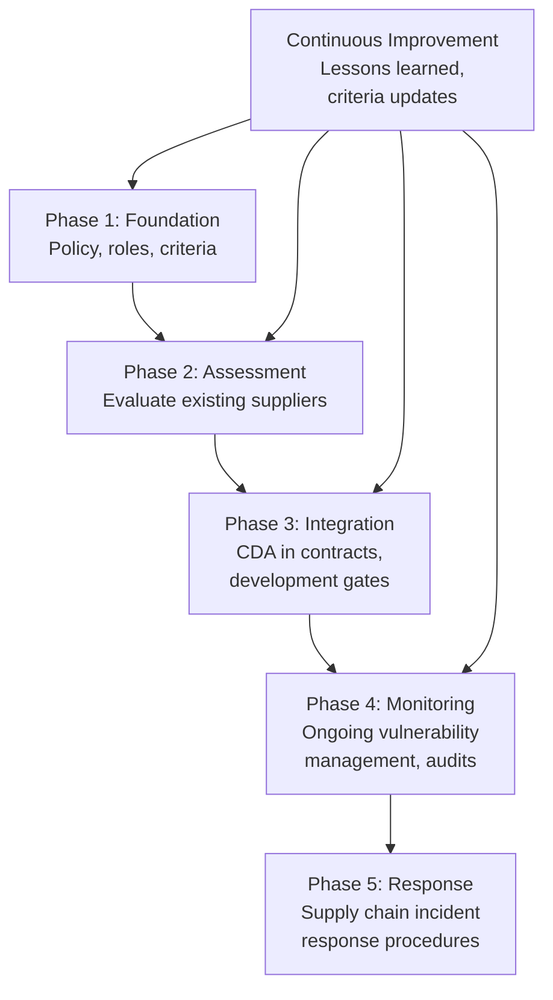
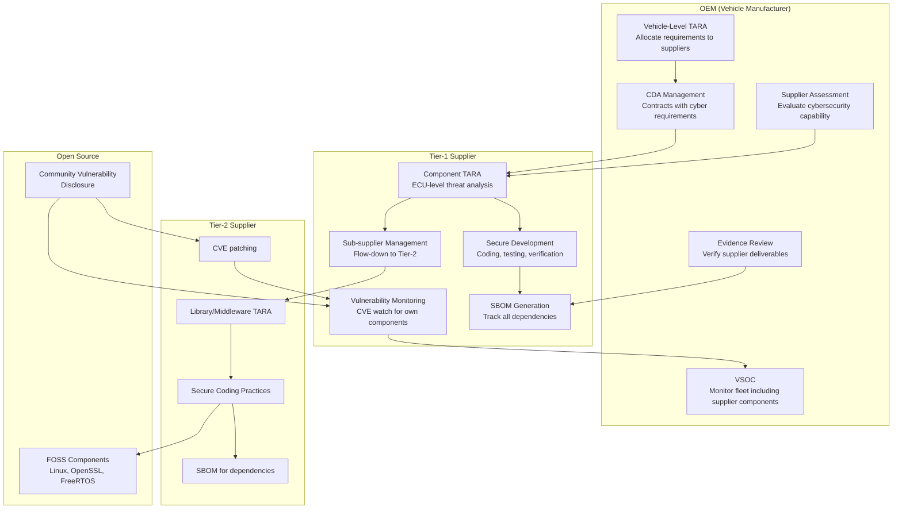
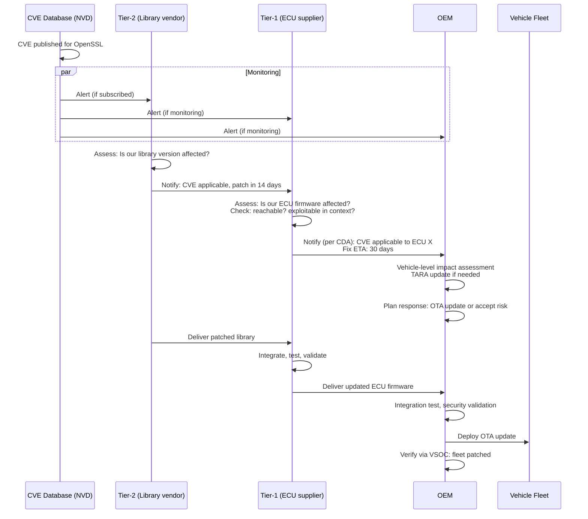

# Vehicle Cybersecurity Supply Chain

**Topic:** Automotive Cybersecurity Supply Chain Management — Standards, Processes, and Risk  
**Standards:** ISO/SAE 21434 Clause 7, UNECE R155 Section 7.2.2.5, NIST CSF Supply Chain, SAE J3061 Annex A  
**SDO:** ISO/SAE, UNECE, NIST, ENISA, AutoISAC  
**Audience:** Supplier quality managers, OEM cybersecurity procurement, Tier-1 security leads, supply chain risk analysts  
**Prerequisites:** ISO/SAE 21434 overview, automotive supply chain structure (OEM → Tier-1 → Tier-2), UNECE R155 basics

---

## Chapter 1 — Historical Context & Origin Story

### 1.1 Why Supply Chain Cybersecurity Matters

| Factor | Automotive Reality |
|--------|-------------------|
| Supply chain depth | OEM → Tier-1 → Tier-2 → Tier-3 → semiconductor/IP vendor |
| Component reuse | Same ECU software used across multiple OEM platforms |
| Software complexity | Modern vehicle: 100M+ LOC from dozens of suppliers |
| Open source | 30-60% of automotive software includes FOSS components |
| Attack surface transfer | Vulnerability in Tier-2 component affects all vehicles using it |
| SolarWinds lesson (2020) | Supply chain attacks are real, sophisticated, scalable |

### 1.2 Timeline

| Year | Event | Impact |
|------|-------|--------|
| 2015 | Jeep Cherokee: Tier-1 telematics unit was entry point | OEM liable for supplier's security gap |
| 2017 | NotPetya: Maersk, Merck affected via supply chain | Industrial supply chain attack awareness |
| 2020 | SolarWinds supply chain compromise | Government + industry wake-up to supply chain attacks |
| 2021 | ISO/SAE 21434 Clause 7: Distributed cybersecurity activities | Formal standard for automotive supply chain security |
| 2021 | Log4Shell (Log4j): affected automotive suppliers | Open source dependency risk in automotive |
| 2022 | UNECE R155: OEM must manage supplier cybersecurity | Regulatory mandate for supply chain security |
| 2023 | EU Cyber Resilience Act (CRA) proposed | Component-level cybersecurity requirements |
| 2024 | SBOM (Software Bill of Materials) requirements mature | Transparency in software supply chain |

---

## Chapter 2 — Standard Architecture & Structure

### 2.1 ISO/SAE 21434 Clause 7 — Distributed Cybersecurity Activities

| Sub-clause | Topic | Content |
|------------|-------|---------|
| 7.1 | General | Principles of distributed cybersecurity |
| 7.2 | Supplier capability | Assessing supplier cybersecurity competence |
| 7.3 | Request for quotation | Cybersecurity requirements in RFQ/RFI |
| 7.4 | Alignment of responsibilities | CDA (Cybersecurity Development Agreement) |
| 7.4.1 | Joint TARA interface | Agreeing on threat analysis responsibilities |
| 7.4.2 | Cybersecurity requirements | Passing CAL and requirements to supplier |
| 7.4.3 | Supplier development evidence | What supplier must demonstrate |

### 2.2 Supply Chain Security in Context



---

## Chapter 3 — Technical Deep Dive

### 3.1 CDA (Cybersecurity Development Agreement)

| CDA Element | Content |
|-------------|---------|
| Scope | Which components/subsystems are covered |
| Cybersecurity requirements | Specific requirements allocated to supplier (from OEM TARA) |
| CAL assignment | Which CAL level applies to supplier's component |
| TARA responsibilities | Who performs TARA for component interfaces (OEM, supplier, shared) |
| Work products | Which ISO 21434 work products supplier must deliver |
| Verification evidence | What security testing supplier must perform and report |
| Vulnerability management | How supplier handles CVEs in their components post-delivery |
| Incident reporting | Supplier must notify OEM of security incidents within X hours |
| Change management | Supplier must notify OEM of security-relevant changes |
| End of support | Supplier's commitment duration + transition plan |
| Audit rights | OEM right to audit supplier's cybersecurity processes |
| Sub-supplier flow-down | Supplier must flow CDA requirements to their suppliers |

### 3.2 Supplier Cybersecurity Assessment

| Assessment Level | When Applied | Depth |
|------------------|-------------|-------|
| Self-assessment questionnaire | Initial screening (all potential suppliers) | 50-100 questions |
| Document review | Shortlisted suppliers | Review CSMS docs, TARA samples |
| Remote assessment | Selected suppliers (before nomination) | 1-2 day remote audit |
| On-site assessment | Critical suppliers (CAL 3-4 components) | 3-5 day on-site audit |
| Continuous monitoring | Active suppliers (production phase) | KPIs, vulnerability tracking, audits |

### 3.3 SBOM (Software Bill of Materials)



| SBOM Format | Standard | Use |
|-------------|----------|-----|
| SPDX | Linux Foundation / ISO 5962 | Industry standard for SBOM exchange |
| CycloneDX | OWASP | Lightweight, security-focused |
| SWID Tags | ISO 19770-2 | Software identification |

### 3.4 Vulnerability Management Across Supply Chain

| Step | Activity | Responsibility |
|------|----------|---------------|
| 1 | Monitor CVE databases (NVD, supplier advisories) | Both OEM and supplier |
| 2 | Match CVE to SBOM (affected components) | Automated tooling |
| 3 | Assess applicability (is vulnerability reachable in our context?) | Supplier (component expertise) |
| 4 | Determine impact (TARA re-assessment if needed) | OEM (vehicle-level context) |
| 5 | Develop fix (patch, workaround, mitigation) | Supplier (provides update) |
| 6 | Validate fix (testing, regression) | Both (supplier unit, OEM integration) |
| 7 | Deploy fix (OTA or recall) | OEM (vehicle-level decision) |
| 8 | Verify fleet-wide (monitoring) | OEM (VSOC) |

### 3.5 Supply Chain Attack Vectors

| Attack Vector | Description | Example |
|---------------|-------------|---------|
| Compromised build system | Attacker injects malicious code during supplier's build | SolarWinds-style attack on ECU firmware |
| Malicious dependency | Poisoned open-source package pulled into supplier's code | Typosquatting npm/Maven packages |
| Insider threat | Malicious supplier employee inserts backdoor | Intentional vulnerability in safety-critical code |
| Counterfeit components | Fake hardware with modified functionality | Counterfeit MCU with added transmitter |
| IP theft leading to targeted attack | Stolen design docs reveal exploitable details | Firmware reverse-engineering from leaked source |
| Compromised update channel | Supplier's OTA infrastructure compromised | Tier-1 OTA server pushing malicious images |
| Key compromise at supplier | Signing keys stolen from Tier-1 | Unauthorized firmware signed with legitimate key |

---

## Chapter 4 — Implementation Guide

### 4.1 Supply Chain Cybersecurity Program



### 4.2 OEM Cybersecurity Requirements in RFQ

| Category | Requirements to Include |
|----------|----------------------|
| Process | Must have documented CSMS (ISO 21434 or equivalent) |
| Competence | Named cybersecurity responsible + trained team |
| TARA | Must perform component-level TARA per OEM methodology |
| Development | Secure coding practices (MISRA, CERT C), static analysis, code review |
| Testing | Fuzz testing, penetration testing, vulnerability scanning |
| SBOM | Deliver SBOM (SPDX format) with every software delivery |
| Vulnerability management | SLA for CVE assessment (e.g., critical: 24h, high: 72h) |
| Incident reporting | Notify OEM within 24h of security incident |
| Evidence | Deliver work products per ISO 21434 Clause 10 (based on CAL) |
| Audit | Accept OEM audit right (1x/year minimum) |

### 4.3 Supplier Cybersecurity KPIs

| KPI | Target | Measurement |
|-----|--------|-------------|
| CVE response time (critical) | ≤24 hours for initial assessment | Time from CVE publication to applicability determination |
| CVE fix delivery time (critical) | ≤30 days for patch | Time from confirmed applicable to patch delivery |
| SBOM accuracy | >99% (no undeclared components) | Audit against actual binary |
| Security test coverage | 100% of TARA-identified attack surfaces | Mapping: attack surface → test evidence |
| Security finding closure rate | >95% within agreed timeline | Open findings / total findings |
| Incident notification time | <24 hours | Time from detection to OEM notification |
| CDA work product delivery | On time at each milestone | Milestone vs. delivery tracking |

---

## Chapter 5 — Certification & Audit

### 5.1 Supplier Assessment Frameworks

| Framework | Scope | Automotive-specific? |
|-----------|-------|---------------------|
| ISO/SAE 21434 Clause 7 assessment | Cybersecurity development process | Yes |
| TISAX (Trusted Information Security Assessment Exchange) | Information security (VDA) | Yes (automotive) |
| ISO 27001 | Information Security Management System | No (generic) |
| SOC 2 Type II | Service organization controls | No (generic) |
| IEC 62443-2-4 | Security for industrial component suppliers | Partially relevant |
| NIST CSF (Cybersecurity Framework) | Risk management framework | No (generic) |

### 5.2 Type Approval Evidence: Supply Chain

| Evidence for Approval Authority | What it Demonstrates |
|--------------------------------|---------------------|
| CDA signed with all relevant suppliers | Cybersecurity responsibilities allocated |
| Supplier assessment records | Supplier competence verified |
| Supplier work products received | TARA, test reports, SBOM delivered |
| Vulnerability management records | CVEs tracked and addressed across supply chain |
| Sub-supplier flow-down evidence | Requirements cascade to lower tiers |

---

## Chapter 6 — Regional & Domain Variants

| Region/Standard | Supply Chain Cybersecurity Approach |
|----------------|----------------------------------|
| EU (R155 + ISO 21434) | CDA-based, OEM responsible for full chain |
| China (GB/T 40857) | Similar OEM responsibility, government oversight |
| USA (no mandate, NIST CSF) | Best practices; SBOM executive order (EO 14028) |
| Japan (R155 compliance) | CDA approach following ISO 21434 |
| EU Cyber Resilience Act (2024+) | Component-level CE marking for digital products |
| Automotive SPICE | Process assessment (includes security extension) |
| VDA ISA / TISAX | German automotive information security exchange |

---

## Chapter 7 — Comparison: Supply Chain Security Frameworks

| Feature | ISO/SAE 21434 Cl.7 | NIST CSF Supply Chain | IEC 62443-2-4 | EU CRA |
|---------|-------------------|--------------------|---------------|--------|
| Scope | Automotive components | All sectors | Industrial components | Digital products (EU market) |
| Mandatory | Via R155 (UNECE) | Voluntary (US) | Varies by sector | Mandatory (EU, 2025+) |
| Focus | Development process | Risk management | Security in development | Product security + SBOM |
| SBOM | Recommended (growing) | Recommended | Not explicit | Mandatory |
| Vulnerability management | Required | Recommended | Required | Mandatory (coordinated disclosure) |
| Assessment | OEM assesses supplier | Self-assessment encouraged | Third-party possible | Conformity assessment |
| Lifecycle | Development + post-production | Continuous | Development + maintenance | Full product lifecycle |

---

## Chapter 8 — Mermaid Architecture Diagrams

### 8.1 Automotive Supply Chain Security Model



### 8.2 Vulnerability Flow Through Supply Chain



---

## Chapter 9 — Case Studies & Failure Analysis

### 9.1 Case Study: Log4Shell Impact on Automotive Supply Chain (2021)

**Scenario:** Log4j vulnerability (CVE-2021-44228) discovered December 2021. CVSS 10.0. Affected any Java application using Log4j for logging.

**Automotive impact:**
- Tier-1 infotainment supplier: Head unit backend services used Log4j → potentially exploitable via crafted Bluetooth device name or Wi-Fi SSID
- Tier-1 telematics supplier: Cloud backend used Log4j → management portal vulnerable
- OEM development tools: Jenkins, Jira, Confluence instances vulnerable

**Response challenges:**
1. **SBOM gap:** Most Tier-1s didn't have complete SBOM → took 2-3 weeks to determine if Log4j was used
2. **Transitive dependencies:** Log4j pulled in by other libraries (not directly referenced) → missed in initial scan
3. **Notification delay:** Some Tier-2s took >1 week to notify Tier-1s
4. **Fix validation:** Each fix needed full regression testing before deployment

**Lessons learned:**
- SBOM is essential (must include transitive dependencies)
- Vulnerability monitoring must be automated (manual is too slow for 0-day)
- CDA should specify notification SLA (e.g., 24h for CVSS ≥9.0)
- Response playbook needed: what happens when critical CVE affects multiple suppliers simultaneously

### 9.2 Failure Analysis: Counterfeit Component

**Scenario:** Tier-2 semiconductor distributor supplies counterfeit microcontrollers to Tier-1. Counterfeit MCUs have correct pinout and basic function but: (1) Modified firmware in ROM. (2) No functional HSM (security module disabled). (3) Reduced temperature range.

**Discovery:** OEM end-of-line security test fails — secure boot doesn't initialize. Investigation reveals HSM non-functional on 200 ECUs from specific production batch.

**Impact:** (1) No secure boot = firmware integrity not verified. (2) No HSM = no SecOC, no key storage. (3) Temperature range = potential safety failure in extreme conditions.

**Prevention measures:** (1) Authenticated component verification (challenge-response with HSM during incoming inspection). (2) Supply chain integrity program (track and trace from semiconductor fab). (3) Approved distributor list (no grey market purchases). (4) Incoming inspection: sample testing beyond electrical specs.

---

## Chapter 10 — Future Evolution & Industry Trends

| Trend | Impact on Supply Chain Cybersecurity |
|-------|-------------------------------------|
| EU Cyber Resilience Act (CRA) | Component-level CE marking; suppliers directly responsible |
| SBOM mandates (global) | All suppliers must provide machine-readable SBOM |
| VEX (Vulnerability Exploitability eXchange) | Standardized "not affected" declarations for CVEs |
| Software composition analysis (SCA) automation | Real-time dependency vulnerability monitoring |
| Zero-trust supply chain | Verify every component, assume compromise possible |
| Digital supply chain twin | Real-time visibility into supplier security posture |
| AI-generated code in supply chain | New risk: AI hallucinations, training data poisoning |
| Post-quantum migration | Entire supply chain must coordinate crypto transition |
| Consolidated Tier-1 platforms | Fewer but larger platform suppliers → concentration risk |

---

## Chapter 11 — Interview Questions & Career Guide

### Tier 1: Entry-Level (0-3 years)

**Q1:** What is a CDA (Cybersecurity Development Agreement) and what does it contain?  
**A:** A CDA is a contractual agreement between an OEM (or higher-tier customer) and a supplier that defines cybersecurity responsibilities for a specific development project. It is required by ISO/SAE 21434 Clause 7. **Key contents:** (1) **Scope:** Which component/subsystem is covered. (2) **Cybersecurity requirements:** Specific security requirements allocated from OEM's TARA to supplier. (3) **CAL level:** Which Cybersecurity Assurance Level applies (determines rigor of verification). (4) **TARA responsibilities:** Who performs which part of threat analysis (interfaces are often shared). (5) **Work products:** Which ISO 21434 deliverables supplier must provide (e.g., security architecture, test reports, SBOM). (6) **Vulnerability management:** How supplier handles post-delivery CVEs (response time, notification). (7) **Audit rights:** OEM's right to assess supplier's cybersecurity processes. (8) **Sub-supplier flow-down:** Supplier must pass appropriate requirements to their suppliers.

### Tier 2: Mid-Level (3-8 years)

**Q2:** How do you manage a critical CVE (CVSS 9.8) discovered in a Tier-2 open-source library that is used by 3 different Tier-1 suppliers across 5 vehicle platforms?  
**A:** (1) **Immediate (0-24h):** Confirm applicability via SBOM lookup. Notify all 3 Tier-1s simultaneously. Assess: is vulnerability reachable in vehicle context? (Network-accessible? Requires authentication? Safety impact?) (2) **Short-term (24-72h):** Each Tier-1 confirms impact on their ECU. Determine: is there an active exploit? If yes, accelerate response. Assess containment: can vehicle-level controls (firewall, IDS) mitigate until fix available? (3) **Fix development (1-4 weeks):** Tier-2 delivers patched library. Each Tier-1 integrates into their ECU firmware. Each Tier-1 performs regression testing. (4) **OEM integration (1-2 weeks):** Validate updated ECU firmware in vehicle-level test. Security validation (pentest the fix). (5) **Deployment:** R156 RXSWIN check (does fix affect type-approved characteristic?). Deploy via OTA to affected platforms. Monitor via VSOC for exploitation attempts pre-patch. (6) **Lessons learned:** Update SBOM process if gap found. Adjust CDA SLA if notification was slow. Consider alternative to vulnerable library if pattern repeats.

### Tier 3: Senior/Staff (8-15 years)

**Q3:** Design a supply chain cybersecurity program for an OEM with 200+ Tier-1 suppliers and 1,000+ Tier-2/Tier-3 suppliers. How do you scale assessment, monitoring, and incident response?

---

## Chapter 12 — Cheat Sheet & Quick Reference

### Supply Chain Cybersecurity Quick Reference

```
ISO/SAE 21434 Clause 7:    Distributed cybersecurity activities (CDA)
UNECE R155 Section 7.2.2.5: OEM must manage supplier cybersecurity risks
CDA:                        Cybersecurity Development Agreement
SBOM:                       Software Bill of Materials (SPDX/CycloneDX)
VEX:                        Vulnerability Exploitability eXchange
TISAX:                      Trusted Information Security Assessment Exchange (VDA)

CDA ESSENTIALS:
  □ Scope and component boundary
  □ Cybersecurity requirements (from TARA)
  □ CAL assignment
  □ TARA responsibility matrix
  □ Required work products
  □ Vulnerability management SLA
  □ Incident notification timeline
  □ Audit rights
  □ Sub-supplier flow-down

CVE RESPONSE TIMELINE (RECOMMENDED):
  Critical (CVSS ≥9.0):  24h assessment, 30-day fix delivery
  High (CVSS 7.0-8.9):   72h assessment, 60-day fix delivery
  Medium (CVSS 4.0-6.9): 1 week assessment, 90-day fix delivery
  Low (CVSS <4.0):       2 weeks assessment, next release cycle
```

### Supplier Assessment Decision Tree

```
New supplier nomination:
  └── Is component connected (externally accessible)?
       ├── Yes → Full cybersecurity assessment (on-site for CAL 3-4)
       │         CDA mandatory
       │         SBOM mandatory
       │         Ongoing monitoring
       └── No → Is component safety-relevant (ASIL B+)?
                ├── Yes → CDA mandatory (security requirements from TARA)
                │         SBOM recommended
                └── No → Basic self-assessment questionnaire
                          Standard procurement terms
```

---

*End of Document — 10_Vehicle_Cyber_Supply_Chain.md*
