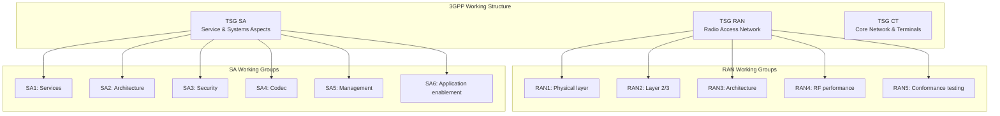
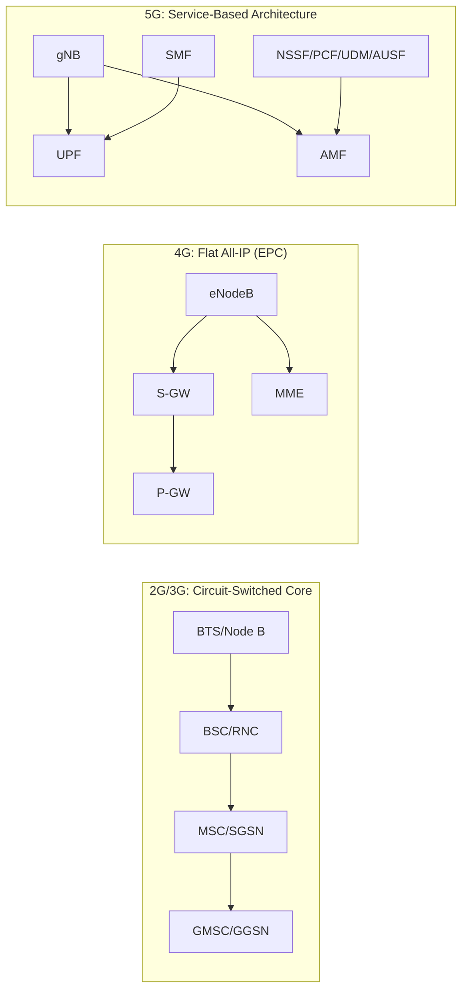
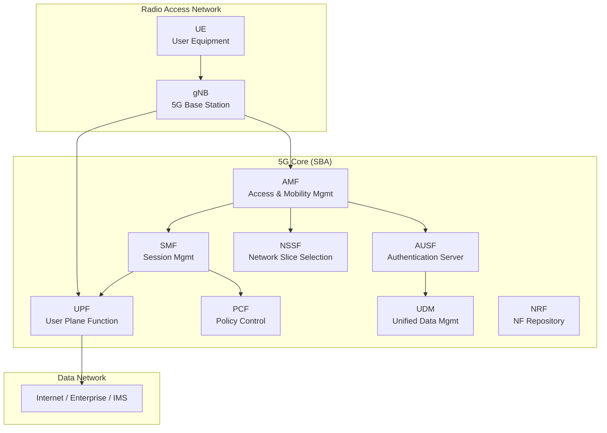
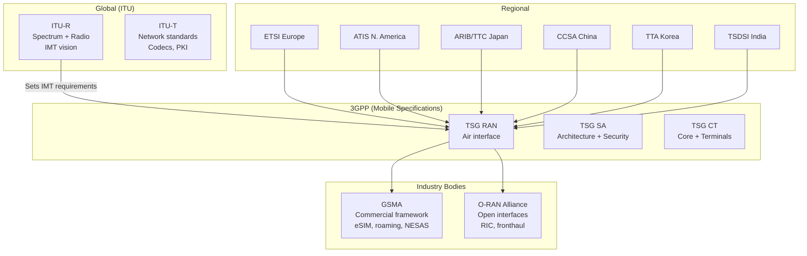
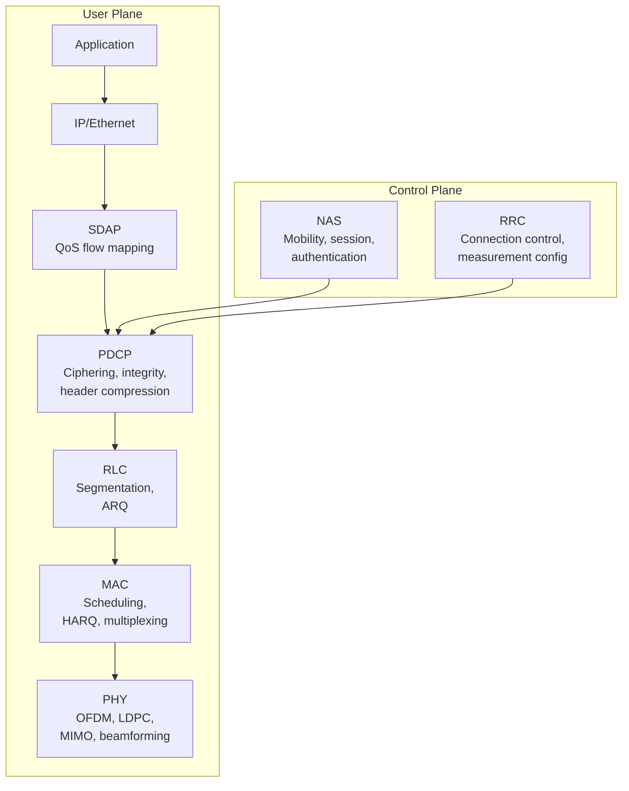

# Telecommunications Standards Landscape

**Topic:** Global Telecommunications Standards — Ecosystem Overview, SDOs, and Connectivity Frameworks  
**Standards:** 3GPP, ITU-R/ITU-T, ETSI, GSMA, O-RAN Alliance, IEEE 802.11  
**SDO:** 3GPP, ITU (International Telecommunication Union), ETSI, GSMA, O-RAN Alliance  
**Audience:** Telecom engineers, mobile network architects, connectivity product managers, RF engineers  
**Prerequisites:** Basic wireless communications, OSI model, radio frequency concepts

---

## Chapter 1 — Historical Context & Origin Story

### 1.1 Mobile Generations Timeline

| Generation | Era | Key Technology | Peak Data Rate | Standard Body |
|-----------|-----|---------------|---------------|---------------|
| 1G | 1979-1991 | AMPS, NMT (analog FM) | 2.4 kbps | National standards |
| 2G | 1991-2003 | GSM, CDMA (digital) | 384 kbps (EDGE) | ETSI → 3GPP |
| 3G | 2001-2012 | WCDMA/UMTS, CDMA2000 | 42 Mbps (HSPA+) | 3GPP / 3GPP2 |
| 4G | 2009-2020 | LTE, LTE-Advanced (OFDMA) | 1 Gbps (Cat-16) | 3GPP |
| 5G | 2019-present | NR (OFDM, massive MIMO, mmWave) | 20 Gbps (theoretical) | 3GPP |
| 6G | ~2030 | THz, AI-native, sensing | 1 Tbps (target) | ITU IMT-2030 |

### 1.2 Key Standards Development Organizations

| SDO | Scope | Output | Membership |
|-----|-------|--------|-----------|
| 3GPP | Mobile network specifications | Technical Specifications (TS) | Organizational partners: ETSI, ATIS, ARIB, TTA, CCSA, TSDSI, TTC |
| ITU-R | Radio spectrum management | Recommendations (M-series) | 193 UN member states |
| ITU-T | Telecom network standards | Recommendations (G/H/X/Y-series) | 193 UN member states |
| ETSI | European telecom standards | EN/TS/TR documents | Industry + government |
| GSMA | Mobile operator association | PRD/NG specifications | 750+ operators |
| O-RAN Alliance | Open RAN architecture | O-RAN specifications | Operators + vendors |
| IEEE | LAN/WLAN standards | 802.x family | Individual membership |

---

## Chapter 2 — Standard Architecture & Structure

### 2.1 3GPP Specification Architecture



### 2.2 Specification Numbering

| Series | Topic | Example |
|--------|-------|---------|
| 21.xxx | Requirements | TS 21.905 (vocabulary) |
| 22.xxx | Service requirements | TS 22.261 (5G requirements) |
| 23.xxx | Architecture | TS 23.501 (5G system architecture) |
| 24.xxx | Signaling protocols (terminal) | TS 24.501 (NAS for 5GS) |
| 25.xxx | UTRAN (3G radio) | Legacy |
| 26.xxx | Codecs | TS 26.441 (EVS codec) |
| 29.xxx | Core network protocols | TS 29.500 (HTTP/2 in 5GC) |
| 33.xxx | Security | TS 33.501 (5G security) |
| 36.xxx | E-UTRAN (LTE radio) | TS 36.211 (LTE PHY) |
| 37.xxx | Multi-RAT aspects | TS 37.340 (NR-DC) |
| 38.xxx | NR (5G radio) | TS 38.211 (NR PHY) |

---

## Chapter 3 — Technical Deep Dive

### 3.1 Evolution of Air Interface Technology

| Parameter | 2G (GSM) | 3G (UMTS) | 4G (LTE) | 5G (NR) |
|-----------|----------|-----------|----------|---------|
| Multiple access | TDMA/FDMA | WCDMA | OFDMA | OFDM + flexible numerology |
| Bandwidth | 200 kHz | 5 MHz | Up to 20 MHz | Up to 400 MHz (FR2) |
| Modulation | GMSK | QPSK, 16QAM | Up to 256QAM | Up to 1024QAM |
| Duplex | FDD | FDD/TDD | FDD/TDD | FDD/TDD/SUL |
| Latency (user plane) | ~300ms | ~100ms | ~10ms | ~1ms (URLLC) |
| MIMO | N/A | N/A | Up to 8×8 | Massive MIMO (64T64R+) |
| Frequency bands | 900/1800 MHz | 2100 MHz typical | 700-2600 MHz | Sub-6 GHz + mmWave (24-52 GHz) |

### 3.2 Network Architecture Evolution



### 3.3 Key 5G Use Cases (ITU IMT-2020 Triangle)

| Use Case | Requirement | Example Application |
|----------|-------------|-------------------|
| eMBB (enhanced Mobile Broadband) | 20 Gbps peak, 100 Mbps everywhere | 4K/8K streaming, AR/VR |
| URLLC (Ultra-Reliable Low-Latency) | 1ms latency, 99.999% reliability | Remote surgery, industrial automation |
| mMTC (massive Machine-Type Communication) | 1M devices/km² | Smart city sensors, agriculture IoT |

---

## Chapter 4 — Implementation Guide

### 4.1 Mobile Network Deployment Stack

| Layer | Components | Standards |
|-------|-----------|-----------|
| Application | IMS, VoLTE/VoNR, APIs | 3GPP TS 23.228, GSMA IR.92 |
| Core network | AMF, SMF, UPF, NRF, PCF | 3GPP TS 23.501 |
| Transport | IP/MPLS backhaul, fronthaul (eCPRI) | IETF + O-RAN WG4 |
| RAN | gNB (CU/DU/RU split) | 3GPP TS 38.401 |
| PHY | OFDM, LDPC, polar codes, MIMO | 3GPP TS 38.211/212/213 |
| Spectrum | Licensed (FR1/FR2), unlicensed (NR-U) | ITU-R, national regulators |
| Device | UE modem, SIM/eSIM | 3GPP TS 38.101, GSMA SGP.22 |

### 4.2 Operator Network Architecture (5G SA)



---

## Chapter 5 — Certification & Audit

### 5.1 Telecom Equipment Certification

| Certification | Body | Scope |
|--------------|------|-------|
| GCF (Global Certification Forum) | GCF | UE conformance testing (global) |
| PTCRB | PTCRB (US operators) | UE certification for North America |
| GSMA NESAS | GSMA | Network equipment security assurance |
| CE marking (RED) | EU notified bodies | Radio Equipment Directive compliance |
| FCC certification | FCC (US) | RF emission and SAR compliance |
| TELEC | Japan MIC | Radio equipment approval |

### 5.2 Network Equipment Testing

| Test Type | Standard | Purpose |
|-----------|----------|---------|
| Protocol conformance | 3GPP TS 36.523 / 38.523 | Verify correct protocol behavior |
| RF conformance | 3GPP TS 38.101/104 | Verify RF performance |
| Interoperability (IOT) | Operator-specific | Multi-vendor compatibility |
| Security testing (SCAS) | 3GPP TS 33.511-33.536 | Security assurance for 5G NFs |
| NESAS audit | GSMA | Vendor development process security |

---

## Chapter 6 — Regional & Domain Variants

| Region | Primary Bands (5G) | Deployment Model | Regulator |
|--------|-------------------|-----------------|-----------|
| USA | n77 (3.7 GHz), n261 (28 GHz) | SA/NSA, C-band + mmWave | FCC |
| EU | n78 (3.5 GHz), n258 (26 GHz) | TDD mid-band primary | National regulators + CEPT |
| China | n78 (3.5 GHz), n79 (4.9 GHz), n41 (2.6 GHz) | SA deployment, massive scale | MIIT |
| Japan | n77/n78 (3.7/4.5 GHz), n257 (28 GHz) | Sub-6 + mmWave | MIC |
| South Korea | n78 (3.5 GHz), n257 (28 GHz) | First commercial 5G (April 2019) | MSIT |
| India | n78 (3.3 GHz), n258 (26 GHz) | Recent 5G auction (2022) | DoT/TRAI |

---

## Chapter 7 — Comparison: Connectivity Technologies

| Feature | 5G NR | Wi-Fi 7 (802.11be) | DSRC (802.11p) | Satellite (LEO) | LPWAN (NB-IoT) |
|---------|-------|--------------------|----|-------|-------|
| Spectrum | Licensed | Unlicensed (5/6 GHz) | 5.9 GHz | L/S/Ka-band | Licensed (in-band/guard) |
| Range | 1-10 km | 10-100m | 300m | Global | 10-15 km |
| Latency | 1-10ms | 2-5ms | ~2ms | 20-50ms | 1-10s |
| Mobility | High (500+ km/h) | Low | High (V2X) | High | Low |
| Cost | $$$ (operator) | $ (self-deploy) | $$$ (infrastructure) | $$ (subscription) | $ (per device) |
| Power | Medium-high | Medium | Medium | High (terminal) | Very low |
| Best for | Mobile broadband, URLLC | Indoor high-throughput | V2V safety | Remote/maritime | Sensors, meters |

---

## Chapter 8 — Mermaid Architecture Diagrams

### 8.1 Telecom Standards Ecosystem



### 8.2 Protocol Stack (5G NR)



---

## Chapter 9 — Case Studies & Failure Analysis

### 9.1 Case Study: South Korea 5G Launch (April 2019)

**Significance:** First commercial 5G network (SK Telecom, KT, LG U+). Initially NSA (Non-Standalone) architecture on n78 (3.5 GHz).

**Challenges:** (1) Initial coverage limited to urban areas. (2) NSA mode falls back to LTE for control plane. (3) mmWave (28 GHz) outdoor-only, limited penetration. (4) Device ecosystem initially limited (Samsung Galaxy S10 5G).

**Outcome:** By 2024: >30M 5G subscribers (60% of mobile users). Transition to SA architecture underway. Demonstrated viability of commercial 5G at scale.

### 9.2 3GPP Standards Failure: Circuit-Switched Fallback Complexity

**Problem:** When VoLTE was not available and IMS was not deployed, 3G/4G networks used CSFB (Circuit-Switched Fallback) — dropping from LTE to 3G/2G for voice calls.

**Impact:** 2-4 second call setup delay (network switching). Complex multi-RAT coordination. User experience degradation. Extended need for 2G/3G network operation.

**Resolution:** VoLTE deployment (GSMA IR.92) eliminated CSFB need. IMS-based voice became standard. Enabled 2G/3G shutdown programs.

---

## Chapter 10 — Future Evolution & Industry Trends

| Trend | Timeline | Impact |
|-------|----------|--------|
| 5G Advanced (Rel-18/19) | 2024-2026 | AI/ML in network, ambient IoT, improved positioning |
| 6G (IMT-2030) | 2028-2030 | THz bands, sensing + communication, AI-native |
| Open RAN maturation | 2024-2027 | Multi-vendor, cloud-native, programmable RAN |
| Non-Terrestrial Networks (NTN) | 2024+ | Satellite-cellular integration (3GPP NTN) |
| Network slicing commercialization | 2024+ | Per-use-case isolated virtual networks |
| Private 5G networks | Now | Enterprise/factory/campus deployments |
| AI-native air interface | 2027+ | ML-designed waveforms, learned codebooks |
| Integrated sensing and communication (ISAC) | 6G era | Radar + communication in one system |

---

## Chapter 11 — Interview Questions & Career Guide

### Tier 1: Entry-Level (0-3 years)

**Q1:** What is 3GPP and how are its specifications organized?  
**A:** 3GPP (3rd Generation Partnership Project) is a collaboration of 7 regional telecommunications standards bodies (ETSI, ATIS, ARIB, TTA, CCSA, TSDSI, TTC) that develops technical specifications for mobile telecommunications. **Organization:** 3GPP has 3 Technical Specification Groups: (1) **TSG RAN:** Radio Access Network (physical layer, protocols, architecture, RF, conformance testing). (2) **TSG SA:** Service and Systems Aspects (requirements, architecture, security, codecs, management). (3) **TSG CT:** Core Network and Terminals (signaling protocols, SIM/USIM, core network). Specifications are numbered by series (e.g., 38.xxx = 5G NR, 33.xxx = security). **Releases:** Specifications evolve through releases (Rel-15 = 5G Phase 1, Rel-16 = 5G Phase 2, etc.). Each release adds features while maintaining backward compatibility.

### Tier 2: Mid-Level (3-8 years)

**Q2:** Explain the difference between 5G NSA (Non-Standalone) and SA (Standalone) architectures. What are the implications for network capability?  
**A:** **NSA (Option 3x):** 5G NR radio anchored to existing LTE core (EPC). The LTE eNB acts as master node; 5G gNB is secondary. Control plane goes through LTE; user plane can use both. **Implication:** Faster deployment (reuse existing core), but: no network slicing, no URLLC, limited 5G features (falls back to LTE for mobility). **SA:** 5G NR radio connected directly to 5G Core (5GC). No LTE dependency for control plane. Full service-based architecture (SBA). **Implication:** Full 5G capabilities: network slicing, URLLC (<1ms), mMTC, edge computing (MEC), standalone security (5G AKA, SUPI/SUCI privacy). **Migration path:** Most operators deployed NSA first (2019-2022) and are migrating to SA (2022-2025) as 5GC matures.

---

## Chapter 12 — Cheat Sheet & Quick Reference

### Telecom Standards Quick Reference

```
3GPP:   Mobile specifications (RAN + Core + Services)
ITU-R:  Radio spectrum, IMT vision (2G/3G/4G/5G/6G requirements)
ITU-T:  Network standards (codecs, PKI, transport)
ETSI:   European standards (3GPP organizational partner)
GSMA:   Operator commercial frameworks (eSIM, roaming, NESAS)
O-RAN:  Open RAN architecture (disaggregated, multi-vendor)
IEEE:   Wi-Fi (802.11), Ethernet (802.3)
```

### 5G Key Specifications

```
TS 38.211:  NR Physical channels and modulation
TS 38.300:  NR Overall description
TS 23.501:  5G System Architecture
TS 33.501:  5G Security Architecture
TS 23.502:  Procedures for 5G System
TS 29.500:  5GC HTTP/2-based SBI
GSMA SGP.22: eSIM Consumer Remote SIM Provisioning
```

---

*End of Document — 00_Telecom_Standards_Landscape.md*
