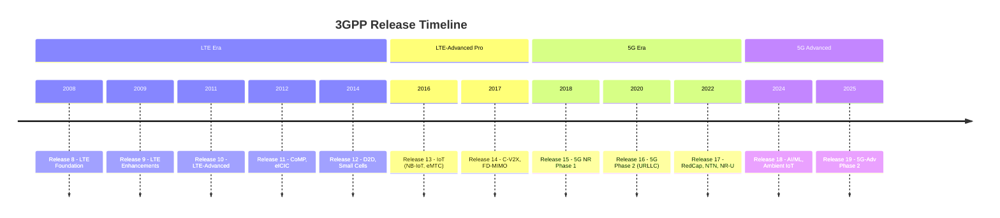
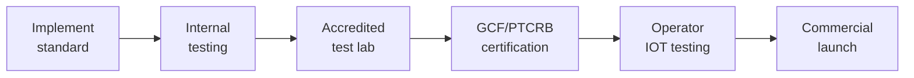
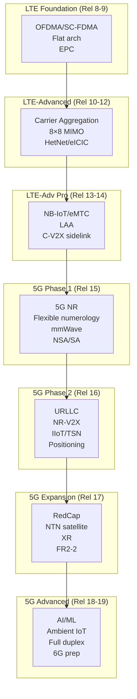
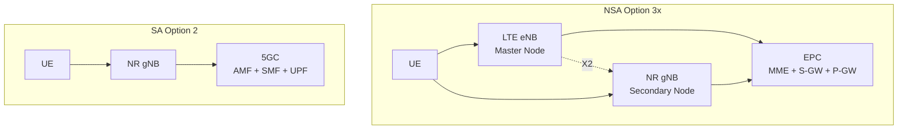

# 3GPP Release History — LTE to 5G

**Topic:** 3GPP Release Evolution from Release 8 (LTE) through Release 19 (5G Advanced)  
**Standards:** 3GPP TS 36.xxx (LTE), TS 38.xxx (NR), TS 23.xxx (Architecture)  
**SDO:** 3GPP (3rd Generation Partnership Project)  
**Audience:** Telecom engineers, mobile protocol developers, network architects, RF engineers  
**Prerequisites:** Basic wireless communications, OFDM fundamentals, cellular network architecture

---

## Chapter 1 — Historical Context & Origin Story

### 1.1 Pre-3GPP Era

| Year | Milestone | Technology |
|------|-----------|-----------|
| 1979 | NTT launches 1G (Japan) | Analog FM (AMPS/NMT) |
| 1987 | GSM standard agreed (Europe) | Digital TDMA |
| 1991 | First GSM call (Radiolinja, Finland) | 2G digital voice |
| 1995 | cdmaOne (IS-95) deployed (US) | CDMA-based 2G |
| 1998 | 3GPP founded | Unify GSM/UMTS standards |
| 1999 | 3GPP Release 99 | WCDMA (3G) specification |
| 2001 | First UMTS network (Japan, NTT DoCoMo) | 384 kbps data |

### 1.2 3GPP Formation

3GPP was established in December 1998 to develop globally applicable specifications for 3rd-generation (3G) mobile systems. The organizational partners:

| Partner | Region | Role |
|---------|--------|------|
| ETSI | Europe | European telecom standards |
| ATIS (now merged into TIA) | North America | US telecom standards |
| ARIB | Japan | Japanese radio industry |
| TTC | Japan | Japanese telecom technology |
| TTA | South Korea | Korean telecom standards |
| CCSA | China | Chinese communications standards |
| TSDSI | India | Indian telecom standards (joined 2014) |

---

## Chapter 2 — Standard Architecture & Structure

### 2.1 Release-Based Evolution



### 2.2 Specification Series Mapping

| Series | Domain | Key Specs |
|--------|--------|-----------|
| 36.2xx | LTE PHY | 36.211 (PHY channels), 36.212 (coding), 36.213 (PHY procedures) |
| 36.3xx | LTE L2/L3 | 36.300 (E-UTRAN description), 36.321 (MAC), 36.322 (RLC), 36.323 (PDCP), 36.331 (RRC) |
| 36.4xx | LTE Interfaces | 36.401 (architecture), 36.410 (S1), 36.420 (X2) |
| 38.2xx | NR PHY | 38.211 (PHY channels), 38.212 (coding), 38.213/214 (PHY procedures) |
| 38.3xx | NR L2/L3 | 38.300 (NR description), 38.321 (MAC), 38.322 (RLC), 38.323 (PDCP), 38.331 (RRC) |
| 38.4xx | NR Interfaces | 38.401 (NG-RAN arch), 38.410 (NG), 38.420 (Xn), 38.470 (F1) |

---

## Chapter 3 — Technical Deep Dive

### 3.1 Release 8: LTE Foundation (2008)

| Feature | Specification | Detail |
|---------|--------------|--------|
| OFDMA downlink | TS 36.211 | 15 kHz subcarrier spacing, 1-20 MHz BW |
| SC-FDMA uplink | TS 36.211 | DFT-precoded OFDM (lower PAPR) |
| Turbo codes | TS 36.212 | Max coding rate 0.93 |
| MIMO | TS 36.211 | Up to 4×4 spatial multiplexing |
| Flat architecture | TS 36.300 | eNB connects directly to EPC (no RNC) |
| EPC (SAE) | TS 23.401 | MME + S-GW + P-GW (all-IP core) |

**Key Innovation:** Eliminated the RNC (Radio Network Controller) from 3G architecture. eNodeB handles all radio resource management, reducing latency by removing a network hop.

### 3.2 Release 10: LTE-Advanced (2011) — True 4G

| Feature | Detail | Benefit |
|---------|--------|---------|
| Carrier Aggregation (CA) | Up to 5×20 MHz = 100 MHz | Peak 3 Gbps DL |
| Enhanced MIMO | 8×8 DL, 4×4 UL | Higher spectral efficiency |
| eICIC | Enhanced Inter-Cell Interference Coordination | HetNet support |
| Relay nodes | Type 1/1a/2 relays | Coverage extension |

### 3.3 Release 13: LTE-Advanced Pro — IoT Revolution (2016)

| Technology | Target | Design Choices |
|-----------|--------|---------------|
| NB-IoT | LPWAN sensors | 180 kHz BW, 20 dB MCL gain, 10-year battery |
| eMTC (Cat-M1) | Medium-rate IoT | 1.4 MHz BW, VoLTE support, mobility |
| EC-GSM-IoT | GSM band IoT | Reuse 2G spectrum, extended coverage |
| LAA (License-Assisted Access) | LTE in unlicensed (5 GHz) | LBT (Listen-Before-Talk) coexistence |

### 3.4 Release 15: 5G NR Phase 1 (2018)

```mermaid
graph TB
    subgraph "5G NR Key Technologies"
        A[Flexible Numerology<br/>15/30/60/120/240 kHz SCS]
        B[Massive MIMO<br/>64T64R, 128T128R]
        C[mmWave Support<br/>24.25-52.6 GHz (FR2)]
        D[LDPC Codes<br/>Data channels]
        E[Polar Codes<br/>Control channels]
        F[BWP<br/>Bandwidth Parts]
        G[Mini-Slots<br/>2/4/7 symbols]
    end
    
    subgraph "Deployment Options"
        H[Option 3/3a/3x<br/>NSA: LTE anchor + NR]
        I[Option 2<br/>SA: NR + 5GC]
    end
```

| Parameter | 5G NR vs LTE |
|-----------|-------------|
| Subcarrier spacing | 15/30/60/120/240 kHz (vs fixed 15 kHz) |
| Max bandwidth | 100 MHz (FR1), 400 MHz (FR2) vs 20 MHz |
| Frequency range | 410 MHz - 52.6 GHz (vs 450 MHz - 3.8 GHz) |
| Channel coding | LDPC (data) + Polar (control) vs Turbo codes |
| Slot duration | Flexible (0.0625 - 1 ms) vs fixed 1ms |
| MIMO layers | Up to 16 (DL) / 4 (UL) vs 8/4 |

### 3.5 Release 16: 5G Phase 2 — URLLC & Industry (2020)

| Feature | Standard | Application |
|---------|----------|------------|
| URLLC enhancements | TS 38.300 | 0.5ms latency, 99.9999% reliability |
| NR V2X (sidelink) | TS 38.885 | Autonomous driving (Mode 2) |
| NR positioning | TS 38.305 | Sub-meter indoor positioning |
| Industrial IoT (IIoT) | TS 22.104 | TSN integration, deterministic networking |
| NR-U (unlicensed) Phase 1 | TS 38.889 | NR in 5/6 GHz bands |
| Integrated Access Backhaul (IAB) | TS 38.174 | Wireless self-backhauling |

### 3.6 Release 17: Expansion & IoT (2022)

| Feature | Target | Key Change |
|---------|--------|-----------|
| RedCap (Reduced Capability) | IoT/wearables | Reduced BW (20 MHz FR1), 1-2 Rx, lower cost |
| NTN (Non-Terrestrial Networks) | Satellite 5G | GEO/LEO/HAPS support, timing advance >300ms |
| NR sidelink relay | D2D coverage extension | UE-to-network relay |
| Multi-SIM | DSDS/DSDA devices | Standardized paging coordination |
| Extended Reality (XR) | AR/VR/MR | QoS optimization for XR traffic |
| 52.6-71 GHz (FR2-2) | Spectrum expansion | New mmWave bands |

### 3.7 Release 18: 5G Advanced (2024)

| Feature | Description |
|---------|------------|
| AI/ML for NR | CSI feedback, beam management, positioning with ML |
| Ambient IoT | Zero-energy devices (backscatter + energy harvesting) |
| Sidelink relay enhancements | L2 relay, SL-U (unlicensed sidelink) |
| Network energy savings | gNB sleep, carrier shutdown |
| Duplex evolution | Subband full-duplex |
| XR enhancements | Capacity/power improvements for AR/VR |

---

## Chapter 4 — Implementation Guide

### 4.1 LTE Protocol Stack Implementation

```mermaid
graph TB
    subgraph "eNodeB Protocol Stack"
        A[S1-AP / X2-AP<br/>Interface protocols]
        B[RRC<br/>Connection management]
        C[PDCP<br/>Ciphering, header compression]
        D[RLC<br/>Segmentation, ARQ (AM/UM/TM)]
        E[MAC<br/>Scheduling, HARQ, RA]
        F[PHY<br/>OFDM, turbo coding, MIMO]
    end
    
    A --> B --> C --> D --> E --> F
```

### 4.2 Key Implementation Decisions by Release

| Release | Implementation Challenge | Solution |
|---------|------------------------|----------|
| Rel-8 | Flat architecture (no RNC) | eNB handles all RRM — requires powerful baseband |
| Rel-10 | Carrier aggregation scheduling | Cross-carrier scheduling, component carrier management |
| Rel-13 | IoT coverage extension | 20 dB MCL gain via repetitions (128× for NB-IoT) |
| Rel-15 | Flexible numerology | BWP adaptation, dynamic SCS switching |
| Rel-16 | URLLC scheduling | Mini-slot preemption, configured grant |
| Rel-17 | NTN timing advance | Large TA compensation (satellite link), GNSS-based |
| Rel-18 | AI/ML in air interface | Training data collection, inference at gNB or UE |

---

## Chapter 5 — Certification & Audit

### 5.1 3GPP Conformance Testing

| Test Category | Specification | Purpose |
|---------------|--------------|---------|
| Protocol conformance (UE) | TS 36.523 (LTE) / TS 38.523 (NR) | Verify signaling behavior |
| RF conformance (UE) | TS 36.521 (LTE) / TS 38.521 (NR) | Verify RF performance (Tx power, sensitivity, etc.) |
| RRM conformance | TS 36.133 (LTE) / TS 38.133 (NR) | Verify radio resource management |
| Demodulation (UE) | TS 36.101 (LTE) / TS 38.101 (NR) | Verify receiver throughput |
| Base station conformance | TS 36.104/141 (LTE) / TS 38.104/141 (NR) | Verify gNB RF |

### 5.2 Certification Process



---

## Chapter 6 — Regional & Domain Variants

### 6.1 3GPP Band Deployment by Region

| Band (NR) | Frequency | Region | Typical Use |
|-----------|-----------|--------|------------|
| n1 | 2100 MHz | Global | FDD coverage (refarmed 3G) |
| n3 | 1800 MHz | Global | FDD capacity |
| n28 | 700 MHz | EU, APAC | FDD coverage |
| n41 | 2.6 GHz | China, US (T-Mobile) | TDD capacity |
| n77 | 3.3-4.2 GHz | US (C-band), APAC | TDD primary 5G |
| n78 | 3.3-3.8 GHz | EU, Korea, Japan, India | TDD primary 5G |
| n79 | 4.4-5.0 GHz | Japan, China | TDD capacity |
| n257 | 28 GHz | US, Japan, Korea | mmWave hotspots |
| n258 | 26 GHz | EU, Japan | mmWave |
| n261 | 28 GHz | US | mmWave |

---

## Chapter 7 — Comparison: LTE vs 5G NR

| Aspect | LTE (Release 8-14) | 5G NR (Release 15+) |
|--------|-------------------|---------------------|
| Max bandwidth | 20 MHz (100 MHz CA) | 400 MHz (single carrier) |
| Subcarrier spacing | Fixed 15 kHz | Flexible: 15/30/60/120/240 kHz |
| Frame structure | Fixed 10ms frame, 1ms subframe | Flexible slot (0.0625 - 1 ms) |
| Channel coding (data) | Turbo codes | LDPC |
| Channel coding (control) | Tail-biting convolutional | Polar codes |
| Frequency range | Sub-6 GHz (up to 3.8 GHz) | Sub-6 GHz + mmWave (to 71 GHz) |
| MIMO | Up to 8 layers | Up to 16 layers, massive MIMO |
| Beamforming | Limited (TM7-10) | Native beam management (SSB beams) |
| Duplex | FDD/TDD (separate specs) | Unified FDD/TDD/SUL framework |
| Core network | EPC (GTP-based) | 5GC (SBA, HTTP/2-based) |
| Network slicing | Not native | Native (NSSF, S-NSSAI) |
| Latency (user plane) | ~10ms | ~1ms (URLLC) |
| Use cases | Mobile broadband | eMBB + URLLC + mMTC |

---

## Chapter 8 — Mermaid Architecture Diagrams

### 8.1 3GPP Release Feature Map



### 8.2 NSA vs SA Architecture



---

## Chapter 9 — Case Studies & Failure Analysis

### 9.1 LTE Category Explosion

**Problem:** Between Rel-8 and Rel-14, 3GPP defined 21 UE categories (Cat-0 through Cat-20), creating confusion in the market and modem development.

| Category | DL Speed | UL Speed | Use Case |
|----------|----------|----------|----------|
| Cat-0 | 1 Mbps | 1 Mbps | Low-cost IoT sensors |
| Cat-1 | 10 Mbps | 5 Mbps | Basic IoT (utility meters) |
| Cat-4 | 150 Mbps | 50 Mbps | Mainstream smartphones (2012) |
| Cat-6 | 300 Mbps | 50 Mbps | Carrier aggregation (2CA) |
| Cat-16 | 1 Gbps | 150 Mbps | Flagship devices (5CA) |
| Cat-M1 | 1 Mbps | 1 Mbps | eMTC (IoT with mobility) |
| Cat-NB1 | 0.026 Mbps | 0.066 Mbps | NB-IoT (ultra-low power) |

**Lesson:** Simplified in 5G NR — no UE categories. Capabilities reported via UE capability information (dynamic signaling).

### 9.2 Rel-15 NSA-First Strategy

**Decision:** 3GPP accelerated Rel-15 to publish NSA (Option 3x) 6 months before SA (Option 2) to enable early 5G launches on existing EPC.

**Trade-off:** Faster time-to-market but deferred key 5G capabilities (slicing, URLLC, edge computing) until SA deployment. Many operators deployed NSA in 2019-2020 and only migrated to SA in 2022-2024.

---

## Chapter 10 — Future Evolution & Industry Trends

| Release | Expected | Key Features |
|---------|----------|-------------|
| Rel-19 | 2025 | Enhanced AI/ML, advanced duplex, ambient IoT Phase 2 |
| Rel-20 | 2027 | 6G study items begin, sub-THz channel models |
| Rel-21 | 2029 | First 6G specifications (projected) |
| IMT-2030 | 2030 | 6G commercial deployment target |

### 6G Vision (ITU-R M.2160)

| Metric | 5G (IMT-2020) | 6G (IMT-2030) Target |
|--------|---------------|---------------------|
| Peak data rate | 20 Gbps | 1 Tbps |
| User experienced rate | 100 Mbps | 10 Gbps |
| Latency | 1 ms | 0.1 ms |
| Connection density | 10⁶/km² | 10⁷/km² |
| Reliability | 99.999% | 99.99999% |
| Spectrum efficiency | 30 bps/Hz | 60+ bps/Hz |
| Frequency | Sub-6 + mmWave | Sub-THz (100-300 GHz) |

---

## Chapter 11 — Interview Questions & Career Guide

### Tier 1: Entry-Level (0-3 years)

**Q1:** What are the three 5G use case categories defined by ITU?  
**A:** **eMBB** (enhanced Mobile Broadband): High throughput (20 Gbps peak), for video streaming, AR/VR. **URLLC** (Ultra-Reliable Low-Latency Communication): <1ms latency with 99.999% reliability, for industrial automation, remote surgery. **mMTC** (massive Machine-Type Communication): 1M devices/km², for IoT sensors, smart cities.

### Tier 2: Mid-Level (3-8 years)

**Q2:** Explain how 5G NR flexible numerology works and why it's important.  
**A:** NR supports multiple subcarrier spacings (SCS): 15, 30, 60, 120, 240 kHz (μ=0,1,2,3,4). Slot duration scales inversely: $T_{slot} = 1/(2^μ)$ ms. **Why:** Different SCS optimizes for different scenarios: (1) 15 kHz (μ=0): Wide-area coverage, tolerates large delay spread. (2) 30 kHz (μ=1): Balance for sub-6 GHz urban. (3) 120 kHz (μ=3): mmWave, short slots enable low latency. **Implementation:** UE uses Bandwidth Parts (BWPs) to switch between numerologies dynamically without reconfiguration.

### Tier 3: Senior (8-15 years)

**Q3:** Compare 5G NR LDPC vs LTE Turbo codes for data channels. Why did 3GPP switch?  
**A:** **Turbo codes (LTE):** Near-Shannon performance at moderate rates but: (1) Serial decoding → latency increases with block length. (2) Error floor at high SNR (problematic for 256QAM+). (3) Throughput limited at >1 Gbps. **LDPC (NR):** (1) Parallel decoding → O(1) latency regardless of block size. (2) Better performance at high code rates (0.8+). (3) Hardware-friendly for multi-Gbps throughput. (4) No error floor. **Design:** NR uses two base graphs: BG1 (large blocks, rates ≤0.89) for data, BG2 (small blocks, rates ≤0.67) for short messages. **Trade-off:** Polar codes used for control channels (better at short block lengths).

---

## Chapter 12 — Cheat Sheet & Quick Reference

### 3GPP Release Summary

```
Rel-8  (2008): LTE foundation (OFDMA, flat arch, EPC)
Rel-10 (2011): LTE-Advanced (CA, 8×8 MIMO) — "true 4G"
Rel-13 (2016): IoT (NB-IoT, eMTC), LAA (unlicensed)
Rel-14 (2017): C-V2X sidelink, FD-MIMO
Rel-15 (2018): 5G NR Phase 1 (NSA+SA, eMBB, mmWave)
Rel-16 (2020): 5G Phase 2 (URLLC, V2X NR, IIoT)
Rel-17 (2022): RedCap, NTN (satellite), XR
Rel-18 (2024): 5G Advanced (AI/ML, ambient IoT)
Rel-19 (2025): 5G-Adv Phase 2, 6G prep
```

### Key Formulas

- **NR Slot Duration:** $T_{slot} = \frac{1}{2^\mu}$ ms, where $\mu$ = numerology (0-4)
- **Symbols per slot:** 14 (normal CP) or 12 (extended CP)
- **Resource Block:** 12 subcarriers × 1 slot
- **Throughput (approximate):** $R = N_{layers} \times Q_m \times f \times R_{code} \times \frac{N_{RB} \times 12 \times N_{symb}}{T_{slot}}$

---

*End of Document — 01_3GPP_Release_History_LTE_to_5G.md*
